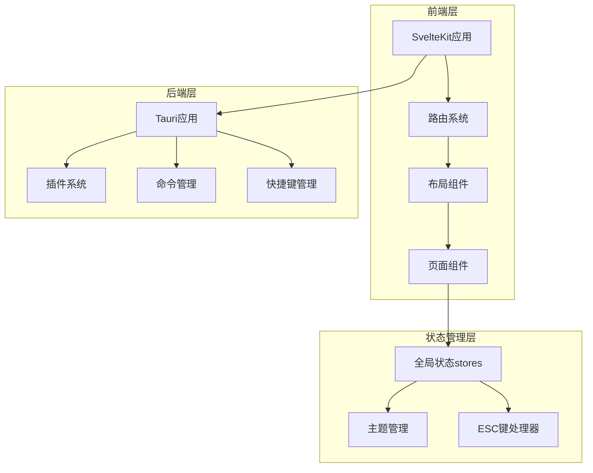
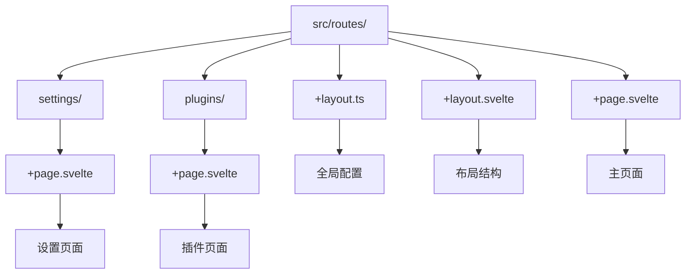
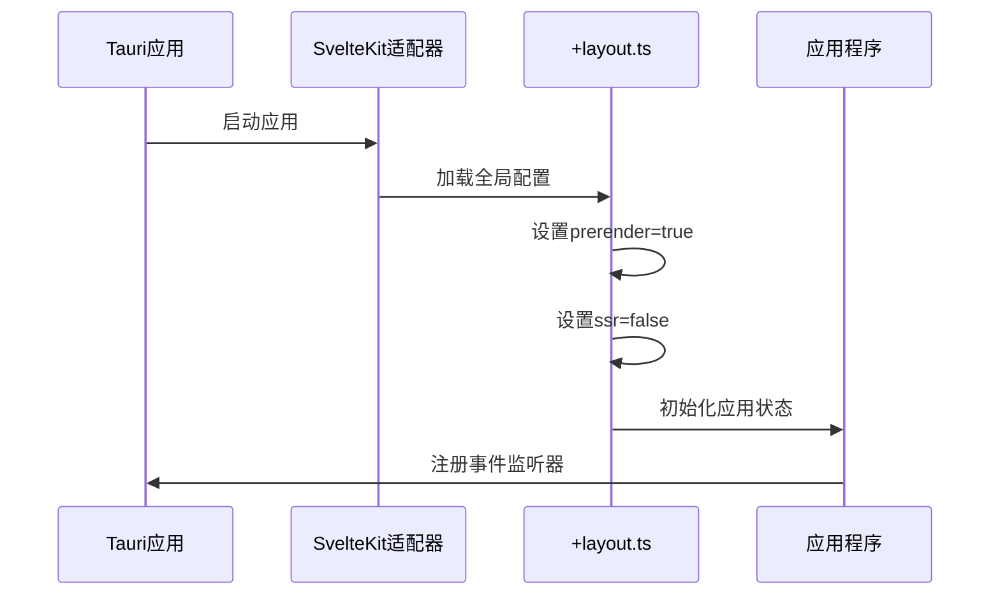
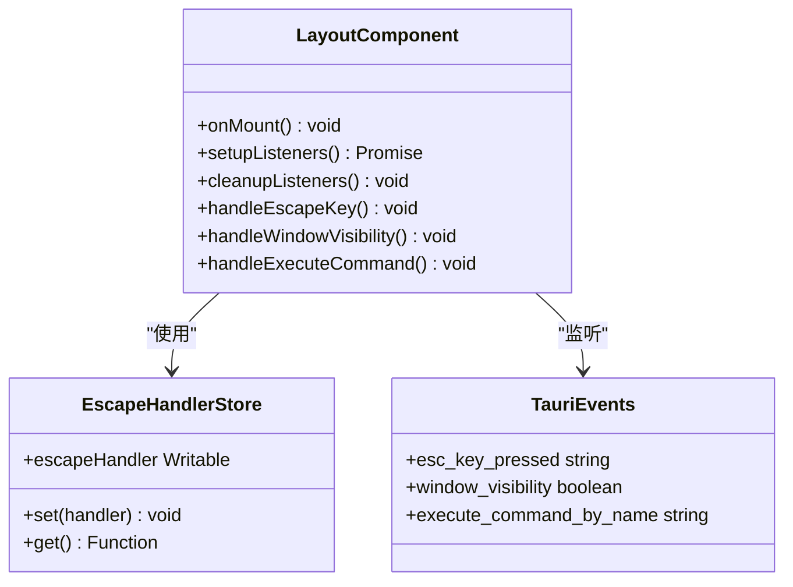
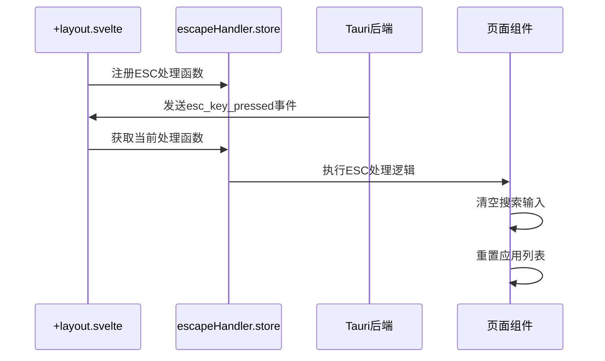
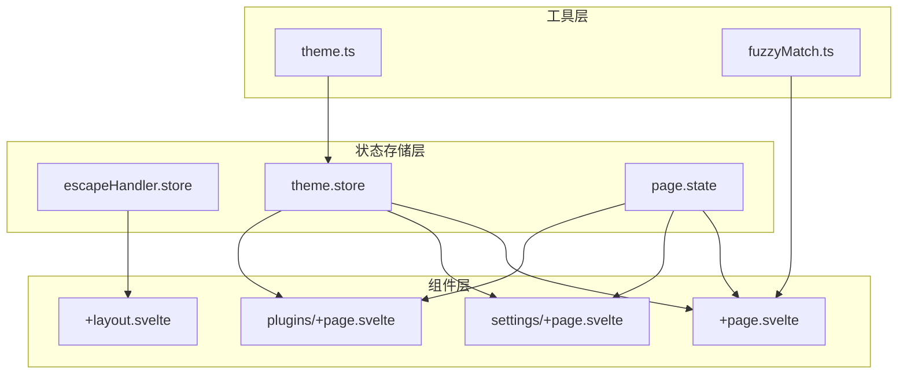
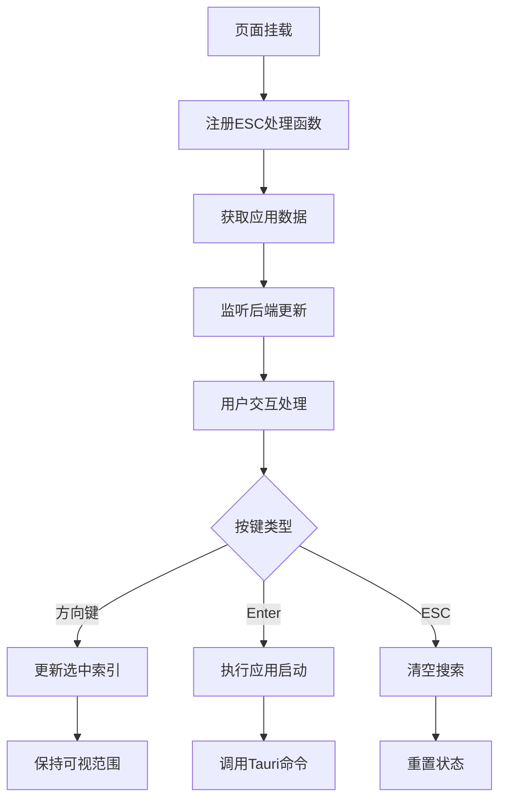
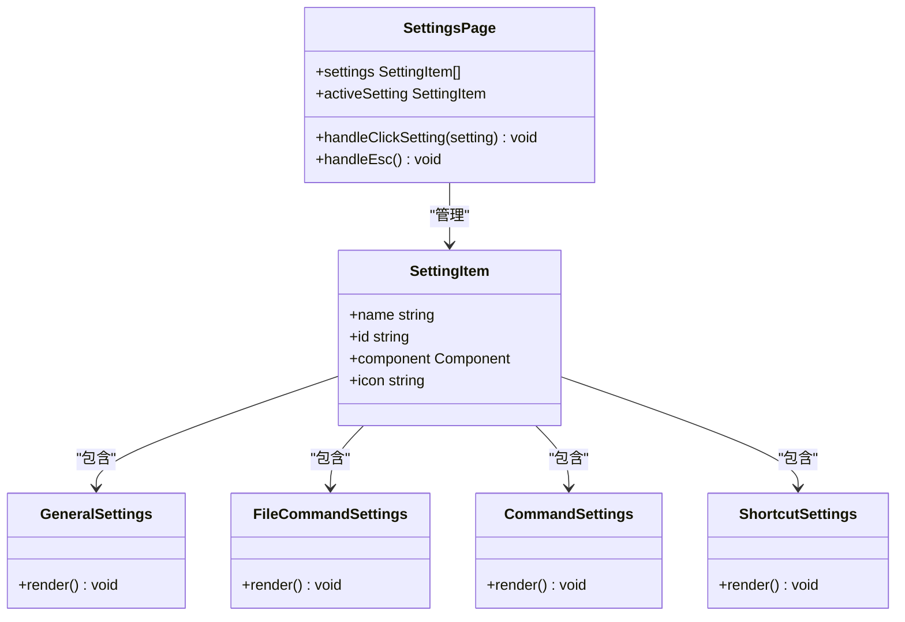
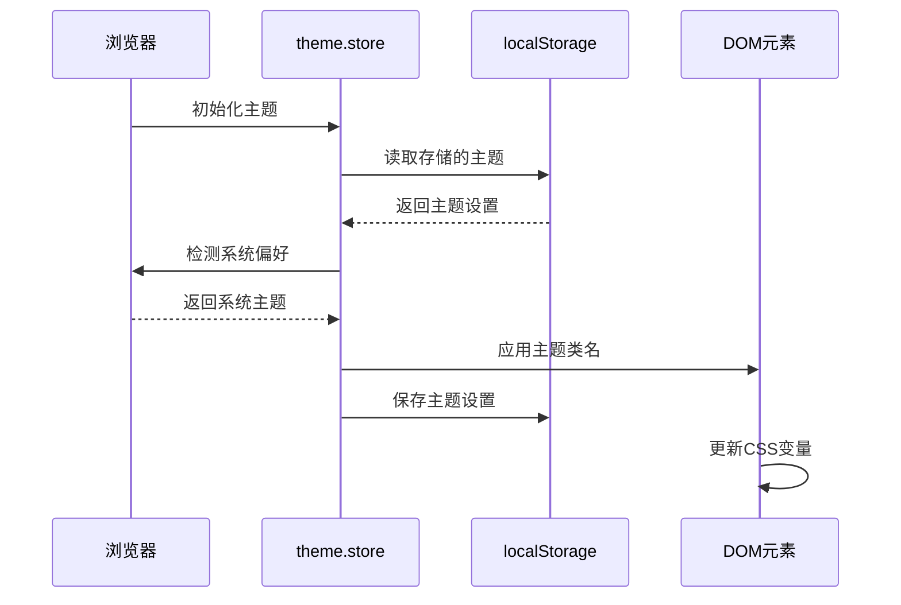
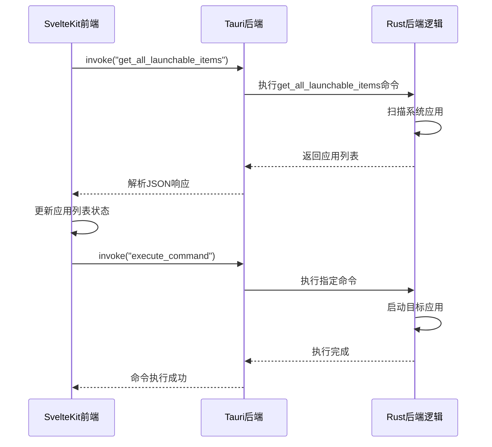

# SvelteKit路由与布局系统

<cite>
**本文档引用的文件**
- [src/routes/+layout.ts](file://src/routes/+layout.ts)
- [src/routes/+layout.svelte](file://src/routes/+layout.svelte)
- [src/routes/+page.svelte](file://src/routes/+page.svelte)
- [src/routes/settings/+page.svelte](file://src/routes/settings/+page.svelte)
- [src/routes/plugins/+page.svelte](file://src/routes/plugins/+page.svelte)
- [src/app.html](file://src/app.html)
- [src/index.css](file://src/index.css)
- [src/lib/stores/escapeHandler.ts](file://src/lib/stores/escapeHandler.ts)
- [src/lib/type.ts](file://src/lib/type.ts)
- [src/lib/utils/theme.ts](file://src/lib/utils/theme.ts)
- [svelte.config.js](file://svelte.config.js)
- [src-tauri/tauri.conf.json](file://src-tauri/tauri.conf.json)
</cite>

## 目录
1. [简介](#简介)
2. [项目架构概览](#项目架构概览)
3. [SvelteKit路由系统](#sveltekit路由系统)
4. [+layout.ts全局配置](#layoutts全局配置)
5. [+layout.svelte布局组件](#layoutsvelte布局组件)
6. [应用根模板app.html](#应用根模板apphtml)
7. [全局状态管理](#全局状态管理)
8. [页面组件分析](#页面组件分析)
9. [主题系统集成](#主题系统集成)
10. [Tauri后端通信](#tauri后端通信)
11. [性能优化策略](#性能优化策略)
12. [故障排除指南](#故障排除指南)
13. [总结](#总结)

## 简介

Baize项目采用SvelteKit框架构建了一个现代化的桌面应用程序，结合Tauri后端实现跨平台部署。该项目展示了SvelteKit路由与布局系统在实际应用中的最佳实践，特别是在全局状态初始化、布局结构定义和生命周期管理方面的核心作用。

本文档将深入分析Baize项目中SvelteKit路由与布局系统的设计理念和技术实现，重点探讨`+layout.ts`文件在全局状态初始化中的关键作用，以及如何与Tauri后端进行高效通信。

## 项目架构概览

Baize项目采用了清晰的分层架构设计，前端使用SvelteKit框架，后端基于Tauri Rust应用：



**图表来源**
- [src/routes/+layout.ts](file://src/routes/+layout.ts#L1-L6)
- [src/routes/+layout.svelte](file://src/routes/+layout.svelte#L1-L64)
- [src-tauri/tauri.conf.json](file://src-tauri/tauri.conf.json#L1-L60)

## SvelteKit路由系统

SvelteKit采用基于文件系统的路由机制，通过特定命名约定自动创建路由结构：



**图表来源**
- [src/routes/+layout.ts](file://src/routes/+layout.ts#L1-L6)
- [src/routes/+layout.svelte](file://src/routes/+layout.svelte#L1-L64)
- [src/routes/+page.svelte](file://src/routes/+page.svelte#L1-L262)

### 路由文件命名规范

- `+layout.ts`: 全局布局配置文件
- `+layout.svelte`: 全局布局组件
- `+page.svelte`: 页面级组件
- `settings/+page.svelte`: 设置页面
- `plugins/+page.svelte`: 插件管理页面

**章节来源**
- [src/routes/+layout.ts](file://src/routes/+layout.ts#L1-L6)
- [src/routes/+layout.svelte](file://src/routes/+layout.svelte#L1-L64)
- [src/routes/+page.svelte](file://src/routes/+page.svelte#L1-L262)

## +layout.ts全局配置

`+layout.ts`文件是SvelteKit应用的全局配置入口，负责定义应用的渲染模式和预渲染策略：

```typescript
// Tauri doesn't have a Node.js server to do proper SSR
// so we will use adapter-static to prerender the app (SSG)
// See: https://v2.tauri.app/start/frontend/sveltekit/ for more info
export const prerender = true;
export const ssr = false;
```

### 关键配置说明

1. **预渲染配置 (`prerender = true`)**:
   - 启用静态站点生成(SSG)模式
   - 提高首屏加载性能
   - 适用于Tauri应用的单页应用(SPA)模式

2. **服务端渲染禁用 (`ssr = false`)**:
   - 避免服务端渲染带来的复杂性
   - 简化Tauri环境下的应用部署
   - 减少内存占用和启动时间

### 与Tauri的集成策略



**图表来源**
- [src/routes/+layout.ts](file://src/routes/+layout.ts#L1-L6)
- [svelte.config.js](file://svelte.config.js#L1-L27)

**章节来源**
- [src/routes/+layout.ts](file://src/routes/+layout.ts#L1-L6)
- [svelte.config.js](file://svelte.config.js#L1-L27)

## +layout.svelte布局组件

`+layout.svelte`是SvelteKit应用的全局布局组件，负责管理应用级别的事件监听和状态共享：



**图表来源**
- [src/routes/+layout.svelte](file://src/routes/+layout.svelte#L1-L64)
- [src/lib/stores/escapeHandler.ts](file://src/lib/stores/escapeHandler.ts#L1-L9)

### 核心功能实现

#### 1. 事件监听器管理

```javascript
onMount(() => {
  const listenersPromise = (async () => {
    const unlisten = await listen("esc_key_pressed", () => {
      const handler = get(escapeHandler);
      handler();
    });

    const unlistenVisibility = await listen<boolean>(
      "window_visibility",
      (event) => {
        if (event.payload && page.route.id === "/") {
          queueMicrotask(() => {
            const input = document.querySelector<HTMLInputElement>(
              'input[placeholder="Hi Baize!"]'
            );
            input?.focus();
          });
        }
      }
    );

    const unlistenCommand = await listen<string>(
      "execute_command_by_name",
      (event) => {
        invoke("execute_command", { name: event.payload });
      }
    );

    return { unlisten, unlistenVisibility, unlistenCommand };
  })();
});
```

#### 2. 生命周期管理

布局组件在整个应用生命周期内保持活跃，避免频繁的设置和清理操作：

- **持久监听**: 事件监听器在应用启动时注册，直到应用关闭才清理
- **内存优化**: 避免重复的DOM查询和事件绑定
- **性能提升**: 减少页面导航时的性能开销

### 与Tauri后端的通信



**图表来源**
- [src/routes/+layout.svelte](file://src/routes/+layout.svelte#L15-L35)
- [src/lib/stores/escapeHandler.ts](file://src/lib/stores/escapeHandler.ts#L1-L9)

**章节来源**
- [src/routes/+layout.svelte](file://src/routes/+layout.svelte#L1-L64)
- [src/lib/stores/escapeHandler.ts](file://src/lib/stores/escapeHandler.ts#L1-L9)

## 应用根模板app.html

`app.html`作为SvelteKit应用的HTML入口模板，负责定义应用的基础结构和资源加载：

```html
<!DOCTYPE html>
<html lang="en">
  <head>
    <meta charset="utf-8" />
    <link rel="icon" href="%sveltekit.assets%/favicon.png" />
    <link rel="styleeet" href="./index.css" />
    <meta name="viewport" content="width=device-width, initial-scale=1" />
    <title>Tauri + SvelteKit + Typescript App</title>
    %sveltekit.head%
  </head>
  <body data-sveltekit-preload-data="hover">
    <div style="display: contents">%sveltekit.body%</div>
  </body>
  <script
    type="module"
    src="//at.alicdn.com/t/c/font_4954857_mzxwbwdvmgc.js"
  ></script>
</html>
```

### 关键特性分析

#### 1. 资源加载策略

- **CSS样式**: 通过相对路径加载全局样式文件
- **字体资源**: 引入外部字体文件支持
- **图标字体**: 加载阿里云图标字体库

#### 2. SvelteKit集成

- `%sveltekit.head%`: SvelteKit动态注入的头部内容
- `%sveltekit.body%`: 应用主体内容占位符
- `data-sveltekit-preload-data="hover"`: 预加载数据优化

#### 3. Tauri兼容性

- **透明背景**: 支持Tauri的透明窗口特性
- **拖拽区域**: `data-tauri-drag-region`属性支持窗口拖拽
- **无边框**: 符合现代桌面应用的视觉设计

**章节来源**
- [src/app.html](file://src/app.html#L1-L19)

## 全局状态管理

Baize项目实现了完整的全局状态管理系统，通过Svelte stores实现状态共享和响应式更新：



**图表来源**
- [src/lib/stores/escapeHandler.ts](file://src/lib/stores/escapeHandler.ts#L1-L9)
- [src/lib/utils/theme.ts](file://src/lib/utils/theme.ts#L1-L60)
- [src/routes/+layout.svelte](file://src/routes/+layout.svelte#L1-L64)

### ESC键处理机制

```typescript
import { writable } from "svelte/store";

/**
 * A store to hold the currently active handler function for the ESC key.
 * Pages can set their own handler on mount and clear it on destroy.
 */
export const escapeHandler = writable<() => void>(() => {
  // Default to a no-op function
});
```

#### 工作原理

1. **状态隔离**: 每个页面可以独立设置自己的ESC处理函数
2. **生命周期管理**: 在组件销毁时自动清理处理函数
3. **全局统一**: 通过store实现全局统一的ESC键处理

### 主题状态管理

```typescript
export const theme = writable<Theme>(initialTheme);

theme.subscribe((newTheme) => {
  if (browser) {
    localStorage.setItem('theme', newTheme);
  }
});
```

#### 特性说明

- **本地存储同步**: 主题变更自动保存到localStorage
- **系统偏好检测**: 支持跟随系统主题设置
- **实时更新**: 主题变更时立即更新DOM类名

**章节来源**
- [src/lib/stores/escapeHandler.ts](file://src/lib/stores/escapeHandler.ts#L1-L9)
- [src/lib/utils/theme.ts](file://src/lib/utils/theme.ts#L1-L60)

## 页面组件分析

### 主页面组件 (+page.svelte)

主页面是应用的核心组件，负责应用搜索和启动功能：



**图表来源**
- [src/routes/+page.svelte](file://src/routes/+page.svelte#L1-L262)

#### 核心功能实现

##### 1. 模糊搜索算法

```typescript
const handleInput = (e: Event & { currentTarget: EventTarget & HTMLInputElement }) => {
  const value = e.currentTarget.value;
  const apps = fuzzyMatch(value, originAppList);
  inputValue = value;
  appList = apps;
  selectedIndex = 0;
};
```

##### 2. 键盘导航支持

```typescript
const handleKeyDown = (e: KeyboardEvent) => {
  if (e.key === "ArrowDown" || (e.key === "Tab" && !e.shiftKey)) {
    e.preventDefault();
    selectedIndex = selectedIndex === appList.length - 1 ? 0 : selectedIndex + 1;
  } else if (e.key === "ArrowUp" || (e.key === "Tab" && e.shiftKey)) {
    e.preventDefault();
    selectedIndex = selectedIndex === 0 ? appList.length - 1 : selectedIndex - 1;
  } else if (e.key === "Enter" && appList.length > 0) {
    e.preventDefault();
    openApp(appList[selectedIndex]);
  }
};
```

##### 3. Tauri命令执行

```typescript
const openApp = async (app: LaunchableItem) => {
  try {
    if (app.action) {
      await invoke("execute_command", {
        name: app.action,
        window: await WebviewWindow.getCurrent(),
      });
    } else if (app.source === "FileCommand") {
      await invoke("open_app", {
        path: app.path,
        window: await WebviewWindow.getCurrent(),
      });
    }
    inputValue = "";
    appList = originAppList;
    selectedIndex = 0;
  } catch (error) {
    console.error("Failed to open app:", error);
  }
};
```

### 设置页面组件

设置页面采用标签页式设计，支持多种设置类型的管理：



**图表来源**
- [src/routes/settings/+page.svelte](file://src/routes/settings/+page.svelte#L1-L111)

### 插件管理页面

插件管理页面提供了完整的插件生态系统管理功能：

```typescript
interface PluginManifest {
  id: string;
  name: string;
  version: string;
  description: string;
  entry: string;
}
```

#### 功能特性

- **插件列表展示**: 显示可用插件及其详细信息
- **搜索过滤**: 支持按名称搜索插件
- **视图切换**: 全部插件与已安装插件的切换
- **手动导入**: 支持手动导入插件功能
- **通知测试**: 内置通知发送测试功能

**章节来源**
- [src/routes/+page.svelte](file://src/routes/+page.svelte#L1-L262)
- [src/routes/settings/+page.svelte](file://src/routes/settings/+page.svelte#L1-L111)
- [src/routes/plugins/+page.svelte](file://src/routes/plugins/+page.svelte#L1-L231)

## 主题系统集成

Baize项目实现了完整的主题系统，支持亮色、暗色和系统跟随三种主题模式：



**图表来源**
- [src/lib/utils/theme.ts](file://src/lib/utils/theme.ts#L1-L60)

### 主题类型定义

```typescript
export enum Theme {
  LIGHT = "light",
  DARK = "dark",
  SYSTEM = "system",
}
```

### 主题切换机制

```typescript
export const toggleTheme = (currentTheme: Theme) => {
  applyTheme(getTheme(currentTheme));
  theme.update(() => currentTheme);
};

export const getTheme = (currentTheme: Theme): Theme.DARK | Theme.LIGHT => {
  let theme = Theme.DARK;
  const isDark = window.matchMedia("(prefers-color-scheme: dark)").matches;
  if (currentTheme === Theme.SYSTEM) {
    theme = isDark ? Theme.DARK : Theme.LIGHT;
  } else {
    theme = currentTheme;
  }
  return theme;
};
```

### CSS变量系统

项目使用Tailwind CSS的CSS变量系统，支持动态主题切换：

```css
:root {
  --background: hsl(0 0% 100%);
  --background-alt: hsl(0 0% 100%);
  --foreground: hsl(0 0% 9%);
  --foreground-alt: hsl(0 0% 32%);
  --border: hsl(240 6% 10%);
  --border-input: hsla(240 6% 10% / 0.17);
  --border-input-hover: hsla(240 6% 10% / 0.4);
  --dark: hsl(240 6% 10%);
  --accent: hsl(204 94% 94%);
  --destructive: hsl(347 77% 50%);
  --tertiary: hsl(37.7 92.1% 50.2%);
}

.dark {
  --background: hsl(0 0% 5%);
  --background-alt: hsl(0 0% 8%);
  --foreground: hsl(0 0% 95%);
  --foreground-alt: hsl(0 0% 70%);
  --border: hsl(0 0% 96%);
  --border-input: hsla(0 0% 96% / 0.17);
  --border-input-hover: hsla(0 0% 96% / 0.4);
  --dark: hsl(0 0% 96%);
  --accent: hsl(204 90% 90%);
  --destructive: hsl(350 89% 60%);
}
```

**章节来源**
- [src/lib/utils/theme.ts](file://src/lib/utils/theme.ts#L1-L60)
- [src/index.css](file://src/index.css#L1-L346)

## Tauri后端通信

Baize项目通过Tauri的IPC机制实现前端与后端的高效通信：



**图表来源**
- [src/routes/+page.svelte](file://src/routes/+page.svelte#L80-L95)

### IPC通信模式

#### 1. 数据获取

```typescript
const fetchApps = async () => {
  try {
    console.log("Fetching all launchable items...");
    const res = await invoke<LaunchableItem[]>("get_all_launchable_items");
    console.log("本机软件列表: ", res);
    if (res) {
      originAppList = res;
      appList = res;
    }
    console.log(`Got ${appList.length} apps.`);
  } catch (error) {
    console.error("Failed to get all launchable items:", error);
  }
};
```

#### 2. 事件监听

```typescript
const unlistenAppsUpdated = await listen("apps_updated", (event) => {
  console.log("Received apps_updated event from backend. Refetching list...");
  fetchApps();
});

const unlistenCommandsReady = await listen("commands_ready", (event) => {
  console.log("Received commands_ready event from backend. Refetching list...");
  fetchApps();
});
```

#### 3. 命令执行

```typescript
const openApp = async (app: LaunchableItem) => {
  try {
    if (app.action) {
      await invoke("execute_command", {
        name: app.action,
        window: await WebviewWindow.getCurrent(),
      });
    } else if (app.source === "FileCommand") {
      await invoke("open_app", {
        path: app.path,
        window: await WebviewWindow.getCurrent(),
      });
    }
    // 清理状态
    inputValue = "";
    appList = originAppList;
    selectedIndex = 0;
  } catch (error) {
    console.error("Failed to open app:", error);
  }
};
```

### 类型安全保证

项目使用TypeScript确保前后端通信的类型安全：

```typescript
export interface LaunchableItem {
  name: string;
  keywords: CommandKeyword[];
  path: string;
  icon: string;
  icon_type: IconType;
  item_type: ItemType;
  source: Source;
  action?: string;
  origin?: AppOrigin;
}

export interface CommandKeyword {
  name: string;
  disabled?: boolean;
  is_default?: boolean;
}
```

**章节来源**
- [src/routes/+page.svelte](file://src/routes/+page.svelte#L80-L120)
- [src/lib/type.ts](file://src/lib/type.ts#L1-L51)

## 性能优化策略

### 1. 静态站点生成(SSG)

通过`+layout.ts`配置启用预渲染：

```typescript
export const prerender = true;
export const ssr = false;
```

### 2. 事件监听器复用

```typescript
onMount(() => {
  const listenersPromise = (async () => {
    // 只在应用启动时注册监听器
    const unlisten = await listen("esc_key_pressed", () => {
      const handler = get(escapeHandler);
      handler();
    });
    
    // 返回清理函数
    return { unlisten };
  })();
  
  // 整个布局组件销毁时才清理
  return () => {
    listenersPromise.then(({ unlisten }) => unlisten());
  };
});
```

### 3. 懒加载优化

- **组件懒加载**: 设置页面按需加载不同设置组件
- **插件延迟加载**: 插件管理页面只在需要时加载插件列表
- **图片资源优化**: 使用Base64编码的图标减少HTTP请求

### 4. 内存管理

```typescript
onDestroy(() => {
  // 清理主题订阅
  unsubscribe && unsubscribe();
  // 重置ESC处理函数
  if (get(escapeHandler) === handleEsc) {
    escapeHandler.set(() => {});
  }
  // 清理事件监听器
  if (unlisten) {
    unlisten();
  }
});
```

## 故障排除指南

### 常见问题及解决方案

#### 1. 主题不生效

**症状**: 切换主题后界面颜色没有变化

**原因**: CSS变量未正确更新或浏览器缓存

**解决方案**:
```typescript
// 强制重新应用主题
const applyTheme = (theme: Theme) => {
  if (browser) {
    document.documentElement.classList.remove(Theme.DARK, Theme.LIGHT, Theme.SYSTEM);
    document.documentElement.classList.add(theme);
  }
};
```

#### 2. ESC键处理失效

**症状**: 按下ESC键时没有响应

**原因**: ESC处理函数被错误清理

**解决方案**:
```typescript
// 确保正确的清理时机
onDestroy(() => {
  if (get(escapeHandler) === handleEsc) {
    escapeHandler.set(() => {});
  }
});
```

#### 3. Tauri命令调用失败

**症状**: invoke调用返回错误

**原因**: 后端命令未正确定义或权限不足

**解决方案**:
- 检查`src-tauri/src/main.rs`中的命令注册
- 验证Tauri配置文件中的权限设置
- 使用Tauri DevTools调试IPC通信

#### 4. 插件加载失败

**症状**: 插件列表为空或加载错误

**原因**: 插件路径配置错误或权限问题

**解决方案**:
```typescript
try {
  const result = await invoke("load_plugins");
  plugins = result as PluginManifest[];
  console.log("Loaded plugins state:", plugins);
} catch (error) {
  console.error("Failed to load plugins via invoke:", error);
}
```

**章节来源**
- [src/routes/+layout.svelte](file://src/routes/+layout.svelte#L40-L64)
- [src/routes/+page.svelte](file://src/routes/+page.svelte#L240-L262)

## 总结

Baize项目展示了SvelteKit路由与布局系统在现代桌面应用开发中的强大能力。通过精心设计的架构，项目实现了以下关键特性：

### 技术亮点

1. **高效的路由系统**: 基于文件系统的路由机制简化了应用结构
2. **全局状态管理**: 通过Svelte stores实现响应式的全局状态共享
3. **事件驱动架构**: 基于事件的通信模式提高了系统的解耦性
4. **主题系统集成**: 完整的亮暗主题支持和系统偏好检测
5. **性能优化**: SSG预渲染和事件监听器复用显著提升了应用性能

### 最佳实践

- **布局组件职责分离**: `+layout.svelte`专注于全局事件处理，页面组件专注业务逻辑
- **状态管理规范化**: 使用Svelte stores管理全局状态，避免组件间直接通信
- **生命周期管理**: 正确的组件生命周期管理确保资源的正确释放
- **类型安全**: TypeScript的强类型系统确保了前后端通信的安全性

### 未来发展方向

1. **插件生态扩展**: 完善插件系统，支持第三方开发者扩展功能
2. **性能监控**: 添加应用性能监控和错误追踪
3. **国际化支持**: 实现多语言支持以服务更广泛的用户群体
4. **无障碍访问**: 提升应用的无障碍访问能力

Baize项目为SvelteKit应用开发提供了宝贵的参考，展示了如何在桌面环境中充分利用现代Web技术的优势，同时保持良好的用户体验和开发效率。