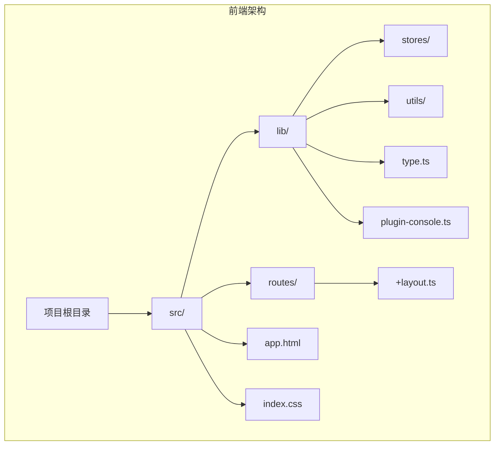
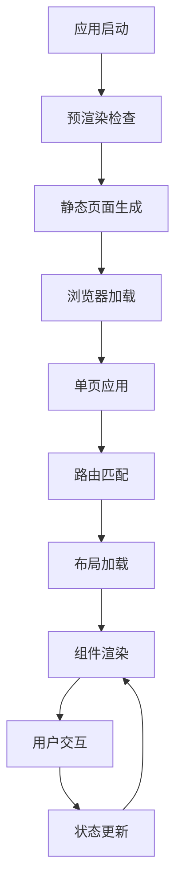
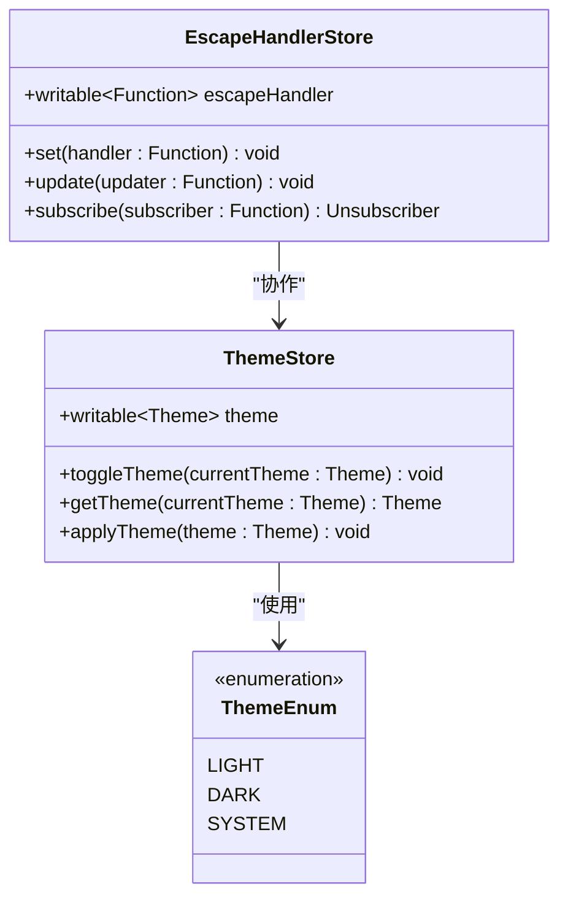
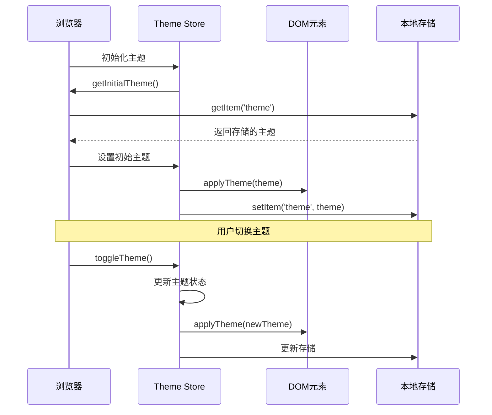
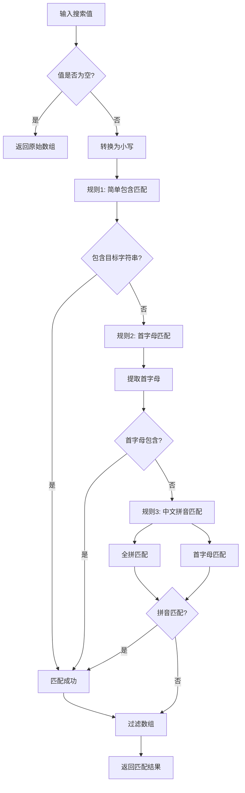
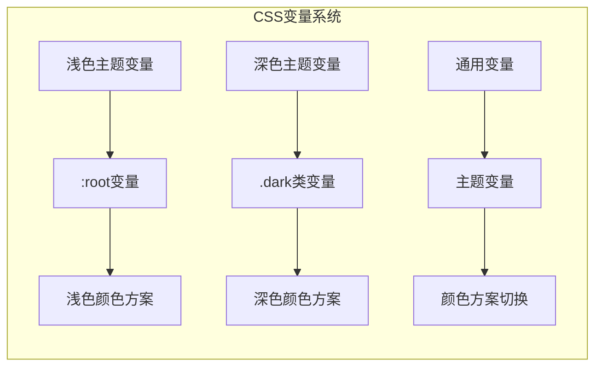
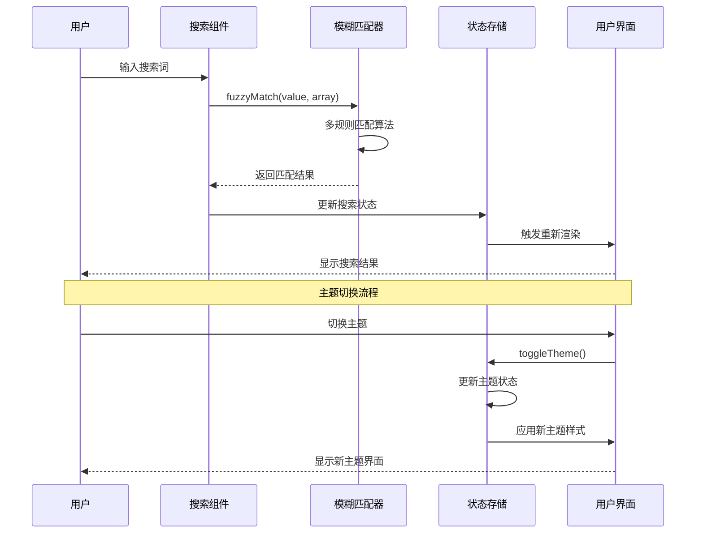

# Baize前端架构详细文档

<cite>
**本文档中引用的文件**
- [src/routes/+layout.ts](file://src/routes/+layout.ts)
- [src/lib/utils/fuzzyMatch.ts](file://src/lib/utils/fuzzyMatch.ts)
- [src/lib/utils/theme.ts](file://src/lib/utils/theme.ts)
- [src/lib/stores/escapeHandler.ts](file://src/lib/stores/escapeHandler.ts)
- [tailwind.config.ts](file://tailwind.config.ts)
- [src/index.css](file://src/index.css)
- [src/app.html](file://src/app.html)
- [src/lib/type.ts](file://src/lib/type.ts)
</cite>

## 目录
1. [简介](#简介)
2. [项目结构概览](#项目结构概览)
3. [SvelteKit路由系统](#sveltekit路由系统)
4. [状态管理系统](#状态管理系统)
5. [工具函数详解](#工具函数详解)
6. [样式系统架构](#样式系统架构)
7. [组件树与数据流](#组件树与数据流)
8. [性能优化策略](#性能优化策略)
9. [故障排除指南](#故障排除指南)
10. [总结](#总结)

## 简介

Baize是一个基于SvelteKit构建的现代化桌面应用程序，采用TypeScript开发，结合了Tauri作为后端框架。该前端架构展现了现代Web应用的最佳实践，包括响应式设计、主题切换、状态管理和高效的搜索算法。

## 项目结构概览



**图表来源**
- [src/routes/+layout.ts](file://src/routes/+layout.ts#L1-L6)
- [src/lib/type.ts](file://src/lib/type.ts#L1-L51)

**章节来源**
- [src/routes/+layout.ts](file://src/routes/+layout.ts#L1-L6)
- [src/lib/type.ts](file://src/lib/type.ts#L1-L51)

## SvelteKit路由系统

### 全局布局配置

`+layout.ts`文件是SvelteKit路由系统的核心配置点，负责定义应用的预渲染和服务器端渲染行为：

```typescript
// Tauri doesn't have a Node.js server to do proper SSR
// so we will use adapter-static to prerender the app (SSG)
// See: https://v2.tauri.app/start/frontend/sveltekit/ for more info
export const prerender = true;
export const ssr = false;
```

这个配置表明：
- **预渲染启用**：应用将在构建时生成静态HTML页面
- **禁用SSR**：由于Tauri不提供Node.js服务器，因此禁用服务器端渲染
- **静态适配器**：使用adapter-static进行静态站点生成

### 路由架构设计



**图表来源**
- [src/routes/+layout.ts](file://src/routes/+layout.ts#L1-L6)

**章节来源**
- [src/routes/+layout.ts](file://src/routes/+layout.ts#L1-L6)

## 状态管理系统

### Svelte Stores架构

Baize采用了Svelte的内置状态管理机制，通过writable stores实现响应式状态更新：



**图表来源**
- [src/lib/stores/escapeHandler.ts](file://src/lib/stores/escapeHandler.ts#L1-L9)
- [src/lib/utils/theme.ts](file://src/lib/utils/theme.ts#L1-L60)
- [src/lib/type.ts](file://src/lib/type.ts#L35-L40)

### 主题状态管理

主题系统实现了复杂的多层状态管理：

1. **初始状态获取**：优先从localStorage读取，回退到系统偏好设置
2. **响应式更新**：自动订阅store变化并同步DOM和本地存储
3. **动态切换**：支持实时主题切换和系统主题跟随



**图表来源**
- [src/lib/utils/theme.ts](file://src/lib/utils/theme.ts#L15-L60)

**章节来源**
- [src/lib/stores/escapeHandler.ts](file://src/lib/stores/escapeHandler.ts#L1-L9)
- [src/lib/utils/theme.ts](file://src/lib/utils/theme.ts#L1-L60)
- [src/lib/type.ts](file://src/lib/type.ts#L35-L40)

## 工具函数详解

### 模糊匹配算法

`fuzzyMatch.ts`实现了高级的模糊搜索功能，支持多种匹配规则：



**图表来源**
- [src/lib/utils/fuzzyMatch.ts](file://src/lib/utils/fuzzyMatch.ts#L10-L52)

### 主题切换逻辑

主题切换系统具有智能的多层优先级机制：

1. **系统偏好检测**：通过`window.matchMedia('(prefers-color-scheme: dark)')`检测系统主题偏好
2. **用户偏好持久化**：将用户选择的主题保存到localStorage
3. **实时DOM更新**：动态修改HTML元素的class列表
4. **双向绑定**：store变化自动同步到DOM和本地存储

**章节来源**
- [src/lib/utils/fuzzyMatch.ts](file://src/lib/utils/fuzzyMatch.ts#L1-L52)
- [src/lib/utils/theme.ts](file://src/lib/utils/theme.ts#L1-L60)

## 样式系统架构

### Tailwind CSS集成

Tailwind CSS配置采用class策略实现暗黑模式：

```typescript
// tailwind.config.ts
export default {
  content: ['./src/**/*.{html,js,svelte,ts}'],
  // 告诉 Tailwind 使用 'class' 策略来切换暗黑模式
  darkMode: 'class',
  theme: {
    extend: {},
  },
  plugins: [],
};
```

### CSS自定义属性系统

样式系统基于CSS自定义属性（CSS变量）实现主题切换：



**图表来源**
- [src/index.css](file://src/index.css#L1-L346)

### 动画系统

样式系统包含了丰富的动画效果，通过CSS关键帧实现：

- **缩放动画**：scale-in, scale-out
- **淡入淡出**：fade-in, fade-out  
- **滑动动画**：enter-from-left, enter-from-right
- **手风琴动画**：accordion-down, accordion-up

**章节来源**
- [tailwind.config.ts](file://tailwind.config.ts#L1-L12)
- [src/index.css](file://src/index.css#L1-L346)

## 组件树与数据流

### 应用组件层次结构

```mermaid
graph TB
subgraph "应用根组件"
AppHTML[app.html]
Body[Body容器]
DivContent[div style="display: contents"]
end
subgraph "布局组件"
Layout[+layout.ts]
GlobalState[全局状态管理]
ThemeProvider[主题提供者]
end
subgraph "业务组件"
SearchBar[搜索栏组件]
ResultList[结果列表组件]
ItemCard[项目卡片组件]
end
subgraph "工具组件"
EscapeHandler[ESC键处理器]
FuzzyMatcher[模糊匹配器]
ThemeSwitcher[主题切换器]
end
AppHTML --> Body
Body --> DivContent
DivContent --> Layout
Layout --> GlobalState
GlobalState --> ThemeProvider
ThemeProvider --> SearchBar
SearchBar --> ResultList
ResultList --> ItemCard
EscapeHandler --> Layout
FuzzyMatcher --> SearchBar
ThemeSwitcher --> ThemeProvider
```

**图表来源**
- [src/app.html](file://src/app.html#L1-L19)
- [src/routes/+layout.ts](file://src/routes/+layout.ts#L1-L6)

### 数据流向分析



**图表来源**
- [src/lib/utils/fuzzyMatch.ts](file://src/lib/utils/fuzzyMatch.ts#L10-L52)
- [src/lib/utils/theme.ts](file://src/lib/utils/theme.ts#L40-L60)

## 性能优化策略

### 预渲染优化

1. **静态站点生成**：使用adapter-static进行预渲染
2. **减少运行时计算**：将复杂计算移到构建时
3. **缓存策略**：利用浏览器缓存和CDN加速

### 内存管理

1. **组件生命周期管理**：合理使用onMount和onDestroy
2. **事件监听器清理**：避免内存泄漏
3. **状态订阅管理**：及时取消不必要的订阅

### 渲染优化

1. **虚拟滚动**：对于大量数据使用虚拟滚动技术
2. **防抖节流**：搜索输入防抖处理
3. **条件渲染**：根据状态条件性渲染组件

## 故障排除指南

### 常见问题及解决方案

#### 主题切换失效
- **症状**：主题切换后界面没有变化
- **原因**：CSS变量未正确更新或浏览器缓存
- **解决方案**：检查DOM元素的class列表，清除浏览器缓存

#### 模糊匹配不准确
- **症状**：搜索结果不符合预期
- **原因**：匹配规则权重或拼音库问题
- **解决方案**：检查输入文本编码和拼音库配置

#### 性能问题
- **症状**：搜索响应慢或界面卡顿
- **原因**：大数据量处理或频繁重渲染
- **解决方案**：实施防抖机制和虚拟滚动

**章节来源**
- [src/lib/utils/theme.ts](file://src/lib/utils/theme.ts#L15-L30)
- [src/lib/utils/fuzzyMatch.ts](file://src/lib/utils/fuzzyMatch.ts#L10-L30)

## 总结

Baize前端架构展现了现代Web应用开发的最佳实践：

1. **模块化设计**：清晰的文件组织和职责分离
2. **响应式状态管理**：基于Svelte stores的高效状态管理
3. **高性能搜索**：多规则模糊匹配算法
4. **优雅的主题系统**：CSS自定义属性和Tailwind CSS结合
5. **用户体验优化**：流畅的动画和即时反馈

该架构为开发者提供了可扩展的基础，同时保持了代码的简洁性和可维护性。通过合理的工具函数和状态管理，实现了复杂的功能需求，同时保证了良好的性能表现。