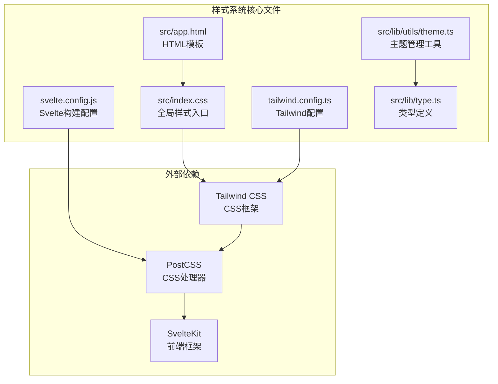
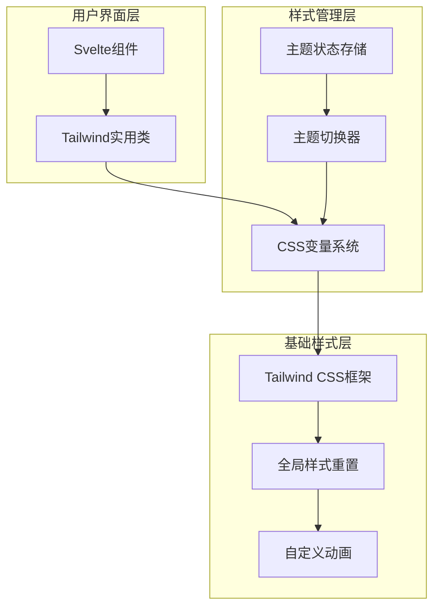
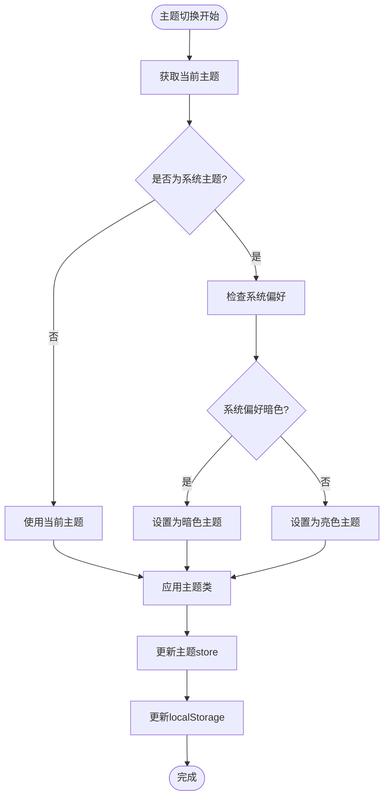
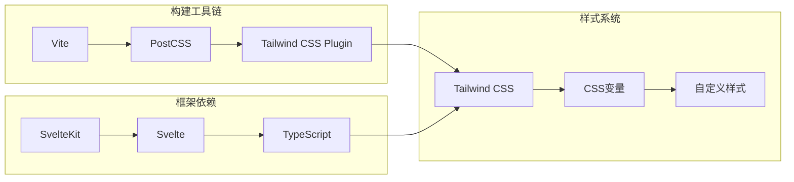
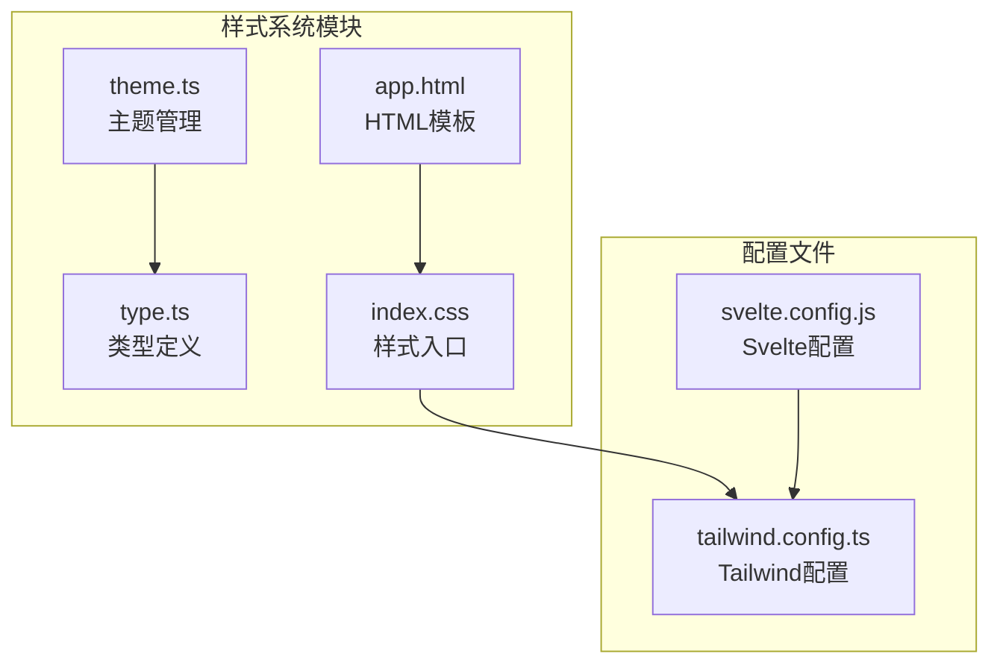

# 样式系统

<cite>
**本文档引用的文件**
- [src/index.css](file://src/index.css)
- [tailwind.config.ts](file://tailwind.config.ts)
- [svelte.config.js](file://svelte.config.js)
- [src/lib/utils/theme.ts](file://src/lib/utils/theme.ts)
- [src/lib/type.ts](file://src/lib/type.ts)
- [src/app.html](file://src/app.html)
</cite>

## 目录
1. [简介](#简介)
2. [项目结构概览](#项目结构概览)
3. [核心样式配置](#核心样式配置)
4. [架构概览](#架构概览)
5. [详细组件分析](#详细组件分析)
6. [依赖关系分析](#依赖关系分析)
7. [性能考虑](#性能考虑)
8. [故障排除指南](#故障排除指南)
9. [结论](#结论)

## 简介

Baize项目采用现代化的样式系统，结合Tailwind CSS框架和自定义CSS变量，为用户提供一致且响应式的视觉体验。该系统支持亮色/暗色主题切换，并通过Svelte组件实现动态样式管理。

## 项目结构概览

样式系统的核心文件分布在以下位置：



**图表来源**
- [src/index.css](file://src/index.css#L1-L10)
- [tailwind.config.ts](file://tailwind.config.ts#L1-L12)
- [svelte.config.js](file://svelte.config.js#L1-L29)

**章节来源**
- [src/index.css](file://src/index.css#L1-L346)
- [tailwind.config.ts](file://tailwind.config.ts#L1-L12)
- [svelte.config.js](file://svelte.config.js#L1-L29)

## 核心样式配置

### Tailwind CSS集成

项目通过`tailwind.config.ts`文件配置Tailwind CSS：

```typescript
export default {
  content: ['./src/**/*.{html,js,svelte,ts}'],
  darkMode: 'class',
  theme: {
    extend: {},
  },
  plugins: [],
};
```

配置特点：
- **内容扫描路径**：扫描整个`src`目录下的HTML、JavaScript、Svelte和TypeScript文件
- **暗色模式策略**：使用`class`策略，通过CSS类名控制主题切换
- **扩展主题**：目前为空，预留扩展空间

### 全局样式重置

`src/index.css`文件包含完整的样式重置和自定义变量定义：

#### CSS变量系统

系统定义了两套完整的颜色方案：

**亮色主题变量**：
```css
:root {
  --background: hsl(0 0% 100%);
  --foreground: hsl(0 0% 9%);
  --muted: hsl(240 5% 96%);
  --border: hsl(240 6% 10%);
  --accent: hsl(204 94% 94%);
  --destructive: hsl(347 77% 50%);
}
```

**暗色主题变量**：
```css
.dark {
  --background: hsl(0 0% 5%);
  --foreground: hsl(0 0% 95%);
  --muted: hsl(240 4% 16%);
  --border: hsl(0 0% 96%);
  --accent: hsl(204 90% 90%);
}
```

#### 自定义主题层

使用Tailwind的`@theme`指令定义自定义主题变量：

```css
@theme inline {
  --color-background: var(--background);
  --color-foreground: var(--foreground);
  --color-border: var(--border-card);
  --shadow-mini: var(--shadow-mini);
  --radius-card: 16px;
  --font-sans: "Inter", "sans-serif";
}
```

**章节来源**
- [src/index.css](file://src/index.css#L1-L346)
- [tailwind.config.ts](file://tailwind.config.ts#L1-L12)

## 架构概览

样式系统采用分层架构设计，确保可维护性和扩展性：



**图表来源**
- [src/lib/utils/theme.ts](file://src/lib/utils/theme.ts#L1-L58)
- [src/index.css](file://src/index.css#L1-L346)

## 详细组件分析

### 主题管理系统

#### 主题枚举定义

```typescript
export enum Theme {
  LIGHT = "light",
  DARK = "dark",
  SYSTEM = "system",
}
```

#### 主题状态管理

主题状态通过Svelte的writable store管理：

```typescript
export const theme = writable<Theme>(initialTheme);
```

#### 主题切换逻辑



**图表来源**
- [src/lib/utils/theme.ts](file://src/lib/utils/theme.ts#L44-L58)

#### 主题应用函数

```typescript
const applyTheme = (theme: Theme) => {
  if (browser) {
    document.documentElement.classList.remove(Theme.DARK, Theme.LIGHT, Theme.SYSTEM);
    document.documentElement.classList.add(theme);
  }
};
```

### CSS变量系统

#### 变量命名规范

系统采用语义化的CSS变量命名：

- **颜色变量**：`--color-*`前缀
- **尺寸变量**：`--size-*`或`--spacing-*`前缀
- **半径变量**：`--radius-*`前缀
- **阴影变量**：`--shadow-*`前缀

#### 动态变量绑定

```css
@theme inline {
  --color-background: var(--background);
  --color-foreground: var(--foreground);
  --color-border: var(--border-card);
}
```

### 动画系统

#### 内置动画定义

系统预定义了丰富的CSS动画：

```css
@keyframes scale-in {
  from {
    opacity: 0;
    transform: rotateX(-10deg) scale(0.9);
  }
  to {
    opacity: 1;
    transform: rotateX(0deg) scale(1);
  }
}
```

#### 动画变量注册

```css
--animate-scale-in: scale-in 0.2s ease;
--animate-fade-in: fade-in 0.2s ease;
--animate-enter-from-left: enter-from-left 0.2s ease;
```

**章节来源**
- [src/lib/utils/theme.ts](file://src/lib/utils/theme.ts#L1-L58)
- [src/lib/type.ts](file://src/lib/type.ts#L35-L40)
- [src/index.css](file://src/index.css#L100-L200)

## 依赖关系分析

### 外部依赖图



**图表来源**
- [svelte.config.js](file://svelte.config.js#L1-L29)
- [tailwind.config.ts](file://tailwind.config.ts#L1-L12)

### 内部模块依赖



**图表来源**
- [src/lib/utils/theme.ts](file://src/lib/utils/theme.ts#L1-L58)
- [src/lib/type.ts](file://src/lib/type.ts#L1-L51)
- [src/index.css](file://src/index.css#L1-L10)

**章节来源**
- [src/lib/utils/theme.ts](file://src/lib/utils/theme.ts#L1-L58)
- [tailwind.config.ts](file://tailwind.config.ts#L1-L12)
- [svelte.config.js](file://svelte.config.js#L1-L29)

## 性能考虑

### 样式加载优化

1. **CSS变量预计算**：所有颜色和尺寸变量在编译时确定
2. **按需加载**：Tailwind只生成实际使用的类名
3. **主题切换无重绘**：通过CSS类名切换，避免重新渲染

### 构建优化

1. **PostCSS配置**：与SvelteKit集成，自动处理CSS优化
2. **Tree Shaking**：移除未使用的CSS类名
3. **缓存策略**：利用浏览器缓存机制

## 故障排除指南

### 常见问题及解决方案

#### 主题切换不生效

**问题描述**：点击主题切换按钮后，界面没有变色

**排查步骤**：
1. 检查`localStorage`中是否有`theme`键
2. 验证`document.documentElement`是否正确添加了主题类
3. 确认CSS变量是否正确定义

**解决方案**：
```javascript
// 手动测试主题切换
document.documentElement.classList.add('dark');
console.log(document.documentElement.className);
```

#### Tailwind类名不生效

**问题描述**：使用Tailwind类但样式没有应用

**排查步骤**：
1. 检查`tailwind.config.ts`中的content路径配置
2. 确认文件扩展名是否包含在content数组中
3. 重启开发服务器

**解决方案**：
```typescript
// 确保content配置正确
content: ['./src/**/*.{html,js,svelte,ts}']
```

#### CSS变量未定义

**问题描述**：使用CSS变量但出现样式错误

**排查步骤**：
1. 检查变量是否在`:root`和`.dark`选择器中定义
2. 确认变量名称拼写正确
3. 验证CSS语法格式

**章节来源**
- [src/lib/utils/theme.ts](file://src/lib/utils/theme.ts#L1-L58)
- [src/index.css](file://src/index.css#L1-L346)

## 结论

Baize项目的样式系统展现了现代前端开发的最佳实践：

### 系统优势

1. **模块化设计**：清晰的文件组织和职责分离
2. **主题灵活性**：支持亮色、暗色和系统主题
3. **性能优化**：基于CSS变量和Tailwind的高效实现
4. **可维护性**：良好的代码结构和类型安全

### 最佳实践总结

1. **优先使用Tailwind类**：避免内联样式，充分利用实用类
2. **语义化命名**：使用有意义的CSS变量和类名
3. **响应式设计**：利用Tailwind的响应式前缀
4. **主题一致性**：通过CSS变量保持颜色和间距的一致性

### 扩展建议

1. **添加更多动画效果**：可以扩展动画系统支持更多交互效果
2. **国际化支持**：考虑添加RTL语言支持
3. **性能监控**：添加CSS打包大小监控
4. **自动化测试**：为样式系统添加视觉回归测试

该样式系统为Baize项目提供了坚实的基础，支持未来的功能扩展和维护需求。