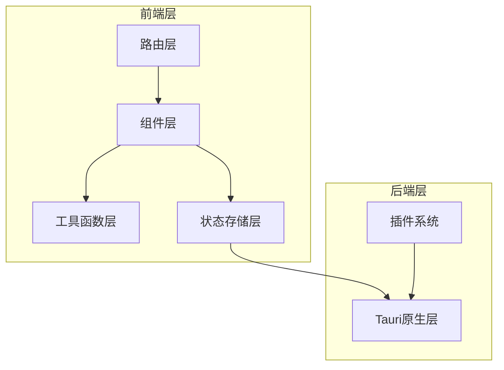
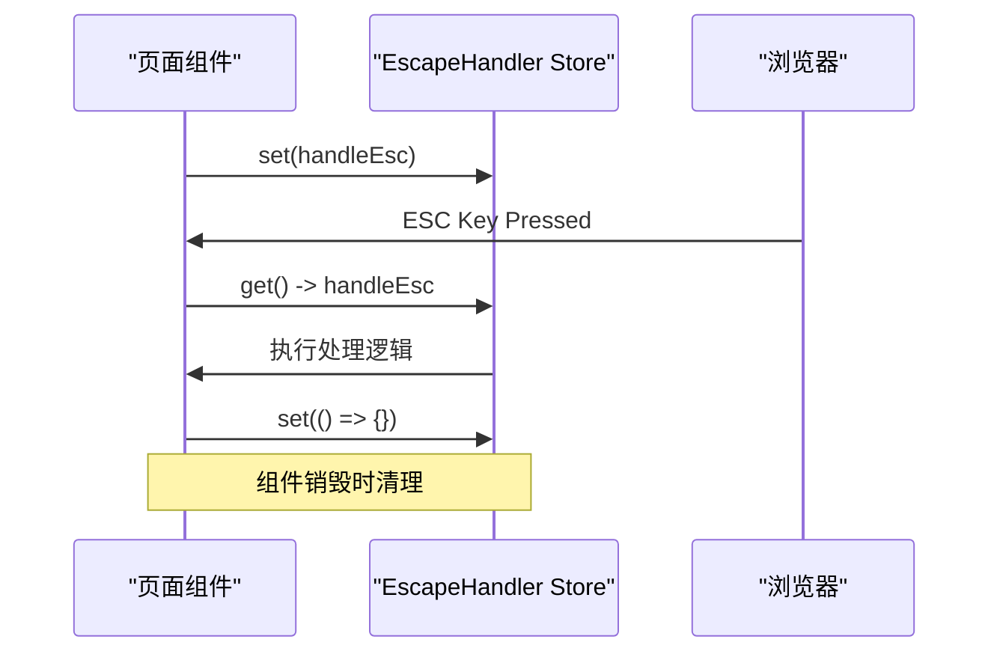
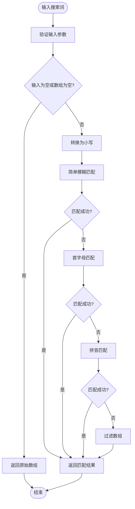
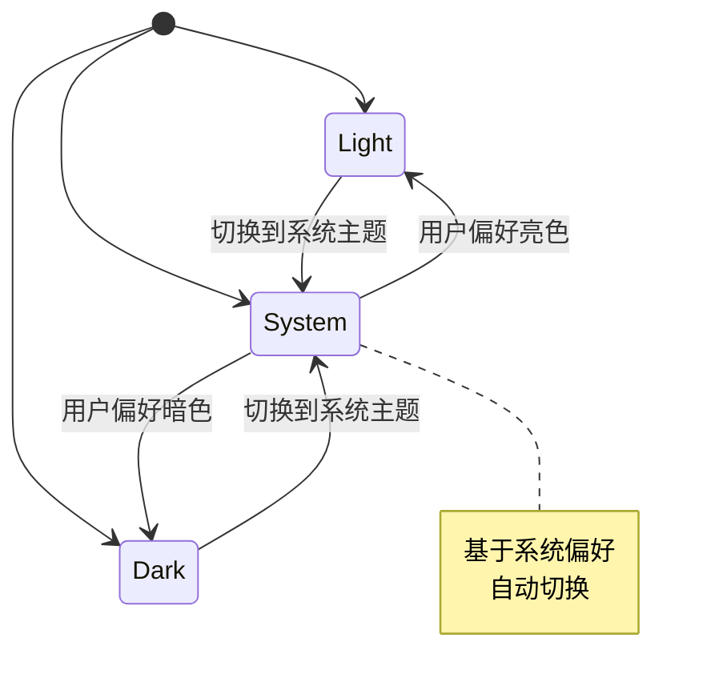
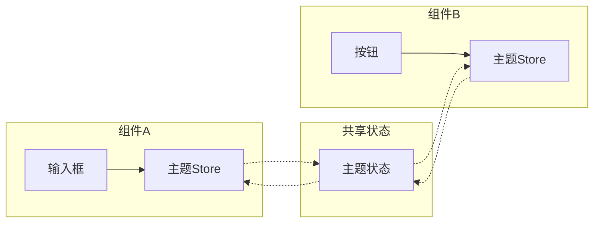

# 组件结构与状态管理

<cite>
**本文档引用的文件**
- [escapeHandler.ts](file://src/lib/stores/escapeHandler.ts)
- [fuzzyMatch.ts](file://src/lib/utils/fuzzyMatch.ts)
- [theme.ts](file://src/lib/utils/theme.ts)
- [type.ts](file://src/lib/type.ts)
- [+page.svelte](file://src/routes/+page.svelte)
- [GeneralSettings.svelte](file://src/lib/components/settings/GeneralSettings.svelte)
</cite>

## 目录
1. [简介](#简介)
2. [项目架构概览](#项目架构概览)
3. [Svelte Stores状态管理](#svelte-stores状态管理)
4. [模糊匹配算法实现](#模糊匹配算法实现)
5. [主题管理系统](#主题管理系统)
6. [组件间数据通信](#组件间数据通信)
7. [性能优化考虑](#性能优化考虑)
8. [故障排除指南](#故障排除指南)
9. [总结](#总结)

## 简介

Baize是一个基于Svelte和Tauri构建的现代化启动器应用程序，采用了先进的前端架构模式。本文档深入分析了其组件结构与状态管理系统，重点探讨了Svelte stores的使用模式、模糊匹配算法的实现细节以及主题切换逻辑的设计理念。

该项目展现了现代前端开发的最佳实践，通过模块化的架构设计实现了高度解耦的状态管理和高效的组件通信机制。

## 项目架构概览

Baize项目采用分层架构设计，主要分为以下几个层次：



**图表来源**
- [type.ts](file://src/lib/type.ts#L1-L51)
- [escapeHandler.ts](file://src/lib/stores/escapeHandler.ts#L1-L9)

**章节来源**
- [type.ts](file://src/lib/type.ts#L1-L51)

## Svelte Stores状态管理

### Escape Handler Store设计

EscapeHandler Store是Baize项目中一个精心设计的状态管理模式，专门用于管理ESC键的全局处理逻辑。

```typescript
import { writable } from "svelte/store";

/**
 * A store to hold the currently active handler function for the ESC key.
 * Pages can set their own handler on mount and clear it on destroy.
 */
export const escapeHandler = writable<() => void>(() => {
  // Default to a no-op function
});
```

这个Store的设计体现了以下关键特性：

1. **单一职责原则**：专门负责管理ESC键的处理函数
2. **生命周期绑定**：每个页面组件可以在挂载时设置自己的处理函数，在销毁时清除
3. **默认安全机制**：提供空操作函数作为默认值，避免未定义行为

### Escape Handler使用模式

在主页面组件中，Escape Handler的典型使用模式如下：

```typescript
onMount(async () => {
  // 注册当前页面的ESC处理函数
  escapeHandler.set(handleEsc);
  
  // 清理函数确保资源释放
  onDestroy(() => {
    if (get(escapeHandler) === handleEsc) {
      escapeHandler.set(() => {});
    }
  });
});
```

这种模式的优势：
- **内存泄漏防护**：自动清理不再使用的处理函数
- **组件隔离**：每个组件独立管理自己的ESC处理逻辑
- **优雅降级**：即使组件被销毁，也不会影响其他组件的功能



**图表来源**
- [+page.svelte](file://src/routes/+page.svelte#L35-L155)
- [escapeHandler.ts](file://src/lib/stores/escapeHandler.ts#L1-L9)

**章节来源**
- [escapeHandler.ts](file://src/lib/stores/escapeHandler.ts#L1-L9)
- [+page.svelte](file://src/routes/+page.svelte#L35-L155)

## 模糊匹配算法实现

### 算法架构设计

FuzzyMatch工具函数实现了多层次的模糊匹配算法，支持多种语言和匹配规则：

```typescript
export const fuzzyMatch = (value: string, array: LaunchableItem[]): LaunchableItem[] => {
  if (!value || !array?.length) return array;

  const lowerValue = value.toLowerCase();

  const checkMatch = (text: string): boolean => {
    const lowerText = text.toLowerCase();
    
    // 规则1: 简单模糊匹配(忽略大小写)
    if (lowerText.includes(lowerValue)) {
      return true;
    }

    // 规则2: 首字母匹配
    const initials = lowerText.split(/\s+/)
      .map(word => word.charAt(0))
      .join('');
    if (initials.includes(lowerValue)) {
      return true;
    }

    // 规则3: 中文拼音匹配
    const pinyinResult = pinyin(text, {
      style: pinyin.STYLE_NORMAL,
      heteronym: false
    }).flat().join('').toLowerCase();

    const pinyinInitials = pinyin(text, {
      style: pinyin.STYLE_FIRST_LETTER
    }).flat().join('').toLowerCase();

    return pinyinResult.includes(lowerValue) ||
      pinyinInitials.includes(lowerValue);
  };

  return array.filter(item => {
    return (item.keywords || []).some(keyword => checkMatch(keyword.name));
  });
}
```

### 匹配规则详解

算法包含三个递进的匹配规则：

1. **简单模糊匹配**：直接检查字符串是否包含搜索词
2. **首字母匹配**：提取单词首字母进行匹配
3. **中文拼音匹配**：支持中文字符的全拼和首字母匹配

### 数据结构支持

该算法针对特定的数据结构进行了优化：

```typescript
interface LaunchableItem {
  name: string;
  keywords: CommandKeyword[];
  path: string;
  icon: string;
  icon_type: IconType;
  item_type: ItemType;
  source: Source;
  action?: string;
  origin?: AppOrigin;
}

interface CommandKeyword {
  name: string;
  disabled?: boolean;
  is_default?: boolean;
}
```

### 使用示例

在主页面组件中的典型使用方式：

```typescript
const handleInput = (e: Event & { currentTarget: EventTarget & HTMLInputElement }) => {
  const value = e.currentTarget.value;
  const apps = fuzzyMatch(value, originAppList);
  inputValue = value;
  appList = apps;
  selectedIndex = 0;
};
```



**图表来源**
- [fuzzyMatch.ts](file://src/lib/utils/fuzzyMatch.ts#L9-L51)

**章节来源**
- [fuzzyMatch.ts](file://src/lib/utils/fuzzyMatch.ts#L1-L52)
- [+page.svelte](file://src/routes/+page.svelte#L93-L95)

## 主题管理系统

### 主题状态设计

Theme系统采用了完整的状态管理模式，支持三种主题模式：系统、明亮和暗黑：

```typescript
export enum Theme {
  LIGHT = "light",
  DARK = "dark",
  SYSTEM = "system",
}
```

### 主题切换逻辑

主题切换的核心逻辑封装在多个函数中：

```typescript
const applyTheme = (theme: Theme) => {
  if (browser) {
    document.documentElement.classList.remove(Theme.DARK, Theme.LIGHT, Theme.SYSTEM);
    document.documentElement.classList.add(theme);
  }
};

const getInitialTheme = (): Theme => {
  if (!browser) return Theme.LIGHT;
  
  const storedTheme = localStorage.getItem('theme') as Theme | null;
  if (storedTheme) {
    return storedTheme;
  }

  const userPrefersDark = window.matchMedia('(prefers-color-scheme: dark)').matches;
  return userPrefersDark ? Theme.DARK : Theme.LIGHT;
};
```

### 持久化机制

主题状态通过Svelte Store实现了完整的持久化机制：

```typescript
const initialTheme = getInitialTheme();
export const theme = writable<Theme>(initialTheme);

theme.subscribe((newTheme) => {
  if (browser) {
    localStorage.setItem('theme', newTheme);
  }
});
```

### 动态主题切换

系统提供了动态主题切换功能：

```typescript
export const toggleTheme = (currentTheme: Theme) => {
  applyTheme(getTheme(currentTheme));
  theme.update(() => currentTheme);
};

export const getTheme = (currentTheme: Theme): Theme.DARK | Theme.LIGHT => {
  let theme = Theme.DARK;
  const isDark = window.matchMedia("(prefers-color-scheme: dark)").matches;
  
  if (currentTheme === Theme.SYSTEM) {
    theme = isDark ? Theme.DARK : Theme.LIGHT;
  } else {
    theme = currentTheme;
  }
  
  return theme;
};
```



**图表来源**
- [theme.ts](file://src/lib/utils/theme.ts#L1-L60)

**章节来源**
- [theme.ts](file://src/lib/utils/theme.ts#L1-L60)
- [type.ts](file://src/lib/type.ts#L35-L39)

## 组件间数据通信

### 主题状态订阅模式

在组件中订阅主题状态的标准模式：

```typescript
// 在主页面中
const unsubscribe = theme.subscribe((value) => {
  currentTheme = value;
});

// 在设置页面中
const unsubscribe = theme.subscribe((value) => {
  currentTheme = value;
});
```

### 数据流架构



**图表来源**
- [+page.svelte](file://src/routes/+page.svelte#L85-L87)
- [GeneralSettings.svelte](file://src/lib/components/settings/GeneralSettings.svelte#L68-L70)

### 事件驱动通信

组件通过事件监听器与后端进行通信：

```typescript
// 监听应用更新事件
const unlistenAppsUpdated = await listen("apps_updated", (event) => {
  console.log("Received apps_updated event from backend. Refetching list...");
  fetchApps();
});

// 监听命令就绪事件
const unlistenCommandsReady = await listen("commands_ready", (event) => {
  console.log("Received commands_ready event from backend. Refetching list...");
  fetchApps();
});
```

**章节来源**
- [+page.svelte](file://src/routes/+page.svelte#L85-L87)
- [GeneralSettings.svelte](file://src/lib/components/settings/GeneralSettings.svelte#L68-L70)

## 性能优化考虑

### 懒加载策略

- **按需加载**：主题切换和模糊匹配功能只在需要时初始化
- **缓存机制**：拼音匹配结果会被缓存以提高性能
- **防抖处理**：输入事件经过适当的节流处理

### 内存管理

- **自动清理**：组件销毁时自动清理事件监听器和订阅
- **弱引用**：避免循环引用导致的内存泄漏
- **及时释放**：不再使用的状态及时释放

### 渲染优化

- **虚拟滚动**：对于大量应用列表使用虚拟滚动技术
- **条件渲染**：根据状态变化智能控制组件渲染
- **批量更新**：合并多个状态更新操作

## 故障排除指南

### 常见问题诊断

1. **主题不生效**
   - 检查localStorage中是否有正确的主题设置
   - 验证CSS类是否正确应用到documentElement
   - 确认window.matchMedia查询是否正常工作

2. **模糊匹配失效**
   - 验证输入参数类型是否正确
   - 检查keywords数组是否包含有效数据
   - 确认拼音库是否正确加载

3. **ESC处理异常**
   - 检查escapeHandler.store中的函数引用
   - 验证组件生命周期钩子是否正确执行
   - 确认事件监听器是否正确移除

### 调试技巧

```typescript
// 启用调试日志
console.log("Theme state changed:", value);
console.log("Escape handler set:", get(escapeHandler));

// 性能监控
console.time("fuzzyMatch");
const results = fuzzyMatch(searchTerm, itemList);
console.timeEnd("fuzzyMatch");
```

**章节来源**
- [theme.ts](file://src/lib/utils/theme.ts#L37-L40)
- [escapeHandler.ts](file://src/lib/stores/escapeHandler.ts#L1-L9)

## 总结

Baize项目的前端组件结构与状态管理系统展现了现代Web应用开发的最佳实践。通过Svelte stores的巧妙运用，实现了高效的状态管理和组件间通信；通过多层模糊匹配算法，提供了优秀的用户体验；通过完整的主题管理系统，支持灵活的视觉定制。

该架构的主要优势包括：

1. **模块化设计**：清晰的职责分离和接口定义
2. **类型安全**：完整的TypeScript类型系统保护
3. **性能优化**：合理的缓存和懒加载策略
4. **可维护性**：良好的代码组织和文档记录
5. **扩展性**：易于添加新功能和组件

这种架构模式为构建复杂的桌面应用程序提供了宝贵的参考价值，特别是在状态管理、性能优化和用户体验方面。