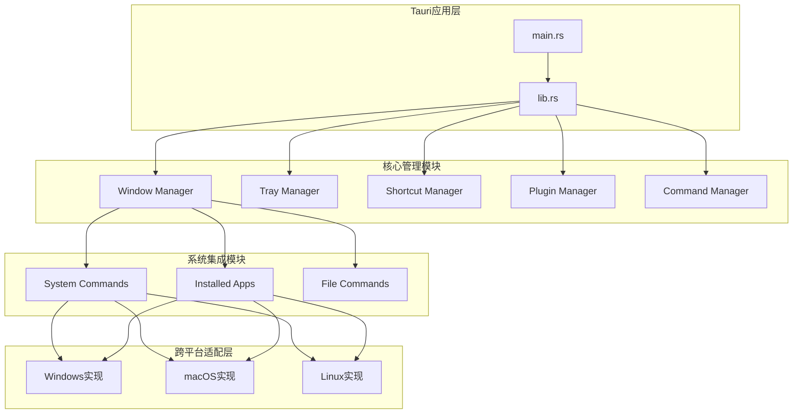
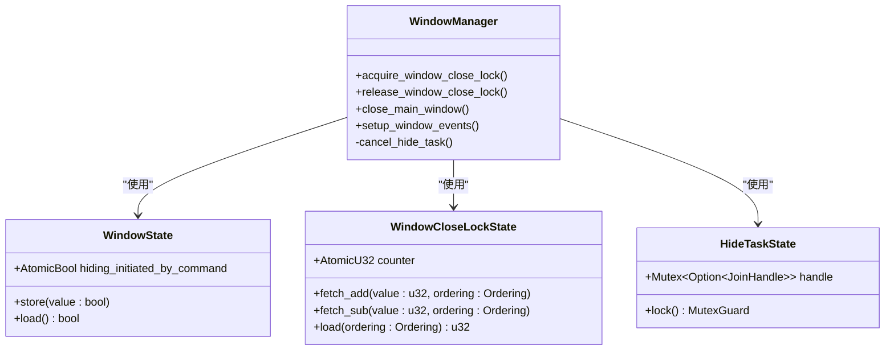
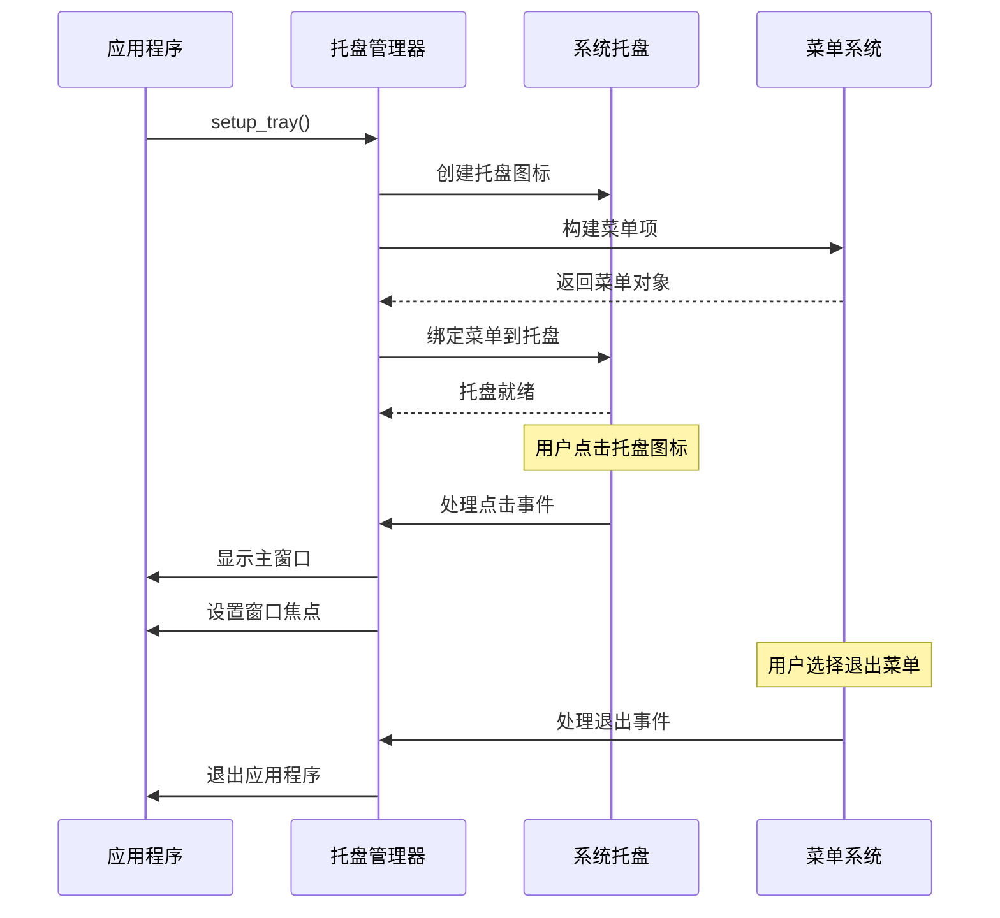
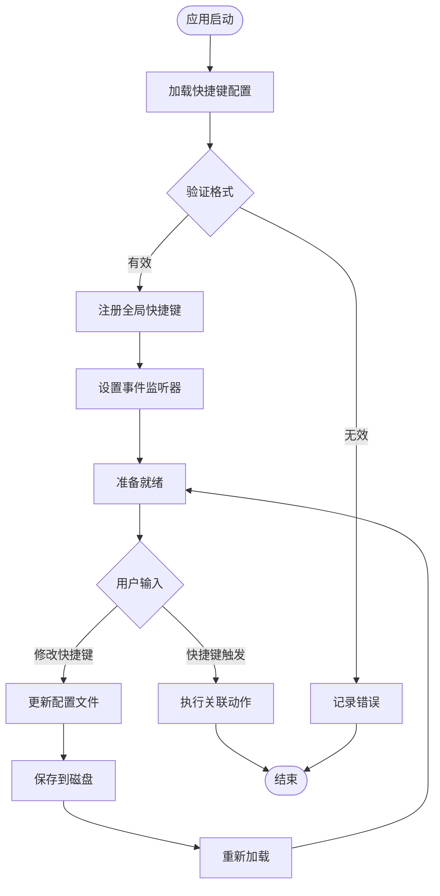
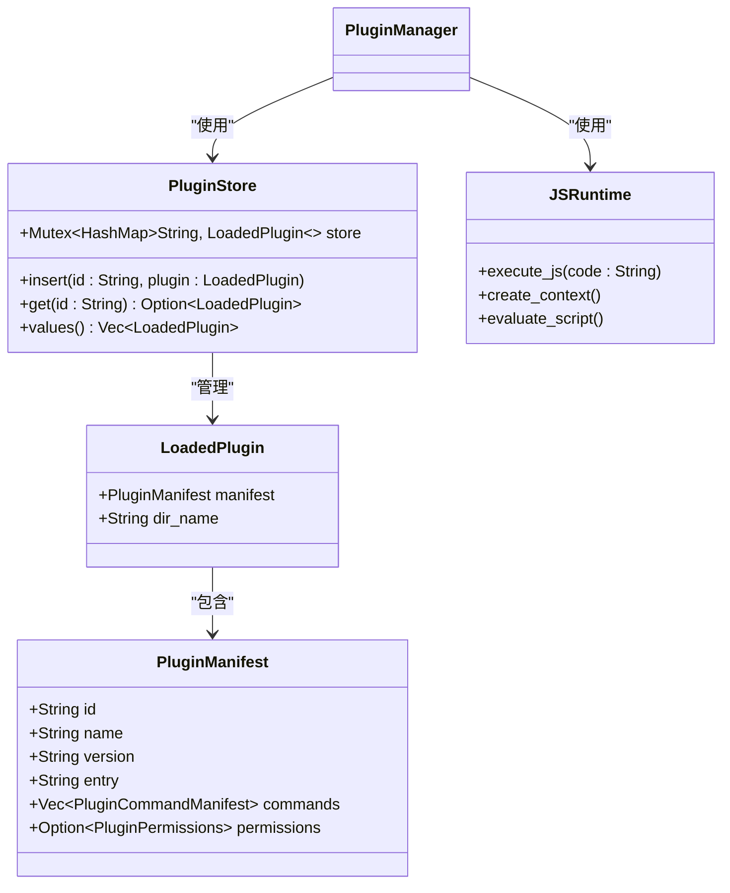
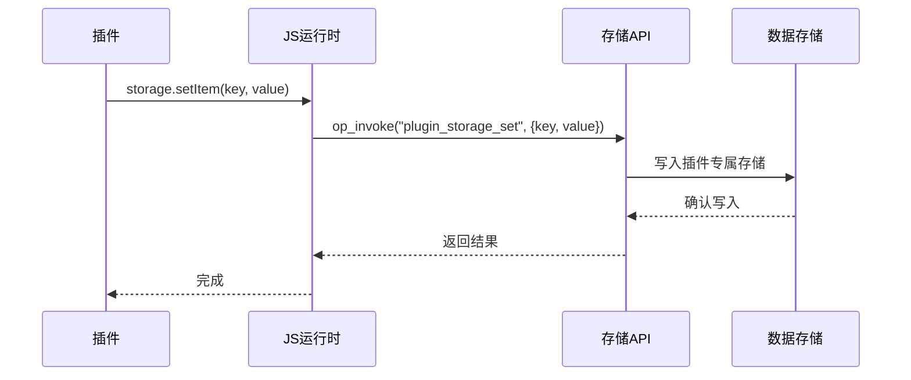
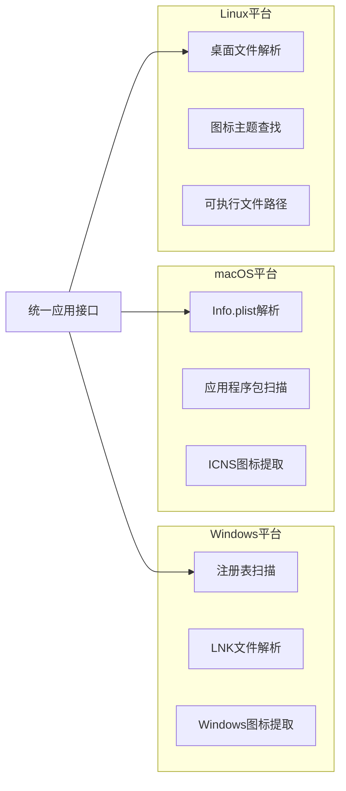
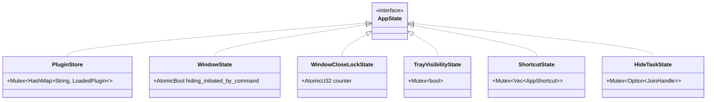
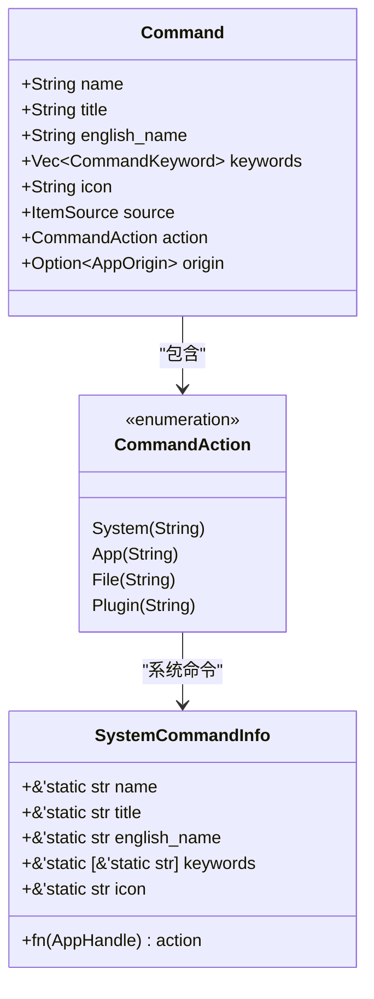
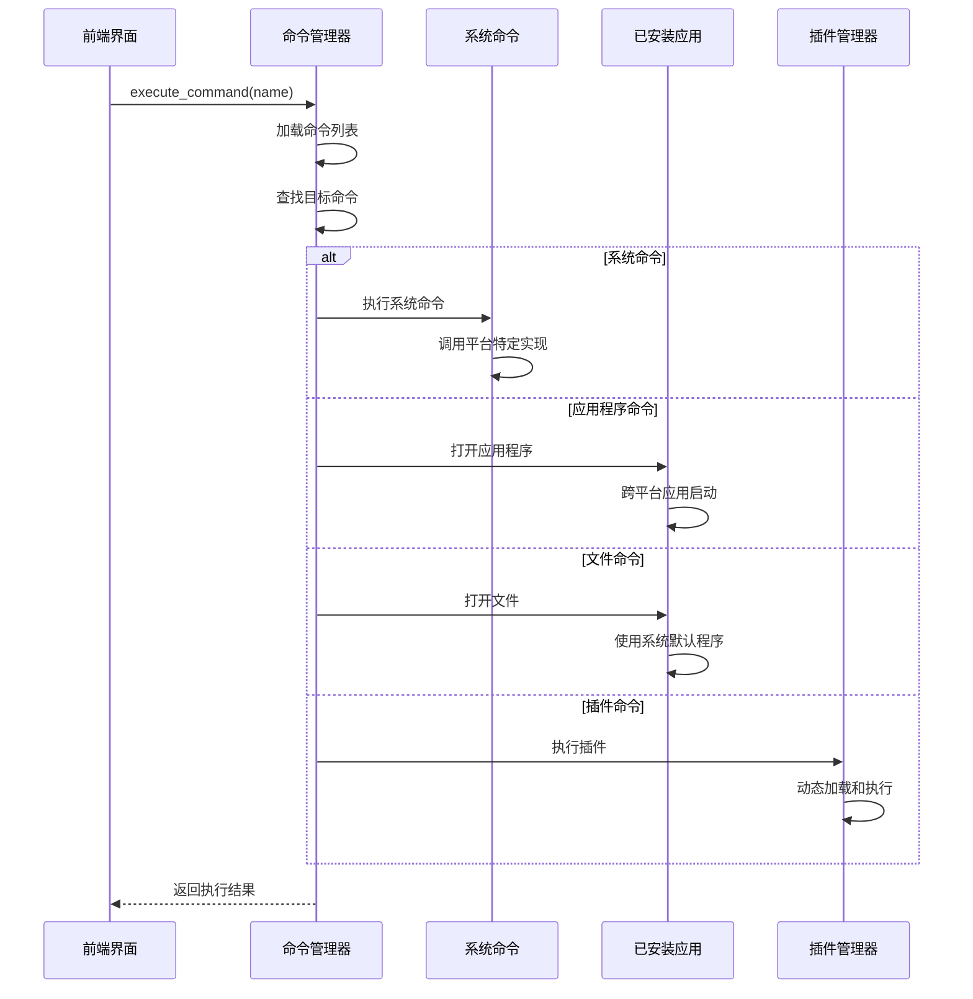

# 后端模块详解

<cite>
**本文档引用的文件**
- [lib.rs](file://src-tauri/src/lib.rs)
- [window_manager.rs](file://src-tauri/src/window_manager.rs)
- [tray_manager.rs](file://src-tauri/src/tray_manager.rs)
- [shortcut_manager.rs](file://src-tauri/src/shortcut_manager.rs)
- [plugin_manager.rs](file://src-tauri/src/plugin_manager.rs)
- [system_commands.rs](file://src-tauri/src/system_commands.rs)
- [installed_apps/mod.rs](file://src-tauri/src/installed_apps/mod.rs)
- [shared_types.rs](file://src-tauri/src/shared_types.rs)
- [Cargo.toml](file://src-tauri/Cargo.toml)
- [js_runtime.rs](file://src-tauri/src/js_runtime.rs) - *新增插件存储管理功能*
- [plugin_api/storage.rs](file://src-tauri/src/plugin_api/storage.rs) - *新增插件存储API*
- [plugin_api/request.rs](file://src-tauri/src/plugin_api/request.rs) - *重构权限系统为命名空间结构*
</cite>

## 更新摘要
**变更内容**
- 在插件管理器部分新增了插件存储管理功能的详细说明
- 更新了权限检查逻辑，反映了新的命名空间权限结构
- 增加了`plugin_api::storage`模块的实现细节分析
- 补充了插件运行时中对存储API的支持机制
- 更新了相关命令注册和调用流程

### 目录
1. [简介](#简介)
2. [项目架构概览](#项目架构概览)
3. [核心模块分析](#核心模块分析)
4. [跨平台实现细节](#跨平台实现细节)
5. [全局状态管理](#全局状态管理)
6. [命令系统架构](#命令系统架构)
7. [性能优化策略](#性能优化策略)
8. [错误处理机制](#错误处理机制)
9. [总结](#总结)

## 简介

Baize是一个基于Tauri框架构建的桌面应用程序，专门为有Rust背景的开发者设计。该项目采用模块化架构，通过精心设计的后端模块提供强大的系统集成能力。本文档深入分析了`src-tauri/src`目录下的核心模块，包括窗口管理、托盘管理、快捷键管理、插件系统等关键组件。

该应用程序的核心设计理念是提供一个统一的命令面板界面，能够访问系统命令、已安装的应用程序、文件系统以及第三方插件。通过Rust的强类型系统和内存安全性，确保了系统的稳定性和性能。

## 项目架构概览



**图表来源**
- [lib.rs](file://src-tauri/src/lib.rs#L1-L50)
- [window_manager.rs](file://src-tauri/src/window_manager.rs#L1-L30)

**章节来源**
- [lib.rs](file://src-tauri/src/lib.rs#L1-L235)
- [Cargo.toml](file://src-tauri/Cargo.toml#L1-L71)

## 核心模块分析

### 窗口管理器 (Window Manager)

窗口管理器是整个应用程序的核心组件之一，负责管理主窗口的生命周期、焦点事件处理以及智能隐藏逻辑。



**图表来源**
- [window_manager.rs](file://src-tauri/src/window_manager.rs#L8-L25)

窗口管理器采用了原子操作和异步编程模式来确保线程安全：

- **WindowState**: 使用`AtomicBool`跟踪窗口是否由命令主动隐藏
- **WindowCloseLockState**: 使用`AtomicU32`实现可重入的窗口关闭锁
- **HideTaskState**: 使用`Mutex<Option<JoinHandle>>`管理隐藏任务的生命周期

**章节来源**
- [window_manager.rs](file://src-tauri/src/window_manager.rs#L1-L199)

### 托盘管理器 (Tray Manager)

托盘管理器提供了系统托盘图标的完整生命周期管理，包括图标显示控制和菜单事件处理。



**图表来源**
- [tray_manager.rs](file://src-tauri/src/tray_manager.rs#L30-L66)

托盘管理器的关键特性：
- **状态同步**: 使用`Mutex<bool>`保持托盘可见性状态的一致性
- **事件绑定**: 实现了完整的鼠标点击和菜单事件处理
- **跨平台兼容**: 支持Windows、macOS和Linux的托盘图标

**章节来源**
- [tray_manager.rs](file://src-tauri/src/tray_manager.rs#L1-L66)

### 快捷键管理器 (Shortcut Manager)

快捷键管理器实现了全局快捷键的注册、管理和持久化存储功能。



**图表来源**
- [shortcut_manager.rs](file://src-tauri/src/shortcut_manager.rs#L150-L199)

快捷键管理器的核心功能：

- **持久化存储**: 使用JSON文件存储用户定义的快捷键配置
- **格式验证**: 通过`serde_json`进行配置文件的序列化和反序列化
- **跨平台支持**: 针对不同操作系统提供特定的权限检查
- **冲突检测**: 自动处理相同按键组合的快捷键冲突

**章节来源**
- [shortcut_manager.rs](file://src-tauri/src/shortcut_manager.rs#L1-L199)

### 插件管理器 (Plugin Manager)

插件管理器是应用程序扩展性的核心，支持动态加载JavaScript插件并提供安全的运行环境。



**图表来源**
- [plugin_manager.rs](file://src-tauri/src/plugin_manager.rs#L8-L35)

插件管理器的设计特点：

- **类型安全**: 使用`HashMap<String, LoadedPlugin>`确保插件ID的唯一性
- **异步执行**: 支持JavaScript代码的异步执行和上下文隔离
- **协议处理**: 实现了自定义URI方案来安全加载插件资源
- **权限控制**: 通过`PluginPermissions`结构体管理插件的网络访问权限
- **存储管理**: 新增了插件数据存储功能，每个插件拥有独立的存储空间

**章节来源**
- [plugin_manager.rs](file://src-tauri/src/plugin_manager.rs#L1-L199)

#### 插件存储管理

新增的插件存储管理功能允许每个插件在本地持久化存储数据，同时保证数据隔离和安全性。



**图表来源**
- [js_runtime.rs](file://src-tauri/src/js_runtime.rs#L133-L190)
- [plugin_api/storage.rs](file://src-tauri/src/plugin_api/storage.rs#L1-L200)

插件存储管理的核心特性：

- **数据隔离**: 每个插件的数据存储在独立的路径下，格式为`plugin_data/{plugin_id}/storage.json`
- **线程安全**: 使用`tauri_plugin_store`提供的线程安全存储机制
- **API完整性**: 提供了完整的CRUD操作接口，包括批量操作
- **上下文感知**: 通过线程本地存储(TLS)识别当前执行的插件ID

**章节来源**
- [js_runtime.rs](file://src-tauri/src/js_runtime.rs#L133-L190)
- [plugin_api/storage.rs](file://src-tauri/src/plugin_api/storage.rs#L1-L200)

## 跨平台实现细节

### 已安装应用程序检测

`installed_apps`模块展示了如何优雅地处理跨平台差异：



**图表来源**
- [installed_apps/mod.rs](file://src-tauri/src/installed_apps/mod.rs#L1-L71)

各平台的具体实现：

**Windows实现**:
- 使用`winreg`库访问注册表
- 解析`.lnk`快捷方式文件
- 提取Windows Shell图标

**macOS实现**:
- 解析`Info.plist`文件
- 扫描应用程序包(.app)
- 处理ICNS图标格式

**Linux实现**:
- 解析.desktop文件
- 查找图标主题中的图标
- 处理可执行文件路径

**章节来源**
- [installed_apps/mod.rs](file://src-tauri/src/installed_apps/mod.rs#L1-L71)

### 系统命令执行

系统命令模块展示了条件编译和平台特定实现的最佳实践：

```rust
// 条件编译示例
#[cfg(target_os = "windows")]
{
    std::process::Command::new("shutdown")
        .args(&["/s", "/t", "0"])
        .output()?;
}

#[cfg(target_os = "macos")]
{
    std::process::Command::new("osascript")
        .args(&["-e", "tell app \"System Events\" to shut down"])
        .output()?;
}

#[cfg(target_os = "linux")]
{
    std::process::Command::new("shutdown").arg("now").output()?;
}
```

这种实现方式的优势：
- **类型安全**: 编译时确定目标平台
- **性能优化**: 只包含目标平台的代码
- **维护简便**: 平台特定逻辑集中管理

**章节来源**
- [system_commands.rs](file://src-tauri/src/system_commands.rs#L1-L199)

## 全局状态管理

### 状态管理模式

应用程序采用Tauri的`manage`方法来管理全局状态，这是一种类型安全的状态管理模式：



**图表来源**
- [lib.rs](file://src-tauri/src/lib.rs#L45-L75)

### 状态访问模式

所有状态都是通过`State<T>`类型安全地访问：

```rust
// 状态访问示例
let state: State<WindowCloseLockState> = app.state();
state.0.fetch_add(1, Ordering::Relaxed);

// 错误处理示例
let mut shortcuts = state
    .shortcuts
    .lock()
    .map_err(|_| "Failed to acquire lock".to_string())?;
```

这种设计确保了：
- **线程安全**: 使用互斥锁保护共享状态
- **类型安全**: 编译时检查状态类型
- **错误处理**: 统一的错误处理机制

**章节来源**
- [lib.rs](file://src-tauri/src/lib.rs#L45-L75)

## 命令系统架构

### 命令类型系统

应用程序定义了丰富的命令类型系统来支持不同的执行场景：



**图表来源**
- [shared_types.rs](file://src-tauri/src/shared_types.rs#L65-L85)

### 命令执行流程



**图表来源**
- [system_commands.rs](file://src-tauri/src/system_commands.rs#L50-L80)

**章节来源**
- [shared_types.rs](file://src-tauri/src/shared_types.rs#L1-L127)
- [system_commands.rs](file://src-tauri/src/system_commands.rs#L1-L199)

### 插件命令与存储API

插件相关的命令现在包括了完整的存储管理功能，这些命令在`lib.rs`中被注册：

```rust
// 在 lib.rs 中注册的存储命令
.invoke_handler(tauri::generate_handler![
    // ... 其他命令
    plugin_api::storage::plugin_storage_set,
    plugin_api::storage::plugin_storage_get,
    plugin_api::storage::plugin_storage_remove,
    plugin_api::storage::plugin_storage_clear,
    plugin_api::storage::plugin_storage_keys,
    plugin_api::storage::plugin_storage_set_items,
    plugin_api::storage::plugin_storage_get_items,
])
```

**图表来源**
- [lib.rs](file://src-tauri/src/lib.rs#L150-L180)
- [plugin_api/storage.rs](file://src-tauri/src/plugin_api/storage.rs#L1-L200)

存储API的调用流程：

1. 插件通过SDK调用`storage.setItem()`等方法
2. JavaScript运行时通过`op_invoke`调用对应的Rust函数
3. Rust函数通过线程本地存储获取当前插件ID
4. 根据插件ID确定存储路径并执行操作
5. 结果返回给前端

**章节来源**
- [lib.rs](file://src-tauri/src/lib.rs#L150-L180)
- [js_runtime.rs](file://src-tauri/src/js_runtime.rs#L133-L190)

## 性能优化策略

### 异步编程模式

应用程序广泛使用Tokio异步运行时来提高性能：

```rust
// 异步任务示例
tauri::async_runtime::spawn(async move {
    command_manager::init(&app_handle).await;
    js_runtime::init_plugin_runtime_manager(app_handle.clone()).await;
});

// 异步文件操作
std::fs::create_dir_all(&app_data_dir).await.unwrap();
```

### 内存管理优化

- **零拷贝字符串**: 使用`&'static str`减少字符串分配
- **智能指针**: 使用`Arc<Mutex<T>>`和`Rc<RefCell<T>>`进行高效的内存共享
- **延迟初始化**: 使用`once_cell::Lazy`实现全局状态的延迟初始化

### 并发控制

```rust
// 原子操作示例
state.0.fetch_add(1, Ordering::Relaxed);
state.0.fetch_sub(1, Ordering::Relaxed);

// 广播通道示例
pub static RDEV_EVENT_CHANNEL: Lazy<(
    broadcast::Sender<rdev::Event>,
    broadcast::Receiver<rdev::Event>,
)> = Lazy::new(|| broadcast::channel(128));
```

## 错误处理机制

### 统一错误处理

应用程序采用`Result<T, String>`作为标准错误返回类型：

```rust
// 错误处理示例
pub fn set_tray_visibility(
    visible: bool,
    app: AppHandle,
    state: State<'_, TrayVisibilityState>,
) -> Result<(), String> {
    if let Some(tray) = app.tray_by_id(TRAY_ICON_ID) {
        tray.set_visible(visible).map_err(|e| e.to_string())?;
        *state.0.lock().unwrap() = visible;
        Ok(())
    } else {
        Err("Tray icon not found.".to_string())
    }
}
```

### 错误恢复策略

- **优雅降级**: 当某些功能不可用时，提供替代方案
- **日志记录**: 使用`tracing`库记录详细的调试信息
- **异常捕获**: 使用`std::panic::catch_unwind`捕获未处理的异常

**章节来源**
- [tray_manager.rs](file://src-tauri/src/tray_manager.rs#L15-L30)

## 总结

Baize项目展现了现代Rust桌面应用程序开发的最佳实践。通过模块化架构、类型安全的状态管理、跨平台抽象和异步编程模式，该项目成功地构建了一个功能丰富且性能优异的命令面板应用。

### 关键技术亮点

1. **模块化设计**: 清晰的职责分离和接口定义
2. **类型安全**: 充分利用Rust的类型系统保证程序正确性
3. **跨平台兼容**: 优雅的平台差异处理
4. **性能优化**: 异步编程和并发控制的合理运用
5. **错误处理**: 完善的错误处理和恢复机制
6. **插件生态**: 新增的存储管理功能增强了插件的持久化能力

### 对Rust开发者的建议

- 学习如何使用`State<T>`进行类型安全的状态管理
- 掌握Tokio异步运行时的使用模式
- 理解条件编译在跨平台开发中的应用
- 利用Rust的并发原语实现高性能的多线程应用
- 关注新引入的插件存储管理机制，了解其线程本地存储的使用方式

这个项目为有Rust背景的开发者提供了一个优秀的学习案例，展示了如何在实际项目中应用Rust语言的各种特性来构建高质量的桌面应用程序。