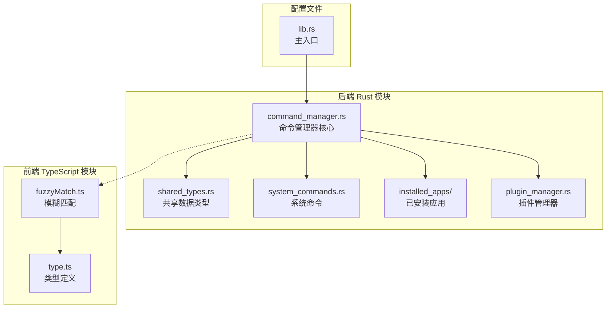
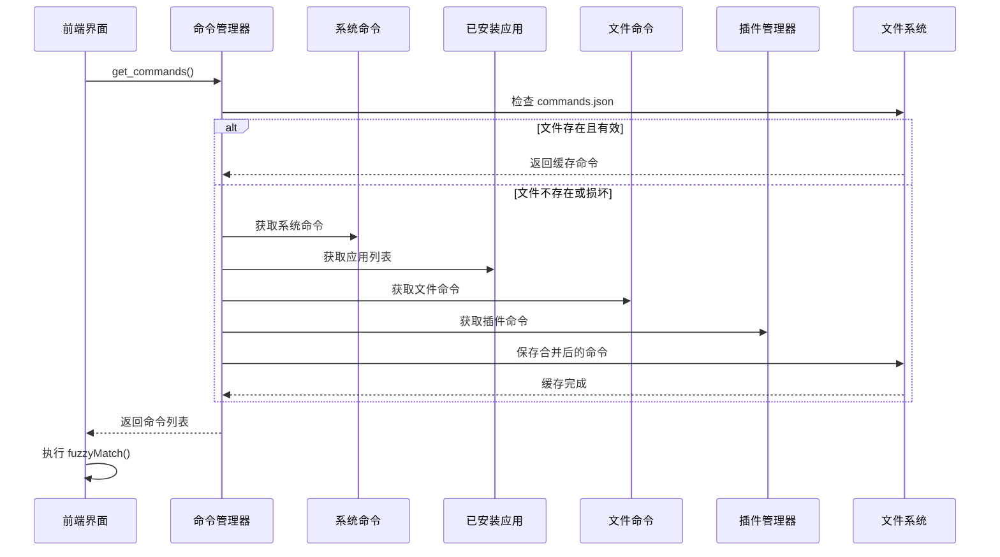
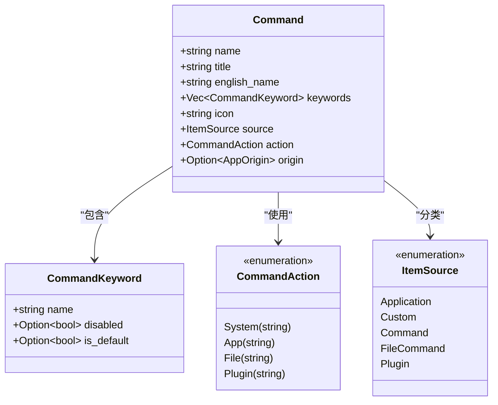
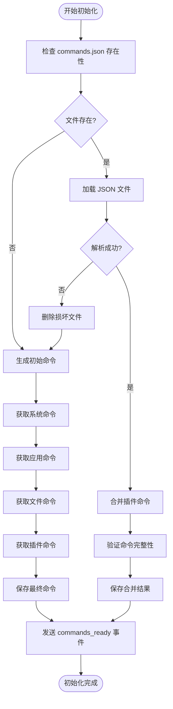
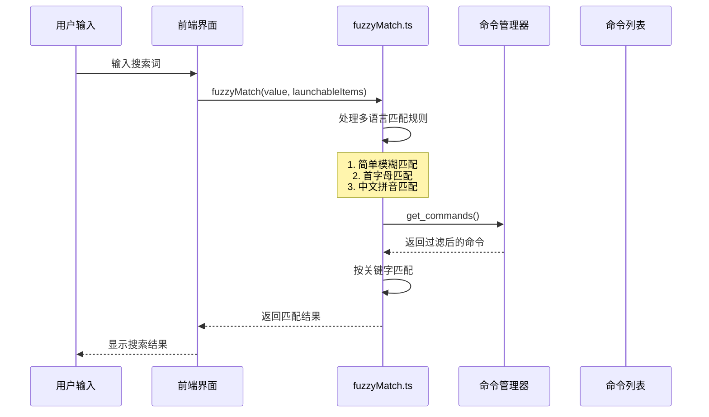
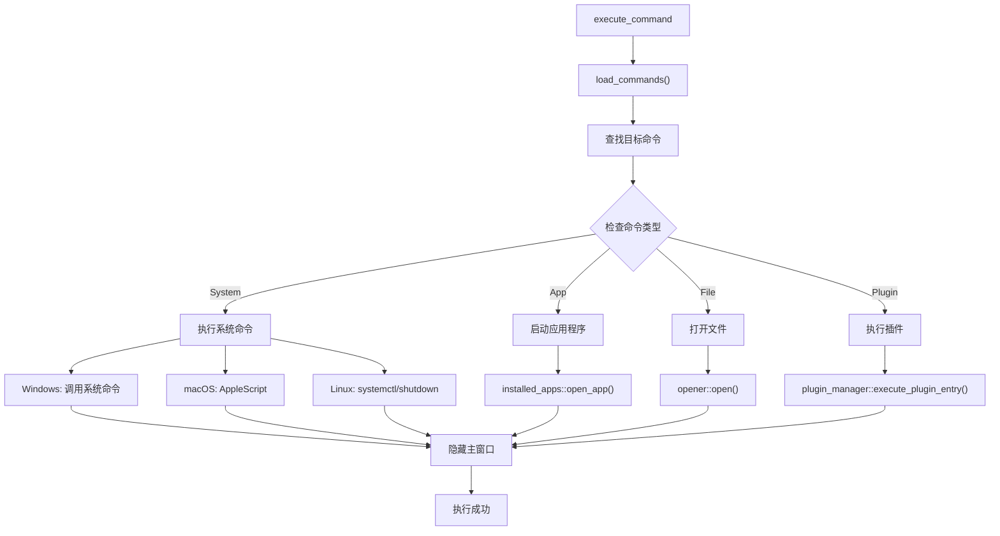
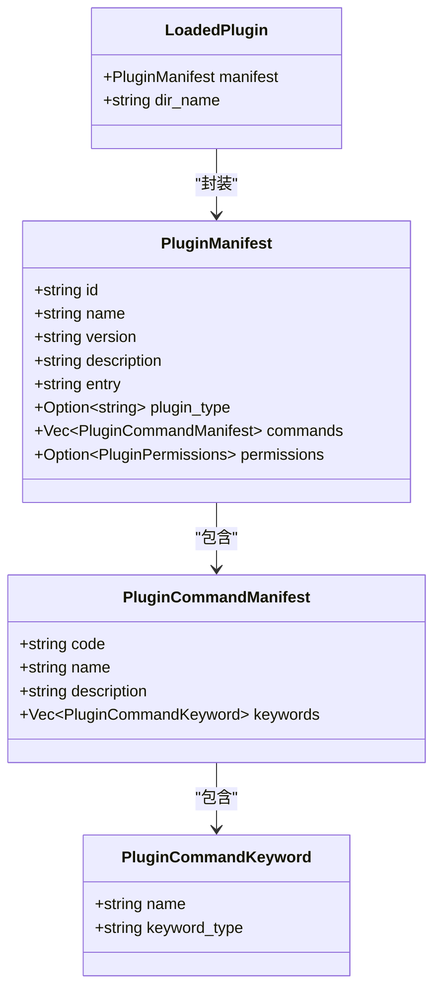
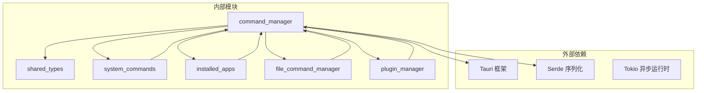

# 命令管理器

<cite>
**本文档中引用的文件**
- [command_manager.rs](file://src-tauri/src/command_manager.rs)
- [shared_types.rs](file://src-tauri/src/shared_types.rs)
- [system_commands.rs](file://src-tauri/src/system_commands.rs)
- [installed_apps/mod.rs](file://src-tauri/src/installed_apps/mod.rs)
- [plugin_manager.rs](file://src-tauri/src/plugin_manager.rs)
- [fuzzyMatch.ts](file://src/lib/utils/fuzzyMatch.ts)
- [type.ts](file://src/lib/type.ts)
- [lib.rs](file://src-tauri/src/lib.rs)
</cite>

## 目录
1. [简介](#简介)
2. [项目结构](#项目结构)
3. [核心组件](#核心组件)
4. [架构概览](#架构概览)
5. [详细组件分析](#详细组件分析)
6. [依赖关系分析](#依赖关系分析)
7. [性能考虑](#性能考虑)
8. [故障排除指南](#故障排除指南)
9. [结论](#结论)

## 简介

命令管理器（Command Manager）是 Baize 应用的核心组件之一，负责聚合和提供所有可执行命令。它作为命令中心，统一管理以下四类命令源：

1. **系统命令**：操作系统提供的基础命令（关机、重启、睡眠等）
2. **已安装应用程序命令**：从系统注册表或包管理器获取的应用程序列表
3. **自定义文件命令**：用户定义的文件快捷方式
4. **插件命令**：第三方插件提供的扩展功能

命令管理器通过 `get_commands` 函数协调各个子模块，实现命令的动态加载、缓存和搜索功能。

## 项目结构

命令管理器模块在项目中的组织结构如下：

**图表来源**
- [command_manager.rs](file://src-tauri/src/command_manager.rs#L1-L10)
- [shared_types.rs](file://src-tauri/src/shared_types.rs#L1-L20)
- [system_commands.rs](file://src-tauri/src/system_commands.rs#L1-L15)

## 核心组件

命令管理器的核心职责包括：

### 命令聚合器
负责从多个数据源收集命令信息：
- 系统命令：预定义的系统操作
- 应用程序命令：从系统获取的应用列表
- 文件命令：用户定义的文件快捷方式
- 插件命令：第三方插件提供的功能

### 缓存管理
维护本地 JSON 文件存储，确保命令数据的持久化和快速访问。

### 搜索引擎
集成模糊匹配算法，支持多语言（中文拼音、英文首字母）的智能搜索。

**章节来源**
- [command_manager.rs](file://src-tauri/src/command_manager.rs#L15-L30)
- [shared_types.rs](file://src-tauri/src/shared_types.rs#L1-L50)

## 架构概览

命令管理器采用分层架构设计，实现了清晰的职责分离：

**图表来源**
- [command_manager.rs](file://src-tauri/src/command_manager.rs#L25-L60)
- [system_commands.rs](file://src-tauri/src/system_commands.rs#L76-L109)

## 详细组件分析

### 命令数据结构

命令管理器使用统一的数据结构来表示所有类型的命令：

**图表来源**
- [shared_types.rs](file://src-tauri/src/shared_types.rs#L75-L100)
- [shared_types.rs](file://src-tauri/src/shared_types.rs#L45-L65)

### 命令加载流程

命令管理器的初始化过程包含复杂的逻辑处理：

**图表来源**
- [command_manager.rs](file://src-tauri/src/command_manager.rs#L32-L90)

### 模糊搜索机制

命令管理器与前端的模糊匹配功能协同工作：

**图表来源**
- [fuzzyMatch.ts](file://src/lib/utils/fuzzyMatch.ts#L9-L51)
- [command_manager.rs](file://src-tauri/src/command_manager.rs#L95-L100)

**章节来源**
- [command_manager.rs](file://src-tauri/src/command_manager.rs#L95-L133)
- [fuzzyMatch.ts](file://src/lib/utils/fuzzyMatch.ts#L1-L51)

### 命令执行机制

命令管理器支持多种类型的命令执行：

**图表来源**
- [system_commands.rs](file://src-tauri/src/system_commands.rs#L76-L109)
- [installed_apps/mod.rs](file://src-tauri/src/installed_apps/mod.rs#L45-L71)

**章节来源**
- [system_commands.rs](file://src-tauri/src/system_commands.rs#L76-L109)
- [installed_apps/mod.rs](file://src-tauri/src/installed_apps/mod.rs#L45-L71)

### 插件命令集成

命令管理器支持动态加载和管理插件命令：

**图表来源**
- [plugin_manager.rs](file://src-tauri/src/plugin_manager.rs#L15-L45)

**章节来源**
- [plugin_manager.rs](file://src-tauri/src/plugin_manager.rs#L15-L45)
- [command_manager.rs](file://src-tauri/src/command_manager.rs#L200-L250)

## 依赖关系分析

命令管理器的依赖关系展现了清晰的模块化设计：

**图表来源**
- [command_manager.rs](file://src-tauri/src/command_manager.rs#L1-L5)
- [lib.rs](file://src-tauri/src/lib.rs#L155-L182)

**章节来源**
- [command_manager.rs](file://src-tauri/src/command_manager.rs#L1-L10)
- [lib.rs](file://src-tauri/src/lib.rs#L155-L182)

## 性能考虑

命令管理器在设计时充分考虑了性能优化：

### 缓存策略
- 使用本地 JSON 文件缓存命令列表，避免重复扫描系统资源
- 支持增量更新，仅在必要时重新生成命令列表
- 实现命令状态的持久化存储

### 异步处理
- 所有 I/O 操作采用异步模式，避免阻塞主线程
- 并发处理多个命令源的数据获取
- 使用 Tokio 运行时优化异步任务调度

### 内存管理
- 使用引用计数和智能指针管理命令对象生命周期
- 实现命令列表的按需加载和懒惰计算
- 优化关键字匹配算法的内存使用

## 故障排除指南

### 常见问题及解决方案

#### 命令加载失败
**症状**：命令列表为空或显示错误
**原因**：commands.json 文件损坏或权限不足
**解决**：删除 corrupted commands.json 文件，系统将自动重新生成

#### 模糊匹配不准确
**症状**：搜索结果不符合预期
**原因**：关键字配置不完整或拼音匹配算法问题
**解决**：检查命令的关键字配置，确保包含常用搜索词

#### 插件命令不可用
**症状**：插件命令无法执行或显示异常
**原因**：插件未正确加载或权限配置错误
**解决**：检查插件目录结构和 manifest.json 配置

**章节来源**
- [command_manager.rs](file://src-tauri/src/command_manager.rs#L50-L70)

## 结论

命令管理器作为 Baize 应用的核心组件，成功实现了以下目标：

1. **统一管理**：将不同来源的命令整合为统一的接口
2. **高性能**：通过缓存和异步处理提供流畅的用户体验
3. **可扩展**：支持插件机制和自定义命令扩展
4. **智能化**：集成多语言模糊匹配提升搜索体验

该模块的设计体现了现代软件架构的最佳实践，为用户提供了强大而灵活的命令执行平台。通过清晰的职责分离和模块化设计，确保了系统的可维护性和可扩展性。