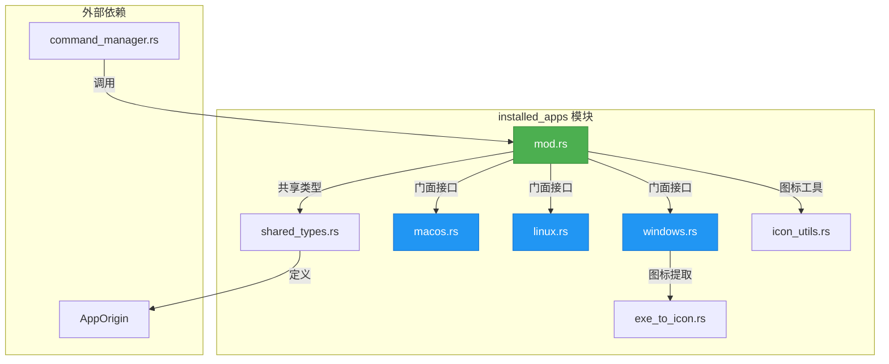
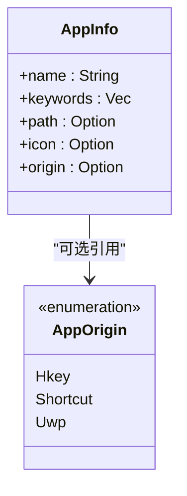
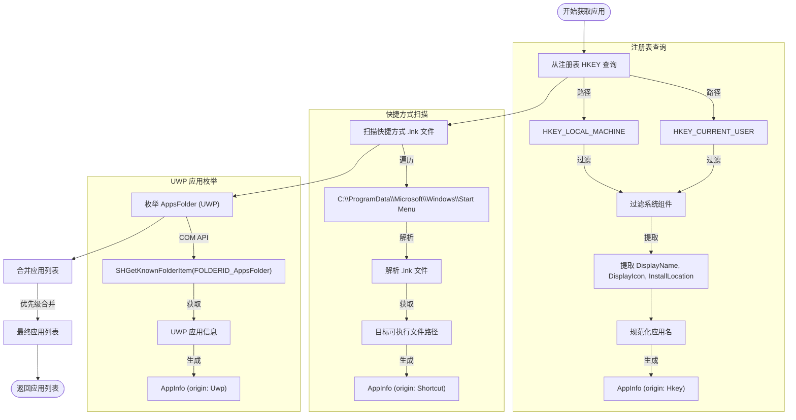

# 已安装应用管理

<cite>
**本文档中引用的文件**  
- [mod.rs](file://src-tauri/src/installed_apps/mod.rs)
- [windows.rs](file://src-tauri/src/installed_apps/windows.rs)
- [macos.rs](file://src-tauri/src/installed_apps/macos.rs)
- [linux.rs](file://src-tauri/src/installed_apps/linux.rs)
- [shared_types.rs](file://src-tauri/src/shared_types.rs)
- [command_manager.rs](file://src-tauri/src/command_manager.rs)
- [exe_to_icon.rs](file://src-tauri/src/installed_apps/exe_to_icon.rs)
- [icon_utils.rs](file://src-tauri/src/icon_utils.rs)
- [STATUS.md](file://STATUS.md)
</cite>

## 目录
1. [简介](#简介)
2. [模块架构概览](#模块架构概览)
3. [核心组件分析](#核心组件分析)
4. [跨平台实现策略](#跨平台实现策略)
   - [Windows 实现](#windows-实现)
   - [macOS 实现](#macos-实现)
   - [Linux 实现](#linux-实现)
5. [性能优化与缓存机制](#性能优化与缓存机制)
6. [与命令管理器的集成](#与命令管理器的集成)
7. [结论](#结论)

## 简介

`installed_apps` 模块是本项目中的一个核心功能组件，负责跨平台发现和管理系统上已安装的应用程序。该模块为前端应用提供了一个统一的接口，使其能够检索、显示和启动用户设备上的应用程序。本技术文档将深入分析该模块的架构设计、跨平台实现策略以及其与系统其他组件的集成方式。

该模块的设计遵循了Rust的模块化和条件编译特性，为Windows、macOS和Linux三大主流操作系统提供了各自独立的实现。通过一个门面（Facade）模式的公共接口，它向`command_manager`等上层模块隐藏了平台差异，确保了代码的可维护性和可扩展性。

**Section sources**
- [mod.rs](file://src-tauri/src/installed_apps/mod.rs#L1-L10)

## 模块架构概览

`installed_apps` 模块的架构设计清晰，采用了典型的门面模式。其根模块 `mod.rs` 定义了所有平台共享的公共数据结构和接口，而具体的平台实现则被封装在独立的模块文件中。

**Diagram sources**
- [mod.rs](file://src-tauri/src/installed_apps/mod.rs#L1-L70)
- [windows.rs](file://src-tauri/src/installed_apps/windows.rs#L1-L10)
- [macos.rs](file://src-tauri/src/installed_apps/macos.rs#L1-L10)
- [linux.rs](file://src-tauri/src/installed_apps/linux.rs#L1-L10)
- [shared_types.rs](file://src-tauri/src/shared_types.rs#L1-L20)

**Section sources**
- [mod.rs](file://src-tauri/src/installed_apps/mod.rs#L1-L70)

## 核心组件分析

### 公共接口与数据结构

`mod.rs` 文件是整个模块的入口点，它定义了跨平台的公共接口和数据结构。核心是 `AppInfo` 结构体，它标准化了从不同平台获取的应用信息。

**Diagram sources**
- [mod.rs](file://src-tauri/src/installed_apps/mod.rs#L10-L35)
- [shared_types.rs](file://src-tauri/src/shared_types.rs#L45-L50)

`fetch_installed_apps()` 函数是模块的核心异步函数，它利用Rust的条件编译（`#[cfg(target_os = "...")]`）在运行时选择并调用相应平台的实现，最终返回一个 `Vec<AppInfo>`。`open_app()` 命令则负责启动指定路径的应用程序。

**Section sources**
- [mod.rs](file://src-tauri/src/installed_apps/mod.rs#L37-L70)

## 跨平台实现策略

### Windows 实现

Windows平台的实现最为复杂，因为它需要从多个来源发现应用程序。`windows.rs` 模块综合运用了注册表查询、快捷方式扫描和UWP包枚举三种策略。

**Diagram sources**
- [windows.rs](file://src-tauri/src/installed_apps/windows.rs#L1-L720)

`get_apps_from_hkey()` 函数通过 `winreg` crate 访问注册表，从 `HKEY_LOCAL_MACHINE` 和 `HKEY_CURRENT_USER` 下的 `Uninstall` 键中读取已安装程序的列表。它会过滤掉系统组件和父级安装程序，并尝试从 `DisplayIcon` 或 `InstallLocation` 中