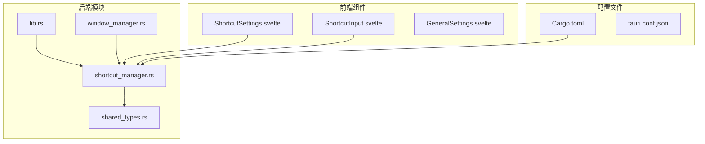
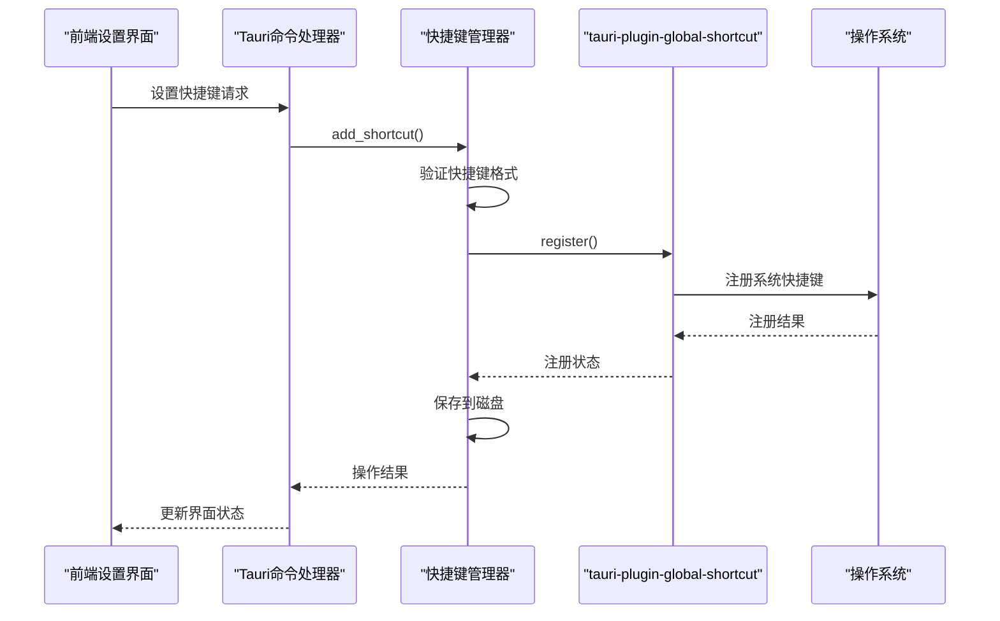
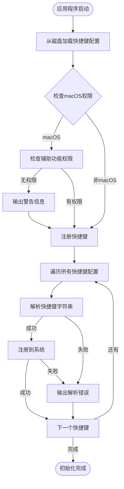
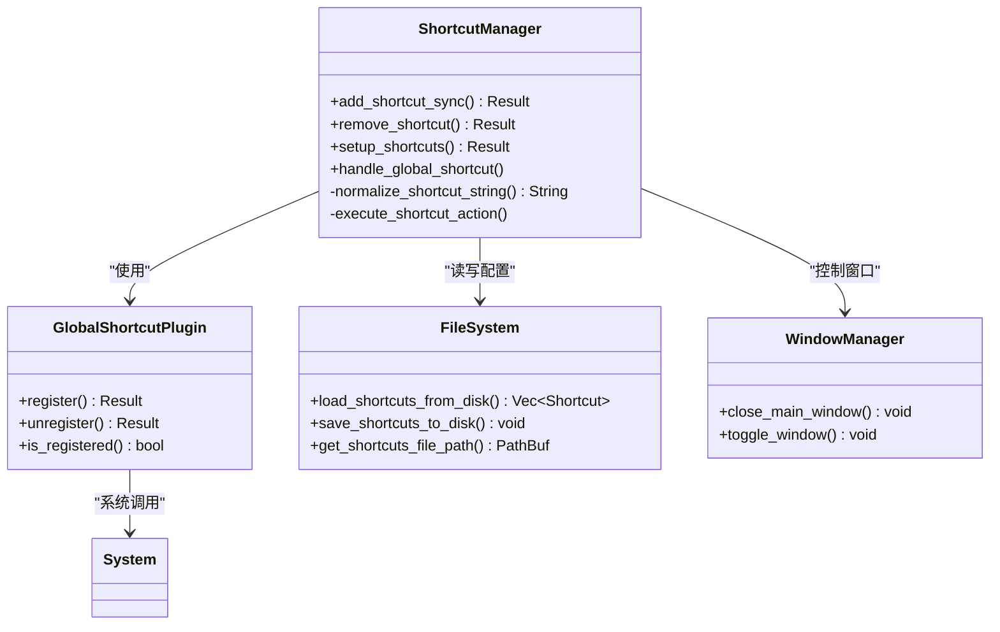
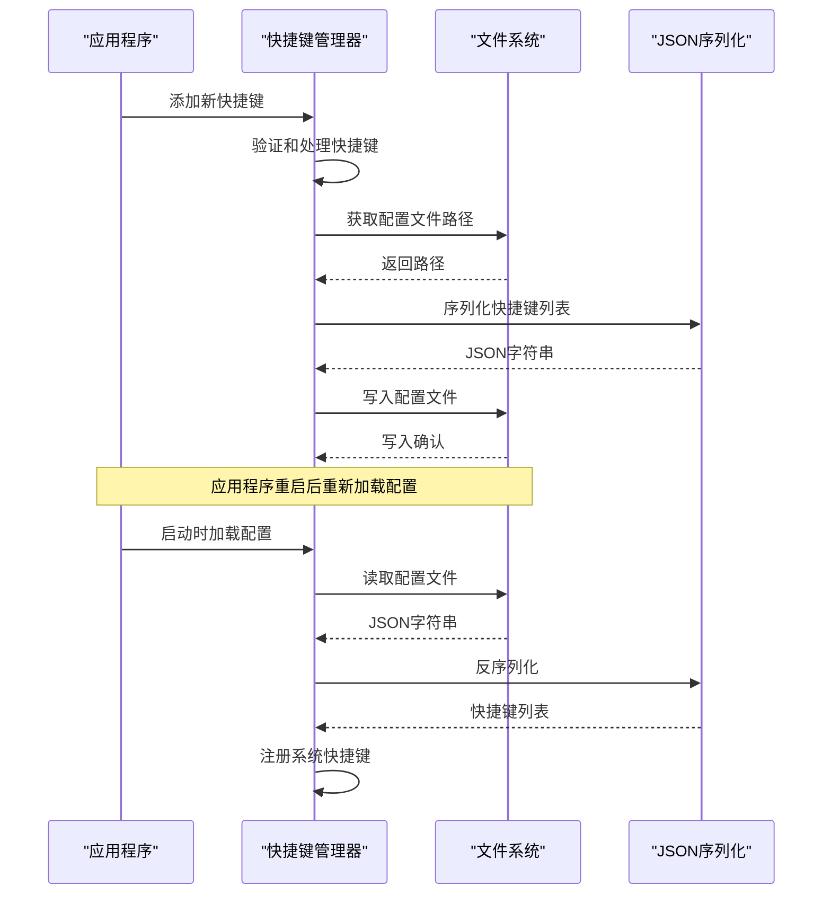
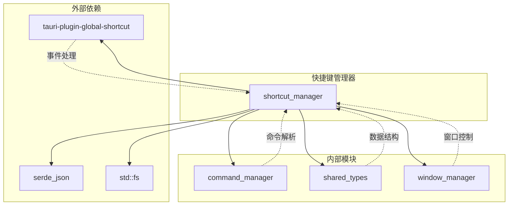

# 快捷键管理器

<cite>
**本文档中引用的文件**
- [shortcut_manager.rs](file://src-tauri/src/shortcut_manager.rs)
- [shared_types.rs](file://src-tauri/src/shared_types.rs)
- [lib.rs](file://src-tauri/src/lib.rs)
- [window_manager.rs](file://src-tauri/src/window_manager.rs)
- [ShortcutSettings.svelte](file://src/lib/components/settings/ShortcutSettings.svelte)
- [ShortcutInput.svelte](file://src/lib/components/settings/ShortcutInput.svelte)
- [Cargo.toml](file://src-tauri/Cargo.toml)
</cite>

## 目录
1. [简介](#简介)
2. [项目结构](#项目结构)
3. [核心组件](#核心组件)
4. [架构概览](#架构概览)
5. [详细组件分析](#详细组件分析)
6. [依赖关系分析](#依赖关系分析)
7. [性能考虑](#性能考虑)
8. [故障排除指南](#故障排除指南)
9. [结论](#结论)

## 简介

快捷键管理器是Baize应用程序中的核心模块，负责管理和处理全局系统快捷键。该模块主要通过`tauri-plugin-global-shortcut`插件实现，提供了完整的快捷键注册、管理和持久化功能。它特别专注于实现唤醒/隐藏主窗口的快捷键功能，同时也支持用户自定义的其他快捷键绑定。

该模块的设计遵循了现代桌面应用程序的最佳实践，提供了跨平台兼容性、错误处理和用户体验优化。通过与前端设置界面的紧密集成，用户可以轻松配置和管理他们的个性化快捷键。

## 项目结构

快捷键管理器模块位于`src-tauri/src/shortcut_manager.rs`文件中，是整个应用程序架构中的重要组成部分。以下是相关的文件结构：



**图表来源**
- [shortcut_manager.rs](file://src-tauri/src/shortcut_manager.rs#L1-L382)
- [shared_types.rs](file://src-tauri/src/shared_types.rs#L1-L128)
- [lib.rs](file://src-tauri/src/lib.rs#L1-L235)

**章节来源**
- [shortcut_manager.rs](file://src-tauri/src/shortcut_manager.rs#L1-L50)
- [Cargo.toml](file://src-tauri/Cargo.toml#L1-L71)

## 核心组件

快捷键管理器包含以下核心组件：

### 1. 快捷键状态管理器 (`ShortcutState`)
这是一个线程安全的状态容器，使用互斥锁保护存储的快捷键列表：
```rust
pub struct ShortcutState {
    pub shortcuts: Mutex<Vec<AppShortcut>>,
}
```

### 2. 快捷键数据结构 (`Shortcut`)
定义了快捷键的基本结构：
```rust
pub struct Shortcut {
    pub shortcut: String,
    pub command_name: String,
    #[serde(default, skip_serializing_if = "Option::is_none")]
    pub command_title: Option<String>,
}
```

### 3. 全局快捷键处理器
负责处理来自系统级别的快捷键事件，并将其路由到相应的命令执行器。

**章节来源**
- [shortcut_manager.rs](file://src-tauri/src/shortcut_manager.rs#L13-L16)
- [shared_types.rs](file://src-tauri/src/shared_types.rs#L88-L93)

## 架构概览

快捷键管理器采用分层架构设计，确保了模块间的清晰分离和高内聚低耦合：



**图表来源**
- [shortcut_manager.rs](file://src-tauri/src/shortcut_manager.rs#L67-L129)
- [lib.rs](file://src-tauri/src/lib.rs#L135-L157)

## 详细组件分析

### setup_shortcuts 函数分析

`setup_shortcuts`函数是快捷键管理器的初始化入口点，负责从磁盘加载已保存的快捷键配置并在应用程序启动时注册它们：



**图表来源**
- [shortcut_manager.rs](file://src-tauri/src/shortcut_manager.rs#L144-L162)

该函数的关键特性包括：

1. **跨平台兼容性**：针对macOS平台进行特殊处理，检查辅助功能权限
2. **错误恢复**：即使某个快捷键注册失败，也不会影响其他快捷键的正常工作
3. **配置持久化**：从磁盘加载上次会话的快捷键配置

### 快捷键注册流程

快捷键注册过程涉及多个步骤，确保了系统的稳定性和用户体验：



**图表来源**
- [shortcut_manager.rs](file://src-tauri/src/shortcut_manager.rs#L67-L129)
- [window_manager.rs](file://src-tauri/src/window_manager.rs#L40-L50)

### 快捷键配置持久化机制

快捷键配置的持久化通过JSON文件实现，提供了可靠的配置存储和恢复能力：



**图表来源**
- [shortcut_manager.rs](file://src-tauri/src/shortcut_manager.rs#L25-L46)

**章节来源**
- [shortcut_manager.rs](file://src-tauri/src/shortcut_manager.rs#L144-L162)
- [shortcut_manager.rs](file://src-tauri/src/shortcut_manager.rs#L25-L46)

### 跨平台快捷键注册挑战与解决方案

不同操作系统对全局快捷键的支持存在差异，快捷键管理器通过以下策略应对这些挑战：

#### macOS 平台特殊处理
```rust
#[cfg(target_os = "macos")]
{
    // 检查辅助功能权限
    if !check_accessibility_permissions() {
        eprintln!("Warning: Accessibility permissions not granted. Global shortcuts may not work properly.");
        eprintln!("Please grant accessibility permissions in System Preferences > Security & Privacy > Privacy > Accessibility");
    }
}
```

#### 快捷键标准化处理
为了确保跨平台的一致性，系统实现了快捷键字符串的标准化处理：

```rust
fn normalize_shortcut_string(shortcut_str: &str) -> String {
    let mut parts: Vec<&str> = shortcut_str.split('+').collect();
    let mut modifiers = Vec::new();
    let mut key = String::new();

    for part in parts.iter_mut() {
        let lower_part = part.to_lowercase();
        match lower_part.as_str() {
            "ctrl" | "control" => modifiers.push("ctrl"),
            "alt" => modifiers.push("alt"),
            "shift" => modifiers.push("shift"),
            "cmd" | "command" | "meta" | "super" => modifiers.push("cmd"),
            _ => {
                let mut key_part = *part;
                if key_part.starts_with("Key") && key_part.len() > 3 {
                    key_part = &key_part[3..];
                }
                key = key_part.to_string().to_uppercase();
            }
        }
    }

    modifiers.sort();
    
    if key.is_empty() {
        modifiers.join("+")
    } else if modifiers.is_empty() {
        key
    } else {
        format!("{}+{}", modifiers.join("+"), key)
    }
}
```

**章节来源**
- [shortcut_manager.rs](file://src-tauri/src/shortcut_manager.rs#L144-L162)
- [shortcut_manager.rs](file://src-tauri/src/shortcut_manager.rs#L164-L200)

### 前端集成与用户界面

前端通过Svelte组件提供了直观的快捷键配置界面：

#### 快捷键输入组件
`ShortcutInput.svelte`组件负责捕获用户的键盘输入并转换为标准的快捷键格式：

```typescript
const handleKeydown = (e: KeyboardEvent) => {
    e.preventDefault();
    e.stopPropagation();

    const parts: string[] = [];
    if (e.ctrlKey) parts.push("Ctrl");
    if (e.altKey) parts.push("Alt");
    if (e.shiftKey) parts.push("Shift");
    if (e.metaKey) parts.push("Super");

    const key = e.key;
    // 处理特殊键和按键映射
    // ...
    
    parts.push(finalKey);
    value = parts.join("+");
};
```

#### 快捷键设置界面
`ShortcutSettings.svelte`提供了完整的快捷键管理界面，允许用户：
- 查看现有的快捷键配置
- 添加新的快捷键绑定
- 移除不需要的快捷键
- 浏览可用的命令列表

**章节来源**
- [ShortcutInput.svelte](file://src/lib/components/settings/ShortcutInput.svelte#L7-L30)
- [ShortcutSettings.svelte](file://src/lib/components/settings/ShortcutSettings.svelte#L1-L50)

## 依赖关系分析

快捷键管理器与应用程序的其他模块存在密切的依赖关系：



**图表来源**
- [shortcut_manager.rs](file://src-tauri/src/shortcut_manager.rs#L1-L10)
- [Cargo.toml](file://src-tauri/Cargo.toml#L30-L70)

**章节来源**
- [shortcut_manager.rs](file://src-tauri/src/shortcut_manager.rs#L1-L10)
- [Cargo.toml](file://src-tauri/Cargo.toml#L30-L70)

## 性能考虑

快捷键管理器在设计时充分考虑了性能优化：

### 1. 异步操作
所有文件I/O操作都是异步的，避免阻塞主线程：
```rust
let app_handle = app.handle().clone();
tauri::async_runtime::spawn(async move {
    command_manager::init(&app_handle).await;
});
```

### 2. 线程安全
使用Mutex保护共享状态，确保多线程环境下的安全性：
```rust
pub struct ShortcutState {
    pub shortcuts: Mutex<Vec<AppShortcut>>,
}
```

### 3. 缓存机制
快捷键配置在内存中缓存，减少频繁的磁盘访问。

### 4. 错误隔离
单个快捷键注册失败不会影响其他快捷键的功能。

## 故障排除指南

### 常见问题及解决方案

#### 1. macOS辅助功能权限问题
**症状**：全局快捷键无法正常工作
**原因**：缺少辅助功能权限
**解决方案**：
```bash
# 检查权限
osascript -e "tell application \"System Events\" to get name of every process"

# 手动授予权限
# 系统偏好设置 > 安全性与隐私 > 隐私 > 辅助功能
```

#### 2. 快捷键冲突
**症状**：快捷键不响应或与其他应用冲突
**解决方案**：
- 检查系统级快捷键设置
- 使用不同的快捷键组合
- 确保快捷键格式正确（如`Ctrl+Alt+Space`）

#### 3. 配置文件损坏
**症状**：快捷键设置丢失或异常
**解决方案**：
- 删除`shortcuts.json`文件
- 重新配置快捷键
- 检查应用程序日志

**章节来源**
- [shortcut_manager.rs](file://src-tauri/src/shortcut_manager.rs#L144-L162)

## 结论

快捷键管理器是Baize应用程序中一个设计精良、功能完善的模块。它成功地解决了跨平台全局快捷键管理的复杂性，提供了用户友好的配置界面和可靠的持久化机制。

### 主要优势

1. **跨平台兼容性**：支持Windows、macOS和Linux平台
2. **用户友好**：直观的配置界面和实时反馈
3. **可靠性**：完善的错误处理和配置恢复机制
4. **扩展性**：模块化设计便于功能扩展

### 技术亮点

1. **异步架构**：充分利用Rust的并发特性
2. **类型安全**：强类型的命令和快捷键定义
3. **错误处理**：全面的错误捕获和恢复机制
4. **性能优化**：缓存和异步I/O提升响应速度

该模块为Baize应用程序提供了强大的全局快捷键功能，显著提升了用户体验和应用的实用性。通过持续的维护和改进，它将继续为用户提供便捷的快捷键管理体验。