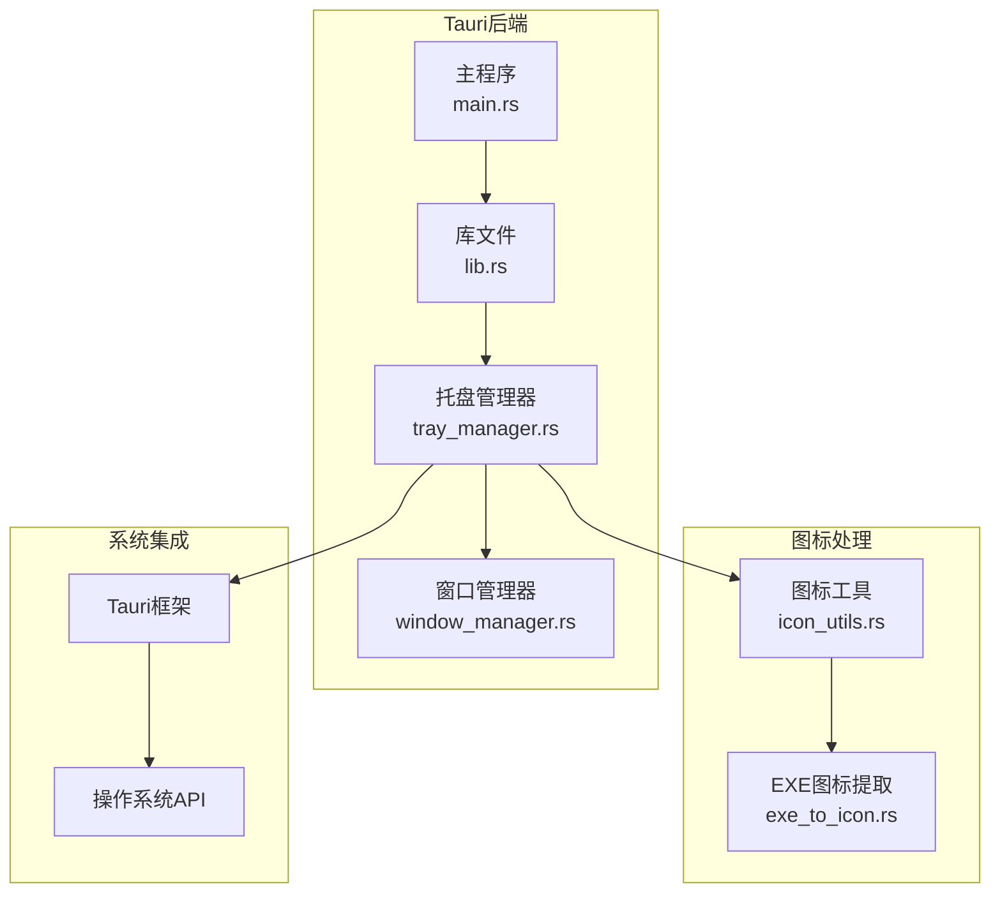
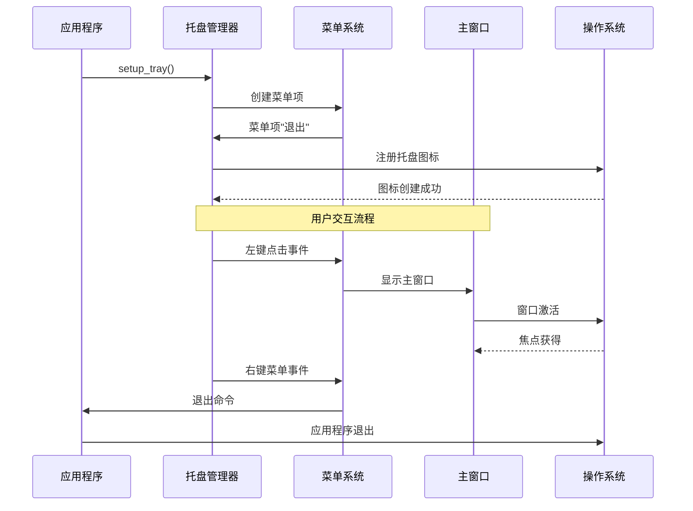
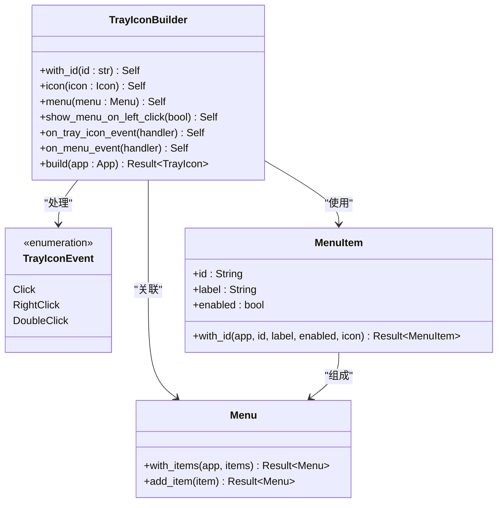
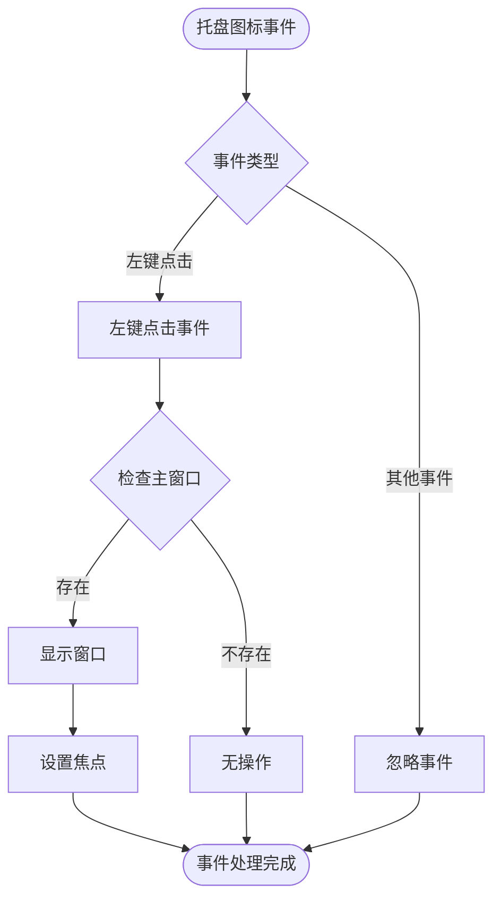
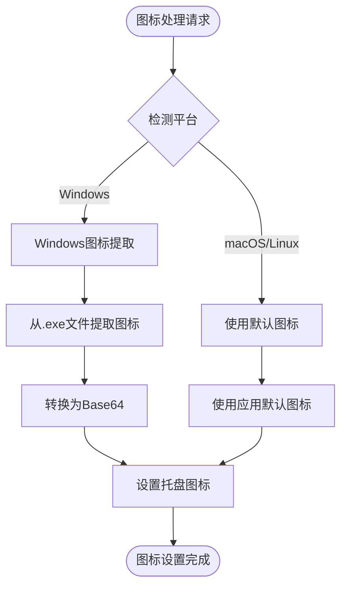
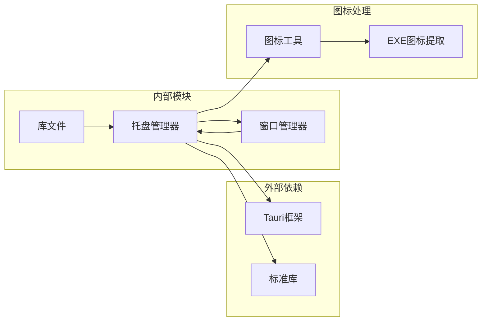

# 托盘管理器

<cite>
**本文档中引用的文件**
- [tray_manager.rs](file://src-tauri/src/tray_manager.rs)
- [window_manager.rs](file://src-tauri/src/window_manager.rs)
- [lib.rs](file://src-tauri/src/lib.rs)
- [main.rs](file://src-tauri/src/main.rs)
- [icon_utils.rs](file://src-tauri/src/icon_utils.rs)
- [exe_to_icon.rs](file://src-tauri/src/installed_apps/exe_to_icon.rs)
- [Cargo.toml](file://src-tauri/Cargo.toml)
</cite>

## 目录
1. [简介](#简介)
2. [项目结构](#项目结构)
3. [核心组件](#核心组件)
4. [架构概览](#架构概览)
5. [详细组件分析](#详细组件分析)
6. [依赖关系分析](#依赖关系分析)
7. [性能考虑](#性能考虑)
8. [故障排除指南](#故障排除指南)
9. [结论](#结论)

## 简介

托盘管理器（`tray_manager.rs`）是Baize应用程序中的关键组件，负责创建和管理系统托盘图标及其右键菜单。该模块提供了完整的托盘功能，包括图标显示/隐藏控制、菜单项管理和与主窗口的交互机制。托盘管理器采用跨平台设计，支持Windows、macOS和Linux操作系统，并通过Tauri框架实现原生系统集成。

## 项目结构

托盘管理器模块位于`src-tauri/src/tray_manager.rs`文件中，与其他核心模块紧密协作：



**图表来源**
- [tray_manager.rs](file://src-tauri/src/tray_manager.rs#L1-L67)
- [window_manager.rs](file://src-tauri/src/window_manager.rs#L1-L50)
- [lib.rs](file://src-tauri/src/lib.rs#L1-L50)

**章节来源**
- [tray_manager.rs](file://src-tauri/src/tray_manager.rs#L1-L67)
- [lib.rs](file://src-tauri/src/lib.rs#L1-L235)

## 核心组件

### 托盘图标标识符

托盘管理器使用统一的标识符来管理单个托盘图标：

```rust
// 托盘图标的唯一ID
pub const TRAY_ICON_ID: &str = "main_tray_icon";
```

### 可见性状态管理

托盘图标可见性通过互斥锁进行线程安全管理：

```rust
// 用于管理托盘图标可见性的状态
pub struct TrayVisibilityState(pub Mutex<bool>);
```

### 命令接口

托盘管理器提供两个主要的Tauri命令：

1. **设置托盘可见性**：
```rust
#[tauri::command]
pub fn set_tray_visibility(
    visible: bool,
    app: AppHandle,
    state: State<'_, TrayVisibilityState>,
) -> Result<(), String>
```

2. **检查托盘可见性**：
```rust
#[tauri::command]
pub fn is_tray_visible(state: State<'_, TrayVisibilityState>) -> bool
```

**章节来源**
- [tray_manager.rs](file://src-tauri/src/tray_manager.rs#L10-L35)

## 架构概览

托盘管理器采用事件驱动架构，通过Tauri框架的托盘API实现系统集成：



**图表来源**
- [tray_manager.rs](file://src-tauri/src/tray_manager.rs#L39-L66)
- [window_manager.rs](file://src-tauri/src/window_manager.rs#L40-L50)

## 详细组件分析

### 托盘图标构建器

托盘管理器使用`TrayIconBuilder`来创建和配置托盘图标：



**图表来源**
- [tray_manager.rs](file://src-tauri/src/tray_manager.rs#L39-L55)

### 菜单项构建

托盘菜单包含以下标准项目：

```rust
let quit_i = MenuItem::with_id(app, "quit", "Quit", true, None::<&str>)?;
let menu = Menu::with_items(app, &[&quit_i])?;
```

菜单项具有以下特性：
- **唯一标识符**："quit"
- **显示文本**："Quit"
- **启用状态**：true
- **图标**：无（None）

### 事件处理机制

托盘管理器实现了两种类型的事件处理：

#### 托盘图标事件



**图表来源**
- [tray_manager.rs](file://src-tauri/src/tray_manager.rs#L45-L55)

#### 菜单事件

```mermaid
flowchart TD
Start([菜单事件]) --> EventId{事件ID}
EventId --> |"quit"| QuitApp[退出应用程序]
EventId --> |其他| Ignore[忽略事件]
QuitApp --> ExitCode[app.exit(0)]
ExitCode --> End([应用程序退出])
Ignore --> End
```

**图表来源**
- [tray_manager.rs](file://src-tauri/src/tray_manager.rs#L56-L62)

### 与窗口管理器的交互

托盘图标通过窗口管理器控制主窗口的可见性：

```rust
// 左键点击事件处理
.on_tray_icon_event(|tray, event| match event {
    TrayIconEvent::Click {
        button: MouseButton::Left,
        button_state: MouseButtonState::Up,
        ..
    } => {
        let app = tray.app_handle();
        if let Some(window) = app.get_webview_window("main") {
            let _ = window.show();
            let _ = window.set_focus();
        }
    }
    _ => {}
})
```

这种设计确保了：
1. **窗口可见性同步**：托盘图标点击直接显示主窗口
2. **焦点管理**：自动设置窗口焦点
3. **优雅降级**：窗口不存在时的安全处理

**章节来源**
- [tray_manager.rs](file://src-tauri/src/tray_manager.rs#L39-L66)
- [window_manager.rs](file://src-tauri/src/window_manager.rs#L40-L50)

### 跨平台图标处理

托盘管理器支持多种平台的图标处理：



**图表来源**
- [icon_utils.rs](file://src-tauri/src/icon_utils.rs#L1-L18)
- [exe_to_icon.rs](file://src-tauri/src/installed_apps/exe_to_icon.rs#L1-L50)

**章节来源**
- [icon_utils.rs](file://src-tauri/src/icon_utils.rs#L1-L18)
- [exe_to_icon.rs](file://src-tauri/src/installed_apps/exe_to_icon.rs#L1-L213)

## 依赖关系分析

托盘管理器与多个核心模块存在依赖关系：



**图表来源**
- [tray_manager.rs](file://src-tauri/src/tray_manager.rs#L1-L10)
- [lib.rs](file://src-tauri/src/lib.rs#L1-L30)

### 外部依赖

托盘管理器依赖以下外部库：

1. **Tauri框架**：提供跨平台托盘API
2. **标准库**：`std::sync::Mutex`用于线程安全
3. **Windows API**：Windows平台的图标提取
4. **图像处理**：`image`和`base64`库用于图标转换

### 内部依赖

1. **窗口管理器**：通过`get_webview_window`获取主窗口
2. **图标工具**：使用`default_window_icon()`获取默认图标
3. **应用状态**：通过`AppHandle`访问应用实例

**章节来源**
- [tray_manager.rs](file://src-tauri/src/tray_manager.rs#L1-L10)
- [Cargo.toml](file://src-tauri/Cargo.toml#L1-L71)

## 性能考虑

### 线程安全设计

托盘管理器使用互斥锁确保线程安全：

```rust
pub struct TrayVisibilityState(pub Mutex<bool>);
```

这种设计的优势：
- **原子操作**：状态更新是原子的
- **内存安全**：避免数据竞争
- **可扩展性**：支持多线程环境

### 资源管理

托盘图标事件处理器采用优雅的资源清理：

```rust
// 事件处理中使用临时变量避免生命周期问题
.on_tray_icon_event(|tray, event| match event {
    TrayIconEvent::Click { .. } => {
        let app = tray.app_handle(); // 临时变量
        if let Some(window) = app.get_webview_window("main") {
            // 资源使用
        }
    }
    _ => {}
})
```

### 内存优化

- **延迟加载**：托盘图标仅在需要时创建
- **智能释放**：事件处理器自动清理临时资源
- **最小依赖**：仅导入必要的模块和功能

## 故障排除指南

### 常见问题及解决方案

#### 托盘图标不显示

**可能原因**：
1. 应用程序未正确初始化托盘
2. 图标文件损坏或不可访问
3. 权限问题

**解决方案**：
```rust
// 检查托盘是否成功创建
if let Err(e) = tray_manager::setup_tray(app) {
    eprintln!("[ERROR] Failed to set up tray: {}", e);
}
```

#### 菜单项无响应

**可能原因**：
1. 事件处理器未正确注册
2. 菜单项ID不匹配
3. 应用程序处于错误状态

**解决方案**：
```rust
// 验证菜单事件处理
.on_menu_event(|app, event| {
    if event.id.as_ref() == "quit" {
        app.exit(0);
    } else {
        eprintln!("Unknown menu item: {}", event.id);
    }
})
```

#### 窗口显示异常

**可能原因**：
1. 主窗口名称不匹配
2. 窗口状态冲突
3. 焦点管理问题

**解决方案**：
```rust
// 验证窗口获取
if let Some(window) = app.get_webview_window("main") {
    let _ = window.show();
    let _ = window.set_focus();
} else {
    eprintln!("Main window not found");
}
```

**章节来源**
- [tray_manager.rs](file://src-tauri/src/tray_manager.rs#L39-L66)

## 结论

托盘管理器是一个设计精良的模块，提供了完整的系统托盘功能。其主要优势包括：

### 设计优势

1. **简洁明了**：API设计直观易懂
2. **跨平台兼容**：支持主流操作系统
3. **事件驱动**：响应式编程模型
4. **线程安全**：使用互斥锁确保数据一致性

### 功能完整性

- **基本功能**：托盘图标创建、菜单管理
- **交互能力**：鼠标事件处理、键盘快捷键
- **状态管理**：图标可见性控制
- **错误处理**：优雅的异常处理机制

### 扩展性

托盘管理器为未来的功能扩展预留了空间：
- 支持更多菜单项类型
- 添加自定义图标支持
- 实现动态菜单更新
- 集成通知系统

这个模块展示了现代Rust应用程序中系统集成的最佳实践，为开发者提供了可靠、高效的托盘管理解决方案。