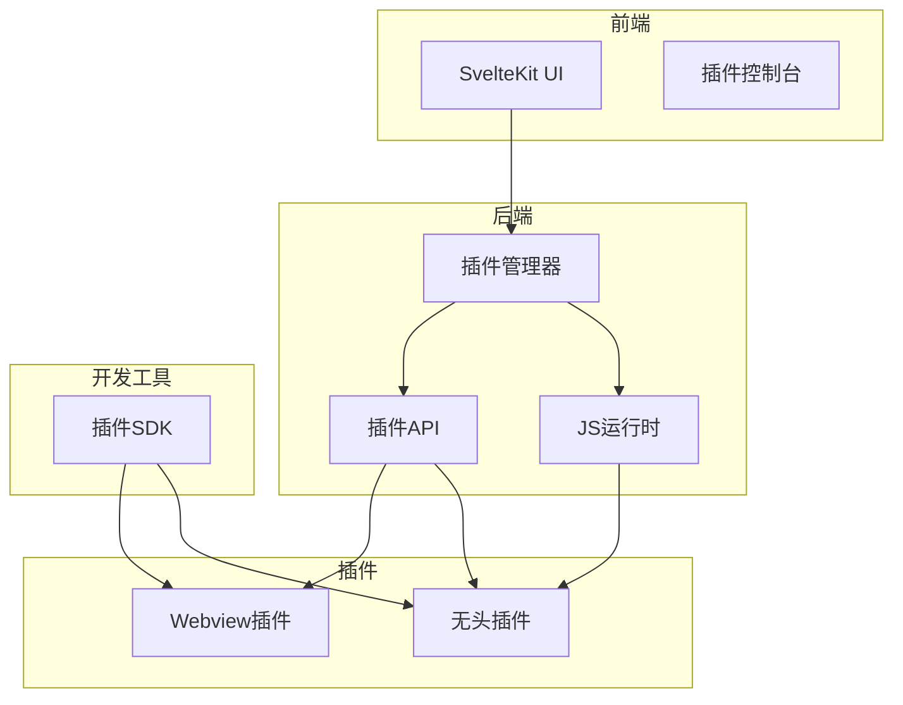
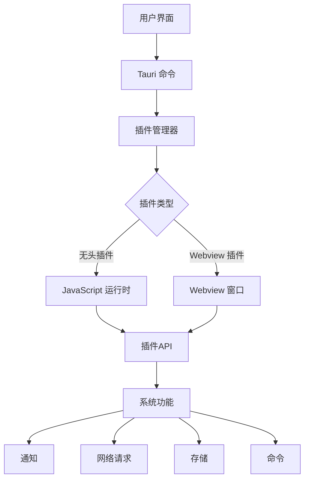
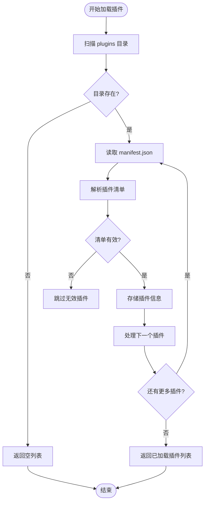
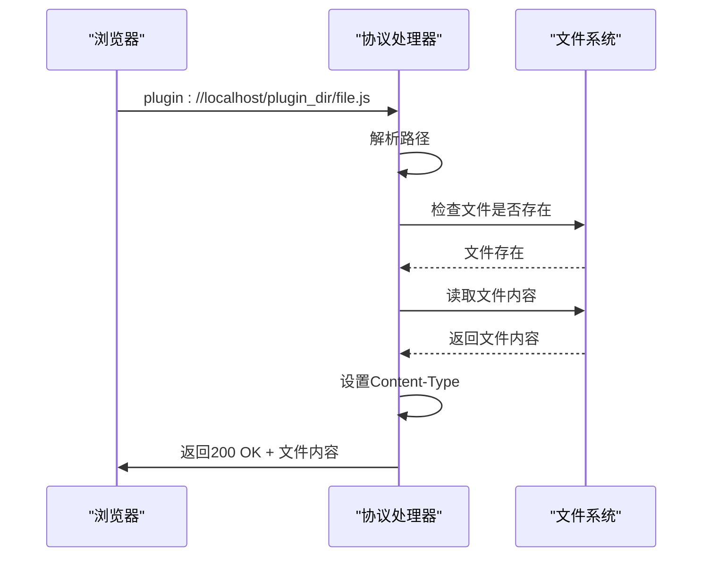
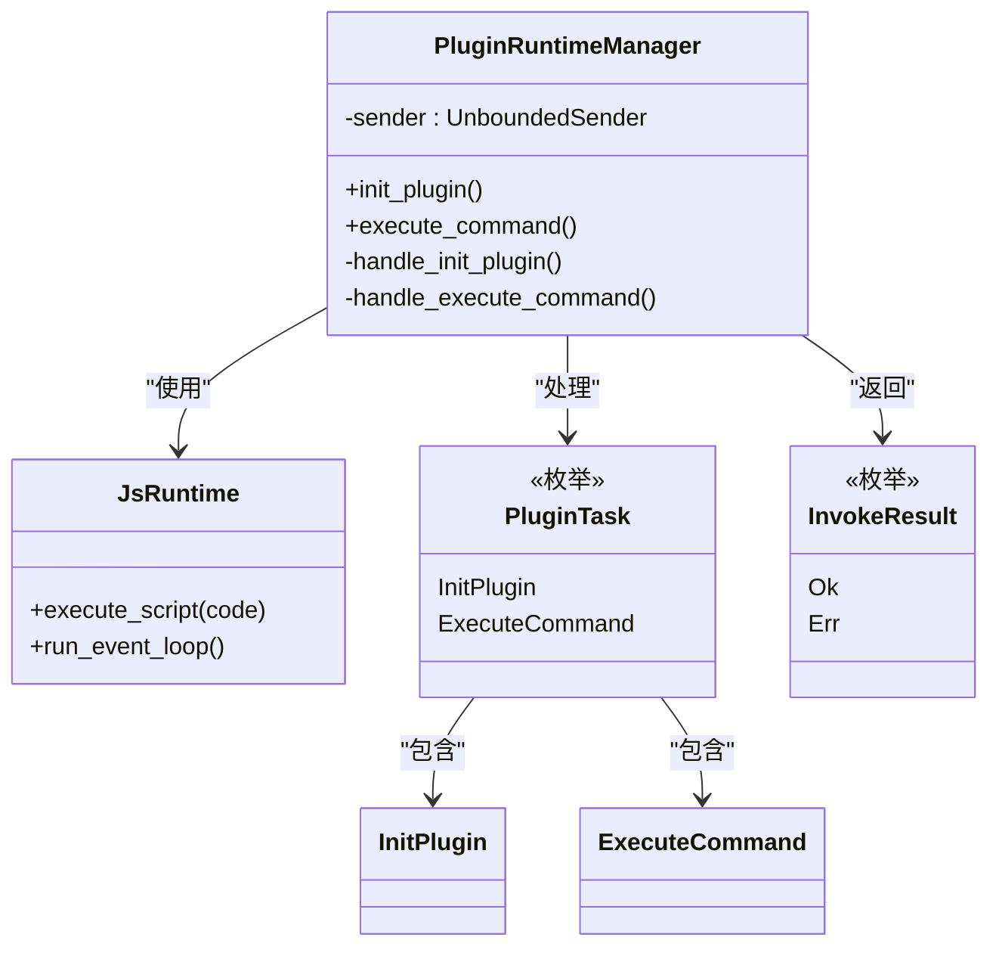
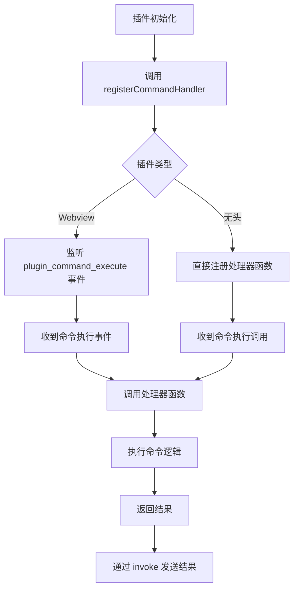
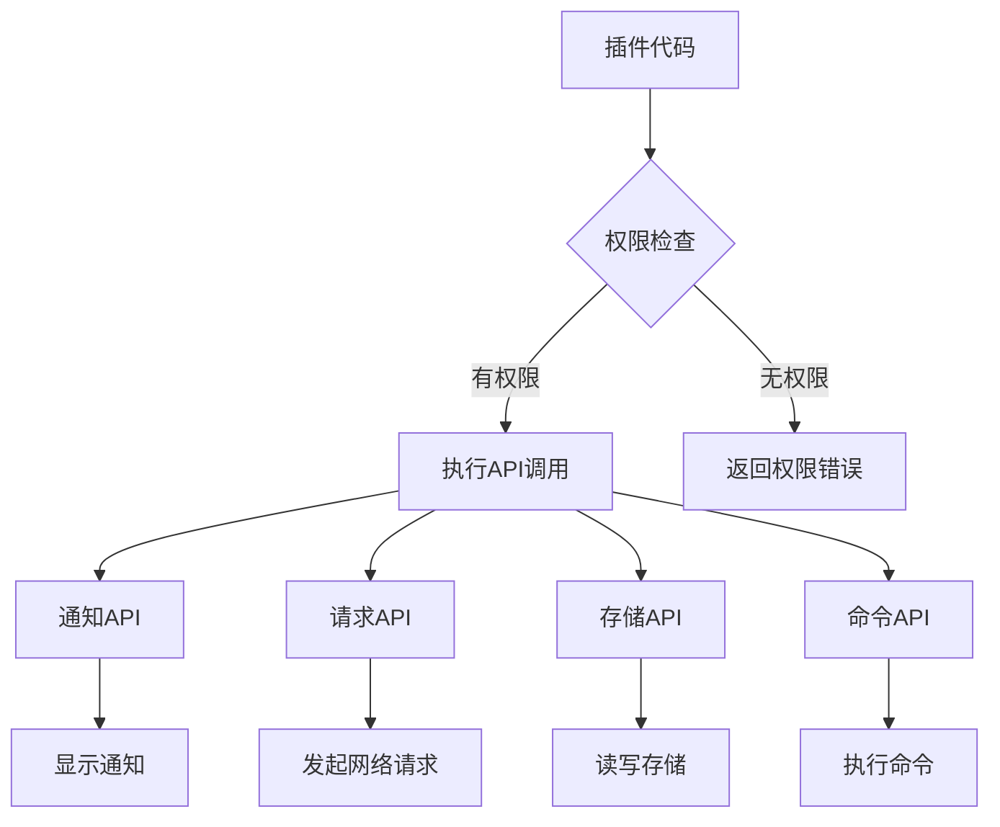
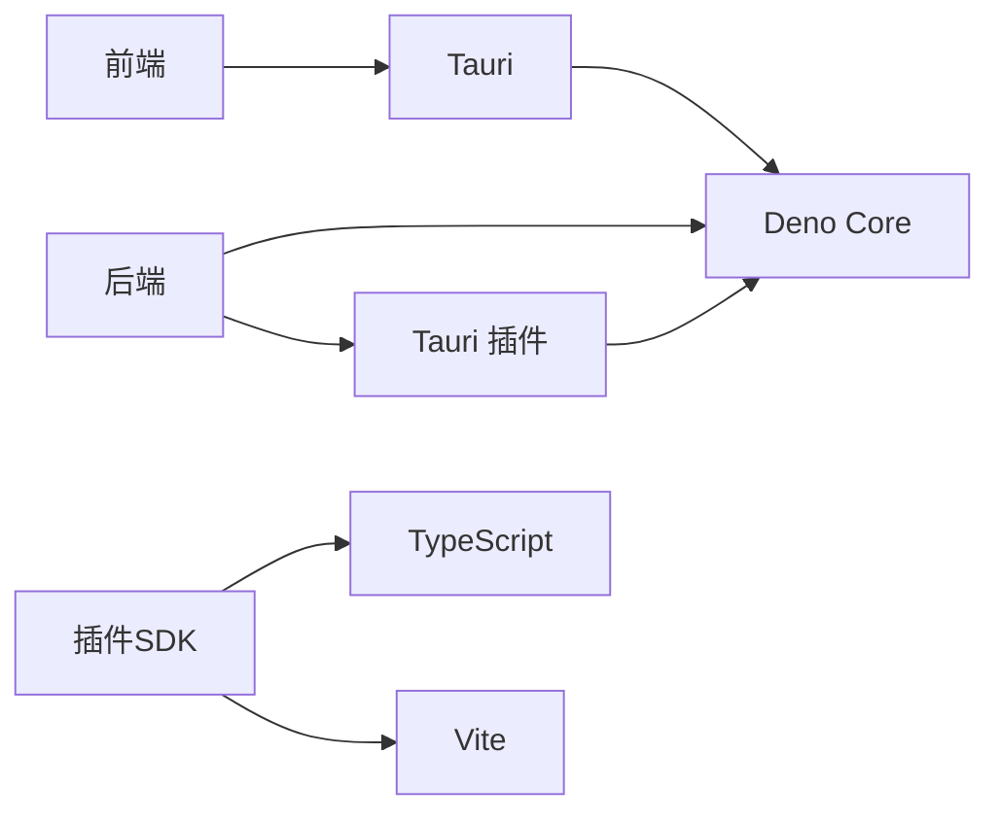

# 插件管理器

<cite>
**本文档中引用的文件**   
- [plugin_manager.rs](file://src-tauri/src/plugin_manager.rs) - *权限系统重构，引入命名空间结构*
- [js_runtime.rs](file://src-tauri/src/js_runtime.rs) - *实现插件存储管理功能*
- [lib.rs](file://src-tauri/src/lib.rs) - *初始化插件运行时管理器并注册存储命令*
- [command.rs](file://src-tauri/src/plugin_api/command.rs)
- [request.rs](file://src-tauri/src/plugin_api/request.rs)
- [notification.rs](file://src-tauri/src/plugin_api/notification.rs)
- [storage.rs](file://src-tauri/src/plugin_api/storage.rs)
- [index.ts](file://plugins-sdk/src/index.ts)
- [command.ts](file://plugins-sdk/src/api/command.ts)
- [PLUGIN_COMMAND_USAGE.md](file://PLUGIN_COMMAND_USAGE.md)
</cite>

## 更新摘要
**变更内容**   
- 更新了权限系统的架构描述，反映从扁平结构到命名空间结构的重构
- 新增了插件存储管理功能的详细说明
- 修正了JavaScript运行时初始化流程的描述
- 更新了`handle_plugin_protocol`函数的行为说明
- 增强了插件沙箱安全模型的分析

## 目录
1. [简介](#简介)
2. [项目结构](#项目结构)
3. [核心组件](#核心组件)
4. [架构概述](#架构概述)
5. [详细组件分析](#详细组件分析)
6. [依赖分析](#依赖分析)
7. [性能考虑](#性能考虑)
8. [故障排除指南](#故障排除指南)
9. [结论](#结论)

## 简介
本项目旨在构建一个快速启动应用程序，类似于 raycast、utools、alfred、wox。系统采用 Tauri + SvelteKit + TypeScript 技术栈，通过插件化架构实现功能扩展。插件管理器是系统的核心组件，负责插件的加载、初始化、协议处理和命令执行，为第三方开发者提供安全、类型化的 API 接口。

## 项目结构
项目采用分层架构，分为前端（SvelteKit）、后端（Tauri/Rust）和插件开发工具包（SDK）三个主要部分。插件系统通过 `plugins-sdk` 提供统一的 TypeScript API，后端通过 `plugin_manager.rs` 和 `js_runtime.rs` 实现插件的加载和执行。

**图示来源**
- [plugin_manager.rs](file://src-tauri/src/plugin_manager.rs#L1-L376)
- [js_runtime.rs](file://src-tauri/src/js_runtime.rs#L1-L499)
- [plugins-sdk](file://plugins-sdk)

**本节来源**
- [README.md](file://README.md#L1-L46)
- [project_structure](file://#L1-L100)

## 核心组件
插件管理器系统由多个核心组件构成，包括插件加载、JavaScript运行时、插件API和插件SDK。这些组件协同工作，实现插件的发现、加载、执行和通信。

**本节来源**
- [plugin_manager.rs](file://src-tauri/src/plugin_manager.rs#L1-L376)
- [js_runtime.rs](file://src-tauri/src/js_runtime.rs#L1-L499)
- [plugin_api](file://src-tauri/src/plugin_api)

## 架构概述
系统采用分层架构，前端通过 Tauri 命令与后端通信，后端插件管理器负责插件的生命周期管理。插件分为无头插件和 Webview 插件两种类型，分别通过 JavaScript 运行时和 IPC 通信与宿主应用交互。

**图示来源**
- [plugin_manager.rs](file://src-tauri/src/plugin_manager.rs#L1-L376)
- [js_runtime.rs](file://src-tauri/src/js_runtime.rs#L1-L499)
- [plugin_api](file://src-tauri/src/plugin_api)

## 详细组件分析

### 插件管理器分析
插件管理器负责扫描插件目录、加载插件清单、验证权限并初始化插件环境。它通过 `load_plugins` 函数扫描 `plugins` 目录，读取每个插件的 `manifest.json` 文件，并将插件信息存储在全局状态中。

**图示来源**
- [plugin_manager.rs](file://src-tauri/src/plugin_manager.rs#L1-L376)

**本节来源**
- [plugin_manager.rs](file://src-tauri/src/plugin_manager.rs#L1-L376)
- [PLUGIN_COMMAND_USAGE.md](file://PLUGIN_COMMAND_USAGE.md#L1-L220)

### 自定义协议处理分析
`handle_plugin_protocol` 函数负责处理 `plugin://` 自定义协议请求，将请求路由到相应的插件处理器。它解析请求路径，定位插件文件，并根据文件类型设置适当的 Content-Type 头部。

**图示来源**
- [plugin_manager.rs](file://src-tauri/src/plugin_manager.rs#L1-L376)

**本节来源**
- [plugin_manager.rs](file://src-tauri/src/plugin_manager.rs#L1-L376)

### JavaScript运行时分析
JavaScript 运行时为插件提供安全的执行环境，通过 Deno Core 实现。它支持异步操作和原生功能调用，如通知、网络请求和存储，同时通过沙箱机制限制插件的权限。

**图示来源**
- [js_runtime.rs](file://src-tauri/src/js_runtime.rs#L1-L499)

**本节来源**
- [js_runtime.rs](file://src-tauri/src/js_runtime.rs#L1-L499)

### 插件命令注册分析
插件命令通过 `registerCommandHandler` 函数注册，该函数在插件初始化时调用。它设置事件监听器，当宿主应用执行插件命令时，会调用注册的处理器函数。

**图示来源**
- [command.ts](file://plugins-sdk/src/api/command.ts#L1-L49)
- [command.rs](file://src-tauri/src/plugin_api/command.rs#L1-L176)

**本节来源**
- [command.ts](file://plugins-sdk/src/api/command.ts#L1-L49)
- [command.rs](file://src-tauri/src/plugin_api/command.rs#L1-L176)
- [PLUGIN_COMMAND_USAGE.md](file://PLUGIN_COMMAND_USAGE.md#L1-L220)

### 插件沙箱安全模型分析
插件沙箱通过权限系统和 API 限制实现安全隔离。插件只能访问其 manifest.json 中声明的权限，如特定域名的网络请求。API 调用通过类型安全的接口暴露，防止恶意代码访问系统资源。

**图示来源**
- [request.rs](file://src-tauri/src/plugin_api/request.rs#L1-L249)
- [storage.rs](file://src-tauri/src/plugin_api/storage.rs#L1-L188)

**本节来源**
- [request.rs](file://src-tauri/src/plugin_api/request.rs#L1-L249)
- [storage.rs](file://src-tauri/src/plugin_api/storage.rs#L1-L188)
- [PLUGIN_COMMAND_USAGE.md](file://PLUGIN_COMMAND_USAGE.md#L1-L220)

## 依赖分析
系统依赖关系清晰，前端依赖 Tauri 框架，后端依赖 Deno Core 和 Tauri 插件，插件 SDK 依赖 TypeScript 和相关构建工具。所有依赖都通过包管理器进行版本控制。

**图示来源**
- [Cargo.toml](file://src-tauri/Cargo.toml#L1-L50)
- [package.json](file://package.json#L1-L50)
- [pnpm-lock.yaml](file://pnpm-lock.yaml#L1-L50)

**本节来源**
- [Cargo.toml](file://src-tauri/Cargo.toml#L1-L50)
- [package.json](file://package.json#L1-L50)
- [pnpm-lock.yaml](file://pnpm-lock.yaml#L1-L50)

## 性能考虑
系统在性能方面进行了多项优化，包括插件运行时的持久化、命令执行的异步处理和资源的缓存机制。这些优化确保了插件的快速加载和响应。

## 故障排除指南
常见问题包括插件加载失败、命令执行超时和权限错误。解决方案包括检查插件目录权限、验证 manifest.json 格式和确保网络权限配置正确。

**本节来源**
- [PLUGIN_COMMAND_USAGE.md](file://PLUGIN_COMMAND_USAGE.md#L1-L220)
- [plugin_manager.rs](file://src-tauri/src/plugin_manager.rs#L1-L376)

## 结论
插件管理器系统通过模块化设计和安全沙箱机制，为第三方开发者提供了强大的扩展能力。系统架构清晰，组件职责明确，为快速启动应用程序的功能扩展奠定了坚实基础。