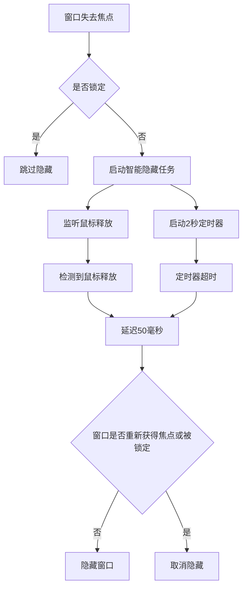

# 窗口管理器

<cite>
**本文档中引用的文件**  
- [window_manager.rs](file://src-tauri/src/window_manager.rs)
- [lib.rs](file://src-tauri/src/lib.rs)
</cite>

## 目录
1. [简介](#简介)
2. [核心职责](#核心职责)
3. [智能隐藏机制](#智能隐藏机制)
4. [全局原子布尔值](#全局原子布尔值)
5. [窗口显示与隐藏函数](#窗口显示与隐藏函数)
6. [前端调用示例](#前端调用示例)

## 简介
`window_manager.rs` 模块是 Tauri 应用程序中负责主窗口生命周期管理的核心组件。该模块实现了复杂的窗口行为控制逻辑，包括窗口的显示、隐藏、焦点管理和跨平台兼容性处理。通过结合事件监听、定时器和状态管理，该模块确保了用户交互的流畅性和可靠性。

**Section sources**
- [window_manager.rs](file://src-tauri/src/window_manager.rs#L0-L37)

## 核心职责
`window_manager.rs` 模块的核心职责是管理主窗口的整个生命周期，包括创建、显示、隐藏和销毁。该模块通过监听窗口事件来响应用户的操作，如焦点变化、鼠标事件等。它还负责处理快捷键（如 ESC 键）的注册和注销，确保在适当的时候启用或禁用这些快捷键。此外，该模块还与其他组件（如托盘图标、快捷方式管理器）协同工作，提供一致的用户体验。

**Section sources**
- [window_manager.rs](file://src-tauri/src/window_manager.rs#L32-L68)

## 智能隐藏机制
该模块实现了一种"智能隐藏"机制，旨在防止在拖放操作期间窗口意外关闭。这一机制结合了鼠标释放事件（通过 `RDEV_EVENT_CHANNEL`）和超时定时器。当窗口失去焦点时，系统会启动一个异步任务，该任务同时监听鼠标左键释放事件和一个 2 秒的超时定时器。如果在超时前检测到鼠标释放事件，则执行隐藏操作；否则，在超时后执行隐藏。这种设计确保了在拖放文件时窗口不会立即关闭，从而提升了用户体验。



**Diagram sources**
- [window_manager.rs](file://src-tauri/src/window_manager.rs#L150-L196)
- [lib.rs](file://src-tauri/src/lib.rs#L27)

**Section sources**
- [window_manager.rs](file://src-tauri/src/window_manager.rs#L150-L196)
- [lib.rs](file://src-tauri/src/lib.rs#L27)

## 全局原子布尔值
该模块使用了两个重要的全局原子布尔值：`WINDOW_LOCK` 和 `WINDOW_SHOWING`。`WINDOW_CLOSE_LOCK_STATE` 是一个 `AtomicU32` 类型的计数器，用于防止在特定操作（如文件对话框打开或拖放操作）期间窗口被关闭。当需要锁定窗口时，计数器递增；操作完成后，计数器递减。只有当计数器为 0 时，才允许执行隐藏操作。`WINDOW_SHOWING` 状态则通过 `hiding_initiated_by_command` 标志来跟踪，该标志是一个 `AtomicBool`，用于区分是用户主动请求隐藏还是由于失去焦点而自动隐藏。

**Section sources**
- [window_manager.rs](file://src-tauri/src/window_manager.rs#L0-L37)

## 窗口显示与隐藏函数
`show_main_window` 和 `hide_main_window` 函数通过 Tauri 的窗口 API 与主窗口进行交互。`close_main_window` 命令函数首先获取主窗口的句柄，然后调用 `hide()` 方法来隐藏窗口。在执行隐藏操作之前，它会设置 `hiding_initiated_by_command` 标志，以通知窗口事件监听器这是有意的隐藏操作，避免在失去焦点时重复隐藏。该函数还处理跨平台的焦点问题，确保在不同操作系统上都能正确地管理窗口状态。

**Section sources**
- [window_manager.rs](file://src-tauri/src/window_manager.rs#L32-L68)

## 前端调用示例
前端可以通过 `invoke` 调用 `close_main_window` 命令来隐藏主窗口。例如，在 JavaScript 中可以使用以下代码：
```javascript
import { invoke } from '@tauri-apps/api/tauri';
await invoke('close_main_window');
```
此外，前端还可以监听 `window_visibility` 事件来响应窗口可见性变化。托盘图标的点击事件也会触发窗口的显示和聚焦操作，这在 `tray_manager.rs` 中实现。快捷方式管理器也提供了切换窗口可见性的功能，允许用户通过自定义快捷键来显示或隐藏窗口。

**Section sources**
- [window_manager.rs](file://src-tauri/src/window_manager.rs#L32-L68)
- [tray_manager.rs](file://src-tauri/src/tray_manager.rs#L39-L66)
- [shortcut_manager.rs](file://src-tauri/src/shortcut_manager.rs#L277-L317)