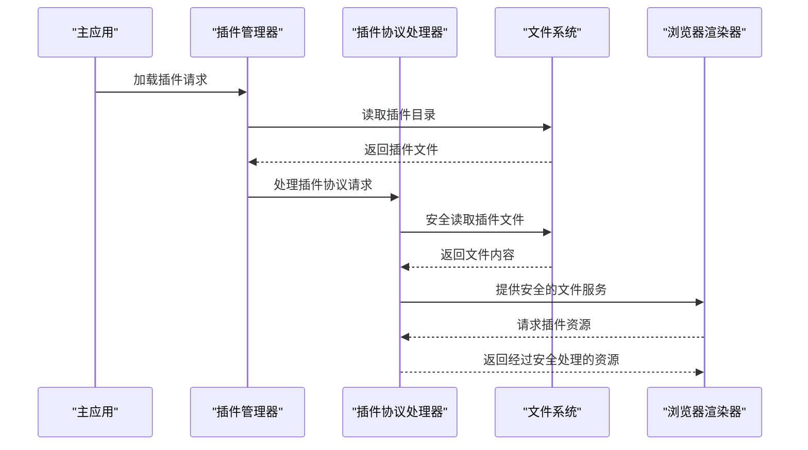
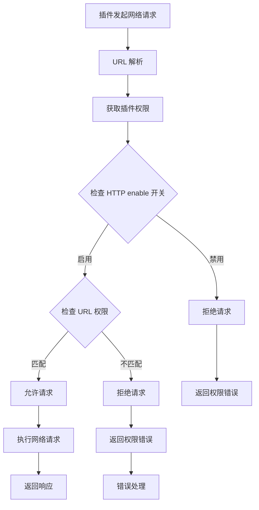
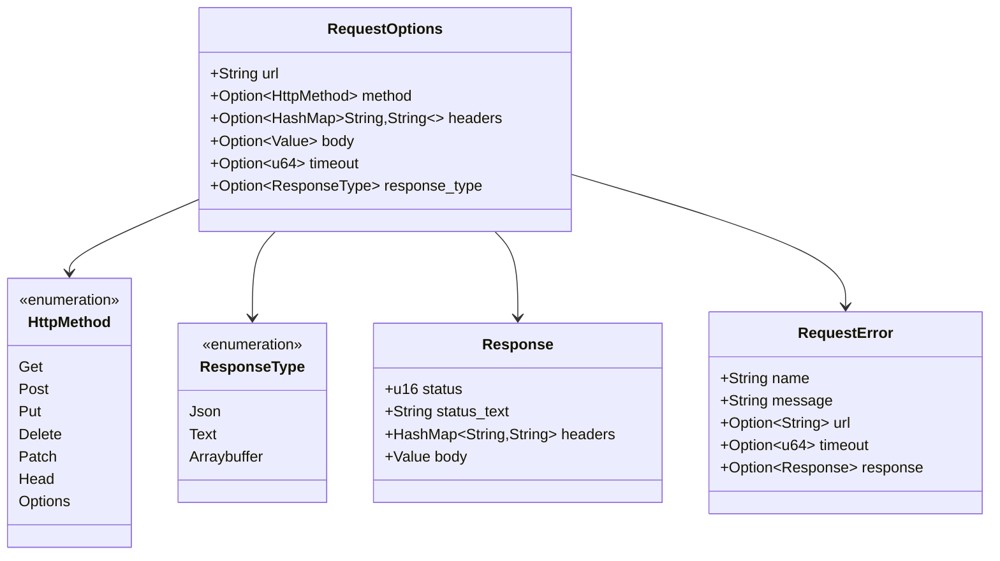
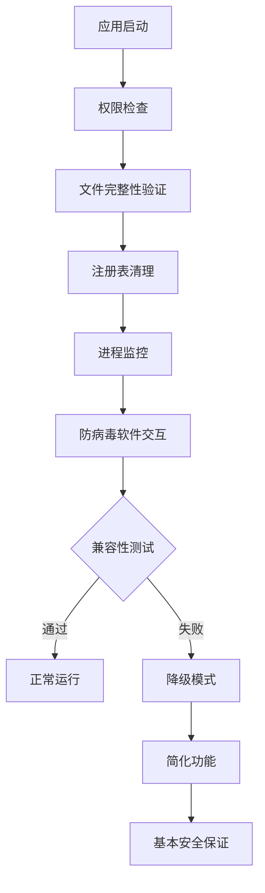

# 安全模型

<cite>
**本文档引用的文件**
- [tauri.conf.json](file://src-tauri/tauri.conf.json)
- [request.rs](file://src-tauri/src/plugin_api/request.rs)
- [plugin_manager.rs](file://src-tauri/src/plugin_manager.rs)
- [plugin.json](file://src-tauri/capabilities/plugin.json)
- [desktop.json](file://src-tauri/capabilities/desktop.json)
- [lib.rs](file://src-tauri/src/lib.rs)
- [command.rs](file://src-tauri/src/plugin_api/command.rs)
- [permissions.ts](file://plugins-sdk/src/types/permissions.ts) - *新增权限类型定义*
</cite>

## 更新摘要
**变更内容**
- 更新了插件权限模型，反映从扁平结构到命名空间结构的重构
- 重写了网络权限控制章节，以准确描述新的 `http` 权限结构和 `enable` 开关机制
- 更新了请求API设计部分，包含新的权限检查逻辑
- 修正了插件权限声明的JSON示例
- 添加了对 `HttpPermission`、`StoragePermission` 等新结构体的说明

### 目录
1. [简介](#简介)
2. [内容安全策略(CSP)](#内容安全策略csp)
3. [插件沙箱机制](#插件沙箱机制)
4. [网络权限控制](#网络权限控制)
5. [请求API设计](#请求api设计)
6. [代码签名与防病毒兼容性](#代码签名与防病毒兼容性)
7. [用户数据安全处理](#用户数据安全处理)
8. [安全审计检查清单](#安全审计检查清单)
9. [结论](#结论)

## 简介

Baize 应用采用多层安全架构来保护用户数据和系统完整性。该安全模型基于 Tauri 框架的安全特性，结合了内容安全策略、插件沙箱、权限控制和代码签名等多种安全机制。本文档详细阐述了这些安全措施的实现原理和最佳实践。

## 内容安全策略(CSP)

### CSP 配置详解

Baize 应用在 `tauri.conf.json` 中配置了严格的内容安全策略，有效防止跨站脚本攻击(XSS)和其他代码注入威胁：

```json
{
  "security": {
    "csp": "default-src 'self' plugin: 'unsafe-inline' 'unsafe-eval'; script-src 'self' plugin: 'unsafe-inline' 'unsafe-eval'; style-src 'self' plugin: 'unsafe-inline'; img-src 'self' plugin: data:; font-src 'self' plugin:; connect-src 'self' plugin:;"
  }
}
```

### CSP 规则解析

```mermaid
flowchart TD
A["CSP 配置"] --> B["default-src"]
A --> C["script-src"]
A --> D["style-src"]
A --> E["img-src"]
A --> F["font-src"]
A --> G["connect-src"]
B --> B1["'self' - 只允许同源资源"]
B --> B2["plugin: - 允许插件协议"]
B --> B3["'unsafe-inline' - 允许内联脚本"]
B --> B4["'unsafe-eval' - 允许动态代码执行"]
C --> C1["'self' - 同源脚本"]
C --> C2["plugin: - 插件脚本"]
C --> C3["'unsafe-inline' - 内联脚本"]
C --> C4["'unsafe-eval' - 动态代码"]
D --> D1["'self' - 同源样式"]
D --> D2["plugin: - 插件样式"]
D --> D3["'unsafe-inline' - 内联样式"]
E --> E1["'self' - 同源图片"]
E --> E2["plugin: - 插件图片"]
E --> E3["data: - data URI 图片"]
F --> F1["'self' - 同源字体"]
F --> F2["plugin: - 插件字体"]
G --> G1["'self' - 同源连接"]
G --> G2["plugin: - 插件连接"]
```



**图表来源**
- [tauri.conf.json](file://src-tauri/tauri.conf.json#L25-L27)

### CSP 安全优势

1. **严格的资源来源控制**：通过 `'self'` 限制只允许同源资源
2. **插件协议支持**：通过 `plugin:` 协议支持插件系统的安全扩展
3. **有限的不安全选项**：仅在必要时使用 `'unsafe-inline'` 和 `'unsafe-eval'`
4. **数据 URI 支持**：允许 `data:` 图片以支持插件资源加载

**章节来源**
- [tauri.conf.json](file://src-tauri/tauri.conf.json#L25-L27)

## 插件沙箱机制

### 插件协议架构

Baize 实现了完整的插件沙箱机制，通过自定义的 `plugin://` 协议来隔离插件环境：



**图表来源**
- [plugin_manager.rs](file://src-tauri/src/plugin_manager.rs#L140-L220)

### 插件权限模型

根据权限系统重构，每个插件必须在 `manifest.json` 中声明其权限需求，采用新的命名空间结构：

```json
{
  "permissions": {
    "http": {
      "enable": true,
      "allowUrls": [
        "https://api.example.com/*",
        "https://*.trusted-domain.com/*"
      ],
      "timeout": 30000,
      "maxRetries": 3
    },
    "storage": {
      "enable": true,
      "local": true,
      "session": false,
      "maxSize": "10MB"
    }
  }
}
```

### 插件隔离机制

1. **独立命名空间**：每个插件运行在独立的命名空间中
2. **协议隔离**：通过 `plugin://` 协议限制插件访问范围
3. **权限验证**：运行时验证插件权限声明
4. **资源限制**：限制插件可访问的系统资源

**章节来源**
- [plugin_manager.rs](file://src-tauri/src/plugin_manager.rs#L51-L55)
- [permissions.ts](file://plugins-sdk/src/types/permissions.ts#L1-L74)

## 网络权限控制

### 权限检查机制

插件的网络请求受到严格的权限控制，确保只能访问授权的域名，并且需要显式启用HTTP权限：



**图表来源**
- [request.rs](file://src-tauri/src/plugin_api/request.rs#L180-L249)
- [plugin_manager.rs](file://src-tauri/src/plugin_manager.rs#L51-L55)

### 权限验证流程

1. **URL 解析**：验证请求 URL 的合法性
2. **插件识别**：根据插件 ID 查找对应的插件信息
3. **权限开关检查**：首先检查 `permissions.http.enable` 是否为 `true`
4. **权限匹配**：检查请求 URL 是否匹配 `permissions.http.allowUrls` 中的模式
5. **安全放行**：只有通过所有检查的请求才能被执行

**章节来源**
- [request.rs](file://src-tauri/src/plugin_api/request.rs#L180-L249)
- [PERMISSIONS_REFACTOR.md](file://PERMISSIONS_REFACTOR.md#L51-L55)

## 请求API设计

### API 架构设计

`request` API 设计遵循最小权限原则，同时提供必要的功能：



**图表来源**
- [request.rs](file://src-tauri/src/plugin_api/request.rs#L15-L50)

### 安全特性

1. **类型安全**：使用 Rust 类型系统确保参数正确性
2. **错误处理**：详细的错误信息和分类，包括指向 `permissions.http.allowUrls` 的具体提示
3. **超时控制**：防止长时间阻塞的网络请求
4. **响应类型**：支持多种响应格式的安全处理
5. **权限集成**：与新的命名空间权限模型深度集成，支持细粒度控制

**章节来源**
- [request.rs](file://src-tauri/src/plugin_api/request.rs#L15-L50)
- [PERMISSIONS_REFACTOR.md](file://PERMISSIONS_REFACTOR.md#L61-L64)

## 代码签名与防病毒兼容性

### 代码签名机制

虽然当前实现中未显示具体的代码签名配置，但 Baize 应用遵循以下安全实践：

1. **证书管理**：使用有效的开发者证书进行应用签名
2. **时间戳**：为签名添加时间戳以确保长期有效性
3. **完整性验证**：确保应用文件在分发过程中未被篡改

### 防病毒软件兼容性



### 最佳实践建议

1. **定期更新**：保持应用和依赖库的最新版本
2. **签名验证**：在启动时验证应用签名的有效性
3. **白名单机制**：建立可信插件和资源的白名单
4. **沙箱隔离**：确保插件在受限环境中运行

## 用户数据安全处理

### 数据存储安全

1. **加密存储**：敏感数据使用强加密算法存储
2. **访问控制**：严格的文件系统权限控制
3. **数据隔离**：不同用户数据完全隔离
4. **备份安全**：备份数据同样受到保护

### 数据传输安全

1. **HTTPS 强制**：所有网络通信使用 HTTPS
2. **证书验证**：验证服务器 SSL 证书的有效性
3. **中间人防护**：防止中间人攻击
4. **数据加密**：敏感数据传输过程中的加密

## 安全审计检查清单

### 核心安全检查点

```mermaid
mindmap
root((安全审计))
应用安全
CSP 配置审查
代码签名验证
权限最小化原则
输入验证
插件安全
插件权限审核
沙箱隔离测试
第三方依赖扫描
代码质量检查
网络安全
HTTPS 强制实施
CORS 策略验证
网络权限控制
代理配置安全
数据安全
敏感数据加密
访问日志记录
数据备份安全
GDPR 合规性
运行时安全
内存安全检查
异常处理完善
资源泄漏检测
性能监控
```

### 审计工具和方法

1. **静态代码分析**：使用 Rust Linter 和安全扫描工具
2. **动态安全测试**：运行时安全检测和漏洞扫描
3. **渗透测试**：模拟攻击场景评估安全性
4. **合规性检查**：确保符合相关安全标准和法规

### 持续改进计划

1. **定期安全评估**：每季度进行完整安全审计
2. **漏洞响应机制**：建立快速响应的漏洞修复流程
3. **安全培训**：开发团队定期接受安全培训
4. **社区反馈**：积极回应安全相关的社区反馈

## 结论

Baize 应用的安全模型体现了现代桌面应用安全的最佳实践。通过多层次的安全架构，包括严格的内容安全策略、完善的插件沙箱机制、细粒度的权限控制和全面的数据保护措施，为用户提供了可靠的安全保障。

该安全模型不仅满足了当前的安全需求，还具备良好的扩展性和适应性，能够应对未来可能出现的安全挑战。持续的安全审计和改进将确保 Baize 应用始终保持行业领先的安全水平。