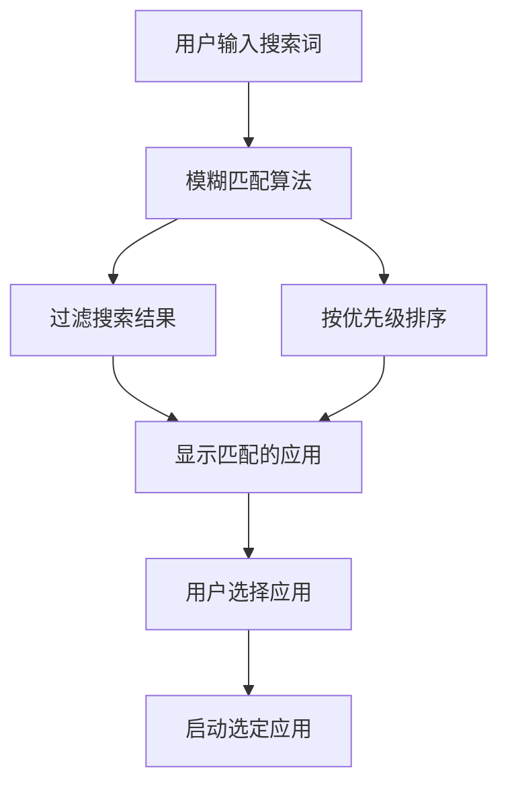
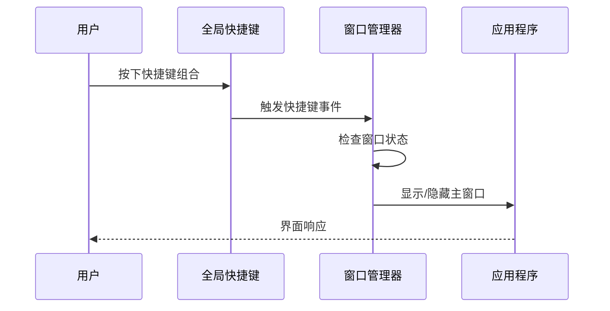
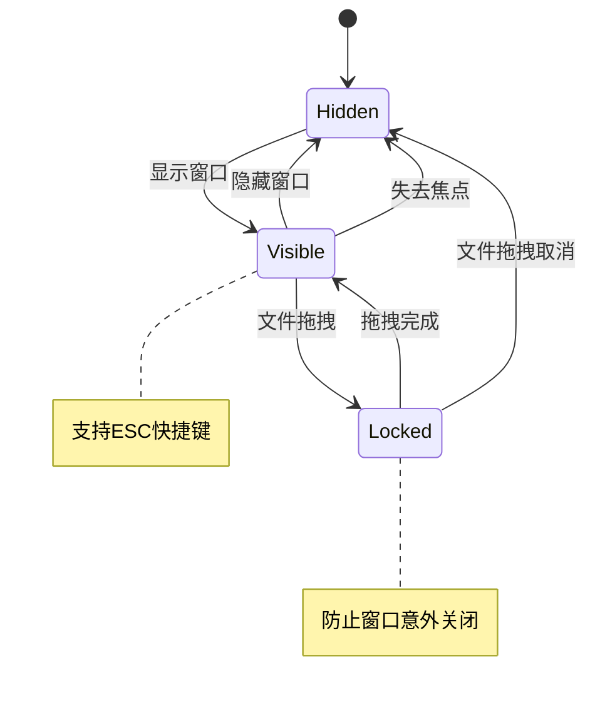
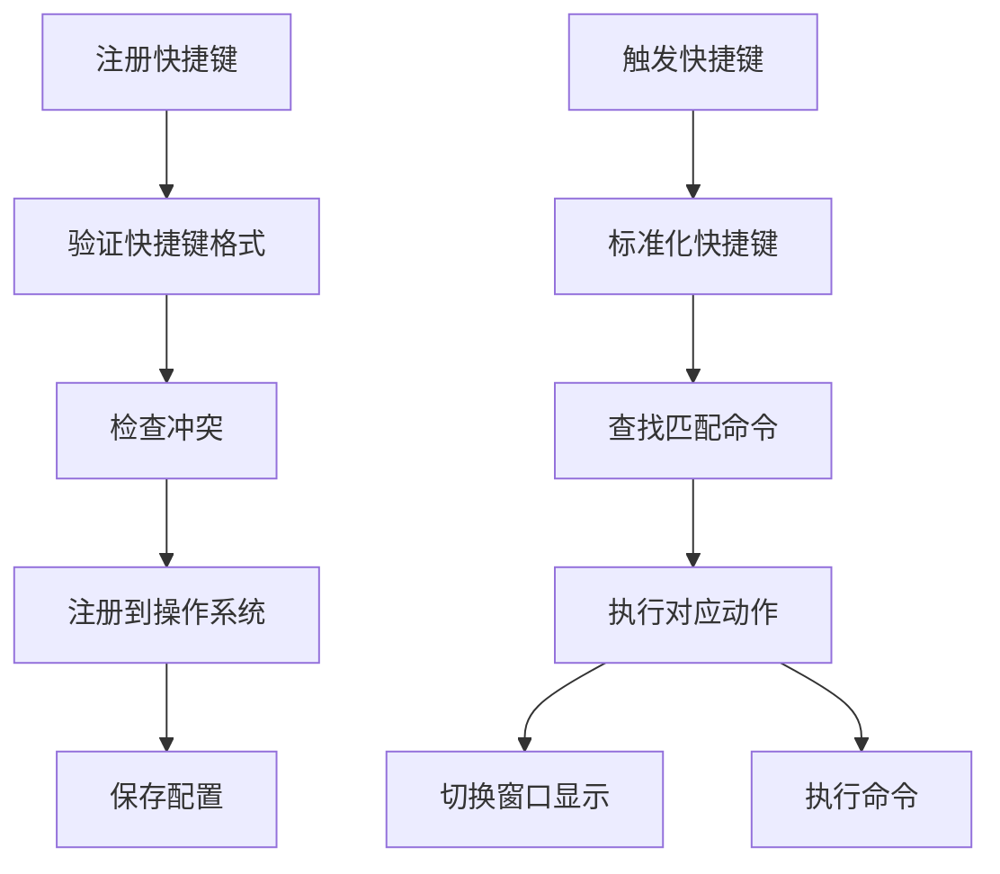
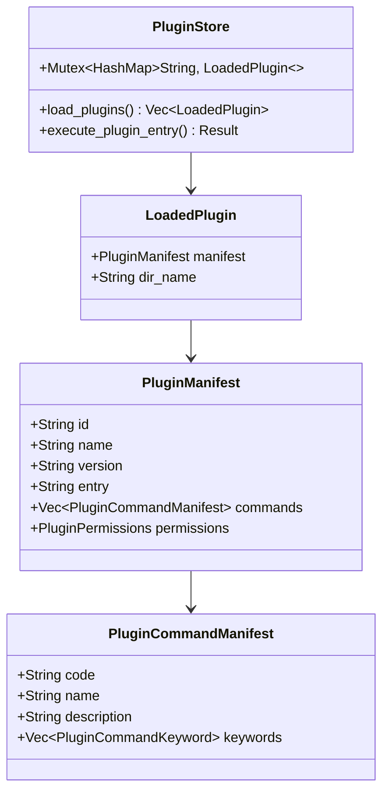
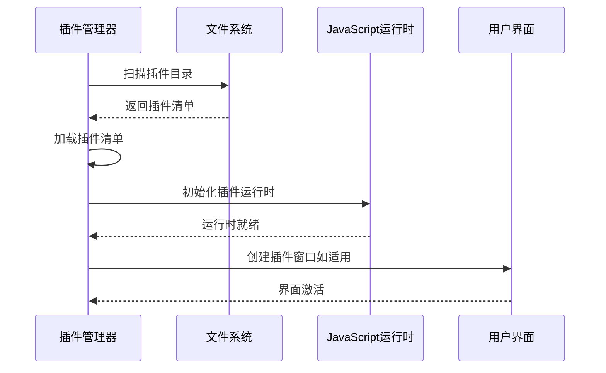
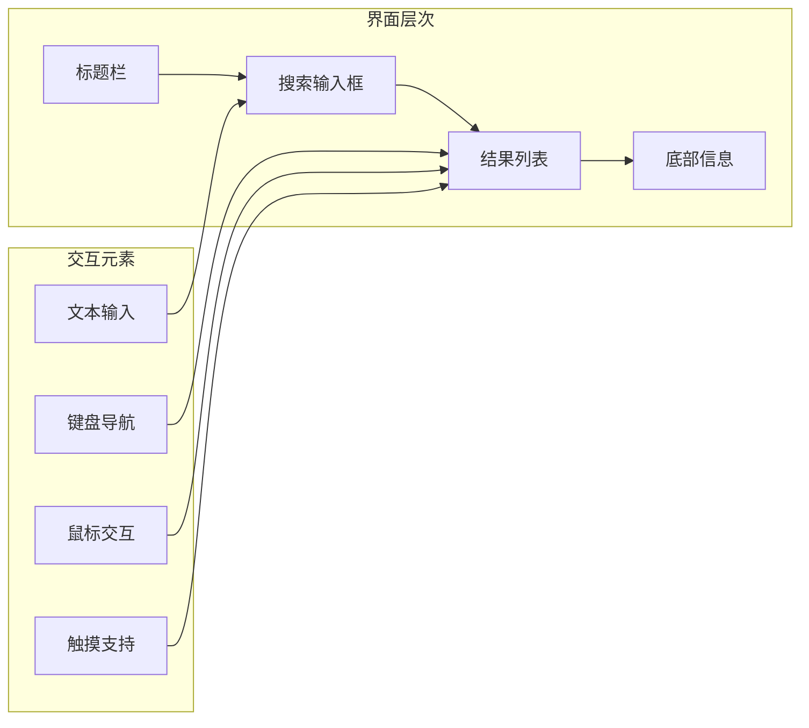

# Baize应用概述

<cite>
**本文档引用的文件**
- [README.md](file://README.md)
- [STATUS.md](file://STATUS.md)
- [Cargo.toml](file://src-tauri/Cargo.toml)
- [main.rs](file://src-tauri/src/main.rs)
- [lib.rs](file://src-tauri/src/lib.rs)
- [window_manager.rs](file://src-tauri/src/window_manager.rs)
- [tray_manager.rs](file://src-tauri/src/tray_manager.rs)
- [shortcut_manager.rs](file://src-tauri/src/shortcut_manager.rs)
- [plugin_manager.rs](file://src-tauri/src/plugin_manager.rs)
- [type.ts](file://src/lib/type.ts)
- [+page.svelte](file://src/routes/+page.svelte)
</cite>

## 目录
1. [项目简介](#项目简介)
2. [核心价值主张](#核心价值主张)
3. [主要功能特性](#主要功能特性)
4. [技术架构概览](#技术架构概览)
5. [系统组件分析](#系统组件分析)
6. [插件扩展系统](#插件扩展系统)
7. [用户界面设计](#用户界面设计)
8. [性能与优化](#性能与优化)
9. [项目状态与发展](#项目状态与发展)
10. [总结](#总结)

## 项目简介

Baize是一个基于Tauri框架构建的跨平台桌面启动器应用，旨在提供快速、智能的应用启动体验。该项目融合了现代Web技术的灵活性与原生应用的高性能，为用户提供了一个轻量级但功能强大的桌面助手。

### 项目定位

Baize定位为一个现代化的桌面启动器，类似于Raycast、UTools、Alfred和Wox等同类产品。它不仅仅是一个简单的应用启动器，而是一个集成了多种功能的桌面智能助手，能够通过模糊搜索、全局快捷键、插件扩展等方式提升用户的生产力。

### 技术愿景

项目的技术愿景是实现Web技术与原生性能的完美结合。通过采用Tauri框架，Baize能够在保持Web技术易用性的同时，获得接近原生应用的性能表现和安全性保障。

## 核心价值主张

### 性能优势
- **启动速度快**：相比传统桌面启动器，Baize具有更快的响应速度和更低的内存占用
- **系统资源高效利用**：通过优化的架构设计，最大限度减少对系统资源的消耗
- **跨平台兼容性**：一套代码支持Windows、macOS和Linux三大主流操作系统

### 用户体验
- **直观的操作界面**：简洁明了的设计，降低用户学习成本
- **智能搜索算法**：先进的模糊匹配技术，提供精准的搜索结果
- **个性化设置**：支持主题切换、自定义快捷键等个性化配置

### 开发者友好
- **插件化架构**：开放的插件系统，支持第三方开发者扩展功能
- **类型安全**：TypeScript提供完整的类型安全保障
- **现代化开发工具链**：基于Vite、SvelteKit等现代工具构建

## 主要功能特性

### 快速启动功能

Baize的核心功能是提供快速的应用启动能力：



**图表来源**
- [+page.svelte](file://src/routes/+page.svelte#L80-L90)
- [type.ts](file://src/lib/type.ts#L1-L20)

### 模糊搜索引擎

系统内置了高效的模糊搜索算法，能够智能识别用户意图并提供准确的搜索结果：

- **多维度匹配**：支持应用名称、关键词、路径等多种维度的匹配
- **智能排序**：根据使用频率和匹配度自动排序搜索结果
- **实时反馈**：输入过程中的实时搜索和结果更新

### 全局快捷键系统

Baize提供了强大的全局快捷键功能：



**图表来源**
- [shortcut_manager.rs](file://src-tauri/src/shortcut_manager.rs#L200-L250)
- [window_manager.rs](file://src-tauri/src/window_manager.rs#L50-L100)

**章节来源**
- [shortcut_manager.rs](file://src-tauri/src/shortcut_manager.rs#L1-L100)
- [window_manager.rs](file://src-tauri/src/window_manager.rs#L1-L50)

### 插件扩展系统

Baize采用了模块化的插件架构，支持功能扩展：

- **插件类型**：支持UI插件和无头插件两种类型
- **插件协议**：通过自定义URI方案加载插件资源
- **权限管理**：细粒度的权限控制机制
- **生命周期管理**：完整的插件加载、运行和卸载流程

### 系统托盘集成

应用集成了系统托盘功能，提供便捷的访问方式：

- **托盘图标管理**：动态显示/隐藏托盘图标
- **右键菜单**：提供快速退出等常用操作
- **点击事件处理**：左键点击显示/隐藏主窗口

**章节来源**
- [tray_manager.rs](file://src-tauri/src/tray_manager.rs#L1-L67)

## 技术架构概览

### 整体架构设计

Baize采用前后端分离的架构模式，通过Tauri IPC实现通信：

```mermaid
graph TB
subgraph "前端层 (SvelteKit)"
Frontend[SvelteKit应用]
UI[用户界面组件]
Store[Svelte状态管理]
Utils[工具函数]
end
subgraph "后端层 (Rust)"
Tauri[Tauri框架]
WindowManager[窗口管理器]
TrayManager[托盘管理器]
ShortcutManager[快捷键管理器]
PluginManager[插件管理器]
AppCache[应用缓存]
end
subgraph "系统层"
OS[操作系统API]
FileSystem[文件系统]
Registry[注册表/配置]
end
Frontend < --> Tauri
Tauri < --> WindowManager
Tauri < --> TrayManager
Tauri < --> ShortcutManager
Tauri < --> PluginManager
Tauri < --> AppCache
WindowManager --> OS
TrayManager --> OS
ShortcutManager --> OS
PluginManager --> FileSystem
AppCache --> Registry
```

**图表来源**
- [lib.rs](file://src-tauri/src/lib.rs#L50-L150)
- [main.rs](file://src-tauri/src/main.rs#L1-L7)

### 前端技术栈

前端部分基于SvelteKit构建，采用现代化的Web技术：

- **SvelteKit**：用于构建响应式用户界面
- **TypeScript**：提供类型安全保障和更好的开发体验
- **Tailwind CSS**：实用优先的CSS框架，支持主题定制
- **Vite**：快速的构建工具和开发服务器

### 后端技术栈

后端采用Rust语言开发，充分利用Rust的安全性和性能优势：

- **Tauri**：跨平台桌面应用框架
- **Tokio**：异步运行时，支持并发处理
- **Serde**：序列化/反序列化库
- **Regex**：正则表达式处理
- **WalkDir**：目录遍历

**章节来源**
- [Cargo.toml](file://src-tauri/Cargo.toml#L1-L71)

## 系统组件分析

### 窗口管理器

窗口管理器负责主窗口的生命周期管理和事件处理：



**图表来源**
- [window_manager.rs](file://src-tauri/src/window_manager.rs#L150-L220)

窗口管理器的关键特性：
- **智能隐藏策略**：基于鼠标事件和焦点变化的智能隐藏
- **窗口锁定机制**：防止在特定操作期间窗口意外关闭
- **ESC快捷键支持**：提供键盘快捷键关闭窗口
- **焦点事件处理**：精确的焦点变化检测和响应

### 快捷键管理器

快捷键管理器提供了完整的全局快捷键解决方案：



**图表来源**
- [shortcut_manager.rs](file://src-tauri/src/shortcut_manager.rs#L100-L200)

快捷键管理器的核心功能：
- **跨平台兼容**：统一的快捷键API，适配不同操作系统的差异
- **冲突检测**：自动检测和处理快捷键冲突
- **持久化存储**：将用户配置保存到磁盘
- **动态管理**：支持运行时添加、删除和修改快捷键

### 插件管理器

插件管理器实现了灵活的插件系统：



**图表来源**
- [plugin_manager.rs](file://src-tauri/src/plugin_manager.rs#L10-L50)

插件系统的特点：
- **类型区分**：支持UI插件和无头插件两种类型
- **沙箱隔离**：通过不同的执行环境保证安全性
- **权限控制**：细粒度的权限管理机制
- **协议支持**：自定义URI方案加载插件资源

**章节来源**
- [plugin_manager.rs](file://src-tauri/src/plugin_manager.rs#L1-L100)

## 插件扩展系统

### 插件架构设计

Baize的插件系统采用了模块化的设计理念，支持多种类型的插件：

#### 插件类型
1. **UI插件**：基于HTML/CSS/JavaScript的图形界面插件
2. **无头插件**：纯后端逻辑插件，无用户界面
3. **混合插件**：同时包含前端界面和后端逻辑

#### 插件生命周期


**图表来源**
- [plugin_manager.rs](file://src-tauri/src/plugin_manager.rs#L80-L150)

### 插件API设计

插件可以通过以下API与主应用交互：

- **命令执行**：调用系统命令或应用特定命令
- **通知系统**：发送桌面通知
- **存储访问**：读写插件专用存储
- **HTTP请求**：发起网络请求
- **文件操作**：访问文件系统

### 插件权限模型

为了保证安全性，插件系统实现了细粒度的权限控制：

- **网络权限**：控制插件的网络访问能力
- **文件系统权限**：限制插件对文件系统的访问范围
- **系统权限**：控制插件对系统功能的访问

**章节来源**
- [plugin_manager.rs](file://src-tauri/src/plugin_manager.rs#L200-L327)

## 用户界面设计

### 界面设计理念

Baize的用户界面遵循简洁、直观的设计原则：



**图表来源**
- [+page.svelte](file://src/routes/+page.svelte#L100-L200)

### 核心界面组件

#### 搜索界面
- **输入框**：支持实时搜索和智能提示
- **结果列表**：滚动区域展示搜索结果
- **键盘导航**：Arrow Up/Down和Tab键导航
- **视觉反馈**：选中状态的视觉指示

#### 主题系统
- **深色模式**：默认的深色主题
- **浅色模式**：明亮的浅色主题
- **系统跟随**：自动跟随系统主题设置

#### 图标系统
- **应用图标**：支持Base64编码和Iconfont两种格式
- **统一图标**：使用SVG格式的统一图标库
- **动态加载**：按需加载图标资源

### 交互设计

#### 键盘快捷键
- **ESC键**：关闭窗口或清空搜索
- **方向键**：在结果列表中导航
- **Tab键**：在搜索框和结果之间切换
- **Enter键**：确认选择并启动应用

#### 触摸交互
- **点击操作**：点击启动应用
- **长按操作**：支持长按触发特殊功能
- **滑动操作**：支持左右滑动切换主题

**章节来源**
- [+page.svelte](file://src/routes/+page.svelte#L1-L100)
- [type.ts](file://src/lib/type.ts#L1-L51)

## 性能与优化

### 内存管理

Baize采用了多种内存优化策略：

- **懒加载**：按需加载应用列表和图标
- **缓存机制**：缓存频繁访问的数据
- **垃圾回收**：及时释放不再使用的资源
- **内存监控**：持续监控内存使用情况

### 启动优化

- **预加载**：提前加载必要的资源
- **异步初始化**：非关键组件异步加载
- **延迟执行**：将非紧急任务推迟执行
- **资源池化**：复用昂贵的资源对象

### 系统集成优化

- **最小化系统调用**：减少不必要的系统调用
- **批量操作**：合并多个小操作为批量操作
- **事件节流**：限制高频事件的处理频率
- **智能缓存**：基于访问模式的智能缓存策略

## 项目状态与发展

### 当前进展

根据项目状态文档，Baize项目处于快速发展阶段：

- **基础功能**：已完成快速启动功能的基本实现
- **插件系统**：正在开发插件支持功能
- **用户界面**：正在进行用户界面的优化
- **跨平台**：支持Windows、macOS和Linux

### 未来发展方向

#### 功能扩展
- **更多插件类型**：支持更多类型的插件扩展
- **高级搜索**：增强搜索功能，支持复杂查询
- **工作流支持**：提供自动化工作流功能
- **云同步**：支持配置和数据的云端同步

#### 技术改进
- **性能优化**：进一步提升应用性能
- **稳定性增强**：提高应用的稳定性和可靠性
- **API完善**：丰富插件开发API
- **文档完善**：提供更详细的开发文档

#### 生态建设
- **社区支持**：建立开发者社区
- **插件市场**：构建插件分发平台
- **教程资源**：提供丰富的学习资源
- **案例分享**：展示优秀插件案例

**章节来源**
- [README.md](file://README.md#L1-L46)
- [STATUS.md](file://STATUS.md#L1-L74)

## 总结

Baize作为一个基于Tauri框架的跨平台桌面启动器，展现了现代桌面应用开发的最佳实践。通过巧妙地结合Web技术和原生性能，它成功地解决了传统桌面启动器存在的各种问题。

### 技术创新

- **架构创新**：采用前后端分离的架构模式，充分发挥各自的优势
- **插件化设计**：开放的插件系统为应用扩展提供了无限可能
- **跨平台支持**：一套代码支持三大主流操作系统
- **性能优化**：在保持Web技术灵活性的同时，实现了接近原生的性能

### 应用价值

- **提升效率**：通过快速启动和智能搜索，显著提升用户工作效率
- **降低门槛**：简洁的界面和直观的操作降低了使用门槛
- **扩展性强**：插件系统使得应用功能可以无限扩展
- **生态友好**：开放的架构吸引了更多的开发者参与

### 发展前景

随着插件系统的不断完善和功能的持续扩展，Baize有望成为桌面应用领域的重要参与者。它不仅为普通用户提供了优秀的桌面助手体验，也为开发者提供了一个理想的插件开发平台。

项目的成功实施证明了现代Web技术在桌面应用开发中的巨大潜力，为未来的桌面应用发展指明了方向。通过持续的迭代和优化，Baize将继续为用户提供更好的桌面体验，推动桌面应用技术的发展。