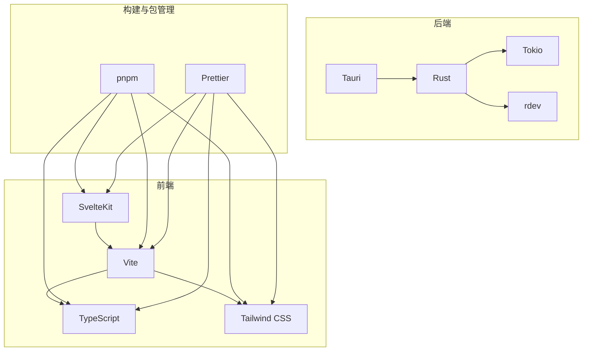

# 技术栈与依赖

<cite>
**本文档中引用的文件**   
- [package.json](file://package.json)
- [Cargo.toml](file://src-tauri/Cargo.toml)
- [vite.config.ts](file://vite.config.ts)
- [svelte.config.js](file://svelte.config.js)
- [tailwind.config.ts](file://tailwind.config.ts)
- [main.rs](file://src-tauri/src/main.rs)
- [lib.rs](file://src-tauri/src/lib.rs)
- [window_manager.rs](file://src-tauri/src/window_manager.rs)
- [shortcut_manager.rs](file://src-tauri/src/shortcut_manager.rs)
- [tauri.conf.json](file://src-tauri/tauri.conf.json)
- [plugins-sdk/package.json](file://plugins-sdk/package.json)
- [plugins-sdk/vite.config.ts](file://plugins-sdk/vite.config.ts)
</cite>

## 目录

1. [简介](#简介)
2. [前端技术栈](#前端技术栈)
3. [后端技术栈](#后端技术栈)
4. [构建与包管理工具](#构建与包管理工具)
5. [依赖关系图](#依赖关系图)
6. [技术栈集成分析](#技术栈集成分析)
7. [结论](#结论)

## 简介

Baize 是一个基于 Tauri 框架的桌面应用程序，采用现代化的技术栈构建。该项目结合了前端和后端的最佳实践，使用 SvelteKit 作为前端框架，Tauri 和 Rust 作为后端技术，实现了高性能、跨平台的桌面应用。本文档详细介绍了 Baize 项目中使用的所有关键技术组件，包括前端、后端以及构建和包管理工具，并解释了它们在项目中的角色、被选中的原因以及与其他组件的集成方式。

## 前端技术栈

### SvelteKit
SvelteKit 是 Baize 项目的前端框架，用于构建用户界面。SvelteKit 提供了强大的路由系统、服务器端渲染（SSR）支持和静态站点生成（SSG）功能。在 Baize 项目中，SvelteKit 被配置为单页应用（SPA），通过 `adapter-static` 将应用构建为静态文件，确保 Tauri 应用能够高效加载。

SvelteKit 的主要优势在于其编译时优化，能够在构建时将组件转换为高效的 JavaScript 代码，从而减少运行时开销。此外，SvelteKit 的模块化设计使得代码组织更加清晰，便于维护和扩展。

**Section sources**
- [svelte.config.js](file://svelte.config.js#L0-L27)
- [src/routes/+layout.ts](file://src/routes/+layout.ts#L0-L4)

### Vite
Vite 是 Baize 项目的构建工具，负责开发服务器的启动和生产环境的构建。Vite 利用现代浏览器的原生 ES 模块支持，实现了快速的冷启动和热模块替换（HMR）。在 Baize 项目中，Vite 配置了固定的端口 1420，确保与 Tauri 开发环境的兼容性。

Vite 的主要优势在于其极快的启动速度和高效的构建性能。通过 `vite.config.ts` 文件，项目配置了 SvelteKit 和 Tailwind CSS 插件，确保前端资源的正确处理和优化。

**Section sources**
- [vite.config.ts](file://vite.config.ts#L0-L32)
- [package.json](file://package.json#L5-L9)

### TypeScript
TypeScript 是 Baize 项目的编程语言，用于编写类型安全的前端代码。TypeScript 提供了静态类型检查，帮助开发者在编译时发现潜在的错误，提高代码质量和可维护性。在 Baize 项目中，TypeScript 被广泛应用于组件、状态管理和工具函数中。

TypeScript 的主要优势在于其强大的类型系统和对现代 JavaScript 特性的支持。通过 `tsconfig.json` 文件，项目配置了目标版本为 ES2022，确保代码的兼容性和性能。

**Section sources**
- [tsconfig.json](file://tsconfig.json#L0-L16)
- [src/lib/type.ts](file://src/lib/type.ts)

### Tailwind CSS
Tailwind CSS 是 Baize 项目的样式框架，用于快速构建响应式和美观的用户界面。Tailwind CSS 提供了实用类（utility classes），允许开发者直接在 HTML 中应用样式，而无需编写自定义 CSS。在 Baize 项目中，Tailwind CSS 被配置为使用 `class` 策略来切换暗黑模式，确保用户可以根据偏好选择主题。

Tailwind CSS 的主要优势在于其高度可定制性和灵活性。通过 `tailwind.config.ts` 文件，项目配置了内容路径，确保所有相关的 HTML、JavaScript 和 Svelte 文件都被正确处理。

**Section sources**
- [tailwind.config.ts](file://tailwind.config.ts#L0-L11)
- [src/index.css](file://src/index.css)

## 后端技术栈

### Tauri 框架
Tauri 是 Baize 项目的后端框架，用于构建跨平台的桌面应用程序。Tauri 允许开发者使用 Web 技术（如 HTML、CSS 和 JavaScript）构建用户界面，并通过 Rust 编写的后端逻辑与操作系统进行交互。在 Baize 项目中，Tauri 被配置为使用 `tauri.conf.json` 文件，定义了应用的基本信息、构建选项和安全策略。

Tauri 的主要优势在于其高性能和安全性。通过 Rust 编写的后端逻辑，Tauri 能够提供接近原生应用的性能，同时避免了传统 Electron 应用的内存占用问题。此外，Tauri 提供了丰富的插件生态系统，支持通知、全局快捷键、文件对话框等功能。

**Section sources**
- [tauri.conf.json](file://src-tauri/tauri.conf.json#L0-L59)
- [Cargo.toml](file://src-tauri/Cargo.toml#L0-L70)

### Rust 编程语言
Rust 是 Baize 项目的后端编程语言，用于编写高性能和安全的系统级代码。Rust 提供了内存安全保证，通过所有权和借用机制避免了常见的内存错误。在 Baize 项目中，Rust 被用于实现核心功能，如窗口管理、快捷键处理和系统集成。

Rust 的主要优势在于其零成本抽象和高性能。通过 `Cargo.toml` 文件，项目定义了依赖项和构建配置，确保代码的可维护性和可扩展性。Rust 的异步编程模型（通过 Tokio 运行时）也使得 Baize 能够高效处理并发任务。

**Section sources**
- [Cargo.toml](file://src-tauri/Cargo.toml#L0-L70)
- [src-tauri/src/lib.rs](file://src-tauri/src/lib.rs#L0-L234)

### Tokio 异步运行时
Tokio 是 Baize 项目的异步运行时，用于处理并发任务和 I/O 操作。Tokio 提供了高效的事件循环和任务调度机制，使得 Baize 能够在不阻塞主线程的情况下执行长时间运行的任务。在 Baize 项目中，Tokio 被用于初始化命令管理器、插件运行时管理器和全局事件监听器。

Tokio 的主要优势在于其高性能和低延迟。通过 `tokio` 依赖项，项目配置了多线程运行时、同步原语和异步文件操作，确保后端逻辑的高效执行。

**Section sources**
- [Cargo.toml](file://src-tauri/Cargo.toml#L50-L55)
- [src-tauri/src/lib.rs](file://src-tauri/src/lib.rs#L15-L234)

### rdev 库
rdev 是 Baize 项目的输入事件监听库，用于捕获全局键盘和鼠标事件。rdev 提供了跨平台的支持，能够在 Windows、macOS 和 Linux 上监听输入事件。在 Baize 项目中，rdev 被用于实现全局快捷键和窗口隐藏功能，确保用户可以通过快捷键快速访问应用。

rdev 的主要优势在于其低级别的系统集成和高性能。通过 `rdev` 依赖项，项目配置了广播通道，允许多个组件共享输入事件，避免了重复创建监听器的开销。

**Section sources**
- [Cargo.toml](file://src-tauri/Cargo.toml#L60-L61)
- [src-tauri/src/lib.rs](file://src-tauri/src/lib.rs#L15-L234)

## 构建与包管理工具

### pnpm
pnpm 是 Baize 项目的包管理工具，用于管理前端依赖项。pnpm 提供了高效的依赖解析和安装机制，通过硬链接和符号链接减少了磁盘空间的占用。在 Baize 项目中，pnpm 被用于安装和管理所有前端依赖项，确保依赖版本的一致性。

pnpm 的主要优势在于其高效的依赖管理和快速的安装速度。通过 `pnpm-lock.yaml` 文件，项目锁定了依赖版本，确保不同开发环境下的构建一致性。

**Section sources**
- [package.json](file://package.json#L0-L51)
- [pnpm-lock.yaml](file://pnpm-lock.yaml#L51-L82)

### Prettier
Prettier 是 Baize 项目的代码格式化工具，用于统一代码风格。Prettier 提供了自动化的代码格式化功能，支持多种编程语言，包括 JavaScript、TypeScript 和 Svelte。在 Baize 项目中，Prettier 被配置为在保存文件时自动格式化代码，确保代码的可读性和一致性。

Prettier 的主要优势在于其自动化和一致性。通过 `prettier.config.js` 文件，项目配置了代码格式化规则，确保所有开发者遵循相同的代码风格。

**Section sources**
- [package.json](file://package.json#L5-L9)
- [prettier.config.js](file://prettier.config.js)

## 依赖关系图

**Diagram sources**
- [package.json](file://package.json)
- [Cargo.toml](file://src-tauri/Cargo.toml)
- [vite.config.ts](file://vite.config.ts)
- [svelte.config.js](file://svelte.config.js)
- [tailwind.config.ts](file://tailwind.config.ts)

## 技术栈集成分析

Baize 项目的技术栈集成非常紧密，前端和后端通过 Tauri 框架无缝连接。SvelteKit 作为前端框架，提供了高效的用户界面构建能力，而 Vite 作为构建工具，确保了开发和生产环境的高效构建。TypeScript 和 Tailwind CSS 分别提供了类型安全和样式管理，使得前端代码更加健壮和美观。

后端方面，Tauri 框架利用 Rust 编写的后端逻辑，提供了高性能和安全的系统级功能。Tokio 异步运行时和 rdev 库使得 Baize 能够高效处理并发任务和全局输入事件。通过 `tauri.conf.json` 文件，项目配置了安全策略和构建选项，确保应用的稳定性和安全性。

构建和包管理工具方面，pnpm 和 Prettier 分别提供了高效的依赖管理和代码格式化功能，确保开发环境的一致性和代码的可读性。通过这些工具的集成，Baize 项目实现了高效的开发流程和高质量的代码输出。

**Section sources**
- [package.json](file://package.json)
- [Cargo.toml](file://src-tauri/Cargo.toml)
- [vite.config.ts](file://vite.config.ts)
- [svelte.config.js](file://svelte.config.js)
- [tailwind.config.ts](file://tailwind.config.ts)
- [tauri.conf.json](file://src-tauri/tauri.conf.json)

## 结论

Baize 项目通过精心选择和集成一系列现代化的技术组件，构建了一个高性能、跨平台的桌面应用程序。前端技术栈（SvelteKit、Vite、TypeScript 和 Tailwind CSS）提供了高效的用户界面构建能力，而后端技术栈（Tauri、Rust、Tokio 和 rdev）确保了系统的高性能和安全性。构建和包管理工具（pnpm 和 Prettier）则保证了开发环境的一致性和代码的可读性。通过这些技术的协同工作，Baize 项目实现了卓越的用户体验和开发效率。