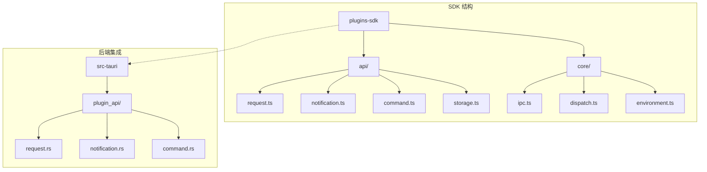
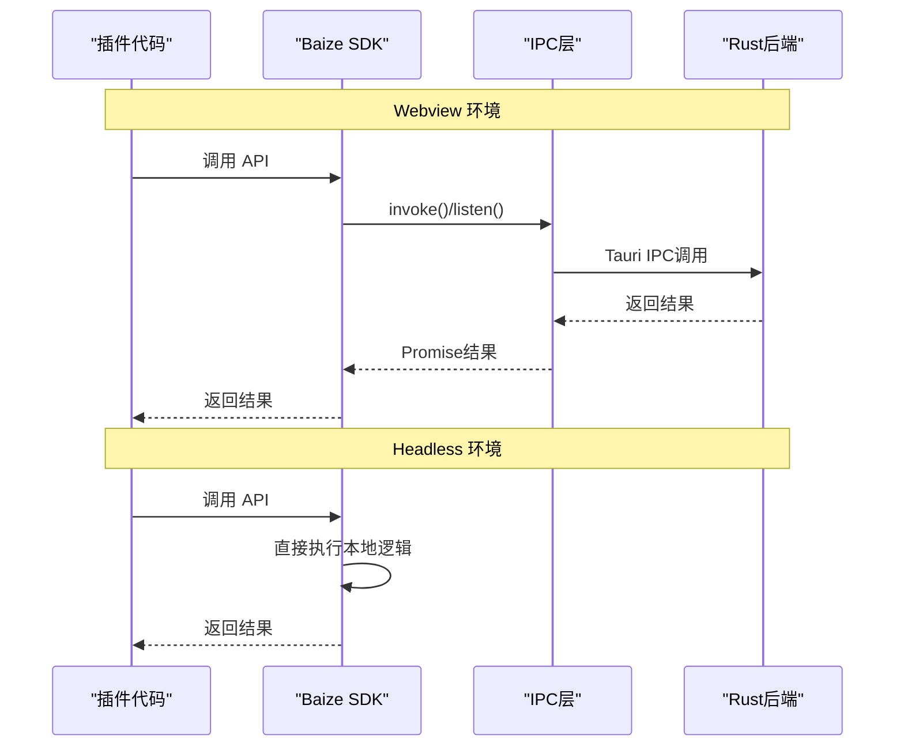
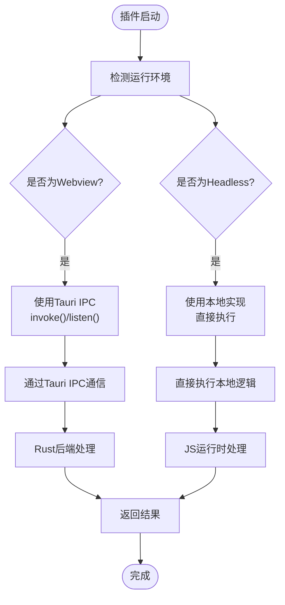
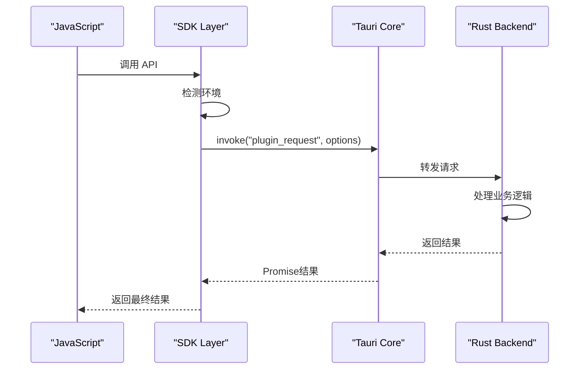
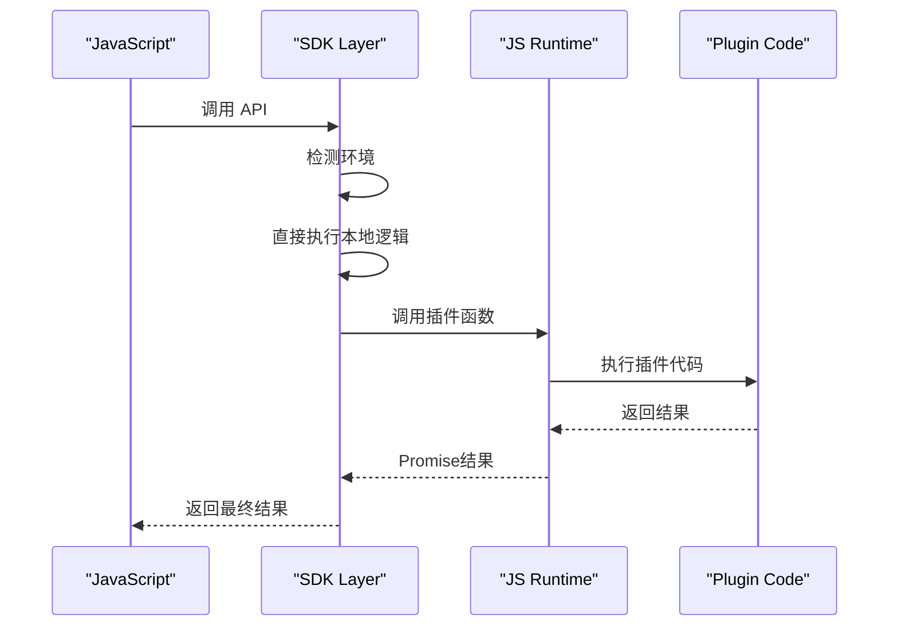
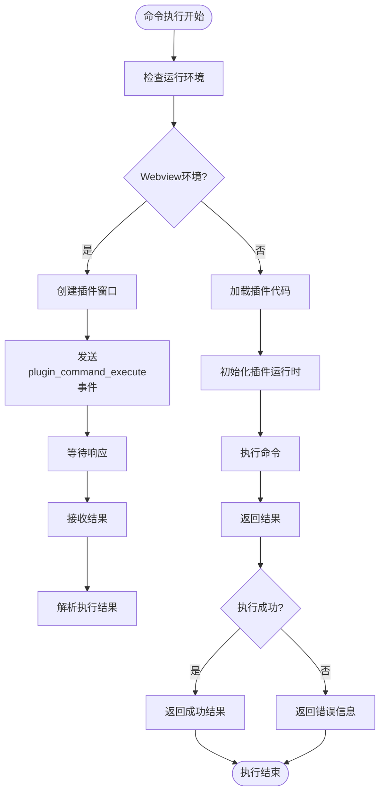
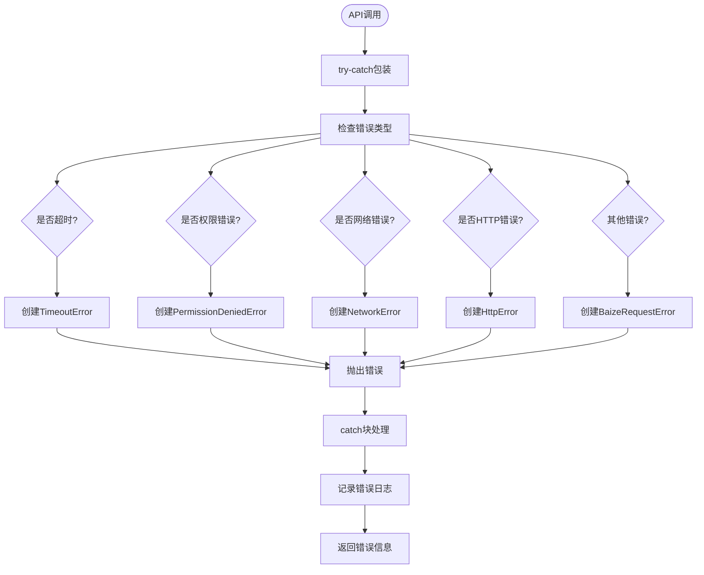

# SDK使用说明

<cite>
**本文档引用的文件**
- [plugins-sdk/package.json](file://plugins-sdk/package.json)
- [plugins-sdk/src/index.ts](file://plugins-sdk/src/index.ts)
- [plugins-sdk/src/api/request.ts](file://plugins-sdk/src/api/request.ts)
- [plugins-sdk/src/api/notification.ts](file://plugins-sdk/src/api/notification.ts)
- [plugins-sdk/src/api/command.ts](file://plugins-sdk/src/api/command.ts)
- [plugins-sdk/src/core/ipc.ts](file://plugins-sdk/src/core/ipc.ts)
- [plugins-sdk/src/core/dispatch.ts](file://plugins-sdk/src/core/dispatch.ts)
- [plugins-sdk/src/core/environment.ts](file://plugins-sdk/src/core/environment.ts)
- [src-tauri/src/plugin_api/request.rs](file://src-tauri/src/plugin_api/request.rs)
- [src-tauri/src/plugin_api/notification.rs](file://src-tauri/src/plugin_api/notification.rs)
- [src-tauri/src/plugin_api/command.rs](file://src-tauri/src/plugin_api/command.rs)
- [src-tauri/capabilities/plugin.json](file://src-tauri/capabilities/plugin.json)
- [README.md](file://README.md)
- [example-plugin.ts](file://example-plugin.ts)
</cite>

## 更新摘要
**已做更改**
- 更新了核心API部分，以反映SDK API导出方式的变更
- 添加了关于`debug`对象的新内容
- 修正了代码示例以匹配新的命名空间导入模式
- 更新了架构概览和IPC通信机制部分的相关信息
- 增加了对新HTTP便捷方法的文档说明

## 目录
1. [简介](#简介)
2. [项目结构](#项目结构)
3. [SDK 安装](#sdk-安装)
4. [核心 API 详解](#核心-api-详解)
5. [架构概览](#架构概览)
6. [详细组件分析](#详细组件分析)
7. [IPC 通信机制](#ipc-通信机制)
8. [错误处理](#错误处理)
9. [最佳实践](#最佳实践)
10. [故障排除](#故障排除)
11. [总结](#总结)

## 简介

Baize SDK 是一个专为 Baize 应用程序设计的插件开发工具包，提供了完整的 API 接口来帮助开发者创建功能丰富的桌面应用程序插件。该 SDK 基于 Tauri 框架构建，支持 Webview 和 Headless 两种运行环境，为插件开发者提供了统一的编程接口。

### 主要特性

- **多环境支持**：同时支持 Webview（有界面）和 Headless（无界面）两种运行模式
- **类型安全**：完整的 TypeScript 类型定义，提供智能提示和编译时检查
- **异步操作**：所有 API 均采用 Promise 和 async/await 模式
- **错误处理**：完善的错误类型系统和错误处理机制
- **跨平台兼容**：基于 Tauri 的跨平台特性，可在 Windows、macOS 和 Linux 上运行

## 项目结构



**图表来源**
- [plugins-sdk/src/index.ts](file://plugins-sdk/src/index.ts#L1-L42)
- [plugins-sdk/src/api/request.ts](file://plugins-sdk/src/api/request.ts#L1-L145)
- [plugins-sdk/src/core/ipc.ts](file://plugins-sdk/src/core/ipc.ts#L1-L98)

**章节来源**
- [plugins-sdk/package.json](file://plugins-sdk/package.json#L1-L29)
- [plugins-sdk/src/index.ts](file://plugins-sdk/src/index.ts#L1-L42)

## SDK 安装

### NPM 安装

```bash
npm install baize-sdk
```

### Yarn 安装

```bash
yarn add baize-sdk
```

### Pnpm 安装

```bash
pnpm add baize-sdk
```

### 开发依赖安装

```bash
npm install --save-dev baize-sdk
```

**章节来源**
- [plugins-sdk/package.json](file://plugins-sdk/package.json#L1-L29)

## 核心 API 详解

### 1. registerCommand

用于注册插件命令处理器，当宿主应用执行插件指令时，会调用注册的处理器函数。

#### TypeScript 函数签名

```typescript
export function registerCommandHandler(handler: CommandHandler): Promise<void>;
```

#### 参数说明

- `handler`: `(command: string, args: any) => any | Promise<any>`
  - `command`: 要执行的命令名称
  - `args`: 传递给命令的参数
  - 返回值：命令执行结果或 Promise

#### 使用示例

```typescript
import baize from 'baize-sdk';

// 注册命令处理器
await baize.command.register(async (command, args) => {
  switch (command) {
    case 'greet':
      return `Hello, ${args.name}!`;
    case 'calculate':
      return args.a + args.b;
    default:
      throw new Error(`Unknown command: ${command}`);
  }
});

console.log('Command handler registered');
```

#### 支持的命令类型

- **系统命令**：如搜索、打开链接等
- **自定义命令**：插件特定的功能
- **组合命令**：多个命令的组合操作

### 2. sendNotification

用于向用户发送系统通知，支持标题和内容的自定义。

#### TypeScript 函数签名

```typescript
export function showNotification(options: NotificationOptions): Promise<void>;
```

#### 参数说明

```typescript
interface NotificationOptions {
  title: string;     // 通知标题
  body: string;      // 通知内容
}
```

#### 使用示例

```typescript
import baize from 'baize-sdk';

// 发送简单通知
await baize.notification.show({
  title: '任务完成',
  body: '您的备份已经成功完成！'
});

// 发送带样式的通知
await baize.notification.show({
  title: '重要提醒',
  body: '请在下午3点参加会议'
});
```

#### 通知样式支持

- **标题**：最多显示两行文本
- **内容**：支持长文本和换行
- **图标**：根据操作系统自动选择合适的图标
- **点击行为**：可配置点击通知后的操作

### 3. request

用于发起网络请求，支持多种 HTTP 方法和响应类型。

#### TypeScript 函数签名

```typescript
export async function request<T>(options: RequestOptions): Promise<Response<T>>;
```

#### 参数说明

```typescript
interface RequestOptions {
  url: string;                    // 请求的URL
  method?: HttpMethod;            // HTTP方法，默认为GET
  headers?: Record<string, string>; // 请求头
  body?: string | ArrayBuffer | Record<string, any>; // 请求体
  timeout?: number;               // 超时时间（毫秒），默认30000ms
  responseType?: ResponseType;    // 响应类型，默认为json
}

type HttpMethod = 'GET' | 'POST' | 'PUT' | 'DELETE' | 'PATCH' | 'HEAD' | 'OPTIONS';
type ResponseType = 'json' | 'text' | 'arraybuffer';
```

#### 使用示例

```typescript
import baize from 'baize-sdk';

// GET 请求
const response = await baize.http.get('https://api.example.com/users', {
  headers: {
    'Authorization': 'Bearer token123',
    'Content-Type': 'application/json'
  }
});

// POST 请求
const postResponse = await baize.http.post('https://api.example.com/users', {
  name: '张三',
  email: 'zhangsan@example.com'
}, {
  headers: {
    'Content-Type': 'application/json'
  }
});

// 文件下载
const fileResponse = await baize.http.request({
  url: 'https://example.com/document.pdf',
  responseType: 'arraybuffer'
});
```

#### 响应处理

```typescript
interface Response<T = any> {
  status: number;           // HTTP状态码
  statusText: string;       // 状态文本
  headers: Record<string, string>; // 响应头
  body: T;                  // 响应体
}
```

#### HTTP 便捷方法

SDK 提供了以下便捷方法：
- `http.get(url, options)`
- `http.post(url, body, options)`
- `http.put(url, body, options)`
- `http.patch(url, body, options)`
- `http.delete(url, options)`

**章节来源**
- [plugins-sdk/src/api/command.ts](file://plugins-sdk/src/api/command.ts#L1-L49)
- [plugins-sdk/src/api/notification.ts](file://plugins-sdk/src/api/notification.ts#L1-L22)
- [plugins-sdk/src/api/request.ts](file://plugins-sdk/src/api/request.ts#L1-L190)
- [example-plugin.ts](file://example-plugin.ts#L1-L86)

## 架构概览



**图表来源**
- [plugins-sdk/src/core/ipc.ts](file://plugins-sdk/src/core/ipc.ts#L1-L98)
- [plugins-sdk/src/core/dispatch.ts](file://plugins-sdk/src/core/dispatch.ts#L1-L30)

### 环境检测机制

SDK 自动检测运行环境并选择相应的执行路径：



**图表来源**
- [plugins-sdk/src/core/environment.ts](file://plugins-sdk/src/core/environment.ts#L1-L37)
- [plugins-sdk/src/core/dispatch.ts](file://plugins-sdk/src/core/dispatch.ts#L1-L30)

**章节来源**
- [plugins-sdk/src/core/environment.ts](file://plugins-sdk/src/core/environment.ts#L1-L37)
- [plugins-sdk/src/core/dispatch.ts](file://plugins-sdk/src/core/dispatch.ts#L1-L30)

## 详细组件分析

### IPC 层实现

IPC（进程间通信）层是 SDK 的核心组件，负责在 JavaScript 和 Rust 后端之间建立通信桥梁。

#### invoke 函数

```typescript
export async function invoke<T>(method: string, arg: any): Promise<T>
```

**特点**：
- 支持 Webview 和 Headless 两种环境
- 自动缓存 invoke 函数以提高性能
- 统一的错误处理机制

#### listen 函数

```typescript
export async function listen<T>(event: EventName, handler: EventCallback<T>): Promise<UnlistenFn>
```

**特点**：
- 支持事件监听和取消监听
- 在 Headless 环境中提供模拟实现
- 自动处理事件回调

### 分发器（Dispatcher）

分发器根据运行环境自动选择合适的执行路径：

```typescript
export function dispatch<T>(handlers: Handlers<T>): T
```

**处理器接口**：
```typescript
interface Handlers<T> {
  webview: () => T;    // Webview 环境处理器
  headless: () => T;   // Headless 环境处理器
}
```

### 环境检测

```typescript
export enum RuntimeEnvironment {
  Headless = 'headless',  // 无界面环境
  Webview = 'webview',    // 有界面环境
  Unknown = 'unknown',    // 未知环境
}
```

**检测逻辑**：
- Webview 环境：检查 `window.__TAURI_INTERNALS__`
- Headless 环境：检查 `Deno.core`
- 未知环境：返回 Unknown

**章节来源**
- [plugins-sdk/src/core/ipc.ts](file://plugins-sdk/src/core/ipc.ts#L1-L98)
- [plugins-sdk/src/core/dispatch.ts](file://plugins-sdk/src/core/dispatch.ts#L1-L30)
- [plugins-sdk/src/core/environment.ts](file://plugins-sdk/src/core/environment.ts#L1-L37)

## IPC 通信机制

### Webview 环境通信

在 Webview 环境中，SDK 通过 Tauri 的标准 IPC 机制与 Rust 后端通信：



**图表来源**
- [plugins-sdk/src/core/ipc.ts](file://plugins-sdk/src/core/ipc.ts#L15-L45)
- [src-tauri/src/plugin_api/request.rs](file://src-tauri/src/plugin_api/request.rs#L1-L199)

### Headless 环境通信

在 Headless 环境中，SDK 直接执行本地逻辑，绕过 IPC 层：



**图表来源**
- [plugins-sdk/src/core/ipc.ts](file://plugins-sdk/src/core/ipc.ts#L46-L75)
- [src-tauri/src/plugin_api/command.rs](file://src-tauri/src/plugin_api/command.rs#L40-L80)

### 命令执行流程



**图表来源**
- [src-tauri/src/plugin_api/command.rs](file://src-tauri/src/plugin_api/command.rs#L20-L100)

**章节来源**
- [plugins-sdk/src/core/ipc.ts](file://plugins-sdk/src/core/ipc.ts#L1-L98)
- [src-tauri/src/plugin_api/command.rs](file://src-tauri/src/plugin_api/command.rs#L1-L176)

## 错误处理

### 错误类型系统

SDK 提供了完整的错误类型系统来处理各种异常情况：

```typescript
// 基础错误类型
export interface BaizeRequestError extends Error {
  name: 'BaizeRequestError';
}

// 权限错误
export interface PermissionDeniedError extends Error {
  name: 'PermissionDeniedError';
  url: string;
}

// 超时错误
export interface TimeoutError extends Error {
  name: 'TimeoutError';
  url: string;
  timeout: number;
}

// 网络错误
export interface NetworkError extends Error {
  name: 'NetworkError';
}

// HTTP错误
export interface HttpError extends Error {
  name: 'HttpError';
  response: Response;
}
```

### 错误处理策略



### 错误处理示例

```typescript
import baize from 'baize-sdk';

async function safeRequest() {
  try {
    const response = await baize.http.get('https://api.example.com/data', {
      timeout: 5000
    });
    
    return response.body;
  } catch (error) {
    if (baize.http.errors.isTimeoutError(error)) {
      console.error(`请求超时: ${error.url} 超时时间: ${error.timeout}ms`);
    } else if (baize.http.errors.isPermissionDeniedError(error)) {
      console.error(`权限被拒绝: ${error.url}`);
    } else if (baize.http.errors.isNetworkError(error)) {
      console.error('网络连接失败');
    } else if (baize.http.errors.isHttpError(error)) {
      console.error(`HTTP错误: ${error.response.status} ${error.response.statusText}`);
    } else {
      console.error('未知错误:', error.message);
    }
    
    throw error;
  }
}
```

**章节来源**
- [plugins-sdk/src/api/request.ts](file://plugins-sdk/src/api/request.ts#L25-L190)

## 最佳实践

### 1. 命令处理器设计

```typescript
// 推荐的命令处理器结构
class PluginCommands {
  private static instance: PluginCommands;
  
  private constructor() {}
  
  static getInstance(): PluginCommands {
    if (!this.instance) {
      this.instance = new PluginCommands();
    }
    return this.instance;
  }
  
  async handleCommand(command: string, args: any): Promise<any> {
    switch (command) {
      case 'search':
        return this.search(args.query);
      case 'open':
        return this.openFile(args.path);
      case 'settings':
        return this.updateSettings(args.data);
      default:
        throw new Error(`未知命令: ${command}`);
    }
  }
  
  private async search(query: string): Promise<any> {
    // 实现搜索逻辑
    return { results: [], count: 0 };
  }
  
  private async openFile(path: string): Promise<boolean> {
    // 实现文件打开逻辑
    return true;
  }
  
  private async updateSettings(data: any): Promise<void> {
    // 实现设置更新逻辑
  }
}

// 注册命令处理器
await baize.command.register(
  PluginCommands.getInstance().handleCommand.bind(PluginCommands.getInstance())
);
```

### 2. 网络请求优化

```typescript
// 请求拦截器
class RequestInterceptor {
  private static instance: RequestInterceptor;
  
  private constructor() {}
  
  static getInstance(): RequestInterceptor {
    if (!this.instance) {
      this.instance = new RequestInterceptor();
    }
    return this.instance;
  }
  
  async intercept<T>(url: string, options?: Omit<RequestOptions, 'url'>): Promise<Response<T>> {
    // 添加通用请求头
    const headers = {
      'User-Agent': 'Baize-Plugin/1.0',
      'X-Plugin-ID': this.getPluginId(),
      ...options?.headers
    };
    
    // 记录请求日志
    console.log(`[Request] GET ${url}`);
    
    try {
      const response = await baize.http.get(url, { ...options, headers });
      
      // 记录响应日志
      console.log(`[Response] ${response.status} ${url}`);
      
      return response;
    } catch (error) {
      // 记录错误日志
      console.error(`[Error] ${url}:`, error);
      throw error;
    }
  }
  
  private getPluginId(): string {
    // 获取插件唯一标识
    return 'com.example.myplugin';
  }
}

// 使用拦截器
const interceptor = RequestInterceptor.getInstance();
const response = await interceptor.intercept('https://api.example.com/data');
```

### 3. 通知管理

```typescript
// 通知管理器
class NotificationManager {
  private static instance: NotificationManager;
  private notifications: Map<string, NotificationOptions>;
  
  private constructor() {
    this.notifications = new Map();
  }
  
  static getInstance(): NotificationManager {
    if (!this.instance) {
      this.instance = new NotificationManager();
    }
    return this.instance;
  }
  
  async show(title: string, body: string, id?: string): Promise<void> {
    const options: NotificationOptions = { title, body };
    
    if (id) {
      this.notifications.set(id, options);
    }
    
    await baize.notification.show(options);
  }
  
  async showWithAction(
    title: string, 
    body: string, 
    actions: string[]
  ): Promise<string> {
    // 实现带操作的通知
    // 这里需要结合具体的应用框架实现
    return '';
  }
}
```

### 4. 错误恢复机制

```typescript
// 错误恢复装饰器
function retry(maxRetries: number = 3, delay: number = 1000) {
  return function (
    target: any,
    propertyKey: string,
    descriptor: PropertyDescriptor
  ) {
    const originalMethod = descriptor.value;
    
    descriptor.value = async function (...args: any[]) {
      let lastError: any;
      
      for (let i = 0; i <= maxRetries; i++) {
        try {
          return await originalMethod.apply(this, args);
        } catch (error) {
          lastError = error;
          
          if (i < maxRetries) {
            console.warn(`重试 ${i + 1}/${maxRetries}:`, error.message);
            await new Promise(resolve => setTimeout(resolve, delay * Math.pow(2, i)));
            continue;
          }
        }
      }
      
      throw lastError;
    };
    
    return descriptor;
  };
}

// 使用重试装饰器
class RobustAPI {
  @retry(3, 1000)
  async getData(url: string): Promise<any> {
    return baize.http.get(url, { timeout: 10000 });
  }
}
```

### 5. 调试工具使用

```typescript
// 使用调试工具检查连接状态
async function checkConnection() {
  console.log('SDK 版本:', baize.debug.version);
  console.log('运行环境信息:', baize.debug.getRuntimeInfo());
  
  const connectionTest = await baize.debug.testConnection();
  if (connectionTest.success) {
    console.log('IPC 连接测试成功');
  } else {
    console.error('IPC 连接测试失败:', connectionTest.error);
  }
}

// 在开发环境中启用详细日志
if (process.env.NODE_ENV === 'development') {
  console.log('[SDK] 当前环境:', baize.debug.getEnvironment());
  await checkConnection();
}
```

**章节来源**
- [plugins-sdk/src/index.ts](file://plugins-sdk/src/index.ts#L60-L80)
- [plugins-sdk/src/api/command.ts](file://plugins-sdk/src/api/command.ts#L10-L25)
- [plugins-sdk/src/api/request.ts](file://plugins-sdk/src/api/request.ts#L100-L190)

## 故障排除

### 常见问题及解决方案

#### 1. 命令处理器未注册

**问题症状**：
- 插件无法响应外部命令
- 控制台出现警告信息

**解决方案**：
```typescript
// 确保只注册一次命令处理器
let isHandlerRegistered = false;

async function initializePlugin() {
  if (!isHandlerRegistered) {
    await baize.command.register(myCommandHandler);
    isHandlerRegistered = true;
  }
}
```

#### 2. 网络请求权限错误

**问题症状**：
- 请求被拒绝，提示权限不足
- 出现 PermissionDeniedError

**解决方案**：
1. 在插件的 manifest.json 中添加网络权限：
```json
{
  "permissions": {
    "http": {
      "enable": true,
      "allowUrls": [
        "https://api.example.com/*",
        "https://*.github.com/*"
      ]
    }
  }
}
```

2. 检查请求的 URL 是否匹配权限配置

#### 3. Headless 环境兼容性问题

**问题症状**：
- 在 Headless 环境中某些功能不可用
- 出现 Unsupported runtime environment 错误

**解决方案**：
```typescript
import baize from 'baize-sdk';

// 检查运行环境
const environment = baize.debug.getEnvironment();

if (environment === 'headless') {
  // Headless 环境下的特殊处理
  console.log('运行在 Headless 环境中');
  // 使用本地实现或替代方案
} else {
  // Webview 环境下的正常处理
  console.log('运行在 Webview 环境中');
}
```

#### 4. IPC 通信超时

**问题症状**：
- 请求超时，出现 TimeoutError
- 插件响应缓慢

**解决方案**：
```typescript
// 设置合理的超时时间
const response = await baize.http.get('https://api.example.com/data', {
  timeout: 30000 // 30秒
});

// 或者使用更短的超时时间进行快速失败
const fastResponse = await baize.http.get('https://api.example.com/status', {
  timeout: 5000 // 5秒
}).catch(() => {
  // 快速失败处理
  return { status: 500, body: { error: '服务不可用' } };
});
```

### 调试技巧

#### 1. 启用详细日志

```typescript
// 在开发环境中启用详细日志
if (process.env.NODE_ENV === 'development') {
  console.log('[SDK] 当前环境:', baize.debug.getEnvironment());
  console.log('[SDK] 测试对象:', baize.debug);
}
```

#### 2. 错误追踪

```typescript
// 包装 API 调用以获取完整堆栈跟踪
async function debugAPI<T>(
  operation: string, 
  apiCall: () => Promise<T>
): Promise<T> {
  try {
    console.log(`[DEBUG] 开始 ${operation}`);
    const result = await apiCall();
    console.log(`[DEBUG] ${operation} 成功`);
    return result;
  } catch (error) {
    console.error(`[DEBUG] ${operation} 失败:`, error);
    console.error('堆栈跟踪:', error.stack);
    throw error;
  }
}

// 使用调试包装器
const data = await debugAPI('获取数据', () => 
  baize.http.get('https://api.example.com/data')
);
```

**章节来源**
- [plugins-sdk/src/api/command.ts](file://plugins-sdk/src/api/command.ts#L10-L25)
- [plugins-sdk/src/api/request.ts](file://plugins-sdk/src/api/request.ts#L100-L190)
- [plugins-sdk/src/index.ts](file://plugins-sdk/src/index.ts#L60-L80)

## 总结

Baize SDK 是一个功能强大且设计精良的插件开发工具包，它为开发者提供了：

### 核心优势

1. **统一的编程接口**：无论在 Webview 还是 Headless 环境中，都提供一致的 API 体验
2. **完整的类型支持**：基于 TypeScript，提供强大的类型安全保障和开发体验
3. **灵活的错误处理**：多层次的错误类型系统和完善的错误处理机制
4. **高性能设计**：智能的环境检测和优化的 IPC 通信机制
5. **易于使用**：简洁的 API 设计和丰富的使用示例

### 适用场景

- **桌面应用程序插件开发**
- **系统工具和实用程序**
- **自动化脚本和工作流**
- **数据采集和处理工具**
- **跨平台应用程序扩展**

### 发展方向

随着 Baize 项目的持续发展，SDK 将继续完善以下方面：

- **更多 API 扩展**：添加存储、文件系统等新功能
- **性能优化**：进一步提升 IPC 通信效率
- **生态建设**：提供更多模板和示例项目
- **文档完善**：持续改进开发文档和教程

通过遵循本文档中的最佳实践和建议，开发者可以充分利用 Baize SDK 的强大功能，快速构建高质量的桌面应用程序插件。