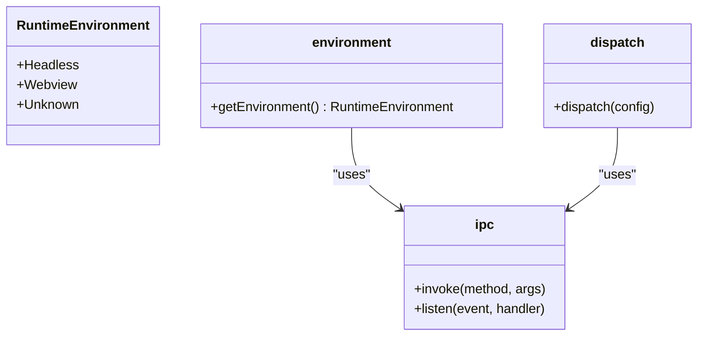

# 插件开发指南

<cite>
**本文档中引用的文件**  
- [manifest.json](file://plugins-sdk/manifest.json)
- [index.ts](file://plugins-sdk/src/index.ts)
- [ipc.ts](file://plugins-sdk/src/core/ipc.ts)
- [environment.ts](file://plugins-sdk/src/core/environment.ts)
- [command.ts](file://plugins-sdk/src/api/command.ts)
- [notification.ts](file://plugins-sdk/src/api/notification.ts)
- [request.ts](file://plugins-sdk/src/api/request.ts)
- [plugin_manager.rs](file://src-tauri/src/plugin_manager.rs)
- [plugin.json](file://src-tauri/capabilities/plugin.json)
- [default.json](file://src-tauri/capabilities/default.json)
</cite>

## 目录

1. [简介](#简介)
2. [插件目录结构](#插件目录结构)
3. [插件清单文件 (manifest.json)](#插件清单文件-manifestjson)
4. [权限声明机制](#权限声明机制)
5. [插件SDK API详解](#插件sdk-api详解)
6. [headless插件开发示例](#headless插件开发示例)
7. [UI插件开发示例](#ui插件开发示例)
8. [`plugin://`自定义协议](#plugin自定义协议)
9. [沙箱安全模型](#沙箱安全模型)
10. [总结](#总结)

## 简介

本指南旨在为第三方开发者提供一份详尽的Baize插件开发文档。Baize是一个基于Tauri、SvelteKit和TypeScript构建的快速启动应用程序，其核心功能之一是支持插件扩展。通过本指南，您将学习如何从零开始创建插件，涵盖插件的整个生命周期，包括目录结构、配置文件、API使用、安全模型等关键方面。

**Section sources**
- [README.md](file://README.md#L1-L45)

## 插件目录结构

一个标准的Baize插件应遵循特定的目录结构，以便被主应用程序正确识别和加载。插件通常位于用户数据目录下的`plugins`文件夹中。

典型的插件目录结构如下：
```
plugins/
└── my-plugin/
    ├── manifest.json
    ├── index.js (或 index.html)
    ├── assets/
    │   ├── icon.png
    │   └── style.css
    └── lib/
        └── utils.js
```

- `my-plugin/`: 插件的根目录，其名称可以自定义。
- `manifest.json`: 插件的清单文件，包含插件的元数据、入口点和权限声明。
- `index.js`: 对于headless插件，这是主要的JavaScript入口文件。
- `index.html`: 对于UI插件，这是主要的HTML入口文件。
- `assets/`: 存放插件所需的静态资源，如图标、样式表和图片。
- `lib/`: 存放插件的辅助JavaScript模块。

主应用程序通过`plugin_manager.rs`中的`load_plugins`函数扫描`plugins`目录，读取每个子目录中的`manifest.json`文件来加载插件。

**Section sources**
- [plugin_manager.rs](file://src-tauri/src/plugin_manager.rs#L1-L199)

## 插件清单文件 (manifest.json)

`manifest.json`是插件的核心配置文件，它定义了插件的基本信息、入口点、命令和权限。以下是`manifest.json`文件的完整配置选项：

```json
{
  "id": "com.example.my-plugin",
  "name": "My Plugin",
  "version": "1.0.0",
  "description": "A sample plugin for Baize",
  "entry": "index.js",
  "type": "headless",
  "commands": [
    {
      "code": "greet",
      "name": "Greet User",
      "description": "Sends a greeting message",
      "keywords": [
        {
          "name": "hello",
          "type": "prefix"
        }
      ]
    }
  ],
  "permissions": {
    "network": ["https://api.example.com"]
  }
}
```

### 配置选项详解

| 配置项 | 类型 | 必填 | 说明 |
| :--- | :--- | :--- | :--- |
| `id` | string | 是 | 插件的唯一标识符，建议使用反向域名格式（如`com.example.plugin-name`）。 |
| `name` | string | 是 | 插件的显示名称，将出现在用户界面中。 |
| `version` | string | 是 | 插件的版本号，遵循语义化版本规范。 |
| `description` | string | 否 | 插件的详细描述，帮助用户理解插件功能。 |
| `entry` | string | 是 | 插件的入口文件路径，相对于插件根目录。对于headless插件，通常是`.js`文件；对于UI插件，通常是`.html`文件。 |
| `type` | string | 否 | 插件类型，可选值为`headless`或`ui`。如果省略，系统将根据`entry`文件的扩展名自动判断。 |
| `commands` | array | 否 | 插件提供的命令列表。每个命令包含代码、名称、描述和关键词。 |
| `permissions` | object | 否 | 插件请求的权限声明，如网络访问权限。 |

**Section sources**
- [plugin_manager.rs](file://src-tauri/src/plugin_manager.rs#L1-L199)

## 权限声明机制

Baize采用基于能力（Capability）的权限模型，确保插件在安全的沙箱环境中运行。插件必须在`manifest.json`文件中明确声明其所需的权限。

### 网络权限

目前，插件主要通过`permissions.network`字段声明其需要访问的网络资源。这是一个字符串数组，包含允许访问的域名或URL前缀。

```json
{
  "permissions": {
    "network": ["https://api.github.com", "https://*.example.com"]
  }
}
```

当插件使用`request` API发起网络请求时，宿主应用会检查请求的URL是否在`permissions.network`列表中。如果不在列表中，请求将被拒绝，并抛出`PermissionDeniedError`。

### 能力（Capability）系统

Baize的权限系统基于Tauri的能力（Capability）机制。在`src-tauri/capabilities/`目录下定义了不同的能力配置文件：

- `default.json`: 主窗口的能力配置。
- `plugin.json`: 插件窗口的能力配置。

`plugin.json`文件定义了插件窗口可以执行的操作，如关闭、隐藏、显示、最小化、最大化等，但不包括访问系统文件或执行任意命令等高风险操作。

```json
{
  "identifier": "plugin-capability",
  "windows": ["plugin_*"],
  "permissions": [
    "core:window:allow-close",
    "core:window:allow-hide",
    "core:window:allow-show",
    "core:window:allow-minimize",
    "core:window:allow-maximize"
  ]
}
```

这种设计确保了插件只能在分配给它的特定窗口标签（如`plugin_*`）上执行预定义的操作，从而实现了细粒度的权限控制。

**Section sources**
- [plugin_manager.rs](file://src-tauri/src/plugin_manager.rs#L1-L199)
- [plugin.json](file://src-tauri/capabilities/plugin.json#L1-L22)
- [default.json](file://src-tauri/capabilities/default.json#L1-L23)

## 插件SDK API详解

Baize提供了`plugins-sdk`，这是一个TypeScript库，封装了与宿主应用通信的底层细节，使插件开发更加简单和一致。

### 核心模块

`plugins-sdk`的核心模块位于`src/core/`目录下，主要包括：

- `ipc.ts`: 负责进程间通信（IPC），根据运行环境（Webview或Headless）动态加载相应的Tauri API。
- `environment.ts`: 检测当前运行环境，区分Webview和Headless模式。



**Diagram sources**
- [environment.ts](file://plugins-sdk/src/core/environment.ts#L1-L36)
- [ipc.ts](file://plugins-sdk/src/core/ipc.ts#L1-L97)

### 命令注册 API

`registerCommandHandler`函数允许插件注册一个处理器函数，当用户在主应用中执行该插件的命令时，此函数将被调用。

```typescript
import { registerCommandHandler } from 'baize-sdk';

registerCommandHandler(async (command, args) => {
  if (command === 'greet') {
    return `Hello, ${args.name || 'World'}!`;
  }
  throw new Error(`Unknown command: ${command}`);
});
```

该API的实现利用了`dispatch`函数，根据运行环境选择不同的事件监听方式：
- 在Webview环境中，使用Tauri的`listen`函数监听`plugin_command_execute`事件。
- 在Headless环境中，直接将处理器函数挂载到全局变量`__BAIZE_COMMAND_HANDLER__`上。

**Section sources**
- [command.ts](file://plugins-sdk/src/api/command.ts#L1-L48)

### 网络请求 API (`request`)

`request` API允许插件发起HTTP请求。它封装了底层的网络调用，并提供了统一的错误处理机制。

```typescript
import { request } from 'baize-sdk';

const response = await request({
  url: 'https://api.github.com/users/octocat',
  method: 'GET',
  timeout: 10000,
  responseType: 'json'
});

console.log(response.body);
```

该API会抛出特定类型的错误，开发者可以使用类型守卫函数进行精确的错误处理：

```typescript
import { 
  isPermissionDeniedError, 
  isTimeoutError, 
  isHttpError 
} from 'baize-sdk';

try {
  const response = await request(options);
} catch (error) {
  if (isPermissionDeniedError(error)) {
    console.error('权限被拒绝:', error.url);
  } else if (isTimeoutError(error)) {
    console.error('请求超时:', error.timeout);
  } else if (isHttpError(error)) {
    console.error('HTTP错误:', error.response.status);
  }
}
```

**Section sources**
- [request.ts](file://plugins-sdk/src/api/request.ts#L1-L144)

### 发送通知 API (`notification`)

`showNotification`函数允许插件显示系统通知。

```typescript
import { showNotification } from 'baize-sdk';

await showNotification({
  title: '任务完成',
  body: '您的文件已成功上传。'
});
```

该API同样使用`dispatch`函数处理Webview和Headless环境的差异，确保在不同模式下都能正常工作。

**Section sources**
- [notification.ts](file://plugins-sdk/src/api/notification.ts#L1-L21)

## headless插件开发示例

headless插件是一种在后台运行的JavaScript脚本，没有用户界面。它通常用于执行简单的计算、数据处理或后台任务。

### 创建一个简单的headless插件

1.  **创建插件目录**:
    ```bash
    mkdir -p ~/.baize/plugins/hello-world
    cd ~/.baize/plugins/hello-world
    ```

2.  **创建 `manifest.json`**:
    ```json
    {
      "id": "com.baize.hello-world",
      "name": "Hello World",
      "version": "1.0.0",
      "description": "A simple headless plugin",
      "entry": "index.js",
      "type": "headless",
      "commands": [
        {
          "code": "say-hello",
          "name": "Say Hello",
          "description": "Greets the user",
          "keywords": [
            {
              "name": "hi",
              "type": "prefix"
            }
          ]
        }
      ]
    }
    ```

3.  **创建 `index.js`**:
    ```javascript
    import { registerCommandHandler } from 'baize-sdk';

    registerCommandHandler(async (command, args) => {
      if (command === 'say-hello') {
        const name = args.name || 'World';
        return `Hello, ${name}! This is a headless plugin.`;
      }
      return `Unknown command: ${command}`;
    });
    ```

4.  **重启