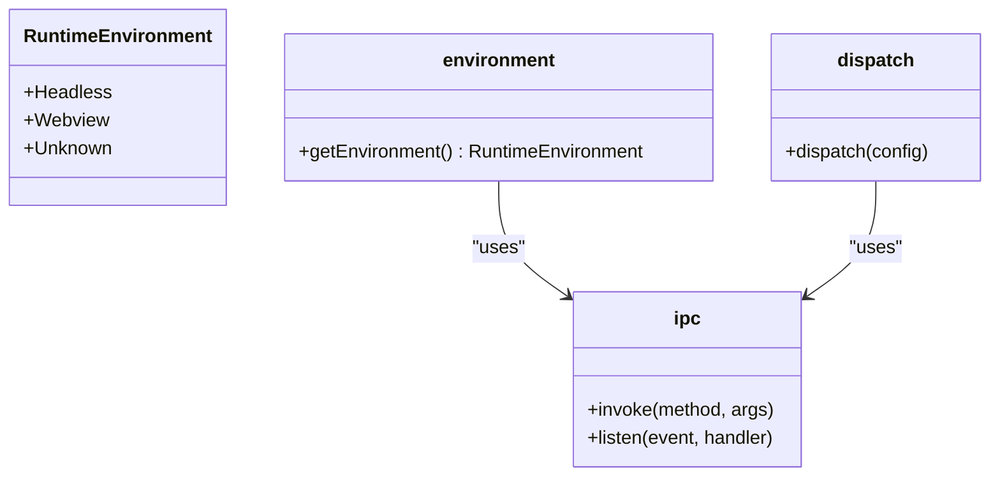

# 插件开发指南

<cite>
**本文档中引用的文件**  
- [manifest.json](file://plugins-sdk/manifest.json)
- [index.ts](file://plugins-sdk/src/index.ts)
- [ipc.ts](file://plugins-sdk/src/core/ipc.ts)
- [environment.ts](file://plugins-sdk/src/core/environment.ts)
- [command.ts](file://plugins-sdk/src/api/command.ts)
- [notification.ts](file://plugins-sdk/src/api/notification.ts)
- [request.ts](file://plugins-sdk/src/api/request.ts)
- [storage.ts](file://plugins-sdk/src/api/storage.ts)
- [permissions.ts](file://plugins-sdk/src/types/permissions.ts)
- [plugin_manager.rs](file://src-tauri/src/plugin_manager.rs)
- [plugin.json](file://src-tauri/capabilities/plugin.json)
- [default.json](file://src-tauri/capabilities/default.json)
- [PERMISSIONS_REFACTOR.md](file://PERMISSIONS_REFACTOR.md)
</cite>

## 更新摘要
**已做更改**
- 更新了权限声明机制部分，反映从扁平结构到命名空间结构的重构。
- 修订了插件SDK API详解部分，以体现API通过命名空间导出的新模式。
- 在API详解中新增了`storage`模块和`debug`调试对象的说明。
- 更新了代码示例，展示新的命名空间导入方式。
- 移除了过时的独立API导入示例。

### 目录

1. [简介](#简介)
2. [插件目录结构](#插件目录结构)
3. [插件清单文件 (manifest.json)](#插件清单文件-manifestjson)
4. [权限声明机制](#权限声明机制)
5. [插件SDK API详解](#插件sdk-api详解)
6. [headless插件开发示例](#headless插件开发示例)
7. [UI插件开发示例](#ui插件开发示例)
8. [`plugin://`自定义协议](#plugin自定义协议)
9. [沙箱安全模型](#沙箱安全模型)
10. [总结](#总结)

## 简介

本指南旨在为第三方开发者提供一份详尽的Baize插件开发文档。Baize是一个基于Tauri、SvelteKit和TypeScript构建的快速启动应用程序，其核心功能之一是支持插件扩展。通过本指南，您将学习如何从零开始创建插件，涵盖插件的整个生命周期，包括目录结构、配置文件、API使用、安全模型等关键方面。

**Section sources**
- [README.md](file://README.md#L1-L45)

## 插件目录结构

一个标准的Baize插件应遵循特定的目录结构，以便被主应用程序正确识别和加载。插件通常位于用户数据目录下的`plugins`文件夹中。

典型的插件目录结构如下：
```bash
plugins/
└── my-plugin/
    ├── manifest.json
    ├── index.js (或 index.html)
    ├── assets/
    │   ├── icon.png
    │   └── style.css
    └── lib/
        └── utils.js
```

- `my-plugin/`: 插件的根目录，其名称可以自定义。
- `manifest.json`: 插件的清单文件，包含插件的元数据、入口点和权限声明。
- `index.js`: 对于headless插件，这是主要的JavaScript入口文件。
- `index.html`: 对于UI插件，这是主要的HTML入口文件。
- `assets/`: 存放插件所需的静态资源，如图标、样式表和图片。
- `lib/`: 存放插件的辅助JavaScript模块。

主应用程序通过`plugin_manager.rs`中的`load_plugins`函数扫描`plugins`目录，读取每个子目录中的`manifest.json`文件来加载插件。

**Section sources**
- [plugin_manager.rs](file://src-tauri/src/plugin_manager.rs#L1-L199)

## 插件清单文件 (manifest.json)

`manifest.json`是插件的核心配置文件，它定义了插件的基本信息、入口点、命令和权限。以下是`manifest.json`文件的完整配置选项：

```json
{
  "id": "com.example.my-plugin",
  "name": "My Plugin",
  "version": "1.0.0",
  "description": "A sample plugin for Baize",
  "entry": "index.js",
  "type": "headless",
  "commands": [
    {
      "id": "greet",
      "name": "Greet User",
      "description": "Sends a greeting message"
    }
  ],
  "permissions": {
    "http": {
      "enable": true,
      "allowUrls": ["https://api.example.com/*"],
      "timeout": 30000,
      "maxRetries": 3
    },
    "storage": {
      "enable": true,
      "local": true,
      "session": false,
      "maxSize": "10MB"
    },
    "notification": {
      "enable": true,
      "sound": true,
      "badge": false
    },
    "command": {
      "enable": true,
      "allowCommands": ["*"]
    }
  }
}
```

### 配置选项详解

| 配置项 | 类型 | 必填 | 说明 |
| :--- | :--- | :--- | :--- |
| `id` | string | 是 | 插件的唯一标识符，建议使用反向域名格式（如`com.example.plugin-name`）。 |
| `name` | string | 是 | 插件的显示名称，将出现在用户界面中。 |
| `version` | string | 是 | 插件的版本号，遵循语义化版本规范。 |
| `description` | string | 否 | 插件的详细描述，帮助用户理解插件功能。 |
| `entry` | string | 是 | 插件的入口文件路径，相对于插件根目录。对于headless插件，通常是`.js`文件；对于UI插件，通常是`.html`文件。 |
| `type` | string | 否 | 插件类型，可选值为`headless`或`ui`。如果省略，系统将根据`entry`文件的扩展名自动判断。 |
| `commands` | array | 否 | 插件提供的命令列表。每个命令包含ID、名称和描述。 |
| `permissions` | object | 否 | 插件请求的权限声明，采用命名空间结构。 |

**Section sources**
- [plugin_manager.rs](file://src-tauri/src/plugin_manager.rs#L1-L199)
- [permissions.ts](file://plugins-sdk/src/types/permissions.ts#L67-L67)

## 权限声明机制

Baize采用基于能力（Capability）的权限模型，确保插件在安全的沙箱环境中运行。插件必须在`manifest.json`文件中明确声明其所需的权限。最新的权限系统已被重构为命名空间结构，提供了更细粒度的控制。

### 命名空间权限结构

权限现在分为多个子模块：`http`、`storage`、`notification` 和 `command`。每个模块都有一个 `enable` 开关和具体的配置选项。

#### HTTP 权限 (`http`)
```json
{
  "permissions": {
    "http": {
      "enable": true,
      "allowUrls": ["https://api.github.com", "https://*.example.com"],
      "timeout": 30000,
      "maxRetries": 3
    }
  }
}
```
- `enable`: 是否启用HTTP权限。
- `allowUrls`: 允许访问的URL列表，支持通配符。
- `timeout`: 请求超时时间（毫秒）。
- `maxRetries`: 最大重试次数。

当插件使用`http.request` API发起网络请求时，宿主应用会检查请求的URL是否在`allowUrls`列表中。如果不在列表中，请求将被拒绝，并抛出`PermissionDeniedError`。

#### 存储权限 (`storage`)
```json
{
  "permissions": {
    "storage": {
      "enable": true,
      "local": true,
      "session": false,
      "maxSize": "10MB"
    }
  }
}
```
- `enable`: 是否启用存储权限。
- `local`: 是否允许使用本地存储。
- `session`: 是否允许使用会话存储。
- `maxSize`: 最大存储容量。

#### 通知权限 (`notification`)
```json
{
  "permissions": {
    "notification": {
      "enable": true,
      "sound": true,
      "badge": false
    }
  }
}
```
- `enable`: 是否启用通知权限。
- `sound`: 是否允许播放声音。
- `badge`: 是否允许更新应用徽章。

#### 命令权限 (`command`)
```json
{
  "permissions": {
    "command": {
      "enable": true,
      "allowCommands": ["greet-*", "fetch-data"]
    }
  }
}
```
- `enable`: 是否启用命令执行权限。
- `allowCommands`: 允许执行的命令ID列表，支持通配符。

### 能力（Capability）系统

Baize的权限系统基于Tauri的能力（Capability）机制。在`src-tauri/capabilities/`目录下定义了不同的能力配置文件：

- `default.json`: 主窗口的能力配置。
- `plugin.json`: 插件窗口的能力配置。

`plugin.json`文件定义了插件窗口可以执行的操作，如关闭、隐藏、显示、最小化、最大化等，但不包括访问系统文件或执行任意命令等高风险操作。

```json
{
  "identifier": "plugin-capability",
  "windows": ["plugin_*"],
  "permissions": [
    "core:window:allow-close",
    "core:window:allow-hide",
    "core:window:allow-show",
    "core:window:allow-minimize",
    "core:window:allow-maximize"
  ]
}
```

这种设计确保了插件只能在分配给它的特定窗口标签（如`plugin_*`）上执行预定义的操作，从而实现了细粒度的权限控制。

**Section sources**
- [plugin_manager.rs](file://src-tauri/src/plugin_manager.rs#L1-L199)
- [plugin.json](file://src-tauri/capabilities/plugin.json#L1-L22)
- [default.json](file://src-tauri/capabilities/default.json#L1-L23)
- [PERMISSIONS_REFACTOR.md](file://PERMISSIONS_REFACTOR.md#L1-L103)

## 插件SDK API详解

Baize提供了`plugins-sdk`，这是一个TypeScript库，封装了与宿主应用通信的底层细节，使插件开发更加简单和一致。SDK的API现在通过统一的命名空间导出，提高了使用的一致性。

### 核心模块

`plugins-sdk`的核心模块位于`src/core/`目录下，主要包括：

- `ipc.ts`: 负责进程间通信（IPC），根据运行环境（Webview或Headless）动态加载相应的Tauri API。
- `environment.ts`: 检测当前运行环境，区分Webview和Headless模式。



**Diagram sources**
- [environment.ts](file://plugins-sdk/src/core/environment.ts#L1-L36)
- [ipc.ts](file://plugins-sdk/src/core/ipc.ts#L1-L97)

### 命令注册 API

`command.register`函数允许插件注册一个处理器函数，当用户在主应用中执行该插件的命令时，此函数将被调用。

```typescript
import { command } from 'baize-sdk';

command.register(async (cmdId, args) => {
  if (cmdId === 'greet') {
    return `Hello, ${args.name || 'World'}!`;
  }
  throw new Error(`Unknown command: ${cmdId}`);
});
```

该API的实现利用了`dispatch`函数，根据运行环境选择不同的事件监听方式：
- 在Webview环境中，使用Tauri的`listen`函数监听`plugin_command_execute`事件。
- 在Headless环境中，直接将处理器函数挂载到全局变量`__BAIZE_COMMAND_HANDLER__`上。

**Section sources**
- [command.ts](file://plugins-sdk/src/api/command.ts#L16-L48)

### 网络请求 API (`http`)

`http` API允许插件发起HTTP请求。它封装了底层的网络调用，并提供了统一的错误处理机制。

```typescript
import { http } from 'baize-sdk';

const response = await http.get('https://api.github.com/users/octocat');

console.log(response.body);
```

该API还提供便捷方法如`post`、`put`、`patch`和`delete`。

```typescript
// 发起 POST 请求
const postResponse = await http.post('https://api.example.com/data', { name: 'John' });

// 发起 PUT 请求
const putResponse = await http.put('https://api.example.com/data/1', { name: 'Jane' });
```

该API会抛出特定类型的错误，开发者可以使用类型守卫函数进行精确的错误处理：

```typescript
import { http } from 'baize-sdk';

try {
  const response = await http.get('/api/data');
} catch (error) {
  if (http.errors.isPermissionDeniedError(error)) {
    console.error('权限被拒绝:', error.url);
  } else if (http.errors.isTimeoutError(error)) {
    console.error('请求超时:', error.timeout);
  } else if (http.errors.isHttpError(error)) {
    console.error('HTTP错误:', error.response.status);
  }
}
```

**Section sources**
- [request.ts](file://plugins-sdk/src/api/request.ts#L109-L144)

### 发送通知 API (`notification`)

`notification.show`函数允许插件显示系统通知。

```typescript
import { notification } from 'baize-sdk';

await notification.show({
  title: '任务完成',
  body: '您的文件已成功上传。'
});
```

该API同样使用`dispatch`函数处理Webview和Headless环境的差异，确保在不同模式下都能正常工作。

**Section sources**
- [notification.ts](file://plugins-sdk/src/api/notification.ts#L14-L21)

### 存储 API (`storage`)

`storage` API允许插件在本地持久化数据。

```typescript
import { storage } from 'baize-sdk';

// 存储数据
await storage.setItem('username', 'alice');

// 读取数据
const username = await storage.getItem<string>('username');

// 删除数据
await storage.removeItem('username');

// 批量操作
await storage.setItems({ key1: 'value1', key2: 'value2' });
const values = await storage.getItems(['key1', 'key2']);
```

**Section sources**
- [storage.ts](file://plugins-sdk/src/api/storage.ts#L0-L101)

### 调试工具 (`debug`)

SDK新增了`debug`对象，用于运行时调试和诊断。

```typescript
import { debug } from 'baize-sdk';

// 获取运行时信息
console.log(debug.getRuntimeInfo());

// 测试与宿主的连接
const connectionTest = await debug.testConnection();
if (connectionTest.success) {
  console.log('与宿主连接正常');
} else {
  console.error('连接失败:', connectionTest.error);
}

// 查看SDK版本
console.log('SDK版本:', debug.version);
```

**Section sources**
- [index.ts](file://plugins-sdk/src/index.ts#L38-L55)

## headless插件开发示例

headless插件是一种在后台运行的JavaScript脚本，没有用户界面。它通常用于执行简单的计算、数据处理或后台任务。

### 创建一个简单的headless插件

1.  **创建插件目录**:
    ```bash
    mkdir -p ~/.baize/plugins/hello-world
    cd ~/.baize/plugins/hello-world
    ```

2.  **创建 `manifest.json`**:
    ```json
    {
      "id": "com.baize.hello-world",
      "name": "Hello World",
      "version": "1.0.0",
      "description": "A simple headless plugin",
      "entry": "index.js",
      "type": "headless",
      "commands": [
        {
          "id": "say-hello",
          "name": "Say Hello",
          "description": "Greets the user"
        }
      ],
      "permissions": {
        "notification": {
          "enable": true,
          "sound": true
        }
      }
    }
    ```

3.  **创建 `index.js`**:
    ```javascript
    import { command, notification } from 'baize-sdk';

    command.register(async (cmdId, args) => {
      if (cmdId === 'say-hello') {
        const name = args.name || 'World';
        const message = `Hello, ${name}! This is a headless plugin.`;
        
        // 发送通知
        await notification.show({
          title: '问候',
          body: message
        });
        
        return message;
      }
      return `Unknown command: ${cmdId}`;
    });
    ```

4.  **重启Baize应用**，插件将被自动加载。

**Section sources**
- [command.ts](file://plugins-sdk/src/api/command.ts#L16-L48)
- [notification.ts](file://plugins-sdk/src/api/notification.ts#L14-L21)

## UI插件开发示例

UI插件拥有自己的用户界面，通常由HTML、CSS和JavaScript组成。

### 创建一个简单的UI插件

1.  **创建插件目录**:
    ```bash
    mkdir -p ~/.baize/plugins/ui-demo
    cd ~/.baize/plugins/ui-demo
    ```

2.  **创建 `manifest.json`**:
    ```json
    {
      "id": "com.baize.ui-demo",
      "name": "UI Demo",
      "version": "1.0.0",
      "description": "A simple UI plugin",
      "entry": "index.html",
      "type": "ui",
      "permissions": {
        "http": {
          "enable": true,
          "allowUrls": ["https://api.github.com"]
        }
      }
    }
    ```

3.  **创建 `index.html`**:
    ```html
    <!DOCTYPE html>
    <html>
    <head>
      <title>UI Demo</title>
      <style>
        body { font-family: Arial, sans-serif; padding: 20px; }
        button { padding: 10px; margin: 5px; }
      </style>
    </head>
    <body>
      <h1>UI 插件演示</h1>
      <button id="fetchBtn">获取 GitHub 用户信息</button>
      <div id="result"></div>

      <script type="module">
        import { http } from '../node_modules/baize-sdk/dist/index.js';

        document.getElementById('fetchBtn').addEventListener('click', async () => {
          try {
            const response = await http.get('https://api.github.com/users/octocat');
            document.getElementById('result').innerHTML = 
              `<p><strong>用户名:</strong> ${response.body.login}</p>
               <p><strong>ID:</strong> ${response.body.id}</p>`;
          } catch (error) {
            document.getElementById('result').innerHTML = 
              `<p style="color:red;">错误: ${error.message}</p>`;
          }
        });
      </script>
    </body>
    </html>
    ```

4.  **重启Baize应用**，通过命令面板打开插件。

**Section sources**
- [request.ts](file://plugins-sdk/src/api/request.ts#L109-L144)

## `plugin://`自定义协议

`plugin://`协议是Baize用于内部插件通信的自定义URL方案。它允许主应用安全地加载和交互插件资源。

### 工作原理

- **URL格式**: `plugin://<plugin-id>/<path>`
- **安全性**: 只有已安装并启用的插件才能通过此协议访问其资源。
- **沙箱**: 每个插件在自己的域内运行，防止跨插件脚本攻击。

例如，一个ID为`com.baize.hello-world`的插件可以通过`plugin://com.baize.hello-world/assets/icon.png`访问其图标。

## 沙箱安全模型

Baize的插件系统建立在严格的沙箱安全模型之上，确保插件无法访问未授权的系统资源。

### 安全特性

1.  **权限最小化**: 插件默认没有任何权限，必须在`manifest.json`中显式声明。
2.  **能力隔离**: 使用Tauri的能力系统限制插件窗口的操作范围。
3.  **网络白名单**: 通过`permissions.http.allowUrls`严格控制网络访问。
4.  **存储隔离**: 每个插件的数据存储相互隔离，无法访问其他插件的数据。
5.  **代码执行**: 插件代码在受限的JavaScript环境中执行，无法直接调用Node.js或系统API。

### 安全最佳实践

- 仅请求必要的权限。
- 在`allowUrls`中使用最严格的匹配模式。
- 定期审查插件的权限需求。
- 利用`debug`工具进行安全审计。

## 总结

本指南全面介绍了Baize插件开发的各个方面。通过遵循这些指导原则，您可以创建功能强大且安全的插件来扩展Baize的功能。记住始终在`manifest.json`中声明所需的权限，并使用SDK提供的API进行安全的通信和数据操作。