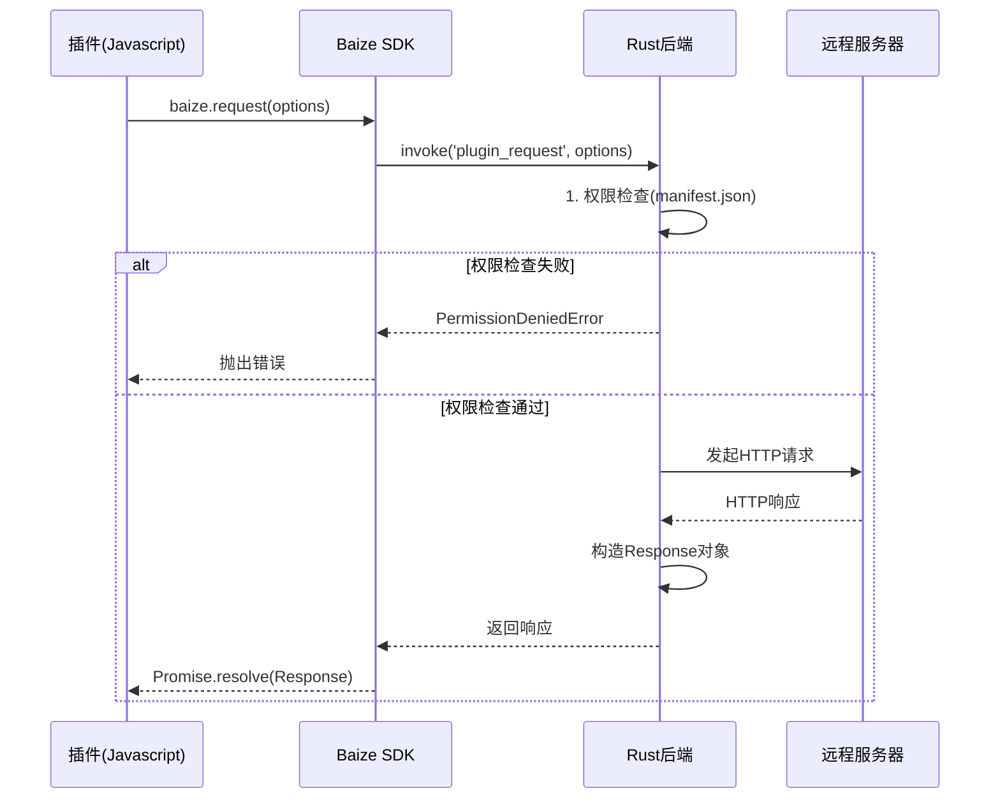
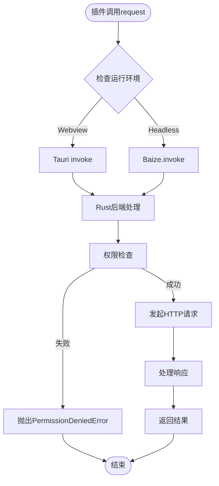
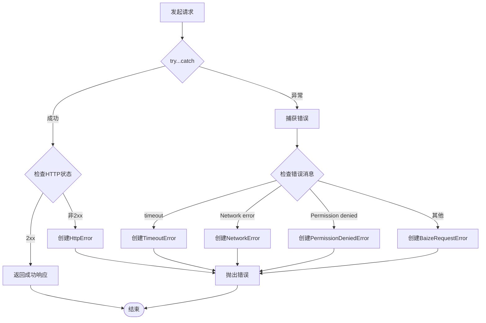

# 网络请求API

<cite>
**本文档引用的文件**
- [baize-request-api-design.md](file://baize-request-api-design.md)
- [plugins-sdk/src/api/request.ts](file://plugins-sdk/src/api/request.ts)
- [src-tauri/src/plugin_api/request.rs](file://src-tauri/src/plugin_api/request.rs)
- [PERMISSIONS_REFACTOR.md](file://PERMISSIONS_REFACTOR.md)
</cite>

## 更新摘要
**已更改内容**
- 更新了权限控制系统部分，反映 `permissions.http.allowUrls` 的新路径
- 修正了错误消息中关于权限声明位置的描述
- 更新了相关代码示例中的错误提示信息

### 目录
1. [简介](#简介)
2. [API接口定义](#api接口定义)
3. [权限控制系统](#权限控制系统)
4. [跨环境实现策略](#跨环境实现策略)
5. [错误处理机制](#错误处理机制)
6. [使用示例](#使用示例)
7. [性能考虑](#性能考虑)
8. [故障排除指南](#故障排除指南)
9. [总结](#总结)

## 简介

Baize网络请求API (`baize.request`)是一个专为插件设计的强大且类型安全的网络通信解决方案。该API通过统一的接口封装了底层的HTTP客户端，为插件提供了安全可靠的网络访问能力。它支持多种HTTP方法、灵活的请求头和请求体配置，以及完善的错误处理机制。

该API的核心设计理念是将所有网络请求统一转发到Rust后端进行处理，从而绕过浏览器的CORS限制并集中实施安全策略。这种设计确保了插件可以自由访问任何已授权的第三方API，同时保持了严格的安全控制。

## API接口定义

### 支持的HTTP方法

```typescript
export type HttpMethod = 'GET' | 'POST' | 'PUT' | 'DELETE' | 'PATCH' | 'HEAD' | 'OPTIONS';
```

### 响应体类型

```typescript
export type ResponseType = 'json' | 'text' | 'arraybuffer';
```

### 请求体类型

```typescript
export type RequestBody = string | ArrayBuffer | Record<string, any>;
```

### RequestOptions接口

```typescript
export interface RequestOptions {
  url: string;                    // 必需：请求的URL
  method?: HttpMethod;           // 可选：HTTP方法，默认为'GET'
  headers?: Record<string, string>; // 可选：请求头对象
  body?: RequestBody;            // 可选：请求体
  timeout?: number;              // 可选：超时时间（毫秒），默认30000ms
  responseType?: ResponseType;   // 可选：期望的响应体格式，默认'json'
}
```

### Response接口

```typescript
export interface Response<T = any> {
  readonly status: number;       // HTTP状态码
  readonly statusText: string;   // HTTP状态文本
  readonly headers: Record<string, string>; // HTTP响应头
  readonly body: T;             // 响应体，类型由responseType决定
}
```

**章节来源**
- [baize-request-api-design.md](file://baize-request-api-design.md#L8-L65)
- [plugins-sdk/src/api/request.ts](file://plugins-sdk/src/api/request.ts#L1-L25)

## 权限控制系统

### manifest.json权限声明

插件必须在其`manifest.json`文件中声明所需的网络权限：

```json
{
  "id": "com.example.my-plugin",
  "name": "My Awesome Plugin",
  "version": "1.0.0",
  "permissions": {
    "http": {
      "enable": true,
      "allowUrls": [
        "https://api.example.com",
        "https://*.github.com",
        "https://raw.githubusercontent.com"
      ]
    }
  }
}
```

### 权限匹配规则

1. **精确匹配**：声明`https://api.example.com`允许访问该域名下的所有路径
2. **通配符匹配**：`https://*.github.com`匹配`https://api.github.com`和`https://gist.github.com`
3. **协议必须声明**：必须明确指定`http://`或`https://`
4. **端口支持**：非标准端口需要在声明中包含

### 权限检查流程



**图表来源**
- [baize-request-api-design.md](file://baize-request-api-design.md#L157-L173)
- [src-tauri/src/plugin_api/request.rs](file://src-tauri/src/plugin_api/request.rs#L175-L249)

**章节来源**
- [baize-request-api-design.md](file://baize-request-api-design.md#L129-L155)
- [src-tauri/src/plugin_api/request.rs](file://src-tauri/src/plugin_api/request.rs#L175-L249)

## 跨环境实现策略

### 统一的JavaScript SDK

`plugins-sdk`为插件开发者提供统一的`baize.request`函数，内部通过适配器模式自动处理不同环境下的调用方式：

- **Webview环境**：使用`@tauri-apps/api`包的`invoke`函数
- **Headless环境**：通过Deno运行时注入的`Baize.invoke`函数

### Rust后端核心处理器

所有请求最终到达Rust后端的`plugin_request`命令，负责处理所有逻辑：



**图表来源**
- [plugins-sdk/src/core/ipc.ts](file://plugins-sdk/src/core/ipc.ts#L1-L97)
- [plugins-sdk/src/core/environment.ts](file://plugins-sdk/src/core/environment.ts#L1-L36)

### 核心优势

1. **绕过CORS**：Rust服务端发起请求，不受浏览器同源策略限制
2. **安全可控**：权限控制逻辑集中在后端，无法被绕过
3. **性能与功能**：利用Rust成熟生态库提供高性能HTTP能力
4. **代码一致性**：插件开发者只需学习一套API

**章节来源**
- [baize-request-api-design.md](file://baize-request-api-design.md#L175-L227)

## 错误处理机制

### 错误类型定义

```typescript
export interface BaizeRequestError extends Error {
  name: 'BaizeRequestError';
}

export interface PermissionDeniedError extends Error {
  name: 'PermissionDeniedError';
  url: string;
}

export interface TimeoutError extends Error {
  name: 'TimeoutError';
  url: string;
  timeout: number;
}

export interface NetworkError extends Error {
  name: 'NetworkError';
}

export interface HttpError extends Error {
  name: 'HttpError';
  response: Response;
}
```

### 错误工厂函数

```typescript
export function createPermissionDeniedError(url: string, message?: string): PermissionDeniedError;
export function createTimeoutError(url: string, timeout: number, message?: string): TimeoutError;
export function createNetworkError(message: string): NetworkError;
export function createHttpError(response: Response): HttpError;
```

### 类型检查函数

```typescript
export function isBaizeRequestError(error: any): error is BaizeRequestError;
export function isPermissionDeniedError(error: any): error is PermissionDeniedError;
export function isTimeoutError(error: any): error is TimeoutError;
export function isNetworkError(error: any): error is NetworkError;
export function isHttpError(error: any): error is HttpError;
```

### 错误处理流程



**图表来源**
- [plugins-sdk/src/api/request.ts](file://plugins-sdk/src/api/request.ts#L40-L144)

**章节来源**
- [baize-request-api-design.md](file://baize-request-api-design.md#L229-L278)
- [plugins-sdk/src/api/request.ts](file://plugins-sdk/src/api/request.ts#L40-L144)

## 使用示例

### 基本GET请求

```typescript
import { request } from 'baize-plugin-sdk';

async function fetchData() {
  try {
    const response = await request({
      url: 'https://api.example.com/data',
      method: 'GET',
    });
    console.log('数据:', response.body);
    console.log('状态码:', response.status);
  } catch (error) {
    console.error('请求失败:', error);
  }
}
```

### POST请求示例

```typescript
import { request, isHttpError, isPermissionDeniedError } from 'baize-plugin-sdk';

async function postData() {
  try {
    const response = await request({
      url: 'https://api.example.com/users',
      method: 'POST',
      headers: {
        'Content-Type': 'application/json',
        'Authorization': 'Bearer token123'
      },
      body: {
        name: 'Baize',
        email: 'baize@example.com'
      },
      timeout: 10000, // 10秒超时
      responseType: 'json'
    });
    
    console.log('创建成功:', response.body);
  } catch (error) {
    if (isHttpError(error)) {
      console.error('服务器错误:', error.response.status, error.response.body);
    } else if (isPermissionDeniedError(error)) {
      console.error('权限不足，请检查manifest.json中的http权限');
    } else {
      console.error('其他错误:', error.message);
    }
  }
}
```

### 处理二进制数据

```typescript
import { request } from 'baize-plugin-sdk';

async function downloadFile() {
  try {
    const response = await request({
      url: 'https://example.com/image.png',
      method: 'GET',
      responseType: 'arraybuffer'
    });
    
    // response.body将是ArrayBuffer类型
    const arrayBuffer = response.body as ArrayBuffer;
    console.log('文件大小:', arrayBuffer.byteLength);
    
    // 可以转换为Blob或其他格式
    const blob = new Blob([arrayBuffer], { type: 'image/png' });
    const imageUrl = URL.createObjectURL(blob);
    console.log('图片URL:', imageUrl);
  } catch (error) {
    console.error('下载失败:', error);
  }
}
```

### 高级配置示例

```typescript
import { request } from 'baize-plugin-sdk';

async function advancedRequest() {
  try {
    const response = await request({
      url: 'https://api.github.com/repos/baize-data/baize',
      method: 'GET',
      headers: {
        'Accept': 'application/vnd.github.v3+json',
        'User-Agent': 'Baize-Plugin/1.0'
      },
      timeout: 30000, // 30秒超时
      responseType: 'json'
    });
    
    // 处理GitHub API响应
    const repoInfo = response.body as {
      name: string;
      full_name: string;
      stargazers_count: number;
      forks_count: number;
    };
    
    console.log(`${repoInfo.full_name}: ${repoInfo.stargazers_count} stars`);
  } catch (error) {
    console.error('高级请求失败:', error);
  }
}
```

**章节来源**
- [baize-request-api-design.md](file://baize-request-api-design.md#L67-L85)

## 性能考虑

### 超时设置

默认超时时间为30000毫秒（30秒）。对于长时间运行的操作，建议根据实际情况调整超时时间：

```typescript
const response = await request({
  url: 'https://slow-api.example.com/data',
  timeout: 60000 // 60秒超时
});
```

### 连接复用

Rust后端使用`reqwest`库，该库内置连接池和HTTP/2支持，能够自动复用TCP连接，提高性能。

### 流式传输

虽然当前版本主要支持一次性请求响应模式，但Rust后端架构支持未来扩展流式传输功能。

### 缓存策略

建议在应用层实现适当的缓存策略，避免重复请求相同资源。

## 故障排除指南

### 常见错误及解决方案

#### 1. PermissionDeniedError

**错误信息**：`Permission denied for URL: https://api.example.com. Please add it to the 'permissions.http.allowUrls' array in your manifest.json.`

**解决方案**：
- 检查`manifest.json`中的`permissions.http.allowUrls`配置
- 确保URL格式正确（包含协议）
- 使用正确的通配符语法

```json
{
  "permissions": {
    "http": {
      "enable": true,
      "allowUrls": [
        "https://api.example.com",
        "https://*.github.com" // 正确的通配符用法
      ]
    }
  }
}
```

#### 2. TimeoutError

**错误信息**：`Request to https://api.example.com timed out after 30000ms`

**解决方案**：
- 增加超时时间设置
- 检查网络连接
- 考虑实现重试机制

```typescript
try {
  const response = await request({
    url: 'https://api.example.com',
    timeout: 60000 // 增加到60秒
  });
} catch (error) {
  if (isTimeoutError(error)) {
    // 实现重试逻辑
    await retryRequest(error.url, 3);
  }
}
```

#### 3. NetworkError

**错误信息**：`Network error: DNS resolution failed`

**解决方案**：
- 检查DNS设置
- 验证网络连接
- 确认目标服务器可达性

#### 4. HttpError

**错误信息**：`Request failed with status 404 Not Found`

**解决方案**：
- 检查URL是否正确
- 验证API端点是否存在
- 查看响应体获取更多错误详情

### 调试技巧

1. **启用详细日志**：在开发环境中添加调试输出
2. **检查网络权限**：确保manifest.json配置正确
3. **验证URL格式**：使用URL验证工具确认格式正确
4. **测试基本连接**：使用简单的GET请求验证基础功能

**章节来源**
- [plugins-sdk/src/api/request.ts](file://plugins-sdk/src/api/request.ts#L94-L144)
- [src-tauri/src/plugin_api/request.rs](file://src-tauri/src/plugin_api/request.rs#L123-L140)

## 总结

Baize网络请求API提供了一个强大、安全且易于使用的网络通信解决方案。通过统一的接口设计、严格的权限控制和完善的错误处理机制，它为插件开发者提供了可靠的服务端网络访问能力。

### 主要特性

1. **类型安全**：完整的TypeScript类型定义
2. **跨环境支持**：兼容Webview和Headless两种运行环境
3. **安全可控**：基于manifest.json的权限系统
4. **错误处理**：详细的错误分类和处理机制
5. **性能优化**：利用Rust后端的高性能HTTP库

### 最佳实践

1. **合理设置超时时间**：根据API特性调整超时值
2. **实现重试机制**：对临时性网络错误进行重试
3. **适当缓存**：避免重复请求相同数据
4. **错误优雅处理**：使用类型检查函数进行精细化错误处理
5. **权限最小化**：只声明必要的网络权限

通过遵循这些指导原则和最佳实践，插件开发者可以充分利用Baize网络请求API的强大功能，构建稳定可靠的插件应用。