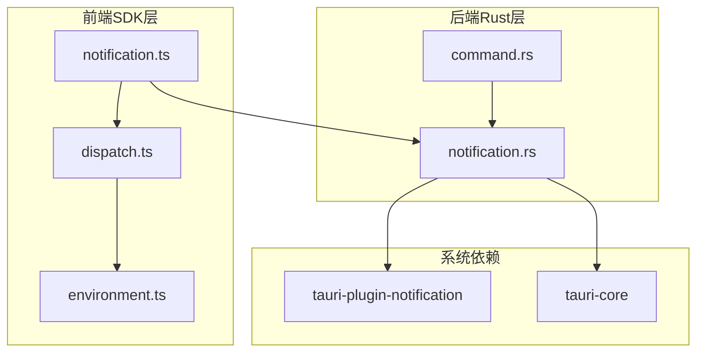
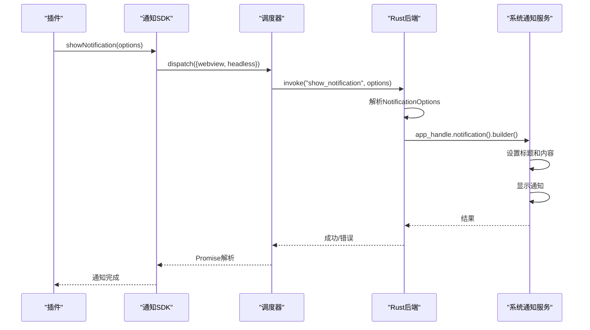
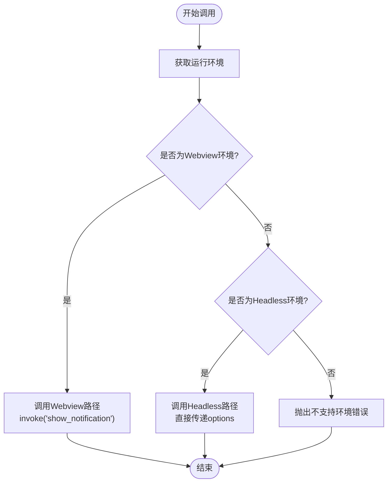
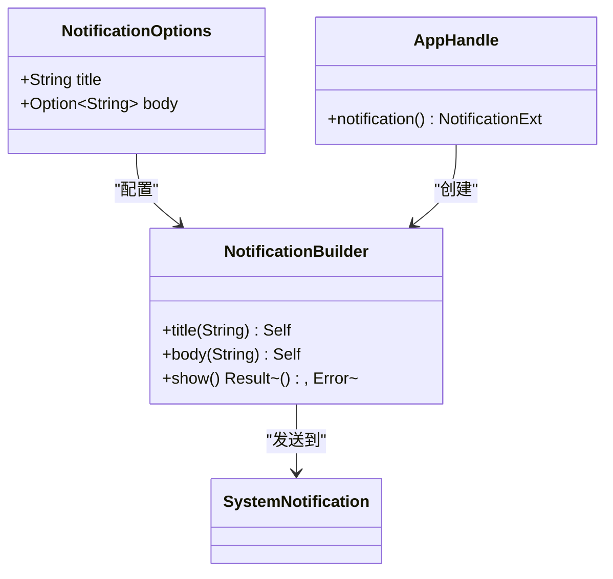
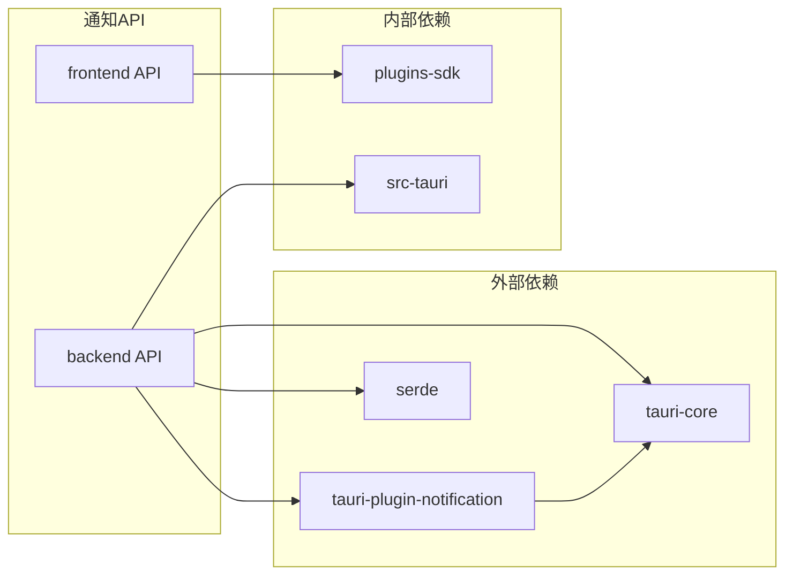

# 通知API

<cite>
**本文档中引用的文件**
- [notification.ts](file://plugins-sdk/src/api/notification.ts)
- [notification.rs](file://src-tauri/src/plugin_api/notification.rs)
- [dispatch.ts](file://plugins-sdk/src/core/dispatch.ts)
- [environment.ts](file://plugins-sdk/src/core/environment.ts)
- [Cargo.toml](file://src-tauri/Cargo.toml)
- [command.rs](file://src-tauri/src/plugin_api/command.rs)
</cite>

## 目录
1. [简介](#简介)
2. [项目结构](#项目结构)
3. [核心组件](#核心组件)
4. [架构概览](#架构概览)
5. [详细组件分析](#详细组件分析)
6. [依赖关系分析](#依赖关系分析)
7. [性能考虑](#性能考虑)
8. [故障排除指南](#故障排除指南)
9. [结论](#结论)

## 简介

Baize插件通知API是一个专门为插件系统设计的通知发送机制，允许插件向用户桌面发送系统级通知。该API基于`tauri-plugin-notification`插件构建，在不同操作系统（Windows、macOS、Linux）上提供一致的通知体验。

通知API的核心功能包括：
- 支持标题和可选内容的消息显示
- 跨平台兼容性
- 异步操作处理
- 错误处理机制
- 多环境支持（Webview和Headless）

## 项目结构

通知API的实现分布在多个层次中，形成了清晰的分层架构：



**图表来源**
- [notification.ts](file://plugins-sdk/src/api/notification.ts#L1-L22)
- [notification.rs](file://src-tauri/src/plugin_api/notification.rs#L1-L25)

**章节来源**
- [notification.ts](file://plugins-sdk/src/api/notification.ts#L1-L22)
- [notification.rs](file://src-tauri/src/plugin_api/notification.rs#L1-L25)

## 核心组件

### 前端通知接口

前端通知接口定义了标准的通知选项和调用方法：

```typescript
export interface NotificationOptions {
  title: string;
  body: string;
}

export function showNotification(options: NotificationOptions): Promise<void>
```

### 后端通知处理

后端使用`tauri-plugin-notification`插件处理实际的通知发送：

```rust
#[derive(Deserialize, Debug)]
pub struct NotificationOptions {
    pub title: String,
    pub body: Option<String>,
}

pub fn show_notification(app_handle: tauri::AppHandle, options: NotificationOptions) -> Result<(), String>
```

**章节来源**
- [notification.ts](file://plugins-sdk/src/api/notification.ts#L4-L12)
- [notification.rs](file://src-tauri/src/plugin_api/notification.rs#L4-L12)

## 架构概览

通知API采用分层架构设计，确保跨平台兼容性和良好的可维护性：



**图表来源**
- [notification.ts](file://plugins-sdk/src/api/notification.ts#L14-L21)
- [notification.rs](file://src-tauri/src/plugin_api/notification.rs#L14-L23)

## 详细组件分析

### 通知选项接口

通知选项接口设计简洁明了，只包含最必要的字段：

```typescript
export interface NotificationOptions {
  title: string;      // 必需：通知标题
  body: string;       // 可选：通知内容
}
```

这个设计遵循了最小化原则，只暴露必要的配置项，同时保持了足够的灵活性。

### 调度器模式

通知API使用了智能调度器模式，根据运行环境自动选择合适的执行路径：



**图表来源**
- [dispatch.ts](file://plugins-sdk/src/core/dispatch.ts#L14-L25)
- [environment.ts](file://plugins-sdk/src/core/environment.ts#L20-L35)

### 环境检测机制

环境检测是通知API能够跨平台工作的关键：

```typescript
export enum RuntimeEnvironment {
  Headless = 'headless',  // 无界面的 Deno 环境
  Webview = 'webview',    // 有界面的 Webview 环境
  Unknown = 'unknown',
}

export function getEnvironment(): RuntimeEnvironment {
  // 检测Webview环境
  if (typeof window !== 'undefined' && window.__TAURI_INTERNALS__) {
    return RuntimeEnvironment.Webview;
  }

  // 检测Headless环境
  if (typeof Deno !== 'undefined' && Deno.core) {
    return RuntimeEnvironment.Headless;
  }

  return RuntimeEnvironment.Unknown;
}
```

### Rust后端实现

后端使用`tauri-plugin-notification`插件提供的API来发送系统通知：



**图表来源**
- [notification.rs](file://src-tauri/src/plugin_api/notification.rs#L4-L12)
- [notification.rs](file://src-tauri/src/plugin_api/notification.rs#L14-L23)

**章节来源**
- [notification.ts](file://plugins-sdk/src/api/notification.ts#L4-L21)
- [dispatch.ts](file://plugins-sdk/src/core/dispatch.ts#L1-L30)
- [environment.ts](file://plugins-sdk/src/core/environment.ts#L1-L37)
- [notification.rs](file://src-tauri/src/plugin_api/notification.rs#L1-L25)

## 依赖关系分析

通知API的依赖关系清晰且层次分明：



**图表来源**
- [Cargo.toml](file://src-tauri/Cargo.toml#L40-L40)
- [notification.rs](file://src-tauri/src/plugin_api/notification.rs#L1-L2)

**章节来源**
- [Cargo.toml](file://src-tauri/Cargo.toml#L1-L71)
- [notification.rs](file://src-tauri/src/plugin_api/notification.rs#L1-L25)

## 性能考虑

### 异步处理

通知API完全基于异步模式设计，不会阻塞主线程：

- 使用Promise返回值确保非阻塞调用
- Rust后端使用异步I/O操作
- 内存管理优化，及时释放资源

### 跨平台兼容性

- 统一的API接口，屏蔽平台差异
- 自动环境检测，无需手动配置
- 标准化的错误处理机制

### 最佳实践建议

1. **合理使用通知频率**：避免频繁发送通知，影响用户体验
2. **内容简洁明了**：标题和内容应简短有力
3. **错误处理**：始终处理可能的错误情况
4. **权限检查**：确保应用具有发送通知的权限

## 故障排除指南

### 常见问题及解决方案

#### 1. 通知无法显示

**可能原因**：
- 应用未获得通知权限
- 系统通知设置被禁用
- 参数格式不正确

**解决方案**：
```typescript
try {
  await showNotification({
    title: "成功",
    body: "操作已完成"
  });
} catch (error) {
  console.error("通知发送失败:", error);
  // 实现降级方案，如显示Toast消息
}
```

#### 2. 环境检测失败

**可能原因**：
- 运行环境异常
- 全局对象被修改

**解决方案**：
```typescript
const env = getEnvironment();
console.log("当前运行环境:", env);
if (env === RuntimeEnvironment.Unknown) {
  // 实现备用逻辑
}
```

#### 3. 平台特定问题

**Windows**：
- 确保启用了Windows通知中心
- 检查系统设置中的通知权限

**macOS**：
- 验证系统偏好设置中的通知权限
- 检查是否在"通知"设置中允许应用通知

**Linux**：
- 确保桌面环境支持通知
- 检查通知服务器是否运行

**章节来源**
- [environment.ts](file://plugins-sdk/src/core/environment.ts#L20-L35)
- [notification.ts](file://plugins-sdk/src/api/notification.ts#L14-L21)

## 结论

Baize插件通知API提供了一个强大而灵活的通知系统，具有以下优势：

1. **跨平台兼容性**：统一的API接口，支持所有主要操作系统
2. **易于使用**：简洁的接口设计，降低学习成本
3. **高性能**：异步处理，不影响应用性能
4. **可靠稳定**：完善的错误处理和环境检测机制
5. **可扩展性**：模块化设计，便于功能扩展

该API特别适用于插件系统中的状态通知、进度更新和重要信息提醒等场景。通过合理的使用和最佳实践，可以显著提升用户体验和应用的专业性。