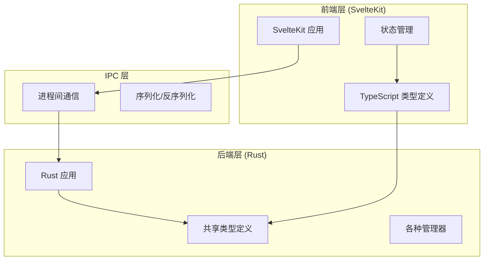
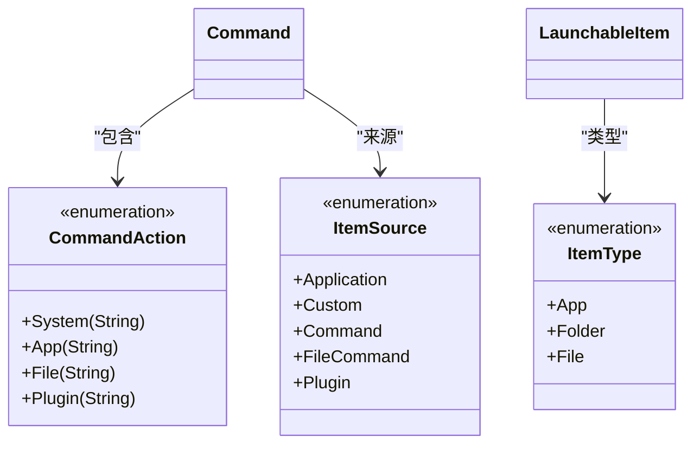
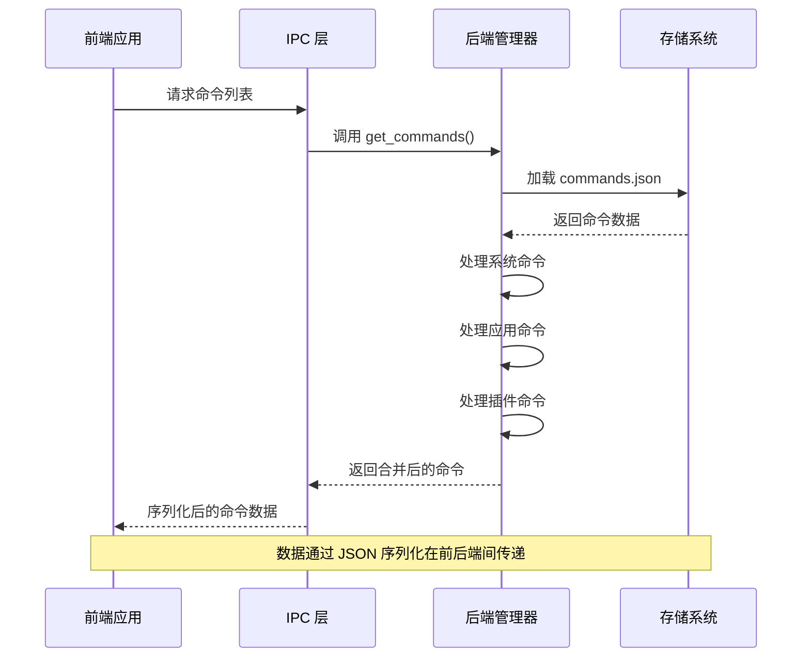
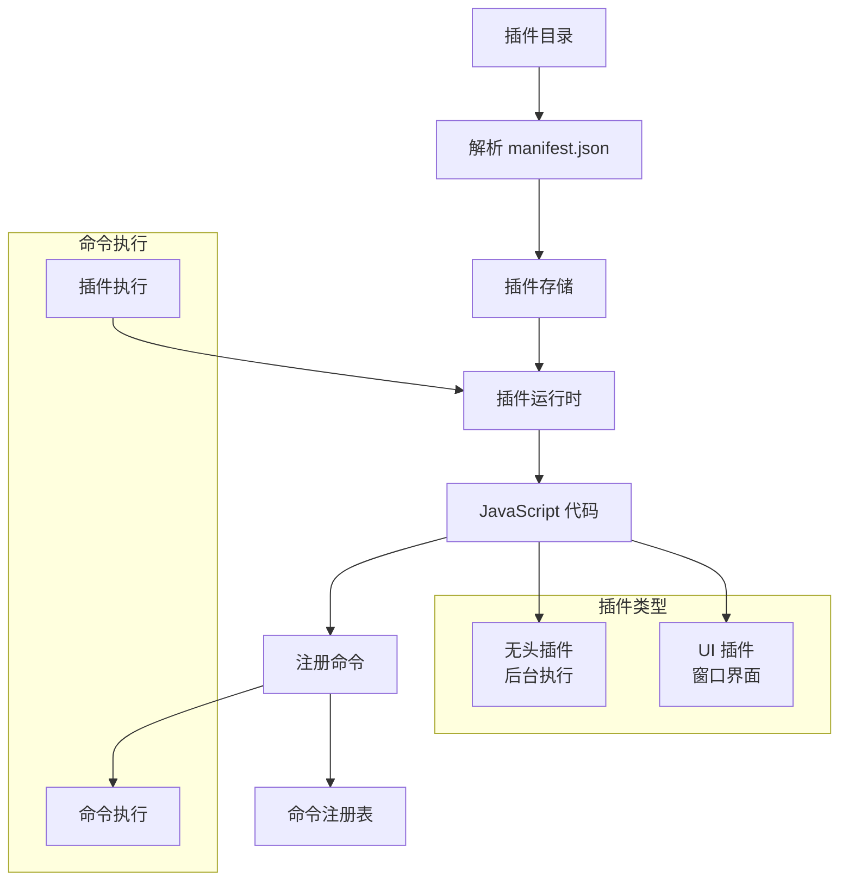
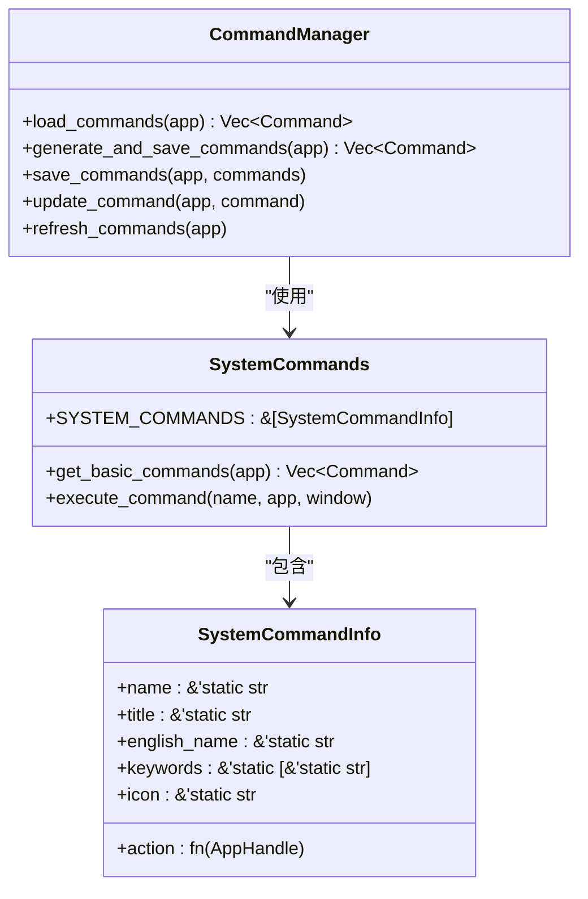
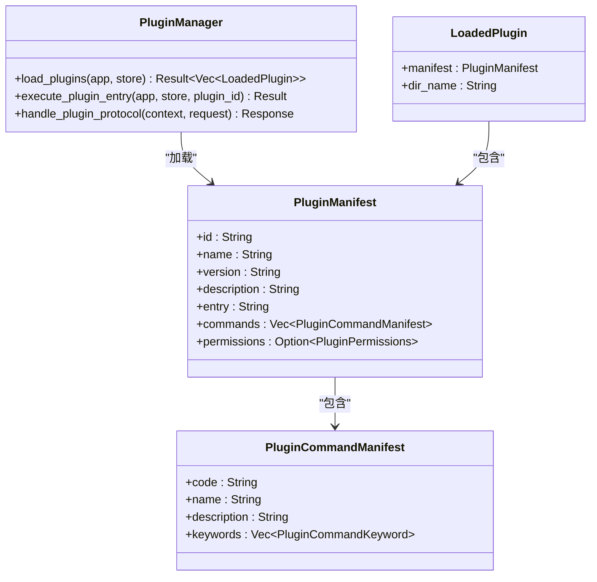
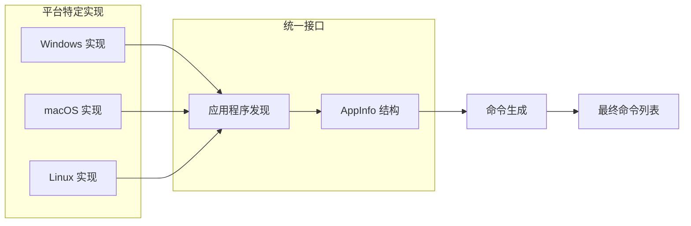
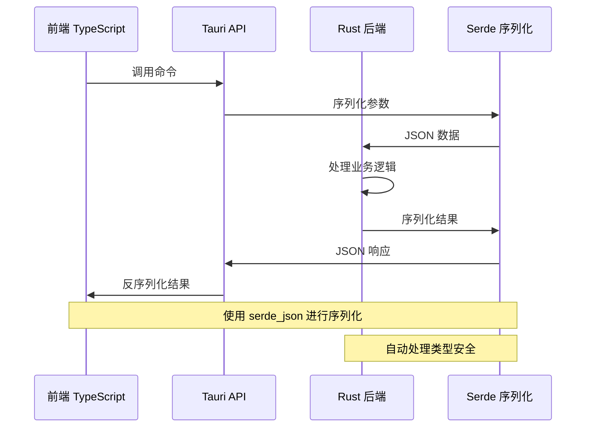
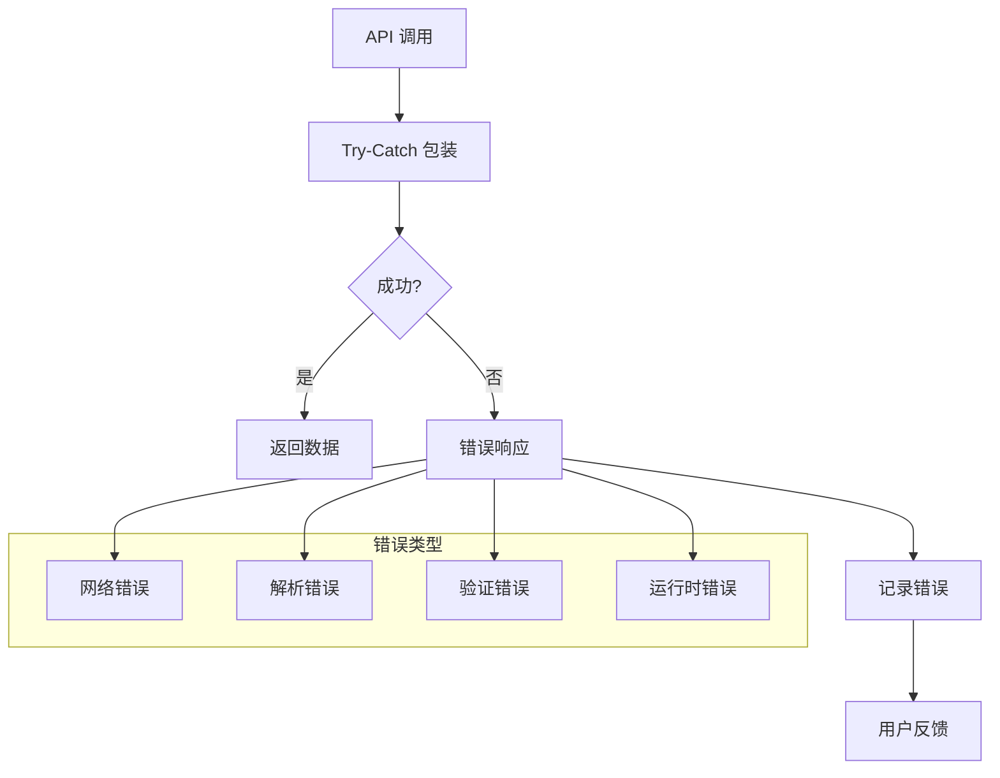

# 数据模型与类型定义

<cite>
**本文档引用的文件**
- [shared_types.rs](file://src-tauri/src/shared_types.rs)
- [type.ts](file://src/lib/type.ts)
- [command_manager.rs](file://src-tauri/src/command_manager.rs)
- [system_commands.rs](file://src-tauri/src/system_commands.rs)
- [plugin_manager.rs](file://src-tauri/src/plugin_manager.rs)
- [installed_apps/mod.rs](file://src-tauri/src/installed_apps/mod.rs)
- [js_runtime.rs](file://src-tauri/src/js_runtime.rs)
</cite>

## 目录
1. [简介](#简介)
2. [项目结构概览](#项目结构概览)
3. [核心数据模型](#核心数据模型)
4. [架构概览](#架构概览)
5. [详细组件分析](#详细组件分析)
6. [前后端数据传递机制](#前后端数据传递机制)
7. [性能考虑](#性能考虑)
8. [故障排除指南](#故障排除指南)
9. [结论](#结论)

## 简介

Baize 是一个基于 Tauri 框架构建的桌面应用程序，它提供了一个强大的命令行界面和插件系统。本文档详细介绍了 Baize 应用中的核心数据模型，包括前端的 `LaunchableItem` 和后端的 `Command`、`Shortcut`、`AppInfo` 等关键数据结构。这些数据模型在前后端之间通过 IPC（进程间通信）进行序列化传递，形成了一个完整而高效的数据交换体系。

## 项目结构概览

Baize 应用采用典型的 Tauri 架构，分为前端 SvelteKit 应用和后端 Rust 应用两部分：



**图表来源**
- [shared_types.rs](file://src-tauri/src/shared_types.rs#L1-L128)
- [type.ts](file://src/lib/type.ts#L1-L51)

**章节来源**
- [shared_types.rs](file://src-tauri/src/shared_types.rs#L1-L128)
- [type.ts](file://src/lib/type.ts#L1-L51)

## 核心数据模型

### 主要数据结构概述

Baize 应用的核心数据模型围绕以下几个关键结构展开：

1. **LaunchableItem** - 可启动项目的通用表示
2. **Command** - 命令实体，包含执行逻辑
3. **Shortcut** - 快捷键绑定
4. **AppInfo** - 已安装应用程序信息
5. **PluginCommand** - 插件注册的命令

### LaunchableItem 结构

`LaunchableItem` 是前端使用的可启动项目基础结构：

```typescript
interface LaunchableItem {
  name: string;
  keywords: CommandKeyword[];
  path: string;
  icon: string;
  icon_type: IconType;
  item_type: ItemType;
  source: Source;
  action?: string;
  origin?: AppOrigin;
}
```

### Command 结构

`Command` 是后端的核心命令结构，支持多种执行动作：

```rust
struct Command {
    pub name: String,
    pub title: String,
    pub english_name: String,
    pub keywords: Vec<CommandKeyword>,
    pub icon: String,
    pub source: ItemSource,
    pub action: CommandAction,
    pub origin: Option<AppOrigin>,
}
```

### CommandAction 枚举

`CommandAction` 支持四种不同的执行类型：



**图表来源**
- [shared_types.rs](file://src-tauri/src/shared_types.rs#L1-L128)
- [type.ts](file://src/lib/type.ts#L1-L51)

**章节来源**
- [shared_types.rs](file://src-tauri/src/shared_types.rs#L40-L128)
- [type.ts](file://src/lib/type.ts#L1-L51)

## 架构概览

### 数据流架构



**图表来源**
- [command_manager.rs](file://src-tauri/src/command_manager.rs#L1-L303)
- [js_runtime.rs](file://src-tauri/src/js_runtime.rs#L1-L401)

### 插件系统架构



**图表来源**
- [plugin_manager.rs](file://src-tauri/src/plugin_manager.rs#L1-L327)
- [js_runtime.rs](file://src-tauri/src/js_runtime.rs#L1-L401)

**章节来源**
- [plugin_manager.rs](file://src-tauri/src/plugin_manager.rs#L1-L327)
- [js_runtime.rs](file://src-tauri/src/js_runtime.rs#L1-L401)

## 详细组件分析

### 命令管理系统

命令管理系统是 Baize 的核心组件，负责管理和执行各种类型的命令：



**图表来源**
- [command_manager.rs](file://src-tauri/src/command_manager.rs#L1-L303)
- [system_commands.rs](file://src-tauri/src/system_commands.rs#L1-L229)

#### 系统命令实现

系统命令提供了操作系统级别的功能：

```rust
pub static SYSTEM_COMMANDS: &[SystemCommandInfo] = &[
    SystemCommandInfo {
        name: "shutdown",
        title: "关机",
        english_name: "Shutdown",
        keywords: &["shutdown", "关机"],
        icon: "shutdown",
        action: |_| shutdown(),
    },
    // ... 更多系统命令
];
```

### 插件管理器

插件管理器负责加载和管理第三方插件：



**图表来源**
- [plugin_manager.rs](file://src-tauri/src/plugin_manager.rs#L1-L327)

### 应用程序发现系统

应用程序发现系统负责扫描和获取已安装的应用程序信息：



**图表来源**
- [installed_apps/mod.rs](file://src-tauri/src/installed_apps/mod.rs#L1-L72)

**章节来源**
- [command_manager.rs](file://src-tauri/src/command_manager.rs#L1-L303)
- [system_commands.rs](file://src-tauri/src/system_commands.rs#L1-L229)
- [plugin_manager.rs](file://src-tauri/src/plugin_manager.rs#L1-L327)
- [installed_apps/mod.rs](file://src-tauri/src/installed_apps/mod.rs#L1-L72)

## 前后端数据传递机制

### IPC 序列化流程

Baize 应用使用 Serde 库进行数据序列化，在前后端之间传递数据：



**图表来源**
- [shared_types.rs](file://src-tauri/src/shared_types.rs#L1-L128)
- [type.ts](file://src/lib/type.ts#L1-L51)

### 类型映射关系

前后端类型保持一致，确保类型安全：

| 前端 TypeScript | 后端 Rust | 描述 |
|----------------|-----------|------|
| `LaunchableItem` | `LaunchableItem` | 可启动项目 |
| `Command` | `Command` | 命令实体 |
| `CommandKeyword` | `CommandKeyword` | 命令关键字 |
| `Shortcut` | `Shortcut` | 快捷键绑定 |
| `ItemType` | `ItemType` | 项目类型枚举 |
| `ItemSource` | `ItemSource` | 来源枚举 |

### 错误处理机制



**章节来源**
- [shared_types.rs](file://src-tauri/src/shared_types.rs#L1-L128)
- [type.ts](file://src/lib/type.ts#L1-L51)
- [command_manager.rs](file://src-tauri/src/command_manager.rs#L40-L80)

## 性能考虑

### 数据缓存策略

1. **命令缓存**: 命令列表在内存中缓存，避免重复加载
2. **图标缓存**: 图标数据缓存以减少文件 I/O
3. **插件缓存**: 插件运行时环境复用

### 内存优化

- 使用 `Option<T>` 类型减少不必要的内存占用
- 实现 `Clone` 特性支持高效复制
- 使用 `serde` 的 `skip_serializing_if` 优化序列化

### 并发处理

- 插件执行使用独立线程池
- 异步 I/O 操作避免阻塞主线程
- Tokio 运行时提供高效的并发支持

## 故障排除指南

### 常见问题及解决方案

#### 1. 命令加载失败

**症状**: 应用启动时命令列表为空
**原因**: `commands.json` 文件损坏或缺失
**解决方案**: 
- 删除损坏的 `commands.json` 文件
- 应用会自动重新生成默认命令列表

#### 2. 插件加载错误

**症状**: 插件无法正常工作
**原因**: 插件目录权限问题或 manifest.json 格式错误
**解决方案**:
- 检查插件目录权限
- 验证 manifest.json 格式正确性

#### 3. IPC 通信超时

**症状**: 前后端通信延迟或失败
**原因**: 系统资源不足或网络配置问题
**解决方案**:
- 检查系统资源使用情况
- 验证防火墙设置

**章节来源**
- [command_manager.rs](file://src-tauri/src/command_manager.rs#L40-L80)
- [plugin_manager.rs](file://src-tauri/src/plugin_manager.rs#L50-L100)

## 结论

Baize 应用的数据模型设计体现了现代桌面应用开发的最佳实践。通过精心设计的类型系统、高效的 IPC 通信机制和灵活的插件架构，Baize 实现了强大的功能扩展能力和良好的用户体验。

### 关键优势

1. **类型安全**: 前后端类型一致性确保编译时错误检查
2. **高性能**: 优化的缓存策略和并发处理
3. **可扩展**: 插件系统支持第三方功能扩展
4. **跨平台**: 统一的抽象层支持多平台部署

### 发展方向

- 进一步优化大型命令集的加载性能
- 增强插件系统的安全性
- 改进错误诊断和日志记录
- 扩展更多平台的原生集成

这个数据模型框架为 Baize 应用提供了坚实的基础，使其能够持续发展和适应不断变化的需求。