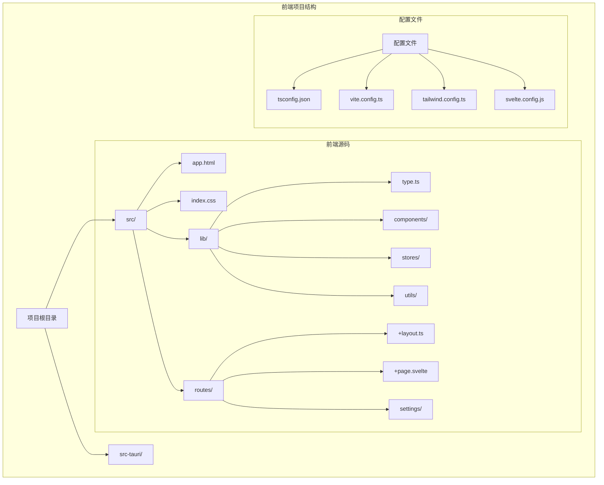
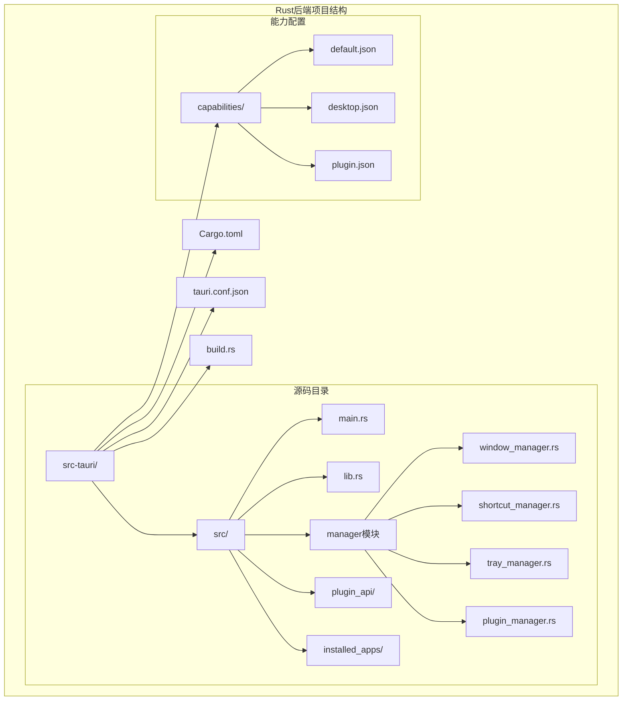
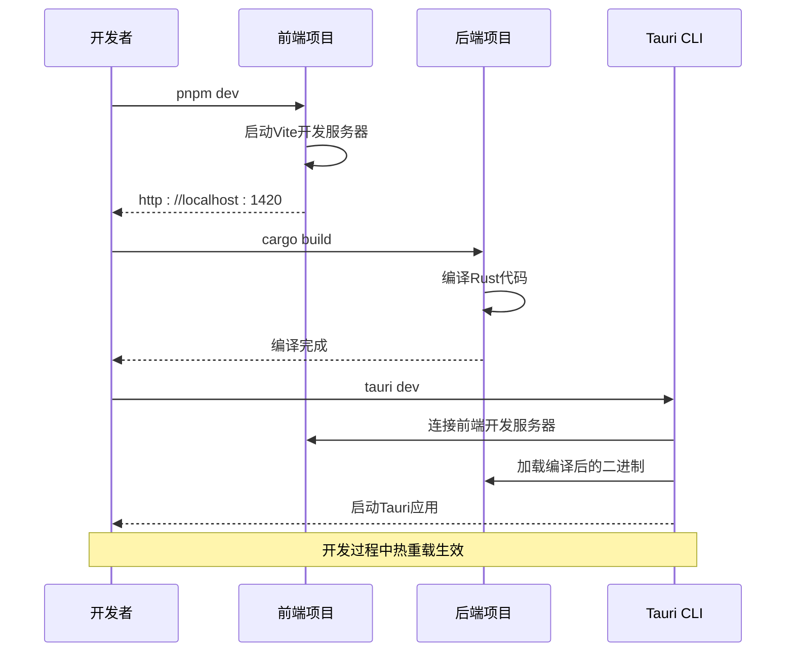

# Baize项目开发环境搭建指南

<cite>
**本文档引用的文件**
- [README.md](file://README.md)
- [package.json](file://package.json)
- [src-tauri/Cargo.toml](file://src-tauri/Cargo.toml)
- [src-tauri/tauri.conf.json](file://src-tauri/tauri.conf.json)
- [tsconfig.json](file://tsconfig.json)
- [vite.config.ts](file://vite.config.ts)
- [STATUS.md](file://STATUS.md)
</cite>

## 目录
1. [简介](#简介)
2. [系统要求](#系统要求)
3. [前置依赖安装](#前置依赖安装)
4. [项目克隆与初始化](#项目克隆与初始化)
5. [前端环境配置](#前端环境配置)
6. [后端环境配置](#后端环境配置)
7. [开发环境验证](#开发环境验证)
8. [常见问题排查](#常见问题排查)
9. [开发工作流](#开发工作流)
10. [总结](#总结)

## 简介

Baize是一个基于Tauri、SvelteKit和TypeScript构建的跨平台桌面应用程序，旨在创建一个快速启动的应用程序，类似于raycast、utools、alfred、wox等工具。本指南将帮助开发者从零开始配置完整的开发环境，包括Node.js、pnpm、Rust和Tauri CLI等核心依赖的安装和配置。

## 系统要求

在开始之前，请确保您的系统满足以下最低要求：

- **操作系统**: Windows 10/11、macOS 10.15+ 或 Linux (Ubuntu 18.04+)
- **内存**: 至少4GB RAM（建议8GB以上）
- **存储空间**: 至少2GB可用磁盘空间
- **网络连接**: 稳定的互联网连接用于下载依赖

## 前置依赖安装

### 1. Node.js安装（推荐版本：v18.x或更高）

Node.js是前端开发的基础，Baize项目使用Node.js作为包管理和开发服务器。

#### Windows系统安装：
```bash
# 下载官方安装包
# 访问 https://nodejs.org/ 并下载LTS版本
# 或使用PowerShell管理员权限执行：
winget install Nodejs.LTS
```

#### macOS系统安装：
```bash
# 使用Homebrew安装
brew install node

# 或直接从官网下载安装包
```

#### Linux系统安装：
```bash
# Ubuntu/Debian
curl -fsSL https://deb.nodesource.com/setup_lts.x | sudo -E bash -
sudo apt-get install -y nodejs

# CentOS/RHEL/Fedora
curl -fsSL https://rpm.nodesource.com/setup_lts.x | sudo bash -
sudo yum install -y nodejs
```

### 2. pnpm包管理器安装

pnpm是一个高效的包管理器，比npm更快且更节省磁盘空间。

```bash
# 全局安装pnpm
npm install -g pnpm

# 验证安装
pnpm --version
```

### 3. Rust编程语言安装（通过rustup）

Rust是Tauri后端的核心语言，需要通过rustup进行安装和管理。

#### 安装rustup：
```bash
# Windows (PowerShell管理员权限)
# 下载并运行rustup-init.exe
# 或使用winget:
winget install Rustlang.Rustup

# macOS/Linux
curl --proto '=https' --tlsv1.2 -sSf https://sh.rustup.rs | sh
```

#### 配置Rust工具链：
```bash
# 更新rustup
rustup update

# 安装稳定版工具链
rustup toolchain install stable

# 设置默认工具链
rustup default stable

# 验证安装
rustc --version
```

### 4. Tauri CLI工具安装

Tauri CLI是构建和管理Tauri应用程序的核心工具。

```bash
# 全局安装Tauri CLI
npm install -g @tauri-apps/cli

# 验证安装
tauri --version
```

## 项目克隆与初始化

### 克隆项目仓库

```bash
# 克隆项目到本地
git clone https://github.com/your-repository/baize.git
cd baize
```

### 安装项目依赖

#### 前端依赖安装：
```bash
# 在项目根目录执行
pnpm install

# 这将安装package.json中定义的所有前端依赖
```

#### 后端依赖安装：
```bash
# 进入Tauri项目目录
cd src-tauri

# 安装Rust依赖
cargo build

# 这将安装Cargo.toml中定义的所有后端依赖
```

## 前端环境配置

### 项目结构概览



**图表来源**
- [package.json](file://package.json#L1-L52)
- [src-tauri/Cargo.toml](file://src-tauri/Cargo.toml#L1-L71)

### 关键配置文件解析

#### package.json中的前端依赖

```json
{
  "dependencies": {
    "@tauri-apps/api": "^2.6.0",
    "@tauri-apps/plugin-autostart": "~2",
    "@tauri-apps/plugin-dialog": "~2",
    "@tauri-apps/plugin-global-shortcut": "~2.2.1",
    "@tauri-apps/plugin-notification": "~2",
    "@tauri-apps/plugin-opener": "^2.3.1",
    "@tauri-apps/plugin-store": "~2",
    "bits-ui": "^2.8.8",
    "pinyin": "^2.11.2",
    "tailwindcss": "^4.1.10"
  }
}
```

这些依赖的作用：
- **@tauri-apps/api**: Tauri核心API，提供与原生功能的交互
- **@tauri-apps/plugins**: 各种Tauri插件，如自动启动、对话框、通知等
- **bits-ui**: UI组件库，提供现代化的UI组件
- **pinyin**: 中文拼音转换工具
- **tailwindcss**: CSS框架，用于快速构建响应式界面

#### TypeScript配置

```json
{
  "extends": "./.svelte-kit/tsconfig.json",
  "compilerOptions": {
    "allowJs": true,
    "checkJs": true,
    "esModuleInterop": true,
    "forceConsistentCasingInFileNames": true,
    "resolveJsonModule": true,
    "skipLibCheck": true,
    "sourceMap": true,
    "strict": true,
    "moduleResolution": "bundler"
  }
}
```

**章节来源**
- [package.json](file://package.json#L1-L52)
- [tsconfig.json](file://tsconfig.json#L1-L20)

## 后端环境配置

### Rust项目结构



**图表来源**
- [src-tauri/Cargo.toml](file://src-tauri/Cargo.toml#L1-L71)
- [src-tauri/tauri.conf.json](file://src-tauri/tauri.conf.json#L1-L60)

### Cargo.toml中的后端依赖

```toml
[dependencies]
tauri = { version = "2", features = ["macos-private-api", "tray-icon"] }
serde = { version = "1", features = ["derive"] }
serde_json = "1"
regex = "1.11.1"
tokio = { version = "1", features = ["macros", "rt-multi-thread", "sync", "fs"] }
reqwest = { version = "0.12", features = ["json"] }
```

关键依赖说明：
- **tauri**: Tauri框架核心，提供跨平台桌面应用功能
- **serde**: 序列化/反序列化库，用于数据交换
- **tokio**: 异步运行时，支持并发处理
- **reqwest**: HTTP客户端，用于网络请求

**章节来源**
- [src-tauri/Cargo.toml](file://src-tauri/Cargo.toml#L1-L71)
- [src-tauri/tauri.conf.json](file://src-tauri/tauri.conf.json#L1-L60)

## 开发环境验证

### 环境检查清单

完成安装后，请按照以下步骤验证环境配置是否成功：

#### 1. Node.js环境验证
```bash
# 检查Node.js版本
node --version
# 应该返回 v18.x.x 或更高版本

# 检查npm版本
npm --version
# 应该返回版本号

# 检查pnpm版本
pnpm --version
# 应该返回版本号
```

#### 2. Rust环境验证
```bash
# 检查Rust编译器版本
rustc --version
# 应该返回类似 rustc 1.75.0 (stable)

# 检查Cargo版本
cargo --version
# 应该返回版本号

# 检查rustup版本
rustup --version
# 应该返回版本号
```

#### 3. Tauri环境验证
```bash
# 检查Tauri CLI版本
tauri --version
# 应该返回类似 tauri 2.6.0

# 检查Tauri CLI帮助信息
tauri --help
# 应该显示可用的命令列表
```

#### 4. 项目依赖验证
```bash
# 在项目根目录执行
pnpm install --dry-run
# 应该显示将要安装的包列表，无错误

# 在src-tauri目录执行
cargo check
# 应该显示编译成功，无错误
```

### 开发服务器启动

```bash
# 启动开发服务器
pnpm dev

# 或使用Tauri开发模式
pnpm tauri dev
```

启动后，您应该能看到：
- Vite开发服务器在 http://localhost:1420
- Tauri应用窗口弹出
- 控制台输出开发相关信息

## 常见问题排查

### Windows系统常见问题

#### 1. MSVC工具链缺失
**问题症状**: `error: Microsoft Visual C++ 14.0 is required`

**解决方案**:
```bash
# 方法1: 安装Visual Studio Build Tools
# 下载并安装Visual Studio Build Tools 2022
# 选择"C++构建工具"工作负载

# 方法2: 使用vcpkg
# 安装vcpkg并集成到系统
git clone https://github.com/microsoft/vcpkg.git
cd vcpkg
.\bootstrap-vcpkg.bat
.\vcpkg integrate install

# 方法3: 设置环境变量
set CARGO_BUILD_RUSTFLAGS=-Ctarget-feature=+crt-static
```

#### 2. LLVM配置问题
**问题症状**: `could not execute llvm-config`

**解决方案**:
```bash
# 安装LLVM
# Windows: winget install LLVM.LLVM
# macOS: brew install llvm
# Linux: sudo apt install llvm-dev

# 设置环境变量
# Windows:
set LLVM_CONFIG_PATH="C:\Program Files\LLVM\bin\llvm-config.exe"

# macOS/Linux:
export LLVM_CONFIG_PATH="/usr/local/opt/llvm/bin/llvm-config"
```

### macOS系统常见问题

#### 1. Xcode命令行工具未安装
**问题症状**: `xcode-select: error: command line tools are not installed`

**解决方案**:
```bash
# 安装Xcode命令行工具
xcode-select --install

# 如果已经安装但仍然报错
sudo xcode-select --reset
```

#### 2. Homebrew包管理器问题
**问题症状**: `brew: command not found`

**解决方案**:
```bash
# 安装Homebrew
/bin/bash -c "$(curl -fsSL https://raw.githubusercontent.com/Homebrew/install/HEAD/install.sh)"

# 更新Homebrew
brew update
```

### Linux系统常见问题

#### 1. 缺少构建依赖
**问题症状**: `error: linking with cc failed`

**解决方案**:
```bash
# Ubuntu/Debian
sudo apt update
sudo apt install build-essential pkg-config libssl-dev

# CentOS/RHEL/Fedora
sudo yum groupinstall "Development Tools"
sudo yum install openssl-devel

# Arch Linux
sudo pacman -Sy base-devel openssl
```

#### 2. GTK依赖问题
**问题症状**: `error: GTK library not found`

**解决方案**:
```bash
# 安装GTK开发库
# Ubuntu/Debian
sudo apt install libgtk-3-dev

# CentOS/RHEL/Fedora
sudo yum install gtk3-devel

# Arch Linux
sudo pacman -S gtk3
```

### 跨平台通用问题

#### 1. 网络代理问题
**解决方案**:
```bash
# 设置npm代理
npm config set proxy http://proxy.company.com:8080
npm config set https-proxy http://proxy.company.com:8080

# 设置Git代理
git config --global http.proxy http://proxy.company.com:8080
git config --global https.proxy http://proxy.company.com:8080
```

#### 2. 内存不足问题
**解决方案**:
```bash
# 增加Node.js内存限制
export NODE_OPTIONS="--max-old-space-size=4096"

# 或在package.json中设置
{
  "scripts": {
    "dev": "node --max-old-space-size=4096 node_modules/.bin/vite dev"
  }
}
```

## 开发工作流

### 日常开发流程



**图表来源**
- [package.json](file://package.json#L6-L15)
- [vite.config.ts](file://vite.config.ts#L1-L34)

### 开发命令详解

#### 前端开发命令
```bash
# 启动开发服务器
pnpm dev          # 启动Vite开发服务器

# 构建生产版本
pnpm build        # 构建前端应用

# 预览生产版本
pnpm preview      # 启动本地预览服务器

# 类型检查
pnpm check        # TypeScript类型检查
pnpm check:watch  # 监视模式类型检查

# 代码格式化
pnpm format       # 格式化代码
```

#### 后端开发命令
```bash
# 编译后端代码
cargo build       # 调试版本编译
cargo build --release  # 发布版本编译

# 运行测试
cargo test        # 运行单元测试

# 查看文档
cargo doc         # 生成文档

# 性能分析
cargo flamegraph  # 生成火焰图
```

#### Tauri开发命令
```bash
# 启动Tauri开发模式
pnpm tauri dev    # 启动Tauri开发应用

# 构建应用
pnpm tauri build  # 构建发布版本

# 检查应用
pnpm tauri info   # 显示系统信息

# 更新CLI
pnpm tauri upgrade --latest  # 升级到最新版本
```

**章节来源**
- [package.json](file://package.json#L6-L15)
- [src-tauri/tauri.conf.json](file://src-tauri/tauri.conf.json#L8-L12)

## 总结

通过本指南，您已经完成了Baize项目的完整开发环境搭建。现在您具备了：

1. **完整的工具链**: Node.js、pnpm、Rust、Tauri CLI等核心工具
2. **项目理解**: 对前端和后端架构的深入理解
3. **开发技能**: 掌握了日常开发和调试技巧
4. **问题解决**: 具备排查常见环境问题的能力

### 下一步建议

1. **熟悉项目结构**: 深入阅读STATUS.md了解项目文件组织
2. **学习技术栈**: 深入学习Tauri、SvelteKit和Rust的相关知识
3. **参与贡献**: 查看README.md中的项目进度，寻找贡献机会
4. **持续学习**: 关注项目更新，及时升级依赖和工具

### 最佳实践

- **定期更新**: 保持依赖和工具的最新版本
- **备份环境**: 定期备份开发环境配置
- **文档记录**: 记录个人遇到的问题和解决方案
- **团队协作**: 与团队成员分享环境配置经验

祝您在Baize项目开发中取得成功！