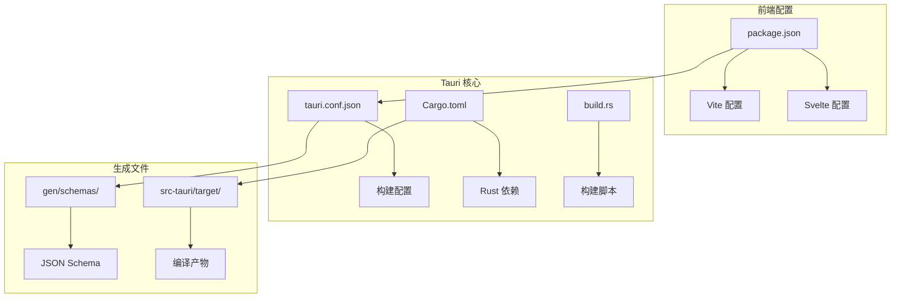
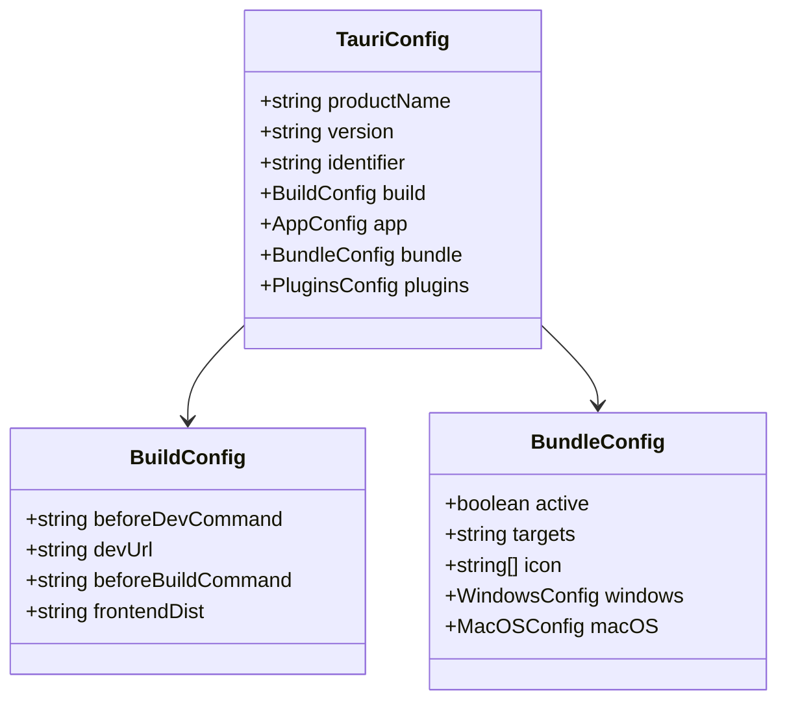
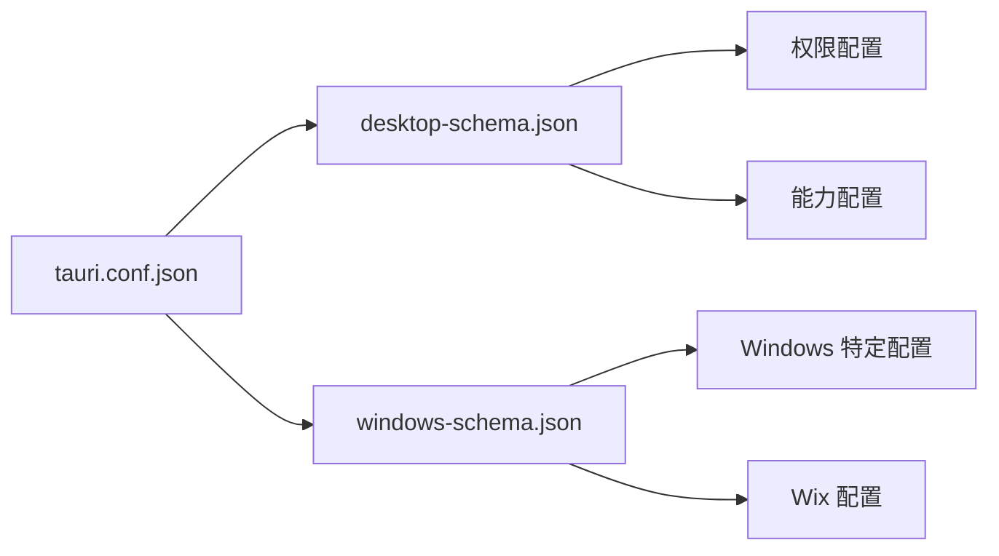
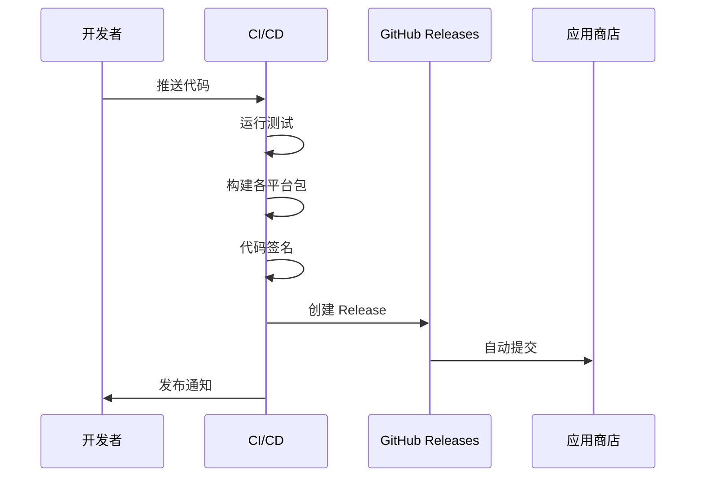

# Tauri 应用打包与分发指南

<cite>
**本文档引用的文件**
- [package.json](file://package.json)
- [src-tauri/tauri.conf.json](file://src-tauri/tauri.conf.json)
- [src-tauri/Cargo.toml](file://src-tauri/Cargo.toml)
- [src-tauri/build.rs](file://src-tauri/build.rs)
- [src-tauri/gen/schemas/desktop-schema.json](file://src-tauri/gen/schemas/desktop-schema.json)
- [src-tauri/gen/schemas/windows-schema.json](file://src-tauri/gen/schemas/windows-schema.json)
- [README.md](file://README.md)
</cite>

## 目录
1. [简介](#简介)
2. [项目结构概览](#项目结构概览)
3. [基础配置](#基础配置)
4. [Windows 平台打包](#windows-平台打包)
5. [macOS 平台打包](#macos-平台打包)
6. [Linux 平台打包](#linux-平台打包)
7. [配置模式详解](#配置模式详解)
8. [发布流程建议](#发布流程建议)
9. [最佳实践](#最佳实践)
10. [故障排除](#故障排除)

## 简介

本指南详细介绍了如何使用 Tauri 框架为 Windows、macOS 和 Linux 平台生成可分发的应用程序安装包。通过 `tauri build` 命令，您可以轻松地为不同平台创建原生安装程序，包括 MSI 安装程序、DMG 磁盘映像和各种 Linux 包格式。

## 项目结构概览

基于项目分析，以下是关键的打包相关文件：



**图表来源**
- [package.json](file://package.json#L1-L52)
- [src-tauri/tauri.conf.json](file://src-tauri/tauri.conf.json#L1-L60)
- [src-tauri/Cargo.toml](file://src-tauri/Cargo.toml#L1-L71)

## 基础配置

### package.json 中的打包脚本

项目在 `package.json` 中定义了多个打包相关的脚本：

```json
{
  "scripts": {
    "tauri": "tauri",
    "release": "semantic-release"
  }
}
```

### tauri.conf.json 配置结构

核心配置文件 `src-tauri/tauri.conf.json` 定义了应用程序的基本信息和构建设置：



**图表来源**
- [src-tauri/tauri.conf.json](file://src-tauri/tauri.conf.json#L1-L60)

**章节来源**
- [package.json](file://package.json#L1-L52)
- [src-tauri/tauri.conf.json](file://src-tauri/tauri.conf.json#L1-L60)

## Windows 平台打包

### MSI 安装程序生成

对于 Windows 平台，Tauri 默认使用 WiX 工具集生成 MSI 安装程序。这需要以下配置：

```json
{
  "bundle": {
    "active": true,
    "targets": "all",
    "icon": [
      "icons/32x32.png",
      "icons/128x128.png",
      "icons/128x128@2x.png",
      "icons/icon.ico"
    ]
  }
}
```

### Windows 特定配置

在 `tauri.conf.json` 的 `windows` 配置部分，可以定义窗口行为：

```json
{
  "windows": [
    {
      "width": 800,
      "height": 400,
      "dragDropEnabled": true,
      "alwaysOnTop": true,
      "center": true,
      "closable": false,
      "decorations": false,
      "focus": true,
      "hiddenTitle": true,
      "maximizable": false,
      "skipTaskbar": true,
      "transparent": true,
      "shadow": false
    }
  ]
}
```

### 打包命令

执行以下命令生成 Windows 可执行文件：

```bash
# 开发环境构建
pnpm tauri build

# 或者使用 npm
npm run tauri build
```

### 代码签名和公证

为了确保 Windows 用户的信任，建议对生成的可执行文件进行代码签名：

1. **获取代码签名证书**：从受信任的证书颁发机构购买
2. **配置签名工具**：使用 `signtool.exe` 或其他签名工具
3. **自动化签名流程**：在 CI/CD 管道中集成签名步骤

**章节来源**
- [src-tauri/tauri.conf.json](file://src-tauri/tauri.conf.json#L1-L60)

## macOS 平台打包

### DMG 磁盘映像生成

macOS 平台默认生成 DMG 磁盘映像格式的安装包。需要配置代码签名和公证：

```json
{
  "bundle": {
    "macOS": {
      "entitlements": "entitlements.macos.plist",
      "exceptionDomain": "localhost",
      "frameworks": [],
      "providerShortName": null,
      "signingIdentity": null
    }
  }
}
```

### 代码签名配置

1. **创建 entitlements 文件** (`entitlements.macos.plist`)：
```xml
<?xml version="1.0" encoding="UTF-8"?>
<!DOCTYPE plist PUBLIC "-//Apple//DTD PLIST 1.0//EN" "http://www.apple.com/DTDs/PropertyList-1.0.dtd">
<plist version="1.0">
<dict>
    <key>com.apple.security.cs.allow-jit</key>
    <true/>
    <key>com.apple.security.cs.allow-unsigned-executable-memory</key>
    <true/>
    <key>com.apple.security.cs.allow-dyld-environment-variables</key>
    <true/>
</dict>
</plist>
```

2. **配置签名身份**：
```json
{
  "bundle": {
    "macOS": {
      "signingIdentity": "Developer ID Application: Your Name (ABC123DEF4)"
    }
  }
}
```

### 公证流程

1. **准备应用**：确保应用已正确签名
2. **上传到 Apple**：使用 `altool` 或 Xcode 进行上传
3. **验证结果**：检查公证状态

### 打包命令

```bash
# macOS 平台构建
pnpm tauri build --target x86_64-apple-darwin
# 或
pnpm tauri build --target aarch64-apple-darwin
```

**章节来源**
- [src-tauri/tauri.conf.json](file://src-tauri/tauri.conf.json#L34-L50)

## Linux 平台打包

### 多种包格式支持

Linux 平台支持多种包格式，包括 AppImage、deb 和 rpm：

```json
{
  "bundle": {
    "targets": "all"
  }
}
```

### AppImage 格式

AppImage 是最简单的 Linux 包格式，无需安装即可运行：

```bash
# 生成 AppImage
pnpm tauri build --target x86_64-unknown-linux-gnu
```

### DEB 包格式

.deb 包是 Debian 系统的标准包格式：

```bash
# 生成 DEB 包
pnpm tauri build --target x86_64-unknown-linux-gnu
```

### RPM 包格式

.rpm 包适用于 Red Hat 系列系统：

```bash
# 生成 RPM 包
pnpm tauri build --target x86_64-unknown-linux-gnu
```

### 包依赖管理

在 `Cargo.toml` 中配置 Linux 特定的依赖：

```toml
[target.'cfg(not(any(target_os = "android", target_os = "ios")))'.dependencies]
tauri-plugin-autostart = "2"
tauri-plugin-global-shortcut = "2"
```

**章节来源**
- [src-tauri/Cargo.toml](file://src-tauri/Cargo.toml#L60-L71)

## 配置模式详解

### JSON Schema 架构

Tauri 使用 JSON Schema 来定义配置模式，确保配置文件的正确性：



**图表来源**
- [src-tauri/gen/schemas/desktop-schema.json](file://src-tauri/gen/schemas/desktop-schema.json#L1-L50)
- [src-tauri/gen/schemas/windows-schema.json](file://src-tauri/gen/schemas/windows-schema.json#L1-L50)

### 权限和能力系统

Tauri 引入了权限和能力系统来控制应用程序的功能访问：

```json
{
  "capabilities": [
    {
      "identifier": "main-capability",
      "description": "主窗口权限",
      "windows": ["main"],
      "permissions": [
        "core:default",
        "opener:default",
        "dialog:open"
      ]
    }
  ]
}
```

### 能力配置详解

每个能力包含以下要素：
- **identifier**: 能力的唯一标识符
- **description**: 功能描述
- **windows**: 影响的窗口列表
- **permissions**: 授予的权限列表
- **platforms**: 目标平台限制

**章节来源**
- [src-tauri/gen/schemas/desktop-schema.json](file://src-tauri/gen/schemas/desktop-schema.json#L1-L100)
- [src-tauri/gen/schemas/windows-schema.json](file://src-tauri/gen/schemas/windows-schema.json#L1-L100)

## 发布流程建议

### 版本号管理

推荐使用语义化版本控制：

```bash
# 主版本更新
npm version major

# 次版本更新  
npm version minor

# 补丁版本更新
npm version patch
```

### 自动化发布流程

基于项目中的 `release` 脚本，建议使用以下流程：



### 发布渠道

1. **GitHub Releases**: 最直接的发布方式
2. **应用商店**: Windows Store, Mac App Store, Snap Store
3. **自托管服务器**: 企业内部部署

### 更新机制

实现自动更新功能：

```javascript
// 示例：检查更新
async function checkForUpdates() {
  const response = await fetch('https://api.example.com/latest-version');
  const latestVersion = await response.json();
  
  if (latestVersion > currentVersion) {
    // 触发更新流程
    await downloadAndInstallUpdate(latestVersion);
  }
}
```

## 最佳实践

### 1. 图标和资源管理

确保所有平台都提供适当的图标：

```json
{
  "bundle": {
    "icon": [
      "icons/32x32.png",
      "icons/128x128.png",
      "icons/128x128@2x.png",
      "icons/icon.icns",
      "icons/icon.ico"
    ]
  }
}
```

### 2. 性能优化

- 使用静态资源缓存
- 优化图片和字体文件
- 启用压缩和混淆

### 3. 安全考虑

- 实施内容安全策略 (CSP)
- 限制权限范围
- 定期更新依赖库

### 4. 测试策略

- 多平台测试
- 性能基准测试
- 用户体验测试

## 故障排除

### 常见问题及解决方案

#### 1. Windows 打包失败

**问题**: MSVC 编译器未找到
**解决方案**: 
```bash
# 安装 Visual Studio Build Tools
vsbuildtools.exe --add Microsoft.VisualStudio.Workload.VCTools
```

#### 2. macOS 签名失败

**问题**: 代码签名证书无效
**解决方案**:
```bash
# 查看可用的签名身份
codesign --list-identity

# 使用正确的签名身份
codesign --sign "Developer ID Application: Your Name" --entitlements entitlements.macos.plist dist/bundle/macos/app.app
```

#### 3. Linux 权限问题

**问题**: AppImage 运行时权限不足
**解决方案**:
```bash
# 设置可执行权限
chmod +x app.AppImage

# 或者使用 sudo
sudo ./app.AppImage
```

#### 4. 配置验证错误

**问题**: JSON Schema 验证失败
**解决方案**:
```bash
# 使用 Tauri CLI 验证配置
tauri info
tauri build --verbose
```

### 调试技巧

1. **启用详细日志**:
```bash
tauri build --verbose
```

2. **检查生成的文件**:
```bash
ls -la dist/
```

3. **查看构建输出**:
```bash
tail -f target/release/build.log
```

### 支持资源

- [Tauri 官方文档](https://tauri.app/docs/)
- [Tauri GitHub Issues](https://github.com/tauri-apps/tauri/issues)
- [社区论坛](https://discord.gg/tauri)

通过遵循本指南的最佳实践和配置建议，您应该能够成功地为 Windows、macOS 和 Linux 平台创建高质量的应用程序安装包。定期更新依赖和配置，确保应用程序的安全性和兼容性。