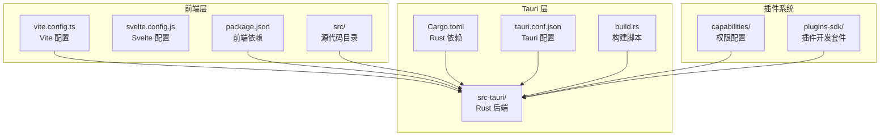
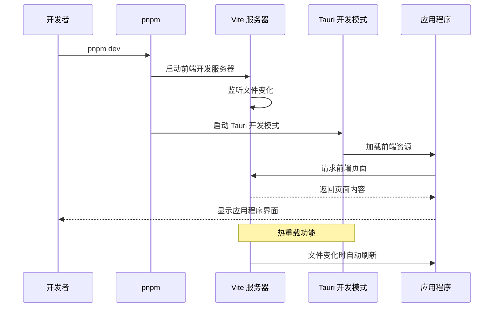
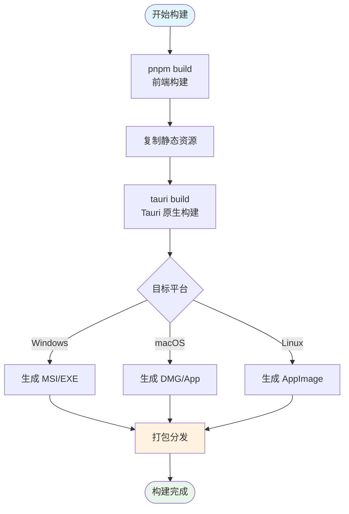
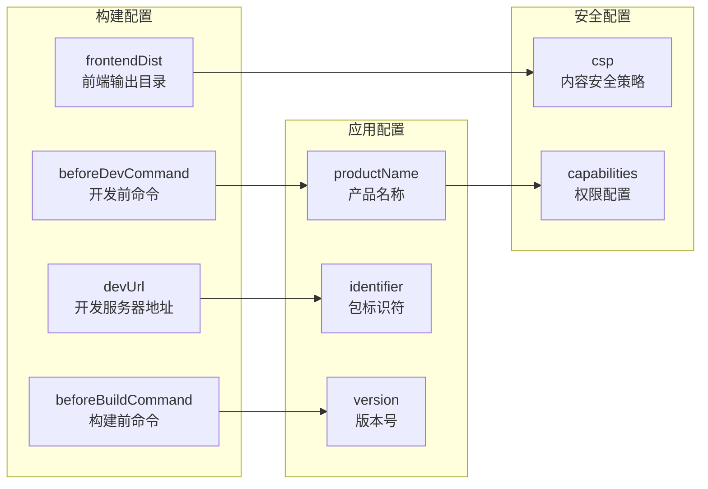

# 构建与发布操作指南

<cite>
**本文档引用的文件**
- [package.json](file://package.json)
- [src-tauri/Cargo.toml](file://src-tauri/Cargo.toml)
- [src-tauri/build.rs](file://src-tauri/build.rs)
- [src-tauri/tauri.conf.json](file://src-tauri/tauri.conf.json)
- [vite.config.ts](file://vite.config.ts)
- [src-tauri/src/main.rs](file://src-tauri/src/main.rs)
- [src-tauri/src/lib.rs](file://src-tauri/src/lib.rs)
- [src-tauri/capabilities/default.json](file://src-tauri/capabilities/default.json)
- [src-tauri/capabilities/desktop.json](file://src-tauri/capabilities/desktop.json)
- [README.md](file://README.md)
</cite>

## 目录
1. [简介](#简介)
2. [开发环境准备](#开发环境准备)
3. [项目结构概览](#项目结构概览)
4. [开发服务器启动](#开发服务器启动)
5. [生产构建流程](#生产构建流程)
6. [构建脚本详解](#构建脚本详解)
7. [多平台打包指南](#多平台打包指南)
8. [常见构建错误及解决方案](#常见构建错误及解决方案)
9. [部署与分发](#部署与分发)
10. [最佳实践建议](#最佳实践建议)

## 简介

Baize 是一个基于 Tauri + SvelteKit + TypeScript 技术栈构建的跨平台桌面应用程序。本指南将详细介绍从开发环境搭建到最终应用发布的完整流程，帮助开发者高效地完成应用程序的构建与部署工作。

该应用程序具有以下特点：
- 跨平台支持（Windows、macOS、Linux）
- 基于 Rust 的高性能后端
- 使用 SvelteKit 构建现代化用户界面
- 支持插件架构和自定义快捷键
- 提供快速启动和系统集成功能

## 开发环境准备

### 先决条件安装

#### 1. Node.js 和包管理器

首先确保系统已安装 Node.js 和 pnpm 包管理器：

```bash
# 检查 Node.js 版本
node --version
# 推荐版本：>= 18.x

# 检查 pnpm 版本
pnpm --version
# 推荐版本：>= 8.x
```

如果尚未安装 pnpm，可以通过 npm 安装：

```bash
npm install -g pnpm
```

#### 2. Rust 和 Tauri CLI

安装 Rust 编译工具链：

```bash
# 安装 Rust
curl --proto '=https' --tlsv1.2 -sSf https://sh.rustup.rs | sh

# 更新到最新版本
rustup update

# 安装 Tauri CLI
cargo install tauri-cli
```

#### 3. 平台特定依赖

根据目标平台安装额外依赖：

**Windows 平台：**
```bash
# 安装 Windows SDK
winget install Microsoft.VCRedist.2022.x64
```

**macOS 平台：**
```bash
# 安装 Xcode 命令行工具
xcode-select --install
```

**Linux 平台：**
```bash
# Ubuntu/Debian
sudo apt-get install build-essential libwebkit2gtk-4.0-dev \
  libappindicator3-dev librsvg2-dev patchelf

# CentOS/RHEL/Fedora
sudo yum groupinstall "Development Tools"
sudo yum install webkit2gtk3-devel libappindicator-gtk3 \
  librsvg2-devel patchelf
```

### 环境验证

安装完成后，验证环境配置：

```bash
# 检查 Tauri CLI 版本
tauri --version

# 检查 Rust 工具链
rustc --version
cargo --version

# 检查 Node.js 环境
node --version
pnpm --version
```

## 项目结构概览



**图表来源**
- [vite.config.ts](file://vite.config.ts#L1-L34)
- [src-tauri/Cargo.toml](file://src-tauri/Cargo.toml#L1-L71)
- [src-tauri/tauri.conf.json](file://src-tauri/tauri.conf.json#L1-L60)

**章节来源**
- [package.json](file://package.json#L1-L52)
- [src-tauri/Cargo.toml](file://src-tauri/Cargo.toml#L1-L71)
- [src-tauri/tauri.conf.json](file://src-tauri/tauri.conf.json#L1-L60)

## 开发服务器启动

### 启动开发服务器

使用以下命令启动开发服务器：

```bash
# 在项目根目录执行
pnpm dev
```

该命令会同时启动前端开发服务器和 Tauri 开发模式：



**图表来源**
- [package.json](file://package.json#L7-L8)
- [vite.config.ts](file://vite.config.ts#L15-L33)

### 开发服务器配置详解

开发服务器的配置位于 `vite.config.ts` 文件中：

```typescript
// Vite 服务器配置
server: {
  port: 1420,           // 固定端口，确保与 Tauri 配置一致
  strictPort: true,     // 如果端口被占用则失败
  host: host || false,  // 支持远程开发主机
  hmr: host ? {        // 热模块替换配置
    protocol: "ws",
    host,
    port: 1421,
  } : undefined,
  watch: {
    ignored: ["**/src-tauri/**"], // 忽略 Rust 源码变化
  },
}
```

**章节来源**
- [package.json](file://package.json#L7-L8)
- [vite.config.ts](file://vite.config.ts#L15-L33)

## 生产构建流程

### 构建命令序列

生产构建需要按顺序执行多个步骤：



**图表来源**
- [package.json](file://package.json#L7-L8)
- [src-tauri/tauri.conf.json](file://src-tauri/tauri.conf.json#L6-L10)

### 构建步骤详解

#### 1. 前端构建

```bash
# 构建前端资源
pnpm build
```

该命令会：
- 编译 Svelte 组件
- 优化 JavaScript 和 CSS
- 生成静态资源文件
- 输出到 `build/` 目录

#### 2. Tauri 原生构建

```bash
# 生产构建
tauri build
```

此命令会：
- 编译 Rust 后端代码
- 链接前端静态资源
- 生成原生可执行文件
- 应用代码签名（如适用）

**章节来源**
- [package.json](file://package.json#L7-L8)
- [src-tauri/tauri.conf.json](file://src-tauri/tauri.conf.json#L6-L10)

## 构建脚本详解

### build.rs 脚本分析

`build.rs` 是一个非常简单的构建脚本，但它在 Tauri 构建过程中扮演重要角色：

```rust
fn main() {
    tauri_build::build()
}
```

这个脚本的作用：
- **配置生成**：调用 `tauri_build::build()` 生成 Tauri 的配置文件
- **能力检查**：确保所有权限声明正确
- **资源嵌入**：将前端资源嵌入到原生二进制文件中
- **代码生成**：生成 Rust 代码以支持 IPC 通信

### tauri.conf.json 配置解析

Tauri 的核心配置文件包含了构建和运行时的所有必要设置：



**图表来源**
- [src-tauri/tauri.conf.json](file://src-tauri/tauri.conf.json#L6-L10)
- [src-tauri/tauri.conf.json](file://src-tauri/tauri.conf.json#L11-L20)

**章节来源**
- [src-tauri/build.rs](file://src-tauri/build.rs#L1-L4)
- [src-tauri/tauri.conf.json](file://src-tauri/tauri.conf.json#L1-L60)

## 多平台打包指南

### Windows 平台打包

#### 1. 准备工作

```bash
# 安装 Windows 构建依赖
cargo install cargo-wix

# 配置 Windows SDK
# 下载并安装 Windows SDK
# 设置环境变量
```

#### 2. 构建命令

```bash
# 生成 MSI 安装包
tauri build --target x86_64-pc-windows-msvc

# 生成 EXE 可执行文件
tauri build --target x86_64-pc-windows-msvc --no-default-features
```

#### 3. 打包结果

构建完成后，将在 `src-tauri/target/release/bundle/msi/` 目录下生成：
- `.msi` 安装包
- `.exe` 可执行文件
- 安装程序所需的资源文件

### macOS 平台打包

#### 1. 准备工作

```bash
# 安装 macOS SDK
xcode-select --install

# 配置代码签名（可选）
# 生成开发者证书
```

#### 2. 构建命令

```bash
# 生成 DMG 安装包
tauri build --target x86_64-apple-darwin

# 生成 App 包
tauri build --target aarch64-apple-darwin
```

#### 3. 打包结果

构建完成后，将在 `src-tauri/target/release/bundle/dmg/` 或 `src-tauri/target/release/bundle/app/` 目录下生成：
- `.dmg` 安装镜像
- `.app` 应用包
- 代码签名证书（如配置）

### Linux 平台打包

#### 1. 准备工作

```bash
# 安装 Linux 构建依赖
sudo apt-get install libwebkit2gtk-4.0-dev \
  libappindicator3-dev librsvg2-dev patchelf

# 配置 AppImage 工具
cargo install cargo-appimage
```

#### 2. 构建命令

```bash
# 生成 AppImage
tauri build --target x86_64-unknown-linux-gnu

# 生成 DEB 包
tauri build --target x86_64-unknown-linux-gnu --features deb

# 生成 RPM 包
tauri build --target x86_64-unknown-linux-gnu --features rpm
```

#### 3. 打包结果

构建完成后，将在 `src-tauri/target/release/bundle/` 目录下生成：
- `.AppImage` 可执行文件
- `.deb` Debian 包
- `.rpm` Red Hat 包

## 常见构建错误及解决方案

### 1. Rust 编译错误

#### 错误现象
```bash
error: failed to run custom build command for `openssl-sys`
```

#### 解决方案
```bash
# Windows
set OPENSSL_ROOT_DIR="C:\Program Files\OpenSSL-Win64"
set OPENSSL_LIB_DIR="C:\Program Files\OpenSSL-Win64\lib"

# macOS
brew install openssl
export OPENSSL_ROOT_DIR=$(brew --prefix openssl)

# Linux
sudo apt-get install pkg-config libssl-dev
```

### 2. Node.js 版本不兼容

#### 错误现象
```bash
error: Node.js version not supported
```

#### 解决方案
```bash
# 升级 Node.js
nvm install 18
nvm use 18

# 或使用 npx
npx pnpm@latest install
```

### 3. Tauri CLI 未找到

#### 错误现象
```bash
command not found: tauri
```

#### 解决方案
```bash
# 重新安装 Tauri CLI
cargo install tauri-cli

# 确保 PATH 包含 ~/.cargo/bin
echo 'export PATH="$HOME/.cargo/bin:$PATH"' >> ~/.bashrc
source ~/.bashrc
```

### 4. 权限配置错误

#### 错误现象
```bash
error: permission denied
```

#### 解决方案
检查 `src-tauri/capabilities/` 目录下的 JSON 文件，确保权限配置正确：

```json
{
  "permissions": [
    "core:default",
    "opener:default",
    "dialog:default"
  ]
}
```

### 5. 端口冲突

#### 错误现象
```bash
Error: Port 1420 is already in use
```

#### 解决方案
修改 Vite 配置或使用不同的端口：

```typescript
// vite.config.ts
server: {
  port: 3000, // 使用其他端口
  strictPort: true,
}
```

## 部署与分发

### 自动化部署

使用 GitHub Actions 进行自动化构建和部署：

```yaml
# .github/workflows/build.yml
name: Build and Deploy

on:
  push:
    branches: [main]
  pull_request:
    branches: [main]

jobs:
  build:
    runs-on: ${{ matrix.os }}
    
    strategy:
      matrix:
        os: [ubuntu-latest, windows-latest, macos-latest]
        node-version: [18.x]
    
    steps:
    - uses: actions/checkout@v3
    
    - name: Setup Node.js
      uses: actions/setup-node@v3
      with:
        node-version: ${{ matrix.node-version }}
        
    - name: Install pnpm
      run: npm install -g pnpm
      
    - name: Install Rust
      uses: actions-rs/toolchain@v1
      with:
        toolchain: stable
        
    - name: Install Tauri CLI
      run: cargo install tauri-cli
      
    - name: Install dependencies
      run: pnpm install
      
    - name: Build frontend
      run: pnpm build
      
    - name: Build Tauri app
      run: tauri build
      
    - name: Upload artifacts
      uses: actions/upload-artifact@v3
      with:
        name: app-${{ matrix.os }}
        path: src-tauri/target/release/bundle/**
```

### 发布渠道

#### 1. GitHub Releases
```bash
# 使用 semantic-release 自动发布
pnpm release
```

#### 2. 应用商店
- **Windows**: Microsoft Store
- **macOS**: Mac App Store
- **Linux**: Snap Store, Flatpak

#### 3. 自有网站
```bash
# 上传到 CDN
aws s3 cp src-tauri/target/release/bundle/ s3://your-bucket/releases/ --recursive

# 更新下载链接
echo "Download latest version: https://your-domain.com/download/latest"
```

## 最佳实践建议

### 1. 构建优化

- **增量构建**：利用 Tauri 的增量构建特性，减少重复编译时间
- **并行构建**：使用 `cargo build --jobs=n` 启用并行编译
- **缓存策略**：配置 CI/CD 系统的构建缓存

### 2. 性能监控

```bash
# 监控构建时间
time tauri build

# 分析二进制大小
du -sh src-tauri/target/release/baize
```

### 3. 安全考虑

- **代码签名**：为 Windows 和 macOS 应用配置代码签名
- **权限最小化**：仅授予应用运行所必需的权限
- **定期更新**：保持依赖库的最新版本

### 4. 测试策略

```bash
# 功能测试
tauri test

# 性能测试
tauri build --release --verbose

# 平台兼容性测试
for platform in windows macos linux; do
  echo "Testing $platform..."
  # 平台特定测试
done
```

### 5. 文档维护

- **构建文档**：维护详细的构建和部署文档
- **变更日志**：使用语义化版本控制
- **版本标记**：为每个发布版本打标签

通过遵循本指南的最佳实践，开发者可以高效地完成 Baize 应用程序的构建与发布工作，确保应用程序的质量和可靠性。定期更新构建脚本和配置文件，以适应技术栈的发展和新需求的出现。