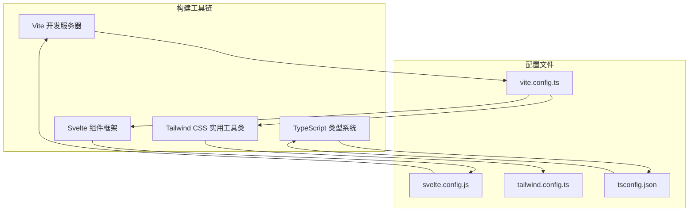
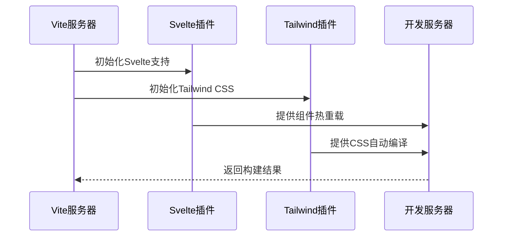
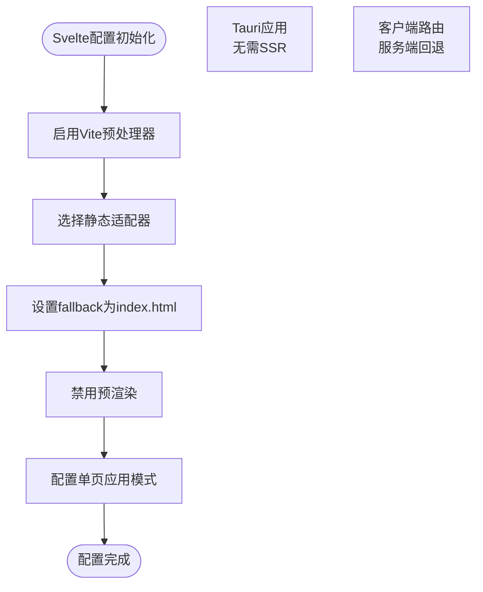
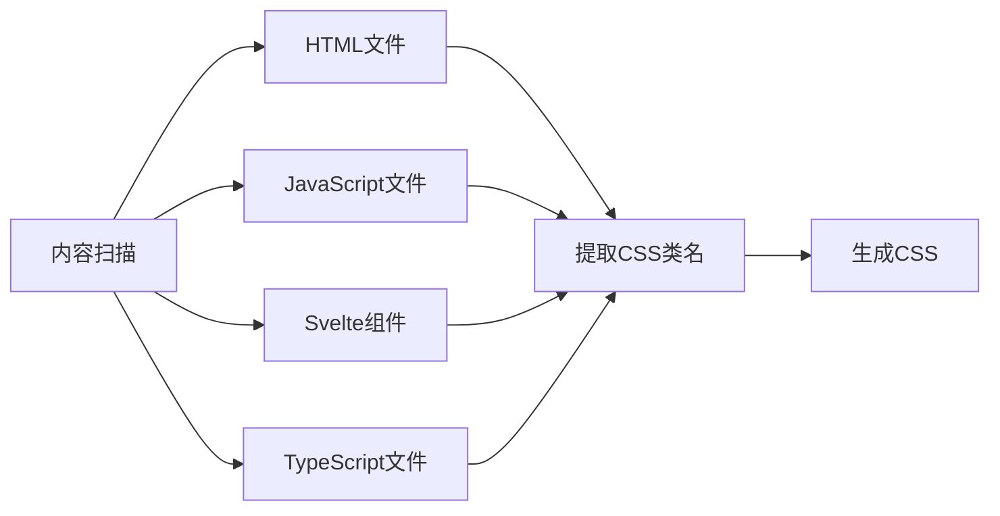
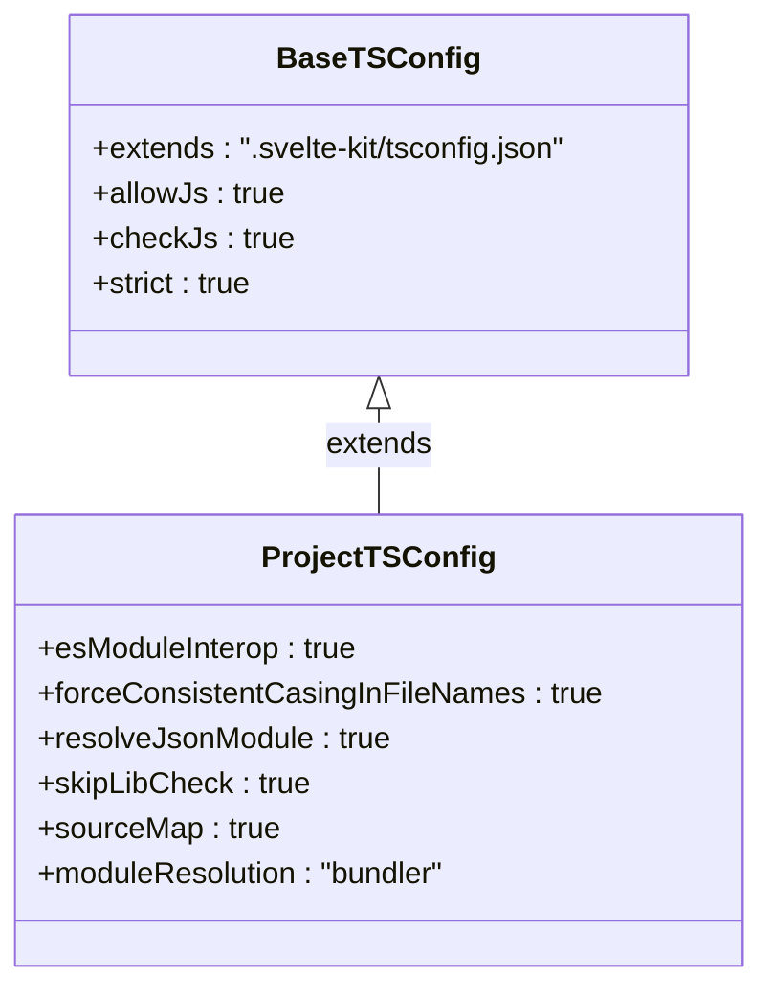
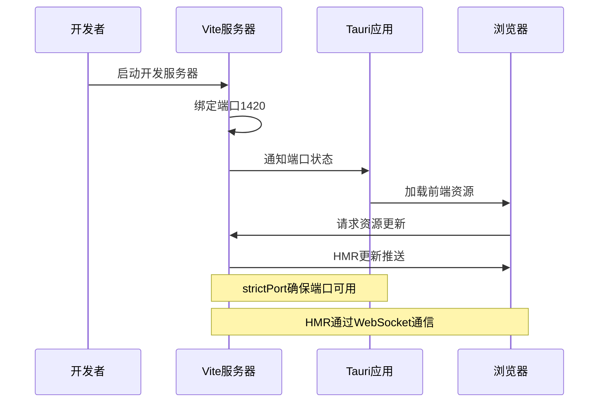
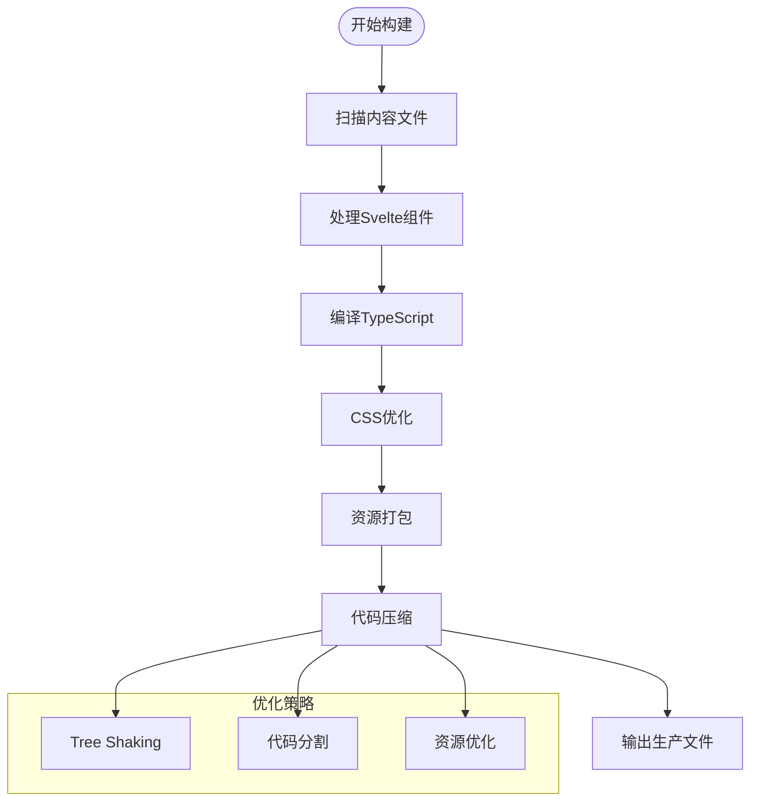
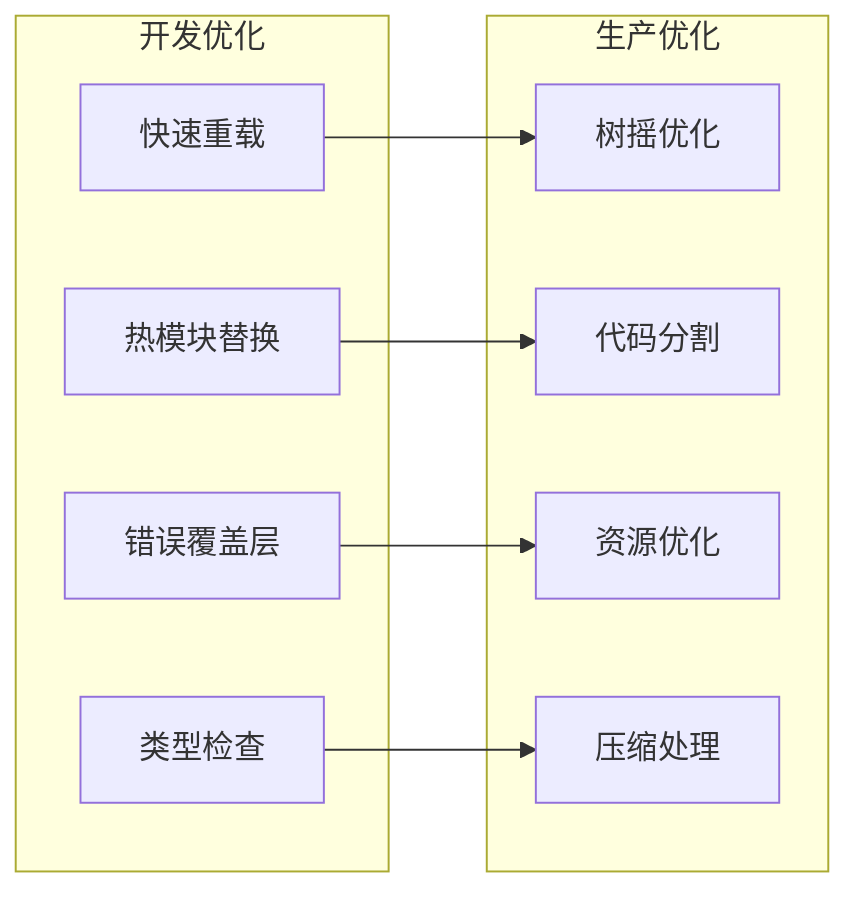

# Baize项目前端构建配置详解

<cite>
**本文档中引用的文件**
- [vite.config.ts](file://vite.config.ts)
- [svelte.config.js](file://svelte.config.js)
- [tailwind.config.ts](file://tailwind.config.ts)
- [package.json](file://package.json)
- [tsconfig.json](file://tsconfig.json)
- [src/index.css](file://src/index.css)
</cite>

## 目录
1. [项目概述](#项目概述)
2. [核心构建工具配置](#核心构建工具配置)
3. [Vite配置详解](#vite配置详解)
4. [Svelte配置架构](#svelte配置架构)
5. [Tailwind CSS集成](#tailwind-css集成)
6. [TypeScript配置体系](#typescript配置体系)
7. [开发服务器配置](#开发服务器配置)
8. [生产构建优化](#生产构建优化)
9. [依赖关系分析](#依赖关系分析)
10. [性能优化策略](#性能优化策略)
11. [故障排除指南](#故障排除指南)
12. [总结](#总结)

## 项目概述

Baize项目采用现代化的前端技术栈，结合Vite、Svelte、TypeScript和Tailwind CSS构建高性能的桌面应用程序。该项目作为Tauri应用的前端部分，需要在开发和生产环境中提供最佳的构建体验和性能表现。

项目的核心特点：
- 基于Vite的快速开发服务器
- Svelte框架的组件化开发
- TypeScript的类型安全保障
- Tailwind CSS的实用优先设计
- 针对Tauri环境的特殊优化

## 核心构建工具配置

### 技术栈概览



**图表来源**
- [vite.config.ts](file://vite.config.ts#L1-L34)
- [svelte.config.js](file://svelte.config.js#L1-L29)
- [tailwind.config.ts](file://tailwind.config.ts#L1-L12)
- [tsconfig.json](file://tsconfig.json#L1-L20)

### 依赖生态系统

项目使用pnpm包管理器，集成了以下核心依赖：

**开发依赖**：
- `vite`: 现代化的构建工具
- `@sveltejs/kit`: Svelte框架的全栈解决方案
- `@sveltejs/vite-plugin-svelte`: Svelte与Vite的集成插件
- `typescript`: JavaScript的超集语言
- `tailwindcss`: 实用优先的CSS框架
- `@tailwindcss/vite`: Tailwind与Vite的原生集成

**运行时依赖**：
- `@tauri-apps/api`: Tauri应用编程接口
- 各种Tauri插件：autostart、dialog、global-shortcut等

**章节来源**
- [package.json](file://package.json#L1-L52)

## Vite配置详解

### 基础配置结构

Vite配置文件是整个构建系统的入口点，负责协调各种插件和开发服务器设置：

```typescript
import { defineConfig } from "vite";
import { sveltekit } from "@sveltejs/kit/vite";
import tailwindcss from "@tailwindcss/vite";

const host = process.env.TAURI_DEV_HOST;

export default defineConfig({
  plugins: [sveltekit(), tailwindcss()],
  // Tauri特定配置...
});
```

### 插件集成策略



**图表来源**
- [vite.config.ts](file://vite.config.ts#L1-L10)

### Tauri环境适配

配置针对Tauri环境进行了特殊优化：

1. **错误处理优化**：禁用屏幕清理以显示Rust错误
2. **端口固定**：确保开发服务器使用固定端口
3. **主机适配**：支持环境变量控制开发主机
4. **热重载配置**：为远程开发提供WebSocket支持

**章节来源**
- [vite.config.ts](file://vite.config.ts#L1-L34)

## Svelte配置架构

### 静态适配器配置

Svelte配置采用了静态适配器，专门为Tauri应用设计：

```javascript
import adapter from "@sveltejs/adapter-static";
import { vitePreprocess } from "@sveltejs/vite-plugin-svelte";

const config = {
  preprocess: vitePreprocess(),
  kit: {
    adapter: adapter({
      fallback: "index.html",
    }),
    prerender: {
      entries: [],
    },
  },
};
```

### 配置决策分析



**图表来源**
- [svelte.config.js](file://svelte.config.js#L1-L29)

### 预渲染策略

配置明确禁用了预渲染功能，这是针对Tauri应用的重要决策：

- **原因**：Tauri应用主要依赖客户端路由处理
- **优势**：减少构建时间和复杂性
- **兼容性**：确保与Tauri的单页应用架构兼容

**章节来源**
- [svelte.config.js](file://svelte.config.js#L1-L29)

## Tailwind CSS集成

### 配置文件结构

Tailwind配置简洁而高效，专注于实用优先的设计原则：

```typescript
export default {
  content: ['./src/**/*.{html,js,svelte,ts}'],
  darkMode: 'class',
  theme: {
    extend: {},
  },
  plugins: [],
};
```

### 内容扫描策略



**图表来源**
- [tailwind.config.ts](file://tailwind.config.ts#L3-L3)

### 暗黑模式配置

配置采用"class"策略实现暗黑模式：

- **策略**：通过添加`.dark`类手动切换
- **灵活性**：允许精确控制主题切换时机
- **性能**：避免复杂的媒体查询检测

**章节来源**
- [tailwind.config.ts](file://tailwind.config.ts#L1-L12)

## TypeScript配置体系

### 编译器选项配置

TypeScript配置继承自SvelteKit的默认配置，并添加了项目特定的选项：

```json
{
  "extends": "./.svelte-kit/tsconfig.json",
  "compilerOptions": {
    "allowJs": true,
    "checkJs": true,
    "esModuleInterop": true,
    "forceConsistentCasingInFileNames": true,
    "resolveJsonModule": true,
    "skipLibCheck": true,
    "sourceMap": true,
    "strict": true,
    "moduleResolution": "bundler"
  }
}
```

### 配置层次结构



**图表来源**
- [tsconfig.json](file://tsconfig.json#L1-L20)

### 严格模式配置

配置采用了严格的TypeScript设置：

- **strict**: 启用所有严格类型检查选项
- **allowJs**: 允许JavaScript文件混用
- **checkJs**: 在JavaScript文件中进行类型检查
- **sourceMap**: 生成源码映射以便调试

**章节来源**
- [tsconfig.json](file://tsconfig.json#L1-L20)

## 开发服务器配置

### 服务器选项详解

Vite配置中的服务器选项针对Tauri开发环境进行了专门优化：

```typescript
server: {
  port: 1420,
  strictPort: true,
  host: host || false,
  hmr: host
    ? {
        protocol: "ws",
        host,
        port: 1421,
      }
    : undefined,
  watch: {
    ignored: ["**/src-tauri/**"],
  },
},
```

### 端口管理策略



**图表来源**
- [vite.config.ts](file://vite.config.ts#L15-L28)

### 热模块替换(HMR)配置

配置支持多种开发场景的HMR：

1. **本地开发**：标准的WebSocket HMR
2. **远程开发**：通过环境变量配置的主机地址
3. **性能优化**：忽略src-tauri目录的监控

**章节来源**
- [vite.config.ts](file://vite.config.ts#L15-L28)

## 生产构建优化

### 构建流程分析

虽然当前配置主要关注开发环境，但已经为生产构建做好了准备：



### 静态适配器优化

静态适配器配置提供了多个优化特性：

- **单页应用支持**：通过fallback机制支持客户端路由
- **预渲染禁用**：减少构建时间，适合动态内容应用
- **资源优化**：生成最小化的静态文件

**章节来源**
- [svelte.config.js](file://svelte.config.js#L10-L20)

## 依赖关系分析

### 核心依赖关系图

```mermaid
graph TB
subgraph "构建工具"
Vite[Vite]
SvelteKit[SvelteKit]
TS[TypeScript]
end
subgraph "插件生态"
SveltePlugin[@sveltejs/vite-plugin-svelte]
TailwindPlugin[@tailwindcss/vite]
StaticAdapter[@sveltejs/adapter-static]
end
subgraph "CSS框架"
Tailwind[Tailwind CSS]
PostCSS[PostCSS]
end
Vite --> SveltePlugin
Vite --> TailwindPlugin
SvelteKit --> StaticAdapter
SveltePlugin --> SvelteKit
TailwindPlugin --> Tailwind
Tailwind --> PostCSS
Vite -.-> TS
```

**图表来源**
- [package.json](file://package.json#L15-L35)
- [vite.config.ts](file://vite.config.ts#L1-L10)

### 版本兼容性

项目选择了经过验证的稳定版本组合：

- **Vite 7.x**: 最新稳定版本，提供最佳性能
- **SvelteKit 2.x**: 新一代Svelte框架，增强开发体验
- **Tailwind CSS 4.x**: 最新版本，改进的性能和功能
- **TypeScript 5.8.x**: 最新类型安全版本

**章节来源**
- [package.json](file://package.json#L15-L35)

## 性能优化策略

### 构建性能优化

项目采用了多种性能优化策略：

1. **增量编译**：利用Vite的快速重编译能力
2. **并行处理**：多线程处理不同类型的文件
3. **缓存机制**：智能缓存编译结果
4. **资源优化**：自动优化图片和字体资源

### 开发体验优化



### CSS性能优化

Tailwind CSS配置支持多种性能优化：

- **按需生成**：只生成实际使用的CSS类
- **CSS压缩**：自动压缩生成的CSS文件
- **浏览器前缀**：自动添加必要的浏览器前缀
- **响应式设计**：内置响应式断点支持

**章节来源**
- [tailwind.config.ts](file://tailwind.config.ts#L1-L12)

## 故障排除指南

### 常见问题及解决方案

#### 1. 端口冲突问题

**问题描述**：开发服务器无法启动，提示端口被占用

**解决方案**：
```bash
# 检查端口占用
netstat -ano | findstr :1420

# 修改端口配置
# 在vite.config.ts中修改port值
```

#### 2. TypeScript类型错误

**问题描述**：TypeScript检查失败，出现类型错误

**解决方案**：
```bash
# 运行类型检查
npm run check

# 监视模式检查
npm run check:watch
```

#### 3. Tailwind CSS不生效

**问题描述**：自定义CSS类没有正确应用

**解决方案**：
- 检查content配置是否包含相关文件
- 确保类名符合Tailwind命名规范
- 清除构建缓存后重新构建

#### 4. Svelte组件热重载失效

**问题描述**：修改Svelte组件后页面不刷新

**解决方案**：
- 检查文件监听配置
- 确保文件路径正确
- 重启开发服务器

### 调试技巧

1. **启用详细日志**：设置环境变量`DEBUG=vite:*`
2. **检查网络连接**：确保HMR WebSocket连接正常
3. **验证配置文件**：使用JSON格式验证配置语法
4. **清理缓存**：定期清理node_modules和构建缓存

**章节来源**
- [vite.config.ts](file://vite.config.ts#L15-L28)
- [package.json](file://package.json#L6-L13)

## 总结

Baize项目的前端构建配置展现了现代Web应用的最佳实践。通过精心设计的配置体系，项目实现了：

### 核心优势

1. **高效的开发体验**：Vite提供的快速重编译和热模块替换
2. **强大的类型安全**：TypeScript的全面类型检查
3. **灵活的样式系统**：Tailwind CSS的实用优先设计
4. **优化的构建流程**：针对Tauri环境的特殊优化

### 技术特色

- **插件化架构**：清晰的插件分离和职责划分
- **环境适配**：针对不同环境的优化配置
- **性能导向**：从开发到生产的全方位性能优化
- **可维护性**：简洁明了的配置结构和注释

### 未来发展方向

1. **渐进式增强**：考虑添加预渲染支持以提升SEO
2. **模块联邦**：探索微前端架构的可能性
3. **性能监控**：集成构建性能分析工具
4. **自动化测试**：完善端到端测试和CI/CD流程

这个配置体系为Baize项目提供了坚实的技术基础，支持其作为Tauri应用前端的长期发展需求。通过持续的优化和改进，项目将继续保持在现代Web开发的最佳实践中。