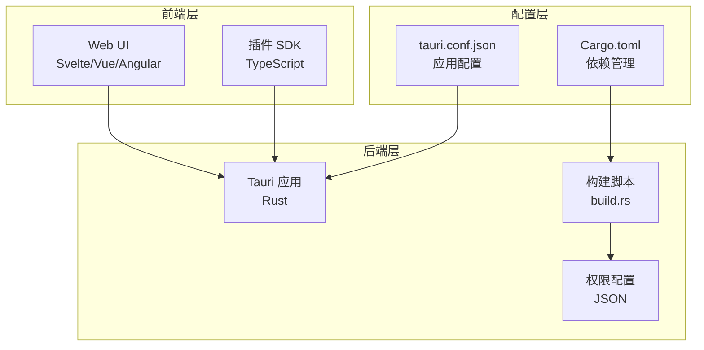
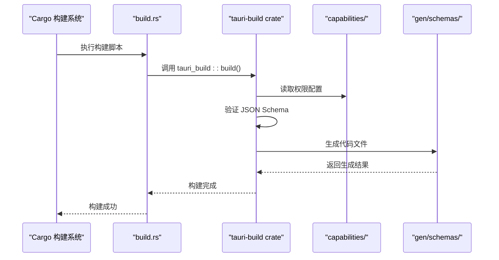
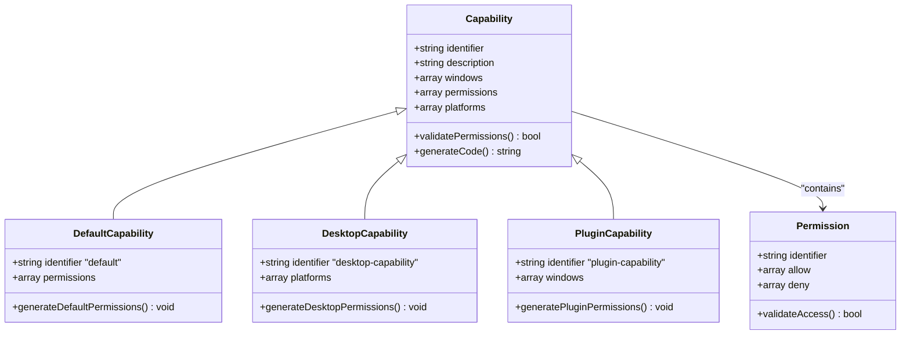
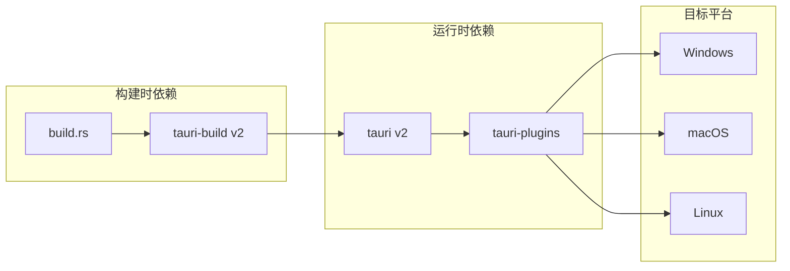
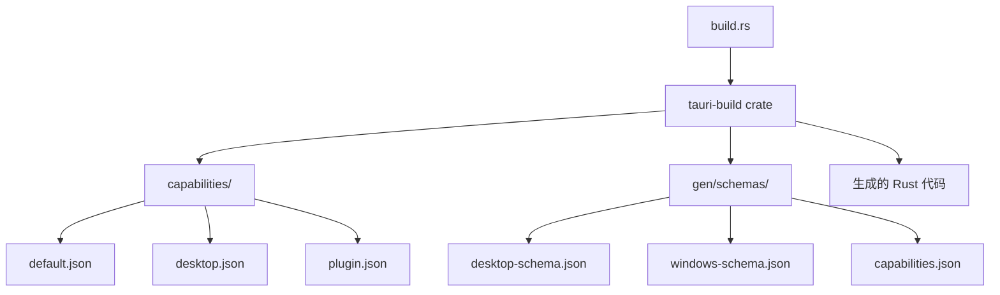
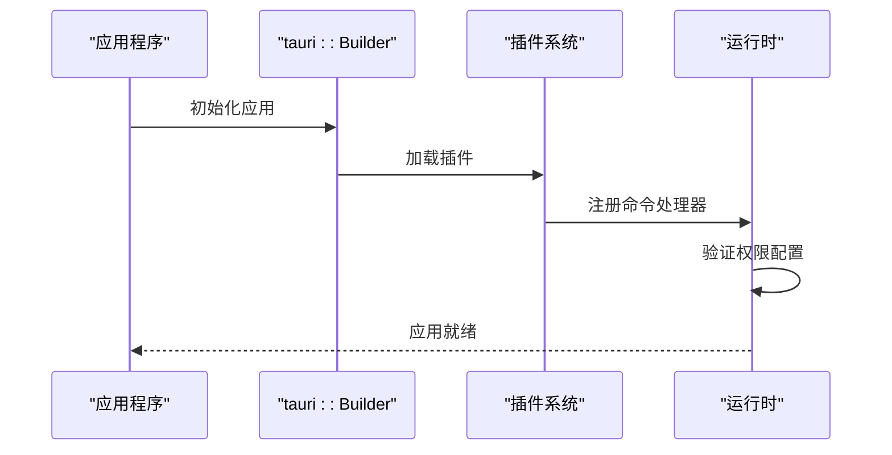

# 后端构建脚本

<cite>
**本文档引用的文件**
- [build.rs](file://src-tauri/build.rs)
- [Cargo.toml](file://src-tauri/Cargo.toml)
- [tauri.conf.json](file://src-tauri/tauri.conf.json)
- [lib.rs](file://src-tauri/src/lib.rs)
- [main.rs](file://src-tauri/src/main.rs)
- [default.json](file://src-tauri/capabilities/default.json)
- [desktop.json](file://src-tauri/capabilities/desktop.json)
- [plugin.json](file://src-tauri/capabilities/plugin.json)
</cite>

## 目录
1. [简介](#简介)
2. [项目结构概览](#项目结构概览)
3. [核心构建脚本分析](#核心构建脚本分析)
4. [架构概述](#架构概述)
5. [详细组件分析](#详细组件分析)
6. [依赖关系分析](#依赖关系分析)
7. [性能考虑](#性能考虑)
8. [故障排除指南](#故障排除指南)
9. [结论](#结论)

## 简介

本文档详细解析了 `src-tauri/build.rs` 构建脚本的功能和实现。该脚本是 Tauri 应用程序构建过程中的关键组件，负责使用 `tauri-build` crate 来生成权限（capabilities）和权限集（scopes），并处理自定义构建逻辑。通过深入分析这个简单的但功能强大的构建脚本，我们将了解它如何与 `Cargo.toml` 中的 `[build-dependencies]` 交互，以及如何影响最终的二进制文件。

## 项目结构概览

该项目采用典型的 Tauri 应用程序结构，包含前端和后端两个主要部分：



**图表来源**
- [build.rs](file://src-tauri/build.rs#L1-L4)
- [Cargo.toml](file://src-tauri/Cargo.toml#L1-L71)
- [tauri.conf.json](file://src-tauri/tauri.conf.json#L1-L60)

**章节来源**
- [build.rs](file://src-tauri/build.rs#L1-L4)
- [Cargo.toml](file://src-tauri/Cargo.toml#L1-L71)

## 核心构建脚本分析

### 简单而强大的设计

`src-tauri/build.rs` 文件展现了现代 Rust 构建系统的设计哲学：简单、直接且功能强大。这个文件只有短短的四行代码，却包含了完整的构建逻辑：

```rust
fn main() {
    tauri_build::build()
}
```

这种简洁的设计体现了以下优势：
- **最小化维护成本**：减少了潜在的错误点和维护负担
- **专注于核心功能**：将复杂逻辑委托给专门的 crate
- **易于理解和调试**：开发者可以快速理解构建流程

### 构建脚本的作用机制

当 Rust 编译器遇到 `build.rs` 文件时，它会在编译过程中自动执行这个脚本。对于 Tauri 应用程序，`tauri_build::build()` 函数会执行以下关键操作：

1. **权限生成**：根据 `capabilities` 目录中的 JSON 配置文件生成相应的权限代码
2. **Schema 验证**：验证权限配置是否符合 Tauri 的 schema 规范
3. **代码生成**：为每个权限配置生成对应的 Rust 结构体和方法
4. **编译时检查**：确保权限配置的一致性和正确性

**章节来源**
- [build.rs](file://src-tauri/build.rs#L1-L4)

## 架构概述

Tauri 应用程序的构建架构采用了分层设计，构建脚本作为关键的桥梁连接了配置层和代码生成层：



**图表来源**
- [build.rs](file://src-tauri/build.rs#L1-L4)
- [Cargo.toml](file://src-tauri/Cargo.toml#L18-L19)

## 详细组件分析

### 权限系统架构

Tauri 的权限系统是一个精心设计的安全机制，通过 JSON 配置文件定义应用程序的访问权限：



**图表来源**
- [default.json](file://src-tauri/capabilities/default.json#L1-L23)
- [desktop.json](file://src-tauri/capabilities/desktop.json#L1-L14)
- [plugin.json](file://src-tauri/capabilities/plugin.json#L1-L22)

### 权限配置详解

#### 默认权限配置 (`default.json`)

默认权限配置定义了主窗口的基本访问权限：

```json
{
  "identifier": "default",
  "description": "Capability for the main window",
  "windows": ["main"],
  "permissions": [
    "core:default",
    "opener:default",
    "dialog:default",
    "global-shortcut:allow-register",
    "core:window:allow-start-dragging"
  ]
}
```

这些权限包括：
- **核心权限**：基础的 Tauri 功能访问
- **对话框权限**：文件选择和消息显示
- **全局快捷键**：系统级快捷键注册和管理
- **窗口控制**：拖拽和基本窗口操作

#### 桌面平台权限配置 (`desktop.json`)

桌面平台权限配置针对多平台支持进行了优化：

```json
{
  "identifier": "desktop-capability",
  "platforms": ["macOS", "windows", "linux"],
  "windows": ["main"],
  "permissions": ["global-shortcut:default"]
}
```

#### 插件权限配置 (`plugin.json`)

插件权限配置为插件窗口提供了更广泛的访问权限：

```json
{
  "identifier": "plugin-capability",
  "windows": ["plugin_*"],
  "permissions": [
    "core:default",
    "core:window:allow-close",
    "core:window:allow-minimize",
    "core:window:allow-maximize"
  ]
}
```

**章节来源**
- [default.json](file://src-tauri/capabilities/default.json#L1-L23)
- [desktop.json](file://src-tauri/capabilities/desktop.json#L1-L14)
- [plugin.json](file://src-tauri/capabilities/plugin.json#L1-L22)

### 构建依赖关系

构建脚本与 Cargo.toml 中的依赖关系形成了紧密的协作：



**图表来源**
- [Cargo.toml](file://src-tauri/Cargo.toml#L18-L19)
- [build.rs](file://src-tauri/build.rs#L1-L4)

**章节来源**
- [Cargo.toml](file://src-tauri/Cargo.toml#L1-L71)
- [build.rs](file://src-tauri/build.rs#L1-L4)

## 依赖关系分析

### 构建时依赖链

构建脚本的依赖关系相对简单但功能完整：



**图表来源**
- [build.rs](file://src-tauri/build.rs#L1-L4)
- [Cargo.toml](file://src-tauri/Cargo.toml#L18-L19)

### 运行时集成

构建生成的代码与运行时的 Tauri 核心系统无缝集成：



**图表来源**
- [lib.rs](file://src-tauri/src/lib.rs#L70-L120)
- [main.rs](file://src-tauri/src/main.rs#L1-L7)

**章节来源**
- [build.rs](file://src-tauri/build.rs#L1-L4)
- [Cargo.toml](file://src-tauri/Cargo.toml#L18-L19)

## 性能考虑

### 构建时间优化

虽然 `build.rs` 本身非常简单，但它对整体构建性能有重要影响：

1. **增量编译**：Tauri 的权限生成支持增量编译，只有在权限配置发生变化时才会重新生成代码
2. **并行处理**：构建过程可以与其他编译任务并行执行
3. **缓存机制**：生成的代码会被缓存，避免重复计算

### 运行时性能

权限系统的设计考虑了运行时性能：

- **静态检查**：权限验证在编译时完成，运行时无需额外开销
- **零成本抽象**：生成的代码直接映射到底层系统调用
- **内存效率**：权限数据结构紧凑，占用最少的内存空间

## 故障排除指南

### 常见构建问题

#### 权限配置错误

当权限配置不符合 schema 规范时，构建会失败：

```bash
error: failed to build tauri application
Caused by: invalid capability configuration
```

解决方案：
1. 检查 JSON 语法是否正确
2. 验证权限标识符是否存在
3. 确保路径模式匹配正确的文件系统位置

#### Schema 版本不兼容

不同版本的 Tauri 可能使用不同的 schema 版本：

```bash
error: capability schema mismatch
```

解决方案：
1. 更新 `tauri-build` crate 到最新版本
2. 检查 `gen/schemas/` 目录中的 schema 文件版本
3. 确保所有依赖项版本兼容

### 调试技巧

1. **启用详细输出**：使用 `cargo build --verbose` 查看详细的构建日志
2. **清理构建缓存**：使用 `cargo clean` 清理旧的构建产物
3. **检查生成的代码**：查看 `target/debug/build/*/out/` 目录中的生成文件

**章节来源**
- [build.rs](file://src-tauri/build.rs#L1-L4)

## 结论

`src-tauri/build.rs` 构建脚本展示了现代 Rust 开发的最佳实践：简单、高效且功能强大。通过使用 `tauri-build` crate，开发者可以轻松地管理复杂的权限系统，同时保持构建过程的简洁性。

这个构建脚本的关键价值在于：
- **简化开发流程**：将复杂的权限管理抽象为简单的 JSON 配置
- **提高安全性**：通过编译时检查确保权限配置的正确性
- **增强可维护性**：清晰的职责分离和模块化设计
- **支持扩展性**：易于添加新的权限配置和自定义构建逻辑

对于希望扩展此脚本以支持自定义资源嵌入或条件编译的开发者，建议在 `tauri_build::build()` 之后添加自定义的构建逻辑，或者通过环境变量控制不同的构建行为。