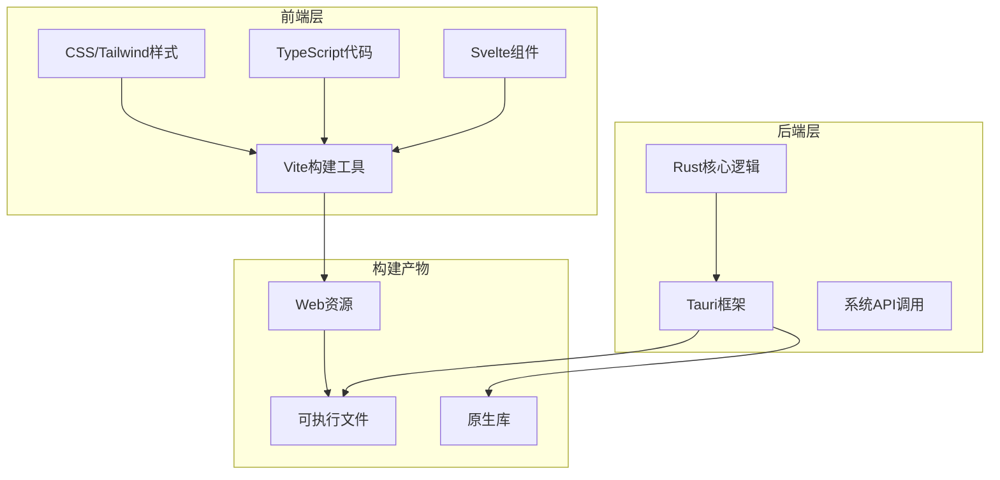
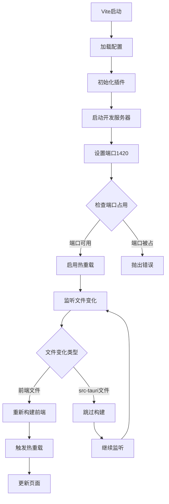
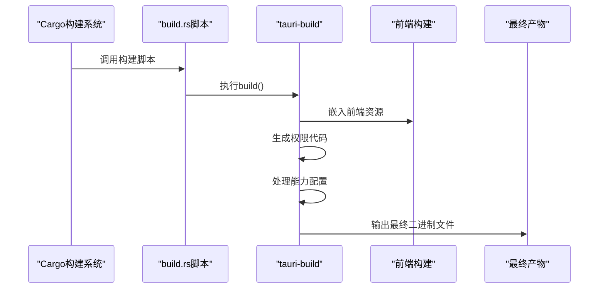
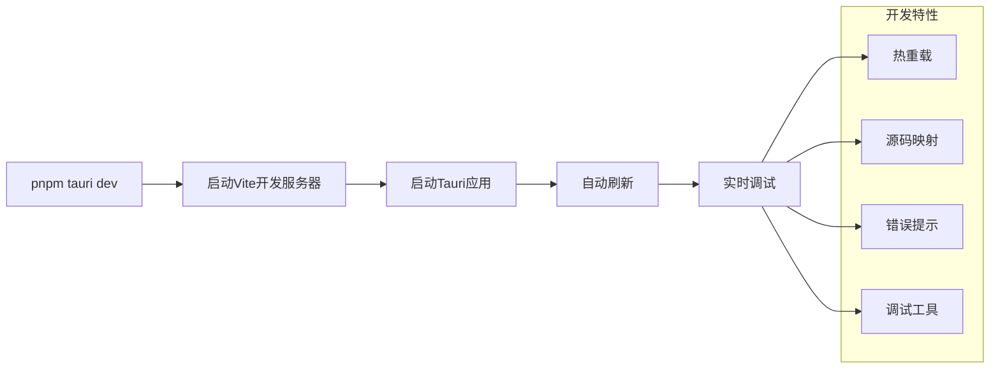
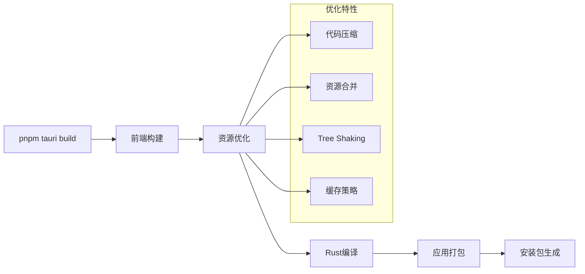
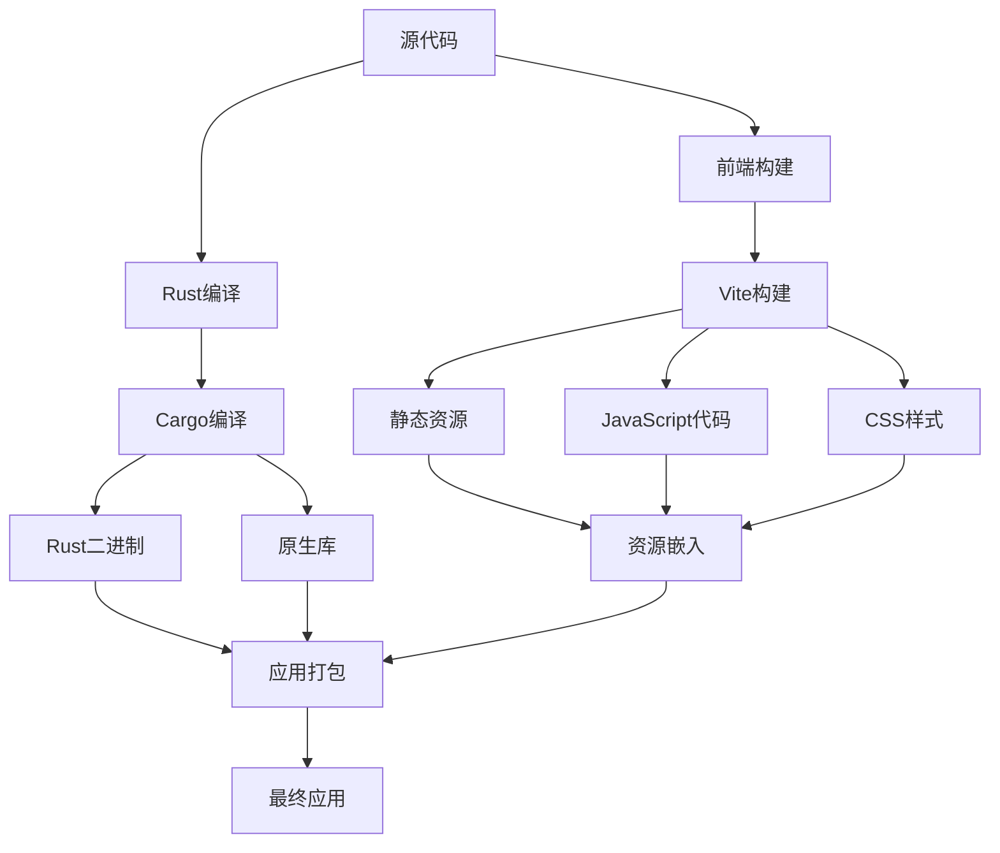
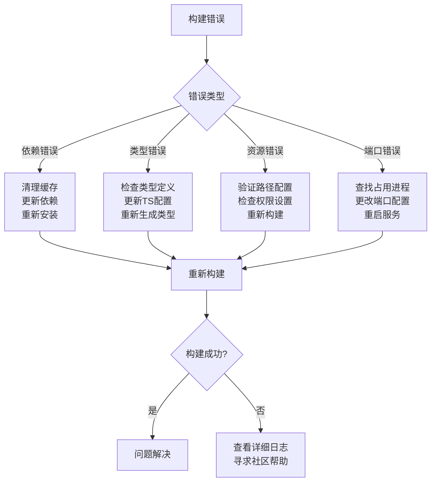
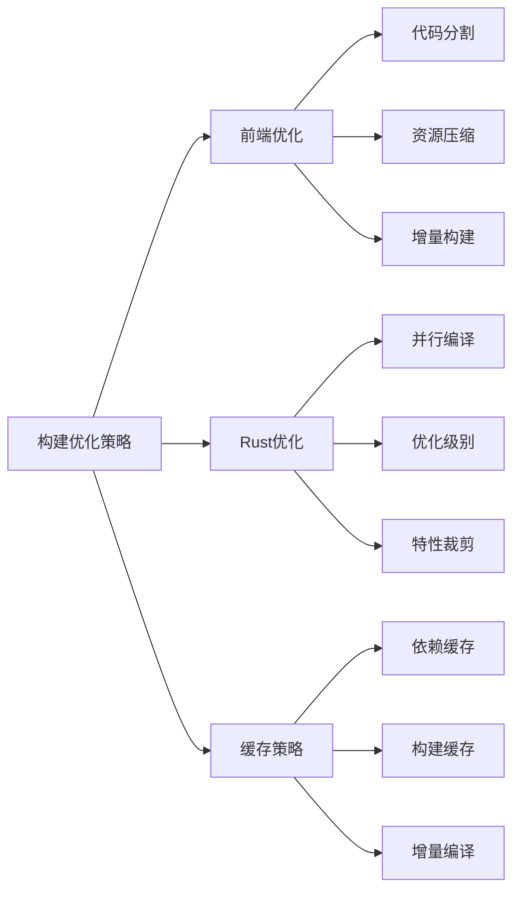

# Baize项目构建流程详解

<cite>
**本文档引用的文件**
- [package.json](file://package.json)
- [vite.config.ts](file://vite.config.ts)
- [src-tauri/tauri.conf.json](file://src-tauri/tauri.conf.json)
- [src-tauri/build.rs](file://src-tauri/build.rs)
- [src-tauri/Cargo.toml](file://src-tauri/Cargo.toml)
- [src-tauri/src/lib.rs](file://src-tauri/src/lib.rs)
- [src-tauri/src/main.rs](file://src-tauri/src/main.rs)
- [svelte.config.js](file://svelte.config.js)
- [tailwind.config.ts](file://tailwind.config.ts)
- [tsconfig.json](file://tsconfig.json)
- [src-tauri/capabilities/default.json](file://src-tauri/capabilities/default.json)
</cite>

## 目录
1. [项目概述](#项目概述)
2. [构建工具配置](#构建工具配置)
3. [Vite构建配置详解](#vite构建配置详解)
4. [Tauri配置分析](#tauri配置分析)
5. [Rust构建脚本](#rust构建脚本)
6. [开发模式vs生产模式](#开发模式vs生产模式)
7. [构建流程架构](#构建流程架构)
8. [常见构建错误及解决方案](#常见构建错误及解决方案)
9. [性能优化建议](#性能优化建议)
10. [总结](#总结)

## 项目概述

Baize是一个基于Tauri框架的桌面应用程序，采用现代化的前后端分离架构。项目使用Svelte作为前端框架，TypeScript进行类型安全编程，Vite作为构建工具，并通过Rust实现高性能的后端逻辑。



**图表来源**
- [vite.config.ts](file://vite.config.ts#L1-L34)
- [src-tauri/Cargo.toml](file://src-tauri/Cargo.toml#L1-L71)

## 构建工具配置

### 前端构建工具链

项目采用了完整的现代前端构建工具链：

- **Vite**: 作为主要的构建工具，提供快速的开发服务器和高效的生产构建
- **Svelte**: 组件化框架，提供声明式的UI开发体验
- **TypeScript**: 类型安全的JavaScript超集
- **Tailwind CSS**: 实用优先的CSS框架

### 后端构建工具链

- **Cargo**: Rust包管理器和构建工具
- **Tauri CLI**: 提供Tauri应用的构建、打包和发布功能
- **Rust编译器**: 将Rust代码编译为原生二进制文件

**章节来源**
- [package.json](file://package.json#L1-L52)
- [src-tauri/Cargo.toml](file://src-tauri/Cargo.toml#L1-L71)

## Vite构建配置详解

### 基础配置结构

Vite配置针对Tauri应用进行了专门优化，主要特点包括：

```typescript
export default defineConfig({
  plugins: [sveltekit(), tailwindcss()],
  server: {
    port: 1420,
    strictPort: true,
    host: host || false,
    hmr: host ? { protocol: "ws", host, port: 1421 } : undefined,
    watch: {
      ignored: ["**/src-tauri/**"],
    },
  },
});
```

### 关键配置解析

1. **插件配置**
   - `sveltekit()`: 集成SvelteKit框架支持
   - `tailwindcss()`: 集成Tailwind CSS样式处理

2. **开发服务器配置**
   - **固定端口**: 设置为1420，确保与Tauri配置一致
   - **严格端口检查**: `strictPort: true`确保端口可用
   - **热重载**: 支持远程开发主机的WebSocket热重载
   - **文件监控**: 排除`src-tauri`目录，避免不必要的重新构建

3. **环境变量支持**
   - `TAURI_DEV_HOST`: 支持远程开发主机连接
   - 自动检测并适配不同的开发环境



**图表来源**
- [vite.config.ts](file://vite.config.ts#L10-L32)

**章节来源**
- [vite.config.ts](file://vite.config.ts#L1-L34)

## Tauri配置分析

### 核心配置结构

Tauri配置文件`tauri.conf.json`是整个应用的核心配置中心：

```json
{
  "productName": "baize",
  "version": "0.1.0",
  "identifier": "com.baize.data",
  "build": {
    "beforeDevCommand": "pnpm dev",
    "devUrl": "http://localhost:1420",
    "beforeBuildCommand": "pnpm build",
    "frontendDist": "../build"
  }
}
```

### Build部分详解

1. **开发前命令**
   - `beforeDevCommand`: 开发模式下运行`pnpm dev`启动Vite开发服务器
   - 确保前端服务在后端启动前已就绪

2. **开发URL配置**
   - `devUrl`: 指定前端开发服务器地址`http://localhost:1420`
   - 与Vite配置保持一致

3. **构建前命令**
   - `beforeBuildCommand`: 生产构建前运行`pnpm build`生成前端资源
   - 自动化构建流程

4. **前端资源目录**
   - `frontendDist`: 指向`../build`目录，存放Vite构建输出
   - 确保构建产物正确集成到最终应用中

### App部分配置

```json
"app": {
  "windows": [{
    "width": 800,
    "height": 400,
    "dragDropEnabled": true,
    "alwaysOnTop": true,
    "center": true,
    "closable": false,
    "decorations": false,
    "focus": true,
    "hiddenTitle": true,
    "maximizable": false,
    "skipTaskbar": true,
    "transparent": true,
    "shadow": false
  }],
  "security": {
    "csp": "default-src 'self' plugin: 'unsafe-inline' 'unsafe-eval';..."
  }
}
```

### Bundle配置

```json
"bundle": {
  "active": true,
  "targets": "all",
  "icon": [
    "icons/32x32.png",
    "icons/128x128.png",
    "icons/128x128@2x.png",
    "icons/icon.icns",
    "icons/icon.ico"
  ]
}
```

**章节来源**
- [src-tauri/tauri.conf.json](file://src-tauri/tauri.conf.json#L1-L60)

## Rust构建脚本

### build.rs的作用

`src-tauri/build.rs`是一个非常简洁但关键的构建脚本：

```rust
fn main() {
    tauri_build::build()
}
```

这个脚本的主要功能：

1. **资源嵌入**: 自动将前端构建产物嵌入到Rust二进制文件中
2. **权限生成**: 根据`tauri.conf.json`配置生成必要的权限代码
3. **能力配置**: 处理Tauri的能力系统配置
4. **平台适配**: 为不同操作系统生成特定的构建配置

### Cargo.toml依赖关系

```toml
[build-dependencies]
tauri-build = { version = "2", features = [] }

[dependencies]
tauri = { version = "2", features = ["macos-private-api", "tray-icon"] }
```

### 核心依赖分析

1. **tauri-build**: 构建时依赖，负责资源嵌入和权限生成
2. **tauri**: 主要依赖，提供Tauri框架功能
3. **特性标志**: 
   - `macos-private-api`: 允许访问macOS私有API
   - `tray-icon`: 支持系统托盘图标



**图表来源**
- [src-tauri/build.rs](file://src-tauri/build.rs#L1-L4)
- [src-tauri/Cargo.toml](file://src-tauri/Cargo.toml#L15-L16)

**章节来源**
- [src-tauri/build.rs](file://src-tauri/build.rs#L1-L4)
- [src-tauri/Cargo.toml](file://src-tauri/Cargo.toml#L1-L71)

## 开发模式vs生产模式

### 开发模式 (`pnpm tauri dev`)

开发模式专注于快速迭代和调试：



**开发模式特点**：
1. **独立前端服务**: Vite独立运行，提供快速的热重载
2. **源码映射**: 保留原始源码信息，便于调试
3. **错误报告**: 详细的错误堆栈和位置信息
4. **开发工具**: 内置调试工具和开发者面板

### 生产模式 (`pnpm tauri build`)

生产模式专注于性能和部署：



**生产模式特点**：
1. **资源内联**: 将前端资源直接嵌入二进制文件
2. **代码优化**: JavaScript和CSS压缩优化
3. **体积最小化**: 移除开发工具和调试信息
4. **平台适配**: 为目标平台生成优化的原生代码

### 模式差异对比

| 特性 | 开发模式 | 生产模式 |
|------|----------|----------|
| 启动速度 | 快速启动 | 较慢（需编译） |
| 调试支持 | 完整支持 | 有限支持 |
| 错误信息 | 详细 | 简化 |
| 文件大小 | 较大 | 最小化 |
| 性能 | 开发优先 | 生产优先 |

**章节来源**
- [package.json](file://package.json#L6-L12)
- [vite.config.ts](file://vite.config.ts#L10-L32)

## 构建流程架构

### 整体构建流程



### 详细构建步骤

1. **前端准备阶段**
   - TypeScript编译
   - Svelte组件处理
   - CSS样式提取
   - 资源优化

2. **Rust编译阶段**
   - 依赖解析
   - 代码编译
   - 链接库文件
   - 生成二进制

3. **资源整合阶段**
   - 前端资源嵌入
   - 权限代码生成
   - 能力配置处理

4. **打包部署阶段**
   - 应用签名
   - 平台适配
   - 安装包制作

### 并行构建优化

```mermaid
gantt
title 并行构建时间线
dateFormat X
axisFormat %s
section 前端构建
Vite编译 :0, 10
资源优化 :5, 15
section Rust构建
Cargo准备 :0, 5
Rust编译 :5, 20
section 资源整合
资源嵌入 :15, 25
权限生成 :20, 25
section 打包部署
应用打包 :25, 30
安装包制作 :28, 35
```



**章节来源**
- [vite.config.ts](file://vite.config.ts#L1-L34)
- [src-tauri/tauri.conf.json](file://src-tauri/tauri.conf.json#L6-L11)

## 常见构建错误及解决方案

### 依赖解析失败

**错误现象**:
```
error: failed to select a version for `tauri`.
```

**可能原因**:
1. 版本冲突
2. 缓存损坏
3. 网络问题

**解决方案**:
```bash
# 清理Cargo缓存
cargo clean

# 更新依赖
cargo update

# 强制重建
cargo build --locked
```

### 类型错误

**错误现象**:
```
error TS2339: Property 'xxx' does not exist on type 'yyy'.
```

**可能原因**:
1. TypeScript类型定义不匹配
2. 插件API变更
3. 类型导入错误

**解决方案**:
```typescript
// 检查类型导入
import type { SomeType } from 'some-library';

// 更新类型定义
npm install --save-dev @types/some-library

// 重新生成类型文件
pnpm run check
```

### 资源加载失败

**错误现象**:
```
Failed to load resource: net::ERR_FILE_NOT_FOUND
```

**可能原因**:
1. 资源路径错误
2. 构建产物缺失
3. 权限配置问题

**解决方案**:
```javascript
// 检查资源路径
console.log(import.meta.env.BASE_URL);

// 验证构建配置
// 确保frontendDist指向正确的目录

// 检查权限配置
// 在tauri.conf.json中添加必要的权限
```

### 端口占用错误

**错误现象**:
```
Error: Port 1420 is already in use
```

**解决方案**:
```bash
# 查找占用端口的进程
netstat -ano | findstr :1420

# 杀死进程或更改端口
# 修改vite.config.ts中的port配置
```

### 权限配置错误

**错误现象**:
```
Permission denied: Cannot access system resources
```

**解决方案**:
```json
{
  "plugins": {
    "globalShortcut": {
      "enable": true
    }
  }
}
```

### 调试构建错误



**章节来源**
- [src-tauri/src/lib.rs](file://src-tauri/src/lib.rs#L200-L234)

## 性能优化建议

### 前端构建优化

1. **代码分割**
   ```javascript
   // 使用动态导入实现代码分割
   const HeavyComponent = () => import('./HeavyComponent.svelte');
   ```

2. **资源压缩**
   ```javascript
   // 启用CSS和JS压缩
   export default defineConfig({
     build: {
       cssCodeSplit: false,
       minify: 'terser'
     }
   });
   ```

3. **缓存策略**
   ```javascript
   // 配置持久化缓存
   export default defineConfig({
     cacheDir: './node_modules/.vite'
   });
   ```

### Rust编译优化

1. **并行编译**
   ```toml
   # 在Cargo.toml中配置
   [build]
   rustc = ["-C", "target-cpu=native"]
   ```

2. **优化级别**
   ```toml
   [profile.release]
   opt-level = 3
   lto = true
   codegen-units = 1
   ```

3. **特性标志**
   ```toml
   [dependencies]
   tauri = { version = "2", features = [
     "tray-icon",
     "notification",
     "opener"
   ]}
   ```

### 构建速度优化



## 总结

Baize项目的构建流程展现了现代桌面应用开发的最佳实践。通过精心设计的配置和优化策略，项目实现了高效的开发体验和优秀的生产性能。

### 关键优势

1. **模块化架构**: 前后端分离，职责清晰
2. **自动化构建**: 减少手动操作，提高效率
3. **多平台支持**: 一套代码，多平台部署
4. **开发友好**: 快速迭代，完善调试支持

### 最佳实践

1. **配置集中管理**: 所有构建配置集中在配置文件中
2. **版本锁定**: 使用lock文件确保依赖一致性
3. **错误处理**: 完善的错误捕获和恢复机制
4. **性能监控**: 持续关注构建性能和用户体验

### 未来发展方向

1. **构建工具升级**: 跟进最新的Vite和Tauri版本
2. **CI/CD集成**: 完善自动化测试和部署流程
3. **性能优化**: 持续优化构建速度和应用性能
4. **生态扩展**: 利用丰富的插件生态系统

通过深入理解这些构建流程和配置，开发者可以更好地维护和扩展Baize项目，同时也可以将这些最佳实践应用到其他类似的桌面应用开发中。