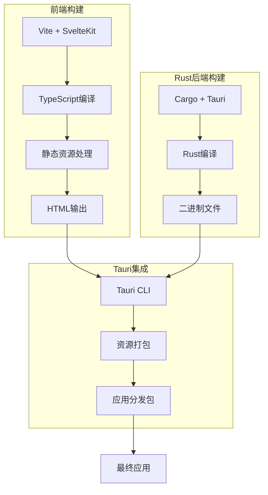
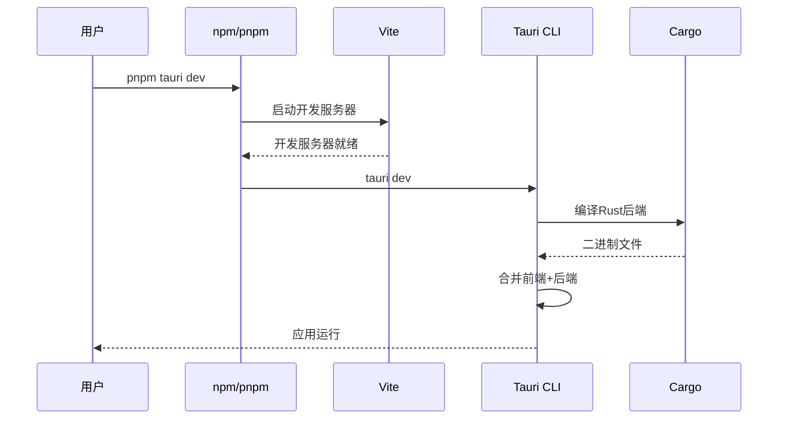
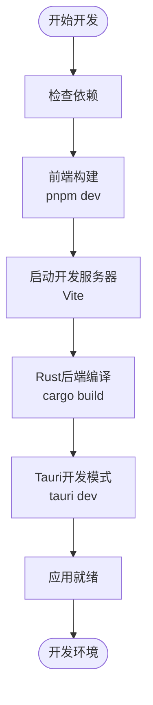
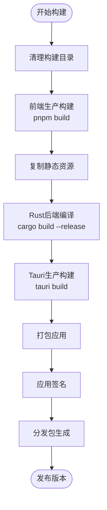

# Baize项目构建过程详解

<cite>
**本文档引用的文件**
- [package.json](file://package.json)
- [src-tauri/tauri.conf.json](file://src-tauri/tauri.conf.json)
- [src-tauri/Cargo.toml](file://src-tauri/Cargo.toml)
- [src-tauri/build.rs](file://src-tauri/build.rs)
- [src-tauri/src/main.rs](file://src-tauri/src/main.rs)
- [src-tauri/src/lib.rs](file://src-tauri/src/lib.rs)
- [vite.config.ts](file://vite.config.ts)
- [svelte.config.js](file://svelte.config.js)
- [plugins-sdk/package.json](file://plugins-sdk/package.json)
- [plugins-sdk/vite.config.ts](file://plugins-sdk/vite.config.ts)
- [README.md](file://README.md)
</cite>

## 目录
1. [项目概述](#项目概述)
2. [构建架构概览](#构建架构概览)
3. [前端构建配置](#前端构建配置)
4. [Rust后端构建配置](#rust后端构建配置)
5. [Tauri配置详解](#tauri配置详解)
6. [构建脚本分析](#构建脚本分析)
7. [开发模式vs生产模式](#开发模式vs生产模式)
8. [构建流程详解](#构建流程详解)
9. [常见构建错误及解决方案](#常见构建错误及解决方案)
10. [性能优化建议](#性能优化建议)
11. [总结](#总结)

## 项目概述

Baize是一个基于Tauri + SvelteKit + TypeScript技术栈构建的跨平台桌面应用程序。该项目采用现代化的前端框架与Rust后端相结合的方式，实现了高性能的桌面应用开发。

### 技术栈特点

- **Tauri**: 提供安全高效的桌面应用框架
- **SvelteKit**: 构建现代化Web界面
- **TypeScript**: 强类型支持，提升开发体验
- **Vite**: 快速构建工具链
- **Rust**: 高性能系统编程语言

**章节来源**
- [README.md](file://README.md#L1-L46)

## 构建架构概览

Baize项目采用了前后端分离的构建架构，通过多个配置文件协同工作，实现完整的构建流程。



**图表来源**
- [vite.config.ts](file://vite.config.ts#L1-L34)
- [src-tauri/Cargo.toml](file://src-tauri/Cargo.toml#L1-L71)
- [src-tauri/tauri.conf.json](file://src-tauri/tauri.conf.json#L1-L60)

## 前端构建配置

### Vite配置分析

前端构建主要通过Vite完成，配置文件位于`vite.config.ts`中：

```typescript
// 开发服务器配置
server: {
  port: 1420,
  strictPort: true,
  host: host || false,
  hmr: host ? { protocol: "ws", host, port: 1421 } : undefined,
  watch: {
    ignored: ["**/src-tauri/**"],
  },
}
```

### SvelteKit适配器配置

项目使用了静态适配器来构建SPA应用：

```javascript
adapter: adapter({
  fallback: "index.html",
}),
prerender: {
  entries: [],
}
```

**章节来源**
- [vite.config.ts](file://vite.config.ts#L1-L34)
- [svelte.config.js](file://svelte.config.js#L1-L29)

## Rust后端构建配置

### Cargo.toml配置

Rust后端的构建配置在`Cargo.toml`中定义：

```toml
[package]
name = "baize"
version = "0.1.0"
edition = "2021"

[lib]
name = "baize_lib"
crate-type = ["staticlib", "cdylib", "rlib"]

[dependencies]
tauri = { version = "2", features = ["macos-private-api", "tray-icon"] }
serde = { version = "1", features = ["derive"] }
tokio = { version = "1", features = ["macros", "rt-multi-thread", "sync", "fs"] }
```

### Build.rs配置

简单的构建脚本，调用Tauri的构建函数：

```rust
fn main() {
    tauri_build::build()
}
```

**章节来源**
- [src-tauri/Cargo.toml](file://src-tauri/Cargo.toml#L1-L71)
- [src-tauri/build.rs](file://src-tauri/build.rs#L1-L4)

## Tauri配置详解

### build部分配置

`tauri.conf.json`中的`build`配置是构建流程的核心：

```json
{
  "build": {
    "beforeDevCommand": "pnpm dev",
    "devUrl": "http://localhost:1420",
    "beforeBuildCommand": "pnpm build",
    "frontendDist": "../build"
  }
}
```

- **beforeDevCommand**: 开发模式前执行的命令
- **devUrl**: 开发服务器地址
- **beforeBuildCommand**: 生产构建前执行的命令
- **frontendDist**: 前端构建输出目录

### bundle部分配置

```json
{
  "bundle": {
    "active": true,
    "targets": "all",
    "icon": [
      "icons/32x32.png",
      "icons/128x128.png",
      "icons/icon.icns",
      "icons/icon.ico"
    ]
  }
}
```

### app部分配置

```json
{
  "app": {
    "windows": [{
      "width": 800,
      "height": 400,
      "transparent": true,
      "decorations": false
    }],
    "security": {
      "csp": "default-src 'self' plugin: 'unsafe-inline' 'unsafe-eval'"
    }
  }
}
```

**章节来源**
- [src-tauri/tauri.conf.json](file://src-tauri/tauri.conf.json#L1-L60)

## 构建脚本分析

### package.json脚本配置

```json
{
  "scripts": {
    "dev": "vite dev",
    "build": "vite build",
    "tauri": "tauri",
    "tauri dev": "tauri dev",
    "tauri build": "tauri build"
  }
}
```

### 脚本执行流程



**图表来源**
- [package.json](file://package.json#L1-L52)
- [src-tauri/tauri.conf.json](file://src-tauri/tauri.conf.json#L5-L8)

**章节来源**
- [package.json](file://package.json#L1-L52)

## 开发模式vs生产模式

### 开发模式特点

1. **热重载**: Vite提供实时重载功能
2. **调试信息**: 保留完整的源码映射
3. **开发服务器**: 本地HTTP服务器提供前端服务
4. **快速启动**: 不进行代码混淆和压缩

### 生产模式特点

1. **代码优化**: JavaScript/CSS压缩和混淆
2. **资源内联**: 静态资源内联到HTML中
3. **体积最小化**: 移除开发工具和调试代码
4. **性能优化**: 启用各种性能优化选项

### 模式差异对比

| 特性 | 开发模式 | 生产模式 |
|------|----------|----------|
| 启动速度 | 快 | 中等 |
| 应用大小 | 大 | 小 |
| 调试能力 | 强 | 弱 |
| 性能表现 | 中等 | 最佳 |

## 构建流程详解

### 开发模式构建流程



**图表来源**
- [src-tauri/tauri.conf.json](file://src-tauri/tauri.conf.json#L5-L8)
- [package.json](file://package.json#L6-L7)

### 生产模式构建流程



**图表来源**
- [src-tauri/tauri.conf.json](file://src-tauri/tauri.conf.json#L7-L8)
- [package.json](file://package.json#L7-L8)

**章节来源**
- [src-tauri/tauri.conf.json](file://src-tauri/tauri.conf.json#L5-L8)
- [package.json](file://package.json#L6-L8)

## 常见构建错误及解决方案

### 路径错误

**问题**: 前端构建路径与Tauri配置不匹配
**解决方案**:
1. 检查`frontendDist`配置是否正确
2. 确认前端构建输出目录存在
3. 验证相对路径设置

### 依赖缺失

**问题**: Rust依赖或Node.js依赖未安装
**解决方案**:
```bash
# 安装Node.js依赖
pnpm install

# 安装Rust依赖
cd src-tauri && cargo update

# 更新Tauri CLI
cargo install tauri-cli --locked
```

### 权限问题

**问题**: Windows/macOS/Linux特定权限错误
**解决方案**:
- Windows: 以管理员身份运行命令提示符
- macOS: 授予Xcode命令行工具权限
- Linux: 安装必要的构建工具

### 编译错误

**问题**: Rust编译失败
**解决方案**:
1. 检查Rust版本兼容性
2. 清理Cargo缓存: `cargo clean`
3. 更新依赖: `cargo update`

### 内存不足

**问题**: 大型项目编译内存不足
**解决方案**:
```bash
# 增加内存限制
export RUST_MIN_STACK=8388608

# 并行编译优化
export CARGO_BUILD_JOBS=2
```

## 性能优化建议

### 前端优化

1. **代码分割**: 使用动态导入减少初始加载时间
2. **资源压缩**: 启用CSS/JS压缩
3. **图片优化**: 使用WebP格式替代PNG/JPEG
4. **缓存策略**: 合理设置浏览器缓存

### 后端优化

1. **编译优化**: 使用`--release`标志
2. **链接时优化**: 启用LTO (`lto = true`)
3. **目标优化**: 针对特定CPU架构优化
4. **依赖精简**: 移除不必要的依赖

### 构建优化

1. **增量构建**: 利用Vite的热重载功能
2. **并行处理**: 同时构建前端和后端
3. **缓存利用**: 重用已编译的依赖
4. **CI/CD**: 在持续集成环境中优化构建流程

## 总结

Baize项目的构建过程体现了现代桌面应用开发的最佳实践。通过精心设计的配置文件和构建脚本，实现了高效的开发体验和高质量的生产构建。

### 关键要点

1. **配置驱动**: 通过JSON和TOML配置文件精确控制构建过程
2. **模块化设计**: 前后端分离，各司其职
3. **开发友好**: 提供完善的开发工具链
4. **生产就绪**: 支持多平台应用分发

### 最佳实践

1. **保持配置同步**: 确保前端和后端配置的一致性
2. **定期更新依赖**: 保持工具链的最新状态
3. **监控构建性能**: 及时发现和解决性能瓶颈
4. **文档维护**: 保持构建文档的及时更新

通过深入理解这些构建机制，开发者可以更好地掌控应用的构建流程，提高开发效率，并确保最终产品的质量。