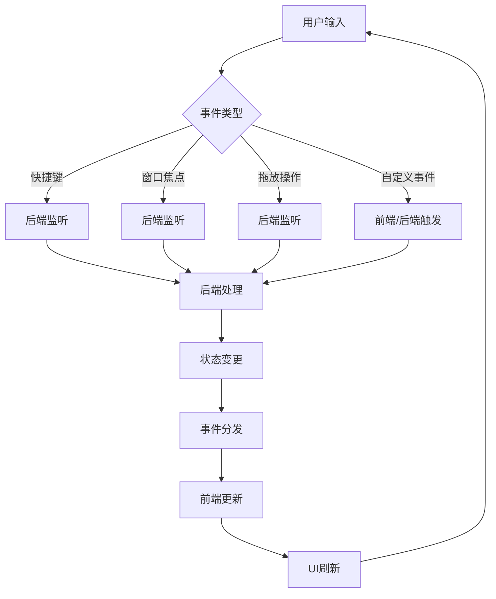
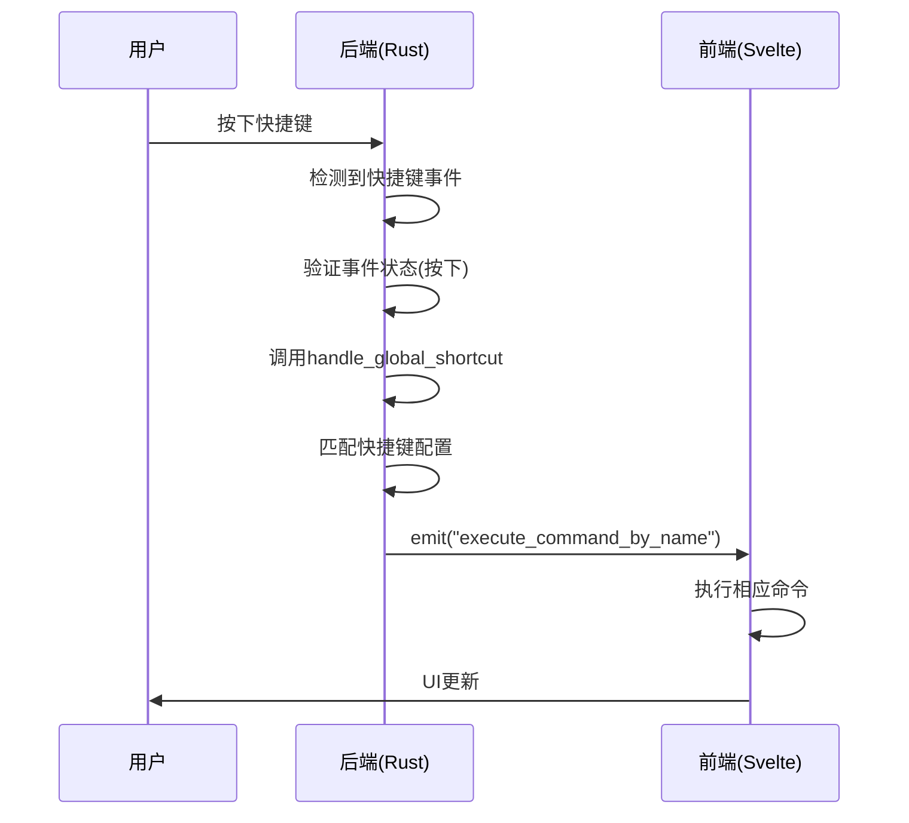
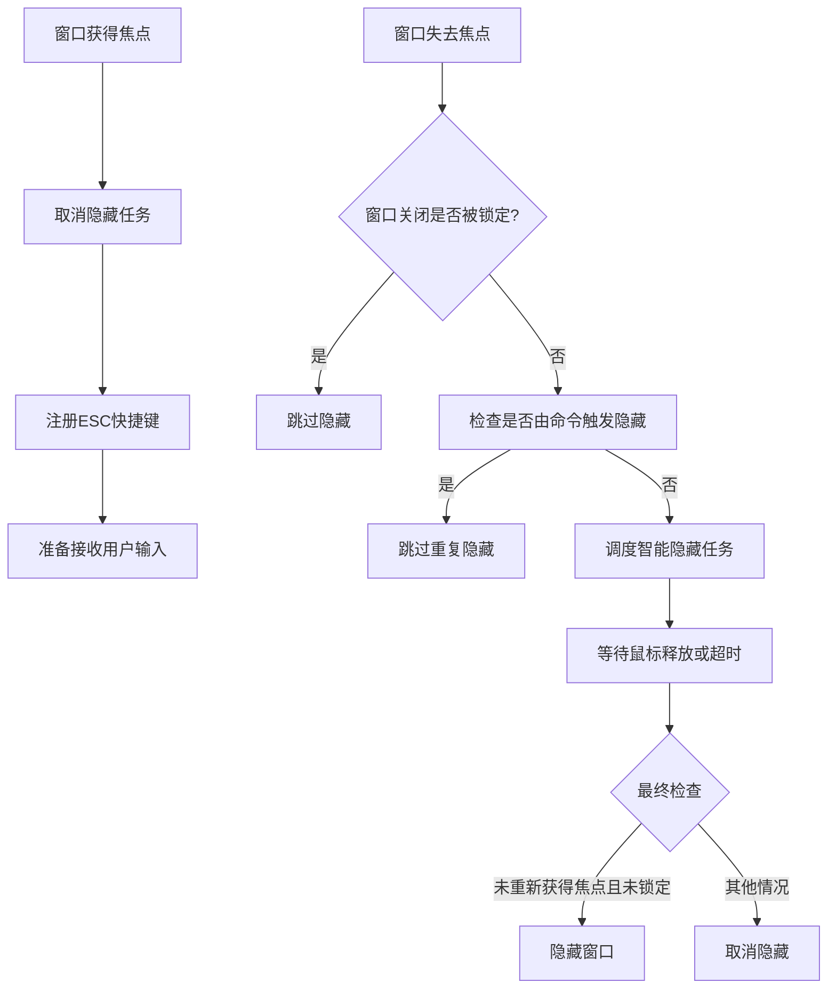
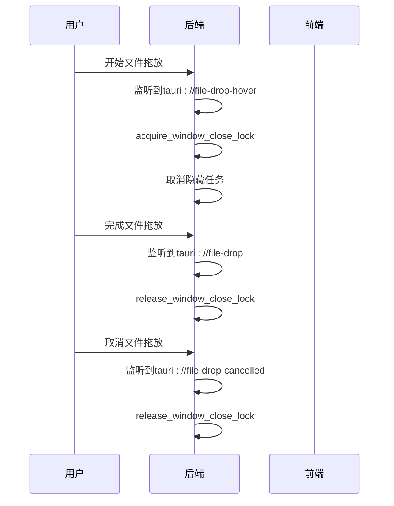
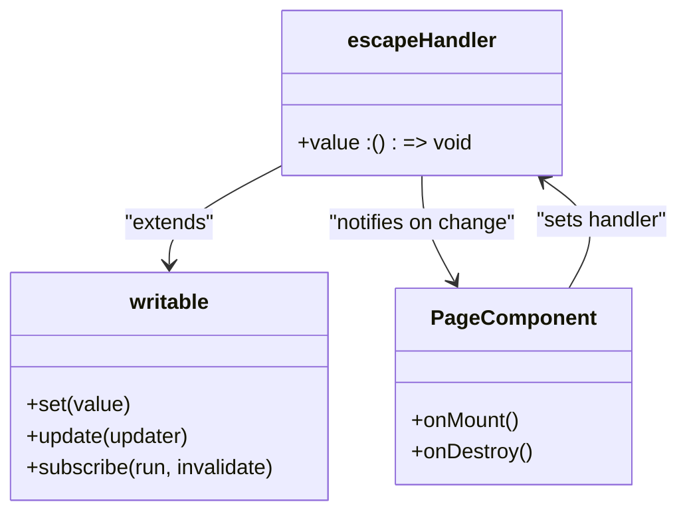
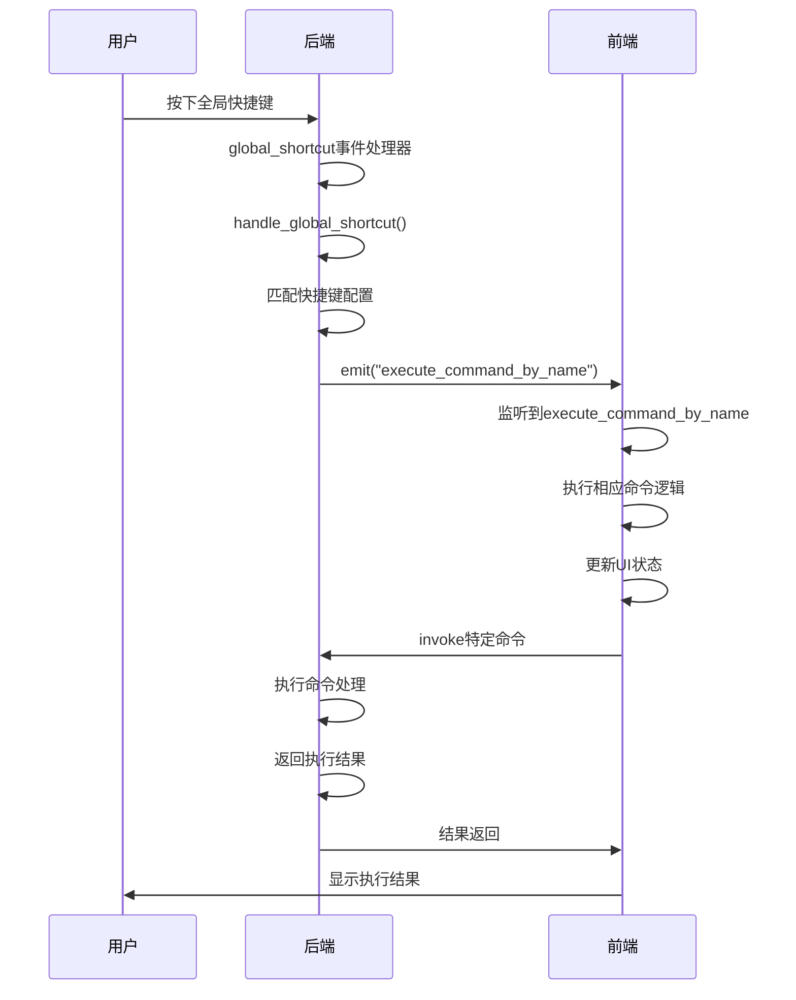
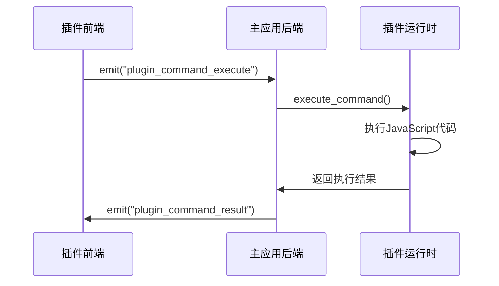
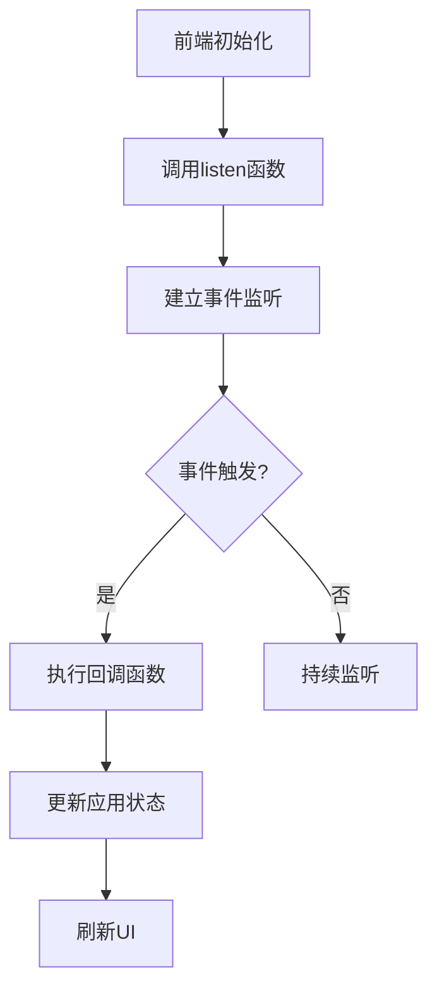

# 事件与状态管理

<cite>
**本文档中引用的文件**  
- [main.rs](file://src-tauri/src/main.rs)
- [lib.rs](file://src-tauri/src/lib.rs)
- [window_manager.rs](file://src-tauri/src/window_manager.rs)
- [shortcut_manager.rs](file://src-tauri/src/shortcut_manager.rs)
- [ipc.ts](file://plugins-sdk/src/core/ipc.ts)
- [command.ts](file://plugins-sdk/src/api/command.ts)
- [escapeHandler.ts](file://src/lib/stores/escapeHandler.ts)
- [plugin_console.ts](file://src/lib/plugin-console.ts)
</cite>

## 目录
1. [简介](#简介)
2. [事件驱动架构概览](#事件驱动架构概览)
3. [后端事件处理机制](#后端事件处理机制)
4. [前端状态管理](#前端状态管理)
5. [全局状态注入与管理](#全局状态注入与管理)
6. [用户工作流示例](#用户工作流示例)
7. [自定义IPC事件通信](#自定义ipc事件通信)
8. [结论](#结论)

## 简介
Baize应用采用事件驱动架构实现前后端的高效通信与状态同步。本文档深入分析其事件处理机制，包括全局快捷键、窗口焦点、拖放事件和自定义IPC事件的处理流程。文档详细阐述Rust后端如何使用Tauri框架的事件系统进行事件监听与分发，以及前端如何通过Svelte stores进行状态管理。同时，文档解析了全局状态的注入机制和完整的用户交互工作流。

## 事件驱动架构概览
Baize应用的事件驱动架构基于Tauri框架构建，实现了前后端之间的实时双向通信。该架构的核心组件包括：
- **事件监听器**：后端监听系统级事件（如快捷键、窗口焦点变化）
- **事件分发器**：后端向前端发送状态变更事件
- **状态管理器**：前端响应事件并更新应用状态
- **IPC通道**：前后端通信的桥梁

该架构确保了用户交互的实时响应性和应用状态的一致性。



**图示来源**  
- [lib.rs](file://src-tauri/src/lib.rs#L103-L129)
- [window_manager.rs](file://src-tauri/src/window_manager.rs#L0-L37)
- [shortcut_manager.rs](file://src-tauri/src/shortcut_manager.rs#L0-L382)

## 后端事件处理机制
Baize应用的后端事件处理机制基于Tauri框架的事件系统，实现了对多种系统事件的监听和响应。

### 全局快捷键事件处理
后端通过`tauri_plugin_global_shortcut`插件处理全局快捷键事件。在`lib.rs`中，应用注册了快捷键处理器：



**图示来源**  
- [lib.rs](file://src-tauri/src/lib.rs#L103-L129)
- [shortcut_manager.rs](file://src-tauri/src/shortcut_manager.rs#L300-L306)

### 窗口焦点事件处理
窗口焦点事件的处理在`window_manager.rs`中实现，通过`setup_window_events`函数注册窗口事件监听器：



**图示来源**  
- [window_manager.rs](file://src-tauri/src/window_manager.rs#L120-L221)

### 拖放事件处理
拖放事件处理机制确保在文件拖放操作期间窗口不会意外关闭：



**图示来源**  
- [window_manager.rs](file://src-tauri/src/window_manager.rs#L92-L122)

**本节来源**  
- [window_manager.rs](file://src-tauri/src/window_manager.rs#L0-L223)
- [lib.rs](file://src-tauri/src/lib.rs#L103-L129)

## 前端状态管理
Baize应用的前端状态管理采用Svelte stores模式，实现了响应式状态更新。

### ESC键处理器管理
`escapeHandler.ts`文件定义了专门用于管理ESC键处理器的状态存储：



**图示来源**  
- [escapeHandler.ts](file://src/lib/stores/escapeHandler.ts#L0-L8)

### 状态管理实现细节
前端状态管理的关键特性包括：

1. **可写存储**：使用Svelte的`writable`函数创建可变状态
2. **默认处理器**：初始化为无操作函数，确保安全调用
3. **页面级覆盖**：各页面可在挂载时设置自己的处理器
4. **自动清理**：页面销毁时自动恢复默认处理器

这种设计模式实现了状态的集中管理和页面的灵活定制。

**本节来源**  
- [escapeHandler.ts](file://src/lib/stores/escapeHandler.ts#L0-L8)

## 全局状态注入与管理
Baize应用通过Tauri的`manage()`机制将全局状态注入应用上下文，实现跨命令的状态共享。

### 状态类型定义
后端定义了多种全局状态结构体：

```mermaid
classDiagram
class WindowState {
+hiding_initiated_by_command : AtomicBool
}
class WindowCloseLockState {
+0 : AtomicU32
}
class HideTaskState {
+handle : Mutex<Option<JoinHandle<()>>>
}
class ShortcutState {
+shortcuts : Mutex<Vec<Shortcut>>
}
class TrayVisibilityState {
+0 : Mutex<bool>
}
class PluginStore {
+0 : Default : : default()
}
class CommandExecutionStore {
+0 : Default : : default()
}
class PluginLoadedState {
+0 : Default : : default()
}
```

**图示来源**  
- [window_manager.rs](file://src-tauri/src/window_manager.rs#L0-L37)
- [shortcut_manager.rs](file://src-tauri/src/shortcut_manager.rs#L0-L382)
- [lib.rs](file://src-tauri/src/lib.rs#L0-L199)

### 状态注入流程
在`lib.rs`的`run()`函数中，应用通过链式调用`manage()`方法注入全局状态：

```mermaid
flowchart TD
A[应用启动] --> B[创建状态实例]
B --> C[调用manage()注入]
C --> D[状态注册到应用上下文]
D --> E[所有命令可访问状态]
E --> F[通过State参数获取]
```

关键注入代码示例：
- `manage(window_manager::WindowState {...})`
- `manage(window_manager::WindowCloseLockState(...))`
- `manage(tray_manager::TrayVisibilityState(...))`
- `manage(shortcut_manager::ShortcutState {...})`

这种机制确保了状态的全局可用性和线程安全性。

**本节来源**  
- [lib.rs](file://src-tauri/src/lib.rs#L130-L180)

## 用户工作流示例
以下是一个完整的用户工作流示例，展示从快捷键触发到命令执行的全过程。

### 工作流步骤
1. **快捷键触发**：用户按下预设的全局快捷键
2. **事件监听**：后端监听到快捷键事件
3. **事件分发**：后端向前端分发执行命令事件
4. **状态更新**：前端更新应用状态并执行相应操作
5. **结果反馈**：操作结果反馈给用户



### 详细执行流程
以ESC快捷键关闭窗口为例：

1. **快捷键注册**：当主窗口获得焦点时，注册ESC快捷键
2. **事件触发**：用户按下ESC键，触发全局快捷键事件
3. **事件处理**：后端快捷键处理器被调用
4. **状态变更**：设置`hiding_initiated_by_command`标志
5. **窗口隐藏**：调用`window.hide()`隐藏窗口
6. **事件分发**：发送`window_visibility`事件通知前端
7. **UI更新**：前端根据新状态更新界面

此工作流展示了事件与状态的紧密联动，确保了用户操作的流畅性和一致性。

**本节来源**  
- [lib.rs](file://src-tauri/src/lib.rs#L103-L129)
- [window_manager.rs](file://src-tauri/src/window_manager.rs#L32-L68)
- [shortcut_manager.rs](file://src-tauri/src/shortcut_manager.rs#L300-L306)

## 自定义IPC事件通信
Baize应用实现了丰富的自定义IPC事件通信机制，支持前后端的灵活交互。

### 插件命令通信
插件系统通过自定义IPC事件实现命令执行：



**图示来源**  
- [plugin_api/command.rs](file://src-tauri/src/plugin_api/command.rs#L132)
- [ipc.ts](file://plugins-sdk/src/core/ipc.ts#L35-L77)

### 事件监听实现
前端通过`@tauri-apps/api/event`提供的`listen`函数监听自定义事件：



示例代码：
- `listen('plugin_console_log', handler)` - 监听插件控制台输出
- `listen('esc_key_pressed', handler)` - 监听ESC键按下事件

这种机制实现了前后端的松耦合通信，提高了系统的可维护性和扩展性。

**本节来源**  
- [plugin_console.ts](file://src/lib/plugin-console.ts#L0-L8)
- [ipc.ts](file://plugins-sdk/src/core/ipc.ts#L76-L97)
- [command.ts](file://plugins-sdk/src/api/command.ts#L0-L48)

## 结论
Baize应用的事件驱动架构和状态管理机制设计精巧，实现了高效、可靠的前后端通信。通过Tauri框架的事件系统，应用能够响应各种系统级事件，并通过自定义IPC事件实现复杂的业务逻辑。全局状态的注入机制确保了状态的一致性和可访问性，而前端的Svelte stores模式提供了灵活的状态管理方案。整个架构体现了事件与状态的紧密联动，为用户提供流畅的交互体验。这种设计模式不仅满足了当前需求，也为未来的功能扩展提供了良好的基础。