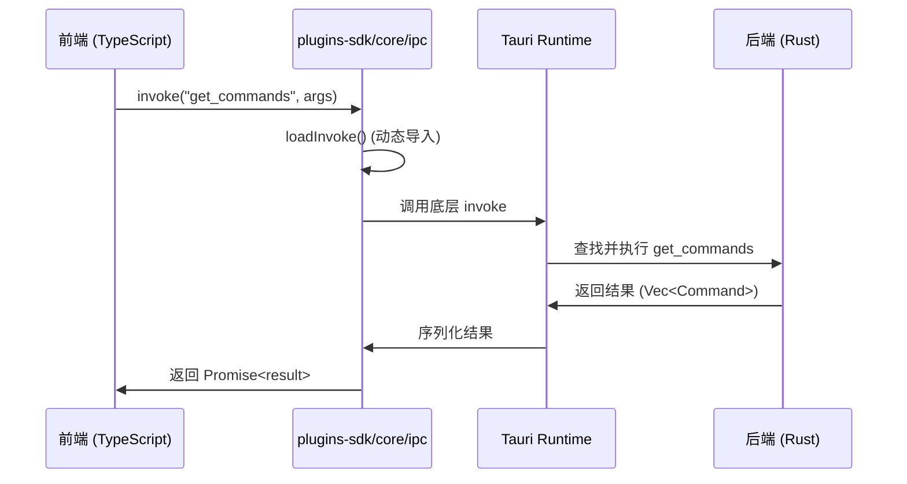
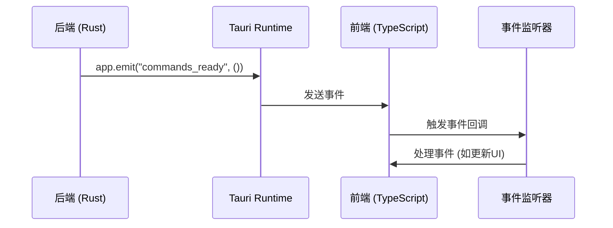
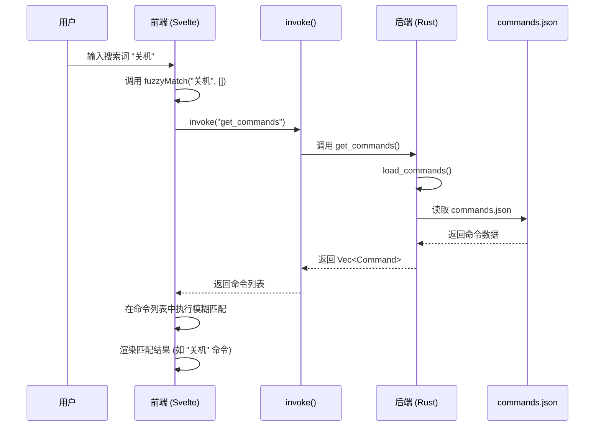

# 前后端通信模型

<cite>
**本文档中引用的文件**  
- [tauri.conf.json](file://src-tauri/tauri.conf.json)
- [lib.rs](file://src-tauri/src/lib.rs)
- [command_manager.rs](file://src-tauri/src/command_manager.rs)
- [system_commands.rs](file://src-tauri/src/system_commands.rs)
- [shared_types.rs](file://src-tauri/src/shared_types.rs)
- [fuzzyMatch.ts](file://src/lib/utils/fuzzyMatch.ts)
- [ipc.ts](file://plugins-sdk/src/core/ipc.ts)
- [command.ts](file://plugins-sdk/src/api/command.ts)
- [js_runtime.rs](file://src-tauri/src/js_runtime.rs)
- [request.rs](file://src-tauri/src/plugin_api/request.rs)
</cite>

## 目录
1. [引言](#引言)
2. [项目结构与通信架构](#项目结构与通信架构)
3. [Tauri IPC 机制概述](#tauri-ipc-机制概述)
4. [前端调用后端：invoke() 机制](#前端调用后端invoke-机制)
5. [后端事件推送：emit() 与事件监听](#后端事件推送emit-与事件监听)
6. [Rust 后端命令注册与处理](#rust-后端命令注册与处理)
7. [安全配置：tauri.conf.json 中的 allowlist 与 CSP](#安全配置tauriconfjson-中的-allowlist-与-csp)
8. [搜索请求的完整通信流程](#搜索请求的完整通信流程)
9. [序列化与性能分析](#序列化与性能分析)
10. [插件系统的 IPC 扩展机制](#插件系统的-ipc-扩展机制)
11. [结论](#结论)

## 引言
Baize 是一个基于 Tauri 框架构建的桌面应用程序，采用 SvelteKit 作为前端框架，Rust 作为后端语言。本项目的核心通信模型依赖于 Tauri 提供的进程间通信（IPC）机制，实现前端与后端的安全、高效交互。本文档将深入分析 Baize 应用中前后端的通信模型，重点阐述 `invoke()` 和 `emit()` 函数的工作原理、Rust 后端命令的注册与处理流程、安全配置策略，以及一个典型搜索请求的完整通信路径。

## 项目结构与通信架构
Baize 项目的目录结构清晰地划分了前端、后端和插件系统。前端代码位于 `src` 目录，使用 SvelteKit 构建；后端 Rust 代码位于 `src-tauri/src` 目录；插件 SDK 位于 `plugins-sdk` 目录，为第三方插件提供统一的 API 接口。

```mermaid
graph TB
subgraph "前端 (SvelteKit)"
A[Webview]
B[TypeScript]
C[@tauri-apps/api]
D[plugins-sdk]
end
subgraph "后端 (Rust)"
E[Tauri Runtime]
F[Rust 模块]
G[command_manager]
H[system_commands]
I[plugin_manager]
J[js_runtime]
end
A --> C:invoke/emit
C --> E:IPC
D --> C:封装
E --> F:命令处理
F --> G:命令管理
F --> H:系统命令
F --> I:插件管理
I --> J:插件运行时
```

**Diagram sources**
- [src](file://src)
- [src-tauri](file://src-tauri)
- [plugins-sdk](file://plugins-sdk)

**Section sources**
- [src](file://src)
- [src-tauri](file://src-tauri)
- [plugins-sdk](file://plugins-sdk)

## Tauri IPC 机制概述
Tauri 的 IPC 机制是其核心功能之一，它允许前端的 JavaScript/TypeScript 代码安全地调用后端的 Rust 函数，并接收异步响应。这种通信基于命令（Command）模式，前端通过 `invoke()` 发起调用，后端通过 `#[tauri::command]` 宏注册的函数进行处理，处理结果再通过 IPC 通道返回前端。同时，后端也可以通过 `emit()` 主动向前端发送事件，实现反向通信。

## 前端调用后端：invoke() 机制
在 Baize 应用中，前端通过 `@tauri-apps/api` 包中的 `invoke()` 函数与后端进行通信。`plugins-sdk` 库对这一机制进行了封装，提供了更高级的抽象。



**Diagram sources**
- [ipc.ts](file://plugins-sdk/src/core/ipc.ts)
- [lib.rs](file://src-tauri/src/lib.rs)

**Section sources**
- [ipc.ts](file://plugins-sdk/src/core/ipc.ts)

### invoke() 的实现细节
`plugins-sdk/src/core/ipc.ts` 文件中的 `invoke()` 函数是前端调用的入口。它首先通过 `loadInvoke()` 动态加载 `@tauri-apps/api/core` 中的 `invoke` 函数，并进行缓存以提高性能。该函数还支持在 "headless" 环境下使用 Deno 的 `Deno.core.ops.op_invoke` 进行调用，体现了其灵活性。

## 后端事件推送：emit() 与事件监听
除了前端主动调用，后端也可以主动向前端推送事件。Tauri 提供了 `emit()` 方法，允许后端在特定事件发生时通知前端。



**Diagram sources**
- [lib.rs](file://src-tauri/src/lib.rs)
- [command_manager.rs](file://src-tauri/src/command_manager.rs)

**Section sources**
- [lib.rs](file://src-tauri/src/lib.rs)
- [command_manager.rs](file://src-tauri/src/command_manager.rs)

### 事件的典型应用场景
在 `command_manager.rs` 的 `init` 函数中，当命令加载完成后，后端会调用 `app.emit("commands_ready", ())` 通知前端命令已准备就绪。前端可以监听此事件，在收到通知后更新用户界面，展示可用的命令列表。

## Rust 后端命令注册与处理
Rust 后端是 IPC 通信的处理中心。所有可被前端调用的函数都必须使用 `#[tauri::command]` 宏进行标记，并在 `lib.rs` 的 `invoke_handler` 中注册。

### 命令注册
在 `src-tauri/src/lib.rs` 文件中，`run()` 函数通过 `tauri::generate_handler!` 宏将所有标记为 `#[tauri::command]` 的函数注册到 Tauri 的调用处理器中。例如，`get_commands`、`execute_command` 和 `plugin_request` 等函数都被注册，使得前端可以通过 `invoke("get_commands")` 等方式调用它们。

**Section sources**
- [lib.rs](file://src-tauri/src/lib.rs)

### 命令处理流程
以 `get_commands` 命令为例，其处理流程如下：
1.  前端调用 `await invoke('get_commands')`。
2.  Tauri Runtime 将调用路由到 Rust 后端。
3.  后端执行 `command_manager::get_commands` 函数。
4.  该函数调用 `load_commands` 从 `commands.json` 文件中加载或生成命令列表。
5.  将 `Vec<Command>` 结构体序列化为 JSON。
6.  通过 IPC 通道将 JSON 结果返回给前端。

```mermaid
flowchart TD
A[前端 invoke("get_commands")] --> B[Tauri Runtime]
B --> C{查找命令处理器}
C --> |找到| D[执行 command_manager::get_commands]
D --> E[调用 load_commands]
E --> F{文件是否存在?}
F --> |否| G[生成默认命令并保存]
F --> |是| H[读取并解析 commands.json]
H --> I[合并系统命令和插件命令]
I --> J[返回 Vec<Command>]
J --> K[序列化为 JSON]
K --> L[通过 IPC 返回前端]
```

**Diagram sources**
- [command_manager.rs](file://src-tauri/src/command_manager.rs)
- [lib.rs](file://src-tauri/src/lib.rs)

**Section sources**
- [command_manager.rs](file://src-tauri/src/command_manager.rs)

## 安全配置：tauri.conf.json 中的 allowlist 与 CSP
Tauri 非常重视安全性，通过 `tauri.conf.json` 文件中的配置来严格控制 IPC 通信的权限。

### Security 配置
`tauri.conf.json` 文件中的 `security` 部分定义了内容安全策略（CSP）。Baize 应用的 CSP 配置为：
```json
"csp": "default-src 'self' plugin: 'unsafe-inline' 'unsafe-eval'; ..."
```
此策略限制了应用只能加载自身域（'self'）和插件域（plugin:）的资源，并允许内联脚本（'unsafe-inline'）和内联执行（'unsafe-eval'），这对于 SvelteKit 的运行是必要的，但也需要开发者格外注意 XSS 攻击的风险。

### Allowlist (功能白名单)
虽然 `tauri.conf.json` 中没有显式列出 `allowlist`，但 Tauri 的插件系统本身就是一种白名单机制。例如，`plugins` 部分明确启用了 `globalShortcut` 插件，这意味着只有该插件提供的命令（如 `add_shortcut`, `remove_shortcut`）才能被调用。任何未在 `invoke_handler` 中注册的命令，即使被前端调用，也会被 Tauri Runtime 拒绝。

**Section sources**
- [tauri.conf.json](file://src-tauri/tauri.conf.json)

## 搜索请求的完整通信流程
让我们以一个典型的用户搜索请求为例，追踪其完整的 IPC 通信流程。

1.  **用户输入**: 用户在前端搜索框中输入关键词。
2.  **前端处理**: 前端调用 `fuzzyMatch.ts` 中的 `fuzzyMatch` 函数。
3.  **数据获取**: `fuzzyMatch` 函数需要完整的命令列表来进行匹配，因此它首先通过 `invoke("get_commands")` 从后端获取所有命令。
4.  **模糊匹配**: 前端使用获取到的命令列表和用户输入的关键词，执行模糊匹配算法（包括拼音匹配、首字母匹配等）。
5.  **结果渲染**: 将匹配结果渲染到用户界面。



**Diagram sources**
- [fuzzyMatch.ts](file://src/lib/utils/fuzzyMatch.ts)
- [command_manager.rs](file://src-tauri/src/command_manager.rs)

**Section sources**
- [fuzzyMatch.ts](file://src/lib/utils/fuzzyMatch.ts)
- [command_manager.rs](file://src-tauri/src/command_manager.rs)

## 序列化与性能分析
### 序列化过程
整个 IPC 通信的核心是序列化。当数据在前端（JavaScript）和后端（Rust）之间传递时，必须进行序列化和反序列化。
-   **前端 -> 后端**: 前端的 JavaScript 对象被 `JSON.stringify` 序列化为 JSON 字符串，通过 IPC 传递给 Rust。Rust 端使用 `serde_json` 库将其反序列化为对应的结构体（如 `RequestOptions`）。
-   **后端 -> 前端**: Rust 端的结构体（如 `Vec<Command>`）被 `serde_json` 序列化为 JSON 字符串，通过 IPC 传回前端。前端使用 `JSON.parse` 将其反序列化为 JavaScript 对象。

**Section sources**
- [shared_types.rs](file://src-tauri/src/shared_types.rs)
- [request.rs](file://src-tauri/src/plugin_api/request.rs)

### 性能瓶颈
潜在的性能瓶颈主要存在于：
1.  **序列化开销**: 对于大型数据结构（如包含数千个应用的 `Vec<Command>`），序列化和反序列化过程会消耗 CPU 资源。
2.  **文件 I/O**: `get_commands` 在首次调用时需要读取和解析 `commands.json` 文件，磁盘 I/O 可能成为瓶颈。
3.  **网络请求**: `plugin_request` 命令涉及网络 I/O，其性能受网络延迟和带宽影响。

## 插件系统的 IPC 扩展机制
Baize 应用的插件系统是其 IPC 机制的高级应用。它允许第三方插件通过 IPC 与主应用交互。

```mermaid
classDiagram
class PluginCommand {
+name : String
+label : String
+description : String
+keywords : Vec~String~
+plugin_id : String
}
class CommandHandler {
<<function>>
(command : string, args : any) => any
}
class registerCommandHandler {
<<function>>
(handler : CommandHandler) => Promise~void~
}
class js_runtime {
+handle_execute_command()
+op_invoke()
}
PluginCommand --> js_runtime : 被执行
CommandHandler --> registerCommandHandler : 作为参数
registerCommandHandler --> js_runtime : 通过事件通信
```

**Diagram sources**
- [command.ts](file://plugins-sdk/src/api/command.ts)
- [js_runtime.rs](file://src-tauri/src/js_runtime.rs)
- [shared_types.rs](file://src-tauri/src/shared_types.rs)

**Section sources**
- [command.ts](file://plugins-sdk/src/api/command.ts)
- [js_runtime.rs](file://src-tauri/src/js_runtime.rs)

### 工作流程
