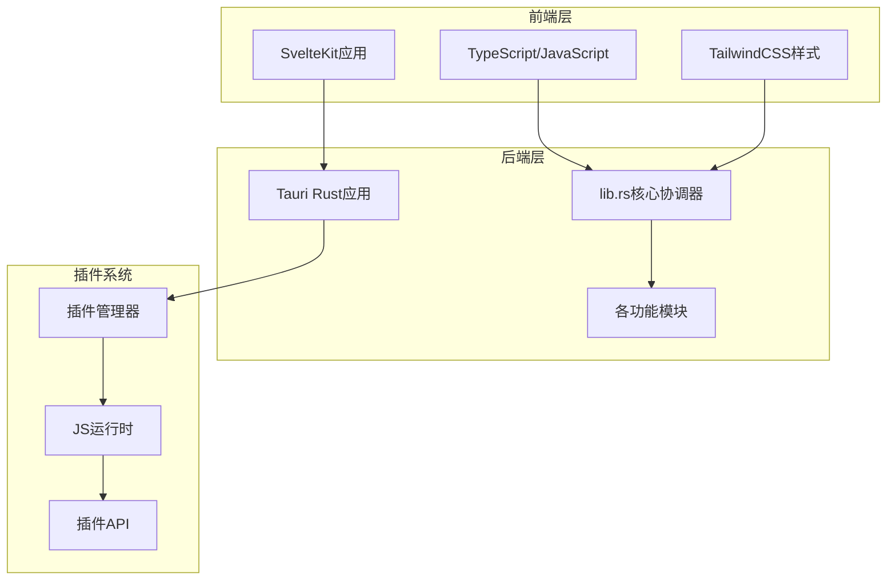
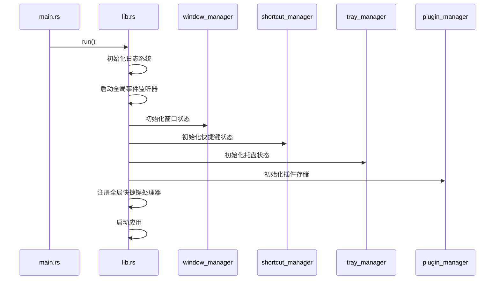
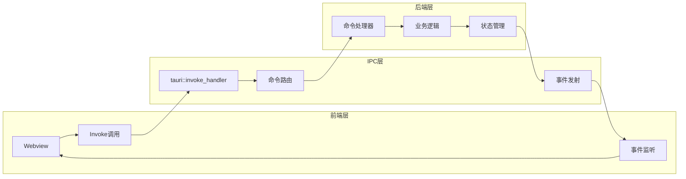
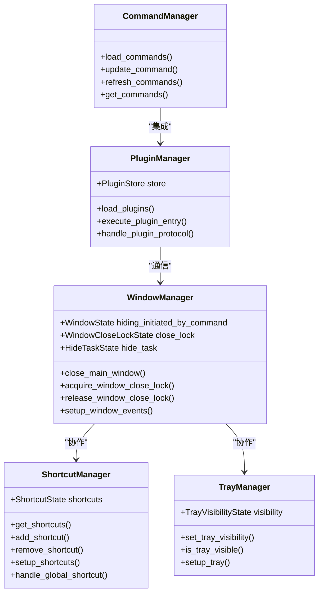
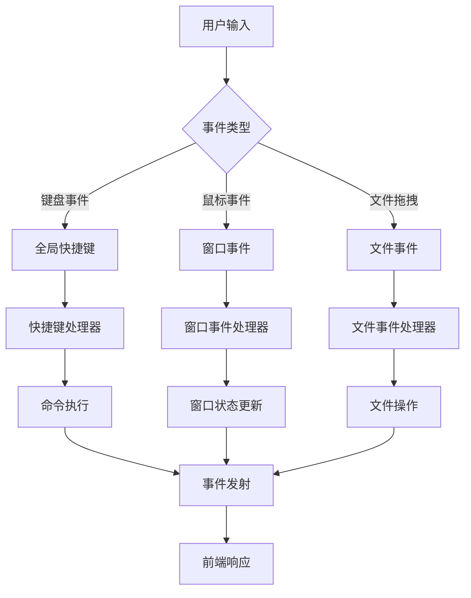
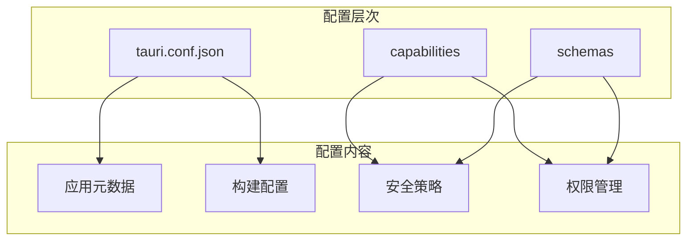
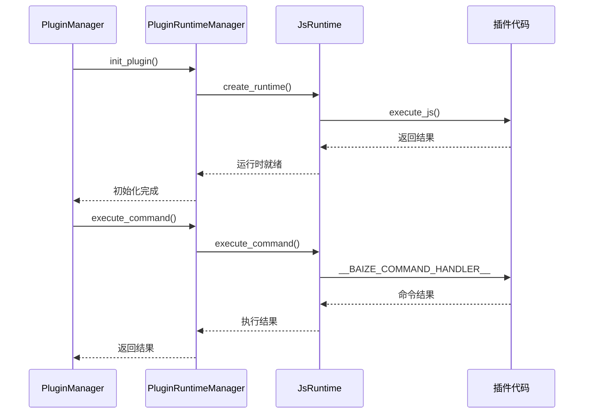
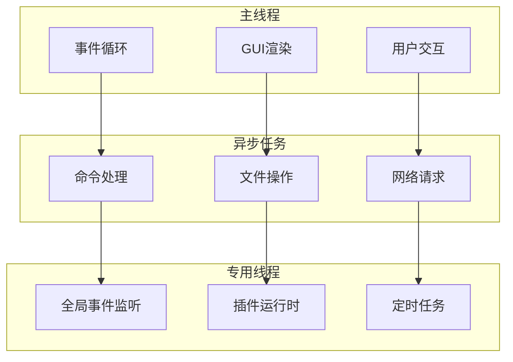

# Baize应用架构设计深度文档

<cite>
**本文档引用的文件**
- [package.json](file://package.json)
- [src-tauri/Cargo.toml](file://src-tauri/Cargo.toml)
- [src-tauri/tauri.conf.json](file://src-tauri/tauri.conf.json)
- [src-tauri/src/lib.rs](file://src-tauri/src/lib.rs)
- [src-tauri/src/main.rs](file://src-tauri/src/main.rs)
- [src-tauri/src/window_manager.rs](file://src-tauri/src/window_manager.rs)
- [src-tauri/src/shortcut_manager.rs](file://src-tauri/src/shortcut_manager.rs)
- [src-tauri/src/tray_manager.rs](file://src-tauri/src/tray_manager.rs)
- [src-tauri/src/command_manager.rs](file://src-tauri/src/command_manager.rs)
- [src-tauri/src/plugin_manager.rs](file://src-tauri/src/plugin_manager.rs)
- [src-tauri/src/js_runtime.rs](file://src-tauri/src/js_runtime.rs)
</cite>

## 目录
1. [简介](#简介)
2. [项目结构概览](#项目结构概览)
3. [前后端分离架构](#前后端分离架构)
4. [核心协调者：lib.rs](#核心协调者librs)
5. [IPC通信机制](#ipc通信机制)
6. [模块化管理](#模块化管理)
7. [事件驱动模型](#事件驱动模型)
8. [配置系统](#配置系统)
9. [插件系统架构](#插件系统架构)
10. [性能优化策略](#性能优化策略)
11. [故障排除指南](#故障排除指南)
12. [总结](#总结)

## 简介

Baize是一个基于Tauri框架构建的现代化桌面应用程序，采用前后端分离的架构设计。该应用的核心特点在于其强大的插件系统、智能的窗口管理和高效的IPC（进程间通信）机制。本文档将深入分析Baize的应用架构设计，重点阐述其核心组件的实现原理和相互关系。

## 项目结构概览

Baize项目采用了清晰的分层架构，主要分为前端和后端两个部分：



**图表来源**
- [src-tauri/src/lib.rs](file://src-tauri/src/lib.rs#L1-L50)
- [src-tauri/src/main.rs](file://src-tauri/src/main.rs#L1-L7)

**章节来源**
- [package.json](file://package.json#L1-L52)
- [src-tauri/Cargo.toml](file://src-tauri/Cargo.toml#L1-L71)

## 前后端分离架构

### 前端技术栈

前端基于SvelteKit构建，提供了现代化的用户界面和交互体验：

- **SvelteKit**: 基于Svelte的全栈框架，提供快速的响应式UI
- **TypeScript**: 类型安全的JavaScript超集
- **TailwindCSS**: 实用优先的CSS框架
- **Vite**: 现代化的构建工具

### 后端技术栈

后端采用Rust语言和Tauri框架，确保高性能和安全性：

- **Rust**: 系统级编程语言，提供内存安全和并发保证
- **Tauri**: 跨平台桌面应用框架
- **Tokio**: 异步运行时，支持并发处理
- **Serde**: 序列化/反序列化库

### 架构优势

这种前后端分离的设计带来了以下优势：

1. **开发效率**: 前端专注于UI和用户体验，后端专注于业务逻辑
2. **性能优化**: Rust后端提供高性能的数据处理能力
3. **安全性**: 前后端隔离，减少安全漏洞风险
4. **可维护性**: 清晰的职责分离，便于代码维护和扩展

## 核心协调者：lib.rs

`lib.rs`是整个应用的核心协调者，负责初始化和管理所有子模块。它采用了模块化的设计理念，将不同的功能职责分配给专门的模块。

### 初始化流程



**图表来源**
- [src-tauri/src/lib.rs](file://src-tauri/src/lib.rs#L30-L100)
- [src-tauri/src/window_manager.rs](file://src-tauri/src/window_manager.rs#L1-L50)

### 核心模块管理

lib.rs通过`.manage()`方法管理各种状态和组件：

```rust
// 窗口管理状态
.manage(window_manager::WindowState {
    hiding_initiated_by_command: AtomicBool::new(false),
})
// 窗口关闭锁状态
.manage(window_manager::WindowCloseLockState(AtomicU32::new(0)))
// 托盘可见性状态
.manage(tray_manager::TrayVisibilityState(Mutex::new(is_tray_initially_visible)))
// 快捷键状态
.manage(shortcut_manager::ShortcutState {
    shortcuts: Mutex::new(vec![]),
})
```

### 全局事件监听器

应用启动时会创建一个全局的广播通道，用于监听系统级别的输入事件：

```rust
// 创建全局的广播通道
pub static RDEV_EVENT_CHANNEL: Lazy<(
    broadcast::Sender<rdev::Event>,
    broadcast::Receiver<rdev::Event>,
)> = Lazy::new(|| broadcast::channel(128));
```

这个设计确保了只有一个系统监听线程，避免了重复创建导致的性能问题。

**章节来源**
- [src-tauri/src/lib.rs](file://src-tauri/src/lib.rs#L1-L235)

## IPC通信机制

Baize应用采用Tauri提供的IPC机制实现前后端通信。这种机制允许前端通过`invoke()`调用后端命令，后端通过`emit()`向前端发送事件。

### IPC架构设计



**图表来源**
- [src-tauri/src/lib.rs](file://src-tauri/src/lib.rs#L120-L180)

### 命令注册机制

所有后端命令都在`lib.rs`中统一注册：

```rust
.invoke_handler(tauri::generate_handler![
    greet,
    unified_launch_manager::get_all_launchable_items,
    window_manager::acquire_window_close_lock,
    window_manager::release_window_close_lock,
    window_manager::close_main_window,
    tray_manager::set_tray_visibility,
    tray_manager::is_tray_visible,
    shortcut_manager::get_shortcuts,
    shortcut_manager::add_shortcut,
    shortcut_manager::remove_shortcut,
    // ... 更多命令
])
```

### 前端调用示例

前端可以通过以下方式调用后端命令：

```javascript
import { invoke } from '@tauri-apps/api';

// 调用窗口关闭命令
await invoke('close_main_window');

// 调用快捷键管理命令
const shortcuts = await invoke('get_shortcuts');
```

### 事件发射机制

后端可以向前端发射事件，通知状态变化：

```rust
// 发射窗口可见性事件
window.emit("window_visibility", &false).unwrap_or_default();

// 发射插件控制台日志事件
window.emit("plugin_console_log", log_message).unwrap_or_default();
```

**章节来源**
- [src-tauri/src/lib.rs](file://src-tauri/src/lib.rs#L120-L200)

## 模块化管理

Baize采用了高度模块化的架构设计，每个功能模块都有明确的职责和接口。

### 核心模块架构



**图表来源**
- [src-tauri/src/window_manager.rs](file://src-tauri/src/window_manager.rs#L1-L30)
- [src-tauri/src/shortcut_manager.rs](file://src-tauri/src/shortcut_manager.rs#L1-L30)
- [src-tauri/src/tray_manager.rs](file://src-tauri/src/tray_manager.rs#L1-L30)

### 状态管理模式

每个模块都通过状态结构体管理内部状态：

```rust
// 窗口状态结构
pub struct WindowState {
    pub hiding_initiated_by_command: AtomicBool,
}

// 快捷键状态结构
pub struct ShortcutState {
    pub shortcuts: Mutex<Vec<AppShortcut>>,
}

// 托盘状态结构
pub struct TrayVisibilityState(pub Mutex<bool>);
```

这种设计确保了状态的安全访问和模块间的解耦。

**章节来源**
- [src-tauri/src/window_manager.rs](file://src-tauri/src/window_manager.rs#L1-L50)
- [src-tauri/src/shortcut_manager.rs](file://src-tauri/src/shortcut_manager.rs#L1-L50)
- [src-tauri/src/tray_manager.rs](file://src-tauri/src/tray_manager.rs#L1-L50)

## 事件驱动模型

Baize应用采用了事件驱动的架构模式，通过事件总线实现组件间的松耦合通信。

### 事件流架构



**图表来源**
- [src-tauri/src/window_manager.rs](file://src-tauri/src/window_manager.rs#L60-L120)
- [src-tauri/src/shortcut_manager.rs](file://src-tauri/src/shortcut_manager.rs#L200-L250)

### 窗口事件处理

窗口管理器实现了复杂的事件处理逻辑：

```rust
// 窗口聚焦事件
window.on_window_event(move |event| match event {
    tauri::WindowEvent::Focused(true) => {
        // 取消隐藏任务
        cancel_hide_task(&app_handle).await;
        // 注册ESC快捷键
        app_handle.global_shortcut().register(close_window_shortcut)?;
    }
    tauri::WindowEvent::Focused(false) => {
        // 智能隐藏逻辑
        schedule_smart_hide_task();
    }
    _ => {}
});
```

### 文件拖拽事件

应用支持文件拖拽操作，并自动管理窗口状态：

```rust
// 文件拖拽悬停事件
window.listen("tauri://file-drop-hover", move |_event| {
    acquire_window_close_lock();
    cancel_hide_task(&app_handle).await;
});

// 文件拖拽完成事件
window.listen("tauri://file-drop", move |_event| {
    release_window_close_lock();
});
```

**章节来源**
- [src-tauri/src/window_manager.rs](file://src-tauri/src/window_manager.rs#L60-L150)

## 配置系统

### Tauri配置架构



**图表来源**
- [src-tauri/tauri.conf.json](file://src-tauri/tauri.conf.json#L1-L60)

### 安全策略配置

应用配置了严格的安全策略：

```json
{
  "security": {
    "csp": "default-src 'self' plugin: 'unsafe-inline' 'unsafe-eval'; script-src 'self' plugin: 'unsafe-inline' 'unsafe-eval'; style-src 'self' plugin: 'unsafe-inline'; img-src 'self' plugin: data:; font-src 'self' plugin:; connect-src 'self' plugin:;"
  }
}
```

### 权限管理

通过capabilities系统管理应用权限：

- **default.json**: 默认权限集合
- **desktop.json**: 桌面特定权限
- **plugin.json**: 插件系统权限

**章节来源**
- [src-tauri/tauri.conf.json](file://src-tauri/tauri.conf.json#L1-L60)

## 插件系统架构

### 插件运行时架构



**图表来源**
- [src-tauri/src/plugin_manager.rs](file://src-tauri/src/plugin_manager.rs#L100-L200)
- [src-tauri/src/js_runtime.rs](file://src-tauri/src/js_runtime.rs#L150-L250)

### 插件生命周期管理

插件系统支持多种类型的插件：

1. **Headless插件**: 后台运行的JavaScript脚本
2. **UI插件**: 带有图形界面的HTML页面
3. **混合插件**: 结合前后端功能的复杂应用

### 插件API设计

```rust
// 插件API操作
#[op2(async)]
#[serde]
async fn op_invoke(
    state: Rc<RefCell<OpState>>,
    #[string] method: String,
    #[serde] arg: serde_json::Value,
) -> InvokeResult {
    match method.as_str() {
        "show_notification" => {
            // 显示通知
        }
        "plugin_request" => {
            // 发起HTTP请求
        }
        _ => InvokeResult::Err {
            error: "unknown method".to_string(),
        },
    }
}
```

**章节来源**
- [src-tauri/src/plugin_manager.rs](file://src-tauri/src/plugin_manager.rs#L1-L327)
- [src-tauri/src/js_runtime.rs](file://src-tauri/src/js_runtime.rs#L1-L401)

## 性能优化策略

### 并发处理架构

应用采用了多层次的并发处理策略：



### 内存管理优化

1. **原子操作**: 使用`AtomicBool`和`AtomicU32`进行无锁状态管理
2. **智能指针**: 利用Rust的智能指针确保内存安全
3. **延迟初始化**: 使用`Lazy`进行延迟初始化，减少启动时间

### 缓存策略

- **命令缓存**: 缓存解析后的命令列表
- **图标缓存**: 缓存应用图标以提高性能
- **插件缓存**: 缓存已加载的插件状态

## 故障排除指南

### 常见问题诊断

1. **快捷键失效**
   - 检查系统权限（macOS需要辅助功能权限）
   - 验证快捷键格式是否正确
   - 查看日志中的错误信息

2. **插件加载失败**
   - 检查插件目录结构
   - 验证manifest.json格式
   - 查看插件协议处理日志

3. **窗口行为异常**
   - 检查窗口状态锁
   - 验证事件监听器注册
   - 查看隐藏任务调度逻辑

### 调试工具

应用提供了丰富的调试信息：

```rust
// 启用详细日志
tracing_subscriber::fmt()
    .with_span_events(FmtSpan::FULL)
    .try_init()
    .ok();
```

### 错误处理机制

```rust
// 安全的快捷键处理
let result = std::panic::catch_unwind(std::panic::AssertUnwindSafe(|| {
    shortcut_manager::handle_global_shortcut(app, shortcut, event.state());
}));

if let Err(e) = result {
    eprintln!("Error in shortcut handler: {:?}", e);
}
```

**章节来源**
- [src-tauri/src/lib.rs](file://src-tauri/src/lib.rs#L40-L80)
- [src-tauri/src/shortcut_manager.rs](file://src-tauri/src/shortcut_manager.rs#L250-L300)

## 总结

Baize应用展现了现代桌面应用架构的最佳实践。通过前后端分离的设计、模块化的架构组织、以及完善的IPC通信机制，该应用实现了高性能、高可靠性和良好的可维护性。

### 核心优势

1. **架构清晰**: 模块职责明确，便于理解和维护
2. **性能优异**: Rust后端提供高性能的数据处理能力
3. **扩展性强**: 插件系统支持功能扩展
4. **安全可靠**: 严格的权限管理和错误处理机制

### 技术亮点

- **智能窗口管理**: 支持焦点丢失自动隐藏、文件拖拽锁定等功能
- **全局快捷键**: 跨平台的快捷键支持和权限管理
- **事件驱动**: 松耦合的事件通信机制
- **插件生态**: 完善的插件系统和运行时环境

这种架构设计为开发者提供了一个强大而灵活的平台，能够满足各种复杂的桌面应用需求。通过持续的优化和改进，Baize将继续为用户提供优秀的使用体验。