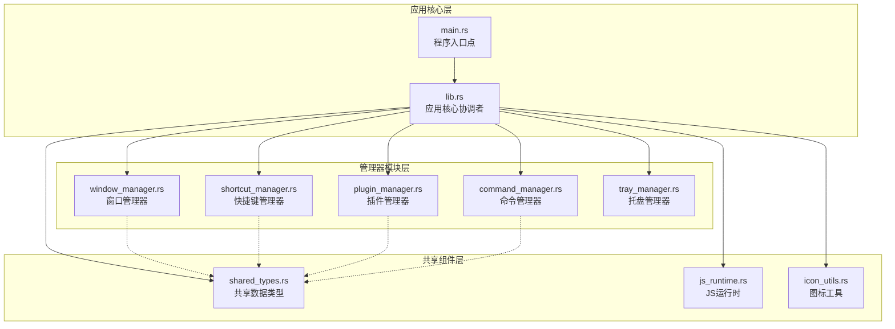
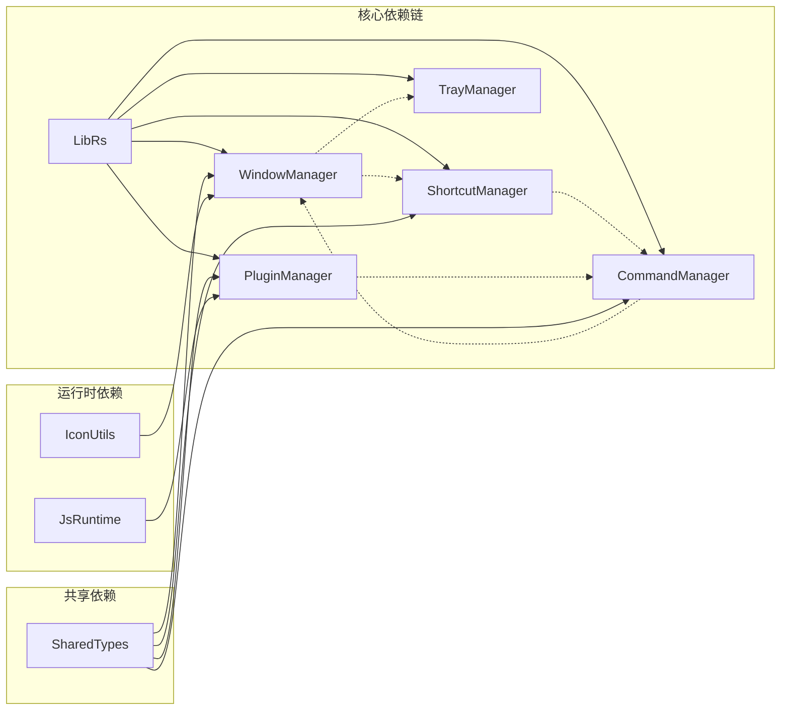
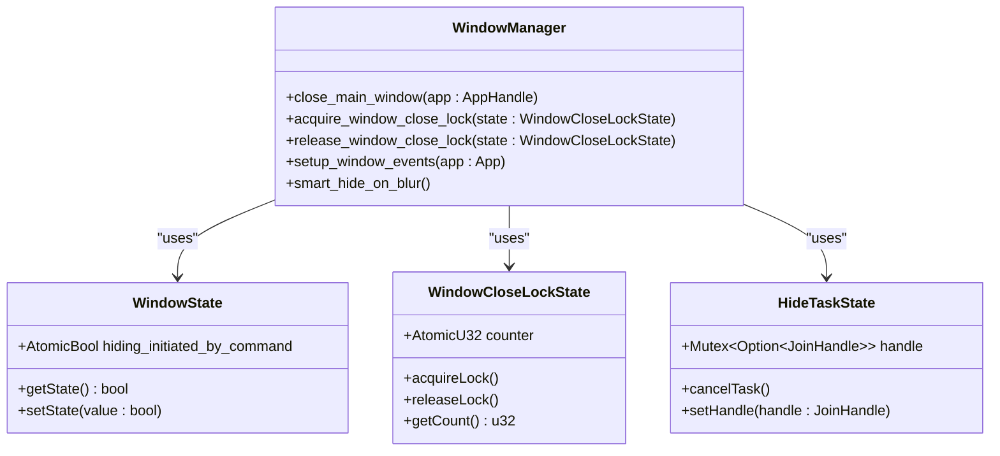
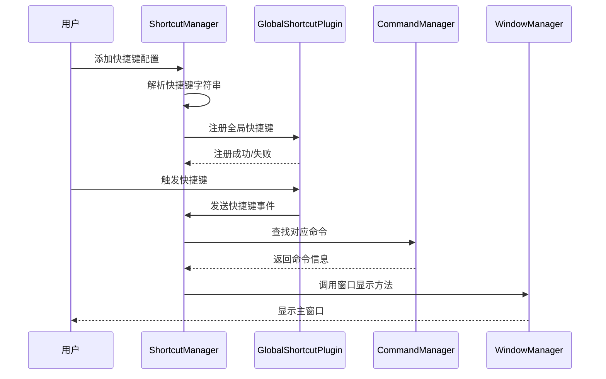
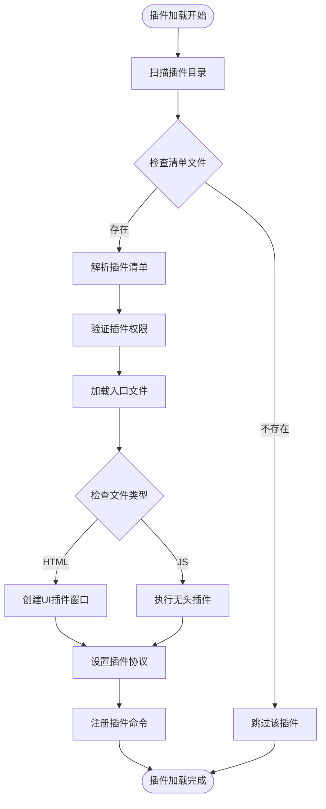
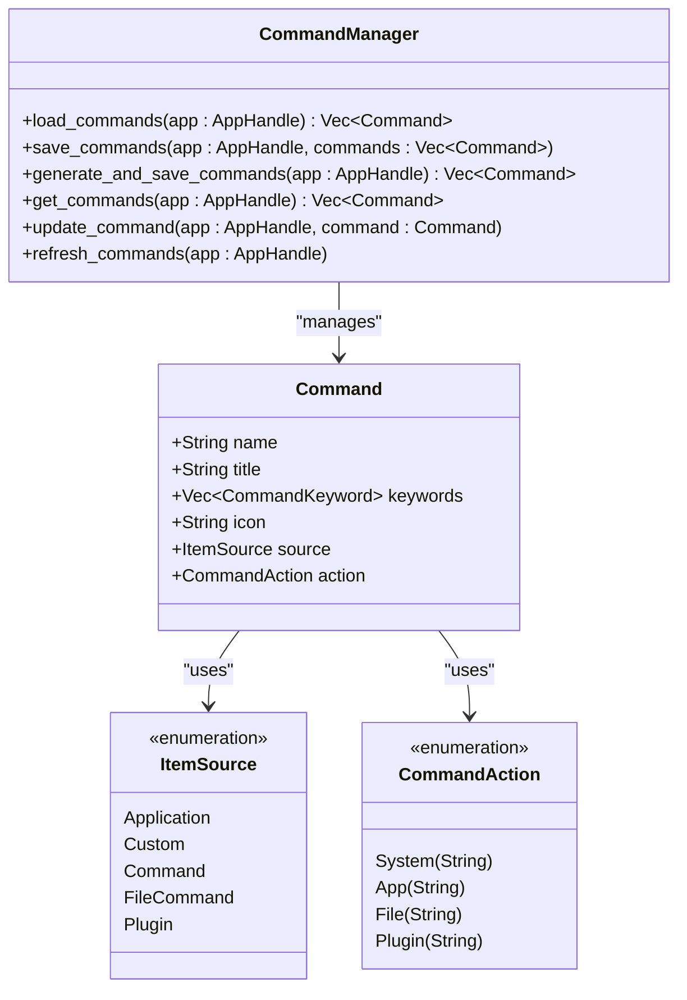
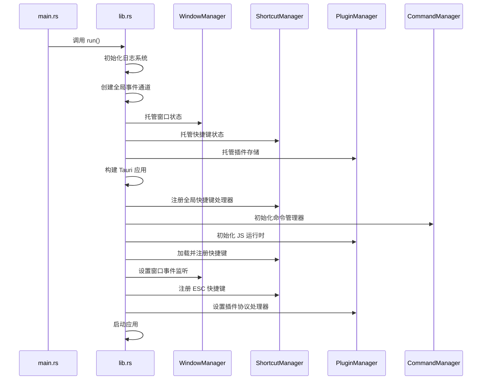
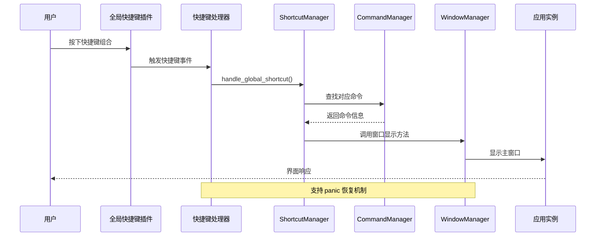
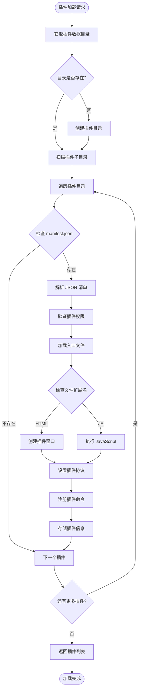
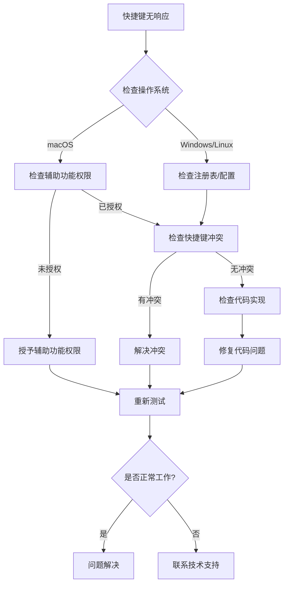

# Baize 后端模块职责划分

<cite>
**本文档引用的文件**
- [lib.rs](file://src-tauri/src/lib.rs)
- [window_manager.rs](file://src-tauri/src/window_manager.rs)
- [shortcut_manager.rs](file://src-tauri/src/shortcut_manager.rs)
- [plugin_manager.rs](file://src-tauri/src/plugin_manager.rs)
- [command_manager.rs](file://src-tauri/src/command_manager.rs)
- [tray_manager.rs](file://src-tauri/src/tray_manager.rs)
- [shared_types.rs](file://src-tauri/src/shared_types.rs)
- [main.rs](file://src-tauri/src/main.rs)
</cite>

## 目录
1. [简介](#简介)
2. [项目架构概览](#项目架构概览)
3. [核心模块职责分析](#核心模块职责分析)
4. [模块间依赖关系](#模块间依赖关系)
5. [详细模块分析](#详细模块分析)
6. [系统集成流程](#系统集成流程)
7. [性能考虑](#性能考虑)
8. [故障排除指南](#故障排除指南)
9. [总结](#总结)

## 简介

Baize 是一个基于 Tauri 框架构建的桌面应用程序，其后端采用模块化设计，通过单一职责原则将不同功能分离到独立的模块中。本文档详细阐述了 `src-tauri/src` 目录下各模块的职责划分，以及它们如何协同工作形成完整的应用系统。

## 项目架构概览

Baize 后端采用分层架构设计，核心协调者 `lib.rs` 通过 `tauri::Builder` 初始化并组合各个独立模块，实现松耦合的系统架构。

**图表来源**
- [lib.rs](file://src-tauri/src/lib.rs#L1-L235)
- [main.rs](file://src-tauri/src/main.rs#L1-L7)

## 核心模块职责分析

### 应用核心协调者 (lib.rs)

`lib.rs` 作为整个应用的核心协调者，负责以下关键职责：

1. **应用初始化配置**：通过 `tauri::Builder` 配置应用的基本设置
2. **模块组合装配**：将各个独立模块组合成完整的应用系统
3. **状态管理**：托管全局状态对象，如窗口状态、快捷键状态等
4. **事件处理**：设置全局事件监听器和错误处理机制
5. **生命周期管理**：协调应用启动、运行和关闭过程

### 窗口管理器 (window_manager.rs)

窗口管理器专注于窗口生命周期管理和智能行为控制：

- **窗口显示/隐藏**：提供窗口显示、隐藏的标准接口
- **智能锁定机制**：防止窗口在特定操作期间意外关闭
- **焦点事件处理**：响应窗口焦点变化，执行相应的显示/隐藏策略
- **全局快捷键集成**：与快捷键管理器协作，实现 ESC 键关闭窗口功能

### 快捷键管理器 (shortcut_manager.rs)

快捷键管理器专门负责全局快捷键的注册、管理和事件分发：

- **快捷键注册**：动态注册和注销全局快捷键
- **快捷键持久化**：将用户配置的快捷键保存到磁盘
- **事件分发**：将快捷键事件分发给相应的命令处理器
- **跨平台兼容**：处理不同操作系统下的权限和兼容性问题

### 插件管理器 (plugin_manager.rs)

插件管理器负责插件系统的完整生命周期管理：

- **插件发现与加载**：扫描插件目录，解析插件清单文件
- **插件协议处理**：实现 `plugin://` 协议处理器
- **JS运行时管理**：为插件提供独立的 JavaScript 运行环境
- **UI插件支持**：为带有界面的插件创建专用窗口

### 命令管理器 (command_manager.rs)

命令管理器统一管理所有类型的命令资源：

- **命令聚合**：整合系统命令、应用命令、文件命令和插件命令
- **命令持久化**：保存和加载用户自定义的命令配置
- **命令更新**：支持动态更新和刷新命令列表
- **命令查询**：提供高效的命令搜索和过滤功能

**章节来源**
- [lib.rs](file://src-tauri/src/lib.rs#L40-L235)
- [window_manager.rs](file://src-tauri/src/window_manager.rs#L1-L50)
- [shortcut_manager.rs](file://src-tauri/src/shortcut_manager.rs#L1-L50)
- [plugin_manager.rs](file://src-tauri/src/plugin_manager.rs#L1-L50)
- [command_manager.rs](file://src-tauri/src/command_manager.rs#L1-L50)

## 模块间依赖关系

**图表来源**
- [lib.rs](file://src-tauri/src/lib.rs#L25-L35)
- [shared_types.rs](file://src-tauri/src/shared_types.rs#L1-L128)

## 详细模块分析

### 窗口管理器详细分析

窗口管理器实现了复杂的窗口生命周期管理逻辑，包括智能锁定机制和焦点事件处理。

**图表来源**
- [window_manager.rs](file://src-tauri/src/window_manager.rs#L8-L25)

窗口管理器的关键特性：

1. **原子状态管理**：使用原子操作确保多线程环境下的状态一致性
2. **智能隐藏策略**：根据鼠标事件和时间超时智能判断何时隐藏窗口
3. **文件拖拽锁定**：在文件拖拽操作期间自动锁定窗口关闭
4. **焦点事件响应**：精确响应窗口焦点变化，避免不必要的隐藏操作

### 快捷键管理器详细分析

快捷键管理器提供了完整的全局快捷键解决方案。

**图表来源**
- [shortcut_manager.rs](file://src-tauri/src/shortcut_manager.rs#L50-L120)

快捷键管理器的核心功能：

1. **快捷键持久化存储**：将用户配置的快捷键序列化到 JSON 文件
2. **动态注册机制**：运行时动态注册和注销快捷键
3. **冲突检测**：自动检测和处理快捷键冲突
4. **跨平台权限管理**：处理 macOS 辅助功能权限等特殊需求

### 插件管理器详细分析

插件管理器实现了灵活的插件系统架构。

**图表来源**
- [plugin_manager.rs](file://src-tauri/src/plugin_manager.rs#L60-L150)

插件管理器的架构特点：

1. **双模式支持**：同时支持 UI 插件和无头插件
2. **协议驱动**：使用自定义 `plugin://` 协议加载插件内容
3. **权限隔离**：为每个插件提供独立的权限沙箱
4. **异步执行**：无头插件在独立线程中异步执行

### 命令管理器详细分析

命令管理器作为整个命令系统的中央枢纽。

**图表来源**
- [command_manager.rs](file://src-tauri/src/command_manager.rs#L1-L100)
- [shared_types.rs](file://src-tauri/src/shared_types.rs#L1-L128)

命令管理器的功能层次：

1. **系统命令**：内置的系统级命令集合
2. **应用命令**：从系统安装的应用程序中提取的命令
3. **文件命令**：用户自定义的文件关联命令
4. **插件命令**：由插件注册的扩展命令

**章节来源**
- [window_manager.rs](file://src-tauri/src/window_manager.rs#L1-L223)
- [shortcut_manager.rs](file://src-tauri/src/shortcut_manager.rs#L1-L382)
- [plugin_manager.rs](file://src-tauri/src/plugin_manager.rs#L1-L327)
- [command_manager.rs](file://src-tauri/src/command_manager.rs#L1-L303)

## 系统集成流程

### 应用启动流程

**图表来源**
- [lib.rs](file://src-tauri/src/lib.rs#L40-L235)

### 快捷键触发流程

**图表来源**
- [lib.rs](file://src-tauri/src/lib.rs#L80-L120)
- [shortcut_manager.rs](file://src-tauri/src/shortcut_manager.rs#L150-L200)

### 插件加载流程

**图表来源**
- [plugin_manager.rs](file://src-tauri/src/plugin_manager.rs#L60-L180)

## 性能考虑

### 内存管理优化

1. **原子操作优先**：使用原子类型减少锁竞争
2. **懒加载机制**：按需加载插件和命令资源
3. **缓存策略**：对频繁访问的数据进行内存缓存
4. **资源池化**：复用连接和线程资源

### 并发处理策略

1. **异步任务**：大量 I/O 操作采用异步处理
2. **线程隔离**：插件运行在独立线程中
3. **事件驱动**：基于事件循环的非阻塞架构
4. **背压处理**：合理处理高并发场景下的流量控制

### 启动性能优化

1. **延迟初始化**：非关键组件延迟加载
2. **并行启动**：可以并行执行的初始化任务
3. **预加载策略**：关键资源的预加载机制
4. **增量更新**：支持增量式命令和插件更新

## 故障排除指南

### 常见问题诊断

#### 快捷键失效问题

#### 插件加载失败

1. **清单文件格式错误**：检查 `manifest.json` 的 JSON 格式
2. **权限配置不当**：验证插件所需的网络权限配置
3. **入口文件缺失**：确认插件入口文件路径正确
4. **JavaScript 执行错误**：检查插件代码中的语法错误

#### 窗口显示异常

1. **焦点事件丢失**：检查窗口事件监听器是否正常工作
2. **智能锁定失效**：验证文件拖拽锁定机制
3. **全局快捷键冲突**：确认 ESC 键未被其他应用占用
4. **线程死锁**：检查异步任务的取消和清理逻辑

**章节来源**
- [shortcut_manager.rs](file://src-tauri/src/shortcut_manager.rs#L200-L250)
- [plugin_manager.rs](file://src-tauri/src/plugin_manager.rs#L200-L250)
- [window_manager.rs](file://src-tauri/src/window_manager.rs#L150-L200)

## 总结

Baize 后端模块通过清晰的职责划分和模块化设计，实现了高度可维护和可扩展的系统架构。主要特点包括：

### 设计优势

1. **单一职责原则**：每个模块专注于特定功能领域
2. **松耦合架构**：模块间通过明确定义的接口交互
3. **可扩展性**：新功能可以通过添加模块轻松集成
4. **错误隔离**：模块内部错误不会影响其他模块

### 技术亮点

1. **智能窗口管理**：结合用户行为和系统事件的智能窗口控制
2. **灵活的插件系统**：支持多种类型的插件和独立的运行环境
3. **强大的命令聚合**：统一管理各种来源的命令资源
4. **健壮的错误处理**：完善的异常捕获和恢复机制

### 最佳实践

1. **状态管理**：使用原子类型和互斥锁确保线程安全
2. **事件驱动**：基于事件循环的非阻塞架构设计
3. **配置持久化**：重要配置信息的本地存储和恢复
4. **跨平台兼容**：针对不同操作系统的特殊处理

这种模块化的设计不仅提高了代码的可读性和可维护性，也为未来的功能扩展奠定了坚实的基础。通过合理的职责划分和清晰的接口定义，开发者可以轻松理解和修改系统的行为，同时保持系统的稳定性和性能。