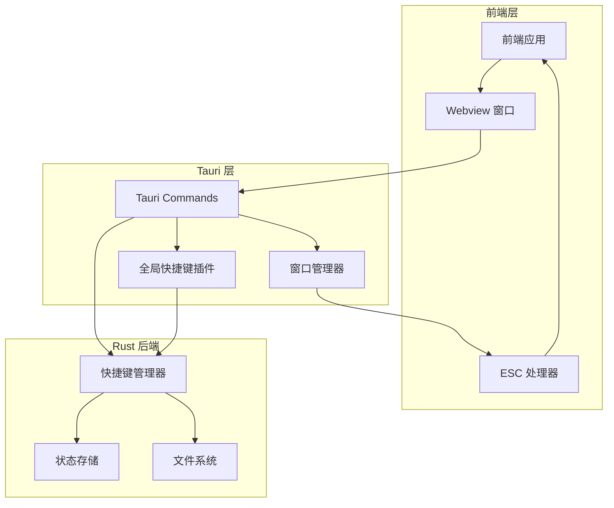
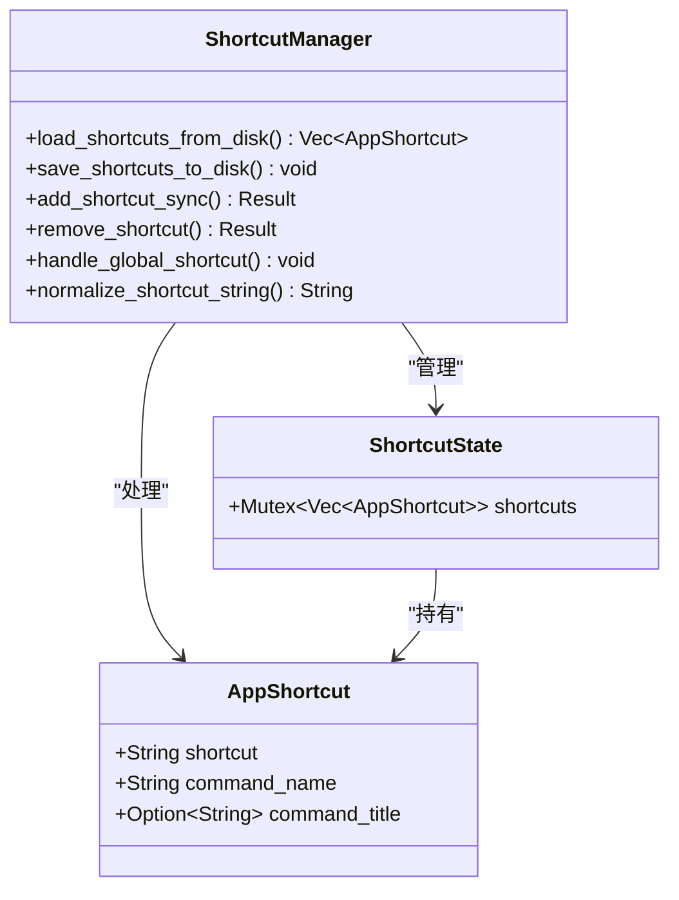
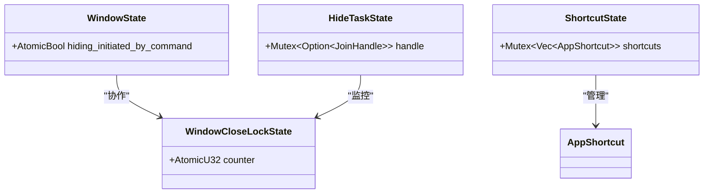
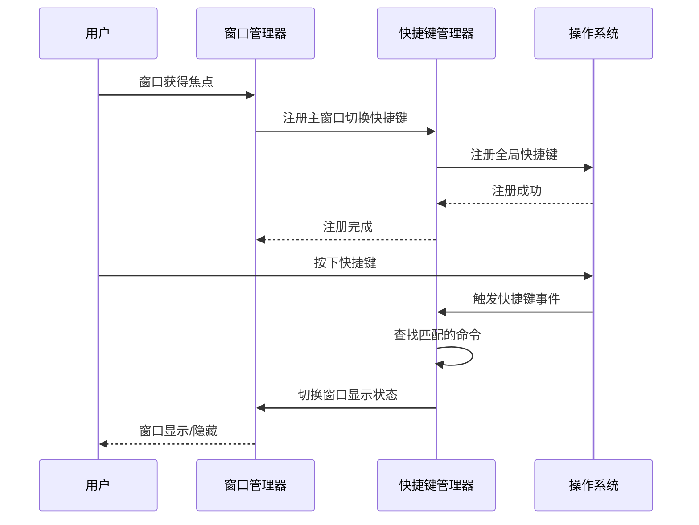
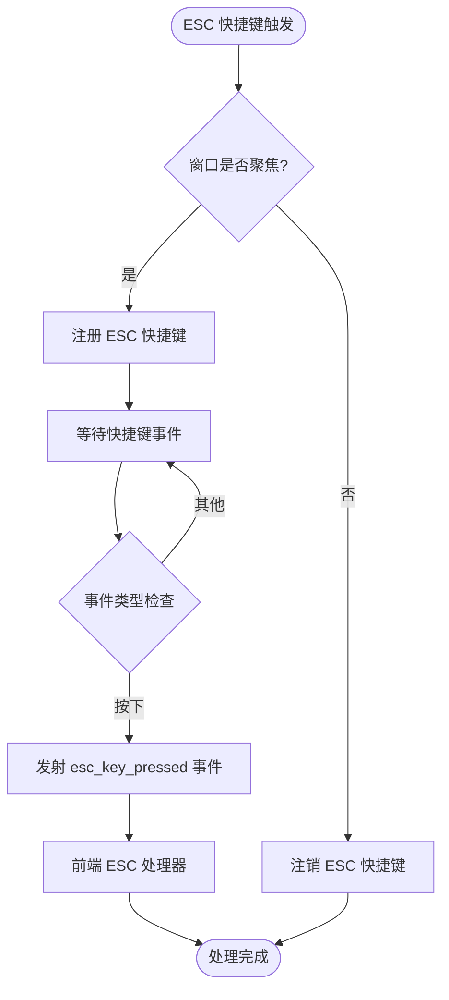
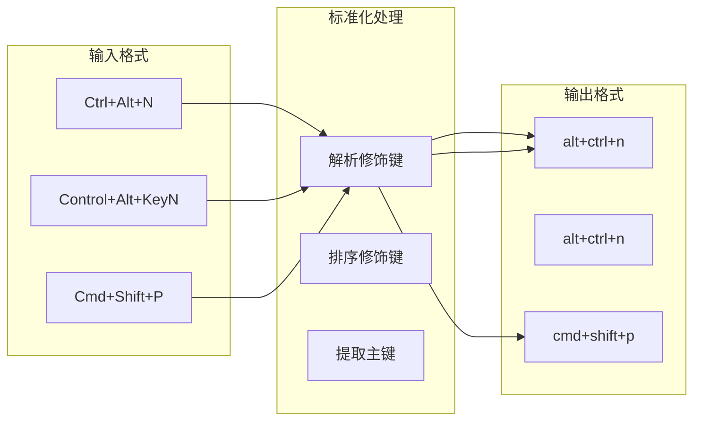
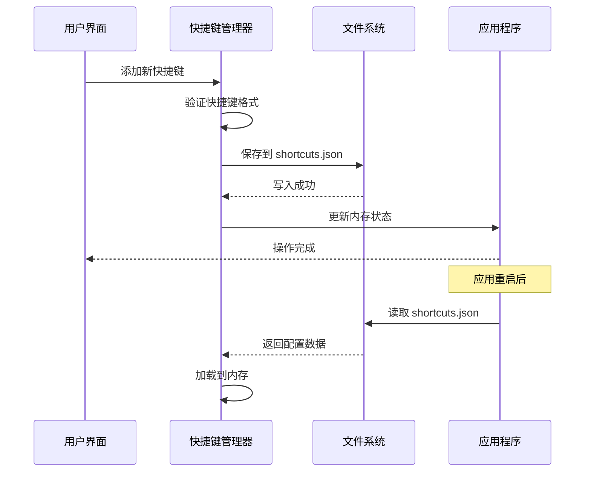
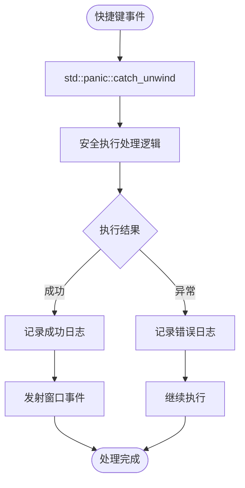
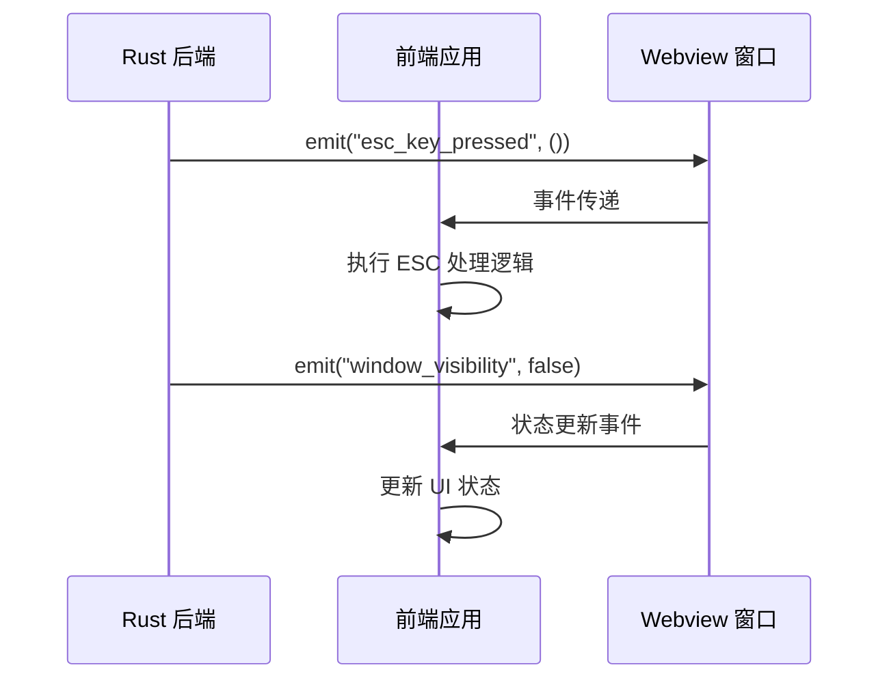
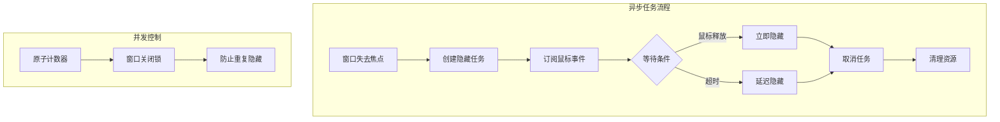

# Baize 全局快捷键系统实现文档

<cite>
**本文档引用的文件**
- [shortcut_manager.rs](file://src-tauri/src/shortcut_manager.rs)
- [lib.rs](file://src-tauri/src/lib.rs)
- [window_manager.rs](file://src-tauri/src/window_manager.rs)
- [escapeHandler.ts](file://src/lib/stores/escapeHandler.ts)
- [Cargo.toml](file://src-tauri/Cargo.toml)
- [tauri.conf.json](file://src-tauri/tauri.conf.json)
</cite>

## 目录
1. [简介](#简介)
2. [系统架构概览](#系统架构概览)
3. [核心组件分析](#核心组件分析)
4. [快捷键注册与管理](#快捷键注册与管理)
5. [ESC 键特殊处理](#esc-键特殊处理)
6. [跨平台兼容性](#跨平台兼容性)
7. [持久化机制](#持久化机制)
8. [错误处理与安全机制](#错误处理与安全机制)
9. [前端事件处理](#前端事件处理)
10. [性能优化](#性能优化)
11. [故障排除指南](#故障排除指南)
12. [总结](#总结)

## 简介

Baize 全局快捷键系统是一个基于 Tauri 框架构建的高级快捷键管理解决方案，提供了系统级快捷键注册、持久化存储、跨平台兼容性和智能事件处理等功能。该系统主要负责管理两种类型的快捷键：主窗口切换快捷键（默认为 Ctrl+Space）和 ESC 关闭快捷键。

系统的核心特性包括：
- 支持 Windows、macOS 和 Linux 平台的全局快捷键注册
- 快捷键配置的持久化存储到本地 JSON 文件
- 智能的快捷键冲突检测和处理
- 前后端事件通信机制
- 异常安全的快捷键处理逻辑
- 针对不同平台的特殊优化

## 系统架构概览



**图表来源**
- [lib.rs](file://src-tauri/src/lib.rs#L80-L130)
- [shortcut_manager.rs](file://src-tauri/src/shortcut_manager.rs#L1-L50)

## 核心组件分析

### 快捷键管理器 (ShortcutManager)

快捷键管理器是整个系统的核心组件，负责所有快捷键相关的操作：



**图表来源**
- [shortcut_manager.rs](file://src-tauri/src/shortcut_manager.rs#L13-L16)
- [shortcut_manager.rs](file://src-tauri/src/shortcut_manager.rs#L18-L46)

### 状态管理结构

系统使用多种状态结构来管理不同的运行时状态：



**图表来源**
- [window_manager.rs](file://src-tauri/src/window_manager.rs#L8-L20)
- [shortcut_manager.rs](file://src-tauri/src/shortcut_manager.rs#L13-L16)

**章节来源**
- [shortcut_manager.rs](file://src-tauri/src/shortcut_manager.rs#L1-L50)
- [window_manager.rs](file://src-tauri/src/window_manager.rs#L1-L30)

## 快捷键注册与管理

### 主窗口切换快捷键

主窗口切换快捷键是系统的核心功能之一，默认配置为 "toggle_window" 命令。该快捷键具有以下特点：

1. **自动注册与注销**：当主窗口获得焦点时自动注册，失去焦点时自动注销
2. **智能冲突处理**：如果检测到相同组合键的其他快捷键，会先注销旧快捷键
3. **持久化存储**：用户设置的快捷键会保存到本地文件系统



**图表来源**
- [window_manager.rs](file://src-tauri/src/window_manager.rs#L110-L130)
- [shortcut_manager.rs](file://src-tauri/src/shortcut_manager.rs#L239-L281)

### 快捷键规范化处理

系统实现了智能的快捷键字符串规范化功能，确保不同格式的快捷键能够正确匹配：

```rust
// 示例：规范化处理
// 输入："Ctrl+Alt+N" 或 "Control+Alt+KeyN"
// 输出："alt+ctrl+n"
fn normalize_shortcut_string(shortcut_str: &str) -> String {
    // 解析修饰键和主键
    // 排序修饰键
    // 格式化输出
}
```

**章节来源**
- [shortcut_manager.rs](file://src-tauri/src/shortcut_manager.rs#L201-L244)
- [shortcut_manager.rs](file://src-tauri/src/shortcut_manager.rs#L87-L129)

## ESC 键特殊处理

### ESC 快捷键生命周期管理

ESC 键的处理比普通快捷键更加复杂，因为它涉及到窗口的显示/隐藏状态和前端事件通知：



**图表来源**
- [window_manager.rs](file://src-tauri/src/window_manager.rs#L120-L151)
- [lib.rs](file://src-tauri/src/lib.rs#L103-L129)

### ESC 键处理器设计

ESC 键处理器采用了特殊的事件监听机制：

1. **动态注册/注销**：根据窗口焦点状态动态管理快捷键注册
2. **异常安全**：使用 `std::panic::catch_unwind` 包装处理逻辑
3. **前端通信**：通过窗口事件发射机制通知前端

```rust
// ESC 快捷键处理的核心逻辑
move |app, shortcut, event| {
    // 只处理按下事件，避免 macOS 崩溃
    if event.state() != ShortcutState::Pressed {
        return;
    }
    
    // 异常安全的处理逻辑
    let result = std::panic::catch_unwind(std::panic::AssertUnwindSafe(|| {
        shortcut_manager::handle_global_shortcut(app, shortcut, event.state());
    }));
    
    // 发射 ESC 键事件到前端
    if shortcut == &close_window_shortcut_clone {
        if let Some(window) = app.get_webview_window("main") {
            let _ = window.emit("esc_key_pressed", ());
        }
    }
}
```

**章节来源**
- [lib.rs](file://src-tauri/src/lib.rs#L103-L129)
- [window_manager.rs](file://src-tauri/src/window_manager.rs#L32-L68)

## 跨平台兼容性

### 平台特定优化

系统针对不同操作系统进行了专门的优化：

#### macOS 平台
- **辅助功能权限检查**：自动检查并提示用户授予辅助功能权限
- **rdev 监听器禁用**：为避免崩溃而禁用 rdev 事件监听
- **快捷键状态过滤**：只处理 `ShortcutState::Pressed` 状态

```rust
#[cfg(target_os = "macos")]
{
    // 检查辅助功能权限
    if !check_accessibility_permissions() {
        eprintln!("Warning: Accessibility permissions not granted...");
    }
    
    // 禁用 rdev 监听器以防止崩溃
    eprintln!("[INFO] rdev listener disabled on macOS to prevent crashes");
}
```

#### Windows/Linux 平台
- **完整的 rdev 监听器支持**：启用全局事件监听
- **标准快捷键处理**：使用完整的全局快捷键功能

### 快捷键格式标准化

系统实现了跨平台的快捷键格式标准化：



**图表来源**
- [shortcut_manager.rs](file://src-tauri/src/shortcut_manager.rs#L201-L244)

**章节来源**
- [shortcut_manager.rs](file://src-tauri/src/shortcut_manager.rs#L161-L202)
- [window_manager.rs](file://src-tauri/src/window_manager.rs#L120-L151)

## 持久化机制

### 快捷键配置存储

系统使用 JSON 格式将快捷键配置持久化到本地文件系统：



**图表来源**
- [shortcut_manager.rs](file://src-tauri/src/shortcut_manager.rs#L25-L46)
- [shortcut_manager.rs](file://src-tauri/src/shortcut_manager.rs#L122-L162)

### 存储文件结构

快捷键配置文件采用以下结构：

```json
[
  {
    "shortcut": "ctrl+space",
    "command_name": "toggle_window",
    "command_title": "显示/隐藏窗口"
  },
  {
    "shortcut": "alt+f1",
    "command_name": "custom_command",
    "command_title": "自定义命令"
  }
]
```

### 错误恢复机制

系统实现了完善的错误恢复机制：

1. **文件读取失败**：当配置文件不存在或损坏时，返回空列表
2. **JSON 解析错误**：记录错误但继续使用默认配置
3. **写入失败**：记录错误但不影响应用程序运行

**章节来源**
- [shortcut_manager.rs](file://src-tauri/src/shortcut_manager.rs#L25-L46)
- [shortcut_manager.rs](file://src-tauri/src/shortcut_manager.rs#L122-L162)

## 错误处理与安全机制

### 异常安全的快捷键处理

系统采用了多层异常安全机制：



**图表来源**
- [lib.rs](file://src-tauri/src/lib.rs#L103-L129)

### 状态锁保护

所有共享状态都使用互斥锁保护，防止并发访问导致的数据竞争：

```rust
// 快捷键状态锁保护
let mut shortcuts = state
    .shortcuts
    .lock()
    .map_err(|_| "Failed to acquire lock on shortcut state".to_string())?;

// 窗口状态锁保护  
let window_state: State<WindowState> = app_handle.state();
let lock_state: State<WindowCloseLockState> = app_handle.state();
```

### 资源清理机制

系统实现了完善的资源清理机制：

1. **异步任务取消**：当窗口失去焦点时取消待执行的隐藏任务
2. **锁状态管理**：确保文件拖放等操作完成后正确释放锁
3. **内存安全**：使用 RAII 模式管理资源生命周期

**章节来源**
- [lib.rs](file://src-tauri/src/lib.rs#L103-L129)
- [window_manager.rs](file://src-tauri/src/window_manager.rs#L150-L223)

## 前端事件处理

### ESC 键事件监听

前端通过 Svelte stores 管理 ESC 键处理器：

```typescript
// ESC 处理器 store 定义
export const escapeHandler = writable<() => void>(() => {
  // 默认为空操作函数
});
```

### 窗口可见性事件

系统通过窗口事件发射机制通知前端窗口状态变化：

```rust
// 窗口显示状态变更事件
window.emit("window_visibility", &false).unwrap_or_default();
```

### 前后端通信架构



**图表来源**
- [escapeHandler.ts](file://src/lib/stores/escapeHandler.ts#L1-L8)
- [window_manager.rs](file://src-tauri/src/window_manager.rs#L45-L50)

**章节来源**
- [escapeHandler.ts](file://src/lib/stores/escapeHandler.ts#L1-L8)
- [window_manager.rs](file://src-tauri/src/window_manager.rs#L45-L50)

## 性能优化

### 异步任务管理

系统使用异步任务来处理复杂的窗口隐藏逻辑：



**图表来源**
- [window_manager.rs](file://src-tauri/src/window_manager.rs#L150-L223)

### 内存优化策略

1. **懒加载**：只在需要时初始化全局事件通道
2. **资源池化**：重用快捷键对象减少内存分配
3. **及时清理**：主动清理不再使用的异步任务句柄

### CPU 使用优化

1. **事件过滤**：只处理必要的快捷键事件状态
2. **批量操作**：合并多个快捷键操作减少系统调用
3. **智能缓存**：缓存快捷键规范化结果避免重复计算

**章节来源**
- [window_manager.rs](file://src-tauri/src/window_manager.rs#L150-L223)
- [lib.rs](file://src-tauri/src/lib.rs#L30-L50)

## 故障排除指南

### 常见问题诊断

#### macOS 辅助功能权限问题

**症状**：全局快捷键无法正常工作
**原因**：缺少辅助功能权限
**解决方案**：
1. 检查系统偏好设置 > 安全性与隐私 > 隐私 > 辅助功能
2. 添加 Baize 应用到允许列表
3. 重新启动应用程序

#### 快捷键注册失败

**症状**：快捷键设置不生效
**原因**：可能的冲突或系统限制
**解决方案**：
1. 检查快捷键格式是否正确
2. 确认没有其他应用程序占用相同快捷键
3. 查看应用程序日志中的错误信息

#### 前端事件未触发

**症状**：ESC 键按下后无响应
**原因**：事件监听器配置问题
**解决方案**：
1. 检查前端是否正确设置了 ESC 处理器
2. 验证窗口事件发射是否正常
3. 确认 Webview 状态正常

### 调试工具和技巧

1. **日志分析**：查看应用程序启动时的日志输出
2. **状态检查**：使用 Tauri 开发者工具检查状态变量
3. **网络监控**：监控窗口事件的发射和接收情况

**章节来源**
- [shortcut_manager.rs](file://src-tauri/src/shortcut_manager.rs#L161-L202)
- [window_manager.rs](file://src-tauri/src/window_manager.rs#L120-L151)

## 总结

Baize 全局快捷键系统是一个设计精良、功能完备的快捷键管理解决方案。其主要优势包括：

### 技术亮点

1. **跨平台兼容性**：针对不同操作系统进行专门优化
2. **异常安全性**：多层异常处理确保系统稳定性
3. **智能规范化**：自动处理快捷键格式差异
4. **持久化存储**：配置信息可靠保存和恢复
5. **前后端协作**：高效的事件通信机制

### 架构优势

- **模块化设计**：清晰的职责分离和组件划分
- **状态管理**：完善的并发控制和资源管理
- **扩展性**：易于添加新的快捷键命令和处理逻辑
- **可维护性**：良好的代码组织和注释

### 应用价值

该系统不仅满足了 Baize 应用的基本快捷键需求，还为未来的功能扩展奠定了坚实的基础。通过合理的架构设计和完善的错误处理机制，确保了系统的稳定性和用户体验。