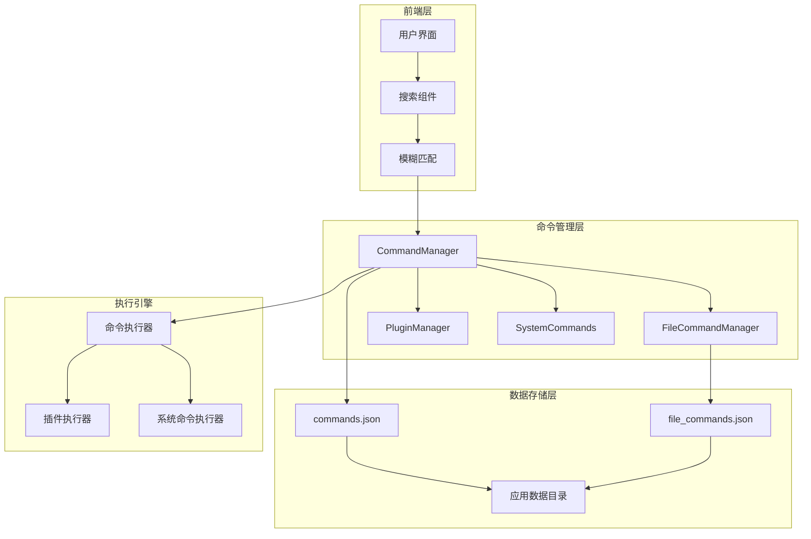
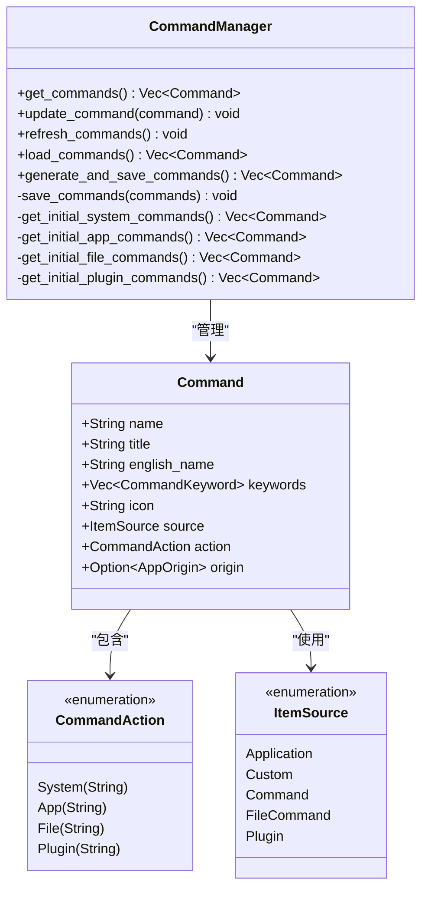
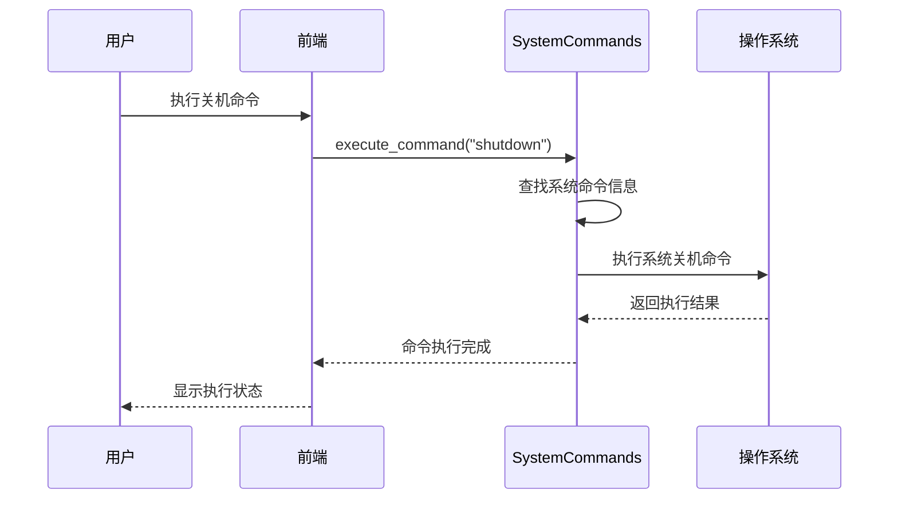
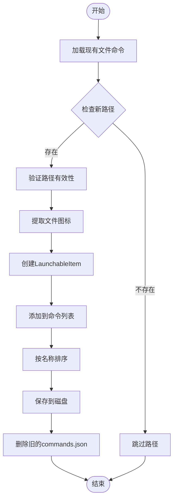
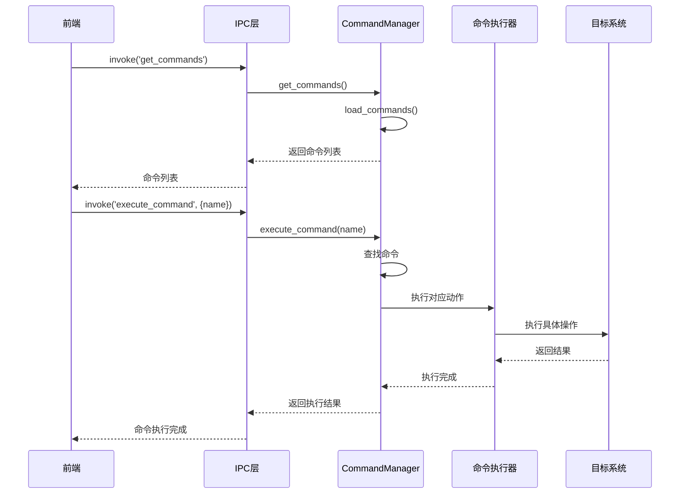
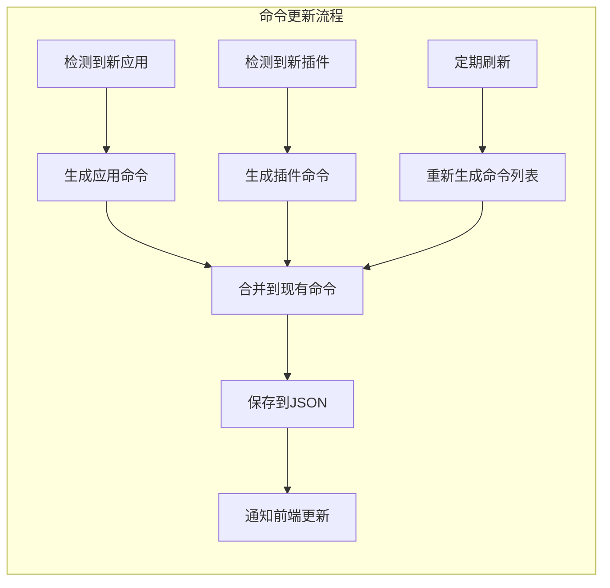
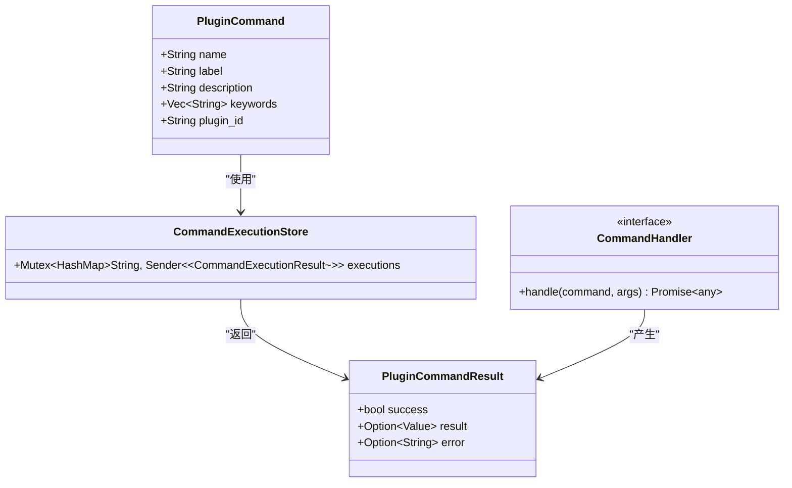
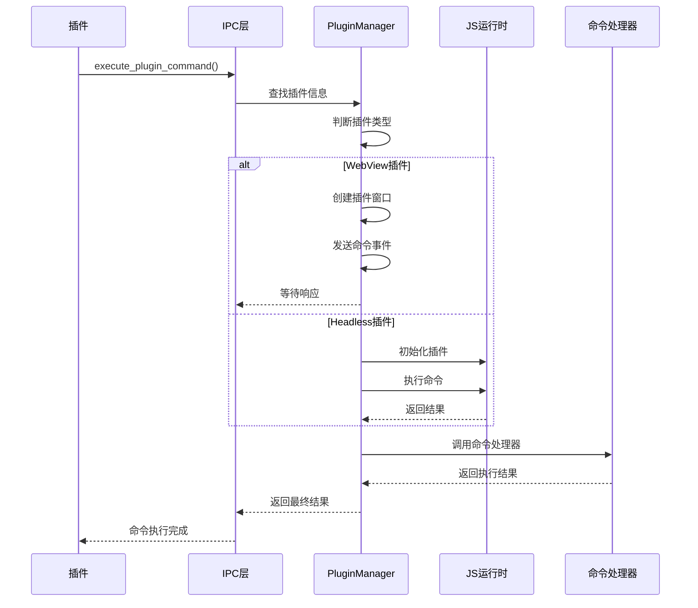

# Baize命令系统详细文档

<cite>
**本文档引用的文件**
- [command_manager.rs](file://src-tauri/src/command_manager.rs)
- [system_commands.rs](file://src-tauri/src/system_commands.rs)
- [shared_types.rs](file://src-tauri/src/shared_types.rs)
- [fuzzyMatch.ts](file://src/lib/utils/fuzzyMatch.ts)
- [command.ts](file://plugins-sdk/src/api/command.ts)
- [command.rs](file://src-tauri/src/plugin_api/command.rs)
- [installed_apps/mod.rs](file://src-tauri/src/installed_apps/mod.rs)
- [file_command_manager.rs](file://src-tauri/src/file_command_manager.rs)
- [lib.rs](file://src-tauri/src/lib.rs)
</cite>

## 目录
1. [简介](#简介)
2. [系统架构概览](#系统架构概览)
3. [核心组件分析](#核心组件分析)
4. [命令数据模型](#命令数据模型)
5. [命令执行流程](#命令执行流程)
6. [模糊匹配算法](#模糊匹配算法)
7. [插件命令系统](#插件命令系统)
8. [性能优化策略](#性能优化策略)
9. [故障排除指南](#故障排除指南)
10. [总结](#总结)

## 简介

Baize命令系统是一个统一的命令管理平台，负责聚合和管理所有可执行操作，包括系统命令、应用命令和插件命令。该系统通过CommandManager实现统一的命令生命周期管理，从前端调用到后端执行形成完整的命令链路。

命令系统的核心职责是：
- 统一管理来自不同来源的命令
- 提供高效的命令搜索和匹配功能
- 支持命令的动态更新和持久化存储
- 处理命令执行的安全性和错误恢复

## 系统架构概览



**图表来源**
- [command_manager.rs](file://src-tauri/src/command_manager.rs#L1-L303)
- [file_command_manager.rs](file://src-tauri/src/file_command_manager.rs#L1-L212)

## 核心组件分析

### CommandManager - 命令管理中心

CommandManager是整个命令系统的核心组件，负责协调所有命令的生命周期管理。



**图表来源**
- [command_manager.rs](file://src-tauri/src/command_manager.rs#L1-L303)
- [shared_types.rs](file://src-tauri/src/shared_types.rs#L1-L128)

**章节来源**
- [command_manager.rs](file://src-tauri/src/command_manager.rs#L1-L303)

### 系统命令模块

系统命令模块提供了基础的系统级操作命令，如关机、重启、睡眠等。



**图表来源**
- [system_commands.rs](file://src-tauri/src/system_commands.rs#L76-L109)

**章节来源**
- [system_commands.rs](file://src-tauri/src/system_commands.rs#L1-L229)

### 文件命令管理器

文件命令管理器负责管理用户添加的文件和文件夹命令，支持动态添加和移除。



**图表来源**
- [file_command_manager.rs](file://src-tauri/src/file_command_manager.rs#L70-L120)

**章节来源**
- [file_command_manager.rs](file://src-tauri/src/file_command_manager.rs#L1-L212)

## 命令数据模型

### 命令结构定义

命令系统采用统一的数据模型来表示不同类型的操作：

```rust
pub struct Command {
    pub name: String,           // 唯一标识符
    pub title: String,          // 显示名称
    pub english_name: String,   // 英文名称
    pub keywords: Vec<CommandKeyword>,
    pub icon: String,           // 图标路径或数据
    pub source: ItemSource,     // 来源类型
    pub action: CommandAction,  // 执行动作
    pub origin: Option<AppOrigin>, // 来源信息
}
```

### 关键字系统

关键字系统支持多语言和多种匹配模式：

```rust
pub struct CommandKeyword {
    pub name: String,           // 关键字内容
    pub disabled: Option<bool>, // 是否禁用
    pub is_default: Option<bool>, // 是否为默认关键字
}
```

**章节来源**
- [shared_types.rs](file://src-tauri/src/shared_types.rs#L1-L128)

## 命令执行流程

### 命令执行序列图



**图表来源**
- [command_manager.rs](file://src-tauri/src/command_manager.rs#L90-L133)
- [system_commands.rs](file://src-tauri/src/system_commands.rs#L76-L109)

### 动态命令更新机制

命令系统支持动态更新而不影响用户体验：



**章节来源**
- [command_manager.rs](file://src-tauri/src/command_manager.rs#L33-L95)

## 模糊匹配算法

### 前端模糊匹配实现

前端使用TypeScript实现了高效的模糊匹配算法：

```typescript
export const fuzzyMatch = (value: string, array: LaunchableItem[]): LaunchableItem[] => {
  const lowerValue = value.toLowerCase();
  
  const checkMatch = (text: string): boolean => {
    // 规则1: 简单模糊匹配
    if (lowerText.includes(lowerValue)) return true;
    
    // 规则2: 首字母匹配
    const initials = lowerText.split(/\s+/)
      .map(word => word.charAt(0))
      .join('');
    if (initials.includes(lowerValue)) return true;
    
    // 规则3: 中文拼音匹配
    const pinyinResult = pinyin(text, {style: pinyin.STYLE_NORMAL}).flat().join('');
    return pinyinResult.includes(lowerValue);
  };
  
  return array.filter(item => 
    (item.keywords || []).some(keyword => checkMatch(keyword.name))
  );
};
```

### 匹配规则详解

1. **简单模糊匹配**: 忽略大小写的字符串包含检查
2. **首字母匹配**: 支持缩写形式的快速匹配
3. **中文拼音匹配**: 支持中文字符的拼音搜索

**章节来源**
- [fuzzyMatch.ts](file://src/lib/utils/fuzzyMatch.ts#L1-L52)

## 插件命令系统

### 插件命令架构



**图表来源**
- [shared_types.rs](file://src-tauri/src/shared_types.rs#L85-L105)
- [command.rs](file://src-tauri/src/plugin_api/command.rs#L1-L176)

### 插件命令执行流程



**图表来源**
- [command.rs](file://src-tauri/src/plugin_api/command.rs#L25-L176)

**章节来源**
- [command.ts](file://plugins-sdk/src/api/command.ts#L1-L49)
- [command.rs](file://src-tauri/src/plugin_api/command.rs#L1-L176)

## 性能优化策略

### 异步加载机制

命令系统采用异步加载策略，避免阻塞主线程：

```rust
// 异步初始化命令管理器
tauri::async_runtime::spawn(async move {
    command_manager::init(&app_handle).await;
    js_runtime::init_plugin_runtime_manager(app_handle.clone()).await;
});
```

### 延迟加载策略

文件命令管理器采用延迟加载模式：

```rust
impl FileCommandManager {
    pub fn new(app_handle: tauri::AppHandle) -> Self {
        Self {
            file_commands: Mutex::new(None), // 延迟初始化
            app_handle,
        }
    }
    
    async fn ensure_loaded(&self) {
        let mut guard = self.file_commands.lock().await;
        if guard.is_none() {
            // 只有在首次访问时才加载数据
            let items = self.load_from_disk().await;
            *guard = Some(items);
        }
    }
}
```

### 内存优化

- 使用`Mutex`保护共享状态
- 实现智能缓存机制
- 定期清理过期的命令数据

**章节来源**
- [lib.rs](file://src-tauri/src/lib.rs#L155-L182)
- [file_command_manager.rs](file://src-tauri/src/file_command_manager.rs#L25-L50)

## 故障排除指南

### 常见问题及解决方案

1. **命令加载失败**
   - 检查`commands.json`文件权限
   - 验证JSON格式正确性
   - 重置命令配置

2. **插件命令执行超时**
   - 增加超时时间设置
   - 检查插件初始化状态
   - 验证插件窗口是否正常打开

3. **模糊匹配不准确**
   - 清除命令缓存
   - 重新生成命令索引
   - 检查关键字配置

### 调试工具

```rust
// 启用调试日志
eprintln!("Failed to parse commands.json: {}. Deleting and regenerating.", e);
eprintln!("Command not found: {}", name);
```

**章节来源**
- [command_manager.rs](file://src-tauri/src/command_manager.rs#L61-L95)

## 总结

Baize命令系统通过精心设计的架构实现了统一的命令管理平台。其主要特点包括：

1. **统一管理**: 集中管理所有类型的命令，包括系统命令、应用命令和插件命令
2. **高效匹配**: 实现了多规则的模糊匹配算法，支持中文拼音搜索
3. **动态更新**: 支持命令的实时更新和持久化存储
4. **插件友好**: 提供完整的插件命令执行框架
5. **性能优化**: 采用异步加载和延迟初始化等优化策略

该系统为Baize应用提供了强大而灵活的命令执行能力，是整个应用架构的重要组成部分。通过持续的优化和改进，命令系统将继续为用户提供更好的使用体验。