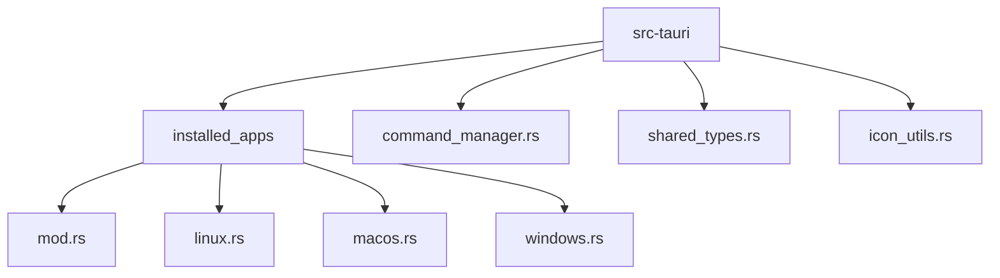
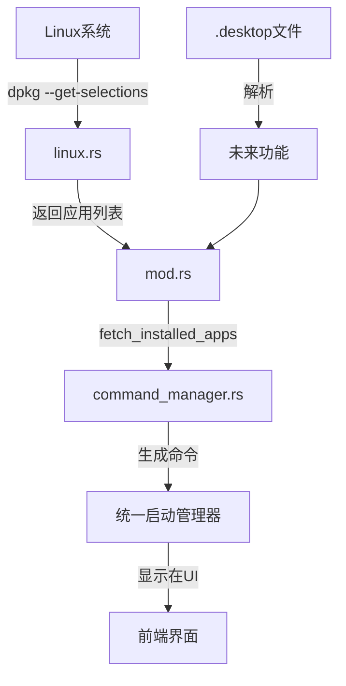
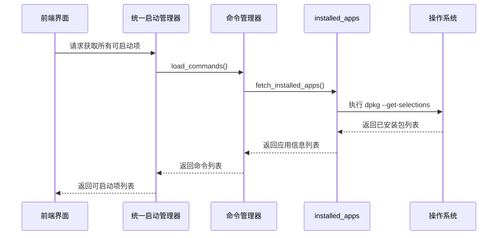
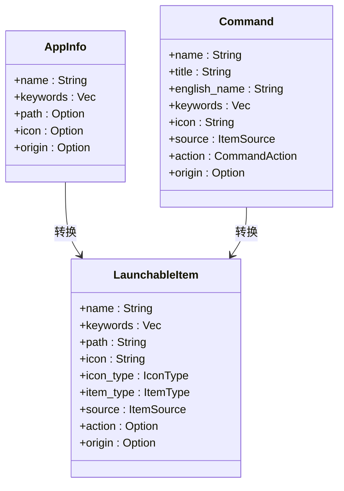
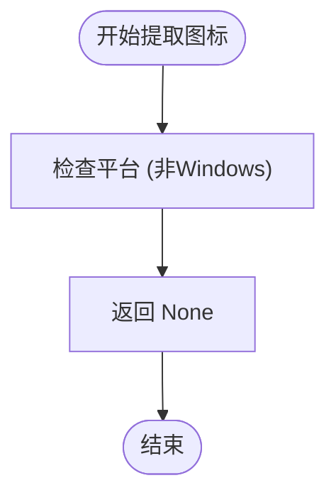
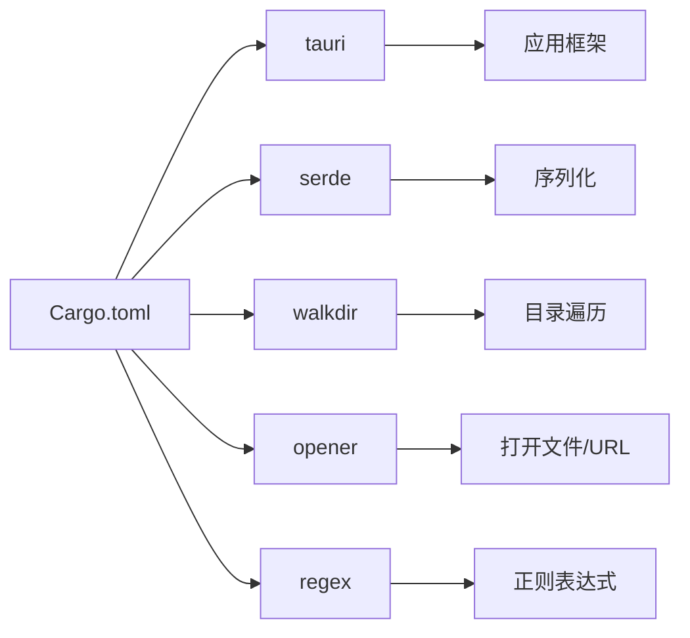

# Linux应用发现

<cite>
**本文档引用的文件**
- [linux.rs](file://src-tauri/src/installed_apps/linux.rs)
- [mod.rs](file://src-tauri/src/installed_apps/mod.rs)
- [icon_utils.rs](file://src-tauri/src/icon_utils.rs)
- [command_manager.rs](file://src-tauri/src/command_manager.rs)
- [shared_types.rs](file://src-tauri/src/shared_types.rs)
- [Cargo.toml](file://src-tauri/Cargo.toml)
</cite>

## 目录
1. [简介](#简介)
2. [项目结构](#项目结构)
3. [核心组件](#核心组件)
4. [架构概述](#架构概述)
5. [详细组件分析](#详细组件分析)
6. [依赖分析](#依赖分析)
7. [性能考虑](#性能考虑)
8. [故障排除指南](#故障排除指南)
9. [结论](#结论)

## 简介
本文档详细描述了Baize在Linux平台上的应用发现机制。该机制旨在扫描系统中安装的应用程序，并将其集成到统一的启动管理器中。文档将深入分析如何通过系统命令获取已安装的应用程序列表，如何解析.desktop文件以提取关键信息，以及如何处理图标和执行路径。此外，还将讨论当前实现的局限性以及未来可能的改进方向。

## 项目结构
Baize项目的结构遵循典型的Tauri应用程序模式，前端使用Svelte框架，后端使用Rust编写。应用发现功能主要集中在`src-tauri`目录下的`installed_apps`模块中，特别是针对不同操作系统的具体实现。

**Diagram sources**
- [mod.rs](file://src-tauri/src/installed_apps/mod.rs)
- [linux.rs](file://src-tauri/src/installed_apps/linux.rs)
- [command_manager.rs](file://src-tauri/src/command_manager.rs)

**Section sources**
- [mod.rs](file://src-tauri/src/installed_apps/mod.rs)
- [linux.rs](file://src-tauri/src/installed_apps/linux.rs)

## 核心组件
应用发现机制的核心组件包括`installed_apps`模块，该模块负责跨平台获取已安装应用程序的信息。在Linux平台上，该模块通过执行系统命令来获取应用程序列表，并将这些信息传递给上层的命令管理器进行处理。

**Section sources**
- [mod.rs](file://src-tauri/src/installed_apps/mod.rs)
- [linux.rs](file://src-tauri/src/installed_apps/linux.rs)

## 架构概述
Baize的应用发现架构采用分层设计，从底层的系统调用到上层的命令管理，形成了一个完整的应用程序集成流程。

**Diagram sources**
- [linux.rs](file://src-tauri/src/installed_apps/linux.rs)
- [mod.rs](file://src-tauri/src/installed_apps/mod.rs)
- [command_manager.rs](file://src-tauri/src/command_manager.rs)

## 详细组件分析

### Linux应用发现分析
Linux平台的应用发现功能目前通过调用`dpkg --get-selections`命令来获取已安装的Debian包列表。这种方法简单直接，但存在明显的局限性，因为它只能发现通过dpkg/apt安装的软件包，而无法发现通过Flatpak、Snap或其他方式安装的应用程序。

#### 应用信息获取流程

**Diagram sources**
- [linux.rs](file://src-tauri/src/installed_apps/linux.rs#L0-L28)
- [mod.rs](file://src-tauri/src/installed_apps/mod.rs#L0-L71)
- [command_manager.rs](file://src-tauri/src/command_manager.rs#L0-L199)

#### 应用信息结构

**Diagram sources**
- [shared_types.rs](file://src-tauri/src/shared_types.rs#L0-L127)
- [mod.rs](file://src-tauri/src/installed_apps/mod.rs#L0-L71)

**Section sources**
- [shared_types.rs](file://src-tauri/src/shared_types.rs#L0-L127)
- [mod.rs](file://src-tauri/src/installed_apps/mod.rs#L0-L71)
- [command_manager.rs](file://src-tauri/src/command_manager.rs#L0-L199)

### 图标处理分析
当前的图标处理机制在非Windows平台上尚未实现，返回`None`作为占位符。这表明应用发现功能目前不支持提取或显示应用程序图标。

#### 图标处理流程

**Diagram sources**
- [icon_utils.rs](file://src-tauri/src/icon_utils.rs#L0-L17)

**Section sources**
- [icon_utils.rs](file://src-tauri/src/icon_utils.rs#L0-L17)

## 依赖分析
应用发现功能依赖于几个关键的Rust crate，这些依赖项在`Cargo.toml`文件中定义。

**Diagram sources**
- [Cargo.toml](file://src-tauri/Cargo.toml#L0-L70)

**Section sources**
- [Cargo.toml](file://src-tauri/Cargo.toml#L0-L70)

## 性能考虑
当前的Linux应用发现实现通过执行系统命令来获取已安装的应用程序列表，这种方法在大多数情况下性能良好。然而，由于它依赖于`dpkg --get-selections`命令，其性能和准确性受限于该命令的执行效率和输出结果。

对于大型系统，可能需要考虑缓存机制来避免频繁调用系统命令。此外，未来的实现可能会采用更高效的文件系统遍历方法来直接读取.desktop文件，这可能会提高性能并减少对外部命令的依赖。

## 故障排除指南
在使用Baize的应用发现功能时，可能会遇到以下常见问题：

1. **无法发现某些应用程序**：当前实现仅能发现通过dpkg/apt安装的应用程序。对于通过Flatpak、Snap或其他方式安装的应用程序，需要扩展应用发现机制以支持这些打包格式。

2. **图标不