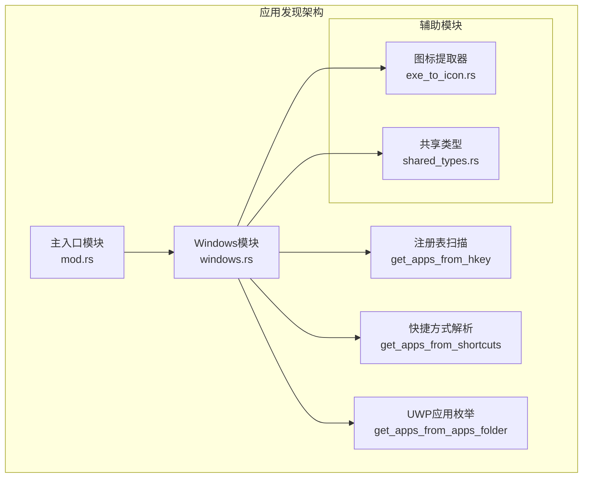
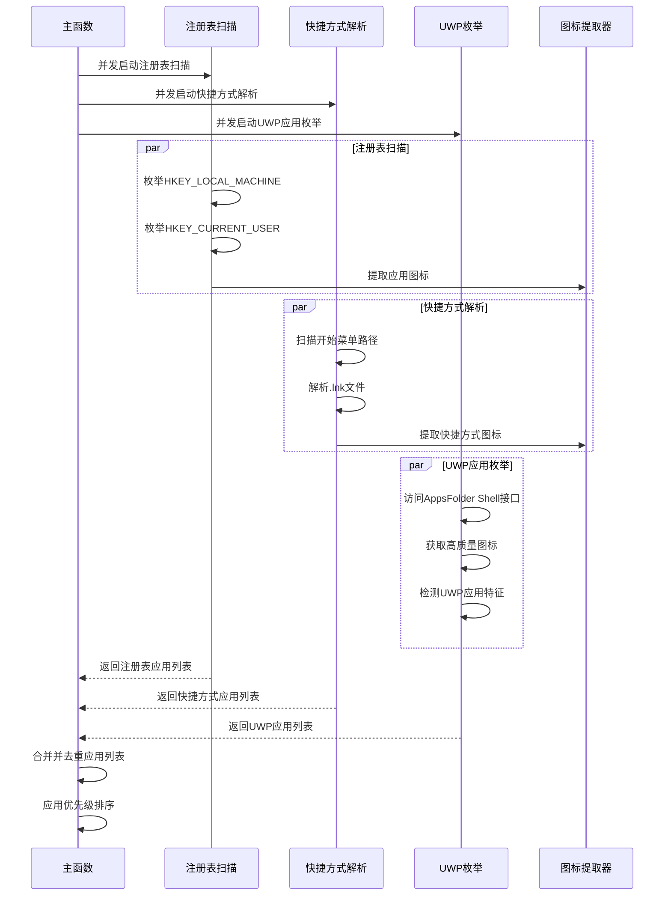
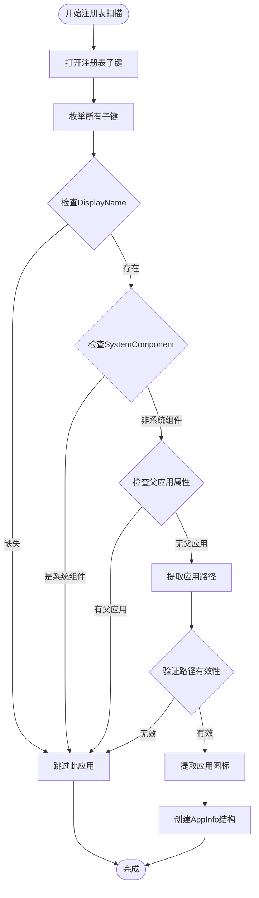
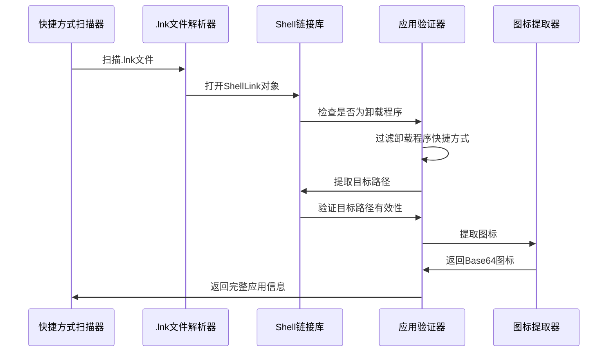
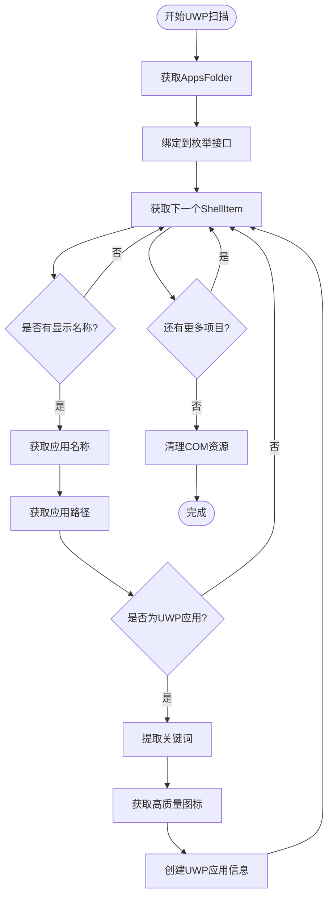
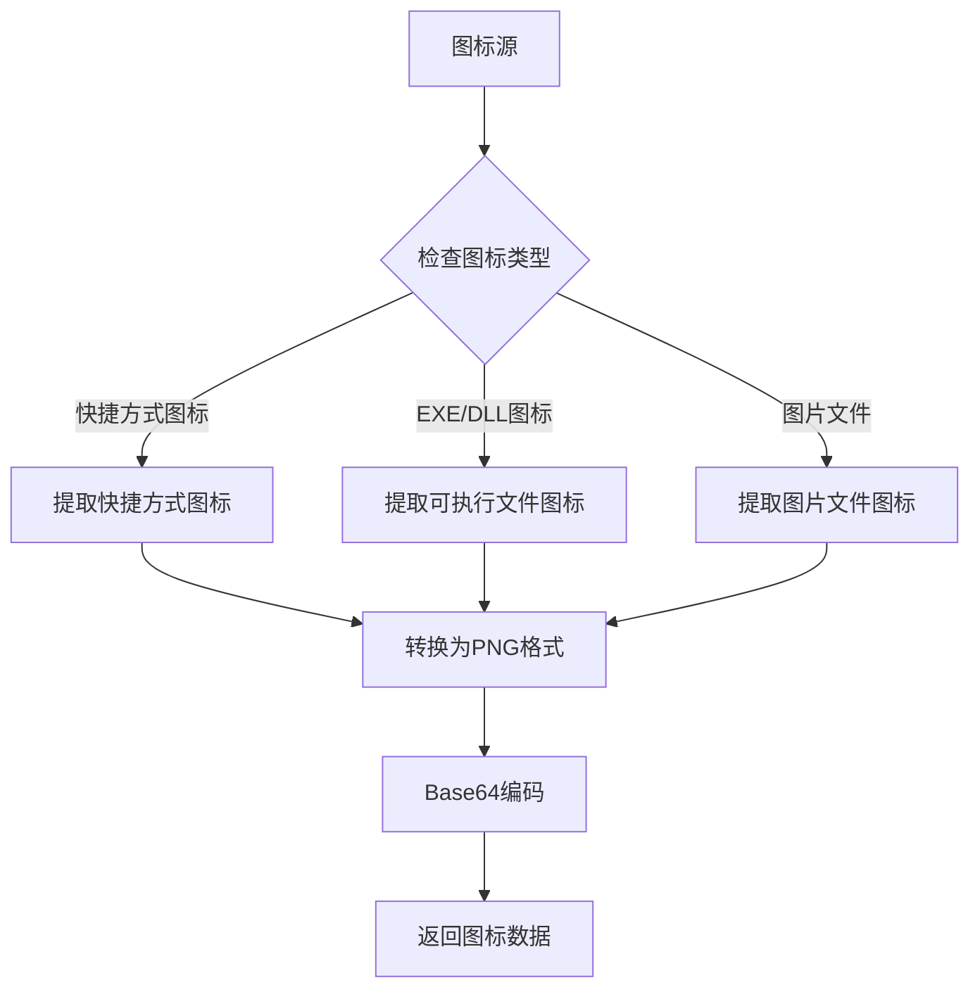

# Windows应用发现机制详细文档

<cite>
**本文档引用的文件**
- [windows.rs](file://src-tauri/src/installed_apps/windows.rs)
- [mod.rs](file://src-tauri/src/installed_apps/mod.rs)
- [exe_to_icon.rs](file://src-tauri/src/installed_apps/exe_to_icon.rs)
- [shared_types.rs](file://src-tauri/src/shared_types.rs)
- [lib.rs](file://src-tauri/src/lib.rs)
- [Cargo.toml](file://src-tauri/Cargo.toml)
</cite>

## 目录
1. [简介](#简介)
2. [项目架构概览](#项目架构概览)
3. [核心组件分析](#核心组件分析)
4. [Windows应用发现机制](#windows应用发现机制)
5. [注册表应用枚举](#注册表应用枚举)
6. [快捷方式解析](#快捷方式解析)
7. [UWP应用支持](#uwp应用支持)
8. [图标提取机制](#图标提取机制)
9. [性能优化策略](#性能优化策略)
10. [权限要求与安全考虑](#权限要求与安全考虑)
11. [故障排除指南](#故障排除指南)
12. [总结](#总结)

## 简介

Baize项目中的Windows应用发现机制是一个复杂而精密的系统，旨在全面识别和枚举Windows平台上安装的各种类型的应用程序。该机制通过三种主要途径工作：Windows注册表扫描、开始菜单快捷方式解析和UWP（通用Windows平台）应用枚举，为用户提供了一个统一且高效的本地应用发现体验。

该系统的设计充分考虑了Windows平台的特性，包括传统桌面应用的注册表存储、现代应用的快捷方式机制以及Microsoft Store应用的特殊处理。通过多层优先级策略和智能去重算法，确保了应用信息的准确性和完整性。

## 项目架构概览

Windows应用发现机制在Baize项目中采用模块化设计，位于`src-tauri/src/installed_apps/`目录下。整个系统围绕三个核心模块构建：



**图表来源**
- [mod.rs](file://src-tauri/src/installed_apps/mod.rs#L1-L72)
- [windows.rs](file://src-tauri/src/installed_apps/windows.rs#L1-L720)

**章节来源**
- [mod.rs](file://src-tauri/src/installed_apps/mod.rs#L1-L72)
- [windows.rs](file://src-tauri/src/installed_apps/windows.rs#L1-L720)

## 核心组件分析

### 应用信息结构

Windows应用发现机制的核心是`AppInfo`结构体，它封装了应用程序的所有关键信息：

```rust
pub struct AppInfo {
    pub name: String,           // 应用名称
    pub keywords: Vec<String>,  // 关键词列表
    pub path: Option<String>,   // 应用路径
    pub icon: Option<String>,   // Base64格式图标
    pub origin: Option<AppOrigin>, // 应用来源类型
}
```

### 应用来源类型

系统定义了三种不同的应用来源类型，每种都有其特定的处理逻辑：

```rust
pub enum AppOrigin {
    Hkey,      // 来自Windows注册表
    Shortcut,  // 来自快捷方式
    Uwp,       // 来自UWP应用
}
```

这种分类机制允许系统根据应用类型采用不同的处理策略，特别是在图标提取和路径解析方面。

**章节来源**
- [shared_types.rs](file://src-tauri/src/shared_types.rs#L45-L50)
- [windows.rs](file://src-tauri/src/installed_apps/windows.rs#L1-L50)

## Windows应用发现机制

Windows应用发现机制采用三重扫描策略，通过异步并发处理确保高效性和响应性：



**图表来源**
- [windows.rs](file://src-tauri/src/installed_apps/windows.rs#L580-L620)

### 多层优先级策略

系统实现了智能的优先级策略，确保最准确的应用信息被保留：

1. **优先级1：注册表应用** - 来自`HKEY_LOCAL_MACHINE\SOFTWARE\Microsoft\Windows\CurrentVersion\Uninstall`和`HKEY_CURRENT_USER`的注册表项
2. **优先级2：快捷方式应用** - 来自开始菜单和桌面的快捷方式
3. **优先级3：UWP应用** - 来自AppsFolder的现代应用

这种策略确保了传统桌面应用的路径准确性，同时补充了快捷方式可能遗漏的应用。

**章节来源**
- [windows.rs](file://src-tauri/src/installed_apps/windows.rs#L580-L620)

## 注册表应用枚举

Windows注册表是传统桌面应用的主要存储位置。系统通过枚举以下注册表路径来发现应用：

### 注册表路径配置

```rust
const UNINSTALL_PATHS: &[(&str, HKEY)] = &[
    (
        "SOFTWARE\\Microsoft\\Windows\\CurrentVersion\\Uninstall",
        HKEY_LOCAL_MACHINE,
    ),
    (
        "SOFTWARE\\Microsoft\\Windows\\CurrentVersion\\Uninstall",
        HKEY_CURRENT_USER,
    ),
    (
        "SOFTWARE\\Wow6432Node\\Microsoft\\Windows\\CurrentVersion\\Uninstall",
        HKEY_LOCAL_MACHINE,
    ),
];
```

这些路径覆盖了所有可能的安装位置：
- **HKEY_LOCAL_MACHINE**：系统范围的安装
- **HKEY_CURRENT_USER**：当前用户的安装
- **Wow6432Node**：32位应用在64位系统上的兼容层

### 注册表项解析流程



**图表来源**
- [windows.rs](file://src-tauri/src/installed_apps/windows.rs#L41-L93)

### 应用路径提取算法

系统实现了复杂的路径提取算法，优先尝试以下顺序：

1. **DisplayIcon字段**：直接包含可执行文件路径
2. **InstallLocation字段**：应用安装目录下的默认启动文件
3. **UninstallString字段**：卸载程序中的可执行文件路径

```rust
fn extract_exe_path(
    display_icon: Option<String>,
    install_location: Option<String>,
    uninstall_string: Option<String>,
) -> Option<String> {
    // 优先级1：DisplayIcon字段
    if let Some(icon) = display_icon {
        // 处理.ico,.exe,.msi等文件路径
    }
    
    // 优先级2：InstallLocation字段
    if let Some(loc) = &install_location {
        // 尝试在安装目录下查找start.exe
    }
    
    // 优先级3：UninstallString字段
    if let Some(uninstall) = uninstall_string {
        // 从卸载字符串中提取可执行文件路径
    }
    
    None
}
```

**章节来源**
- [windows.rs](file://src-tauri/src/installed_apps/windows.rs#L41-L93)
- [windows.rs](file://src-tauri/src/installed_apps/windows.rs#L100-L150)

## 快捷方式解析

快捷方式解析是发现非标准安装应用的重要机制。系统通过扫描多个开始菜单路径来定位.lnk文件：

### 快捷方式扫描路径

```rust
let start_menu_paths = vec![
    "C:\\ProgramData\\Microsoft\\Windows\\Start Menu\\Programs".to_string(),
    format!(
        "{}\\AppData\\Roaming\\Microsoft\\Windows\\Start Menu\\Programs",
        user_profile
    ),
    format!("{}\\Desktop", user_profile),
];
```

这些路径涵盖了：
- **公共开始菜单**：`C:\ProgramData\Microsoft\Windows\Start Menu`
- **用户个人开始菜单**：`%USERPROFILE%\AppData\Roaming\Microsoft\Windows\Start Menu`
- **桌面快捷方式**：`%USERPROFILE%\Desktop`

### 快捷方式解析流程



**图表来源**
- [windows.rs](file://src-tauri/src/installed_apps/windows.rs#L200-L280)

### 快捷方式过滤机制

系统实现了智能的过滤机制，避免将卸载程序误认为普通应用：

```rust
fn is_uninstall_path(link: &ShellLink) -> bool {
    if let Some(link_info) = link.link_info() {
        if let Some(local_path) = link_info.local_base_path() {
            let path_str = local_path.to_lowercase();
            return path_str.contains("uninstall") || path_str.contains("卸载");
        }
    }
    false
}
```

这种过滤确保了系统不会将卸载程序显示为可用的应用。

**章节来源**
- [windows.rs](file://src-tauri/src/installed_apps/windows.rs#L160-L200)
- [windows.rs](file://src-tauri/src/installed_apps/windows.rs#L200-L280)

## UWP应用支持

Universal Windows Platform (UWP)应用是Windows 8引入的现代应用架构。系统通过Windows Shell API直接访问AppsFolder来发现UWP应用：

### AppsFolder访问机制

```rust
unsafe {
    if CoInitializeEx(None, COINIT_APARTMENTTHREADED | COINIT_DISABLE_OLE1DDE).is_err() {
        return Err("Failed to initialize COM".to_string());
    }
}

let apps_folder: Result<IShellItem, _> =
    unsafe { SHGetKnownFolderItem(&FOLDERID_AppsFolder, KF_FLAG_DEFAULT, None) };
```

系统使用COM（Component Object Model）技术访问Windows Shell API，这是访问UWP应用信息的标准方式。

### UWP应用检测算法



**图表来源**
- [windows.rs](file://src-tauri/src/installed_apps/windows.rs#L520-L580)

### UWP应用特征识别

系统通过路径模式识别UWP应用：

```rust
// UWP应用路径通常包含下划线和感叹号
if path.contains('_') && path.contains('!') {
    if let Some(keyword) = path
        .split('_')
        .next()
        .and_then(|s| s.split('.').last())
        .map(|s| s.to_lowercase())
    {
        keywords.push(keyword);
    }
}
```

这种启发式方法虽然不是100%准确，但能有效识别大多数UWP应用。

**章节来源**
- [windows.rs](file://src-tauri/src/installed_apps/windows.rs#L520-L580)

## 图标提取机制

图标提取是Windows应用发现机制中最复杂的部分之一。系统针对不同类型的图标源实现了专门的提取算法：

### 图标提取策略



**图表来源**
- [windows.rs](file://src-tauri/src/installed_apps/windows.rs#L650-L700)
- [exe_to_icon.rs](file://src-tauri/src/installed_apps/exe_to_icon.rs#L1-L50)

### EXE文件图标提取

系统使用Windows API直接从可执行文件中提取图标：

```rust
pub fn extract_icon_from_exe(exe_path: &str) -> Option<String> {
    unsafe {
        let h_path = HSTRING::from(exe_path);
        let c_path = PCWSTR(h_path.as_ptr());
        
        // 从exe文件中提取图标 (索引0表示第一个图标)
        let hicon = ExtractIconW(None, c_path, 0);
        
        if hicon.is_invalid() {
            return None;
        }
        
        // 获取图标信息并提取位图数据
        // ...
    }
}
```

### 位图数据处理

系统实现了复杂的位图数据处理流程，确保图标数据的正确转换：

```rust
unsafe fn extract_bitmap_data(hbitmap: HBITMAP) -> Option<BitmapData> {
    // 获取设备上下文
    let hdc = GetDC(HWND::default());
    let hdc_mem = CreateCompatibleDC(hdc);
    
    // 设置位图并获取位图信息
    let mut bmp_info = BITMAPINFO {
        bmiHeader: BITMAPINFOHEADER {
            biSize: mem::size_of::<BITMAPINFOHEADER>() as u32,
            biWidth: 0,
            biHeight: 0,
            biPlanes: 1,
            biBitCount: 0,
            biCompression: BI_RGB.0,
            biSizeImage: 0,
            biXPelsPerMeter: 0,
            biYPelsPerMeter: 0,
            biClrUsed: 0,
            biClrImportant: 0,
        },
        bmiColors: [Default::default(); 1],
    };
    
    // 获取位图尺寸信息
    if GetDIBits(hdc_mem, hbitmap, 0, 0, None, &mut bmp_info, DIB_RGB_COLORS) == 0 {
        return None;
    }
    
    // 转换BGRA到RGBA格式
    // 编码为PNG并Base64编码
}
```

**章节来源**
- [exe_to_icon.rs](file://src-tauri/src/installed_apps/exe_to_icon.rs#L15-L50)
- [exe_to_icon.rs](file://src-tauri/src/installed_apps/exe_to_icon.rs#L50-L150)

## 性能优化策略

Windows应用发现机制采用了多种性能优化策略，确保在大型系统上也能快速响应：

### 并发处理架构

系统使用Tokio异步运行时进行并发处理：

```rust
// 并发启动三个主要任务
let hkey_apps_future = get_apps_from_hkey();
let shortcut_apps_future = get_apps_from_shortcuts();
let apps_folder_apps = task::spawn_blocking(get_apps_from_apps_folder)
    .await
    .unwrap()?;
```

### CPU亲和度优化

```rust
// 使用CPU核心数的两倍作为并发限制
let apps: Vec<AppInfo> = futures::stream::iter(futures)
    .buffer_unordered(num_cpus::get() * 2)
    .collect()
    .await;
```

这种策略充分利用了多核处理器的优势，同时避免了过度并发导致的资源竞争。

### 内存管理优化

系统实现了智能的内存管理策略：

```rust
// 使用spawn_blocking避免阻塞异步运行时
futures.push(task::spawn_blocking(move || {
    let icon_base64 = extract_icon_from_exe_or_image(&icon_path_cloned, &path_cloned);
    Ok(Some(AppInfo {
        name: normalize_app_name(&name_cloned),
        keywords: vec![],
        path: Some(path_cloned),
        icon: icon_base64,
        origin: Some(AppOrigin::Hkey),
    }))
}));
```

**章节来源**
- [windows.rs](file://src-tauri/src/installed_apps/windows.rs#L580-L620)

## 权限要求与安全考虑

Windows应用发现机制需要适当的权限才能正常工作：

### 必需权限

1. **注册表访问权限**：读取`HKEY_LOCAL_MACHINE`和`HKEY_CURRENT_USER`下的注册表项
2. **文件系统访问权限**：扫描开始菜单目录和桌面快捷方式
3. **COM接口权限**：访问Windows Shell API获取UWP应用信息

### 安全考虑

系统实现了多层安全检查：

```rust
// 过滤系统组件
let system_component: Result<u32, _> = subkey.get_value("SystemComponent");
if matches!(system_component, Ok(1)) {
    continue;
}

// 过滤卸载程序快捷方式
if is_uninstall_path(link) {
    return Ok(None);
}
```

### 错误处理机制

系统实现了完善的错误处理和日志记录：

```rust
tracing::error!("get_apps_from_hkey: Blocking task failed: {:?}", e);
tracing::warn!("Failed to open shortcut {:?}: {:?}", shortcut_path, e);
```

**章节来源**
- [windows.rs](file://src-tauri/src/installed_apps/windows.rs#L50-L70)
- [windows.rs](file://src-tauri/src/installed_apps/windows.rs#L250-L270)

## 故障排除指南

### 常见问题及解决方案

#### 1. 注册表访问失败

**症状**：无法读取注册表项或返回空结果
**原因**：权限不足或注册表损坏
**解决方案**：
- 确保应用程序以管理员权限运行
- 检查注册表路径是否存在
- 验证应用程序是否具有必要的注册表访问权限

#### 2. 快捷方式解析失败

**症状**：快捷方式文件存在但无法解析
**原因**：.lnk文件损坏或指向的路径不存在
**解决方案**：
```rust
let shell_link = match ShellLink::open(&shortcut_path) {
    Ok(link) => link,
    Err(e) => {
        tracing::warn!("Failed to open shortcut {:?}: {:?}", shortcut_path, e);
        return Ok(None);
    }
};
```

#### 3. UWP应用枚举失败

**症状**：COM初始化失败或AppsFolder访问被拒绝
**原因**：COM环境未正确初始化或权限不足
**解决方案**：
```rust
unsafe {
    if CoInitializeEx(None, COINIT_APARTMENTTHREADED | COINIT_DISABLE_OLE1DDE).is_err() {
        return Err("Failed to initialize COM".to_string());
    }
}
```

#### 4. 图标提取失败

**症状**：应用图标为空或显示异常
**原因**：可执行文件损坏或图标资源缺失
**解决方案**：
- 实现备用图标提取策略
- 提供默认图标作为回退
- 记录详细的错误日志以便诊断

### 调试技巧

1. **启用详细日志**：设置环境变量`RUST_LOG=debug`获取详细信息
2. **检查文件路径**：验证所有文件路径的有效性
3. **监控系统资源**：注意内存和CPU使用情况
4. **测试边界条件**：验证空注册表项和损坏文件的处理

**章节来源**
- [windows.rs](file://src-tauri/src/installed_apps/windows.rs#L250-L270)
- [windows.rs](file://src-tauri/src/installed_apps/windows.rs#L520-L540)

## 总结

Windows应用发现机制是Baize项目中一个高度复杂且精密的系统，它通过三种互补的方法实现了全面而高效的本地应用发现：

### 主要成就

1. **全面覆盖**：通过注册表、快捷方式和UWP应用三种途径，确保了对Windows平台上所有类型应用的发现
2. **智能优先级**：实现了基于应用可靠性的优先级策略，确保最佳用户体验
3. **高性能设计**：采用异步并发处理和智能缓存机制，保证了系统的响应速度
4. **健壮错误处理**：实现了完善的错误处理和恢复机制，提高了系统的稳定性

### 技术亮点

- **多层架构设计**：模块化的代码结构便于维护和扩展
- **智能路径提取**：复杂的算法确保了应用路径的准确性
- **高质量图标提取**：先进的位图处理技术保证了图标的视觉质量
- **跨平台兼容性**：清晰的条件编译确保了代码的可移植性

### 未来发展方向

1. **增强UWP支持**：改进UWP应用的识别和处理机制
2. **性能优化**：进一步优化并发处理和内存使用
3. **功能扩展**：支持更多类型的应用程序和安装方式
4. **用户体验**：改进应用分类和搜索功能

这个Windows应用发现机制不仅展示了现代软件开发的最佳实践，也为开发者提供了宝贵的参考和学习材料。通过深入理解其实现原理，开发者可以更好地构建类似的功能模块，为用户提供更好的应用发现体验。