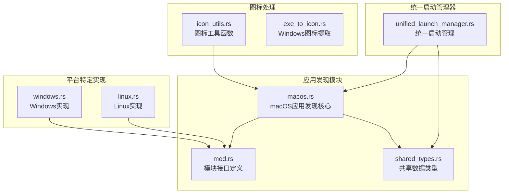
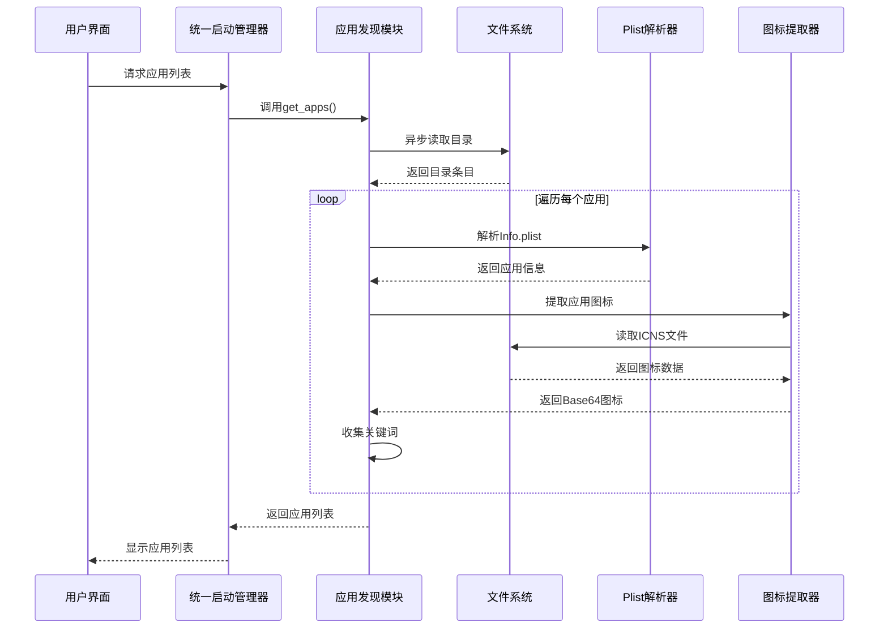
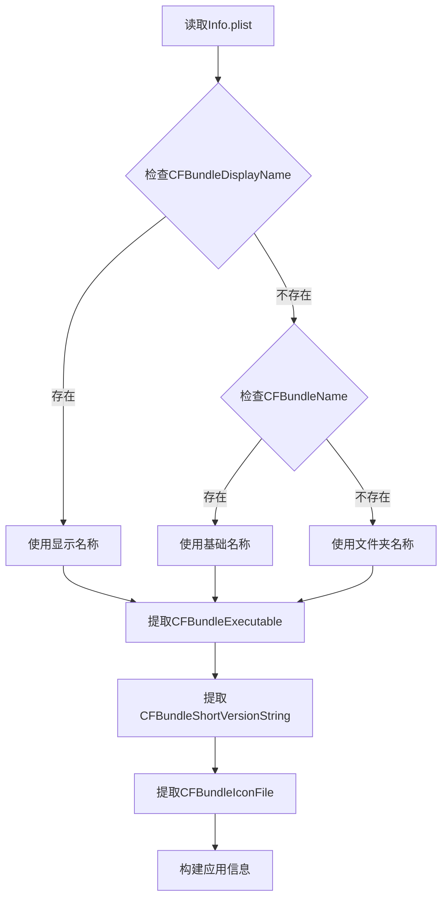
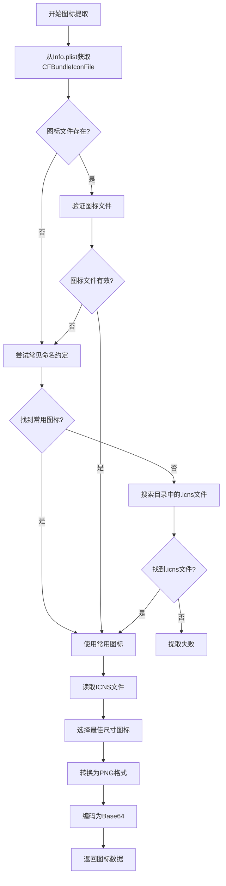
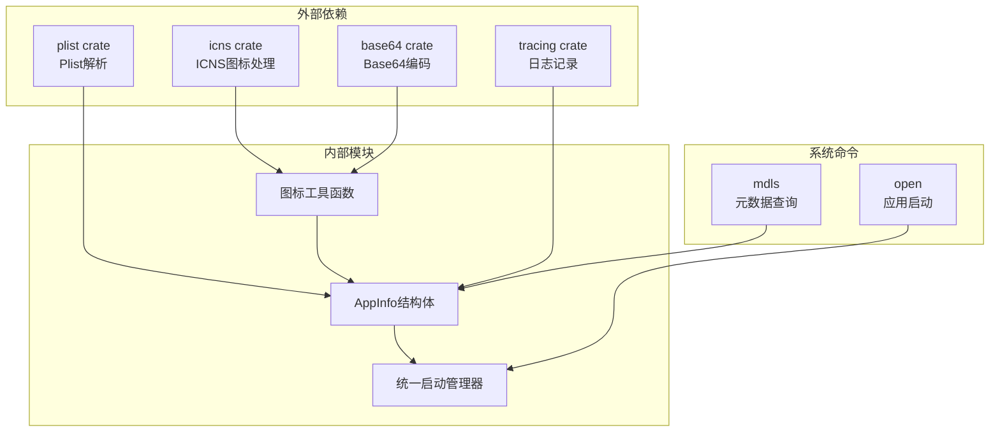

# macOS应用发现机制详细文档

<cite>
**本文档引用的文件**
- [src-tauri/src/installed_apps/macos.rs](file://src-tauri/src/installed_apps/macos.rs)
- [src-tauri/src/installed_apps/mod.rs](file://src-tauri/src/installed_apps/mod.rs)
- [src-tauri/src/shared_types.rs](file://src-tauri/src/shared_types.rs)
- [src-tauri/src/icon_utils.rs](file://src-tauri/src/icon_utils.rs)
- [src-tauri/src/lib.rs](file://src-tauri/src/lib.rs)
- [src-tauri/src/unified_launch_manager.rs](file://src-tauri/src/unified_launch_manager.rs)
- [src-tauri/Cargo.toml](file://src-tauri/Cargo.toml)
- [src-tauri/src/installed_apps/windows.rs](file://src-tauri/src/installed_apps/windows.rs)
- [src-tauri/src/installed_apps/linux.rs](file://src-tauri/src/installed_apps/linux.rs)
</cite>

## 目录
1. [简介](#简介)
2. [项目结构概览](#项目结构概览)
3. [核心组件分析](#核心组件分析)
4. [架构概览](#架构概览)
5. [详细组件分析](#详细组件分析)
6. [依赖关系分析](#依赖关系分析)
7. [性能考虑](#性能考虑)
8. [故障排除指南](#故障排除指南)
9. [结论](#结论)

## 简介

Baize是一个基于Tauri框架构建的桌面应用程序，其macOS平台的应用发现机制是一个复杂而精密的系统，负责扫描系统标准应用目录、解析Info.plist文件、提取应用信息和图标，并支持多种来源的应用程序。该机制能够识别从App Store下载的应用、通过Homebrew安装的应用以及用户手动放置的应用程序。

## 项目结构概览

Baize项目采用模块化设计，应用发现功能主要集中在以下关键文件中：



**图表来源**
- [src-tauri/src/installed_apps/macos.rs](file://src-tauri/src/installed_apps/macos.rs#L1-L352)
- [src-tauri/src/installed_apps/mod.rs](file://src-tauri/src/installed_apps/mod.rs#L1-L72)

**章节来源**
- [src-tauri/src/installed_apps/macos.rs](file://src-tauri/src/installed_apps/macos.rs#L1-L50)
- [src-tauri/src/installed_apps/mod.rs](file://src-tauri/src/installed_apps/mod.rs#L1-L30)

## 核心组件分析

### AppInfo结构体

AppInfo是应用发现机制的核心数据结构，定义了应用程序的基本信息：

```rust
#[derive(serde::Serialize, Clone, Debug)]
pub struct AppInfo {
    pub name: String,           // 应用名称
    pub keywords: Vec<String>,  // 关键词列表
    pub path: Option<String>,   // 应用路径
    pub icon: Option<String>,   // Base64编码的图标
    #[cfg(target_os = "windows")]
    pub origin: Option<AppOrigin>, // 应用来源（Windows特有）
    #[cfg(not(target_os = "windows"))]
    #[serde(skip_serializing)]
    pub origin: Option<AppOrigin>, // macOS/Linux不序列化此字段
}
```

### 应用发现流程

应用发现过程遵循以下步骤：

1. **目录扫描**：扫描系统标准应用目录
2. **应用识别**：识别.app包束
3. **Info.plist解析**：提取应用元数据
4. **本地化名称获取**：支持多语言显示
5. **图标提取**：从ICNS文件生成Base64图标
6. **关键词收集**：建立应用关键词索引

**章节来源**
- [src-tauri/src/installed_apps/mod.rs](file://src-tauri/src/installed_apps/mod.rs#L10-L20)
- [src-tauri/src/shared_types.rs](file://src-tauri/src/shared_types.rs#L40-L50)

## 架构概览

macOS应用发现机制采用异步架构设计，确保UI响应性和系统资源的有效利用：



**图表来源**
- [src-tauri/src/unified_launch_manager.rs](file://src-tauri/src/unified_launch_manager.rs#L1-L54)
- [src-tauri/src/installed_apps/macos.rs](file://src-tauri/src/installed_apps/macos.rs#L250-L350)

## 详细组件分析

### 目录扫描与应用识别

macOS应用发现从系统标准目录开始扫描：

```rust
pub async fn get_apps() -> Result<Vec<AppInfo>, String> {
    async_runtime::spawn_blocking(|| {
        let mut app_map = HashMap::new();
        let mut search_paths = vec![
            PathBuf::from("/System/Applications"),
            PathBuf::from("/Applications"),
        ];

        if let Ok(home_dir) = env::var("HOME") {
            search_paths.push(PathBuf::from(home_dir).join("Applications"));
        }
        
        // 遍历所有搜索路径...
    })
}
```

系统会扫描以下目录：
- `/System/Applications`：系统预装应用
- `/Applications`：用户安装的应用
- `~/Applications`：用户的个人应用目录

### Info.plist文件解析

Info.plist是macOS应用的核心配置文件，包含以下重要信息：



**图表来源**
- [src-tauri/src/installed_apps/macos.rs](file://src-tauri/src/installed_apps/macos.rs#L287-L330)

### 多语言本地化支持

系统支持多种语言的本地化名称获取：

```rust
fn get_localized_name(app_path: &Path, base_name: &str) -> Option<String> {
    let resources_path = app_path.join("Contents/Resources");
    
    // 扩展语言目录列表，包括可能的中文本地化
    let lang_dirs = [
        "zh_CN.lproj",
        "zh_Hans.lproj", 
        "zh.lproj",
        "Chinese.lproj",
        "en.lproj",
    ];
    
    for lang in &lang_dirs {
        let strings_path = resources_path.join(lang).join("InfoPlist.strings");
        if strings_path.exists() {
            // 尝试解析InfoPlist.strings文件
            // 支持plist格式和字符串格式
        }
    }
}
```

### 图标提取机制

图标提取是macOS应用发现中最复杂的部分，采用多阶段策略：



**图表来源**
- [src-tauri/src/installed_apps/macos.rs](file://src-tauri/src/installed_apps/macos.rs#L15-L157)

### 系统集成与命令行工具

系统利用macOS原生命令获取额外信息：

```rust
fn get_system_localized_name(app_path: &Path) -> Option<String> {
    // 使用mdls命令获取应用的本地化名称
    let output = Command::new("mdls")
        .arg("-name")
        .arg("kMDItemDisplayName")
        .arg("-raw")
        .arg(&*app_path_str)
        .output()
        .ok()?;
    
    if output.status.success() {
        let display_name = String::from_utf8_lossy(&output.stdout).trim().to_string();
        return Some(display_name);
    }
    
    None
}
```

**章节来源**
- [src-tauri/src/installed_apps/macos.rs](file://src-tauri/src/installed_apps/macos.rs#L15-L157)
- [src-tauri/src/installed_apps/macos.rs](file://src-tauri/src/installed_apps/macos.rs#L159-L201)

## 依赖关系分析

macOS应用发现机制依赖以下关键组件：



**图表来源**
- [src-tauri/Cargo.toml](file://src-tauri/Cargo.toml#L1-L71)
- [src-tauri/src/installed_apps/macos.rs](file://src-tauri/src/installed_apps/macos.rs#L1-L15)

**章节来源**
- [src-tauri/Cargo.toml](file://src-tauri/Cargo.toml#L1-L71)
- [src-tauri/src/installed_apps/macos.rs](file://src-tauri/src/installed_apps/macos.rs#L1-L15)

## 性能考虑

### 异步处理架构

macOS应用发现采用异步处理架构，避免阻塞主线程：

```rust
pub async fn get_apps() -> Result<Vec<AppInfo>, String> {
    async_runtime::spawn_blocking(|| {
        // CPU密集型任务在阻塞线程池中执行
        // 避免阻塞Tokio运行时
    })
    .await
    .map_err(|e| e.to_string())?
}
```

### 并发优化

系统使用哈希表存储应用信息，确保唯一性并提高查找效率：

```rust
let mut app_map = HashMap::new();
// 使用应用名称作为键，自动去重
app_map.insert(name, app_info);
```

### 缓存策略

虽然当前实现没有显式缓存，但系统通过以下方式优化性能：
- 延迟加载图标数据
- 优先处理存在图标的应用
- 合并重复的关键词

## 故障排除指南

### 常见问题及解决方案

1. **Info.plist文件损坏**
   ```rust
   let info_plist = match Value::from_file(&info_plist_path) {
       Ok(plist) => plist,
       Err(e) => {
           error!("[ICON] Failed to read Info.plist for {}: {}", app_path, e);
           return None;
       }
   };
   ```

2. **图标文件缺失**
   - 检查CFBundleIconFile是否正确设置
   - 验证图标文件扩展名（自动添加.icns）
   - 尝试常见图标命名约定

3. **权限问题**
   - 确保应用具有读取权限
   - 检查沙盒限制（如果适用）

4. **本地化名称获取失败**
   - 回退到系统mdls命令
   - 使用基础应用名称作为备选

### 调试技巧

启用详细日志记录以诊断问题：

```rust
info!("[ICON] Processing app: {}", app_path);
info!("[ICON] Using final icon path: {:?}", path);
error!("[ICON] No usable icon file found for {}", app_path);
```

**章节来源**
- [src-tauri/src/installed_apps/macos.rs](file://src-tauri/src/installed_apps/macos.rs#L15-L30)
- [src-tauri/src/installed_apps/macos.rs](file://src-tauri/src/installed_apps/macos.rs#L159-L180)

## 结论

Baize的macOS应用发现机制是一个高度优化的系统，具备以下特点：

1. **全面的目录支持**：覆盖系统标准目录和个人应用目录
2. **智能的Plist解析**：准确提取应用元数据
3. **强大的本地化支持**：多语言环境下的良好体验
4. **优雅的图标处理**：从ICNS到Base64的完整转换链
5. **健壮的错误处理**：完善的异常情况处理机制
6. **高性能设计**：异步架构确保UI响应性

该机制不仅能够识别各种来源的应用程序，还提供了丰富的元数据和高质量的图标，为用户提供了一个完整的应用发现和启动体验。通过模块化的架构设计和清晰的职责分离，该系统具备良好的可维护性和扩展性。