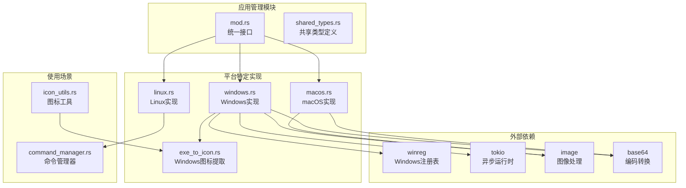
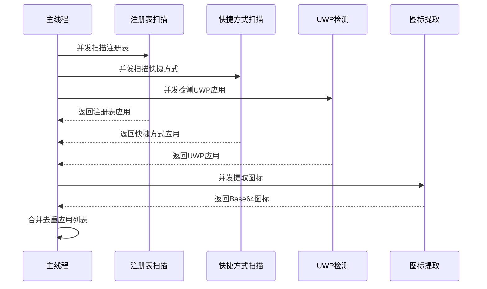
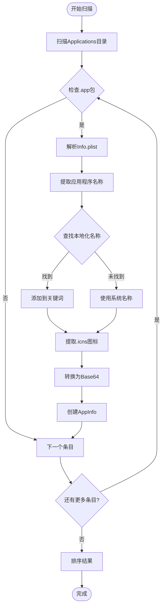
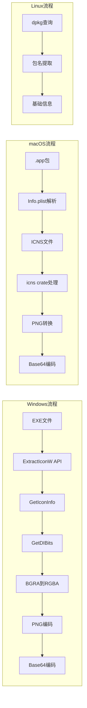
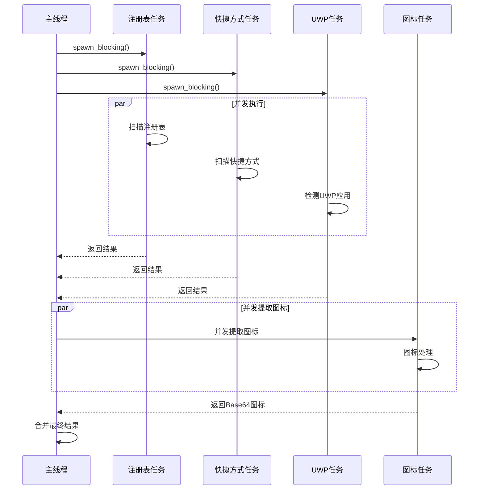
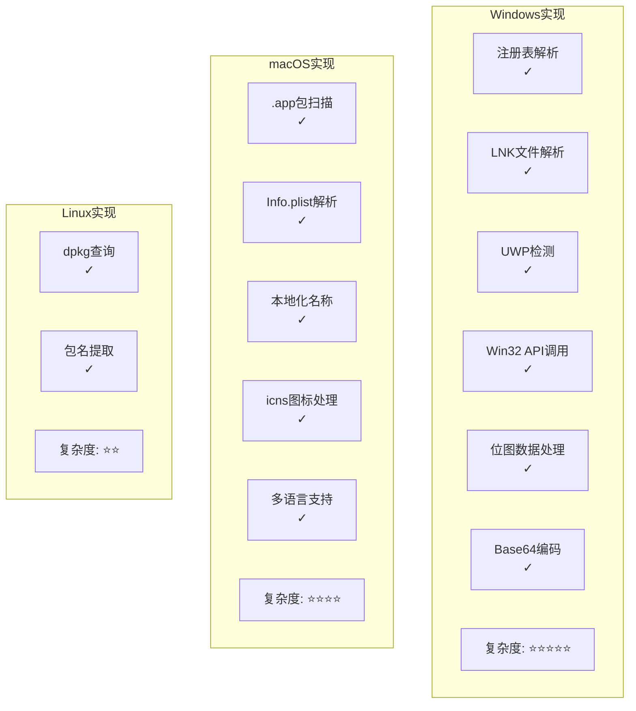

# 已安装应用管理功能详细文档

<cite>
**本文档引用的文件**
- [src-tauri/src/installed_apps/mod.rs](file://src-tauri/src/installed_apps/mod.rs)
- [src-tauri/src/installed_apps/windows.rs](file://src-tauri/src/installed_apps/windows.rs)
- [src-tauri/src/installed_apps/macos.rs](file://src-tauri/src/installed_apps/macos.rs)
- [src-tauri/src/installed_apps/linux.rs](file://src-tauri/src/installed_apps/linux.rs)
- [src-tauri/src/installed_apps/exe_to_icon.rs](file://src-tauri/src/installed_apps/exe_to_icon.rs)
- [src-tauri/src/shared_types.rs](file://src-tauri/src/shared_types.rs)
- [src-tauri/src/icon_utils.rs](file://src-tauri/src/icon_utils.rs)
- [src-tauri/Cargo.toml](file://src-tauri/Cargo.toml)
- [src-tauri/src/command_manager.rs](file://src-tauri/src/command_manager.rs)
</cite>

## 目录
1. [简介](#简介)
2. [项目架构概览](#项目架构概览)
3. [核心组件分析](#核心组件分析)
4. [跨平台应用发现机制](#跨平台应用发现机制)
5. [应用信息提取流程](#应用信息提取流程)
6. [性能优化策略](#性能优化策略)
7. [代码对比分析](#代码对比分析)
8. [故障排除指南](#故障排除指南)
9. [总结](#总结)

## 简介

Baize的已安装应用管理功能是一个高度模块化的跨平台系统，专门设计用于在不同操作系统上发现和管理已安装的应用程序。该系统通过抽象层设计，为Windows、macOS和Linux提供了统一的接口，同时针对每个平台的特性实现了专门的实现逻辑。

该功能的核心目标是：
- 自动发现系统中已安装的应用程序
- 提取应用程序的元数据（名称、路径、图标等）
- 为用户提供快速启动和访问这些应用程序的能力
- 通过缓存和异步处理优化性能

## 项目架构概览



**图表来源**
- [src-tauri/src/installed_apps/mod.rs](file://src-tauri/src/installed_apps/mod.rs#L1-L72)
- [src-tauri/src/installed_apps/windows.rs](file://src-tauri/src/installed_apps/windows.rs#L1-L50)
- [src-tauri/src/installed_apps/macos.rs](file://src-tauri/src/installed_apps/macos.rs#L1-L50)

**章节来源**
- [src-tauri/src/installed_apps/mod.rs](file://src-tauri/src/installed_apps/mod.rs#L1-L72)
- [src-tauri/src/shared_types.rs](file://src-tauri/src/shared_types.rs#L1-L128)

## 核心组件分析

### 统一接口模块（mod.rs）

`mod.rs`文件定义了整个应用管理系统的统一接口，采用条件编译的方式为不同平台提供特定的实现：

```rust
pub async fn fetch_installed_apps() -> Result<Vec<AppInfo>, String> {
    #[cfg(target_os = "windows")]
    {
        windows::get_apps().await
    }

    #[cfg(target_os = "macos")]
    {
        macos::get_apps().await
    }

    #[cfg(target_os = "linux")]
    {
        linux::get_apps()
    }

    #[cfg(not(any(target_os = "windows", target_os = "macos", target_os = "linux")))]
    {
        Err("Unsupported platform.".to_string())
    }
}
```

### 应用信息结构体

```rust
#[derive(serde::Serialize, Clone, Debug)]
pub struct AppInfo {
    pub name: String,
    pub keywords: Vec<String>,
    pub path: Option<String>,
    pub icon: Option<String>,
    #[cfg(target_os = "windows")]
    pub origin: Option<AppOrigin>,
    #[cfg(not(target_os = "windows"))]
    #[serde(skip_serializing)]
    pub origin: Option<AppOrigin>,
}
```

该结构体设计考虑了跨平台兼容性：
- `name`: 应用程序的显示名称
- `keywords`: 搜索关键词列表
- `path`: 应用程序的可执行文件路径
- `icon`: Base64编码的图标数据
- `origin`: 应用程序的来源标识（仅Windows平台）

**章节来源**
- [src-tauri/src/installed_apps/mod.rs](file://src-tauri/src/installed_apps/mod.rs#L15-L72)
- [src-tauri/src/shared_types.rs](file://src-tauri/src/shared_types.rs#L40-L55)

## 跨平台应用发现机制

### Windows平台实现

Windows平台的应用发现主要通过三个渠道进行：

#### 1. 注册表扫描

```rust
const UNINSTALL_PATHS: &[(&str, HKEY)] = &[
    (
        "SOFTWARE\\Microsoft\\Windows\\CurrentVersion\\Uninstall",
        HKEY_LOCAL_MACHINE,
    ),
    (
        "SOFTWARE\\Microsoft\\Windows\\CurrentVersion\\Uninstall",
        HKEY_CURRENT_USER,
    ),
    (
        "SOFTWARE\\Wow6432Node\\Microsoft\\Windows\\CurrentVersion\\Uninstall",
        HKEY_LOCAL_MACHINE,
    ),
];
```

注册表扫描过程包括：
- 遍历多个注册表路径
- 过滤系统组件和父级应用
- 提取应用程序名称、安装位置、卸载字符串
- 并发处理提高效率

#### 2. 快捷方式扫描

Windows平台还扫描桌面和开始菜单中的快捷方式，通过`lnk`库解析LNK文件获取目标应用程序信息。

#### 3. UWP应用检测

通过Windows Shell API检测UWP（Universal Windows Platform）应用，这些应用通常位于`shell:AppsFolder`命名空间中。



**图表来源**
- [src-tauri/src/installed_apps/windows.rs](file://src-tauri/src/installed_apps/windows.rs#L555-L630)

### macOS平台实现

macOS平台的应用发现基于`.app`包格式：

```rust
let search_paths = vec![
    PathBuf::from("/System/Applications"),
    PathBuf::from("/Applications"),
];

if let Ok(home_dir) = env::var("HOME") {
    search_paths.push(PathBuf::from(home_dir).join("Applications"));
}
```

macOS实现的关键特性：
- 扫描系统和用户级别的Applications目录
- 解析Info.plist文件获取应用程序信息
- 处理多语言本地化名称
- 从.icns图标文件提取图标数据



**图表来源**
- [src-tauri/src/installed_apps/macos.rs](file://src-tauri/src/installed_apps/macos.rs#L259-L350)

### Linux平台实现

Linux平台的实现相对简单，主要通过系统包管理器查询已安装的应用：

```rust
pub fn get_apps() -> Result<Vec<(String, Option<String>)>, String> {
    let output = Command::new("sh")
        .arg("-c")
        .arg("dpkg --get-selections")
        .output()
        .map_err(|e| e.to_string())?;

    let stdout = String::from_utf8_lossy(&output.stdout);
    let apps: Vec<(String, Option<String>)> = stdout
        .lines()
        .filter_map(|line| {
            line.split_whitespace()
                .next()
                .map(|s| (s.to_string(), None))
        })
        .collect();

    Ok(apps)
}
```

Linux实现的特点：
- 使用dpkg包管理器查询已安装软件
- 提供基本的应用名称和状态信息
- 不支持复杂的图标提取和本地化处理

**章节来源**
- [src-tauri/src/installed_apps/windows.rs](file://src-tauri/src/installed_apps/windows.rs#L1-L100)
- [src-tauri/src/installed_apps/macos.rs](file://src-tauri/src/installed_apps/macos.rs#L1-L100)
- [src-tauri/src/installed_apps/linux.rs](file://src-tauri/src/installed_apps/linux.rs#L1-L30)

## 应用信息提取流程

### Windows图标提取机制

Windows平台的图标提取是最复杂的部分，涉及Win32 API调用：

```rust
pub fn extract_icon_from_exe(exe_path: &str) -> Option<String> {
    unsafe {
        let h_path = HSTRING::from(exe_path);
        let c_path = PCWSTR(h_path.as_ptr());
        
        let hicon = ExtractIconW(None, c_path, 0);
        if hicon.is_invalid() {
            return None;
        }
        
        let mut icon_info = ICONINFO::default();
        if GetIconInfo(hicon, &mut icon_info).is_err() {
            let _ = DestroyIcon(hicon);
            return None;
        }
        
        let bitmap_data = extract_bitmap_data(icon_info.hbmColor)?;
        let _ = DestroyIcon(hicon);
        
        bitmap_to_base64(bitmap_data)
    }
}
```

关键步骤：
1. **API调用**: 使用Windows Shell API提取图标句柄
2. **位图数据提取**: 通过GetDIBits获取原始位图数据
3. **格式转换**: 将BGRA格式转换为RGBA格式
4. **PNG编码**: 使用image crate将图像编码为PNG
5. **Base64编码**: 最终转换为Base64字符串

### macOS图标提取机制

macOS使用icns crate处理图标文件：

```rust
fn get_app_icon(app_path: &str) -> Option<String> {
    let info_plist_path = Path::new(app_path).join("Contents/Info.plist");
    let info_plist = match Value::from_file(&info_plist_path) {
        Ok(plist) => plist,
        Err(e) => return None,
    };
    
    // 1. 尝试从Info.plist获取图标路径
    // 2. 检查常见图标文件名
    // 3. 查找目录中的第一个.icns文件
    // 4. 使用最佳分辨率的图标元素
    // 5. 转换为PNG并编码为Base64
}
```

### 图标提取流程对比



**图表来源**
- [src-tauri/src/installed_apps/exe_to_icon.rs](file://src-tauri/src/installed_apps/exe_to_icon.rs#L1-L50)
- [src-tauri/src/installed_apps/macos.rs](file://src-tauri/src/installed_apps/macos.rs#L10-L160)

**章节来源**
- [src-tauri/src/installed_apps/exe_to_icon.rs](file://src-tauri/src/installed_apps/exe_to_icon.rs#L1-L213)
- [src-tauri/src/installed_apps/macos.rs](file://src-tauri/src/installed_apps/macos.rs#L10-L160)

## 性能优化策略

### 并发处理机制

所有平台都采用了并发处理来提高性能：

#### Windows平台的并发优化

```rust
let apps: Vec<AppInfo> = futures::stream::iter(futures)
    .buffer_unordered(num_cpus::get() * 2)
    .filter_map(|res| async move {
        match res {
            Ok(Ok(Some(app))) => Some(app),
            Ok(Ok(None)) => None,
            Ok(Err(e)) => {
                tracing::error!("get_apps_from_hkey: Blocking task failed: {:?}", e);
                None
            }
            Err(e) => {
                tracing::error!("get_apps_from_hkey: Join error: {:?}", e);
                None
            }
        }
    })
    .collect()
    .await;
```

优化特点：
- 使用`tokio::task::spawn_blocking`处理CPU密集型任务
- 通过`buffer_unordered`控制并发数量
- CPU核心数乘以2作为并发任务上限
- 错误处理和日志记录

#### 异步扫描策略



**图表来源**
- [src-tauri/src/installed_apps/windows.rs](file://src-tauri/src/installed_apps/windows.rs#L91-L140)

### 缓存机制

虽然当前实现中没有显式的缓存机制，但系统设计考虑了以下缓存优化：

1. **去重处理**: 通过HashMap确保同一应用不会重复出现
2. **优先级合并**: 不同来源的应用按优先级合并
3. **延迟加载**: 图标提取在最后阶段进行

### 内存管理

- 使用`Option<T>`避免不必要的内存分配
- 及时释放Windows API句柄
- 通过`tokio::task::spawn_blocking`避免阻塞主线程

**章节来源**
- [src-tauri/src/installed_apps/windows.rs](file://src-tauri/src/installed_apps/windows.rs#L91-L140)
- [src-tauri/src/installed_apps/macos.rs](file://src-tauri/src/installed_apps/macos.rs#L308-L350)

## 代码对比分析

### 平台实现差异

| 特性 | Windows | macOS | Linux |
|------|---------|-------|-------|
| **扫描范围** | 注册表、快捷方式、UWP | Applications目录 | dpkg包管理器 |
| **图标提取** | Win32 API + 位图处理 | icns库 + PNG转换 | 包名提取 |
| **并发处理** | 完整并发 | 完整并发 | 同步处理 |
| **本地化支持** | 有限 | 完整支持 | 无 |
| **错误处理** | 详细日志 | 详细日志 | 基础错误 |

### 实现复杂度对比



### 跨平台适配挑战

1. **API差异**: 不同平台的系统API完全不同
2. **文件格式**: 各平台的应用包格式不同
3. **图标格式**: 图标文件格式和处理方式各异
4. **并发模型**: 各平台的并发处理能力不同
5. **错误处理**: 错误处理和日志记录方式不同

**章节来源**
- [src-tauri/src/installed_apps/windows.rs](file://src-tauri/src/installed_apps/windows.rs#L1-L100)
- [src-tauri/src/installed_apps/macos.rs](file://src-tauri/src/installed_apps/macos.rs#L1-L100)
- [src-tauri/src/installed_apps/linux.rs](file://src-tauri/src/installed_apps/linux.rs#L1-L30)

## 故障排除指南

### 常见问题及解决方案

#### 1. Windows平台问题

**问题**: 注册表访问权限不足
```rust
// 解决方案：提升权限或使用备用路径
let root = RegKey::predef(*hive);
if let Ok(uninstall_key) = root.open_subkey(path) {
    // 处理正常情况
}
```

**问题**: 图标提取失败
```rust
// 解决方案：添加详细错误日志
let hicon = ExtractIconW(None, c_path, 0);
if hicon.is_invalid() {
    let err = windows::core::Error::from_win32();
    tracing::error!("ExtractIconW failed for {}: {:?}", exe_path, err);
    return None;
}
```

#### 2. macOS平台问题

**问题**: Info.plist文件缺失
```rust
let info_plist_path = Path::new(app_path).join("Contents/Info.plist");
let info_plist = match Value::from_file(&info_plist_path) {
    Ok(plist) => plist,
    Err(e) => {
        error!("[ICON] Failed to read Info.plist for {}: {}", app_path, e);
        return None;
    }
};
```

#### 3. Linux平台问题

**问题**: 包管理器不可用
```rust
let output = Command::new("sh")
    .arg("-c")
    .arg("dpkg --get-selections")
    .output();
    
if !output.status.success() {
    // 使用其他包管理器或提供默认响应
}
```

### 调试技巧

1. **启用详细日志**: 使用`tracing`宏记录详细的操作步骤
2. **错误传播**: 保留原始错误信息以便调试
3. **条件编译**: 使用`#[cfg(debug_assertions)]`添加调试代码
4. **单元测试**: 为关键函数编写单元测试

**章节来源**
- [src-tauri/src/installed_apps/windows.rs](file://src-tauri/src/installed_apps/windows.rs#L30-L50)
- [src-tauri/src/installed_apps/macos.rs](file://src-tauri/src/installed_apps/macos.rs#L10-L30)

## 总结

Baize的已安装应用管理功能展现了优秀的跨平台设计原则：

### 设计优势

1. **模块化架构**: 通过`mod.rs`提供统一接口，各平台实现具体逻辑
2. **性能优化**: 全面采用并发处理和异步编程
3. **错误处理**: 完善的错误处理和日志记录机制
4. **扩展性**: 易于添加新的平台支持

### 技术亮点

- **Windows**: 完整的Win32 API集成，复杂的位图数据处理
- **macOS**: 多语言本地化支持，完整的.icns图标处理
- **Linux**: 简洁高效的包管理器集成

### 改进建议

1. **缓存机制**: 添加应用信息缓存以减少重复扫描
2. **增量更新**: 实现应用列表的增量更新机制
3. **配置选项**: 提供用户自定义扫描路径的功能
4. **性能监控**: 添加性能指标收集和监控

该系统为Baize提供了强大的应用发现和管理能力，是跨平台桌面应用开发的优秀范例。通过合理的抽象设计和平台特定优化，成功解决了跨平台开发中的诸多挑战。