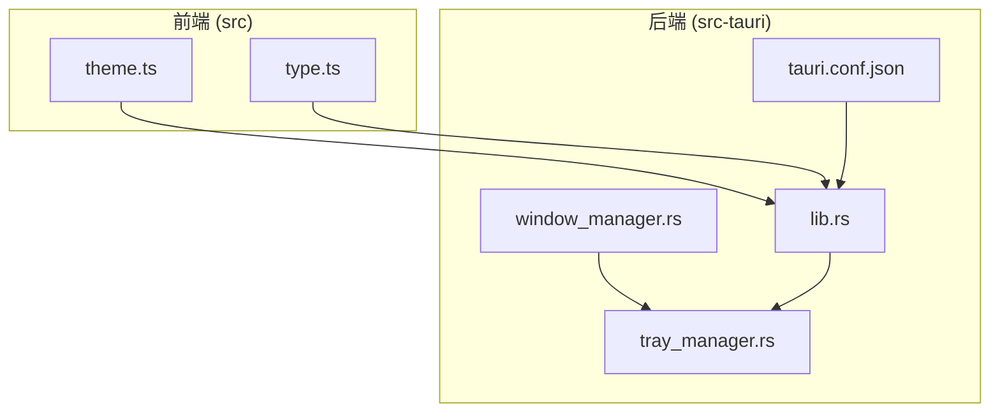
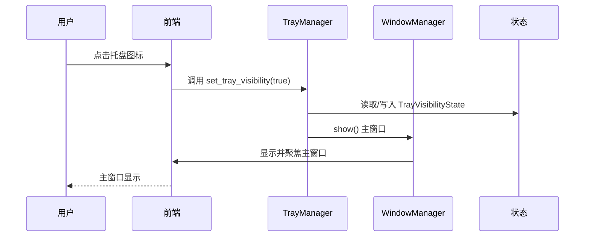
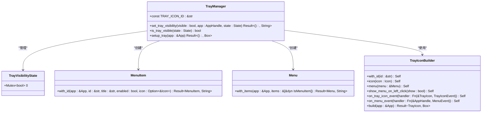
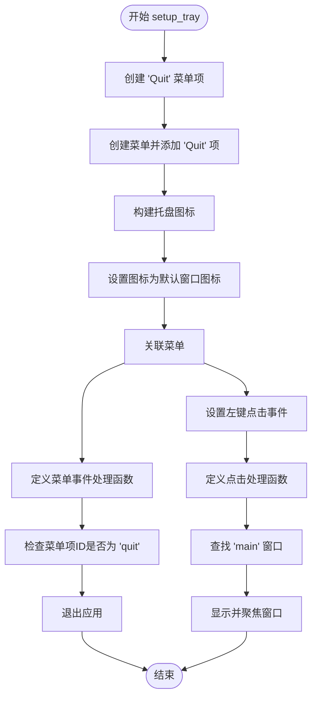
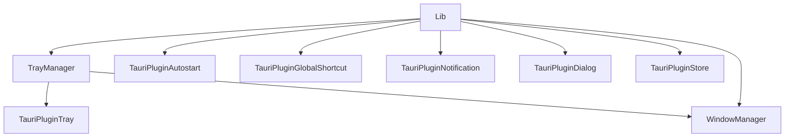

# 托盘管理

<cite>
**本文档中引用的文件**  
- [tray_manager.rs](file://src-tauri/src/tray_manager.rs)
- [lib.rs](file://src-tauri/src/lib.rs)
- [window_manager.rs](file://src-tauri/src/window_manager.rs)
- [tauri.conf.json](file://src-tauri/tauri.conf.json)
- [theme.ts](file://src/lib/utils/theme.ts)
- [type.ts](file://src/lib/type.ts)
</cite>

## 目录
1. [简介](#简介)
2. [项目结构](#项目结构)
3. [核心组件](#核心组件)
4. [架构概述](#架构概述)
5. [详细组件分析](#详细组件分析)
6. [依赖分析](#依赖分析)
7. [性能考虑](#性能考虑)
8. [故障排除指南](#故障排除指南)
9. [结论](#结论)

## 简介
本文档详细介绍了 Baize 应用程序中托盘管理功能的实现。该功能基于 Tauri 框架的 `tauri-plugin-tray` 插件，实现了系统托盘图标的创建、显示、隐藏、菜单管理和与主窗口的交互。文档将深入解析托盘图标的生命周期管理、右键菜单的构建逻辑、与窗口管理器的协同工作机制，以及在不同操作系统上的适配策略。

## 项目结构
Baize 项目的托盘管理功能主要集中在 `src-tauri` 目录下，特别是 `src` 子目录中的 Rust 模块。核心逻辑由 `tray_manager.rs` 文件实现，其状态被 `lib.rs` 中的主应用构建器所管理。前端主题切换逻辑位于 `src/lib/utils/theme.ts`，而应用的整体配置（如图标资源）则定义在 `tauri.conf.json` 中。

**图示来源**
- [tray_manager.rs](file://src-tauri/src/tray_manager.rs#L1-L66)
- [lib.rs](file://src-tauri/src/lib.rs#L1-L234)
- [window_manager.rs](file://src-tauri/src/window_manager.rs#L1-L222)
- [tauri.conf.json](file://src-tauri/tauri.conf.json#L1-L60)
- [theme.ts](file://src/lib/utils/theme.ts#L1-L59)

## 核心组件
托盘管理功能的核心组件包括：
- **`TrayManager`**: 负责创建和管理托盘图标，提供设置可见性和构建菜单的命令。
- **`TrayVisibilityState`**: 一个全局状态，用于持久化托盘图标的显示/隐藏状态。
- **`WindowManager`**: 与托盘管理器协同工作，处理主窗口的显示、隐藏和焦点事件。
- **`Theme`**: 前端定义的枚举，用于管理亮色、暗色和系统主题。

**组件来源**
- [tray_manager.rs](file://src-tauri/src/tray_manager.rs#L10-L66)
- [lib.rs](file://src-tauri/src/lib.rs#L1-L234)
- [window_manager.rs](file://src-tauri/src/window_manager.rs#L1-L222)
- [type.ts](file://src/lib/type.ts#L35-L40)

## 架构概述
Baize 的托盘管理功能采用模块化设计，各组件职责分明。`lib.rs` 作为应用的入口，负责初始化所有插件和管理器，并将 `TrayVisibilityState` 注册为全局状态。`tray_manager.rs` 封装了所有与托盘相关的逻辑，通过 Tauri 命令暴露给前端。当用户与托盘图标交互时，事件会触发相应的命令，这些命令会读取或修改全局状态，并调用 `WindowManager` 来控制主窗口。

**图示来源**
- [tray_manager.rs](file://src-tauri/src/tray_manager.rs#L20-L66)
- [lib.rs](file://src-tauri/src/lib.rs#L75-L104)
- [window_manager.rs](file://src-tauri/src/window_manager.rs#L1-L222)

## 详细组件分析

### 托盘管理器分析
`tray_manager.rs` 是实现托盘功能的核心模块。它定义了 `TRAY_ICON_ID` 作为托盘图标的唯一标识符，并通过 `TrayVisibilityState` 结构体使用 `Mutex` 来安全地在多线程环境中共享托盘的可见性状态。

#### 托盘管理器类图

**图示来源**
- [tray_manager.rs](file://src-tauri/src/tray_manager.rs#L1-L66)

#### 托盘初始化流程

**图示来源**
- [tray_manager.rs](file://src-tauri/src/tray_manager.rs#L39-L66)

### 窗口管理器分析
托盘管理器与 `window_manager.rs` 紧密协作。当用户左键点击托盘图标时，`setup_tray` 函数中的事件处理器会调用 `window.show()` 和 `window.set_focus()` 来重新打开主窗口。这确保了用户可以通过托盘图标快速访问应用。

**组件来源**
- [tray_manager.rs](file://src-tauri/src/tray_manager.rs#L50-L58)
- [window_manager.rs](file://src-tauri/src/window_manager.rs#L1-L222)

### 主题适配分析
虽然当前代码中托盘图标的主题切换逻辑尚未完全实现，但项目已具备基础。`tauri.conf.json` 配置了多种尺寸的图标，包括 `128x128@2x.png`，这通常用于高DPI或暗色模式。前端通过 `theme.ts` 管理主题状态，并将 `Theme` 枚举定义在 `type.ts` 中。未来可以通过监听主题变化，并调用 `set_tray_icon` 命令来动态切换不同主题的图标。

**组件来源**
- [tauri.conf.json](file://src-tauri/tauri.conf.json#L50-L55)
- [theme.ts](file://src/lib/utils/theme.ts#L1-L59)
- [type.ts](file://src/lib/type.ts#L35-L40)

## 依赖分析
托盘管理功能依赖于多个 Tauri 插件和核心模块。`tauri-plugin-tray` 提供了创建和管理托盘图标的底层 API。`tauri-plugin-autostart` 允许应用开机自启，这与托盘应用的常见行为相符。`tray_manager` 模块直接依赖于 `window_manager` 来控制主窗口，并通过 `lib.rs` 中的 `Builder::manage` 方法与全局状态系统集成。

**图示来源**
- [Cargo.toml](file://src-tauri/Cargo.toml#L1-L70)
- [lib.rs](file://src-tauri/src/lib.rs#L1-L234)
- [tray_manager.rs](file://src-tauri/src/tray_manager.rs#L1-L66)

## 性能考虑
托盘管理功能的性能开销极低。`setup_tray` 函数仅在应用启动时执行一次，创建一个轻量级的系统托盘图标。状态管理使用 `Mutex`，在单次读写操作中具有很高的效率。与主窗口的交互是直接的，不涉及复杂的计算或网络请求。整体上，该功能对应用性能的影响可以忽略不计。

## 故障排除指南
- **托盘图标不显示**: 检查 `tauri.conf.json` 中的 `icon` 字段是否正确配置了有效的图标路径。确保 `setup_tray` 函数在 `lib.rs` 的 `setup` 回调中被调用。
- **托盘菜单点击无响应**: 确认 `on_menu_event` 回调函数中的事件ID（如 "quit"）与 `MenuItem` 创建时的ID完全匹配。
- **左键点击无法打开窗口**: 检查主窗口的标签是否为 "main"，这与 `get_webview_window("main")` 调用相匹配。
- **状态不同步**: 确保 `set_tray_visibility` 命令在成功修改托盘可见性后，也正确更新了 `TrayVisibilityState` 中的 `Mutex` 值。

**组件来源**
- [tray_manager.rs](file://src-tauri/src/tray_manager.rs#L20-L66)
- [lib.rs](file://src-tauri/src/lib.rs#L1-L234)
- [tauri.conf.json](file://src-tauri/tauri.conf.json#L1-L60)

## 结论
Baize 的托盘管理功能通过 `tauri-plugin-tray` 实现了一个简洁而高效的系统托盘集成。它利用 Rust 的类型安全和并发原语（如 `Mutex`）来管理状态，并通过清晰的模块划分（`tray_manager` 和 `window_manager`）实现了功能解耦。虽然当前的主题适配功能有待完善，但项目结构已为未来的扩展（如动态图标切换）奠定了坚实的基础。该实现展示了如何在 Tauri 框架下构建一个符合现代桌面应用标准的后台驻留功能。