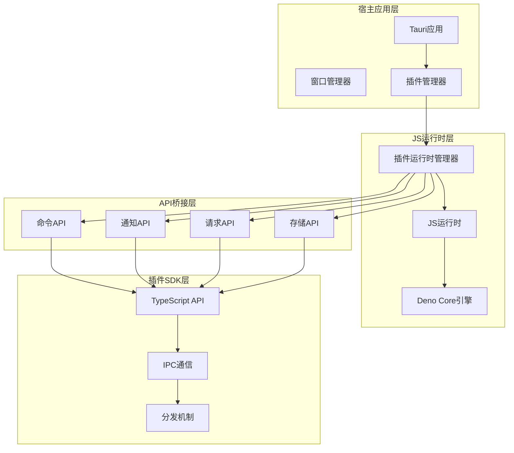
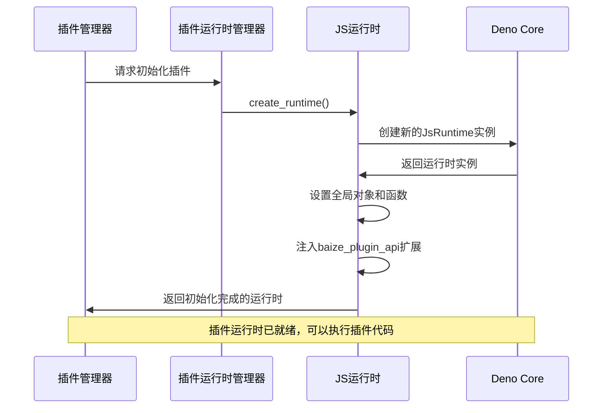
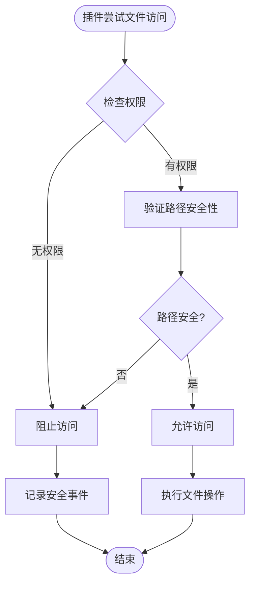
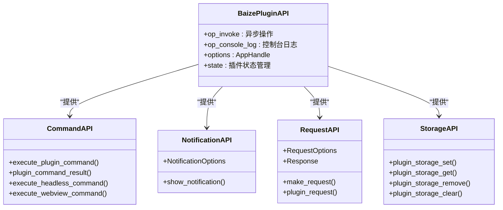
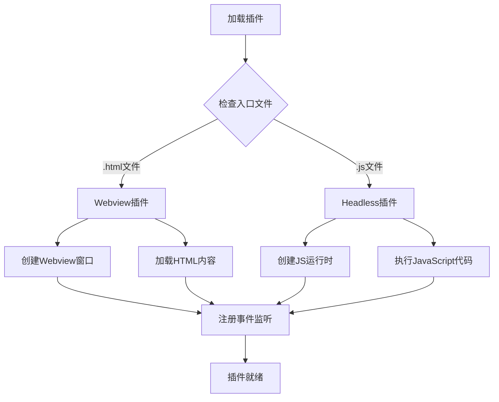
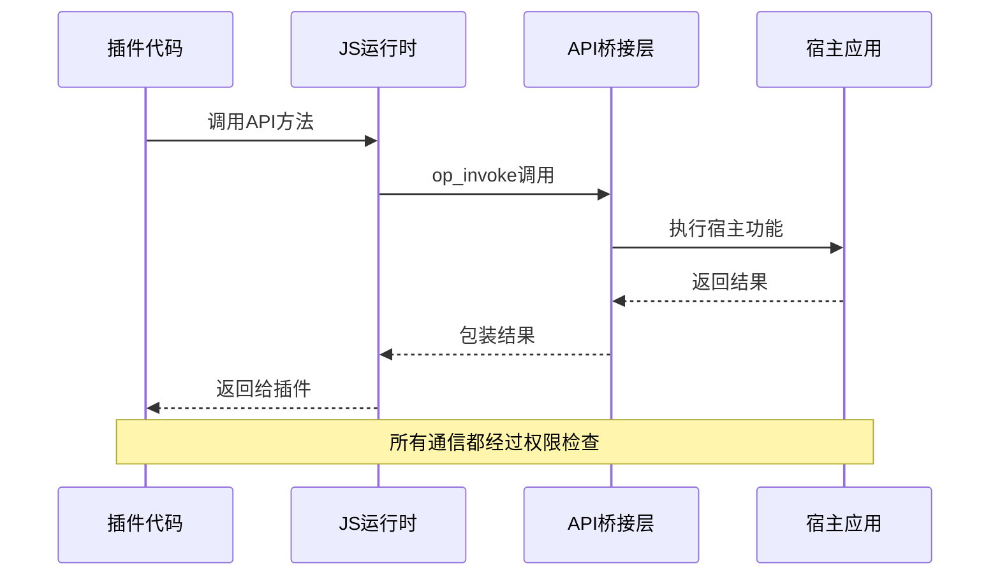

# JS运行时与沙箱机制

<cite>
**本文档引用的文件**
- [js_runtime.rs](file://src-tauri/src/js_runtime.rs)
- [plugin_api/mod.rs](file://src-tauri/src/plugin_api/mod.rs)
- [plugin_api/command.rs](file://src-tauri/src/plugin_api/command.rs)
- [plugin_api/notification.rs](file://src-tauri/src/plugin_api/notification.rs)
- [plugin_api/request.rs](file://src-tauri/src/plugin_api/request.rs)
- [plugin_api/storage.rs](file://src-tauri/src/plugin_api/storage.rs)
- [plugin_manager.rs](file://src-tauri/src/plugin_manager.rs)
- [Cargo.toml](file://src-tauri/Cargo.toml)
- [tauri.conf.json](file://src-tauri/tauri.conf.json)
- [capabilities/default.json](file://src-tauri/capabilities/default.json)
- [capabilities/plugin.json](file://src-tauri/capabilities/plugin.json)
- [plugins-sdk/src/api/command.ts](file://plugins-sdk/src/api/command.ts)
- [plugins-sdk/src/api/notification.ts](file://plugins-sdk/src/api/notification.ts)
- [plugins-sdk/src/api/request.ts](file://plugins-sdk/src/api/request.ts)
</cite>

## 目录
1. [简介](#简介)
2. [项目架构概览](#项目架构概览)
3. [JS运行时初始化机制](#js运行时初始化机制)
4. [沙箱安全边界](#沙箱安全边界)
5. [桥接API设计](#桥接api设计)
6. [插件生命周期管理](#插件生命周期管理)
7. [安全通信机制](#安全通信机制)
8. [性能优化考虑](#性能优化考虑)
9. [故障排除指南](#故障排除指南)
10. [总结](#总结)

## 简介

本文档详细分析了基于Deno Core构建的JS运行时环境及其沙箱安全机制。该系统通过精心设计的安全架构，确保插件代码无法直接访问宿主应用的敏感资源或系统API，同时提供必要的功能接口供插件使用。

系统的核心设计理念是在完全隔离的JavaScript执行环境中运行第三方插件代码，通过严格控制的API桥接层实现安全的功能调用。这种设计有效防止了恶意插件对宿主系统的潜在威胁，同时保持了良好的开发体验和功能完整性。

## 项目架构概览

系统采用分层架构设计，主要包含以下核心组件：



**图表来源**
- [js_runtime.rs](file://src-tauri/src/js_runtime.rs#L1-L50)
- [plugin_manager.rs](file://src-tauri/src/plugin_manager.rs#L1-L50)

## JS运行时初始化机制

### 运行时创建流程

JS运行时的初始化是一个精心设计的过程，确保每个插件都在完全隔离的环境中运行：



**图表来源**
- [js_runtime.rs](file://src-tauri/src/js_runtime.rs#L100-L150)

### 运行时配置选项

`create_runtime`函数负责创建配置完整的JS运行时实例：

```rust
pub fn create_runtime(app_handle: &AppHandle) -> Result<JsRuntime, String> {
    let ext = baize_plugin_api::init(app_handle.clone());
    
    let mut runtime = JsRuntime::new(RuntimeOptions {
        extensions: vec![ext],
        ..Default::default()
    });
    
    // 设置全局对象和函数
    let global_setup = r#"
        // 重写console.log以使用我们的op
        globalThis.console = {
            log: (...args) => {
                const message = args.map(arg => 
                    typeof arg === 'object' ? JSON.stringify(arg) : String(arg)
                ).join(' ');
                Deno.core.ops.op_console_log(message);
            },
            error: (...args) => {
                const message = '[ERROR] ' + args.map(arg => 
                    typeof arg === 'object' ? JSON.stringify(arg) : String(arg)
                ).join(' ');
                Deno.core.ops.op_console_log(message);
            }
        };
    "#;
    
    runtime.execute_script("<global_setup>", global_setup.to_string())
        .map_err(|e| e.to_string())?;
    
    Ok(runtime)
}
```

**节来源**
- [js_runtime.rs](file://src-tauri/src/js_runtime.rs#L100-L150)

### 沙箱边界设置

系统通过多种机制确保沙箱边界的有效性：

1. **默认禁用系统API访问**：运行时不包含任何系统级API的直接访问权限
2. **受限的全局对象**：只注入必要的全局变量和函数
3. **操作符（ops）隔离**：通过Deno Core的操作系统实现安全的IPC调用
4. **权限检查机制**：所有外部调用都经过严格的权限验证

## 沙箱安全边界

### 文件系统访问控制

沙箱环境默认禁用对宿主文件系统的直接访问：



### 网络请求限制

网络访问受到严格控制，必须在插件清单中明确定义权限：

```rust
// 权限检查示例
async fn check_network_permission(
    app: &AppHandle,
    plugin_store: &State<'_, PluginStore>,
    plugin_id: &str,
    url: &str,
) -> Result<(), RequestError> {
    // 解析请求的URL
    let request_url = Url::parse(url)?;
    
    // 获取插件信息并检查权限
    let plugin = get_plugin_by_id(plugin_store, plugin_id)?;
    
    if let Some(permissions) = &plugin.manifest.permissions {
        if let Some(network_permissions) = &permissions.network {
            for permission in network_permissions {
                if is_url_allowed(&request_url, permission) {
                    return Ok(());
                }
            }
        }
    }
    
    Err(RequestError::from("Permission denied"))
}
```

### 进程执行控制

系统完全禁止插件执行外部进程，这是沙箱安全的重要组成部分：

- **进程创建**：不允许使用`child_process`或其他方式创建新进程
- **系统调用**：不暴露任何系统级API给插件
- **内存访问**：插件无法直接访问宿主应用的内存空间

**节来源**
- [plugin_api/request.rs](file://src-tauri/src/plugin_api/request.rs#L150-L200)

## 桥接API设计

### API扩展架构

系统通过Deno Core的扩展机制提供安全的API接口：



**图表来源**
- [js_runtime.rs](file://src-tauri/src/js_runtime.rs#L70-L100)
- [plugin_api/mod.rs](file://src-tauri/src/plugin_api/mod.rs#L1-L4)

### 操作符（Ops）系统

系统使用Deno Core的操作符机制实现安全的IPC调用：

```rust
// 异步invoke操作符
#[op2(async)]
#[serde]
async fn op_invoke(
    state: Rc<RefCell<OpState>>,
    #[string] method: String,
    #[serde] arg: serde_json::Value,
) -> InvokeResult {
    let app_handle = state.borrow().borrow::<AppHandle>().clone();
    
    match method.as_str() {
        "show_notification" => {
            // 处理通知显示
            match plugin_api::notification::show_notification(app_handle, options) {
                Ok(_) => InvokeResult::Ok { value: serde_json::Value::Null },
                Err(e) => InvokeResult::Err { error: e },
            }
        }
        "plugin_request" => {
            // 处理HTTP请求
            match plugin_api::request::make_request(app_handle, options).await {
                Ok(response) => InvokeResult::Ok { value: response },
                Err(e) => InvokeResult::Err { error: e },
            }
        }
        _ => InvokeResult::Err {
            error: "unknown method".to_string(),
        },
    }
}
```

**节来源**
- [js_runtime.rs](file://src-tauri/src/js_runtime.rs#L40-L80)

### 控制台重定向机制

为了统一日志输出，系统重写了JavaScript的console对象：

```javascript
// 全局设置中的console重写
globalThis.console = {
    log: (...args) => {
        const message = args.map(arg => 
            typeof arg === 'object' ? JSON.stringify(arg) : String(arg)
        ).join(' ');
        Deno.core.ops.op_console_log(message);
    },
    error: (...args) => {
        const message = '[ERROR] ' + args.map(arg => 
            typeof arg === 'object' ? JSON.stringify(arg) : String(arg)
        ).join(' ');
        Deno.core.ops.op_console_log(message);
    }
};
```

**节来源**
- [js_runtime.rs](file://src-tauri/src/js_runtime.rs#L120-L140)

## 插件生命周期管理

### 插件类型识别

系统支持两种类型的插件：Webview插件和Headless插件：



**图表来源**
- [plugin_manager.rs](file://src-tauri/src/plugin_manager.rs#L100-L150)

### 插件初始化流程

```rust
async fn handle_init_plugin(
    runtimes: &mut HashMap<String, JsRuntime>,
    app_handle: &AppHandle,
    plugin_id: &str,
    js_code: &str,
) -> Result<(), String> {
    if runtimes.contains_key(plugin_id) {
        return Ok(()); // 已经初始化过了
    }

    let mut runtime = create_runtime(app_handle)?;

    // 执行插件初始化代码
    runtime.execute_script("<plugin_init>", js_code.to_string())
        .map_err(|e| e.to_string())?;

    // 运行事件循环完成初始化
    runtime.run_event_loop(PollEventLoopOptions::default())
        .map_err(|e| e.to_string())?;

    runtimes.insert(plugin_id.to_string(), runtime);
    println!("[Plugin] Initialized plugin runtime: {}", plugin_id);

    Ok(())
}
```

**节来源**
- [js_runtime.rs](file://src-tauri/src/js_runtime.rs#L200-L250)

### 插件命令执行

系统提供了统一的命令执行机制：

```rust
async fn handle_execute_command(
    runtimes: &mut HashMap<String, JsRuntime>,
    plugin_id: &str,
    command: &str,
    args: serde_json::Value,
) -> Result<serde_json::Value, String> {
    let runtime = runtimes
        .get_mut(plugin_id)
        .ok_or_else(|| format!("Plugin runtime not found: {}", plugin_id))?;

    // 构造调用代码
    let call_code = format!(
        r#"
        (async () => {{
            try {{
                if (typeof globalThis.__BAIZE_COMMAND_HANDLER__ === 'function') {{
                    const result = await globalThis.__BAIZE_COMMAND_HANDLER__('{}', {});
                    console.log('Command execution result:', JSON.stringify(result));
                    return result;
                }} else {{
                    throw new Error('No command handler registered');
                }}
            }} catch (error) {{
                console.error('Command execution error:', error);
                throw error;
            }}
        }})();
        "#,
        command, args
    );

    // 执行调用并返回结果
    runtime.execute_script("<command_call>", call_code)
        .map_err(|e| e.to_string())?;
        
    runtime.run_event_loop(PollEventLoopOptions::default())
        .await
        .map_err(|e| e.to_string())?;

    Ok(serde_json::Value::Null)
}
```

**节来源**
- [js_runtime.rs](file://src-tauri/src/js_runtime.rs#L250-L320)

## 安全通信机制

### IPC通信架构

系统使用双向IPC机制确保安全通信：



**图表来源**
- [js_runtime.rs](file://src-tauri/src/js_runtime.rs#L40-L80)

### 权限验证机制

每个API调用都会经过严格的权限验证：

```rust
// 权限检查示例
pub async fn execute_plugin_command(
    app: AppHandle,
    plugin_store: State<'_, PluginStore>,
    execution_store: State<'_, CommandExecutionStore>,
    plugin_id: String,
    command_name: String,
    args: Option<serde_json::Value>,
) -> Result<CommandExecutionResult, String> {
    // 获取插件信息
    let plugin = {
        let plugins = plugin_store.0.lock().unwrap();
        plugins.get(&plugin_id).cloned()
    }.ok_or_else(|| format!("Plugin '{}' not found", plugin_id))?;

    // 根据插件类型执行指令
    if is_webview_plugin {
        execute_webview_command(&app, &plugin, &command_name, args, execution_store).await
    } else {
        execute_headless_command(&app, &plugin, &command_name, args).await
    }
}
```

**节来源**
- [plugin_api/command.rs](file://src-tauri/src/plugin_api/command.rs#L20-L50)

### 错误处理与安全

系统实现了完善的错误处理机制：

```rust
// 统一的错误处理模式
match response {
    Ok(res) => {
        // 处理成功响应
        let data = match response_type {
            ResponseType::Json => res.json::<Value>().await?,
            ResponseType::Text => Value::String(res.text().await?),
            ResponseType::Arraybuffer => {
                let bytes = res.bytes().await?;
                let base64_data = general_purpose::STANDARD.encode(&bytes);
                Value::String(base64_data)
            }
        };
        Ok(data)
    }
    Err(e) => {
        // 统一错误处理
        if e.is_timeout() {
            Err(format!("Request timed out after {}ms", timeout))
        } else if e.is_connect() {
            Err("Network connection error".to_string())
        } else {
            Err(e.to_string())
        }
    }
}
```

**节来源**
- [plugin_api/request.rs](file://src-tauri/src/plugin_api/request.rs#L80-L120)

## 性能优化考虑

### 运行时池管理

系统使用运行时池来提高性能：

```rust
// 运行时管理器结构
pub struct PluginRuntimeManager {
    sender: mpsc::UnboundedSender<PluginTask>,
}

// 在专用线程中运行JS运行时
std::thread::spawn(move || {
    let rt = tokio::runtime::Builder::new_current_thread()
        .enable_all()
        .build()
        .unwrap();

    rt.block_on(async {
        let mut runtimes: HashMap<String, JsRuntime> = HashMap::new();
        
        while let Some(task) = receiver.recv().await {
            // 处理插件任务
        }
    });
});
```

**节来源**
- [js_runtime.rs](file://src-tauri/src/js_runtime.rs#L150-L200)

### 内存管理策略

- **运行时复用**：相同插件的多个实例共享同一个运行时
- **及时清理**：插件卸载时自动清理相关资源
- **内存监控**：定期检查内存使用情况

### 并发处理优化

系统使用Tokio运行时提供高效的并发处理：

```rust
// 并发任务处理
impl PluginRuntimeManager {
    pub async fn init_plugin(&self, plugin_id: String, js_code: String) -> Result<(), String> {
        let (response_tx, response_rx) = oneshot::channel();
        
        self.sender.send(PluginTask::InitPlugin {
            plugin_id,
            js_code,
            response: response_tx,
        })?;
        
        response_rx.await?
    }
}
```

**节来源**
- [js_runtime.rs](file://src-tauri/src/js_runtime.rs#L320-L350)

## 故障排除指南

### 常见问题诊断

1. **插件初始化失败**
   - 检查插件入口文件是否存在
   - 验证插件清单文件格式
   - 查看控制台日志输出

2. **API调用权限错误**
   - 检查插件清单中的权限声明
   - 验证API调用参数格式
   - 确认宿主应用权限配置

3. **运行时内存不足**
   - 监控插件内存使用情况
   - 实现运行时垃圾回收
   - 限制插件并发数量

### 调试工具

系统提供了丰富的调试功能：

```rust
// 控制台日志重定向
#[op2(fast)]
fn op_console_log(state: Rc<RefCell<OpState>>, #[string] message: String) {
    println!("[Plugin Console] {}", message);
    
    // 尝试发送到前端
    if let Ok(app_handle) = state.try_borrow().map(|s| s.borrow::<AppHandle>().clone()) {
        if let Some(window) = app_handle.get_webview_window("main") {
            let _ = window.emit("plugin_console_log", serde_json::json!({
                "message": message,
                "timestamp": chrono::Utc::now().timestamp_millis()
            }));
        }
    }
}
```

**节来源**
- [js_runtime.rs](file://src-tauri/src/js_runtime.rs#L25-L40)

### 日志分析

系统记录详细的运行时日志：

- 插件加载和初始化过程
- API调用和权限检查
- 错误发生和恢复过程
- 性能指标和资源使用

## 总结

本文档详细分析了基于Deno Core构建的JS运行时环境及其沙箱安全机制。该系统通过以下关键特性确保了安全性和功能性：

### 核心安全特性

1. **完全隔离的执行环境**：每个插件都在独立的JS运行时中运行
2. **严格的权限控制**：所有外部调用都需要明确的权限声明
3. **安全的API桥接**：通过精心设计的操作符系统实现安全通信
4. **实时监控和审计**：完整的日志记录和错误处理机制

### 技术优势

1. **高性能**：使用Tokio运行时和运行时池优化性能
2. **灵活扩展**：模块化的API设计支持功能扩展
3. **跨平台兼容**：基于Tauri框架的跨平台支持
4. **开发友好**：完善的SDK和文档支持快速开发

### 应用场景

该系统特别适用于：
- 第三方插件生态系统的构建
- 安全的代码执行环境
- 功能模块化和可扩展的应用程序
- 需要沙箱隔离的企业应用

通过这种设计，系统成功实现了在保证安全性的同时提供丰富功能的目标，为构建安全可靠的插件生态系统奠定了坚实基础。