# Baize插件系统加载机制与生命周期管理

<cite>
**本文档引用的文件**
- [plugin_manager.rs](file://src-tauri/src/plugin_manager.rs)
- [lib.rs](file://src-tauri/src/lib.rs)
- [js_runtime.rs](file://src-tauri/src/js_runtime.rs)
- [command.rs](file://src-tauri/src/plugin_api/command.rs)
- [PLUGIN_COMMAND_USAGE.md](file://PLUGIN_COMMAND_USAGE.md)
- [Cargo.toml](file://src-tauri/Cargo.toml)
</cite>

## 目录
1. [简介](#简介)
2. [项目结构概览](#项目结构概览)
3. [插件管理系统架构](#插件管理系统架构)
4. [插件加载机制详解](#插件加载机制详解)
5. [插件生命周期管理](#插件生命周期管理)
6. [插件执行环境](#插件执行环境)
7. [插件API接口设计](#插件API接口设计)
8. [错误处理与日志记录](#错误处理与日志记录)
9. [性能优化考虑](#性能优化考虑)
10. [故障排除指南](#故障排除指南)
11. [总结](#总结)

## 简介

Baize插件系统是一个高度模块化的架构，允许开发者通过插件扩展应用程序的功能。该系统采用Rust后端和TypeScript/JavaScript前端相结合的方式，提供了强大的插件加载、管理和执行能力。插件系统支持两种类型的插件：Headless（无界面）插件和Webview（带界面）插件，每种类型都有不同的执行方式和用途。

## 项目结构概览

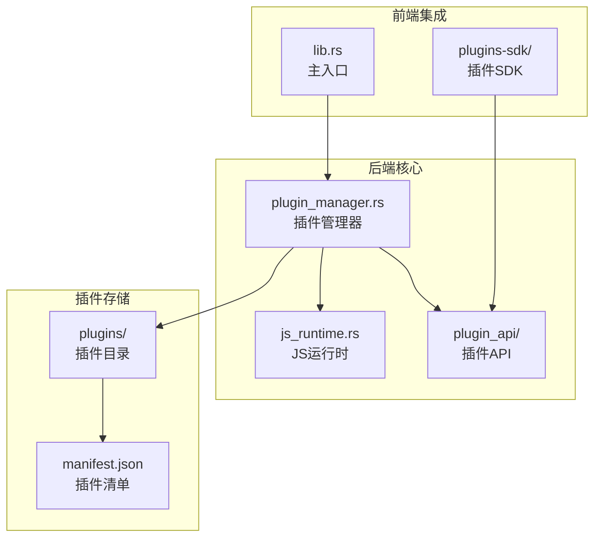

**图表来源**
- [plugin_manager.rs](file://src-tauri/src/plugin_manager.rs#L1-L327)
- [lib.rs](file://src-tauri/src/lib.rs#L1-L235)

**章节来源**
- [lib.rs](file://src-tauri/src/lib.rs#L1-L235)
- [plugin_manager.rs](file://src-tauri/src/plugin_manager.rs#L1-L327)

## 插件管理系统架构

### 核心组件关系

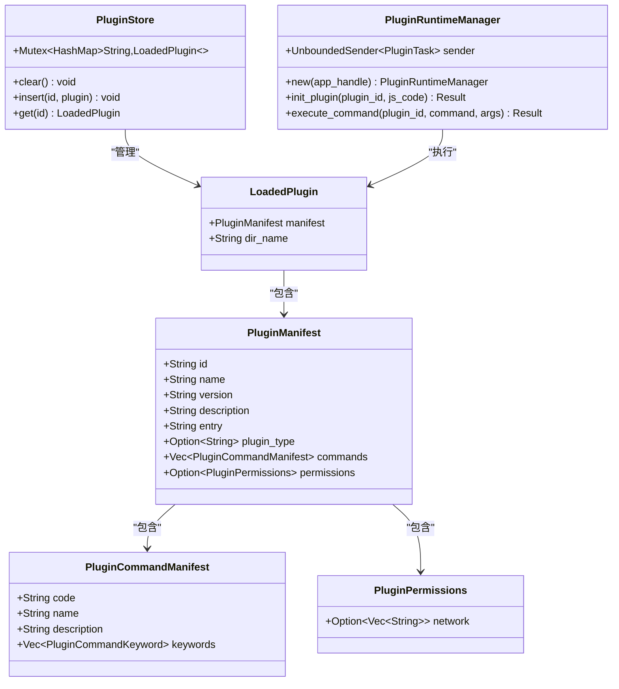

**图表来源**
- [plugin_manager.rs](file://src-tauri/src/plugin_manager.rs#L10-L50)
- [js_runtime.rs](file://src-tauri/src/js_runtime.rs#L1-L100)

### 插件类型分类

插件系统支持两种主要类型：

1. **Headless插件**：无界面插件，通过后台线程执行JavaScript代码
2. **Webview插件**：带界面插件，通过独立的WebView窗口运行

**章节来源**
- [plugin_manager.rs](file://src-tauri/src/plugin_manager.rs#L10-L50)
- [PLUGIN_COMMAND_USAGE.md](file://PLUGIN_COMMAND_USAGE.md#L1-L50)

## 插件加载机制详解

### 插件发现与扫描

插件系统在应用启动时自动扫描插件目录，实现完全的自动化插件发现机制：

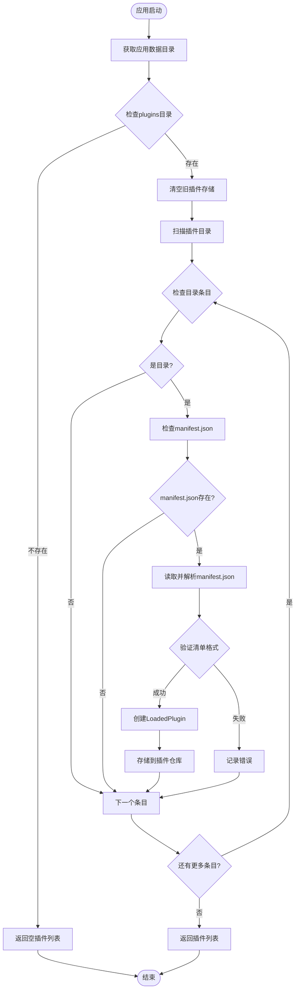

**图表来源**
- [plugin_manager.rs](file://src-tauri/src/plugin_manager.rs#L52-L90)

### 插件清单解析

每个插件必须包含一个`manifest.json`文件，该文件定义了插件的基本信息和配置：

```json
{
  "id": "com.example.myplugin",
  "name": "我的插件",
  "version": "1.0.0",
  "description": "示例插件",
  "entry": "index.js",
  "type": "headless",
  "commands": [
    {
      "code": "hello",
      "name": "问候指令",
      "description": "向用户问候",
      "keywords": [
        {"name": "hello", "type": "text"},
        {"name": "你好", "type": "text"}
      ]
    }
  ],
  "permissions": {
    "network": ["https://api.example.com"]
  }
}
```

### 插件注册流程

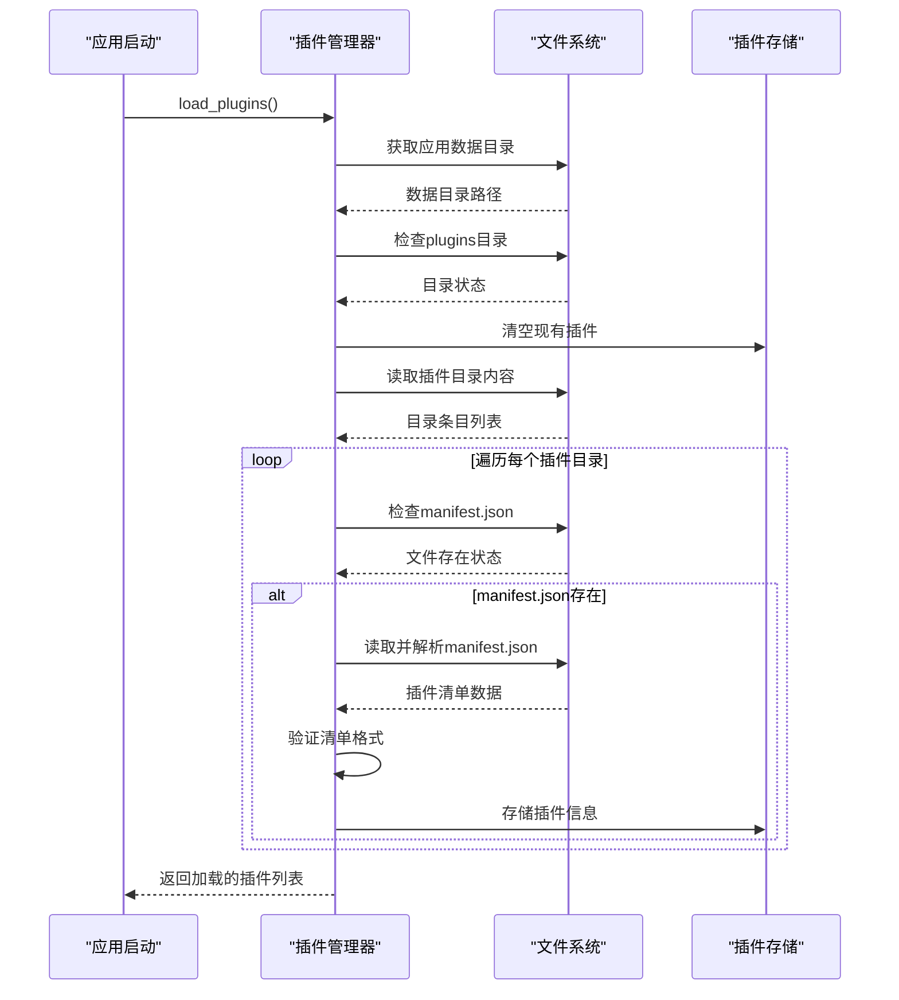

**图表来源**
- [plugin_manager.rs](file://src-tauri/src/plugin_manager.rs#L52-L90)

**章节来源**
- [plugin_manager.rs](file://src-tauri/src/plugin_manager.rs#L52-L90)
- [PLUGIN_COMMAND_USAGE.md](file://PLUGIN_COMMAND_USAGE.md#L11-L30)

## 插件生命周期管理

### 插件初始化阶段

当插件被首次执行时，系统会自动初始化插件运行时环境：

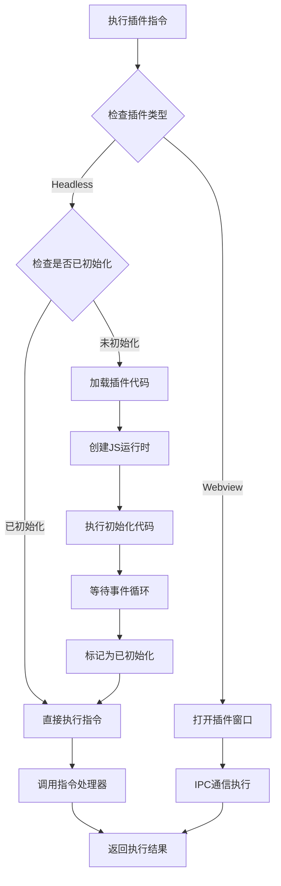

**图表来源**
- [command.rs](file://src-tauri/src/plugin_api/command.rs#L20-L60)
- [js_runtime.rs](file://src-tauri/src/js_runtime.rs#L220-L280)

### 插件运行时管理

系统使用专门的运行时管理器来处理插件的生命周期：

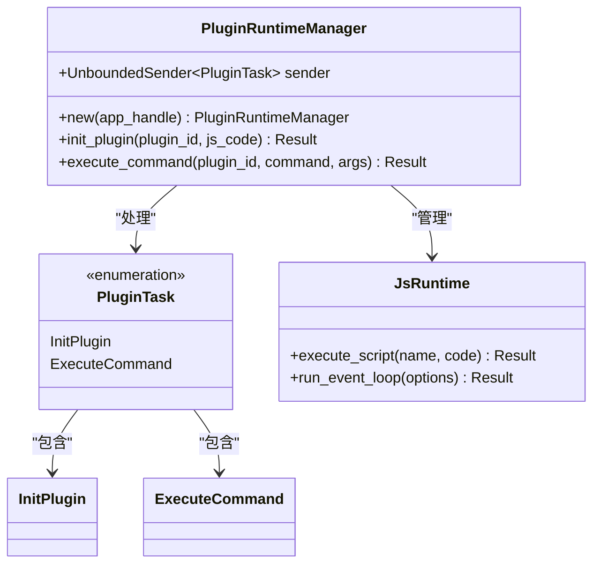

**图表来源**
- [js_runtime.rs](file://src-tauri/src/js_runtime.rs#L180-L220)

**章节来源**
- [js_runtime.rs](file://src-tauri/src/js_runtime.rs#L180-L280)
- [command.rs](file://src-tauri/src/plugin_api/command.rs#L20-L80)

## 插件执行环境

### Headless插件执行

Headless插件在后台线程中执行，不提供用户界面：

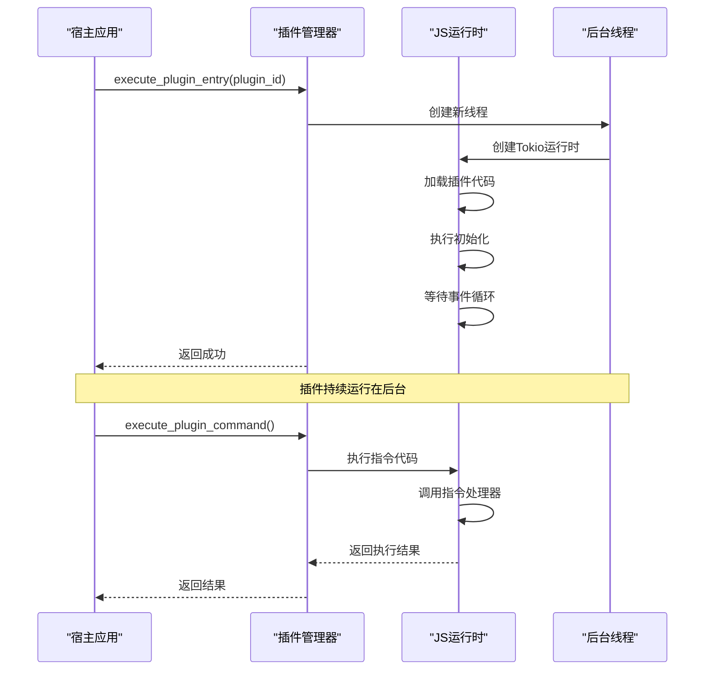

**图表来源**
- [plugin_manager.rs](file://src-tauri/src/plugin_manager.rs#L92-L130)

### Webview插件执行

Webview插件通过独立的WebView窗口运行，提供完整的用户界面：

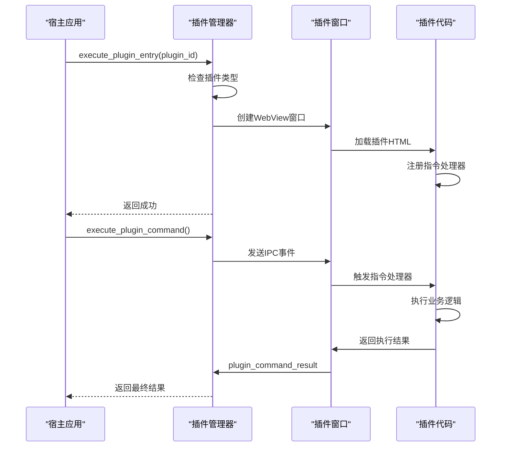

**图表来源**
- [plugin_manager.rs](file://src-tauri/src/plugin_manager.rs#L131-L170)

**章节来源**
- [plugin_manager.rs](file://src-tauri/src/plugin_manager.rs#L92-L170)

## 插件API接口设计

### 指令执行API

插件系统提供了统一的指令执行接口，支持两种执行模式：

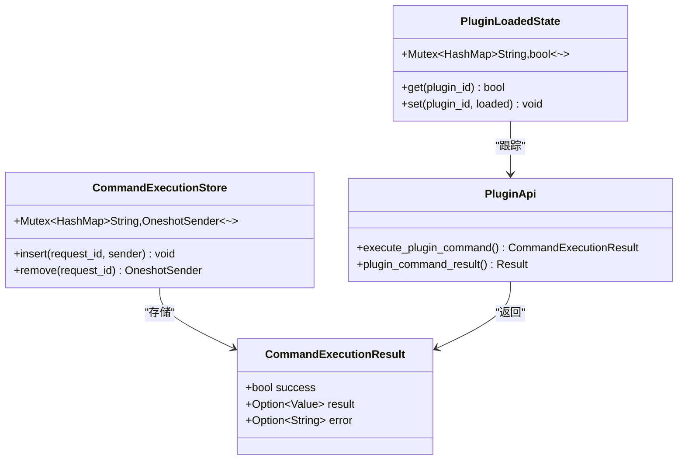

**图表来源**
- [command.rs](file://src-tauri/src/plugin_api/command.rs#L1-L20)

### 插件协议处理

系统实现了自定义的`plugin://`协议来处理插件文件请求：

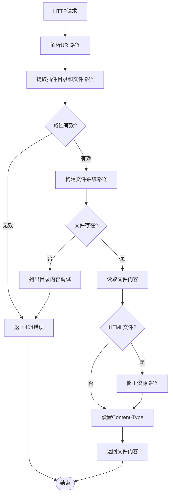

**图表来源**
- [plugin_manager.rs](file://src-tauri/src/plugin_manager.rs#L171-L250)

**章节来源**
- [command.rs](file://src-tauri/src/plugin_api/command.rs#L1-L176)
- [plugin_manager.rs](file://src-tauri/src/plugin_manager.rs#L171-L250)

## 错误处理与日志记录

### 错误处理策略

插件系统实现了多层次的错误处理机制：

1. **插件加载错误**：处理manifest.json解析失败、文件不存在等情况
2. **插件执行错误**：处理指令执行超时、处理器异常等
3. **运行时错误**：处理JS运行时异常、内存不足等

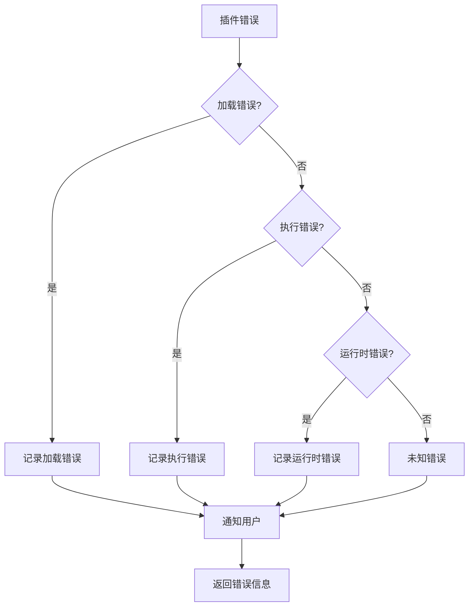

### 日志记录机制

系统在多个关键点记录详细的日志信息：

- 插件发现和加载过程
- 插件初始化状态
- 指令执行详情
- 错误发生位置和原因

**章节来源**
- [plugin_manager.rs](file://src-tauri/src/plugin_manager.rs#L52-L90)
- [js_runtime.rs](file://src-tauri/src/js_runtime.rs#L20-L50)

## 性能优化考虑

### 插件运行时优化

1. **单例运行时**：每个插件只创建一次JS运行时实例
2. **延迟初始化**：插件代码只在首次执行时加载
3. **线程池管理**：使用Tokio运行时处理异步操作
4. **内存管理**：及时清理不再使用的插件资源

### 并发处理优化

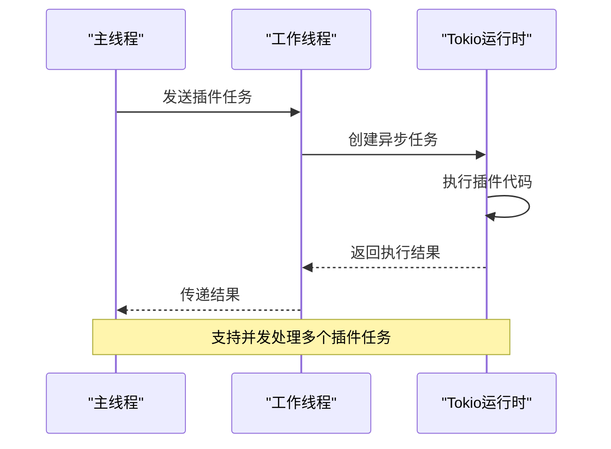

**图表来源**
- [js_runtime.rs](file://src-tauri/src/js_runtime.rs#L180-L220)

**章节来源**
- [js_runtime.rs](file://src-tauri/src/js_runtime.rs#L180-L280)

## 故障排除指南

### 常见问题及解决方案

1. **插件无法加载**
   - 检查`manifest.json`文件格式
   - 验证插件目录权限
   - 查看应用数据目录结构

2. **指令执行失败**
   - 检查插件是否正确注册了指令处理器
   - 验证指令名称和参数格式
   - 查看插件控制台输出

3. **Webview插件窗口不显示**
   - 确认插件类型设置为"webview"
   - 检查HTML文件路径
   - 验证插件窗口标签唯一性

### 调试工具和技巧

- 启用详细日志记录
- 使用浏览器开发者工具查看Webview控制台
- 检查应用数据目录中的插件文件
- 监控系统资源使用情况

**章节来源**
- [PLUGIN_COMMAND_USAGE.md](file://PLUGIN_COMMAND_USAGE.md#L180-L220)

## 总结

Baize插件系统提供了一个强大而灵活的扩展机制，通过精心设计的架构实现了插件的自动化加载、生命周期管理和高效执行。系统的主要优势包括：

1. **自动化插件发现**：无需手动配置，系统自动扫描和加载插件
2. **双模式支持**：既支持无界面的Headless插件，也支持带界面的Webview插件
3. **统一API接口**：提供一致的指令执行接口，简化插件开发
4. **完善的错误处理**：多层次的错误处理和日志记录机制
5. **性能优化**：通过运行时复用和并发处理提升性能

该插件系统为Baize应用提供了可扩展的基础架构，使开发者能够轻松地添加新功能和定制化扩展，同时保持系统的稳定性和性能。