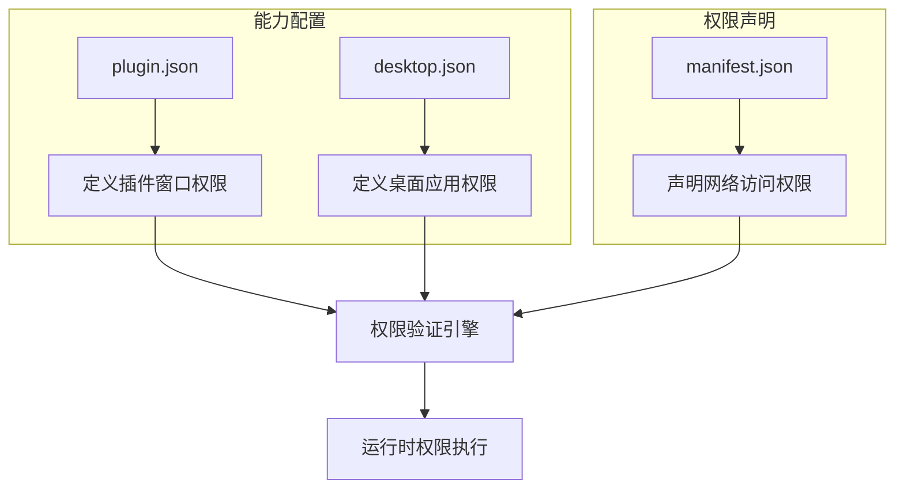
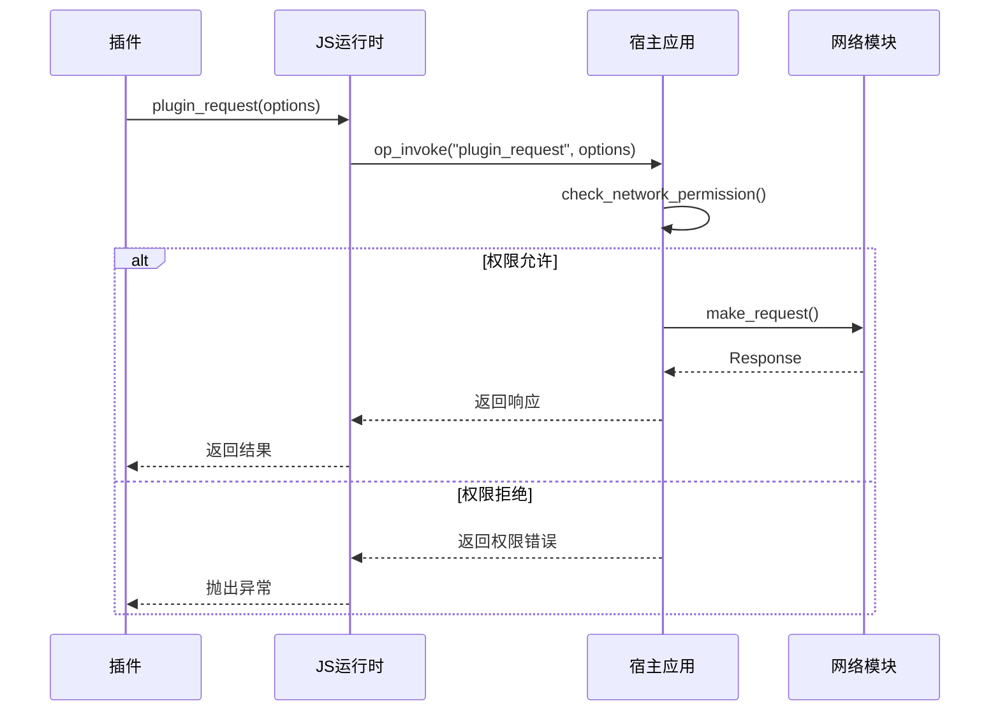
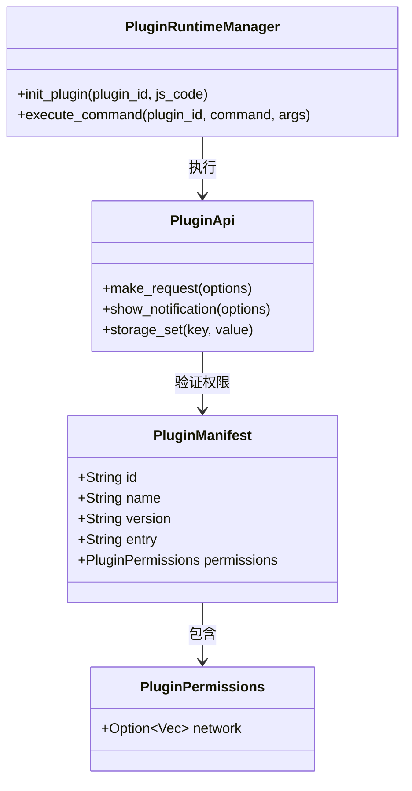
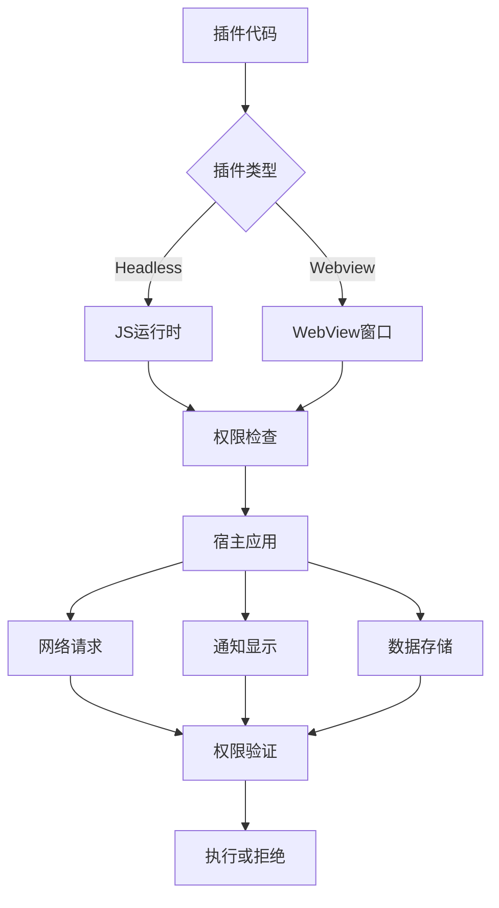

# 插件权限控制

<cite>
**本文档中引用的文件**  
- [plugin.json](file://src-tauri/capabilities/plugin.json)
- [plugin_manager.rs](file://src-tauri/src/plugin_manager.rs)
- [request.rs](file://src-tauri/src/plugin_api/request.rs)
- [command.rs](file://src-tauri/src/plugin_api/command.rs)
- [notification.rs](file://src-tauri/src/plugin_api/notification.rs)
- [storage.rs](file://src-tauri/src/plugin_api/storage.rs)
- [js_runtime.rs](file://src-tauri/src/js_runtime.rs)
- [environment.ts](file://plugins-sdk/src/core/environment.ts)
- [ipc.ts](file://plugins-sdk/src/core/ipc.ts)
</cite>

## 目录
1. [引言](#引言)
2. [权限声明机制](#权限声明机制)
3. [权限配置与能力模型](#权限配置与能力模型)
4. [权限验证与运行时执行](#权限验证与运行时执行)
5. [支持的权限类型与粒度](#支持的权限类型与粒度)
6. [基于能力的安全模型分析](#基于能力的安全模型分析)
7. [插件开发者指南](#插件开发者指南)
8. [结论](#结论)

## 引言
Baize插件系统采用基于能力（Capability-based）的安全模型，通过声明式权限控制机制确保插件在提供强大功能的同时不损害宿主应用的整体安全性。该模型要求插件在`manifest.json`中明确声明其所需权限，并在运行时由宿主应用进行验证和强制执行。本文档全面记录该权限控制系统的架构、实现机制和使用方法。

## 权限声明机制
插件必须在其`manifest.json`文件中通过`permissions`字段声明其所需权限。目前系统支持网络访问权限的声明，插件开发者需列出其需要访问的域名或URL模式。

```json
{
  "id": "com.example.plugin",
  "name": "Example Plugin",
  "version": "1.0.0",
  "entry": "index.html",
  "permissions": {
    "network": ["https://api.example.com", "https://*.api.example.com"]
  }
}
```

当插件加载时，宿主应用会解析此声明并将其与插件的实际行为进行比对，确保所有操作都在授权范围内。

**Section sources**
- [plugin_manager.rs](file://src-tauri/src/plugin_manager.rs#L30-L45)

## 权限配置与能力模型
系统通过`capabilities/`目录下的JSON文件定义不同场景下的能力集。`plugin.json`文件定义了插件窗口的权限集合，包括核心功能、WebView控制和窗口操作权限。

```json
{
  "identifier": "plugin-capability",
  "description": "插件窗口的能力",
  "windows": ["plugin_*"],
  "permissions": [
    "core:default",
    "core:webview:default",
    "core:webview:allow-internal-toggle-devtools",
    "core:window:default",
    "core:window:allow-close",
    "core:window:allow-hide",
    "core:window:allow-show",
    "core:window:allow-minimize",
    "core:window:allow-maximize",
    "core:window:allow-unmaximize",
    "core:window:allow-set-focus",
    "core:window:allow-set-title"
  ]
}
```

这些能力与插件声明的权限相结合，形成完整的权限控制策略。

**Diagram sources**
- [plugin.json](file://src-tauri/capabilities/plugin.json#L1-L22)



**Section sources**
- [plugin.json](file://src-tauri/capabilities/plugin.json#L1-L22)
- [desktop.json](file://src-tauri/capabilities/desktop.json#L1-L14)

## 权限验证与运行时执行
系统在多个层面执行权限验证。当插件尝试发起网络请求时，`check_network_permission`函数会验证请求URL是否在`manifest.json`声明的允许列表中。



**Diagram sources**
- [request.rs](file://src-tauri/src/plugin_api/request.rs#L150-L240)
- [js_runtime.rs](file://src-tauri/src/js_runtime.rs#L50-L70)

对于其他敏感操作（如显示通知、存储数据），系统同样在宿主端进行权限检查和执行。

**Section sources**
- [request.rs](file://src-tauri/src/plugin_api/request.rs#L150-L248)
- [js_runtime.rs](file://src-tauri/src/js_runtime.rs#L50-L100)

## 支持的权限类型与粒度
当前系统支持多种权限类型，具有细粒度的控制能力：

### 网络权限
- 支持精确域名匹配（`https://api.example.com`）
- 支持通配符子域名匹配（`https://*.api.example.com`）
- 支持协议、端口和主机名的完整验证

### 窗口权限
- 窗口基本操作：关闭、隐藏、显示、最小化、最大化
- 窗口状态控制：设置焦点、设置标题
- WebView功能：默认功能、允许切换开发者工具

### 存储权限
- 每个插件拥有独立的存储空间（`plugins/{plugin_id}/storage.json`）
- 数据隔离确保插件间无法互相访问存储

### API权限
- 通知显示权限
- 命令执行权限
- 自定义协议访问权限



**Diagram sources**
- [plugin_manager.rs](file://src-tauri/src/plugin_manager.rs#L30-L45)
- [request.rs](file://src-tauri/src/plugin_api/request.rs#L1-L50)
- [notification.rs](file://src-tauri/src/plugin_api/notification.rs#L1-L10)
- [storage.rs](file://src-tauri/src/plugin_api/storage.rs#L1-L20)

## 基于能力的安全模型分析
Baize的权限控制系统采用基于能力的安全模型，有效平衡了插件功能性和系统安全性：

### 安全优势
- **最小权限原则**：插件只能访问其明确声明的资源
- **纵深防御**：多层验证机制（声明验证、运行时检查）
- **数据隔离**：每个插件有独立的存储和执行环境
- **透明控制**：用户可审查插件权限声明

### 功能性保障
- **灵活的权限粒度**：支持通配符和精确匹配
- **异步执行模型**：不影响主应用性能
- **统一API接口**：开发者无需关心底层安全机制

### 运行时架构
系统通过Deno JS运行时为headless插件提供执行环境，并通过Tauri的IPC机制与webview插件通信。权限检查在Rust后端执行，确保不可绕过。



**Diagram sources**
- [js_runtime.rs](file://src-tauri/src/js_runtime.rs#L1-L400)
- [ipc.ts](file://plugins-sdk/src/core/ipc.ts#L1-L98)
- [environment.ts](file://plugins-sdk/src/core/environment.ts#L1-L37)

**Section sources**
- [js_runtime.rs](file://src-tauri/src/js_runtime.rs#L1-L400)
- [ipc.ts](file://plugins-sdk/src/core/ipc.ts#L1-L98)

## 插件开发者指南
为正确使用权限系统，插件开发者应遵循以下指南：

### 1. 权限声明
在`manifest.json`中准确声明所需权限：

```json
{
  "permissions": {
    "network": [
      "https://api.service.com",
      "https://*.cdn.service.com"
    ]
