# 插件系统架构

<cite>
**本文档引用的文件**
- [plugin_manager.rs](file://src-tauri/src/plugin_manager.rs) - *更新了插件权限模型*
- [js_runtime.rs](file://src-tauri/src/js_runtime.rs) - *新增存储管理功能*
- [command.rs](file://src-tauri/src/plugin_api/command.rs)
- [notification.rs](file://src-tauri/src/plugin_api/notification.rs)
- [request.rs](file://src-tauri/src/plugin_api/request.rs)
- [storage.rs](file://src-tauri/src/plugin_api/storage.rs) - *新增的存储API实现*
- [command.ts](file://plugins-sdk/src/api/command.ts)
- [ipc.ts](file://plugins-sdk/src/core/ipc.ts)
- [environment.ts](file://plugins-sdk/src/core/environment.ts)
- [dispatch.ts](file://plugins-sdk/src/core/dispatch.ts)
- [index.ts](file://plugins-sdk/src/index.ts) - *更新了SDK导出*
- [plugin.json](file://src-tauri/capabilities/plugin.json)
- [default.json](file://src-tauri/capabilities/default.json)
- [type.ts](file://src/lib/type.ts)
- [permissions.ts](file://plugins-sdk/src/types/permissions.ts) - *新增权限类型定义*
</cite>

## 更新摘要
**变更内容**
- 在JS运行时中实现了插件存储管理功能，支持持久化数据存储
- 更新了插件SDK，增加了对存储API的支持
- 扩展了权限模型，添加了细粒度的存储权限控制
- 新增了`plugin_storage_*`系列后端命令
- 更新了相关文档以反映最新的代码状态

## 目录
1. [简介](#简介)
2. [项目结构概览](#项目结构概览)
3. [插件发现与加载机制](#插件发现与加载机制)
4. [JS运行时环境](#js运行时环境)
5. [自定义协议处理](#自定义协议处理)
6. [插件通信机制](#插件通信机制)
7. [插件权限模型](#插件权限模型)
8. [组件架构图](#组件架构图)
9. [性能考虑](#性能考虑)
10. [故障排除指南](#故障排除指南)
11. [总结](#总结)

## 简介

Baize插件系统是一个基于Tauri框架构建的强大扩展机制，它允许开发者通过JavaScript/TypeScript编写插件来扩展应用程序的功能。该系统采用Deno Core作为JS运行时引擎，提供了安全的沙箱环境，并通过自定义的`plugin://`协议处理插件资源请求。

插件系统的核心设计理念是：
- **安全性**：通过Deno Core提供隔离的JS执行环境
- **灵活性**：支持UI插件和无头插件两种模式
- **易用性**：提供完整的SDK和API接口
- **可扩展性**：基于能力模型的权限控制系统

## 项目结构概览

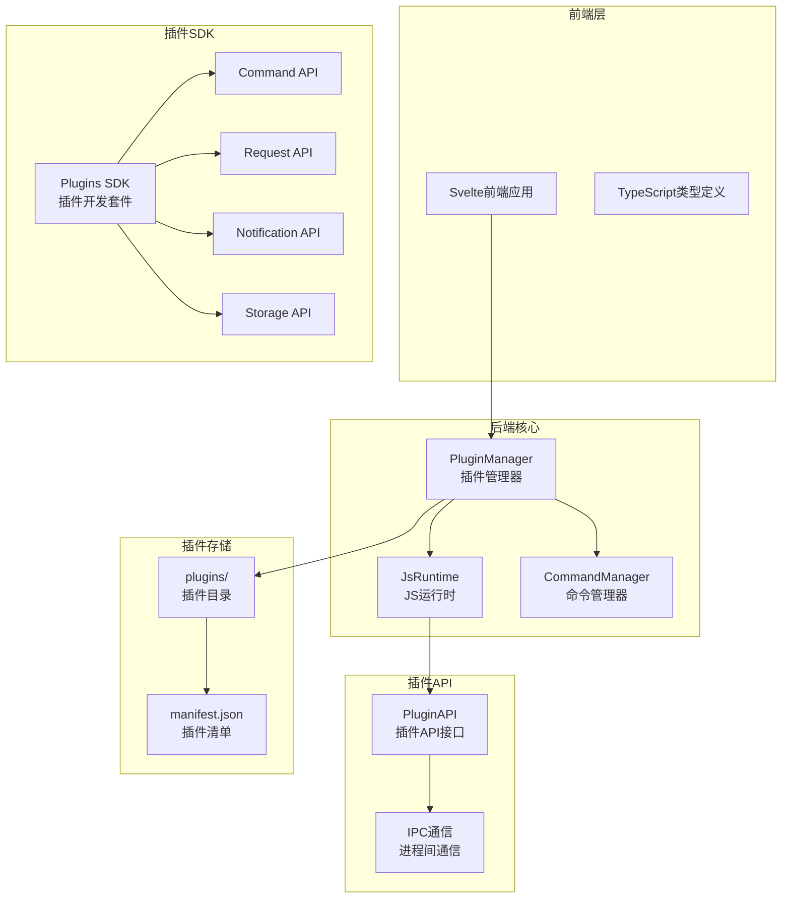

**图表来源**
- [plugin_manager.rs](file://src-tauri/src/plugin_manager.rs#L1-L50)
- [js_runtime.rs](file://src-tauri/src/js_runtime.rs#L1-L50)
- [command.rs](file://src-tauri/src/plugin_api/command.rs#L1-L50)

**章节来源**
- [plugin_manager.rs](file://src-tauri/src/plugin_manager.rs#L1-L327)
- [js_runtime.rs](file://src-tauri/src/js_runtime.rs#L1-L401)

## 插件发现与加载机制

### 插件发现流程

插件系统通过扫描`app_data_dir/plugins`目录来发现可用的插件。每个插件必须包含一个`manifest.json`文件，该文件定义了插件的基本信息和配置。

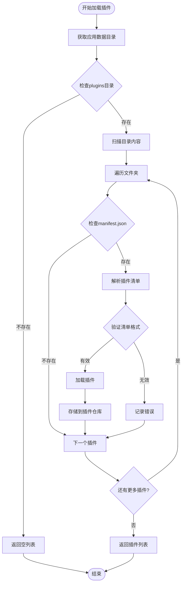

**图表来源**
- [plugin_manager.rs](file://src-tauri/src/plugin_manager.rs#L50-L120)

### 插件清单结构

插件清单文件（`manifest.json`）包含了插件的所有元数据信息：

```typescript
interface PluginManifest {
  id: string;           // 插件唯一标识符
  name: string;         // 插件显示名称
  version: string;      // 版本号
  description: string;  // 插件描述
  entry: string;        // 入口文件路径
  type?: string;        // 插件类型（webview/headless）
  commands: PluginCommandManifest[]; // 可执行命令列表
  permissions?: PluginPermissions;   // 权限声明
}
```

### 插件类型区分

系统根据入口文件的扩展名自动识别插件类型：

- **HTML插件**：UI插件，会在后台创建新的WebView窗口
- **JS插件**：无头插件，在后台线程中执行JavaScript代码

**章节来源**
- [plugin_manager.rs](file://src-tauri/src/plugin_manager.rs#L50-L180)

## JS运行时环境

### Deno Core集成

Baize插件系统基于Deno Core构建了一个安全的JS运行时环境。这个运行时提供了：

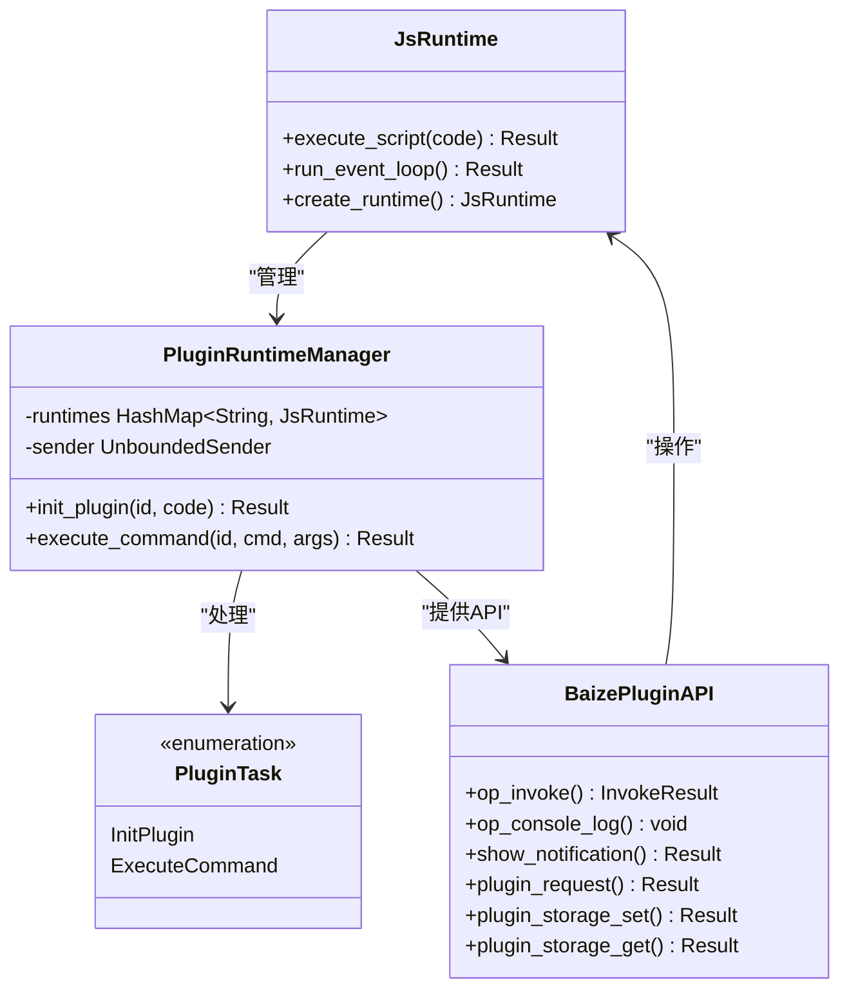

**图表来源**
- [js_runtime.rs](file://src-tauri/src/js_runtime.rs#L150-L250)

### 运行时初始化过程

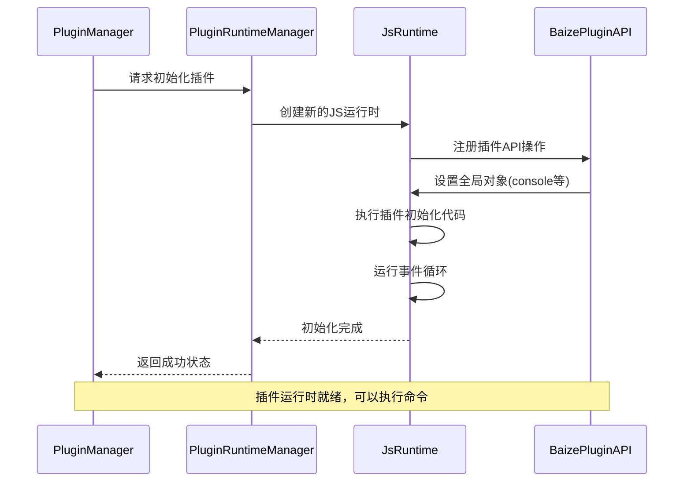

**图表来源**
- [js_runtime.rs](file://src-tauri/src/js_runtime.rs#L200-L280)

### 安全沙箱机制

Deno Core提供了以下安全特性：

1. **权限隔离**：每个插件运行在独立的沙箱环境中
2. **API限制**：只能访问声明的权限范围内的API
3. **内存保护**：防止插件访问或修改其他插件的数据
4. **网络控制**：通过权限模型控制网络访问

**章节来源**
- [js_runtime.rs](file://src-tauri/src/js_runtime.rs#L100-L300)

## 自定义协议处理

### plugin://协议实现

系统实现了自定义的`plugin://`协议来处理插件资源请求。这个协议负责：

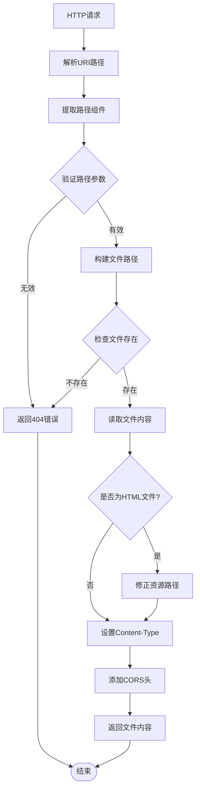

**图表来源**
- [plugin_manager.rs](file://src-tauri/src/plugin_manager.rs#L200-L327)

### 协议处理流程

当插件尝试加载资源时，系统会：

1. **解析URI**：提取插件目录名和文件路径
2. **构建完整路径**：将相对路径转换为绝对文件路径
3. **验证文件存在**：确保请求的文件确实存在于插件目录中
4. **处理HTML文件**：修正HTML中的资源引用路径
5. **设置响应头**：添加适当的CORS和缓存控制头
6. **返回文件内容**：以正确的Content-Type返回文件

**章节来源**
- [plugin_manager.rs](file://src-tauri/src/plugin_manager.rs#L200-L327)

## 插件通信机制

### 命令调用机制

插件系统提供了两种主要的通信方式：

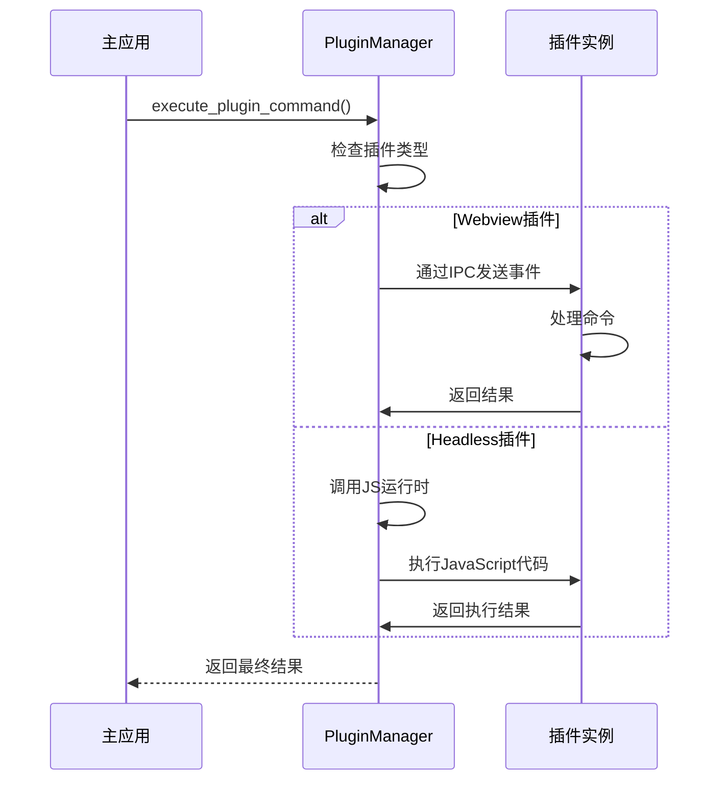

**图表来源**
- [command.rs](file://src-tauri/src/plugin_api/command.rs#L20-L80)

### 事件发射系统

插件可以通过事件系统与主应用通信：

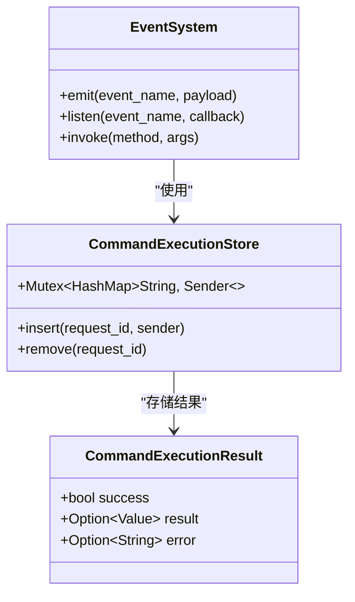

**图表来源**
- [command.rs](file://src-tauri/src/plugin_api/command.rs#L10-L20)

### 插件SDK API

插件SDK提供了统一的API接口：

```typescript
// 命令注册
export async function registerCommandHandler(handler: CommandHandler): Promise<void>

// 通知API
export async function showNotification(options: NotificationOptions): Promise<void>

// 请求API
export async function makeRequest(options: RequestOptions): Promise<Response>

// 存储API
export async function setItem(key: string, value: any): Promise<void>
export async function getItem<T = any>(key: string): Promise<T | null>
export async function removeItem(key: string): Promise<void>
export async function clear(): Promise<void>
export async function keys(): Promise<string[]>
export async function setItems(items: Record<string, any>): Promise<void>
export async function getItems<T = any>(keys: string[]): Promise<Record<string, T>>
```

**章节来源**
- [command.rs](file://src-tauri/src/plugin_api/command.rs#L1-L176)
- [command.ts](file://plugins-sdk/src/api/command.ts#L1-L49)
- [storage.ts](file://plugins-sdk/src/api/storage.ts#L1-L101) - *新增存储API*

## 插件权限模型

### 权限声明机制

插件可以在`manifest.json`中声明所需的权限：

```json
{
  "id": "com.example.plugin",
  "name": "示例插件",
  "permissions": {
    "http": {
      "enable": true,
      "allowUrls": [
        "https://api.example.com/*",
        "http://localhost:3000/*"
      ]
    },
    "storage": {
      "enable": true,
      "local": true,
      "session": false,
      "maxSize": "10MB"
    }
  }
}
```

### 网络访问控制

系统通过能力模型（Capabilities）来控制插件的网络访问权限：

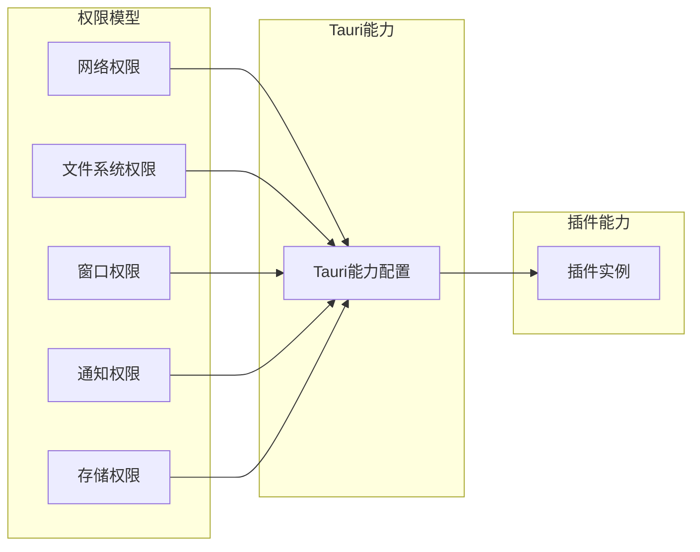

**图表来源**
- [plugin.json](file://src-tauri/capabilities/plugin.json#L1-L22)
- [default.json](file://src-tauri/capabilities/default.json#L1-L23)
- [permissions.ts](file://plugins-sdk/src/types/permissions.ts#L1-L74) - *新增权限类型*

### 权限验证流程

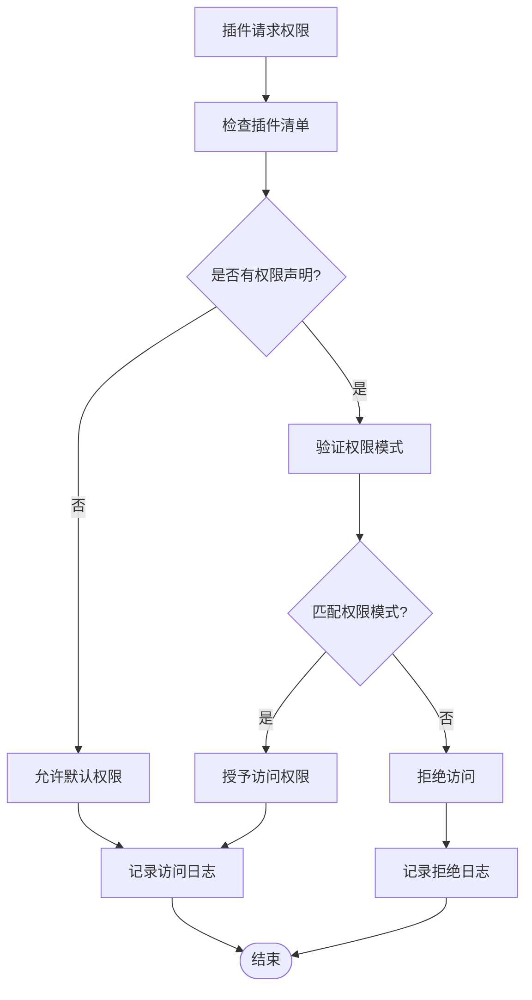

**章节来源**
- [plugin_manager.rs](file://src-tauri/src/plugin_manager.rs#L25-L45)
- [plugin.json](file://src-tauri/capabilities/plugin.json#L1-L22)

## 组件架构图

### 整体系统架构

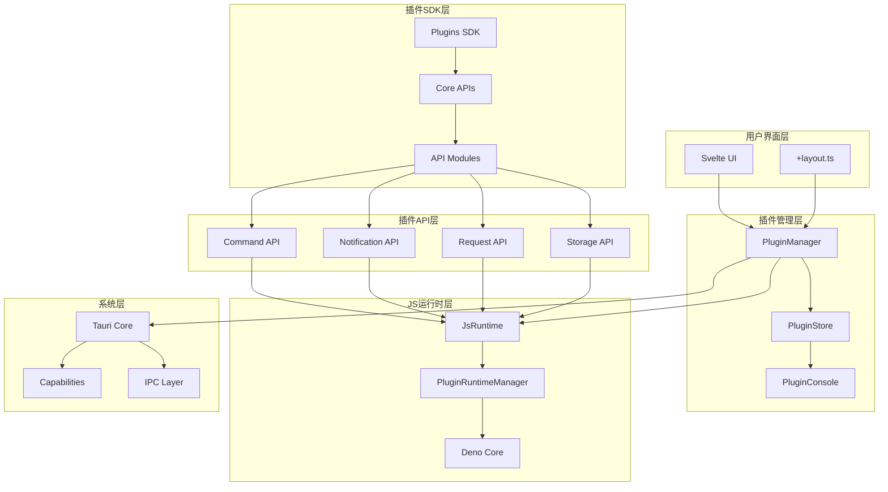

**图表来源**
- [plugin_manager.rs](file://src-tauri/src/plugin_manager.rs#L1-L30)
- [js_runtime.rs](file://src-tauri/src/js_runtime.rs#L1-L30)
- [index.ts](file://plugins-sdk/src/index.ts#L1-L42)

### 插件生命周期管理

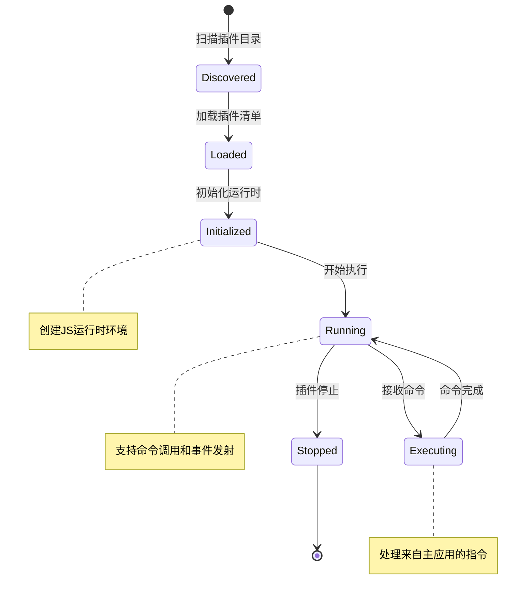

**章节来源**
- [plugin_manager.rs](file://src-tauri/src/plugin_manager.rs#L50-L200)
- [js_runtime.rs](file://src-tauri/src/js_runtime.rs#L200-L300)

## 性能考虑

### 运行时优化策略

1. **异步执行**：所有插件操作都采用异步模式，避免阻塞主线程
2. **线程池管理**：使用Tokio运行时管理插件任务
3. **内存隔离**：每个插件运行在独立的JS运行时中，防止内存泄漏
4. **懒加载**：插件仅在需要时才被初始化和加载

### 并发处理机制

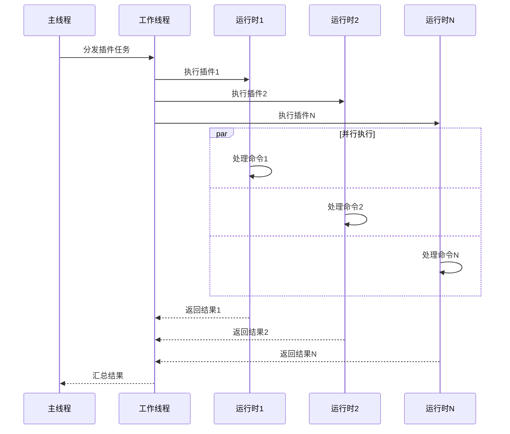

**图表来源**
- [js_runtime.rs](file://src-tauri/src/js_runtime.rs#L150-L200)

## 故障排除指南

### 常见问题及解决方案

1. **插件加载失败**
   - 检查`manifest.json`格式是否正确
   - 确认插件目录权限设置
   - 验证入口文件路径是否存在

2. **JS运行时错误**
   - 查看控制台输出的日志信息
   - 检查插件代码语法错误
   - 确认依赖模块是否正确安装

3. **权限访问被拒绝**
   - 检查插件清单中的权限声明
   - 验证Tauri能力配置
   - 确认网络请求URL是否匹配权限模式

4. **插件通信超时**
   - 增加超时时间设置
   - 检查插件是否正常响应
   - 验证IPC通道连接状态

### 调试工具和方法

- **插件控制台**：实时查看插件输出日志
- **开发者工具**：通过Tauri DevTools调试插件
- **日志分析**：分析系统日志定位问题根源
- **断点调试**：在关键位置设置断点进行调试

**章节来源**
- [plugin_manager.rs](file://src-tauri/src/plugin_manager.rs#L250-L327)
- [js_runtime.rs](file://src-tauri/src/js_runtime.rs#L30-L80)

## 总结

Baize插件系统是一个功能完善、设计精良的扩展机制，具有以下特点：

### 核心优势

1. **安全性优先**：基于Deno Core的安全沙箱环境
2. **灵活部署**：支持UI插件和无头插件两种模式
3. **易于开发**：提供完整的SDK和丰富的API接口
4. **权限可控**：基于能力模型的细粒度权限控制
5. **高性能**：异步并发处理和内存隔离设计

### 技术创新

- **自定义协议处理**：通过`plugin://`协议实现安全的资源加载
- **统一通信机制**：通过IPC和事件系统实现主应用与插件的无缝通信
- **智能权限管理**：动态验证插件权限请求，确保系统安全
- **多运行时支持**：同时支持多个插件实例的并行执行
- **持久化存储**：新增插件专用存储系统，支持数据持久化

### 应用场景

- **功能扩展**：为应用程序添加新功能模块
- **主题定制**：支持插件化的界面主题和样式
- **工作流自动化**：通过无头插件实现后台任务处理
- **第三方集成**：快速集成外部服务和API

Baize插件系统为开发者提供了一个强大而安全的扩展平台，使得应用程序能够以模块化的方式不断演进和增强功能。通过合理的架构设计和严格的安全控制，系统既保证了扩展性，又维护了系统的稳定性和安全性。