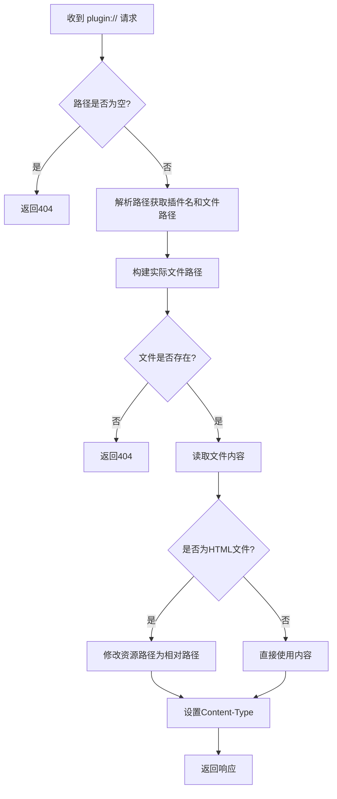
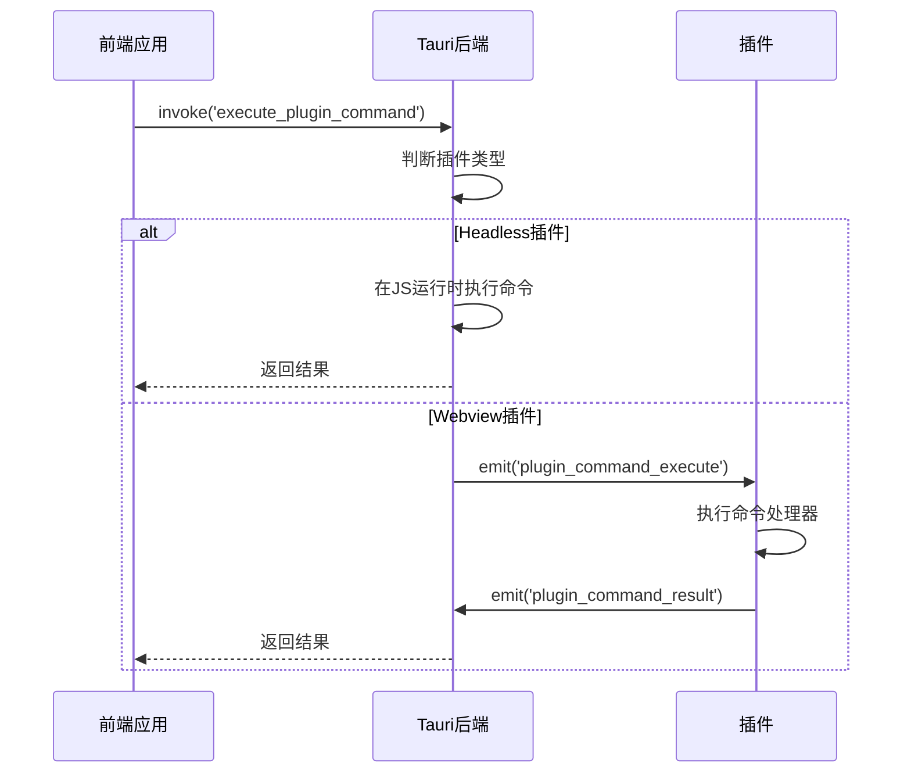
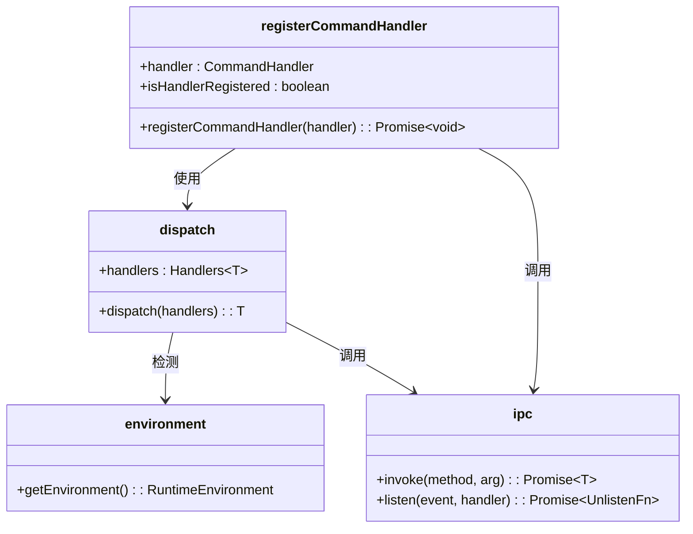
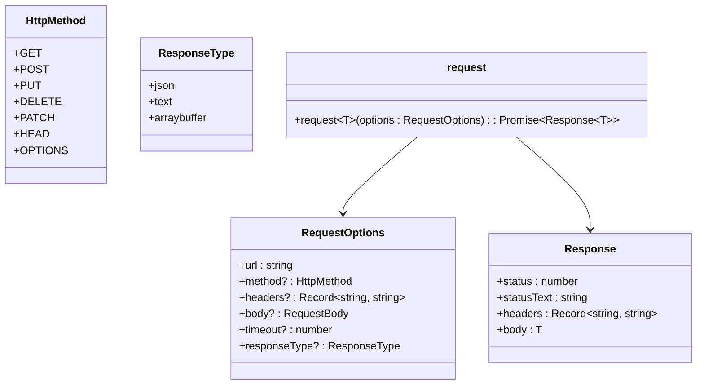
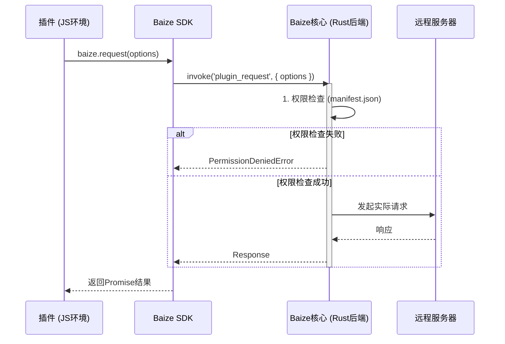

# 插件通信协议

<cite>
**本文档引用的文件**
- [plugin_manager.rs](file://src-tauri/src/plugin_manager.rs)
- [command.rs](file://src-tauri/src/plugin_api/command.rs)
- [request.rs](file://src-tauri/src/plugin_api/request.rs)
- [lib.rs](file://src-tauri/src/lib.rs)
- [command.ts](file://plugins-sdk/src/api/command.ts)
- [request.ts](file://plugins-sdk/src/api/request.ts)
- [ipc.ts](file://plugins-sdk/src/core/ipc.ts)
- [dispatch.ts](file://plugins-sdk/src/core/dispatch.ts)
- [environment.ts](file://plugins-sdk/src/core/environment.ts)
- [baize-request-api-design.md](file://baize-request-api-design.md)
- [PLUGIN_COMMAND_USAGE.md](file://PLUGIN_COMMAND_USAGE.md)
</cite>

## 目录
1. [引言](#引言)
2. [自定义协议处理](#自定义协议处理)
3. [双向通信机制](#双向通信机制)
4. [插件SDK实现](#插件sdk实现)
5. [网络请求API](#网络请求api)
6. [权限控制模型](#权限控制模型)
7. [跨环境兼容策略](#跨环境兼容策略)
8. [总结](#总结)

## 引言

本项目旨在构建一个类似Raycast、Utools的快速启动应用程序，采用Tauri、Svelte和Rust技术栈。核心功能之一是支持插件系统，通过`plugin://`自定义协议实现插件资源的加载与通信。插件系统设计为支持两种运行模式：Headless（无界面）和Webview（有界面），并提供统一的API供开发者使用。

**Section sources**
- [README.md](file://README.md#L20-L45)

## 自定义协议处理

### `handle_plugin_protocol` 函数分析

`handle_plugin_protocol` 函数是处理 `plugin://` 自定义协议的核心。它拦截所有以 `plugin://` 开头的请求，并根据插件目录名和文件路径映射到实际的文件系统路径。

该函数首先解析请求路径，提取插件目录名和文件路径。然后，它构建指向插件文件的实际路径，并检查文件是否存在。如果文件存在，则读取其内容并根据文件扩展名设置正确的 `Content-Type` 响应头。

对于HTML文件，函数会修改其中的资源引用路径，将绝对路径转换为相对路径，确保浏览器通过相同的 `plugin://` 协议请求资源，从而避免跨域问题。

**Diagram sources**
- [plugin_manager.rs](file://src-tauri/src/plugin_manager.rs#L177-L326)

**Section sources**
- [plugin_manager.rs](file://src-tauri/src/plugin_manager.rs#L177-L326)

## 双向通信机制

### 前端调用插件命令

前端通过 `@tauri/command` 调用插件暴露的命令。在Rust后端，`execute_plugin_command` 命令根据插件类型（Headless或Webview）采用不同的执行策略。

对于Headless插件，系统使用 `PluginRuntimeManager` 在JS运行时中执行命令。插件代码仅在首次加载时执行一次，后续命令调用直接调用已注册的处理器，避免了重复执行的问题。

对于Webview插件，系统通过IPC事件向插件窗口发送 `plugin_command_execute` 事件。插件接收到事件后执行相应的处理器，并通过 `plugin_command_result` 事件将结果返回给后端。

**Diagram sources**
- [command.rs](file://src-tauri/src/plugin_api/command.rs#L0-L175)
- [js_runtime.rs](file://src-tauri/src/js_runtime.rs#L226-L267)

**Section sources**
- [command.rs](file://src-tauri/src/plugin_api/command.rs#L0-L175)
- [PLUGIN_COMMAND_USAGE.md](file://PLUGIN_COMMAND_USAGE.md#L0-L219)

## 插件SDK实现

### 命令处理器注册

插件SDK通过 `registerCommandHandler` 函数允许开发者注册命令处理器。该函数使用 `dispatch` 模式根据运行环境（Webview或Headless）选择不同的实现。

在Webview环境中，SDK监听 `plugin_command_execute` 事件，执行处理器并将结果通过 `invoke` 发送回后端。在Headless环境中，处理器直接注册为事件监听器。

**Diagram sources**
- [command.ts](file://plugins-sdk/src/api/command.ts#L0-L48)
- [dispatch.ts](file://plugins-sdk/src/core/dispatch.ts#L0-L29)
- [ipc.ts](file://plugins-sdk/src/core/ipc.ts#L0-L97)
- [environment.ts](file://plugins-sdk/src/core/environment.ts#L0-L36)

**Section sources**
- [command.ts](file://plugins-sdk/src/api/command.ts#L0-L48)
- [dispatch.ts](file://plugins-sdk/src/core/dispatch.ts#L0-L29)
- [ipc.ts](file://plugins-sdk/src/core/ipc.ts#L0-L97)
- [environment.ts](file://plugins-sdk/src/core/environment.ts#L0-L36)

## 网络请求API

### `baize.request` API 设计

`baize.request` API 为插件提供了一个统一的网络请求接口，支持GET、POST等HTTP方法，并允许指定请求头、超时时间等选项。

API设计包含 `RequestOptions` 接口定义请求参数，`Response` 接口定义响应结构。SDK提供了 `request` 函数，接受 `RequestOptions` 并返回 `Promise<Response>`。

**Diagram sources**
- [request.ts](file://plugins-sdk/src/api/request.ts#L0-L144)
- [baize-request-api-design.md](file://baize-request-api-design.md#L0-L199)

**Section sources**
- [request.ts](file://plugins-sdk/src/api/request.ts#L0-L144)
- [baize-request-api-design.md](file://baize-request-api-design.md#L0-L199)

## 权限控制模型

### 网络权限声明

插件必须在 `manifest.json` 文件中声明其需要访问的网络域名。权限声明位于 `permissions.network` 数组中，支持精确匹配和通配符匹配。

通配符 `*` 只能用于子域名，例如 `https://*.github.com` 可以匹配 `api.github.com` 但不能匹配 `github.com`。权限检查在Rust后端进行，确保无法被绕过。

当插件发起网络请求时，后端会加载其 `manifest.json`，检查请求URL是否与声明的权限匹配。如果匹配失败，则返回 `PermissionDeniedError`。

**Diagram sources**
- [request.rs](file://src-tauri/src/plugin_api/request.rs#L0-L248)
- [baize-request-api-design.md](file://baize-request-api-design.md#L0