# 核心功能详解

<cite>
**本文档中引用的文件**
- [README.md](file://README.md)
- [window_manager.rs](file://src-tauri/src/window_manager.rs)
- [shortcut_manager.rs](file://src-tauri/src/shortcut_manager.rs)
- [plugin_manager.rs](file://src-tauri/src/plugin_manager.rs)
- [command_manager.rs](file://src-tauri/src/command_manager.rs)
- [tray_manager.rs](file://src-tauri/src/tray_manager.rs)
- [shared_types.rs](file://src-tauri/src/shared_types.rs)
- [escapeHandler.ts](file://src/lib/stores/escapeHandler.ts)
- [index.ts](file://plugins-sdk/src/index.ts)
- [+layout.ts](file://src/routes/+layout.ts)
- [storage.ts](file://plugins-sdk/src/api/storage.ts) - *新增插件存储管理功能*
- [js_runtime.rs](file://src-tauri/src/js_runtime.rs) - *更新以支持存储API调用*
- [lib.rs](file://src-tauri/src/lib.rs) - *注册新的存储相关命令*
- [storage.rs](file://src-tauri/src/plugin_api/storage.rs) - *实现插件存储后端逻辑*
</cite>

## 目录
1. [简介](#简介)
2. [项目架构概览](#项目架构概览)
3. [窗口管理系统](#窗口管理系统)
4. [快捷键管理系统](#快捷键管理系统)
5. [插件系统](#插件系统)
6. [命令系统](#命令系统)
7. [托盘管理系统](#托盘管理系统)
8. [功能集成与交互](#功能集成与交互)
9. [性能考虑](#性能考虑)
10. [故障排除指南](#故障排除指南)
11. [总结](#总结)

## 简介

Baize 是一个基于 Tauri + SvelteKit + TypeScript 构建的快速启动应用程序，旨在提供类似于 Raycast、UTools、Alfred 和 Wox 的功能体验。该项目采用现代化的技术栈，结合了 Rust 的高性能后端和现代 Web 技术的前端界面，为用户提供快速、响应迅速的应用程序启动和命令执行体验。

### 设计目标

- **快速启动**：通过智能搜索和索引机制，实现毫秒级的应用程序和命令启动
- **高度可扩展**：通过插件系统支持第三方功能扩展
- **跨平台兼容**：支持 Windows、macOS 和 Linux 平台
- **用户友好**：简洁直观的界面设计，符合用户习惯的操作方式

### 技术架构

项目采用分层架构设计：
- **前端层**：基于 SvelteKit 的响应式用户界面
- **后端层**：Rust 编写的高性能服务端逻辑
- **通信层**：通过 Tauri 实现前后端双向通信
- **插件层**：独立的 JavaScript/TypeScript 插件系统

## 项目架构概览

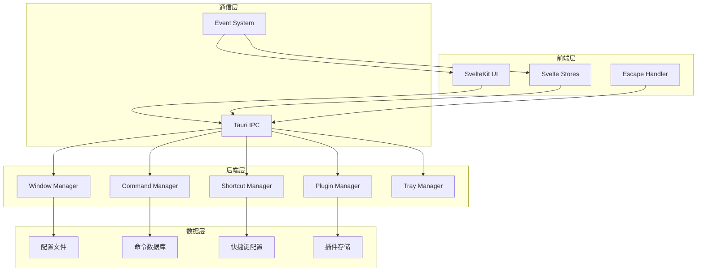
```mermaid
graph TB
subgraph "前端层"
UI[SvelteKit UI]
Store[Svelte Stores]
Escape[Escape Handler]
end
subgraph "通信层"
IPC[Tauri IPC]
Event[Event System]
end
subgraph "后端层"
WM[Window Manager]
SM[Shortcut Manager]
PM[Plugin Manager]
CM[Command Manager]
TM[Tray Manager]
end
subgraph "数据层"
Config[配置文件]
Commands[命令数据库]
Shortcuts[快捷键配置]
Plugins[插件存储]
end
UI --> IPC
Store --> IPC
Escape --> IPC
IPC --> WM
IPC --> SM
IPC --> PM
IPC --> CM
IPC --> TM
WM --> Config
SM --> Shortcuts
PM --> Plugins
CM --> Commands
Event --> UI
Event --> Store
```

**图表来源**
- [window_manager.rs](file://src-tauri/src/window_manager.rs#L1-L50)
- [shortcut_manager.rs](file://src-tauri/src/shortcut_manager.rs#L1-L50)
- [plugin_manager.rs](file://src-tauri/src/plugin_manager.rs#L1-L50)
- [command_manager.rs](file://src-tauri/src/command_manager.rs#L1-L50)
- [tray_manager.rs](file://src-tauri/src/tray_manager.rs#L1-L50)

## 窗口管理系统

窗口管理系统是 Baize 的核心组件之一，负责控制应用程序主窗口的生命周期、焦点管理和智能隐藏行为。

### 核心功能特性

1. **智能隐藏机制**：当窗口失去焦点时自动隐藏，提升用户体验
2. **文件拖拽支持**：在文件拖拽过程中保持窗口打开状态
3. **ESC 键处理**：通过全局快捷键和本地按键处理实现灵活的关闭机制
4. **焦点状态跟踪**：精确监控窗口焦点变化，避免不必要的隐藏操作

### 状态管理架构

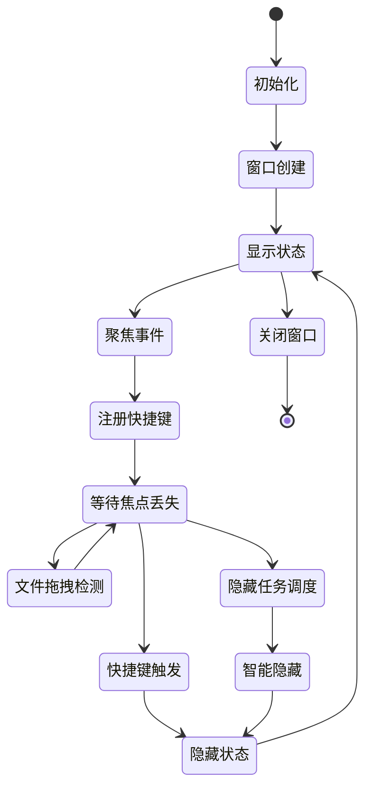
```mermaid
stateDiagram-v2
[*] --> 初始化
初始化 --> 窗口创建
窗口创建 --> 显示状态
显示状态 --> 聚焦事件
聚焦事件 --> 注册快捷键
注册快捷键 --> 等待焦点丢失
等待焦点丢失 --> 文件拖拽检测
文件拖拽检测 --> 等待焦点丢失
等待焦点丢失 --> 快捷键触发
快捷键触发 --> 隐藏状态
等待焦点丢失 --> 隐藏任务调度
隐藏任务调度 --> 智能隐藏
智能隐藏 --> 隐藏状态
隐藏状态 --> 显示状态
显示状态 --> 关闭窗口
关闭窗口 --> [*]
```

**图表来源**
- [window_manager.rs](file://src-tauri/src/window_manager.rs#L80-L200)

### 智能隐藏算法

窗口管理系统实现了复杂的智能隐藏算法，确保在不同场景下都能提供最佳用户体验：

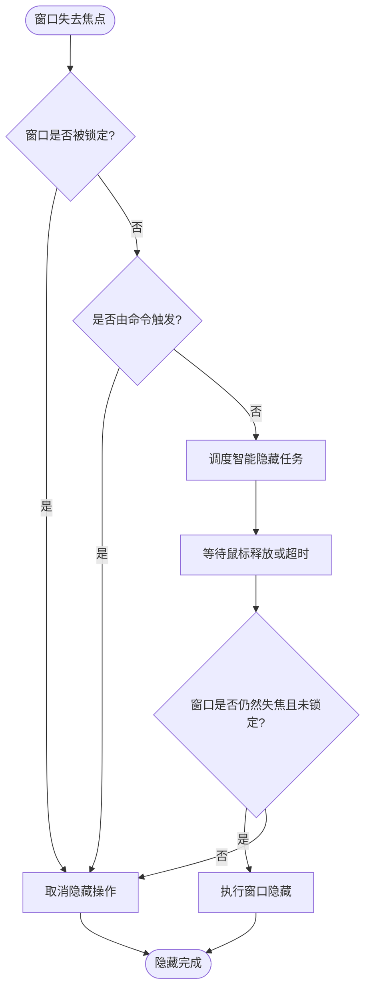
```mermaid
flowchart TD
开始([窗口失去焦点]) --> 检查锁定状态{"窗口是否被锁定?"}
检查锁定状态 --> |是| 取消隐藏["取消隐藏操作"]
检查锁定状态 --> |否| 检查命令触发{"是否由命令触发?"}
检查命令触发 --> |是| 取消隐藏
检查命令触发 --> |否| 调度隐藏任务["调度智能隐藏任务"]
调度隐藏任务 --> 等待用户输入["等待鼠标释放或超时"]
等待用户输入 --> 检查最终状态{"窗口是否仍然失焦且未锁定?"}
检查最终状态 --> |是| 执行隐藏["执行窗口隐藏"]
检查最终状态 --> |否| 取消隐藏
执行隐藏 --> 结束([隐藏完成])
取消隐藏 --> 结束
```

**图表来源**
- [window_manager.rs](file://src-tauri/src/window_manager.rs#L150-L223)

### 关键实现细节

1. **原子操作状态管理**：使用 `AtomicBool` 和 `AtomicU32` 确保线程安全的状态访问
2. **异步任务协调**：通过 Tokio 异步运行时管理隐藏任务的生命周期
3. **事件监听机制**：监听文件拖拽事件，动态调整窗口行为
4. **资源清理**：及时取消不再需要的异步任务，避免内存泄漏

**章节来源**
- [window_manager.rs](file://src-tauri/src/window_manager.rs#L1-L223)

## 快捷键管理系统

快捷键管理系统提供了完整的全局快捷键注册、管理和执行功能，支持用户自定义快捷键绑定到各种命令。

### 核心架构设计

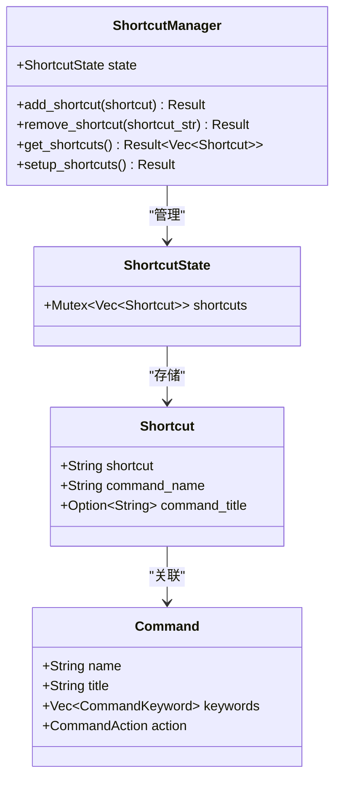
```mermaid
classDiagram
class ShortcutManager {
+ShortcutState state
+add_shortcut(shortcut) Result
+remove_shortcut(shortcut_str) Result
+get_shortcuts() Result~Vec~Shortcut~~
+setup_shortcuts() Result
}
class ShortcutState {
+Mutex~Vec~Shortcut~~ shortcuts
}
class Shortcut {
+String shortcut
+String command_name
+Option~String~ command_title
}
class Command {
+String name
+String title
+Vec~CommandKeyword~ keywords
+CommandAction action
}
ShortcutManager --> ShortcutState : "管理"
ShortcutState --> Shortcut : "存储"
Shortcut --> Command : "关联"
```

**图表来源**
- [shortcut_manager.rs](file://src-tauri/src/shortcut_manager.rs#L15-L50)
- [shared_types.rs](file://src-tauri/src/shared_types.rs#L95-L105)

### 快捷键生命周期管理

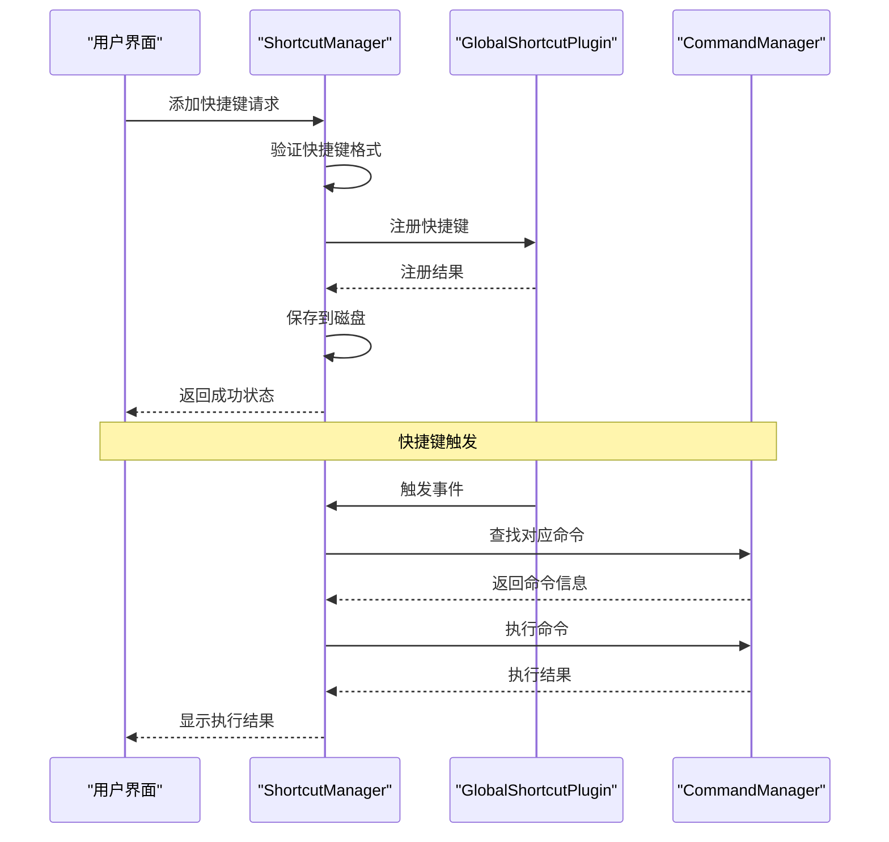
```mermaid
sequenceDiagram
participant 用户 as "用户界面"
participant 管理器 as "ShortcutManager"
participant 全局快捷键 as "GlobalShortcutPlugin"
participant 命令系统 as "CommandManager"
用户->>管理器 : 添加快捷键请求
管理器->>管理器 : 验证快捷键格式
管理器->>全局快捷键 : 注册快捷键
全局快捷键-->>管理器 : 注册结果
管理器->>管理器 : 保存到磁盘
管理器-->>用户 : 返回成功状态
Note over 用户,命令系统 : 快捷键触发
全局快捷键->>管理器 : 触发事件
管理器->>命令系统 : 查找对应命令
命令系统-->>管理器 : 返回命令信息
管理器->>命令系统 : 执行命令
命令系统-->>管理器 : 执行结果
管理器-->>用户 : 显示执行结果
```

**图表来源**
- [shortcut_manager.rs](file://src-tauri/src/shortcut_manager.rs#L70-L120)
- [command_manager.rs](file://src-tauri/src/command_manager.rs#L1-L50)

### 跨平台兼容性

快捷键管理系统针对不同操作系统进行了特殊处理：

1. **macOS 特殊处理**：
   - 辅助功能权限检查
   - 快捷键格式验证
   - 权限不足时的降级处理

2. **Windows/Linux 通用支持**：
   - 标准全局快捷键注册
   - 系统级热键冲突检测
   - 快捷键组合验证

### 数据持久化策略

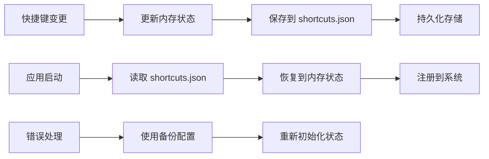
```mermaid
flowchart LR
快捷键变更 --> 内存更新["更新内存状态"]
内存更新 --> 磁盘写入["保存到 shortcuts.json"]
磁盘写入 --> 文件系统["持久化存储"]
应用启动 --> 文件读取["读取 shortcuts.json"]
文件读取 --> 内存恢复["恢复到内存状态"]
内存恢复 --> 全局注册["注册到系统"]
错误处理 --> 备份恢复["使用备份配置"]
备份恢复 --> 重新初始化["重新初始化状态"]
```

**图表来源**
- [shortcut_manager.rs](file://src-tauri/src/shortcut_manager.rs#L30-L70)

**章节来源**
- [shortcut_manager.rs](file://src-tauri/src/shortcut_manager.rs#L1-L382)
- [shared_types.rs](file://src-tauri/src/shared_types.rs#L95-L105)

## 插件系统

插件系统是 Baize 的核心扩展机制，允许开发者通过 JavaScript/TypeScript 编写功能模块，扩展应用程序的能力。

### 插件架构设计

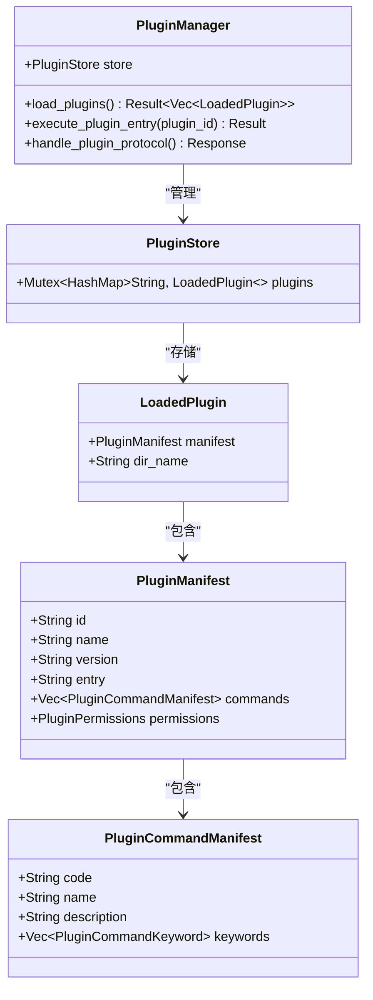
```mermaid
classDiagram
class PluginManager {
+PluginStore store
+load_plugins() Result~Vec~LoadedPlugin~~
+execute_plugin_entry(plugin_id) Result
+handle_plugin_protocol() Response
}
class PluginStore {
+Mutex~HashMap~String, LoadedPlugin~~ plugins
}
class LoadedPlugin {
+PluginManifest manifest
+String dir_name
}
class PluginManifest {
+String id
+String name
+String version
+String entry
+Vec~PluginCommandManifest~ commands
+PluginPermissions permissions
}
class PluginCommandManifest {
+String code
+String name
+String description
+Vec~PluginCommandKeyword~ keywords
}
PluginManager --> PluginStore : "管理"
PluginStore --> LoadedPlugin : "存储"
LoadedPlugin --> PluginManifest : "包含"
PluginManifest --> PluginCommandManifest : "包含"
```

**图表来源**
- [plugin_manager.rs](file://src-tauri/src/plugin_manager.rs#L10-L50)
- [shared_types.rs](file://src-tauri/src/shared_types.rs#L25-L70)

### 插件类型与执行模式

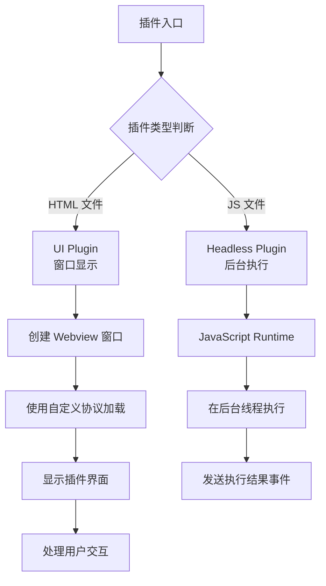
```mermaid
flowchart TD
插件入口 --> 类型检测{"插件类型判断"}
类型检测 --> |JS 文件| 头部插件["Headless Plugin<br/>后台执行"]
类型检测 --> |HTML 文件| UI插件["UI Plugin<br/>窗口显示"]
头部插件 --> JS运行时["JavaScript Runtime"]
JS运行时 --> 后台执行["在后台线程执行"]
UI插件 --> 窗口创建["创建 Webview 窗口"]
窗口创建 --> 协议加载["使用自定义协议加载"]
协议加载 --> 用户界面["显示插件界面"]
后台执行 --> 事件通知["发送执行结果事件"]
用户界面 --> 交互处理["处理用户交互"]
```

**图表来源**
- [plugin_manager.rs](file://src-tauri/src/plugin_manager.rs#L120-L180)

### 插件 SDK 功能

插件系统提供了完整的 SDK 支持，包括：

1. **IPC 通信**：通过 `invoke` 和 `listen` 实现前后端通信
2. **环境信息**：获取运行时环境信息
3. **请求处理**：HTTP 请求处理能力
4. **通知系统**：向用户发送系统通知
5. **命令注册**：动态注册新的命令
6. **存储访问**：安全的数据存储访问

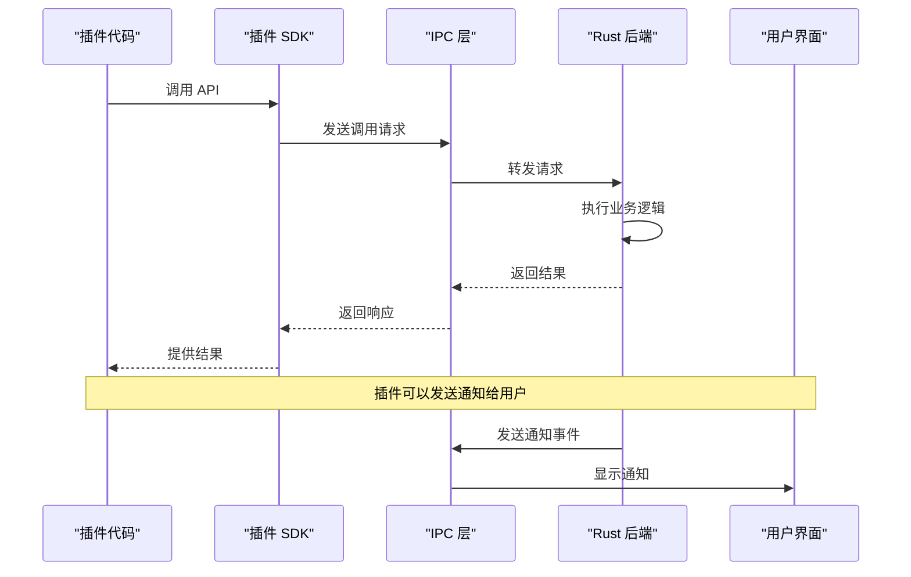
```mermaid
sequenceDiagram
participant 插件 as "插件代码"
participant SDK as "插件 SDK"
participant IPC as "IPC 层"
participant 后端 as "Rust 后端"
participant 用户 as "用户界面"
插件->>SDK : 调用 API
SDK->>IPC : 发送调用请求
IPC->>后端 : 转发请求
后端->>后端 : 执行业务逻辑
后端-->>IPC : 返回结果
IPC-->>SDK : 返回响应
SDK-->>插件 : 提供结果
Note over 插件,用户 : 插件可以发送通知给用户
后端->>IPC : 发送通知事件
IPC->>用户 : 显示通知
```

**图表来源**
- [index.ts](file://plugins-sdk/src/index.ts#L1-L42)

### 插件权限模型

为了确保安全性，插件系统实现了细粒度的权限控制：

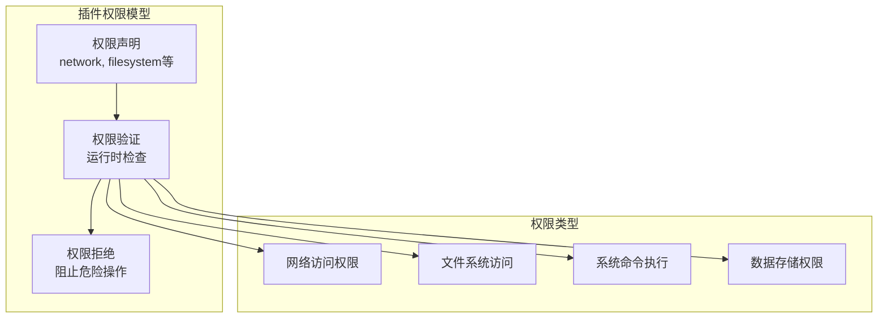
```mermaid
graph TB
subgraph "插件权限模型"
权限声明["权限声明<br/>network, filesystem等"]
权限验证["权限验证<br/>运行时检查"]
权限拒绝["权限拒绝<br/>阻止危险操作"]
end
subgraph "权限类型"
网络访问["网络访问权限"]
文件系统["文件系统访问"]
系统命令["系统命令执行"]
数据存储["数据存储权限"]
end
权限声明 --> 权限验证
权限验证 --> 网络访问
权限验证 --> 文件系统
权限验证 --> 系统命令
权限验证 --> 数据存储
权限验证 --> 权限拒绝
```

**章节来源**
- [plugin_manager.rs](file://src-tauri/src/plugin_manager.rs#L1-L327)
- [index.ts](file://plugins-sdk/src/index.ts#L1-L42)
- [shared_types.rs](file://src-tauri/src/shared_types.rs#L25-L70)

### 插件存储管理功能

最新版本中引入了插件存储管理功能，为插件提供了持久化数据存储能力。

#### 存储 API 接口

插件可以通过 `storage` 对象访问以下存储方法：

- **setItem(key, value)**: 设置单个键值对
- **getItem(key)**: 获取指定键的值
- **removeItem(key)**: 删除指定键
- **clear()**: 清空当前插件所有存储数据
- **keys()**: 获取当前插件所有键的数组
- **setItems(items)**: 批量设置多个键值对
- **getItems(keys)**: 批量获取多个键的值

```typescript
import { storage } from '@baize/plugins-sdk';

// 使用示例
async function example() {
  // 存储用户偏好设置
  await storage.setItem('theme', 'dark');
  
  // 存储复杂对象
  await storage.setItem('userSettings', {
    fontSize: 14,
    language: 'zh-CN'
  });
  
  // 批量存储
  await storage.setItems({
    lastVisit: Date.now(),
    visitCount: 1
  });
  
  // 读取数据
  const theme = await storage.getItem('theme');
  const settings = await storage.getItem('userSettings');
  
  // 批量读取
  const data = await storage.getItems(['lastVisit', 'visitCount']);
}
```

#### 存储架构设计

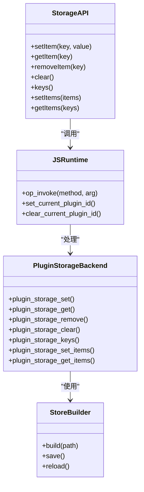
```mermaid
classDiagram
class StorageAPI {
+setItem(key, value)
+getItem(key)
+removeItem(key)
+clear()
+keys()
+setItems(items)
+getItems(keys)
}
class JSRuntime {
+op_invoke(method, arg)
+set_current_plugin_id()
+clear_current_plugin_id()
}
class PluginStorageBackend {
+plugin_storage_set()
+plugin_storage_get()
+plugin_storage_remove()
+plugin_storage_clear()
+plugin_storage_keys()
+plugin_storage_set_items()
+plugin_storage_get_items()
}
class StoreBuilder {
+build(path)
+save()
+reload()
}
StorageAPI --> JSRuntime : "调用"
JSRuntime --> PluginStorageBackend : "处理"
PluginStorageBackend --> StoreBuilder : "使用"
```

**图表来源**
- [storage.ts](file://plugins-sdk/src/api/storage.ts#L1-L102)
- [js_runtime.rs](file://src-tauri/src/js_runtime.rs#L120-L198)
- [storage.rs](file://src-tauri/src/plugin_api/storage.rs#L72-L200)

#### 存储实现原理

插件存储功能的实现涉及前后端协同工作：

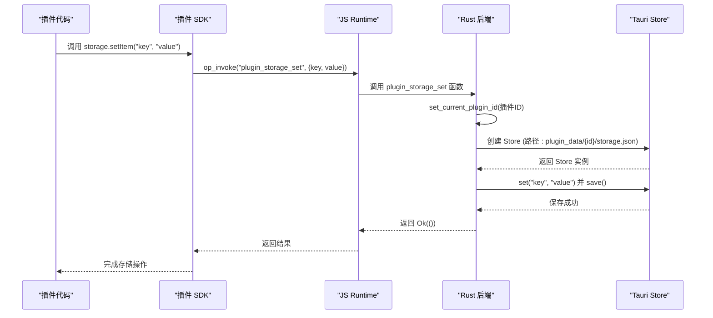
```mermaid
sequenceDiagram
participant 插件 as "插件代码"
participant SDK as "插件 SDK"
participant JS运行时 as "JS Runtime"
participant 后端 as "Rust 后端"
participant 存储系统 as "Tauri Store"
插件->>SDK : 调用 storage.setItem("key", "value")
SDK->>JS运行时 : op_invoke("plugin_storage_set", {key, value})
JS运行时->>后端 : 调用 plugin_storage_set 函数
后端->>后端 : set_current_plugin_id(插件ID)
后端->>存储系统 : 创建 Store (路径 : plugin_data/{id}/storage.json)
存储系统-->>后端 : 返回 Store 实例
后端->>存储系统 : set("key", "value") 并 save()
存储系统-->>后端 : 保存成功
后端-->>JS运行时 : 返回 Ok(())
JS运行时-->>SDK : 返回结果
SDK-->>插件 : 完成存储操作
```

**章节来源**
- [storage.ts](file://plugins-sdk/src/api/storage.ts#L1-L102)
- [js_runtime.rs](file://src-tauri/src/js_runtime.rs#L120-L198)
- [storage.rs](file://src-tauri/src/plugin_api/storage.rs#L72-L200)
- [lib.rs](file://src-tauri/src/lib.rs#L165-L171)

#### 存储数据隔离

每个插件的数据存储完全隔离，确保数据安全：

- **独立存储路径**：每个插件有独立的存储文件 `plugin_data/{plugin_id}/storage.json`
- **上下文识别**：通过线程本地存储（thread_local!）跟踪当前执行的插件ID
- **访问控制**：插件只能访问自己的存储空间，无法访问其他插件或主应用数据

```rust
// 获取插件存储路径
fn get_plugin_store_path(plugin_id: &str) -> String {
    format!("plugin_data/{}/storage.json", plugin_id)
}

// 线程本地存储用于保存当前插件ID
thread_local! {
    static CURRENT_PLUGIN_ID: std::cell::RefCell<Option<String>> = const { std::cell::RefCell::new(None) };
}
```

**章节来源**
- [storage.rs](file://src-tauri/src/plugin_api/storage.rs#L48-L65)

## 命令系统

命令系统是 Baize 的核心功能模块，负责管理所有可执行的命令，包括系统命令、应用程序启动、文件操作和插件命令。

### 命令架构层次

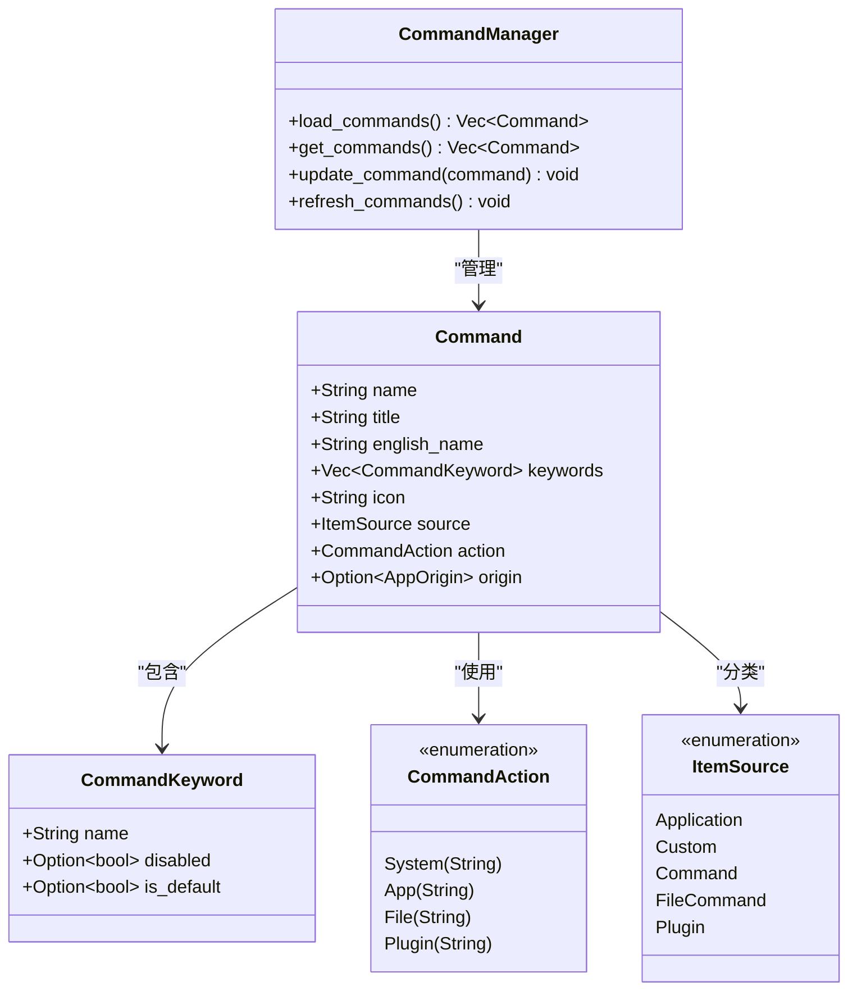
```mermaid
classDiagram
class CommandManager {
+load_commands() Vec~Command~
+get_commands() Vec~Command~
+update_command(command) void
+refresh_commands() void
}
class Command {
+String name
+String title
+String english_name
+Vec~CommandKeyword~ keywords
+String icon
+ItemSource source
+CommandAction action
+Option~AppOrigin~ origin
}
class CommandKeyword {
+String name
+Option~bool~ disabled
+Option~bool~ is_default
}
class CommandAction {
<<enumeration>>
System(String)
App(String)
File(String)
Plugin(String)
}
class ItemSource {
<<enumeration>>
Application
Custom
Command
FileCommand
Plugin
}
CommandManager --> Command : "管理"
Command --> CommandKeyword : "包含"
Command --> CommandAction : "使用"
Command --> ItemSource : "分类"
```

**图表来源**
- [command_manager.rs](file://src-tauri/src/command_manager.rs#L1-L50)
- [shared_types.rs](file://src-tauri/src/shared_types.rs#L75-L120)

### 命令发现与索引

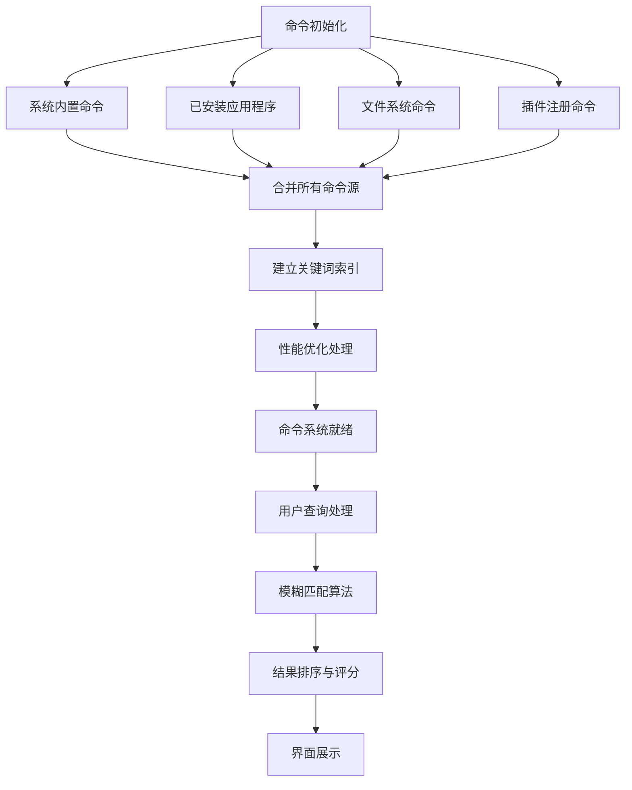
```mermaid
flowchart TD
命令初始化 --> 系统命令["系统内置命令"]
命令初始化 --> 应用程序命令["已安装应用程序"]
命令初始化 --> 文件命令["文件系统命令"]
命令初始化 --> 插件命令["插件注册命令"]
系统命令 --> 命令合并["合并所有命令源"]
应用程序命令 --> 命令合并
文件命令 --> 命令合并
插件命令 --> 命令合并
命令合并 --> 关键词索引["建立关键词索引"]
关键词索引 --> 性能优化["性能优化处理"]
性能优化 --> 命令就绪["命令系统就绪"]
命令就绪 --> 用户查询["用户查询处理"]
用户查询 --> 模糊匹配["模糊匹配算法"]
模糊匹配 --> 结果排序["结果排序与评分"]
结果排序 --> 界面展示["界面展示"]
```

**图表来源**
- [command_manager.rs](file://src-tauri/src/command_manager.rs#L15-L80)

### 命令执行流程

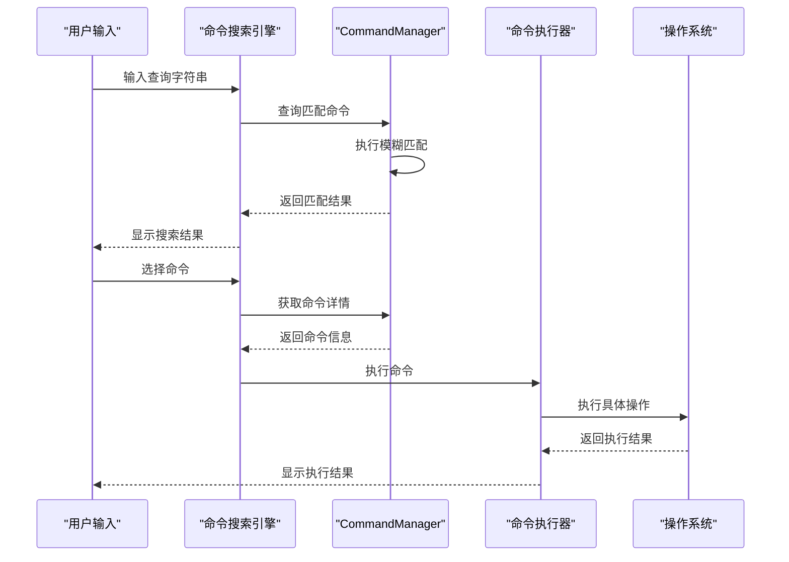
```mermaid
sequenceDiagram
participant 用户 as "用户输入"
participant 搜索引擎 as "命令搜索引擎"
participant 命令管理器 as "CommandManager"
participant 执行器 as "命令执行器"
participant 系统 as "操作系统"
用户->>搜索引擎 : 输入查询字符串
搜索引擎->>命令管理器 : 查询匹配命令
命令管理器->>命令管理器 : 执行模糊匹配
命令管理器-->>搜索引擎 : 返回匹配结果
搜索引擎-->>用户 : 显示搜索结果
用户->>搜索引擎 : 选择命令
搜索引擎->>命令管理器 : 获取命令详情
命令管理器-->>搜索引擎 : 返回命令信息
搜索引擎->>执行器 : 执行命令
执行器->>系统 : 执行具体操作
系统-->>执行器 : 返回执行结果
执行器-->>用户 : 显示执行结果
```

**图表来源**
- [command_manager.rs](file://src-tauri/src/command_manager.rs#L100-L150)

### 动态命令更新机制

命令系统支持实时更新和同步：

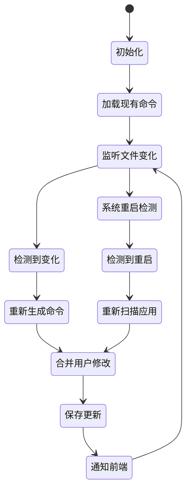
```mermaid
stateDiagram-v2
[*] --> 初始化
初始化 --> 加载现有命令
加载现有命令 --> 监听文件变化
监听文件变化 --> 检测到变化
检测到变化 --> 重新生成命令
重新生成命令 --> 合并用户修改
合并用户修改 --> 保存更新
保存更新 --> 通知前端
通知前端 --> 监听文件变化
监听文件变化 --> 系统重启检测
系统重启检测 --> 检测到重启
检测到重启 --> 重新扫描应用
重新扫描应用 --> 合并用户修改
```

**图表来源**
- [command_manager.rs](file://src-tauri/src/command_manager.rs#L25-L70)

**章节来源**
- [command_manager.rs](file://src-tauri/src/command_manager.rs#L1-L303)
- [shared_types.rs](file://src-tauri/src/shared_types.rs#L75-L120)

## 托盘管理系统

托盘管理系统提供了应用程序的系统托盘集成，允许用户通过托盘图标快速访问应用程序功能。

### 托盘架构设计

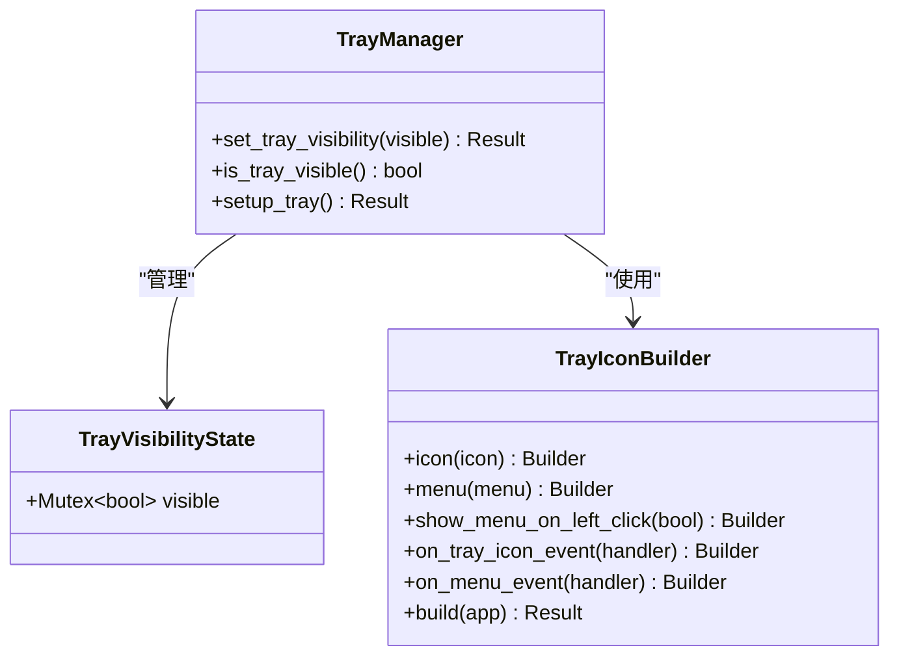
```mermaid
classDiagram
class TrayManager {
+set_tray_visibility(visible) Result
+is_tray_visible() bool
+setup_tray() Result
}
class TrayVisibilityState {
+Mutex~bool~ visible
}
class TrayIconBuilder {
+icon(icon) Builder
+menu(menu) Builder
+show_menu_on_left_click(bool) Builder
+on_tray_icon_event(handler) Builder
+on_menu_event(handler) Builder
+build(app) Result
}
TrayManager --> TrayVisibilityState : "管理"
TrayManager --> TrayIconBuilder : "使用"
```

**图表来源**
- [tray_manager.rs](file://src-tauri/src/tray_manager.rs#L1-L30)

### 托盘交互流程

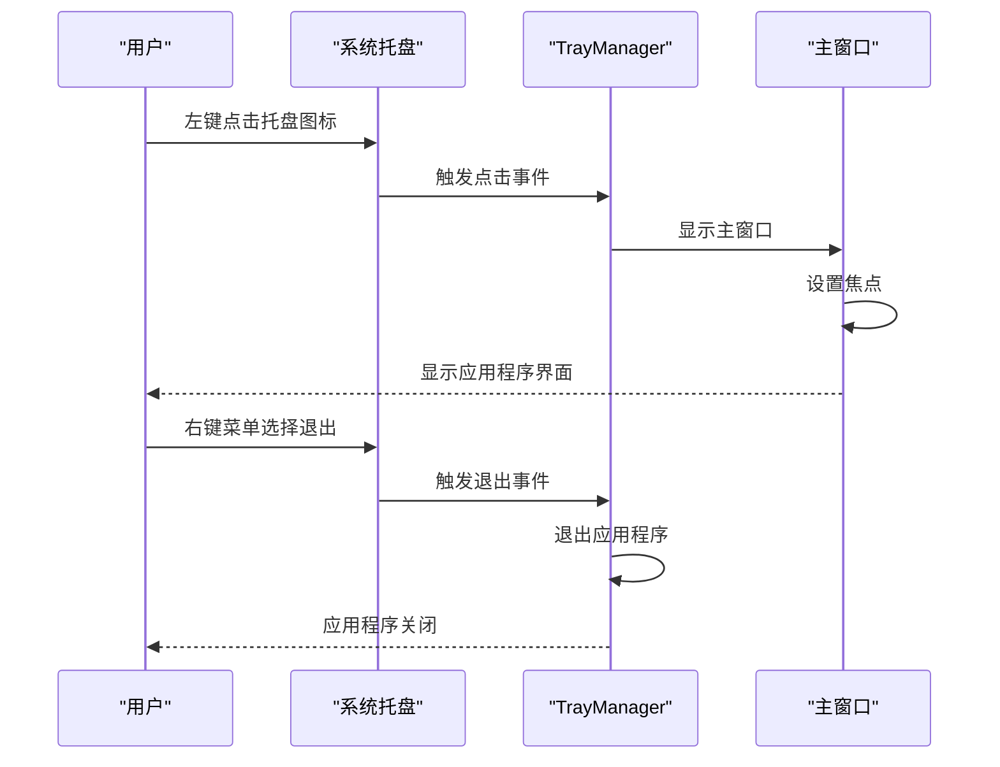
```mermaid
sequenceDiagram
participant 用户 as "用户"
participant 托盘图标 as "系统托盘"
participant 托盘管理器 as "TrayManager"
participant 主窗口 as "主窗口"
用户->>托盘图标 : 左键点击托盘图标
托盘图标->>托盘管理器 : 触发点击事件
托盘管理器->>主窗口 : 显示主窗口
主窗口->>主窗口 : 设置焦点
主窗口-->>用户 : 显示应用程序界面
用户->>托盘图标 : 右键菜单选择退出
托盘图标->>托盘管理器 : 触发退出事件
托盘管理器->>托盘管理器 : 退出应用程序
托盘管理器-->>用户 : 应用程序关闭
```

**图表来源**
- [tray_manager.rs](file://src-tauri/src/tray_manager.rs#L30-L60)

### 托盘状态管理

托盘管理系统实现了灵活的状态控制机制：

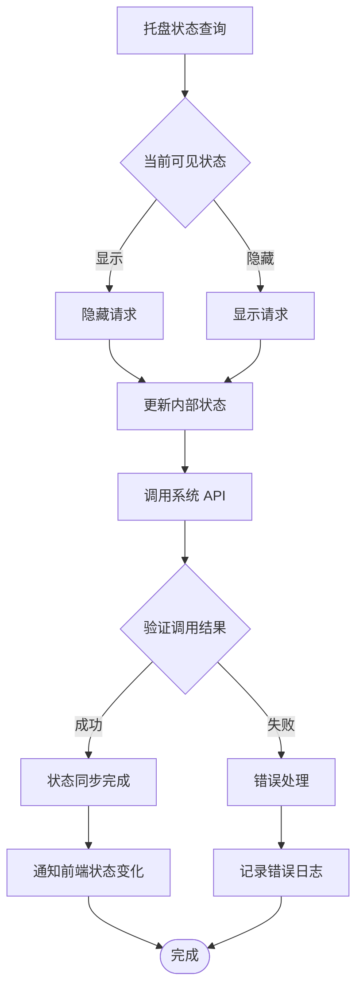
```mermaid
flowchart TD
托盘状态查询 --> 当前状态{"当前可见状态"}
当前状态 --> |显示| 隐藏请求["隐藏请求"]
当前状态 --> |隐藏| 显示请求["显示请求"]
隐藏请求 --> 更新状态["更新内部状态"]
显示请求 --> 更新状态
更新状态 --> 系统调用["调用系统 API"]
系统调用 --> 验证结果{"验证调用结果"}
验证结果 --> |成功| 状态同步["状态同步完成"]
验证结果 --> |失败| 错误处理["错误处理"]
状态同步 --> 事件通知["通知前端状态变化"]
错误处理 --> 错误日志["记录错误日志"]
事件通知 --> 结束([完成])
错误日志 --> 结束
```

**图表来源**
- [tray_manager.rs](file://src-tauri/src/tray_manager.rs#L15-L30)

**章节来源**
- [tray_manager.rs](file://src-tauri/src/tray_manager.rs#L1-L67)

## 功能集成与交互

Baize 的各个功能模块之间存在复杂的交互关系，形成了一个有机的整体系统。

### 系统集成架构

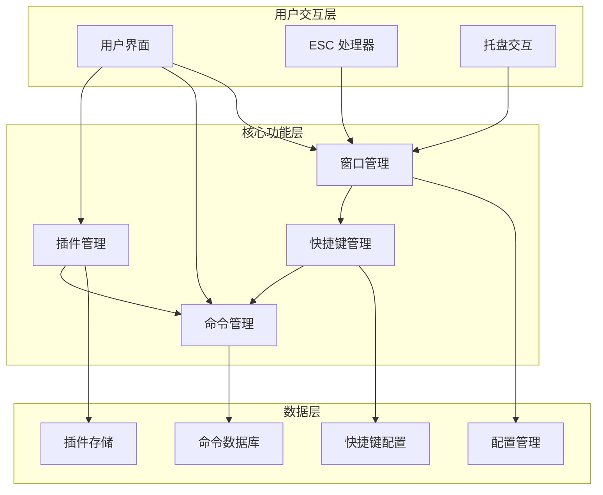
```mermaid
graph TB
subgraph "用户交互层"
UI[用户界面]
ESC[ESC 处理器]
Tray[托盘交互]
end
subgraph "核心功能层"
WM[窗口管理]
SM[快捷键管理]
CM[命令管理]
PM[插件管理]
end
subgraph "数据层"
Config[配置管理]
Commands[命令数据库]
Shortcuts[快捷键配置]
Plugins[插件存储]
end
UI --> WM
UI --> CM
UI --> PM
ESC --> WM
Tray --> WM
WM --> Config
SM --> Shortcuts
CM --> Commands
PM --> Plugins
SM --> CM
PM --> CM
WM --> SM
```

### 快捷键触发窗口显示流程

```mermaid
sequenceDiagram
participant 用户 as "用户"
participant 全局快捷键 as "全局快捷键系统"
participant 快捷键管理器 as "ShortcutManager"
participant 窗口管理器 as "WindowManager"
participant 主窗口 as "主窗口"
用户->>全局快捷键 : 按下快捷键组合
全局快捷键->>快捷键管理器 : 触发快捷键事件
快捷键管理器->>快捷键管理器 : 查找对应命令
快捷键管理器->>窗口管理器 : 请求显示窗口
窗口管理器->>主窗口 : 检查窗口状态
主窗口-->>窗口管理器 : 返回当前状态
窗口管理器->>主窗口 : 显示窗口
主窗口->>主窗口 : 设置焦点
主窗口-->>用户 : 显示应用程序界面
```

### 插件与命令系统的集成

```mermaid
flowchart TD
插件注册 --> 命令发现["插件命令发现"]
命令发现 --> 命令注册["动态命令注册"]
命令注册 --> 关键词索引["加入关键词索引"]
用户查询 --> 搜索引擎["命令搜索引擎"]
搜索引擎 --> 插件命令{"是否为插件命令?"}
插件命令 --> |是| 插件执行器["插件执行器"]
插件命令 --> |否| 标准执行器["标准执行器"]
插件执行器 --> IPC通信["IPC 通信"]
IPC通信 --> 插件代码执行["插件代码执行"]
插件代码执行 --> 结果返回["返回执行结果"]
标准执行器 --> 系统调用["系统调用"]
系统调用 --> 结果返回
结果返回 --> 界面更新["界面更新"]
```

### 状态同步机制

```mermaid
stateDiagram-v2
[*] --> 系统启动
系统启动 --> 初始化各模块
初始化各模块 --> 模块就绪
模块就绪 --> 等待用户交互
等待用户交互 --> 接收事件
接收事件 --> 处理事件
处理事件 --> 更新状态
更新状态 --> 通知相关模块
通知相关模块 --> 等待用户交互
更新状态 --> 持久化配置
持久化配置 --> 等待用户交互
等待用户交互 --> 系统关闭
系统关闭 --> 清理资源
清理资源 --> [*]
```

## 性能考虑

Baize 在设计时充分考虑了性能优化，采用了多种策略确保快速响应和高效资源利用。

### 启动性能优化

1. **预渲染**：使用 SvelteKit 的静态站点生成（SSG）技术
2. **延迟加载**：按需加载非关键功能模块
3. **缓存策略**：智能缓存命令列表和图标资源
4. **异步初始化**：后台异步加载大量数据

### 运行时性能优化

1. **内存管理**：使用 Rust 的所有权系统确保内存安全
2. **并发处理**：Tokio 异步运行时处理 I/O 密集型操作
3. **事件去抖**：减少高频事件的处理频率
4. **资源池化**：复用昂贵的资源对象

### 搜索性能优化

1. **索引预计算**：提前构建命令关键词索引
2. **模糊匹配算法**：高效的字符串匹配算法
3. **结果缓存**：缓存热门查询的结果
4. **增量更新**：只更新变化的部分

## 故障排除指南

### 常见问题诊断

1. **窗口无法显示**
   - 检查焦点管理设置
   - 验证全局快捷键注册状态
   - 确认系统托盘可用性

2. **快捷键不响应**
   - 检查权限设置（macOS 辅助功能）
   - 验证快捷键格式正确性
   - 确认没有与其他应用冲突

3. **插件加载失败**
   - 检查插件目录权限
   - 验证插件 manifest.json 格式
   - 查看插件错误日志

4. **命令执行异常**
   - 检查命令路径有效性
   - 验证权限设置
   - 确认依赖项可用性

### 调试工具与方法

1. **日志系统**：详细的结构化日志输出
2. **开发者工具**：浏览器开发者工具调试前端
3. **Rust 错误追踪**：详细的错误堆栈信息
4. **性能分析**：内置性能监控和分析工具

**章节来源**
- [escapeHandler.ts](file://src/lib/stores/escapeHandler.ts#L1-L9)
- [+layout.ts](file://src/routes/+layout.ts#L1-L6)

## 总结

Baize 作为一个现代化的快速启动应用程序，通过精心设计的架构和丰富的功能模块，为用户提供了卓越的使用体验。其核心优势包括：

### 技术优势

1. **高性能架构**：Rust 后端 + Web 前端的完美结合
2. **跨平台兼容**：统一的代码库支持多平台部署
3. **模块化设计**：清晰的职责分离和良好的扩展性
4. **安全性保障**：完善的权限控制和沙箱机制

### 功能特色

1. **智能窗口管理**：自适应的窗口行为和焦点管理
2. **灵活快捷键系统**：支持用户自定义和冲突检测
3. **强大的插件生态**：完整的 SDK 和丰富的 API
4. **统一命令平台**：整合系统、应用和自定义命令
5. **插件数据持久化**：新增的存储管理功能，使插件能够保存用户数据和状态

### 未来发展

Baize 的设计理念和技术架构为其未来的功能扩展奠定了坚实基础。随着插件系统的完善和更多功能的加入，它有望成为桌面应用程序启动领域的标杆产品。

通过本文档的详细分析，我们深入了解了 Baize 的核心功能实现原理和设计思想，这不仅有助于用户更好地使用该应用程序，也为开发者提供了宝贵的参考和启发。