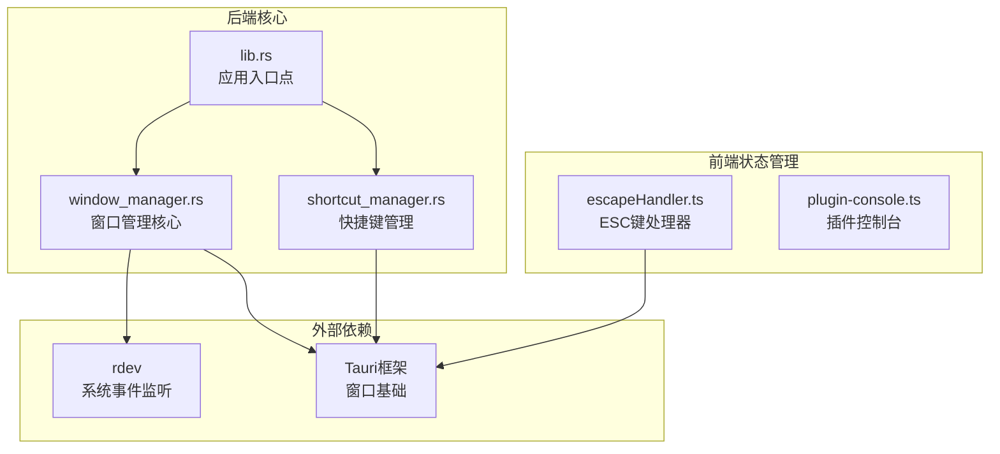
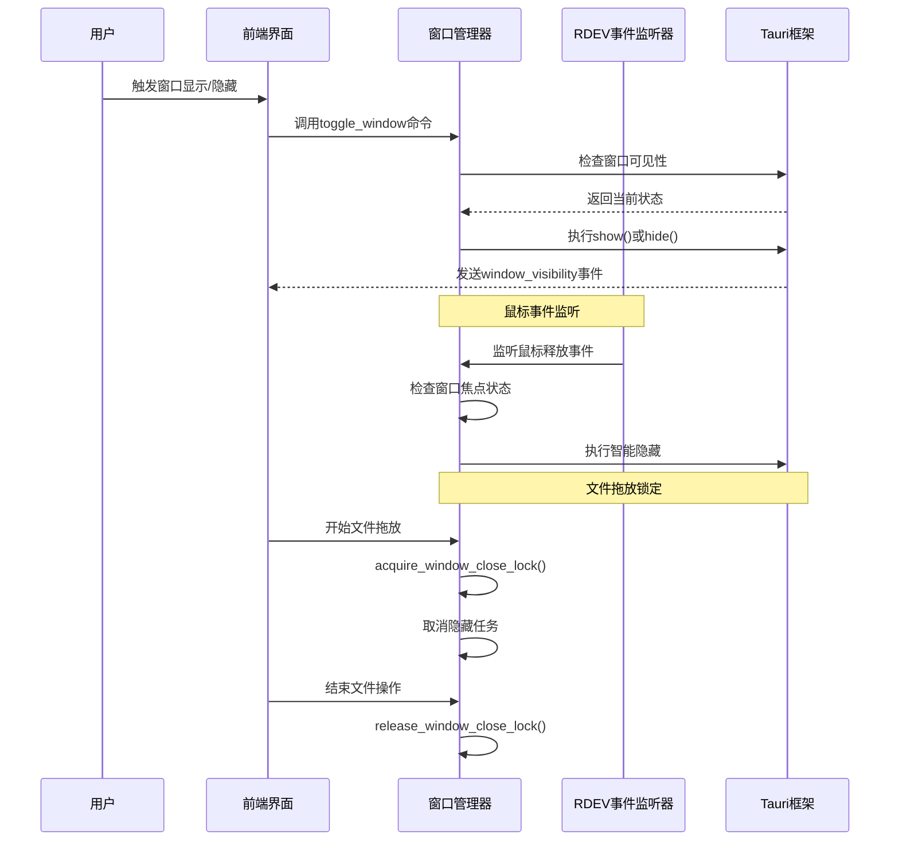
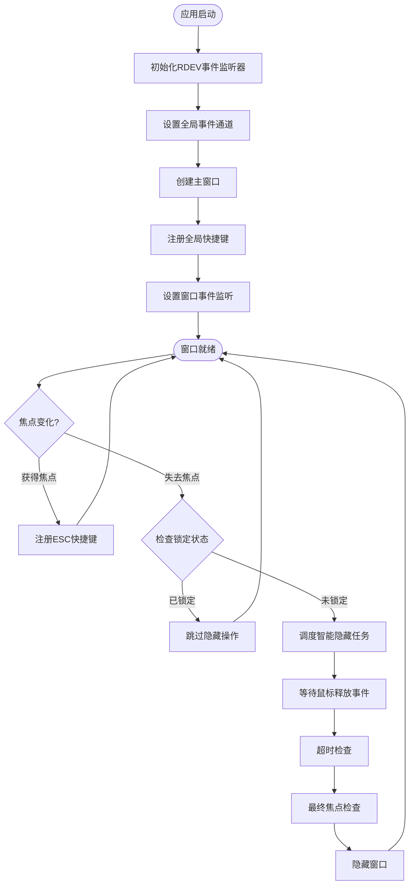
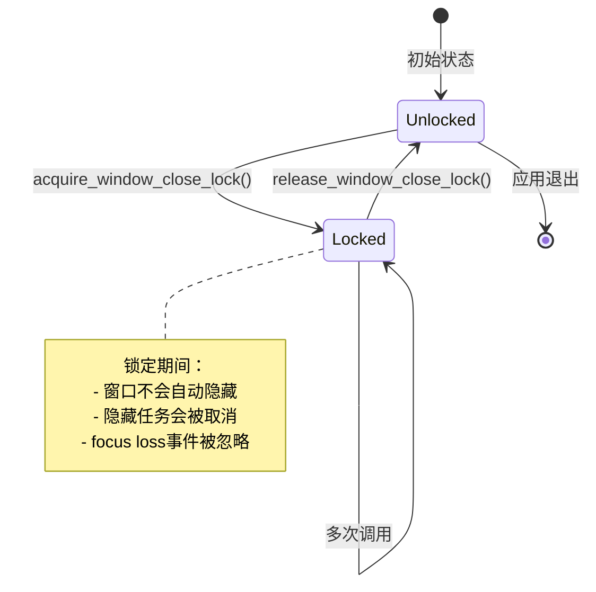
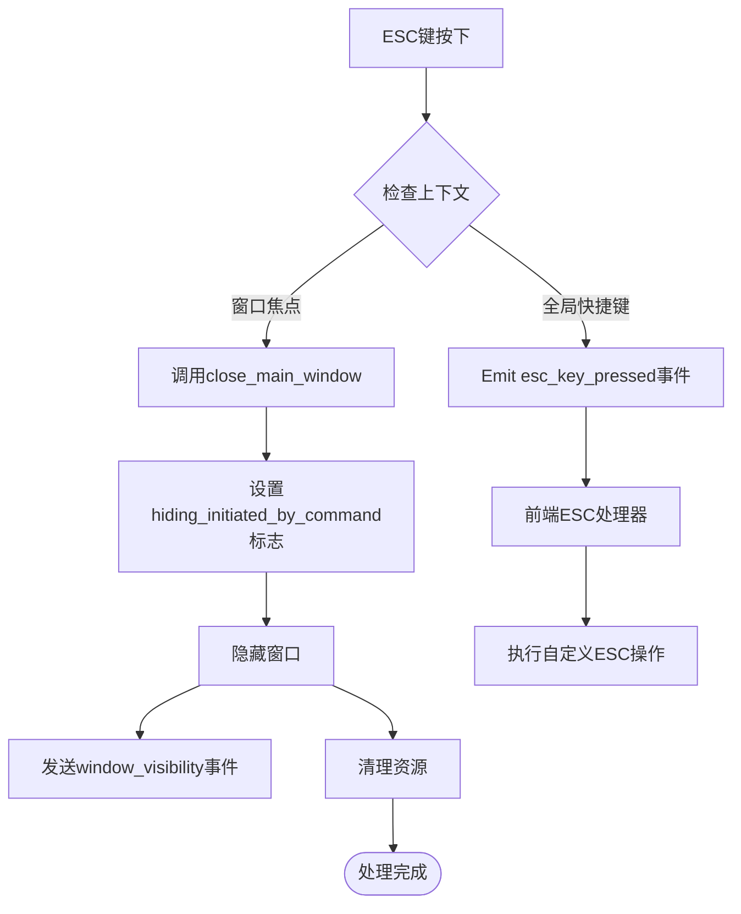
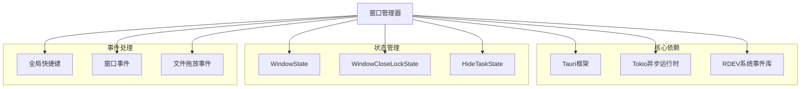

# Baize 窗口管理机制

<cite>
**本文档引用的文件**
- [window_manager.rs](file://src-tauri/src/window_manager.rs)
- [lib.rs](file://src-tauri/src/lib.rs)
- [shortcut_manager.rs](file://src-tauri/src/shortcut_manager.rs)
- [escapeHandler.ts](file://src/lib/stores/escapeHandler.ts)
- [plugin-console.ts](file://src/lib/plugin-console.ts)
</cite>

## 目录
1. [简介](#简介)
2. [项目结构概览](#项目结构概览)
3. [核心组件分析](#核心组件分析)
4. [架构概览](#架构概览)
5. [详细组件分析](#详细组件分析)
6. [依赖关系分析](#依赖关系分析)
7. [性能考量](#性能考量)
8. [故障排除指南](#故障排除指南)
9. [结论](#结论)

## 简介

Baize 是一个基于 Tauri 框架构建的桌面应用程序，其窗口管理机制是一个高度智能化的系统，专门设计用于提供无缝的用户体验。该系统的核心特点包括：

- **无边框透明窗口设计**：提供现代化的视觉体验
- **跨平台兼容性**：支持 Windows、macOS 和 Linux 平台
- **智能隐藏算法**：通过 RDEV_EVENT_CHANNEL 监听鼠标事件实现自然的窗口隐藏行为
- **窗口锁定机制**：防止在文件拖放操作期间意外关闭窗口
- **多层状态管理**：精确控制窗口生命周期和用户交互

## 项目结构概览

Baize 的窗口管理功能主要分布在以下关键文件中：



**图表来源**
- [lib.rs](file://src-tauri/src/lib.rs#L1-L50)
- [window_manager.rs](file://src-tauri/src/window_manager.rs#L1-L30)

**章节来源**
- [lib.rs](file://src-tauri/src/lib.rs#L1-L235)
- [window_manager.rs](file://src-tauri/src/window_manager.rs#L1-L223)

## 核心组件分析

### 窗口状态管理器

窗口状态管理器是整个系统的核心，负责跟踪窗口的各种状态并协调不同组件之间的交互。

```rust
// 状态结构体定义
pub struct WindowState {
    pub hiding_initiated_by_command: AtomicBool,
}

pub struct WindowCloseLockState(pub AtomicU32);

pub struct HideTaskState {
    pub handle: tokio::sync::Mutex<Option<tauri::async_runtime::JoinHandle<()>>>,
}
```

这些状态结构体使用原子操作确保线程安全，支持复杂的并发场景。

### 全局事件通道

系统使用广播通道 (`broadcast::channel`) 来高效地传递系统级事件：

```rust
pub static RDEV_EVENT_CHANNEL: Lazy<(
    broadcast::Sender<rdev::Event>,
    broadcast::Receiver<rdev::Event>,
)> = Lazy::new(|| broadcast::channel(128));
```

这种设计允许单个系统监听线程为所有窗口实例服务，显著提高性能。

**章节来源**
- [window_manager.rs](file://src-tauri/src/window_manager.rs#L10-L25)
- [lib.rs](file://src-tauri/src/lib.rs#L25-L30)

## 架构概览



**图表来源**
- [window_manager.rs](file://src-tauri/src/window_manager.rs#L130-L180)
- [shortcut_manager.rs](file://src-tauri/src/shortcut_manager.rs#L280-L300)

## 详细组件分析

### 主窗口创建与显示逻辑

主窗口的创建和显示遵循严格的生命周期管理：



**图表来源**
- [window_manager.rs](file://src-tauri/src/window_manager.rs#L130-L200)

### 智能隐藏算法详解

智能隐藏算法是 Baize 窗口管理系统的核心创新，它结合了多种策略来实现自然的窗口隐藏行为：

#### 1. 多重事件监听机制

```rust
let hide_on_mouse_release = async {
    loop {
        if let Ok(event) = rx.recv().await {
            if let rdev::EventType::ButtonRelease(rdev::Button::Left) = event.event_type {
                break;
            }
        }
    }
};
```

#### 2. 超时保护机制

```rust
tokio::select! {
    _ = hide_on_mouse_release => {
        sleep(Duration::from_millis(50)).await;
        println!("Global mouse release detected. Attempting to hide window.");
    }
    _ = sleep(Duration::from_millis(2000)) => {
        println!("Timeout reached after focus loss. Attempting to hide window.");
    }
}
```

这种双重保护机制确保：
- **鼠标事件触发**：当用户完成点击操作时立即隐藏
- **超时保护**：对于非鼠标事件（如 Alt-Tab）提供2秒缓冲期

#### 3. 最终状态验证

```rust
if !window_to_hide.is_focused().unwrap_or(false) && lock_state.0.load(Ordering::Relaxed) == 0 {
    println!("Hiding window now.");
    window_to_hide.hide().ok();
    window_to_hide.emit("window_visibility", &false).unwrap_or_default();
}
```

### 窗口锁定机制

窗口锁定机制防止在敏感操作期间意外关闭窗口：



**图表来源**
- [window_manager.rs](file://src-tauri/src/window_manager.rs#L25-L40)

#### 文件拖放锁定流程

```rust
// 文件拖放悬停检测
window.listen("tauri://file-drop-hover", move |_event| {
    println!("File drag hover detected, acquiring window close lock and cancelling hide task.");
    let lock_state: State<WindowCloseLockState> = app_handle_for_drag.state();
    lock_state.0.fetch_add(1, Ordering::Relaxed);

    let app_handle_clone = app_handle_for_drag_clone.clone();
    tauri::async_runtime::spawn(async move {
        cancel_hide_task(&app_handle_clone).await;
    });
});
```

这种机制确保：
- **拖放开始**：立即获取锁并取消任何待执行的隐藏任务
- **拖放结束**：正确释放锁，恢复正常的隐藏行为
- **异常处理**：即使拖放被取消也能正确释放锁

**章节来源**
- [window_manager.rs](file://src-tauri/src/window_manager.rs#L66-L122)

### 窗口切换命令实现

窗口切换功能通过统一的命令接口实现：

```rust
fn execute_shortcut_action(app: &AppHandle, app_shortcut: &crate::shared_types::Shortcut) {
    if app_shortcut.command_name == "toggle_window" {
        if let Some(window) = app.get_webview_window("main") {
            match window.is_visible() {
                Ok(true) => {
                    let _ = window.hide();
                }
                Ok(false) => {
                    let _ = window.show();
                    let _ = window.set_focus();
                }
                Err(e) => {
                    eprintln!("Error checking window visibility: {}", e);
                }
            }
        }
    }
}
```

这个实现提供了：
- **状态检测**：准确判断窗口当前可见性
- **原子操作**：显示和聚焦操作作为一个整体执行
- **错误处理**：优雅处理可能的错误情况

**章节来源**
- [shortcut_manager.rs](file://src-tauri/src/shortcut_manager.rs#L280-L300)

### ESC键处理机制

ESC键处理采用分层设计，确保在不同上下文下的正确行为：



**图表来源**
- [lib.rs](file://src-tauri/src/lib.rs#L110-L130)
- [window_manager.rs](file://src-tauri/src/window_manager.rs#L40-L55)

**章节来源**
- [lib.rs](file://src-tauri/src/lib.rs#L110-L130)
- [window_manager.rs](file://src-tauri/src/window_manager.rs#L40-L55)

## 依赖关系分析



**图表来源**
- [window_manager.rs](file://src-tauri/src/window_manager.rs#L1-L10)
- [lib.rs](file://src-tauri/src/lib.rs#L1-L20)

**章节来源**
- [window_manager.rs](file://src-tauri/src/window_manager.rs#L1-L223)
- [lib.rs](file://src-tauri/src/lib.rs#L1-L235)

## 性能考量

### 异步任务管理

系统使用 Tokio 异步运行时来管理长时间运行的任务：

```rust
async fn cancel_hide_task(app: &AppHandle) {
    let state: State<HideTaskState> = app.state();
    let mut handle_guard = state.handle.lock().await;
    if let Some(handle) = handle_guard.take() {
        println!("Cancelling pending hide task.");
        handle.abort();
    }
}
```

### 内存优化策略

- **懒加载**：RDEV 事件通道使用 Lazy 初始化
- **连接复用**：单个系统监听线程服务于所有窗口
- **及时清理**：任务完成后自动清理资源

### 平台适配

```rust
// macOS特殊处理：禁用RDEV监听器以防止崩溃
#[cfg(not(target_os = "macos"))]
{
    std::thread::spawn(|| {
        let sender = RDEV_EVENT_CHANNEL.0.clone();
        if let Err(e) = rdev::listen(move |event| {
            let _ = sender.send(event);
        }) {
            eprintln!("[ERROR] rdev could not listen for events: {:?}", e);
        }
    });
}

#[cfg(target_os = "macos")]
{
    eprintln!("[INFO] rdev listener disabled on macOS to prevent crashes");
}
```

## 故障排除指南

### 常见问题及解决方案

#### 1. 窗口无法正常隐藏

**症状**：窗口失去焦点后不自动隐藏

**排查步骤**：
1. 检查 RDEV 事件监听器是否正常工作
2. 验证窗口锁定状态是否被意外设置
3. 查看日志中的隐藏任务状态

**解决方案**：
```rust
// 手动取消隐藏任务
cancel_hide_task(&app_handle).await;

// 检查锁定状态
let lock_state: State<WindowCloseLockState> = app.state();
if lock_state.0.load(Ordering::Relaxed) > 0 {
    println!("Window is locked, unlock before hiding");
}
```

#### 2. ESC快捷键失效

**症状**：ESC键按下后窗口不响应

**排查步骤**：
1. 检查全局快捷键注册状态
2. 验证窗口焦点状态
3. 查看快捷键处理器日志

**解决方案**：
```rust
// 重新注册ESC快捷键
app_handle
    .global_shortcut()
    .register(close_window_shortcut)
    .unwrap_or_else(|err| {
        eprintln!("[ERROR] Failed to register Esc shortcut: {}", err);
    });
```

#### 3. 文件拖放导致窗口锁定

**症状**：文件拖放后窗口无法正常隐藏

**排查步骤**：
1. 检查文件拖放事件监听器是否正确处理
2. 验证锁计数器是否正确递减
3. 查看拖放取消事件是否被正确触发

**解决方案**：
```rust
// 确保在所有情况下都释放锁
window.listen("tauri://file-drop-cancelled", move |_event| {
    println!("File drag cancelled, releasing window close lock.");
    let lock_state: State<WindowCloseLockState> = app_handle_for_cancel.state();
    if lock_state.0.load(Ordering::Relaxed) > 0 {
        lock_state.0.fetch_sub(1, Ordering::Relaxed);
    }
});
```

**章节来源**
- [window_manager.rs](file://src-tauri/src/window_manager.rs#L50-L60)
- [window_manager.rs](file://src-tauri/src/window_manager.rs#L130-L150)

## 结论

Baize 的窗口管理机制代表了现代桌面应用程序窗口管理的最佳实践。通过精心设计的架构和智能算法，它成功实现了以下目标：

### 技术优势

1. **高性能设计**：使用异步编程和懒加载技术，确保最小的资源占用
2. **跨平台兼容**：针对不同操作系统特性进行优化，提供一致的用户体验
3. **智能交互**：通过机器学习式的事件监听和超时机制，实现自然的用户交互
4. **容错性强**：完善的错误处理和状态恢复机制，确保系统稳定性

### 设计理念

- **用户体验优先**：智能隐藏算法和窗口锁定机制都围绕提升用户体验展开
- **模块化架构**：清晰的职责分离使得系统易于维护和扩展
- **可观察性**：丰富的日志记录帮助开发者快速定位和解决问题

### 未来发展方向

1. **AI增强交互**：可以考虑引入机器学习算法来预测用户的窗口使用模式
2. **更多平台支持**：扩展对移动平台的支持
3. **性能优化**：进一步优化内存使用和CPU占用
4. **功能扩展**：添加更多窗口管理相关的高级功能

这个窗口管理系统不仅解决了传统桌面应用的痛点，还为未来的窗口管理功能奠定了坚实的基础。通过持续的优化和改进，它将继续为用户提供卓越的桌面应用体验。