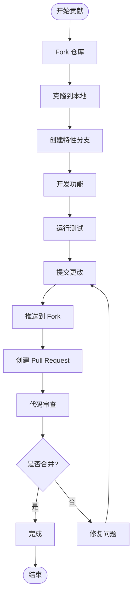

# 贡献指南

<cite>
**本文档引用的文件**
- [README.md](file://README.md)
- [package.json](file://package.json)
- [plugins-sdk/package.json](file://plugins-sdk/package.json)
- [src-tauri/Cargo.toml](file://src-tauri/Cargo.toml)
- [STATUS.md](file://STATUS.md)
- [PLUGIN_COMMAND_USAGE.md](file://PLUGIN_COMMAND_USAGE.md)
</cite>

## 目录
1. [欢迎加入](#欢迎加入)
2. [项目简介](#项目简介)
3. [贡献类型](#贡献类型)
4. [贡献流程](#贡献流程)
5. [代码风格规范](#代码风格规范)
6. [测试策略](#测试策略)
7. [提交信息约定](#提交信息约定)
8. [社区行为准则](#社区行为准则)
9. [常见问题解答](#常见问题解答)

## 欢迎来入

感谢您对 Baize 项目的兴趣！Baize 是一个基于 Tauri、SvelteKit 和 TypeScript 的快速启动应用程序，旨在提供类似 Raycast、UTools、Alfred 和 Wox 的体验。

无论您是经验丰富的开发者还是刚刚开始学习编程，我们都欢迎您以任何形式参与项目贡献。您的每一份贡献都将帮助我们打造更好的用户体验！

## 项目简介

### 项目目标
创建一个快速启动应用程序，提供高效的命令行界面和插件系统，让用户能够快速访问常用功能和应用程序。

### 技术栈
- **Tauri**: 用于构建跨平台桌面应用程序
- **Svelte**: 用于构建用户界面
- **TypeScript**: 提供类型安全的开发体验
- **Rust**: 用于编写高性能的后端逻辑

### 项目结构
项目采用现代化的全栈架构：
- **前端**: SvelteKit + TypeScript + TailwindCSS
- **后端**: Rust + Tauri
- **插件系统**: 可扩展的插件架构

**章节来源**
- [README.md](file://README.md#L1-L46)
- [STATUS.md](file://STATUS.md#L1-L74)

## 贡献类型

### 1. 报告Bug
如果您发现了任何问题或异常，请通过以下方式报告：
- **GitHub Issues**: 在项目仓库中创建新的 Issue
- **详细描述**: 包括问题重现步骤、预期行为和实际行为
- **环境信息**: 操作系统、版本号等必要信息

### 2. 提出功能请求
我们非常欢迎新功能建议：
- **功能提案**: 清晰描述新功能的目的和使用场景
- **技术可行性**: 分析可能的技术实现方案
- **优先级评估**: 说明功能的重要性和紧急程度

### 3. 编写文档
优秀的文档是项目成功的关键：
- **用户文档**: 帮助用户更好地使用项目
- **开发者文档**: 为贡献者提供技术指导
- **API文档**: 详细说明接口规范和使用方法

### 4. 代码贡献
这是最重要的贡献形式：
- **Bug修复**: 修复现有问题和漏洞
- **新功能开发**: 实现新的功能特性
- **性能优化**: 提升系统性能和响应速度
- **代码重构**: 改善代码质量和可维护性

## 贡献流程

### 步骤 1: Fork 仓库
1. 访问项目 GitHub 仓库
2. 点击右上角的 "Fork" 按钮
3. 选择您的 GitHub 账户作为目标

### 步骤 2: 克隆您的 Fork
```bash
git clone https://github.com/YOUR_USERNAME/baize.git
cd baize
```

### 步骤 3: 创建特性分支
```bash
git checkout -b feature/your-feature-name
```

### 步骤 4: 开发和测试
1. **安装依赖**:
```bash
pnpm install
```

2. **启动开发服务器**:
```bash
pnpm dev
```

3. **运行测试**:
```bash
pnpm test
```

### 步骤 5: 提交更改
```bash
git add .
git commit -m "feat: add new feature description"
```

### 步骤 6: 推送到您的 Fork
```bash
git push origin feature/your-feature-name
```

### 步骤 7: 创建 Pull Request
1. 在 GitHub 上打开 Pull Request 页面
2. 填写详细的 PR 描述
3. 关联相关的 Issue
4. 等待代码审查和合并



**图表来源**
- [package.json](file://package.json#L6-L15)

**章节来源**
- [package.json](file://package.json#L1-L52)

## 代码风格规范

### 前端代码规范
我们的前端代码遵循以下规范：

#### TypeScript 规范
- 使用严格的类型检查
- 遵循命名约定（PascalCase 类名，camelCase 变量名）
- 导入语句按字母顺序排列

#### Svelte 组件规范
- 组件文件使用 `.svelte` 扩展名
- 遵循单文件组件的最佳实践
- 使用 TailwindCSS 进行样式设计

#### Prettier 格式化
项目使用 Prettier 进行代码格式化：
```bash
# 格式化所有 Svelte 文件
pnpm format
```

### 后端代码规范
#### Rust 代码规范
- 遵循 Rust 编码标准
- 使用 `cargo fmt` 格式化代码
- 添加适当的文档注释

#### 代码组织
- 按功能模块组织代码
- 使用清晰的命名约定
- 保持模块间的松耦合

### 插件开发规范
根据插件系统的文档，我们有以下规范：

#### 插件结构
```
my-plugin/
├── manifest.json
├── index.js
└── README.md
```

#### 插件配置示例
```json
{
  "id": "com.example.myplugin",
  "name": "我的插件",
  "version": "1.0.0",
  "description": "示例插件",
  "entry": "index.js",
  "type": "headless",
  "commands": [
    {
      "code": "hello",
      "name": "问候指令",
      "description": "向用户问候",
      "keywords": [
        {"name": "hello", "type": "text"},
        {"name": "你好", "type": "text"}
      ]
    }
  ]
}
```

**章节来源**
- [PLUGIN_COMMAND_USAGE.md](file://PLUGIN_COMMAND_USAGE.md#L1-L220)

## 测试策略

### 单元测试
项目使用 SvelteKit 内置的测试框架：
```bash
# 运行类型检查
pnpm check

# 监视模式下的类型检查
pnpm check:watch
```

### 集成测试
对于 Rust 后端代码，使用 Cargo 进行测试：
```bash
# 运行 Rust 测试
cargo test
```

### 端到端测试
项目提供了预览功能进行手动测试：
```bash
# 启动预览服务器
pnpm preview
```

### 测试最佳实践
1. **测试覆盖率**: 确保关键功能有足够的测试覆盖
2. **测试隔离**: 每个测试应该独立运行
3. **测试命名**: 使用描述性的测试名称
4. **持续集成**: 利用 CI/CD 系统自动化测试流程

**章节来源**
- [package.json](file://package.json#L10-L12)

## 提交信息约定

### 提交信息格式
我们使用约定式提交格式：
```
<类型>[可选范围]: <描述>

[可选正文]

[可选脚注]
```

### 提交类型
- `feat`: 新功能
- `fix`: Bug 修复
- `docs`: 文档更新
- `style`: 代码格式调整
- `refactor`: 代码重构
- `test`: 测试相关
- `chore`: 构建过程或辅助工具的变动

### 示例提交信息
```bash
# 新功能
feat: add plugin system support

# Bug 修复
fix: resolve memory leak in command manager

# 文档更新
docs: update contribution guidelines

# 代码重构
refactor: optimize fuzzy search algorithm
```

### 自动化发布
项目使用 semantic-release 自动化发布流程：
```bash
# 发布新版本
pnpm release
```

**章节来源**
- [package.json](file://package.json#L13-L14)

## 社区行为准则

### 我们的承诺
作为项目贡献者和维护者，我们承诺：
- 创建一个友好、包容和欢迎所有人的环境
- 尊重不同的观点和经验
- 优雅地接受建设性批评
- 专注于对社区最有利的事情

### 我们的行为标准
积极的行为包括但不限于：
- 使用欢迎和包容的语言
- 尊重不同观点和经验
- 优雅地接受建设性批评
- 专注于对社区最有利的事情
- 对其他社区成员表示同理心

### 不可接受的行为
不可接受的行为包括：
- 使用性语言或图像
- 人身攻击
- 恶意评论
- 公开或私下骚扰
- 发布他人私人信息
- 其他在专业环境中不当的行为

### 执行责任
项目维护者负责澄清行为标准，并有权采取适当的纠正措施。

### 执行
如果发现违反行为准则的行为，可以通过以下方式举报：
- 在 GitHub Issues 中报告
- 通过电子邮件联系维护者
- 使用项目提供的其他联系方式

### 执行指南
项目维护者将根据适用的法律和项目政策采取适当的行动。

## 常见问题解答

### Q: 如何设置开发环境？
A: 按照以下步骤设置：
1. 安装 Node.js 和 pnpm
2. 安装 Rust 和 Cargo
3. 克隆项目并安装依赖
4. 启动开发服务器

### Q: 如何运行测试？
A: 使用以下命令：
```bash
# 前端测试
pnpm check

# 后端测试
cargo test
```

### Q: 如何格式化代码？
A: 使用 Prettier：
```bash
pnpm format
```

### Q: 如何提交代码？
A: 遵循提交信息约定，使用合适的类型描述您的更改。

### Q: 如何获得帮助？
A: 
- 查看项目文档
- 在 GitHub Issues 中提问
- 参与社区讨论
- 联系项目维护者

### Q: 如何报告安全漏洞？
A: 请通过私密渠道联系项目维护者，不要在公开 Issues 中讨论。

---

感谢您阅读这份贡献指南！我们期待您的宝贵贡献，一起让 Baize 成为更好的项目。如果您有任何疑问或需要帮助，请随时联系我们。

让我们共同创造一个更加开放、包容和创新的开源社区！