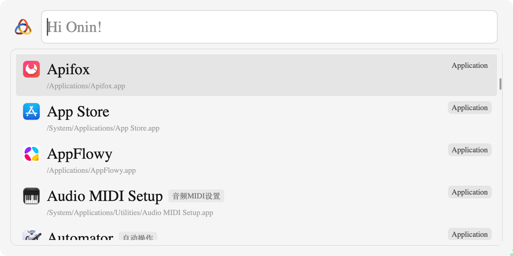

<div align="center">
  
  <h1>Onin</h1>
  <p>
    <b>专为开发者和高效用户打造的键盘启动器</b>
  </p>
  <p>
    
    
  </p>
  <p>
    <a href="README.md">🇬🇧 English</a>
  </p>
</div>

<div align="center">
  
</div>

<br/>

## 简介

**Onin** 是一款专为提升效率而生的现代化生产力工具。深受 Raycast 和 uTools 的启发，Onin 提供了一个极速、可扩展的界面，让你可以快速启动应用、搜索文件和执行命令，全程无需离开键盘。基于 **Tauri** 和 **SvelteKit** 构建，它完美融合了 Rust 的极致性能与现代 Web 技术的灵活性。

Onin 不仅仅是一个启动器，更是一个平台。通过强大的 **插件 SDK**，开发者可以无限扩展其能力，打造最适合自己的工作流。

## 📥 下载

[**从 GitHub Releases 下载最新版本**](https://github.com/b-yp/Onin/releases)

### ⚠️ macOS 用户必读

如果您在打开应用时遇到 **“Onin 已损坏，无法打开”** 的提示：


这是由于应用未经过 Apple 签名导致的常见问题。要解决此问题，请在终端中运行以下命令：

```bash
xattr -cr /Applications/Onin.app
```
*(注意：请先将应用移动到您的 `应用程序` 文件夹，或根据实际路径调整命令)*

### ✨ 核心特性

- ⚡ **极速响应** — Rust 与 Tauri 驱动的原生级性能
- 🔌 **无限扩展** — 支持任意 Web 技术开发插件（React、Vue、Svelte 等）
- 🎨 **精美设计** — 现代化界面，流畅动画体验
- ⌨️ **键盘优先** — 所有操作仅需指尖轻触
- 🛠️ **开发友好** — 简单易用的 SDK，轻松构建自定义扩展

---

## 🚀 快速开始

### 环境要求

- Node.js >= 18
- pnpm >= 8
- Rust (最新稳定版)

### 安装与开发

```bash
# 安装依赖
pnpm install

# 开发运行
pnpm dev              # Web 开发模式 (http://localhost:1420)
pnpm tauri dev        # 桌面应用（首次编译需 3-10 分钟）
pnpm dev:demo         # SDK Demo (http://localhost:5174)
```

### 构建打包

```bash
pnpm build            # 构建所有包
pnpm build:sdk        # 只构建 SDK
```

---

## 📁 项目结构

本项目采用 pnpm workspace 管理的 **Monorepo** 架构：

```
packages/
├── app/              # 主应用 (Tauri + SvelteKit)
│   └── docs/         # 应用文档
├── sdk/              # 插件 SDK (发布为 onin-sdk)
│   ├── docs/         # SDK 文档
│   └── examples/     # 使用示例
└── demo/             # SDK 测试项目
```

---

## 📖 文档

| 主题     | 链接                                                                     |
| -------- | ------------------------------------------------------------------------ |
| API 文档 | [API.md](packages/app/docs/API.md)                                       |
| 插件系统 | [PLUGIN_COMMAND_USAGE.md](packages/app/docs/PLUGIN_COMMAND_USAGE.md)     |
| 窗口管理 | [WINDOW_LIFECYCLE_FINAL.md](packages/app/docs/WINDOW_LIFECYCLE_FINAL.md) |
| SDK 指南 | [SDK README](packages/sdk/README.md)                                     |

---

## 📄 开源协议

[MIT](LICENSE)
