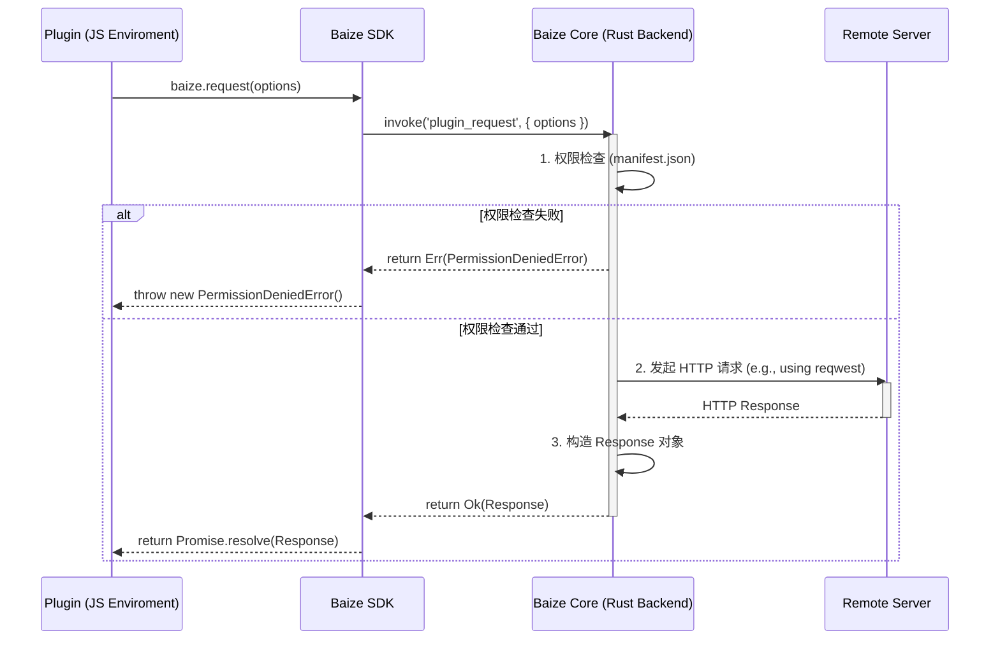

# baize.request API 设计方案

本文档详细描述了 `baize.request` API 的设计方案，涵盖了接口定义、权限控制、实现策略和错误处理等方面。

## 1. API 接口定义 (TypeScript)

为了提供一个功能强大且类型安全的网络请求 API，我们定义了以下接口和类型。这些定义将被包含在 `plugins-sdk` 中，供插件开发者使用。

```typescript
// plugins-sdk/src/network.ts

/**
 * 定义支持的 HTTP 请求方法
 */
export type HttpMethod = 'GET' | 'POST' | 'PUT' | 'DELETE' | 'PATCH' | 'HEAD' | 'OPTIONS';

/**
 * 定义期望的响应体类型
 */
export type ResponseType = 'json' | 'text' | 'arraybuffer';

/**
 * 定义请求体允许的类型
 * - string: 例如 URL-encoded 字符串
 * - ArrayBuffer: 二进制数据
 * - Record<string, any>: 将被自动序列化为 JSON 字符串
 */
export type RequestBody = string | ArrayBuffer | Record<string, any>;

/**
 * baize.request 的请求参数选项
 */
export interface RequestOptions {
  /**
   * 请求的 URL
   */
  url: string;

  /**
   * HTTP 请求方法，默认为 'GET'
   */
  method?: HttpMethod;

  /**
   * HTTP 请求头对象
   */
  headers?: Record<string, string>;

  /**
   * 请求体，仅在 'POST', 'PUT', 'PATCH' 等方法中有效
   */
  body?: RequestBody;

  /**
   * 请求超时时间（毫秒），默认为 30000 (30秒)
   */
  timeout?: number;

  /**
   * 期望的响应体格式，默认为 'json'
   * 这将决定 Response.body 的最终类型
   */
  responseType?: ResponseType;
}

/**
 * baize.request 的响应对象
 * @template T 响应体的具体类型，由 RequestOptions.responseType 决定
 */
export interface Response<T = any> {
  /**
   * HTTP 状态码
   */
  readonly status: number;

  /**
   * HTTP 状态文本
   */
  readonly statusText: string;

  /**
   * HTTP 响应头
   */
  readonly headers: Record<string, string>;

  /**
   * 响应体
   * - 如果 responseType 为 'json'，则为解析后的 JavaScript 对象
   * - 如果 responseType 为 'text'，则为字符串
   * - 如果 responseType 为 'arraybuffer'，则为 ArrayBuffer
   */
  readonly body: T;
}

/**
 * Baize 网络请求 API
 *
 * @example
 * ```ts
 * // 发起一个 GET 请求
 * const response = await baize.request({
 *   url: 'https://api.example.com/data',
 *   method: 'GET',
 * });
 * console.log(response.body);
 *
 * // 发起一个 POST 请求
 * const postResponse = await baize.request({
 *   url: 'https://api.example.com/users',
 *   method: 'POST',
 *   body: { name: 'Baize' }
 * });
 * console.log(postResponse.status);
 * ```
 */
export declare function request<T = any>(options: RequestOptions): Promise<Response<T>>;

```

## 2. 权限控制模型

为了确保用户安全和数据隐私，插件的网络请求将受到严格的权限控制。插件必须在其 `manifest.json` 文件中明确声明需要访问的网络域名。

### 2.1. `manifest.json` 权限声明

在插件的 `manifest.json` 文件中，新增一个顶层的 `permissions` 字段，用于管理各类权限。HTTP 权限采用对象结构，提供更灵活的配置选项。

- **`permissions.http`**: HTTP 权限配置对象
  - `enable`: 布尔值，是否启用 HTTP 权限
  - `allowUrls`: 字符串数组，包含所有允许访问的域名或域名模式
  - `timeout`: 可选，请求超时时间（毫秒）
  - `maxRetries`: 可选，最大重试次数

**示例 `manifest.json`:**

```json
{
  "id": "com.example.my-plugin",
  "name": "My Awesome Plugin",
  "version": "1.0.0",
  "description": "A plugin that fetches data from APIs.",
  "entry": "dist/index.js",
  "permissions": {
    "http": {
      "enable": true,
      "allowUrls": [
        "https://api.example.com",
        "https://*.github.com",
        "https://raw.githubusercontent.com"
      ],
      "timeout": 30000,
      "maxRetries": 3
    },
    "storage": {
      "enable": true,
      "local": true,
      "session": false
    },
    "notification": {
      "enable": true,
      "sound": true,
      "badge": false
    }
  }
}
```

### 2.2. 权限匹配规则

- **精确匹配**: 声明 `https://api.example.com` 将允许访问该域名下的所有路径，例如 `https://api.example.com/users/123`。
- **通配符匹配**:
    - `*` 通配符仅能用于域名的开头，代表任意单个子域名。
    - 例如，`https://*.github.com` 会匹配 `https://api.github.com` 和 `https://gist.github.com`，但 **不会** 匹配 `https://github.com` 或 `https://sub.api.github.com`。
- **协议必须声明**: 必须明确指定 `http://` 或 `https://`。
- **端口支持**: 如果服务使用非标准端口，也需要在声明中包含，例如 `http://localhost:8080`。

### 2.3. 权限检查流程

权限检查的核心逻辑将在 Rust 后端实现，以保证其无法被绕过。

1.  **API 调用**: 插件的 JavaScript 代码调用 `baize.request(options)`。
2.  **请求转发**: 请求通过 Tauri `invoke` 机制被发送到 Rust 后端。
3.  **权限验证**: 在 Rust 后端，执行以下步骤：
    a.  根据当前插件的 ID，加载其 `manifest.json` 文件。
    b.  解析 `permissions.http` 对象，检查 `enable` 状态。
    c.  获取请求 `options.url`，并将其与 `allowUrls` 数组中的所有规则进行逐一匹配。
4.  **处理结果**:
    - **匹配成功**: Rust 后端继续执行实际的网络请求，并将结果返回给插件。
    - **匹配失败**: Rust 后端将立即拒绝请求，并向 JavaScript 环境返回一个 `PermissionDeniedError` 错误，其中应包含请求的 URL 和权限不足的明确信息。

## 3. 跨环境实现策略

`baize.request` API 的设计旨在抹平 Headless (Deno) 和 Webview (浏览器) 两种插件运行环境的差异。核心策略是将所有网络请求统一转发到 Rust 后端进行处理，从而绕过环境限制（如 CORS）并集中实施安全策略。

### 3.1. 统一的 JavaScript SDK

`plugins-sdk` 将为插件开发者提供一个统一的 `baize.request` 函数。SDK 内部会通过适配器模式自动处理不同环境下的调用方式。

- **Webview 环境**: 在 Webview 中，`request` 函数的内部实现将直接使用 `@tauri-apps/api` 包提供的 `invoke` 函数，将请求参数发送到 Rust 后端。
- **Headless 环境**: 在 Deno 运行时中，Baize 核心会向 JavaScript 全局上下文注入一个 `Baize.invoke` 函数。SDK 中的 `request` 函数会调用这个全局函数，其底层通信机制与 Tauri 的 `invoke` 类似。

### 3.2. Rust 后端核心处理器

所有请求最终都会到达 Rust 后端的一个 Tauri command，例如 `plugin_request`。这个 command 是整个功能的核心，负责处理所有逻辑。

**处理流程图 (Mermaid):**



### 3.3. 核心优势

- **绕过 CORS**: 由于实际的网络请求是由 Rust 服务端发起的，因此不存在浏览器的同源策略（CORS）限制，插件可以自由请求任何（已授权的）第三方 API。
- **安全可控**: 权限控制逻辑集中在后端，插件无法通过任何方式绕过。
- **性能与功能**: 可以利用 Rust 成熟的生态库（如 `reqwest`）来提供高性能、功能全面的 HTTP 请求能力，支持流式传输、连接池等高级特性。
- **代码一致性**: 插件开发者只需学习一套 API，无需关心底层环境的具体实现。

## 4. 错误处理

为了向插件开发者提供清晰、可预测的错误信息，`baize.request` API 将定义一套具体的错误类型。所有错误都将继承自一个基础的 `BaizeRequestError` 类。

### 4.1. 错误类型定义 (TypeScript)

这些错误类型将在 `plugins-sdk` 中定义，使用函数式编程风格，以便开发者可以在代码中通过类型检查函数进行精确的错误判断。

```typescript
// plugins-sdk/src/network.ts (续)

/**
 * 所有 baize.request API 错误的基础接口
 */
export interface BaizeRequestError extends Error {
  name: 'BaizeRequestError';
}

/**
 * 当请求的 URL 未在 manifest.json 中声明时的错误
 */
export interface PermissionDeniedError extends Error {
  name: 'PermissionDeniedError';
  url: string;
}

/**
 * 当请求超时时的错误
 */
export interface TimeoutError extends Error {
  name: 'TimeoutError';
  url: string;
  timeout: number;
}

/**
 * 当发生底层网络错误时的错误 (例如 DNS 解析失败, TCP 连接失败)
 */
export interface NetworkError extends Error {
  name: 'NetworkError';
}

/**
 * 当服务器返回非 2xx 状态码时的错误
 * 这表示请求已成功发送并收到响应，但响应表示一个错误状态
 */
export interface HttpError extends Error {
  name: 'HttpError';
  response: Response;
}

// 错误工厂函数
export function createBaizeRequestError(message: string): BaizeRequestError;
export function createPermissionDeniedError(url: string, message?: string): PermissionDeniedError;
export function createTimeoutError(url: string, timeout: number, message?: string): TimeoutError;
export function createNetworkError(message: string): NetworkError;
export function createHttpError(response: Response): HttpError;

// 类型检查函数
export function isBaizeRequestError(error: any): error is BaizeRequestError;
export function isPermissionDeniedError(error: any): error is PermissionDeniedError;
export function isTimeoutError(error: any): error is TimeoutError;
export function isNetworkError(error: any): error is NetworkError;
export function isHttpError(error: any): error is HttpError;
```

### 4.2. 错误处理流程

1.  **Rust 端**: Rust 后端在遇到错误时（如权限、超时、网络问题），会构造一个包含错误类型标识（如 `name`）和详细信息（如 `message`, `url`）的结构体，并将其作为 `Err` 结果返回。
2.  **SDK 端**: `plugins-sdk` 在接收到来自 `invoke` 的 `Err` 结果后，会检查错误类型标识，并使用相应的工厂函数创建错误对象。
3.  **插件端**: 插件开发者可以使用 `try...catch` 块来捕获这些错误，并通过类型检查函数判断具体的错误类型，从而实现精细化的错误处理逻辑。

**示例用法:**

```typescript
import { 
  request, 
  isHttpError, 
  isTimeoutError, 
  isPermissionDeniedError,
  isNetworkError 
} from 'baize-plugin-sdk';

async function fetchData() {
  try {
    const response = await request({
      url: 'https://api.example.com/protected-data',
      timeout: 5000,
    });
    return response.body;
  } catch (error) {
    if (isHttpError(error)) {
      // 处理服务器错误，例如 401, 404, 500
      console.error(`HTTP Error: ${error.response.status}`, error.response.body);
    } else if (isTimeoutError(error)) {
      // 处理超时，可以进行重试
      console.error(`Request timed out: ${error.message}`);
    } else if (isPermissionDeniedError(error)) {
      // 提醒开发者检查 manifest.json
      console.error(error.message);
    } else if (isNetworkError(error)) {
      // 处理网络错误
      console.error('Network error:', error.message);
    } else {
      // 处理其他未知错误
      console.error('An unexpected error occurred:', error);
    }
  }
}
```
