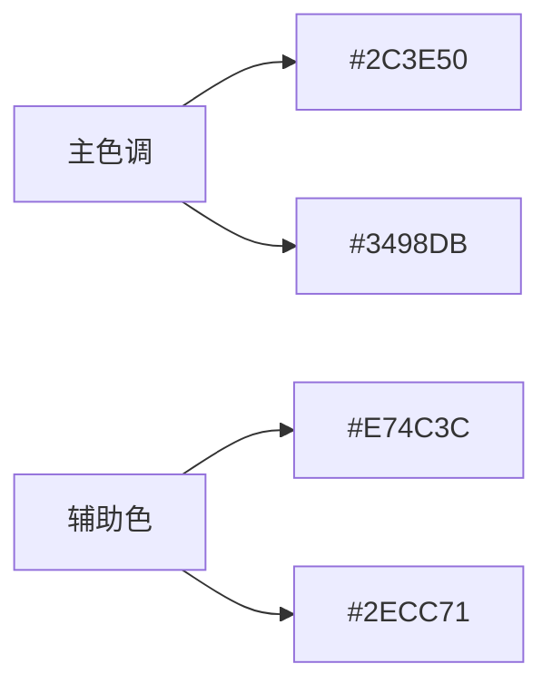
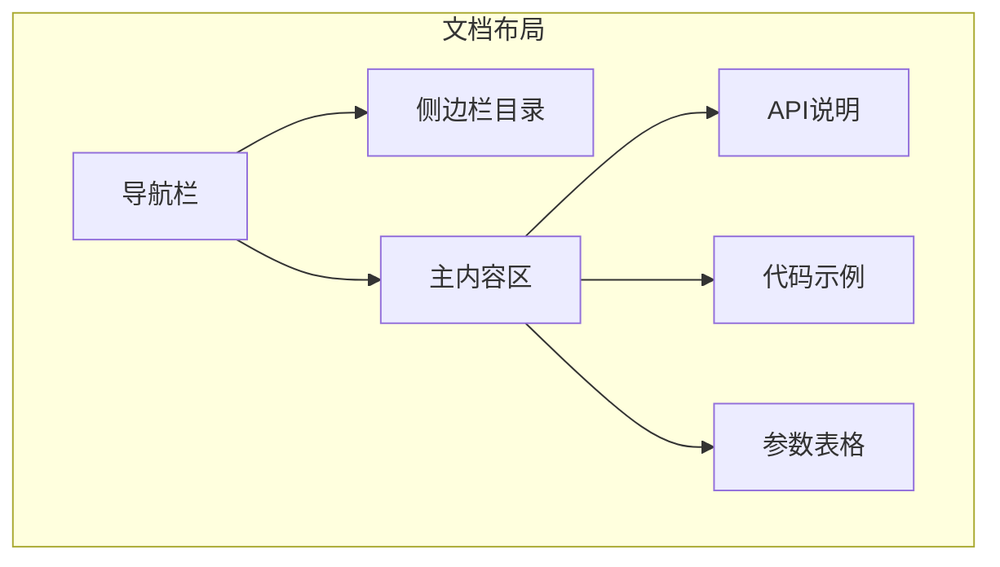

# 文档主题设计方案

## 1. 设计目标
- 保持与Baize品牌一致
- 提供优秀的阅读体验
- 支持响应式布局
- 增强API文档的可发现性

## 2. 视觉设计

## 3. 布局结构

## 4. 功能特性
- **实时搜索**: 全局API搜索
- **暗黑模式**: 支持系统偏好设置
- **代码交互**: 可运行的代码示例
- **版本切换**: 多版本文档支持

## 5. 实现方案
1. 基于TypeDoc默认主题扩展
2. 自定义CSS变量
3. 添加搜索增强插件
4. 集成代码高亮