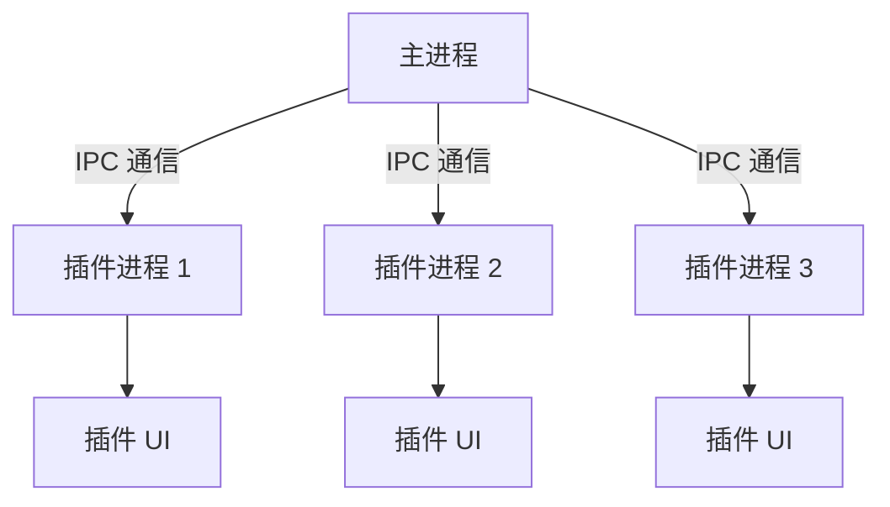

# 插件系统设计方案

## 1. 系统架构



- **主进程**：Tauri Rust 后端，负责核心功能和安全控制
- **插件进程**：独立的 Webview 进程，运行插件代码
- **IPC 通信**：安全的进程间通信机制

## 2. API 设计

### 核心 API 接口

```typescript
// src/lib/plugin_api.ts
interface PluginAPI {
  // UI 相关
  showNotification(title: string, message: string): void;
  registerCommand(command: string, handler: Function): void;
  
  // 数据存储
  getConfig(key: string): Promise<any>;
  setConfig(key: string, value: any): Promise<void>;
  
  // 系统访问
  readFile(path: string): Promise<string>;
  writeFile(path: string, content: string): Promise<void>;
  executeCommand(command: string): Promise<string>;
  
  // 应用功能
  searchApps(query: string): Promise<AppInfo[]>;
  launchApp(appId: string): Promise<void>;
}
```

### 权限控制模型

```json
// 插件 manifest.json 中的权限声明
{
  "permissions": [
    "filesystem:read",
    "filesystem:write",
    "system:commands",
    "app:search",
    "app:launch"
  ]
}
```

## 3. 插件开发规范

### 插件目录结构
```
my-plugin/
├── manifest.json
├── index.html
├── main.js
└── styles.css
```

### manifest.json 示例
```json
{
  "id": "com.example.myplugin",
  "name": "我的插件",
  "version": "1.0.0",
  "description": "示例插件",
  "entry": "index.html",
  "permissions": ["app:search"],
  "dependencies": {
    "com.example.commonlib": "^2.0.0"
  }
}
```

## 4. 安全机制

1. **沙箱环境**：每个插件运行在独立的 Webview 进程中
2. **权限控制**：插件需声明所需权限，用户安装时授权
3. **内容安全策略**：限制插件访问外部资源
4. **签名验证**：所有插件必须经过数字签名验证

## 5. 安装与管理流程

1. 用户下载插件包 (.zip)
2. 系统验证插件签名
3. 显示权限请求对话框
4. 用户确认安装后，插件解压到 `plugins/` 目录
5. 主进程加载插件并初始化

## 6. 通信协议

```rust
// src-tauri/src/plugin_ipc.rs
#[derive(Serialize, Deserialize)]
enum PluginMessage {
    Request {
        plugin_id: String,
        method: String,
        params: Value,
        callback_id: u64,
    },
    Response {
        callback_id: u64,
        result: Result<Value, String>,
    },
}
```

## 7. 插件开发和安装

### 开发

1.  创建一个包含 `manifest.json`、`index.html` 和其他所需资源的目录。
2.  在 `manifest.json` 中，定义插件的元数据和权限。
3.  在 HTML 和 JavaScript 文件中，实现插件的 UI 和逻辑。
4.  使用 `window.__PLUGIN_API__` 对象来与主应用进行交互。

### 安装

1.  将插件目录压缩成一个 `.zip` 文件。
2.  在应用的插件管理界面，点击“安装插件”按钮。
3.  选择你创建的 `.zip` 文件。
4.  应用将自动解压并加载插件。

## 8. 示例插件

我们提供了一个简单的示例插件，演示了如何使用 `readFile` API。该插件的源代码位于 `example-plugin` 目录中，并且已经打包为 `example-plugin.zip`。